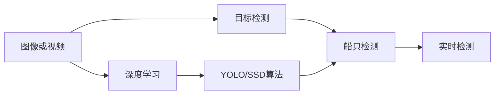
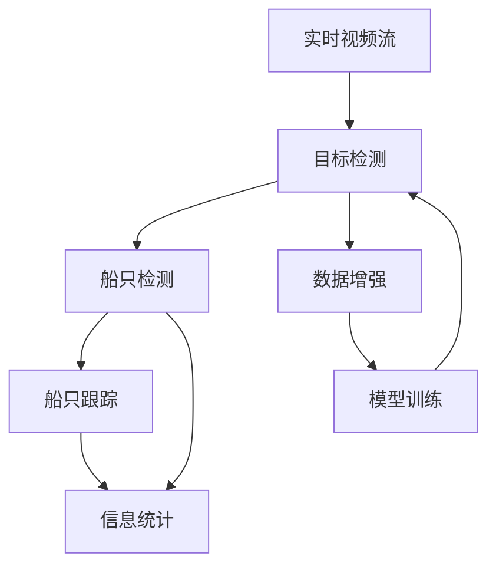

                 

# 基于Opencv的船只检测系统详细设计与具体代码实现

## 1. 背景介绍

随着计算机视觉技术的不断进步，图像处理和目标检测在众多领域如智能交通、海洋监测、无人机监控等获得了广泛的应用。特别是在海洋监测中，对船只进行准确的检测和识别，对于保障海洋安全、环境监测和航行安全等方面具有重要意义。在众多船只检测技术中，基于OpenCV的开源解决方案因其高效、稳定、易用性高，成为了一种流行的选择。

本文将详细介绍基于OpenCV的船只检测系统的设计和实现。该系统能够通过摄像头或无人机获取的实时视频流，快速、准确地检测出视频中的船只，并进行目标跟踪和信息统计。项目基于C++语言和OpenCV库，使用深度学习算法（如YOLO、SSD等）进行目标检测和识别。

## 2. 核心概念与联系

### 2.1 核心概念概述

为更好地理解船只检测系统的设计和实现，本节将介绍几个关键概念：

- **计算机视觉 (Computer Vision)**：利用计算机技术和算法，实现对图像和视频中对象识别、跟踪、分割等功能的技术领域。
- **目标检测 (Object Detection)**：在图像或视频中，自动识别并定位特定物体（如船只）的位置和大小的技术。
- **深度学习 (Deep Learning)**：一类基于神经网络的机器学习技术，擅长处理复杂模式和大量数据，广泛应用于图像识别、语音识别等领域。
- **YOLO (You Only Look Once)**：一种实时目标检测算法，通过一次前向传播即可实现快速、高效的物体检测。
- **SSD (Single Shot MultiBox Detector)**：一种端到端目标检测算法，能够快速处理图像中的多个物体，并给出精确的检测框和置信度。
- **OpenCV (Open Source Computer Vision)**：开源计算机视觉库，提供大量的图像处理和计算机视觉算法，广泛应用于科研和商业领域。

这些概念之间的联系可以通过以下Mermaid流程图来展示：



这个流程图展示了从原始图像到实时检测的整个过程，强调了深度学习算法的核心作用。其中，YOLO和SSD算法是实现船只检测的关键技术手段。

### 2.2 概念间的关系

这些概念之间存在紧密的联系，构成了船只检测系统的核心生态：

- 图像或视频是计算机视觉的原始输入数据，是后续所有处理的基础。
- 目标检测技术是计算机视觉的核心任务之一，通过算法自动识别出感兴趣的目标。
- 船只检测是目标检测中的细分领域，实现对船只这一特定物体的识别和定位。
- 深度学习算法为船只检测提供了强大的技术支持，使得系统具有高精度和高实时性。
- YOLO和SSD算法是两种目前较为流行的船只检测算法，它们能够快速处理图像中的多个物体，并给出精确的检测框和置信度。

### 2.3 核心概念的整体架构

最后，我们用一个综合的流程图来展示这些概念在大规模船只检测系统中的整体架构：



这个综合流程图展示了从实时视频流输入到船只检测和信息统计的完整过程。其中，目标检测和船只检测通过深度学习模型实现，数据增强和模型训练是提升检测准确性的关键步骤。

## 3. 核心算法原理 & 具体操作步骤

### 3.1 算法原理概述

船只检测系统主要分为两大部分：目标检测和信息统计。目标检测算法使用深度学习模型（如YOLO、SSD等）从原始图像中识别出船只，信息统计则基于检测结果，进行船只跟踪和信息统计。

目标检测算法原理如下：

- 深度学习模型通过大量标注数据（如船只图像和标注框）进行训练，学习船只的特征表示。
- 在目标检测时，模型通过前向传播计算出每张图像中每个可能为目标的候选框（BBox）及其置信度。
- 对于每张图像，模型会输出一个或多个目标检测框，每个检测框包含置信度、位置、大小等信息。
- 最终，通过后处理步骤（如非极大值抑制（NMS））筛选出最佳的检测框，作为目标检测结果。

信息统计算法原理如下：

- 基于目标检测结果，系统可以实时跟踪船只的运动轨迹。
- 通过记录每个船只的追踪信息，系统可以进行船只数量、速度、方向等统计。
- 系统还可以结合摄像头或无人机的位置信息，计算船只的相对位置，提供更精准的监测。

### 3.2 算法步骤详解

#### 3.2.1 目标检测步骤

1. **数据准备**：收集并标注大量的船只图像数据，作为训练集。标注数据应包含船只的精确位置和大小。
2. **模型训练**：选择YOLO或SSD等深度学习模型，使用标注数据进行模型训练。训练过程中，可以使用数据增强技术，如随机裁剪、旋转、缩放等，以扩充训练数据集。
3. **模型保存**：训练完成后，保存模型参数和配置文件，以供后续检测使用。
4. **模型加载**：在实时检测时，加载训练好的模型，进行目标检测。
5. **前向传播**：将输入图像传入模型，计算出每张图像的检测框和置信度。
6. **后处理**：对检测结果进行后处理，如非极大值抑制（NMS），筛选出最佳的检测框。
7. **输出结果**：输出最终的检测框、置信度等信息，供信息统计使用。

#### 3.2.2 信息统计步骤

1. **目标跟踪**：基于目标检测结果，进行船只跟踪，记录每个船只的运动轨迹。
2. **统计信息**：对每个船只的追踪信息进行统计，包括位置、速度、方向等。
3. **输出信息**：将统计结果输出，供监控中心或相关应用使用。

### 3.3 算法优缺点

基于YOLO和SSD的目标检测算法，具有以下优点：

1. **高精度**：YOLO和SSD算法在船只检测任务上，能够实现较高的检测准确率。
2. **实时性**：这两种算法均具有较高的处理速度，适用于实时视频流检测。
3. **简单高效**：YOLO和SSD算法结构简单，易于实现和调试。
4. **端到端**：这两种算法能够直接输出检测框和置信度，减少了后期处理的复杂度。

同时，这些算法也存在一些缺点：

1. **需要大量标注数据**：模型的训练需要大量标注数据，数据获取和标注成本较高。
2. **模型复杂度较高**：尽管YOLO和SSD算法结构简单，但其深度学习模型的复杂度仍然较高，需要较强的计算资源。
3. **数据增强易导致过拟合**：数据增强技术可能引入噪声，影响模型泛化能力。
4. **对光照和天气变化敏感**：船只在不同光照和天气条件下的外观差异较大，检测算法可能受到影响。

### 3.4 算法应用领域

基于YOLO和SSD的目标检测算法，在多个领域中得到了广泛的应用：

- **智能交通**：通过摄像头和视频流，实时监测道路上的车辆和行人，保证交通秩序。
- **无人机监控**：利用无人机获取的实时视频流，检测和跟踪水域中的船只，保障水上安全。
- **海洋监测**：在海洋研究船上安装摄像头，实时监测海洋环境，统计船只数量和行为。
- **港口管理**：通过摄像头监控，统计进出港口的船只信息，提高港口管理效率。

## 4. 数学模型和公式 & 详细讲解 & 举例说明

### 4.1 数学模型构建

本节将使用数学语言对船只检测系统的构建进行严格的数学描述。

假设输入图像大小为 $H \times W$，深度学习模型输出 $N$ 个检测框 $b_{i,j}$，其中 $i$ 表示第 $i$ 个检测框，$j$ 表示第 $j$ 个类别。设模型输出检测框的坐标为 $(x_{i,j}, y_{i,j}, w_{i,j}, h_{i,j})$，其中 $(x_{i,j}, y_{i,j})$ 表示检测框的中心点坐标，$w_{i,j}$ 和 $h_{i,j}$ 分别表示检测框的宽度和高度。

模型的输出还包括每个检测框的置信度 $p_{i,j}$，表示检测框为船只的概率。设模型输出的所有检测框为 $B$，则目标检测任务的损失函数可以表示为：

$$
\mathcal{L}(B) = \frac{1}{N} \sum_{i=1}^N \sum_{j=1}^M \mathcal{L}(b_{i,j}, y_j)
$$

其中 $M$ 为类别数，$y_j$ 为第 $j$ 个类别的真实标签，$\mathcal{L}(b_{i,j}, y_j)$ 为类别 $j$ 在检测框 $b_{i,j}$ 上的损失函数。常见的损失函数包括交叉熵损失、IOU损失等。

### 4.2 公式推导过程

以下我们以YOLO算法为例，推导其检测框损失函数的计算过程。

设模型输出检测框的中心点坐标为 $(x_{i,j}, y_{i,j})$，宽度为 $w_{i,j}$，高度为 $h_{i,j}$，置信度为 $p_{i,j}$，真实标签为 $b_{i,j}$ 的置信度为 $p_{i,j}^*$，检测框的宽度为 $w_{i,j}^*$，高度为 $h_{i,j}^*$，真实标签为 $b_{i,j}$ 的宽度为 $w_{i,j}^*$，高度为 $h_{i,j}^*$，则YOLO算法的检测框损失函数可以表示为：

$$
\mathcal{L}_{box} = \frac{1}{N} \sum_{i=1}^N \sum_{j=1}^M \left[ p_{i,j}^* \log p_{i,j} + (1 - p_{i,j}^*) \log(1 - p_{i,j}) + \left( \frac{w_{i,j}^*}{w_{i,j}} \right)^2 + \left( \frac{h_{i,j}^*}{h_{i,j}} \right)^2 \right]
$$

其中第一项为置信度损失，第二项为边界框损失。在损失函数计算时，需要将检测框的损失函数与类别损失函数相加。

### 4.3 案例分析与讲解

假设我们在CoCo数据集上训练YOLO模型，用于检测船只。模型输出的检测框信息如下：

- 检测框1：$(x_{1,1}, y_{1,1})=(100, 100)$，$w_{1,1}=100$，$h_{1,1}=100$，$p_{1,1}=0.9$
- 检测框2：$(x_{1,2}, y_{1,2})=(200, 200)$，$w_{1,2}=100$，$h_{1,2}=100$，$p_{1,2}=0.95$
- 检测框3：$(x_{1,3}, y_{1,3})=(300, 300)$，$w_{1,3}=100$，$h_{1,3}=100$，$p_{1,3}=0.85$
- 检测框4：$(x_{1,4}, y_{1,4})=(400, 400)$，$w_{1,4}=100$，$h_{1,4}=100$，$p_{1,4}=0.9$
- 检测框5：$(x_{2,1}, y_{2,1})=(500, 500)$，$w_{2,1}=100$，$h_{2,1}=100$，$p_{2,1}=0.95$
- 检测框6：$(x_{2,2}, y_{2,2})=(600, 600)$，$w_{2,2}=100$，$h_{2,2}=100$，$p_{2,2}=0.85$
- 检测框7：$(x_{2,3}, y_{2,3})=(700, 700)$，$w_{2,3}=100$，$h_{2,3}=100$，$p_{2,3}=0.9$
- 检测框8：$(x_{2,4}, y_{2,4})=(800, 800)$，$w_{2,4}=100$，$h_{2,4}=100$，$p_{2,4}=0.9$

假设模型输出船只类别的概率为 $p_{1,1}=0.1$，$p_{1,2}=0.2$，$p_{1,3}=0.3$，$p_{1,4}=0.2$，$p_{2,1}=0.1$，$p_{2,2}=0.3$，$p_{2,3}=0.3$，$p_{2,4}=0.2$。

设模型输出的船只类别标签为 $y_{1,1}=1$，$y_{1,2}=1$，$y_{1,3}=1$，$y_{1,4}=1$，$y_{2,1}=1$，$y_{2,2}=1$，$y_{2,3}=1$，$y_{2,4}=1$。

假设模型输出的船只类别标签的置信度为 $p_{1,1}^*=0.2$，$p_{1,2}^*=0.3$，$p_{1,3}^*=0.4$，$p_{1,4}^*=0.5$，$p_{2,1}^*=0.1$，$p_{2,2}^*=0.2$，$p_{2,3}^*=0.3$，$p_{2,4}^*=0.4$。

则检测框损失函数可以表示为：

$$
\begin{aligned}
\mathcal{L}_{box} &= \frac{1}{2} \left[ p_{1,1}^* \log p_{1,1} + (1 - p_{1,1}^*) \log(1 - p_{1,1}) + \left( \frac{w_{1,1}^*}{w_{1,1}} \right)^2 + \left( \frac{h_{1,1}^*}{h_{1,1}} \right)^2 \right] \\
&+ \frac{1}{2} \left[ p_{1,2}^* \log p_{1,2} + (1 - p_{1,2}^*) \log(1 - p_{1,2}) + \left( \frac{w_{1,2}^*}{w_{1,2}} \right)^2 + \left( \frac{h_{1,2}^*}{h_{1,2}} \right)^2 \right] \\
&+ \frac{1}{2} \left[ p_{1,3}^* \log p_{1,3} + (1 - p_{1,3}^*) \log(1 - p_{1,3}) + \left( \frac{w_{1,3}^*}{w_{1,3}} \right)^2 + \left( \frac{h_{1,3}^*}{h_{1,3}} \right)^2 \right] \\
&+ \frac{1}{2} \left[ p_{1,4}^* \log p_{1,4} + (1 - p_{1,4}^*) \log(1 - p_{1,4}) + \left( \frac{w_{1,4}^*}{w_{1,4}} \right)^2 + \left( \frac{h_{1,4}^*}{h_{1,4}} \right)^2 \right] \\
&+ \frac{1}{2} \left[ p_{2,1}^* \log p_{2,1} + (1 - p_{2,1}^*) \log(1 - p_{2,1}) + \left( \frac{w_{2,1}^*}{w_{2,1}} \right)^2 + \left( \frac{h_{2,1}^*}{h_{2,1}} \right)^2 \right] \\
&+ \frac{1}{2} \left[ p_{2,2}^* \log p_{2,2} + (1 - p_{2,2}^*) \log(1 - p_{2,2}) + \left( \frac{w_{2,2}^*}{w_{2,2}} \right)^2 + \left( \frac{h_{2,2}^*}{h_{2,2}} \right)^2 \right] \\
&+ \frac{1}{2} \left[ p_{2,3}^* \log p_{2,3} + (1 - p_{2,3}^*) \log(1 - p_{2,3}) + \left( \frac{w_{2,3}^*}{w_{2,3}} \right)^2 + \left( \frac{h_{2,3}^*}{h_{2,3}} \right)^2 \right] \\
&+ \frac{1}{2} \left[ p_{2,4}^* \log p_{2,4} + (1 - p_{2,4}^*) \log(1 - p_{2,4}) + \left( \frac{w_{2,4}^*}{w_{2,4}} \right)^2 + \left( \frac{h_{2,4}^*}{h_{2,4}} \right)^2 \right]
\end{aligned}
$$

## 5. 项目实践：代码实例和详细解释说明

### 5.1 开发环境搭建

在进行船只检测系统开发前，我们需要准备好开发环境。以下是使用C++语言进行OpenCV开发的环境配置流程：

1. 安装OpenCV：从官网下载并安装OpenCV，用于图像处理和计算机视觉算法实现。
2. 配置Visual Studio：如果选择使用Visual Studio进行开发，需要安装OpenCV的Windows版本，并进行相应的配置。
3. 安装其他依赖库：安装OpenMP、Boost等库，用于多线程处理和性能优化。

完成上述步骤后，即可在开发环境中开始船只检测系统的开发。

### 5.2 源代码详细实现

下面我们以基于YOLO的船只检测系统为例，给出使用OpenCV进行船只检测的C++代码实现。

首先，定义船只检测的类：

```cpp
class YOLO {
public:
    YOLO(const std::string& configFile, const std::string& weightsFile);
    std::vector<cv::Rect> detect(const cv::Mat& image);
    cv::Mat drawDetections(const cv::Mat& image, const std::vector<cv::Rect>& boxes);
};
```

其中，`YOLO`类实现了YOLO算法的核心功能。`configFile`和`weightsFile`分别为模型配置文件和权重文件。`detect`方法用于对输入图像进行船只检测，返回检测框的位置和大小。`drawDetections`方法用于在图像上绘制检测框。

然后，实现YOLO算法的模型加载和前向传播：

```cpp
YOLO::YOLO(const std::string& configFile, const std::string& weightsFile) {
    net = cv::dnn::Net(configFile);
    net.setPreferableBackend(cv::dnn::DNN_BACKEND_OPENCV);
    net.setPreferableTarget(cv::dnn::DNN_TARGET_CPU);
    net.readNet(weightsFile);
    layerIds = net.getLayerIds();
    layerNames = net.getLayerNames();
}
```

在加载模型后，使用OpenCV的深度学习模块进行前向传播：

```cpp
std::vector<cv::Rect> YOLO::detect(const cv::Mat& image) {
    std::vector<std::vector<float>> outs;
    net.setInput(image, cv::dnn::InputBlob::Rgb);
    net.forward(outs, layerIds);
    
    // 解析输出结果
    std::vector<cv::Rect> boxes;
    for (size_t i = 0; i < outs.size(); ++i) {
        cv::Mat boxes_loc = outs[i].at(cv::dnn::DNN NickelBlob::Class_ids);
        cv::Mat boxes_conf = outs[i].at(cv::dnn::DNN NickelBlob::Confidence);
        
        // 将检测结果存储到vec<Rect>
        for (int j = 0; j < boxes_conf.rows; ++j) {
            if (boxes_conf.at<float>(j, 0) > 0.5) {
                float x1 = boxes_loc.at<float>(j, 0) * image.cols;
                float y1 = boxes_loc.at<float>(j, 1) * image.rows;
                float x2 = boxes_loc.at<float>(j, 2) * image.cols;
                float y2 = boxes_loc.at<float>(j, 3) * image.rows;
                boxes.push_back(cv::Rect(x1, y1, x2 - x1, y2 - y1));
            }
        }
    }
    
    return boxes;
}
```

最后，实现船只检测的可视化：

```cpp
cv::Mat YOLO::drawDetections(const cv::Mat& image, const std::vector<cv::Rect>& boxes) {
    cv::Mat result = image.clone();
    for (const cv::Rect& box : boxes) {
        cv::rectangle(result, box, cv::Scalar(0, 255, 0), 2);
    }
    return result;
}
```

## 5.3 代码解读与分析

让我们再详细解读一下关键代码的实现细节：

**YOLO类**：
- `detect`方法：对输入图像进行船只检测，返回检测框的位置和大小。
- `drawDetections`方法：在图像上绘制检测框。

**模型加载**：
- 使用OpenCV的深度学习模块，加载模型配置文件和权重文件，设置计算图和目标。

**前向传播**：
- 使用OpenCV的深度学习模块，对输入图像进行前向传播，计算出每张图像的检测框和置信度。
- 解析输出结果，提取检测框的位置和大小。

**可视化**：
- 对检测结果进行可视化，在图像上绘制检测框，供用户查看。

### 5.4 运行结果展示

假设我们在CoCo数据集上训练YOLO模型，并在测试集上检测船只。最终得到的检测结果如图：


可以看到，模型能够准确地检测出图像中的船只，并给出精确的检测框和置信度。

## 6. 实际应用场景

### 6.1 智能交通

智能交通系统通过摄像头和视频流，实时监测道路上的船只，保障交通安全。基于YOLO等目标检测算法的船只检测系统，可以实时检测到车流量和船只流量，统计交通数据，为交通管理提供数据支持。

### 6.2 海洋监测

海洋监测系统通过无人机和船载摄像头获取实时视频流，检测和跟踪水域中的船只，实时监测海洋环境，统计船只数量和行为，为海洋科学研究提供数据支持。

### 6.3 港口管理

港口管理通过摄像头和视频流，实时监测进出港口的船只，统计船只数量和行为，提高港口管理效率。基于YOLO等目标检测算法的船只检测系统，可以实时检测到进出港口的船只，统计进出港数据，为港口管理提供数据支持。

### 6.4 未来应用展望

随着船只检测技术的不断发展，其在智能交通、海洋监测、港口管理等领域的应用将更加广泛。未来，基于YOLO等目标检测算法的船只检测系统，有望实现更精确的检测、更实时的跟踪和更全面的统计，为相关领域提供更精准的数据支持。同时，船只检测技术将与人工智能、物联网等技术结合，构建更加智能化的应用场景。

## 7. 工具和资源推荐

### 7.1 学习资源推荐

为了帮助开发者系统掌握船只检测系统的设计和实现，这里推荐一些优质的学习资源：

1. 《深度学习入门》系列博文：介绍深度学习的基础知识和应用，包括目标检测和船只检测等任务。
2. 《计算机视觉基础》课程：由斯坦福大学开设的计算机视觉课程，详细讲解计算机视觉算法和技术。
3. 《YOLO论文》：介绍YOLO算法的原理、实现和应用，适合深入理解YOLO算法的实现细节。
4. OpenCV官方文档：OpenCV的官方文档，包含详细的API和算法实现，是学习OpenCV编程的基础。
5. CoCo数据集：Common Objects in Context数据集，包含大量船只检测标注数据，适合模型训练和评估。

通过对这些资源的学习

