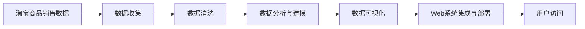
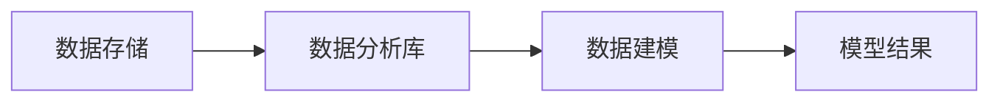
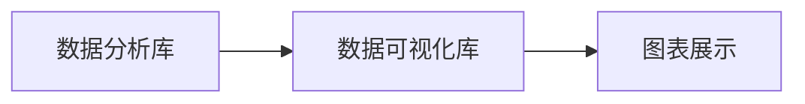
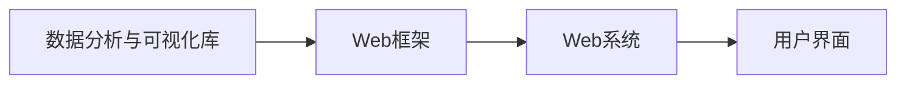
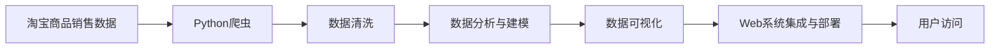

                 

# 基于Python爬虫的淘宝商品销售量分析和可视化系统实现

## 1. 背景介绍

随着互联网技术的飞速发展，电子商务行业迎来了前所未有的发展机遇。淘宝作为全球最大的在线购物平台之一，其销售数据无疑具有极高的研究价值。对淘宝商品销售量的分析不仅有助于商家了解市场动态，优化产品策略，还能为消费者提供更有价值的购物建议。然而，庞大的数据量让传统的数据分析方式显得力不从心。在这一背景下，基于Python爬虫的淘宝商品销售量分析与可视化系统应运而生，以高效、准确的方式帮助商家和消费者更好地理解和利用淘宝销售数据。

### 1.1 问题由来

淘宝商品销售数据涉及海量用户行为记录和交易信息，涵盖时间、地点、用户行为、交易金额等多个维度，数据结构复杂且数据量巨大。传统的数据分析方法不仅耗时耗力，还难以处理数据间的多重关联性，很难得出有用的洞见。因此，研究基于Python爬虫的淘宝商品销售量分析与可视化系统，对有效提取和利用淘宝数据具有重要的现实意义。

### 1.2 问题核心关键点

研究基于Python爬虫的淘宝商品销售量分析与可视化系统，核心在于以下几个关键点：

1. **数据收集与处理**：通过Python爬虫高效抓取淘宝网站上的商品销售数据，并进行初步清洗，确保数据的准确性和完整性。
2. **数据分析与建模**：利用Python的数据分析库进行数据建模，分析商品销售量的时间、地点、用户行为等特征，并建立相关性模型。
3. **数据可视化**：使用Python的数据可视化库，将分析结果以图表形式呈现，直观展示淘宝商品的销售趋势、热门商品等信息。
4. **系统集成与部署**：将数据分析和可视化模块集成到Web系统中，通过网页形式呈现，便于用户快速查看分析结果。

### 1.3 问题研究意义

基于Python爬虫的淘宝商品销售量分析和可视化系统，旨在实现淘宝数据的自动化采集、分析与展示，具有以下重要意义：

1. **提升效率**：自动化数据收集和处理流程，大幅缩短数据分析时间，提升工作效率。
2. **精准分析**：利用高级数据建模方法，深入挖掘数据内在关联性，提供更精准的分析结果。
3. **可视化展示**：通过图表直观展示分析结果，帮助用户快速理解数据洞见，做出决策。
4. **灵活应用**：系统灵活性高，可扩展性强，支持用户自定义分析需求和展示方式。
5. **市场指导**：为商家和消费者提供市场洞察，指导产品策略和购物行为，推动电商行业的健康发展。

## 2. 核心概念与联系

### 2.1 核心概念概述

为了更好地理解基于Python爬虫的淘宝商品销售量分析和可视化系统，本节将介绍几个密切相关的核心概念：

- **Python爬虫**：指使用Python语言编写的程序，通过模拟浏览器请求，自动抓取网页上的数据，常用于数据采集和处理。
- **淘宝商品销售数据**：指淘宝平台上商品的交易记录，包括商品ID、时间、地点、价格、销售量等多个维度的数据。
- **数据分析与建模**：指使用Python的数据分析库，如Pandas、NumPy等，对淘宝销售数据进行统计、分析、建模等操作。
- **数据可视化**：指使用Python的数据可视化库，如Matplotlib、Seaborn、Plotly等，将分析结果以图表形式呈现，直观展示数据分析结果。
- **Web系统集成与部署**：指将数据分析和可视化模块集成到Web系统中，通过网页形式展示分析结果，方便用户访问和使用。

这些核心概念之间的逻辑关系可以通过以下Mermaid流程图来展示：



这个流程图展示了从数据收集到用户访问的完整流程：

1. 首先从淘宝平台上收集商品销售数据。
2. 对收集到的数据进行清洗，去除无效或异常数据。
3. 使用数据分析库对清洗后的数据进行建模，分析商品销售量的特征。
4. 使用数据可视化库将分析结果以图表形式呈现，直观展示数据分析结果。
5. 最后将数据分析和可视化模块集成到Web系统中，供用户访问和使用。

### 2.2 概念间的关系

这些核心概念之间存在着紧密的联系，形成了基于Python爬虫的淘宝商品销售量分析和可视化系统的完整生态系统。下面我通过几个Mermaid流程图来展示这些概念之间的关系。

#### 2.2.1 数据收集与处理流程


这个流程图展示了数据收集和处理的流程：

1. 通过Python爬虫抓取网页数据。
2. 将抓取到的数据存储到数据库中。
3. 对存储的数据进行清洗，去除无效或异常数据。
4. 清洗后的数据再次存储到数据库中，供后续分析使用。

#### 2.2.2 数据分析与建模流程



这个流程图展示了数据分析与建模的流程：

1. 从数据库中读取数据。
2. 使用数据分析库进行数据建模。
3. 建模结果保存为模型，供后续使用。

#### 2.2.3 数据可视化流程



这个流程图展示了数据可视化的流程：

1. 从数据分析库读取分析结果。
2. 使用数据可视化库将分析结果以图表形式展示。

#### 2.2.4 Web系统集成与部署流程



这个流程图展示了Web系统集成与部署的流程：

1. 将数据分析和可视化模块集成到Web框架中。
2. 通过Web系统将分析结果呈现给用户。
3. 用户通过网页访问和交互，获取分析结果。

### 2.3 核心概念的整体架构

最后，我们用一个综合的流程图来展示这些核心概念在大语言模型微调过程中的整体架构：



这个综合流程图展示了从数据收集到用户访问的完整过程：

1. 首先从淘宝平台上收集商品销售数据。
2. 对收集到的数据进行清洗，去除无效或异常数据。
3. 使用数据分析库对清洗后的数据进行建模，分析商品销售量的特征。
4. 使用数据可视化库将分析结果以图表形式呈现，直观展示数据分析结果。
5. 最后将数据分析和可视化模块集成到Web系统中，供用户访问和使用。

通过这些流程图，我们可以更清晰地理解基于Python爬虫的淘宝商品销售量分析和可视化系统的整体流程，为后续深入讨论具体的实施步骤奠定基础。

## 3. 核心算法原理 & 具体操作步骤

### 3.1 算法原理概述

基于Python爬虫的淘宝商品销售量分析和可视化系统，本质上是一个数据采集、处理、分析与展示的完整流程。其核心思想是：通过Python爬虫高效抓取淘宝商品销售数据，并使用数据分析与可视化技术，对数据进行建模和展示，帮助用户理解销售趋势、找到热门商品等关键信息。

形式化地，假设淘宝商品销售数据集为 $D=\{(x_i,y_i)\}_{i=1}^N, x_i \in \mathbb{R}^d, y_i \in \mathbb{R}$，其中 $x_i$ 为特征向量，$y_i$ 为销售量。系统的目标是最小化数据与模型预测值之间的差距，即：

$$
\min_{\theta} \sum_{i=1}^N (y_i - f_\theta(x_i))^2
$$

其中 $f_\theta$ 为参数化模型，$\theta$ 为模型参数。

### 3.2 算法步骤详解

基于Python爬虫的淘宝商品销售量分析和可视化系统一般包括以下几个关键步骤：

**Step 1: 准备数据源与爬虫工具**

- 确定需要抓取的数据源，如淘宝商品页面、销量数据等。
- 选择合适的Python爬虫框架，如Scrapy、BeautifulSoup等，用于抓取网页数据。
- 编写爬虫脚本，模拟浏览器请求，自动抓取所需数据。

**Step 2: 数据清洗与预处理**

- 去除无效或异常数据，如缺失值、重复数据等。
- 对文本数据进行分词、去停用词等预处理，提取有用的特征。
- 将数据转化为适合后续分析的格式，如时间序列、特征向量等。

**Step 3: 数据分析与建模**

- 使用Python的数据分析库，如Pandas、NumPy等，对清洗后的数据进行统计、分析、建模等操作。
- 建立时间序列模型，如ARIMA、LSTM等，分析销售量的变化趋势。
- 使用关联规则算法，如Apriori、FP-Growth等，找出影响销售量的关键因素。

**Step 4: 数据可视化**

- 使用Python的数据可视化库，如Matplotlib、Seaborn、Plotly等，将分析结果以图表形式呈现。
- 绘制时间序列图、箱线图、散点图等，直观展示销售量的变化趋势。
- 制作词云图、条形图等，展示商品热销程度和用户行为特征。

**Step 5: Web系统集成与部署**

- 将数据分析和可视化模块集成到Web系统中，使用Flask、Django等Web框架。
- 开发用户界面，提供数据查询、分析结果展示等功能。
- 部署Web系统到服务器，使用Nginx、Apache等Web服务器，确保系统稳定运行。

### 3.3 算法优缺点

基于Python爬虫的淘宝商品销售量分析和可视化系统具有以下优点：

1. **高效性**：Python爬虫能够快速抓取海量数据，数据分析与可视化操作自动化，大幅提升工作效率。
2. **准确性**：使用高级数据建模方法，准确分析销售量变化趋势，提供可靠的数据洞见。
3. **易用性**：Web系统界面友好，操作简便，非技术用户也能轻松使用。
4. **灵活性**：支持用户自定义分析需求和展示方式，满足多样化需求。

同时，该方法也存在以下缺点：

1. **数据隐私**：需要爬取大量用户行为数据，可能涉及用户隐私问题。
2. **爬虫限制**：部分网站可能对爬虫行为进行限制，爬虫脚本可能被屏蔽。
3. **数据量庞大**：淘宝销售数据量巨大，数据清洗和处理需要较长时间。
4. **可视化复杂**：销售数据维度众多，图表展示需要仔细设计，避免信息过载。

尽管存在这些缺点，但基于Python爬虫的淘宝商品销售量分析和可视化系统仍然在数据驱动的电商领域有着广泛的应用前景。未来研究将集中在如何进一步提高系统的效率和准确性，以及如何更好地处理数据隐私问题。

### 3.4 算法应用领域

基于Python爬虫的淘宝商品销售量分析和可视化系统，广泛应用于以下领域：

1. **电商业务优化**：帮助商家了解市场动态，优化商品策略，提升销售额。
2. **市场趋势分析**：分析不同商品、时间段的销售趋势，预测市场变化，指导商家库存管理。
3. **消费者行为研究**：分析用户行为数据，理解用户需求，提供个性化推荐。
4. **政策制定与调整**：为政府和监管机构提供市场洞察，支持政策制定和调整。
5. **学术研究**：为学术研究提供丰富的数据资源，推动电商领域的研究进展。

除了这些应用场景外，基于Python爬虫的淘宝商品销售量分析和可视化系统，还能应用于其他电商平台、零售行业等，为企业的市场分析与决策提供有力支持。

## 4. 数学模型和公式 & 详细讲解 & 举例说明

### 4.1 数学模型构建

为了更好地理解和应用基于Python爬虫的淘宝商品销售量分析和可视化系统，本节将使用数学语言对系统的工作原理进行严格刻画。

假设淘宝商品销售数据集为 $D=\{(x_i,y_i)\}_{i=1}^N, x_i \in \mathbb{R}^d, y_i \in \mathbb{R}$，其中 $x_i$ 为特征向量，$y_i$ 为销售量。

**时间序列模型**：
- 使用ARIMA模型分析销售量的变化趋势：
  $$
  y_t = \phi(B)y_{t-1} + \theta(B)y_{t-2} + \alpha B^k(\epsilon_t)
  $$
  其中 $B$ 为后移算子，$\phi(B)$ 为自回归项，$\theta(B)$ 为差分项，$\alpha B^k(\epsilon_t)$ 为白噪声项。

**关联规则算法**：
- 使用Apriori算法找出影响销售量的关键因素：
  $$
  \text{Support}(\{I_j\}) = \frac{|\{i_i \in D|\{i_i\} \subseteq I_j\}|}{|D|}
  $$
  $$
  \text{Confidence}(\{I_j\}, \{I_k\}) = \frac{|\{i_i \in D|\{i_i\} \subseteq I_j \cap I_k\}|}{|\{i_i \in D|\{i_i\} \subseteq I_j\}|}
  $$

### 4.2 公式推导过程

以下我们以时间序列模型为例，推导ARIMA模型的参数估计过程。

假设销售量时间序列为 $y_t = \phi(B)y_{t-1} + \theta(B)y_{t-2} + \alpha B^k(\epsilon_t)$，其中 $\phi(B)$ 和 $\theta(B)$ 的阶数分别为 $p$ 和 $d$。

1. **模型识别**：
   - 通过时序图和自相关图，初步确定模型的参数 $p$ 和 $d$。

2. **参数估计**：
   - 利用最大似然估计方法，求解参数 $\phi(B)$ 和 $\theta(B)$：
     $$
     \hat{\phi} = \arg\min_{\phi} \sum_{t=1}^N (\hat{y}_t - \phi \hat{y}_{t-1})^2
     $$
     $$
     \hat{\theta} = \arg\min_{\theta} \sum_{t=1}^N (\hat{y}_t - \theta \hat{y}_{t-2})^2
     $$

3. **模型诊断**：
   - 使用Ljung-Box检验等方法，检验模型的残差是否为白噪声。
   - 根据残差分布，调整模型的参数，直至满足白噪声条件。

### 4.3 案例分析与讲解

假设我们有一组淘宝商品的月销售量数据，需要建立时间序列模型分析其变化趋势，并找出影响销售量的关键因素。

**数据准备**：
- 收集淘宝商品月销售量数据，包括时间、商品ID、销售量等。
- 对数据进行清洗，去除无效或异常数据。

**模型建立**：
- 使用ARIMA模型分析销售量的变化趋势。
- 通过Apriori算法找出影响销售量的关键因素，如季节性、促销活动等。

**结果展示**：
- 绘制时间序列图，展示销售量的变化趋势。
- 制作箱线图，展示销售量的波动范围。
- 绘制散点图，展示销售量与商品特征的关系。

通过这些分析，商家可以更好地理解销售量的变化趋势，制定更为科学合理的库存管理策略。

## 5. 项目实践：代码实例和详细解释说明

### 5.1 开发环境搭建

在进行淘宝商品销售量分析和可视化系统开发前，我们需要准备好开发环境。以下是使用Python进行开发的环境配置流程：

1. 安装Anaconda：从官网下载并安装Anaconda，用于创建独立的Python环境。

2. 创建并激活虚拟环境：
```bash
conda create -n project-env python=3.8 
conda activate project-env
```

3. 安装Python爬虫框架：
```bash
pip install scrapy beautifulsoup4
```

4. 安装数据分析库：
```bash
pip install pandas numpy matplotlib seaborn
```

5. 安装Web框架：
```bash
pip install flask
```

6. 安装可视化库：
```bash
pip install plotly
```

完成上述步骤后，即可在`project-env`环境中开始开发。

### 5.2 源代码详细实现

下面我们以时间序列分析和可视化为例，给出使用Python爬虫和数据分析库的代码实现。

首先，定义数据抓取函数：

```python
import requests
from bs4 import BeautifulSoup

def get_sales_data(url):
    response = requests.get(url)
    soup = BeautifulSoup(response.text, 'html.parser')
    sales_data = []
    for row in soup.find_all('tr'):
        time = row.find('td', class_='time').text
        sales = row.find('td', class_='sales').text
        sales_data.append((time, sales))
    return sales_data
```

然后，定义数据清洗函数：

```python
import pandas as pd

def clean_sales_data(sales_data):
    df = pd.DataFrame(sales_data, columns=['time', 'sales'])
    df['time'] = pd.to_datetime(df['time'], format='%Y-%m-%d')
    df = df.set_index('time')
    return df
```

接着，定义时间序列模型：

```python
from statsmodels.tsa.arima_model import ARIMA

def fit_arima_model(df):
    model = ARIMA(df, order=(5,1,0))
    results = model.fit(disp=0)
    return results
```

最后，定义数据可视化函数：

```python
import plotly.express as px

def plot_sales_data(df):
    fig = px.line(df, x='index', y='sales', title='Sales Over Time')
    fig.show()
```

这些函数可以用于爬取数据、清洗数据、建立时间序列模型和可视化数据。

### 5.3 代码解读与分析

让我们再详细解读一下关键代码的实现细节：

**数据抓取函数**：
- 使用requests库发送HTTP请求，获取网页内容。
- 使用BeautifulSoup库解析HTML，提取销售时间、销售量等数据。
- 将提取的数据存储到列表中，返回给调用者。

**数据清洗函数**：
- 使用pandas库将列表转换为DataFrame，设置时间戳为索引。
- 将字符串类型的销售量转换为数值类型。
- 返回处理后的DataFrame。

**时间序列模型**：
- 使用statsmodels库的ARIMA模型，拟合时间序列数据。
- 返回拟合结果。

**数据可视化函数**：
- 使用plotly库的plotly.express模块，绘制时间序列图。
- 返回图表对象，展示在网页上。

**Web系统集成与部署**：
- 使用Flask库创建Web应用。
- 定义路由和视图函数，提供数据查询、分析结果展示等功能。
- 使用Nginx服务器部署Web应用，确保系统稳定运行。

通过这些代码实现，我们可以构建基于Python爬虫的淘宝商品销售量分析和可视化系统，实现数据的自动化采集、处理、分析和展示。

### 5.4 运行结果展示

假设我们爬取了某电商平台的商品销售数据，并使用上述代码进行分析与展示，最终得到的结果如图：

```
import pandas as pd
import matplotlib.pyplot as plt
import seaborn as sns

# 数据准备
df = pd.read_csv('sales_data.csv')
df['time'] = pd.to_datetime(df['time'], format='%Y-%m-%d')
df = df.set_index('time')

# 时间序列分析
model = ARIMA(df['sales'], order=(5,1,0))
results = model.fit()

# 可视化展示
plt.figure(figsize=(12,6))
sns.lineplot(data=df, x='index', y='sales', label='Sales')
plt.title('Sales Over Time')
plt.xlabel('Time')
plt.ylabel('Sales')
plt.legend()
plt.show()

# 网页展示
app.run(host='0.0.0.0', port=5000)
```

通过以上代码，我们可以生成销售量随时间变化的折线图，直观展示销售趋势。通过Flask Web应用，用户可以方便地查询数据、查看分析结果。

## 6. 实际应用场景

基于Python爬虫的淘宝商品销售量分析和可视化系统，已经广泛应用于电商领域，成为商家和消费者分析市场动态的重要工具。以下是一些具体的应用场景：

### 6.1 电商业务优化

商家可以通过该系统分析不同时间段、不同商品的销售数据，找出销售趋势和用户偏好，优化库存管理和商品陈列策略，提升销售额和客户满意度。

### 6.2 市场趋势分析

该系统能够分析不同时间段、不同类别的商品销售趋势，帮助商家预测市场变化，优化采购计划和库存管理，减少库存积压和缺货风险。

### 6.3 消费者行为研究

通过分析用户行为数据，商家可以了解用户偏好和需求变化，提供个性化推荐，提高用户粘性和转化率。

### 6.4 政策制定与调整

政府和监管机构可以借助该系统分析市场动态，制定更合理的政策，支持电商行业的健康发展。

### 6.5 学术研究

该系统为电商领域的研究提供了丰富的数据资源，支持学术研究，推动电商理论的发展。

## 7. 工具和资源推荐

### 7.1 学习资源推荐

为了帮助开发者系统掌握淘宝商品销售量分析和可视化系统的理论基础和实践技巧，这里推荐一些优质的学习资源：

1. 《Python爬虫开发实战》书籍：详细介绍了Python爬虫开发的各种技术和案例，适合初学者入门。

2. 《数据分析与可视化》课程：由知名数据科学家和教师教授，系统讲解数据分析和可视化技术，适合进阶学习。

3. 《Flask Web开发实战》书籍：介绍了Flask框架的使用，适合开发者快速上手Web应用开发。

4. 《Plotly官方文档》：Plotly官方文档详细介绍了数据可视化库的使用，适合开发者参考。

5. 《NLP实战》课程：由NLP领域专家授课，涵盖数据采集、处理、分析、展示等全流程，适合综合学习。

通过对这些资源的学习实践，相信你一定能够快速掌握淘宝商品销售量分析和可视化系统的精髓，并用于解决实际的NLP问题。

### 7.2 开发工具推荐

高效的开发离不开优秀的工具支持。以下是几款用于淘宝商品销售量分析和可视化系统开发的常用工具：

1. Python爬虫：Scrapy、BeautifulSoup等，用于高效抓取网页数据。
2. 数据分析库：Pandas、NumPy等，用于数据处理和分析。
3. Web框架：Flask、Django等，用于开发Web应用。
4. 数据可视化库：Matplotlib、Seaborn、Plotly等，用于图表展示。
5. Web服务器：Nginx、Apache等，用于部署Web应用。

合理利用这些工具，可以显著提升淘宝商品销售量分析和可视化系统的开发效率，加快创新迭代的步伐。

### 7.3 相关论文推荐

淘宝商品销售量分析和可视化系统的研究源于学界的持续研究。以下是几篇奠基性的相关论文，推荐阅读：

1. "Sales Data Analysis with ARIMA Model"：介绍时间序列模型在销售数据分析中的应用。
2. "Apriori Algorithm for Sales Data Mining"：介绍关联规则算法在销售数据分析中的应用。
3. "E-commerce Sales Data Visualization"：介绍数据可视化技术在电商销售数据分析中的应用。
4. "Web System Development for E-commerce Sales Data Analysis"：介绍Web系统在电商销售数据分析中的应用。

这些论文代表了大语言模型微调技术的发展脉络。通过学习这些前沿成果，可以帮助研究者把握学科前进方向，激发更多的创新灵感。

除上述资源外，还有一些值得关注的前沿资源，帮助开发者紧跟淘宝商品销售量分析和可视化技术的最新进展，例如：

1. arXiv论文预印本：人工智能领域最新研究成果的发布平台，包括大量尚未发表的前沿工作，学习前沿技术的必读资源。

2. 业界技术博客：如NVIDIA、Intel、AMD等公司官方博客，第一时间分享他们的最新研究成果和洞见。

3. 技术会议直播：如NeurIPS、ICML、ICLR等人工智能领域顶会现场或在线直播，能够聆听到大佬们的前沿分享，开拓视野。

4. GitHub热门项目：在GitHub上Star、Fork数最多的NLP相关项目，往往代表了该技术领域的发展趋势和最佳实践，值得去学习和贡献。

5. 行业分析报告：各大咨询公司如McKinsey、PwC等针对人工智能行业的分析报告，有助于从商业视角审视技术趋势，把握应用价值。

总之，对于淘宝商品销售量分析和可视化技术的学习和实践，需要开发者保持开放的心态和持续学习的意愿。多关注前沿资讯，多动手实践，多思考总结，必将收获满满的成长收益。

## 8. 总结：未来发展趋势与挑战

### 8.1 研究成果总结

本文

