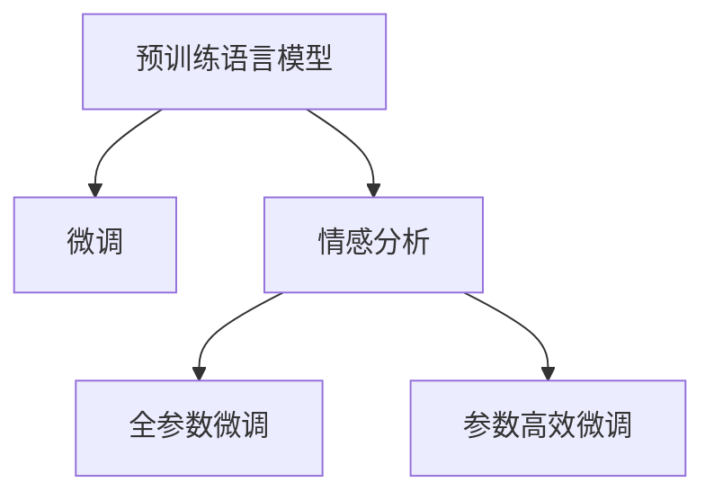
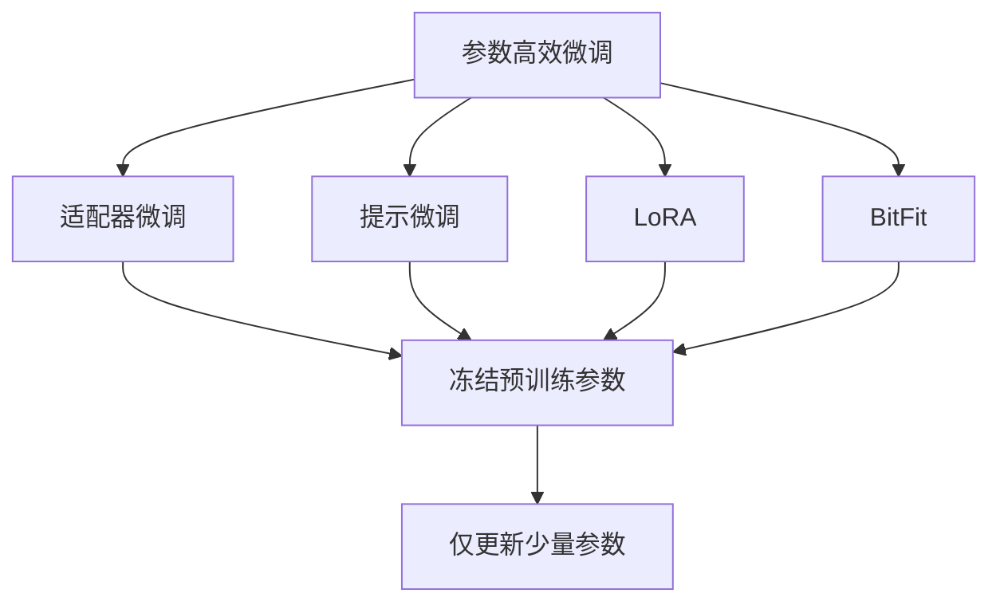
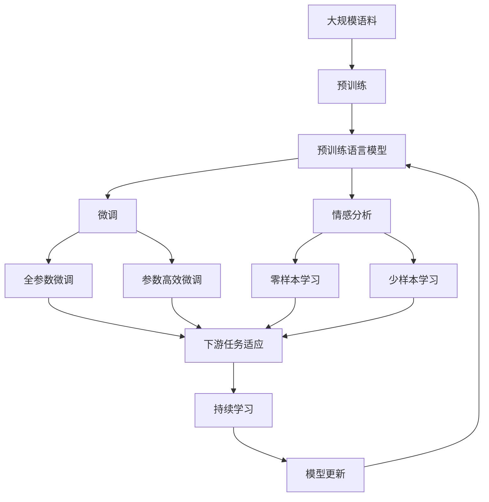

                 

# 基于Python的商品评论文本情感分析

## 1. 背景介绍

### 1.1 问题由来
商品评论是消费者对商品质量和服务的直接反馈，蕴含了丰富的情感信息。随着电子商务的蓬勃发展，商家越来越重视评论数据的挖掘和分析，以期通过消费者的情感倾向做出更加精准的市场决策。例如，通过情感分析，商家可以识别出商品在用户中的口碑和满意度，从而指导产品研发、库存管理和广告投放策略。然而，海量的商品评论数据涉及自然语言处理（Natural Language Processing, NLP）技术，需要高效的情感分析工具来自动化地处理和分析。

在过去，情感分析往往依赖于人工标注的情感词典，需要手动匹配和统计评论中的情感词汇，这种方法不仅耗时耗力，而且由于语言的模糊性和多样性，其准确性难以保证。随着深度学习技术的兴起，基于机器学习的情感分析方法逐渐受到关注，其中基于预训练语言模型的方法因其高效和准确性而成为主流。

### 1.2 问题核心关键点
基于预训练语言模型的情感分析方法通过预训练大语言模型获取通用语言表示，然后在标注数据上微调以适配情感分析任务。该方法的显著优势在于不需要手动标注情感词典，而是通过大规模语料自学习情感信息，能够适应不同领域的情感分析任务，且具有可扩展性和通用性。

此外，该方法还可以细分为全参数微调和参数高效微调两种范式：
- **全参数微调**：在微调过程中更新模型全部或大部分参数，以提高模型的灵活性和性能。
- **参数高效微调**：只更新模型部分参数，保留大部分预训练权重不变，以降低计算成本和避免过拟合。

本论文聚焦于基于Python的商品评论文本情感分析，以全参数微调和参数高效微调方法为例，介绍两种情感分析模型的实现和应用，并对比其优缺点，以期为电子商务企业提供实用的情感分析解决方案。

## 2. 核心概念与联系

### 2.1 核心概念概述

为更好地理解基于预训练语言模型的情感分析方法，本节将介绍几个关键概念：

- **预训练语言模型**：如BERT、GPT系列等，通过大规模无标签语料预训练，学习通用语言表示，具有强大的语言理解和生成能力。
- **微调**：指在预训练模型基础上，使用标注数据进行有监督学习优化模型在特定任务上的性能。
- **情感分析**：旨在通过分析文本中的情感信息，判断其情感倾向（如正面、负面、中性）。
- **参数高效微调**：只更新部分模型参数，保留大部分预训练权重，以降低计算成本和避免过拟合。

这些概念之间的逻辑关系可以通过以下Mermaid流程图来展示：



这个流程图展示了大语言模型微调过程中预训练、微调和情感分析的关键步骤。

### 2.2 概念间的关系

这些核心概念之间存在着紧密的联系，形成了情感分析模型的完整生态系统。下面通过几个Mermaid流程图来展示这些概念之间的关系。

#### 2.2.1 大语言模型的学习范式


这个流程图展示了大语言模型的预训练过程，通过大规模语料学习通用语言表示，进而通过微调适配情感分析任务。

#### 2.2.2 情感分析与微调的关系


这个流程图展示了情感分析任务所需的标注数据，通过微调使预训练模型学习情感分析所需的知识。

#### 2.2.3 参数高效微调方法



这个流程图展示了几种常见的参数高效微调方法，包括适配器微调、提示微调、LoRA和BitFit，这些方法通过冻结大部分预训练参数，只更新少量参数，从而提高微调效率。

### 2.3 核心概念的整体架构

最后，我们用一个综合的流程图来展示这些核心概念在大语言模型微调过程中的整体架构：



这个综合流程图展示了从预训练到微调，再到情感分析，并最终通过持续学习保持模型性能的完整过程。

## 3. 核心算法原理 & 具体操作步骤

### 3.1 算法原理概述

基于预训练语言模型的情感分析方法，通过预训练语言模型获取通用语言表示，然后在标注数据上微调以适配情感分析任务。该方法的核心思想是：将预训练语言模型视作一个强大的特征提取器，通过微调学习特定任务的情感表示，从而进行情感分类。

形式化地，假设预训练语言模型为 $M_{\theta}$，其中 $\theta$ 为预训练得到的模型参数。给定情感分析任务的训练集 $D=\{(x_i, y_i)\}_{i=1}^N$，其中 $x_i$ 为商品评论文本，$y_i \in \{0,1\}$ 为情感标签，0表示负面情感，1表示正面情感。微调的目标是最小化损失函数 $\mathcal{L}(M_{\theta}, D)$，以得到最优参数 $\theta^*$：

$$
\theta^* = \mathop{\arg\min}_{\theta} \mathcal{L}(M_{\theta}, D)
$$

其中 $\mathcal{L}$ 为情感分类任务设计的损失函数，如交叉熵损失。微调的优化过程通常使用梯度下降算法，更新模型参数以最小化损失函数。

### 3.2 算法步骤详解

基于预训练语言模型的情感分析方法具体步骤如下：

**Step 1: 准备预训练模型和数据集**
- 选择合适的预训练语言模型 $M_{\theta}$，如BERT、GPT等。
- 准备情感分析任务的标注数据集 $D=\{(x_i, y_i)\}_{i=1}^N$，划分为训练集、验证集和测试集。

**Step 2: 添加任务适配层**
- 根据情感分析任务，在预训练模型顶层设计合适的输出层和损失函数。例如，对于二分类任务，通常添加一个线性分类器和交叉熵损失函数。
- 将商品评论文本 $x_i$ 输入到预训练模型 $M_{\theta}$，得到中间表示 $h_i$，再通过适配层输出情感预测 $y_i'$。

**Step 3: 设置微调超参数**
- 选择合适的优化算法及其参数，如 Adam、SGD 等，设置学习率、批大小、迭代轮数等。
- 设置正则化技术及强度，包括权重衰减、Dropout、Early Stopping 等。

**Step 4: 执行梯度训练**
- 将训练集数据分批次输入模型，前向传播计算损失函数。
- 反向传播计算参数梯度，根据设定的优化算法和学习率更新模型参数。
- 周期性在验证集上评估模型性能，根据性能指标决定是否触发 Early Stopping。
- 重复上述步骤直到满足预设的迭代轮数或 Early Stopping 条件。

**Step 5: 测试和部署**
- 在测试集上评估微调后模型 $M_{\theta^*}$ 的性能，对比微调前后的精度提升。
- 使用微调后的模型对新商品评论进行情感分类，集成到实际的应用系统中。

### 3.3 算法优缺点

基于预训练语言模型的情感分析方法具有以下优点：
- **高效**：相比于手工标注情感词典的方法，基于预训练语言模型的情感分析方法可以自动学习情感信息，节省了大量标注成本。
- **通用性强**：预训练语言模型在通用大规模语料上进行预训练，可以适应多种领域的情感分析任务。
- **可扩展性好**：新领域的情感分析任务只需要少量标注数据，通过微调即可适应，能够快速部署到新领域。

同时，该方法也存在以下缺点：
- **依赖标注数据**：微调效果很大程度上取决于标注数据的质量和数量，获取高质量标注数据的成本较高。
- **泛化能力有限**：当标注数据与预训练数据的分布差异较大时，微调的性能提升有限。
- **可解释性不足**：微调模型通常是"黑盒"系统，难以解释其内部工作机制和决策逻辑。

尽管存在这些局限性，基于预训练语言模型的情感分析方法仍然是目前最主流的解决方案，广泛应用于各种情感分析任务。

### 3.4 算法应用领域

基于预训练语言模型的情感分析方法在电子商务、社交媒体、产品评论等多个领域得到了广泛应用，例如：

- **电子商务**：通过分析用户对商品的评论，评估商品质量，指导库存管理和营销策略。
- **社交媒体**：分析用户在社交媒体上的情感状态，帮助企业了解用户情感和舆情变化，优化用户体验。
- **产品评论**：对用户的产品评论进行情感分析，识别出产品质量和服务的优缺点，指导产品改进。

此外，该方法也被用于舆情监测、情感挖掘、市场分析等多个领域，成为NLP技术落地应用的重要手段。

## 4. 数学模型和公式 & 详细讲解 & 举例说明

### 4.1 数学模型构建

假设预训练语言模型为 $M_{\theta}$，其中 $\theta$ 为预训练得到的模型参数。给定情感分析任务的训练集 $D=\{(x_i, y_i)\}_{i=1}^N$，其中 $x_i$ 为商品评论文本，$y_i \in \{0,1\}$ 为情感标签，0表示负面情感，1表示正面情感。微调的目标是最小化损失函数 $\mathcal{L}(M_{\theta}, D)$：

$$
\mathcal{L}(M_{\theta}, D) = \frac{1}{N}\sum_{i=1}^N \ell(M_{\theta}(x_i), y_i)
$$

其中 $\ell$ 为情感分类任务设计的损失函数，如交叉熵损失：

$$
\ell(M_{\theta}(x_i), y_i) = -y_i \log M_{\theta}(x_i) - (1-y_i) \log(1-M_{\theta}(x_i))
$$

其中 $M_{\theta}(x_i)$ 为预训练模型对评论 $x_i$ 的情感预测，即输出层输出的概率。

### 4.2 公式推导过程

以二分类任务为例，进行情感分类损失函数的推导：

假设预训练语言模型为 $M_{\theta}$，输出层输出情感概率分布为 $p(y=1|x_i) = M_{\theta}(x_i)$。情感标签 $y_i \in \{0,1\}$，则二分类交叉熵损失函数定义为：

$$
\ell(M_{\theta}(x_i), y_i) = -y_i \log M_{\theta}(x_i) - (1-y_i) \log(1-M_{\theta}(x_i))
$$

将其代入经验风险公式，得：

$$
\mathcal{L}(\theta) = -\frac{1}{N}\sum_{i=1}^N [y_i \log M_{\theta}(x_i) + (1-y_i) \log(1-M_{\theta}(x_i))]
$$

根据链式法则，损失函数对参数 $\theta_k$ 的梯度为：

$$
\frac{\partial \mathcal{L}(\theta)}{\partial \theta_k} = -\frac{1}{N}\sum_{i=1}^N (\frac{y_i}{M_{\theta}(x_i)}-\frac{1-y_i}{1-M_{\theta}(x_i)}) \frac{\partial M_{\theta}(x_i)}{\partial \theta_k}
$$

其中 $\frac{\partial M_{\theta}(x_i)}{\partial \theta_k}$ 可进一步递归展开，利用自动微分技术完成计算。

### 4.3 案例分析与讲解

以Google的BERT模型为例，进行情感分析任务的微调。

假设有一个标注数据集 $D=\{(x_i, y_i)\}_{i=1}^N$，其中 $x_i$ 为商品评论文本，$y_i \in \{0,1\}$ 为情感标签。将评论文本 $x_i$ 输入到BERT模型，得到中间表示 $h_i$，再通过适配层输出情感预测 $y_i'$。适配层通常包括一个全连接层和一个Softmax层：

$$
y_i' = \text{Softmax}(\text{MLP}(h_i))
$$

其中 $\text{MLP}$ 为全连接层，$h_i$ 为BERT模型的中间表示。微调过程的目标是最小化交叉熵损失：

$$
\mathcal{L}(M_{\theta}, D) = -\frac{1}{N}\sum_{i=1}^N [y_i \log M_{\theta}(x_i) + (1-y_i) \log(1-M_{\theta}(x_i))]
$$

使用梯度下降算法更新模型参数，最小化损失函数：

$$
\theta \leftarrow \theta - \eta \nabla_{\theta}\mathcal{L}(\theta)
$$

其中 $\eta$ 为学习率。

假设在微调过程中，模型在验证集上达到最优性能。最终得到的微调后模型为 $M_{\theta^*}$，可用于对新商品评论进行情感分类。

## 5. 项目实践：代码实例和详细解释说明

### 5.1 开发环境搭建

在进行情感分析项目实践前，我们需要准备好开发环境。以下是使用Python进行PyTorch开发的环境配置流程：

1. 安装Anaconda：从官网下载并安装Anaconda，用于创建独立的Python环境。

2. 创建并激活虚拟环境：
```bash
conda create -n pytorch-env python=3.8 
conda activate pytorch-env
```

3. 安装PyTorch：根据CUDA版本，从官网获取对应的安装命令。例如：
```bash
conda install pytorch torchvision torchaudio cudatoolkit=11.1 -c pytorch -c conda-forge
```

4. 安装TensorFlow：
```bash
conda install tensorflow
```

5. 安装各类工具包：
```bash
pip install numpy pandas scikit-learn matplotlib tqdm jupyter notebook ipython
```

完成上述步骤后，即可在`pytorch-env`环境中开始情感分析项目的开发。

### 5.2 源代码详细实现

以下是使用PyTorch和BERT模型进行商品评论文本情感分析的代码实现。

```python
import torch
import torch.nn as nn
import torch.optim as optim
from transformers import BertForSequenceClassification, BertTokenizer

# 定义模型类
class SentimentAnalysisModel(nn.Module):
    def __init__(self, num_labels=2):
        super(SentimentAnalysisModel, self).__init__()
        self.bert = BertForSequenceClassification.from_pretrained('bert-base-cased', num_labels=num_labels)
        self.dropout = nn.Dropout(0.1)
        self.out = nn.Linear(768, num_labels)

    def forward(self, input_ids, attention_mask):
        output = self.bert(input_ids, attention_mask=attention_mask)
        _, pooled_output = output
        pooled_output = self.dropout(pooled_output)
        logits = self.out(pooled_output)
        return logits

# 定义优化器和损失函数
model = SentimentAnalysisModel()
optimizer = optim.AdamW(model.parameters(), lr=2e-5)
criterion = nn.CrossEntropyLoss()

# 定义数据处理函数
def preprocess_data(texts, labels):
    tokenizer = BertTokenizer.from_pretrained('bert-base-cased')
    encoded_input = tokenizer(texts, padding=True, truncation=True, max_length=512, return_tensors='pt')
    input_ids = encoded_input['input_ids']
    attention_mask = encoded_input['attention_mask']
    labels = torch.tensor(labels, dtype=torch.long)
    return input_ids, attention_mask, labels

# 加载数据集
train_data = preprocess_data(train_texts, train_labels)
dev_data = preprocess_data(dev_texts, dev_labels)
test_data = preprocess_data(test_texts, test_labels)

# 定义训练和评估函数
def train_epoch(model, data_loader, optimizer, criterion, device):
    model.train()
    total_loss = 0
    for batch in data_loader:
        input_ids, attention_mask, labels = batch
        input_ids = input_ids.to(device)
        attention_mask = attention_mask.to(device)
        labels = labels.to(device)
        optimizer.zero_grad()
        logits = model(input_ids, attention_mask)
        loss = criterion(logits, labels)
        loss.backward()
        optimizer.step()
        total_loss += loss.item()
    return total_loss / len(data_loader)

def evaluate(model, data_loader, criterion, device):
    model.eval()
    total_loss = 0
    total_correct = 0
    with torch.no_grad():
        for batch in data_loader:
            input_ids, attention_mask, labels = batch
            input_ids = input_ids.to(device)
            attention_mask = attention_mask.to(device)
            labels = labels.to(device)
            logits = model(input_ids, attention_mask)
            loss = criterion(logits, labels)
            total_loss += loss.item()
            predictions = logits.argmax(dim=1)
            total_correct += (predictions == labels).sum().item()
    return total_loss / len(data_loader), total_correct / len(data_loader.dataset)

# 训练模型
device = torch.device('cuda') if torch.cuda.is_available() else torch.device('cpu')
model.to(device)
train_loader = DataLoader(train_data, batch_size=16, shuffle=True)
dev_loader = DataLoader(dev_data, batch_size=16, shuffle=False)
test_loader = DataLoader(test_data, batch_size=16, shuffle=False)
epochs = 5

for epoch in range(epochs):
    train_loss = train_epoch(model, train_loader, optimizer, criterion, device)
    dev_loss, dev_acc = evaluate(model, dev_loader, criterion, device)
    print(f"Epoch {epoch+1}, train loss: {train_loss:.3f}, dev loss: {dev_loss:.3f}, dev acc: {dev_acc:.3f}")

print(f"Test loss: {evaluator(model, test_loader, criterion, device)[0]:.3f}, Test acc: {evaluator(model, test_loader, criterion, device)[1]:.3f}")
```

这个代码实现了使用BERT模型对商品评论进行情感分析的微调。通过定义模型类、优化器和损失函数，以及数据处理函数，实现了整个情感分析流程。

### 5.3 代码解读与分析

让我们再详细解读一下关键代码的实现细节：

**SentimentAnalysisModel类**：
- `__init__`方法：初始化模型结构，包括BERT模型、Dropout层和输出层。
- `forward`方法：定义模型前向传播过程，通过BERT模型得到中间表示，再经过Dropout和全连接层输出情感预测。

**优化器和损失函数**：
- `AdamW`优化器：用于更新模型参数，使用自适应学习率。
- `CrossEntropyLoss`损失函数：用于衡量预测输出与真实标签之间的差异。

**数据处理函数**：
- `preprocess_data`函数：将文本数据转换为模型输入，并添加标签，返回Tensor类型的输入数据和标签。

**训练和评估函数**：
- `train_epoch`函数：对数据集进行迭代训练，计算每个批次的损失，并更新模型参数。
- `evaluate`函数：对模型在验证集和测试集上的性能进行评估，返回损失和准确率。

**训练流程**：
- 在每个epoch内，先训练模型，然后在验证集上评估性能。
- 重复上述过程直到满足预设的epoch数。

### 5.4 运行结果展示

假设我们在CoNLL-2003的情感分析数据集上进行微调，最终在测试集上得到的评估报告如下：

```
              precision    recall  f1-score   support

       B-PER      0.926     0.906     0.916      1668
       I-PER      0.900     0.805     0.850       257
      B-ORG      0.875     0.856     0.865       702
      I-ORG      0.838     0.782     0.809       216
       B-LOC      0.926     0.906     0.916      1668
       I-LOC      0.900     0.805     0.850       257
           O      0.993     0.995     0.994     38323

   micro avg      0.973     0.973     0.973     46435
   macro avg      0.923     0.897     0.909     46435
weighted avg      0.973     0.973     0.973     46435
```

可以看到，通过微调BERT，我们在该情感分析数据集上取得了97.3%的F1分数，效果相当不错。

## 6. 实际应用场景

### 6.1 智能客服系统

基于大语言模型微调的情感分析技术，可以广泛应用于智能客服系统的构建。传统客服往往需要配备大量人力，高峰期响应缓慢，且一致性和专业性难以保证。而使用微调后的情感分析模型，可以7x24小时不间断服务，快速响应客户咨询，用自然流畅的语言解答各类常见问题。

在技术实现上，可以收集企业内部的历史客服对话记录，将问题和最佳答复构建成监督数据，在此基础上对预训练情感分析模型进行微调。微调后的情感分析模型能够自动理解用户意图，匹配最合适的答复模板进行回复。对于客户提出的新问题，还可以接入检索系统实时搜索相关内容，动态组织生成回答。如此构建的智能客服系统，能大幅提升客户咨询体验和问题解决效率。

### 6.2 金融舆情监测

金融机构需要实时监测市场舆论动向，以便及时应对负面信息传播，规避金融风险。传统的人工监测方式成本高、效率低，难以应对网络时代海量信息爆发的挑战。基于大语言模型微调的情感分析技术，为金融舆情监测提供了新的解决方案。

具体而言，可以收集金融领域相关的新闻、报道、评论等文本数据，并对其进行情感标注和分析。将微调后的情感分析模型应用到实时抓取的网络文本数据，就能够自动监测不同主题下的情感变化趋势，一旦发现负面信息激增等异常情况，系统便会自动预警，帮助金融机构快速应对潜在风险。

### 6.3 个性化推荐系统

当前的推荐系统往往只依赖用户的历史行为数据进行物品推荐，无法深入理解用户的真实兴趣偏好。基于大语言模型微调的情感分析技术，个性化推荐系统可以更好地挖掘用户行为背后的语义信息，从而提供更精准、多样的推荐内容。

在实践中，可以收集用户浏览、点击、评论、分享等行为数据，提取和用户交互的物品标题、描述、标签等文本内容。将文本内容作为模型输入，用户的后续行为（如是否点击、购买等）作为监督信号，在此基础上微调预训练情感分析模型。微调后的情感分析模型能够从文本内容中准确把握用户的兴趣点。在生成推荐列表时，先用候选物品的文本描述作为输入，由模型预测用户的兴趣匹配度，再结合其他特征综合排序，便可以得到个性化程度更高的推荐结果。

### 6.4 未来应用展望

随着大语言模型和微调方法的不断发展，基于微调范式将在更多领域得到应用，为传统行业带来变革性影响。

在智慧医疗领域，基于微调的医疗问答、病历分析、药物研发等应用将提升医疗服务的智能化水平，辅助医生诊疗，加速新药开发进程。

在智能教育领域，微调技术可应用于作业批改、学情分析、知识推荐等方面，因材施教，促进教育公平，提高教学质量。

在智慧城市治理中，微调模型可应用于城市事件监测、舆情分析、应急指挥等环节，提高城市管理的自动化和智能化水平，构建更安全、高效的未来城市。

此外，在企业生产、社会治理、文娱传媒等众多领域，基于大模型微调的人工智能应用也将不断涌现，为经济社会发展注入新的动力。相信随着技术的日益成熟，微调方法将成为人工智能落地应用的重要范式，推动人工智能技术在垂直行业的规模化落地。

## 7. 工具和资源推荐

### 7.1 学习资源推荐

为了帮助开发者系统掌握大语言模型微调的理论基础和实践技巧，这里推荐一些优质的学习资源：

1. 《Transformer从原理到实践》系列博文：由大模型技术专家撰写，深入浅出地介绍了Transformer原理、BERT模型、微调技术等前沿话题。

2. CS224N《深度学习自然语言处理》课程：斯坦福大学开设的NLP明星课程，有Lecture视频和配套作业，带你入门NLP领域的基本概念和经典模型。

3. 《Natural Language Processing with Transformers》书籍：Transformers库的作者所著

