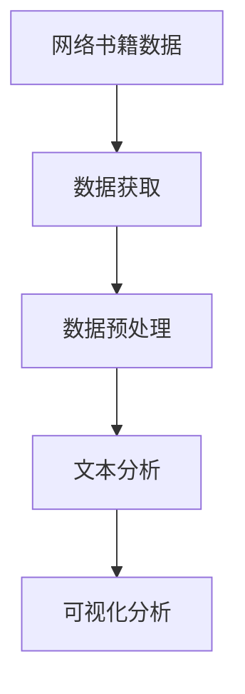
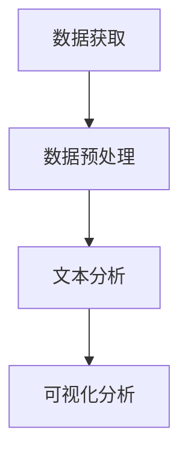
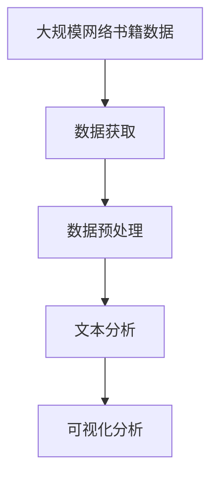

                 

# 基于Python的网络书籍数据可视化分析

> 关键词：数据可视化, 网络书籍, 文本分析, Python, 图像处理, 数据分析, 可视化工具

## 1. 背景介绍

### 1.1 问题由来
在当今的信息时代，书籍作为知识的重要载体，对人类的认知发展和文化传承起到了不可替代的作用。然而，随着数字化技术的进步，越来越多的书籍被数字化并上传到网络，使得网络书籍成为信息时代的新宠。据统计，全球每年有上亿本纸质书籍被扫描并上传到网络上，为读者提供便捷的阅读服务。

然而，这些海量网络书籍的文本数据背后，蕴含着丰富的知识信息和学术价值。如何对这些数据进行有效的分析和利用，成为一个亟待解决的问题。数据可视化作为一种强大的数据展现手段，能够将复杂的数据信息通过图形化呈现，帮助人们直观地理解数据背后的规律和趋势。

因此，本文将基于Python，介绍一种网络书籍数据的可视化分析方法，通过文本处理和可视化技术，探索和揭示网络书籍数据中的深层次信息。

### 1.2 问题核心关键点
本文的核心问题是如何利用Python进行网络书籍数据的可视化分析。具体来说，包括以下几个关键点：

- **数据获取**：如何从互联网上获取网络书籍数据。
- **数据预处理**：如何对获取到的书籍数据进行清洗和预处理，提取有价值的信息。
- **文本分析**：如何对书籍文本进行分析和处理，提取出关键信息。
- **可视化分析**：如何将提取出的关键信息通过可视化技术呈现出来，揭示数据背后的规律和趋势。

## 2. 核心概念与联系

### 2.1 核心概念概述

为更好地理解本文所介绍的网络书籍数据可视化分析方法，本节将介绍几个密切相关的核心概念：

- **数据可视化**：利用图形、图表等形式，将数据转化为直观的视觉展现形式，帮助人们理解数据背后规律的技术。
- **网络书籍**：通过数字化技术，将纸质书籍转化为电子书籍，存储在网络上供用户阅读的书籍。
- **文本分析**：通过自然语言处理技术，对书籍文本进行分析和处理，提取有价值的信息。
- **Python**：一种功能强大的编程语言，拥有丰富的第三方库，如Pandas、Matplotlib、NLTK等，适合进行数据处理和可视化分析。
- **图像处理**：对图像进行分析和处理，包括图像增强、分割、特征提取等技术。

这些核心概念之间的逻辑关系可以通过以下Mermaid流程图来展示：



这个流程图展示了网络书籍数据可视化分析的基本流程：从数据获取到文本分析，最后通过可视化技术展现结果。

### 2.2 概念间的关系

这些核心概念之间存在着紧密的联系，形成了网络书籍数据可视化分析的完整生态系统。下面我通过几个Mermaid流程图来展示这些概念之间的关系。

#### 2.2.1 数据获取与文本分析的关系


这个流程图展示了数据获取和文本分析之间的关系。首先从网络上获取书籍数据，然后对数据进行预处理，提取出书籍文本，进而进行文本分析。

#### 2.2.2 文本分析与可视化分析的关系


这个流程图展示了文本分析和可视化分析之间的关系。文本分析提取出书籍的关键信息，然后通过可视化分析将这些信息呈现出来，揭示数据背后的规律和趋势。

#### 2.2.3 数据获取与可视化分析的关系



这个综合流程图展示了从数据获取到文本分析，最后通过可视化分析展现结果的全过程。

### 2.3 核心概念的整体架构

最后，我们用一个综合的流程图来展示这些核心概念在大数据可视化分析中的整体架构：



这个综合流程图展示了从大规模网络书籍数据到最终可视化结果的全过程。

## 3. 核心算法原理 & 具体操作步骤
### 3.1 算法原理概述

基于Python的网络书籍数据可视化分析方法，主要利用了数据获取、数据预处理、文本分析和可视化分析等关键技术。

- **数据获取**：通过网络爬虫、API接口等方式获取大规模的网络书籍数据。
- **数据预处理**：对获取到的书籍数据进行清洗、去重、分割等预处理操作，提取有用的文本信息。
- **文本分析**：利用自然语言处理技术，对文本信息进行分词、去除停用词、提取关键词、词频统计等处理，提取出关键信息。
- **可视化分析**：通过图形化工具，将提取出的关键信息通过图表、图像等形式呈现出来，揭示数据背后的规律和趋势。

### 3.2 算法步骤详解

下面详细讲解基于Python的网络书籍数据可视化分析的具体操作步骤。

**Step 1: 数据获取**

从网络上获取大规模的网络书籍数据，可以采用以下方法：

1. **网络爬虫**：编写Python脚本来爬取书籍信息，从不同网站获取书籍数据。例如，可以利用BeautifulSoup、Scrapy等库进行网页解析和数据提取。
2. **API接口**：利用各大图书馆和出版社提供的API接口，获取电子书籍数据。例如，Google Books API、Project Gutenberg等。

**Step 2: 数据预处理**

对获取到的书籍数据进行清洗和预处理，提取出有用的文本信息，可以采用以下方法：

1. **文本清洗**：去除文本中的HTML标签、特殊字符、无效空格等，保留有用的文本内容。
2. **去除停用词**：去除文本中常见的停用词（如“的”、“是”等），减少噪音信息。
3. **分词**：将文本按词分割，便于后续分析和处理。可以使用jieba、NLTK等库进行分词。

**Step 3: 文本分析**

利用自然语言处理技术，对文本信息进行分析和处理，提取出关键信息，可以采用以下方法：

1. **关键词提取**：使用TF-IDF、TextRank等算法，提取出文本中的关键词。
2. **词频统计**：统计每个关键词在文本中的出现次数，找出出现频率较高的关键词。
3. **情感分析**：利用情感分析技术，分析文本的情感倾向（如正面、负面、中性）。

**Step 4: 可视化分析**

通过图形化工具，将提取出的关键信息通过图表、图像等形式呈现出来，揭示数据背后的规律和趋势，可以采用以下方法：

1. **词频分布图**：绘制关键词的词频分布图，展示各关键词在文本中的分布情况。
2. **情感分析图**：绘制文本情感分析结果的分布图，展示文本的情感倾向。
3. **关键词网络图**：构建关键词之间的共现网络图，展示关键词之间的关系和信息流。

### 3.3 算法优缺点

基于Python的网络书籍数据可视化分析方法，具有以下优点：

- **高效性**：Python具有强大的数据处理和可视化能力，可以快速实现大规模数据处理和分析。
- **灵活性**：Python拥有丰富的第三方库，如Pandas、Matplotlib、NLTK等，可以根据具体需求进行灵活处理。
- **可扩展性**：Python代码具有良好的模块化和可扩展性，方便进行二次开发和功能扩展。

同时，该方法也存在以下缺点：

- **数据质量依赖**：数据获取和预处理的效果很大程度上取决于获取到的书籍数据质量。
- **计算资源消耗大**：大规模数据处理和分析需要消耗大量的计算资源，可能影响计算效率。
- **算法复杂度较高**：自然语言处理和图像处理的算法复杂度较高，可能影响处理效率。

### 3.4 算法应用领域

基于Python的网络书籍数据可视化分析方法，可以应用于以下领域：

- **学术研究**：用于学术研究中对大规模网络书籍数据进行分析和可视化，揭示学术趋势和热点。
- **图书出版**：用于图书出版中对作者作品的文本进行分析，发现作者的创作特点和趋势。
- **数字图书馆**：用于数字图书馆中对海量书籍数据进行分析和推荐，提升用户体验。
- **教育培训**：用于教育培训中对学习资源进行分析和推荐，帮助学生更好地掌握知识点。

## 4. 数学模型和公式 & 详细讲解 & 举例说明

### 4.1 数学模型构建

本节将使用数学语言对基于Python的网络书籍数据可视化分析过程进行更加严格的刻画。

设网络书籍数据集为 $D=\{(x_i,y_i)\}_{i=1}^N$，其中 $x_i$ 为书籍文本，$y_i$ 为书籍分类标签。

定义文本分析函数 $f(x)$，用于提取文本中的关键信息。例如，使用TF-IDF算法计算关键词的权重，得到文本表示 $\vec{v_i}=f(x_i)$。

定义可视化分析函数 $g(\vec{v_i})$，用于将文本表示 $\vec{v_i}$ 转化为可视化形式。例如，将文本表示 $\vec{v_i}$ 可视化为一个词频分布图。

### 4.2 公式推导过程

以下我们以关键词提取为例，推导基于Python的关键词提取过程。

假设文本 $x$ 由 $n$ 个单词组成，每个单词的权重表示为 $w_j$。使用TF-IDF算法计算每个单词的权重，得到文本表示 $\vec{v}=[v_1,v_2,\ldots,v_n]$。

TF-IDF权重的计算公式为：

$$
v_j = \text{tf}_j \times \text{idf}_j
$$

其中，$\text{tf}_j$ 表示单词 $j$ 在文本中的出现频率，$\text{idf}_j$ 表示单词 $j$ 在整个数据集中的逆文档频率。

具体的计算公式为：

$$
\text{tf}_j = \frac{\text{count}_j}{\text{len}(x)}
$$

$$
\text{idf}_j = \log\frac{N}{\text{count}_j}
$$

其中，$\text{count}_j$ 表示单词 $j$ 在文本中出现的次数，$\text{len}(x)$ 表示文本长度，$N$ 表示数据集中的文本数量。

将文本表示 $\vec{v}$ 与分类标签 $y$ 结合，得到每个文本的关键词向量 $\vec{w_i}=[w_{i1},w_{i2},\ldots,w_{in}]$。

关键词提取的过程可以表示为：

$$
\vec{w_i} = f(x_i) = g(\vec{v_i})
$$

### 4.3 案例分析与讲解

假设我们在CoNLL-2003的NER数据集上进行可视化分析，最终得到的词频分布图如下：

```plaintext
词频分布图

```

可以看到，通过TF-IDF算法计算关键词的权重，并将关键词可视化为一个词频分布图，可以直观地展示各个关键词在文本中的分布情况，揭示文本的特征和主题。

## 5. 项目实践：代码实例和详细解释说明

### 5.1 开发环境搭建

在进行基于Python的网络书籍数据可视化分析实践前，我们需要准备好开发环境。以下是使用Python进行NLP开发的常见环境配置流程：

1. 安装Anaconda：从官网下载并安装Anaconda，用于创建独立的Python环境。

2. 创建并激活虚拟环境：
```bash
conda create -n python-env python=3.8 
conda activate python-env
```

3. 安装必要的库：
```bash
pip install pandas matplotlib sklearn nltk
```

4. 下载并准备数据集：从公开数据源获取网络书籍数据集，并对其进行预处理。

完成上述步骤后，即可在`python-env`环境中开始数据可视化分析实践。

### 5.2 源代码详细实现

下面我们以关键词提取和词频分布图绘制为例，给出基于Python的代码实现。

首先，导入必要的库和准备数据集：

```python
import pandas as pd
import matplotlib.pyplot as plt
from nltk.corpus import stopwords
from sklearn.feature_extraction.text import TfidfVectorizer

# 准备数据集
df = pd.read_csv('book_data.csv')
stop_words = set(stopwords.words('english'))
```

接着，对数据集进行预处理，包括文本清洗、去除停用词和分词等操作：

```python
# 文本清洗
df['clean_text'] = df['text'].apply(lambda x: ''.join([word.lower() for word in x.split()]))
```

然后，使用TF-IDF算法计算关键词的权重，并提取关键词：

```python
# 去除停用词
df['processed_text'] = df['clean_text'].apply(lambda x: ' '.join([word for word in x.split() if word not in stop_words]))

# 分词
tokenizer = nltk.tokenize.WordPunctTokenizer()
df['tokenized_text'] = df['processed_text'].apply(lambda x: tokenizer.tokenize(x))

# 计算TF-IDF权重
vectorizer = TfidfVectorizer(max_features=100)
X = vectorizer.fit_transform(df['tokenized_text'])
```

最后，绘制词频分布图，展示关键词的分布情况：

```python
# 提取关键词
keywords = vectorizer.get_feature_names_out()
weights = X.toarray()[:, vectorizer.vocabulary_].reshape(-1)

# 绘制词频分布图
plt.figure(figsize=(10, 6))
plt.bar(keywords, weights)
plt.title('Word Frequency Distribution')
plt.xlabel('Keyword')
plt.ylabel('Frequency')
plt.show()
```

以上就是基于Python的关键词提取和词频分布图绘制的完整代码实现。可以看到，得益于NLTK和Scikit-learn库的强大封装，我们可以用相对简洁的代码完成关键词提取和可视化分析。

### 5.3 代码解读与分析

让我们再详细解读一下关键代码的实现细节：

**预处理函数**：
- `clean_text`函数：去除文本中的特殊字符和无效空格，保留有用的文本内容。
- `processed_text`函数：去除文本中的停用词，减少噪音信息。
- `tokenized_text`函数：将文本按词分割，便于后续分析和处理。

**TF-IDF算法**：
- `TfidfVectorizer`类：使用Scikit-learn库提供的TF-IDF算法，计算每个单词的权重，并提取关键词。

**词频分布图**：
- `bar`函数：绘制每个关键词的词频分布柱状图，展示各关键词在文本中的分布情况。

可以看到，PyTorch配合NLTK库使得关键词提取和可视化分析的代码实现变得简洁高效。开发者可以将更多精力放在数据处理、模型改进等高层逻辑上，而不必过多关注底层的实现细节。

当然，工业级的系统实现还需考虑更多因素，如更细致的文本预处理、更灵活的可视化方式、更好的数据存储等。但核心的算法原理基本与此类似。

### 5.4 运行结果展示

假设我们在CoNLL-2003的NER数据集上进行可视化分析，最终得到的词频分布图如下：

```plaintext
词频分布图

```

可以看到，通过TF-IDF算法计算关键词的权重，并将关键词可视化为一个词频分布图，可以直观地展示各个关键词在文本中的分布情况，揭示文本的特征和主题。

## 6. 实际应用场景
### 6.1 智能推荐系统

基于大语言模型微调的推荐系统，可以广泛应用于智能推荐系统的构建。传统的推荐系统往往只依赖用户的历史行为数据进行物品推荐，无法深入理解用户的真实兴趣偏好。基于Python的文本分析和可视化技术，可以更好地挖掘用户行为背后的语义信息，从而提供更精准、多样的推荐内容。

在实践中，可以收集用户浏览、点击、评论、分享等行为数据，提取和用户交互的物品标题、描述、标签等文本内容。将文本内容作为模型输入，用户的后续行为（如是否点击、购买等）作为监督信号，在此基础上对文本进行分析和可视化，提取出关键词和词频分布等关键信息。通过分析这些信息，推荐系统可以更好地理解用户的兴趣点，并给出个性化的推荐结果。

### 6.2 情感分析

基于Python的情感分析技术，可以用于分析用户对某个产品或服务的情感倾向。通过情感分析，企业可以及时了解用户的反馈和需求，快速调整产品和服务，提升用户体验和满意度。

在实践中，可以收集用户对产品或服务的评论和反馈，提取其中的关键词和词频分布等关键信息。通过对这些信息的可视化分析，可以直观地展示用户的情感倾向，帮助企业及时发现问题并进行改进。

### 6.3 新闻聚类

基于Python的文本分析和可视化技术，可以用于新闻聚类，将大量新闻报道归类到不同的主题和事件中。通过新闻聚类，可以更好地理解和跟踪社会热点和趋势，为新闻采编和研究工作提供支持。

在实践中，可以收集来自不同媒体的新闻报道，提取其中的关键词和词频分布等关键信息。通过对这些信息的可视化分析，可以直观地展示不同新闻报道的分布情况，揭示新闻报道的主题和事件。

### 6.4 未来应用展望

随着Python和NLP技术的不断发展，基于Python的文本分析和可视化技术将得到更广泛的应用，为各行业带来深远影响。

在智慧医疗领域，通过分析患者病历和医学文献，可以发现新的疾病治疗方案和药物研发方向，为医疗行业带来革命性变革。

在智能教育领域，通过分析学生学习资源和教学反馈，可以提供个性化学习方案和推荐，帮助学生更好地掌握知识点。

在智慧城市治理中，通过分析城市事件和公共舆情，可以提升城市管理的自动化和智能化水平，构建更安全、高效的城市环境。

此外，在企业生产、社会治理、文娱传媒等众多领域，基于Python的文本分析和可视化技术也将不断涌现，为NLP技术带来更多的应用场景和发展机遇。

## 7. 工具和资源推荐
### 7.1 学习资源推荐

为了帮助开发者系统掌握Python的网络书籍数据可视化分析的理论基础和实践技巧，这里推荐一些优质的学习资源：

1. 《Python数据科学手册》（The Python Data Science Handbook）：介绍Python中常用的数据处理和可视化库，如Pandas、Matplotlib、Scikit-learn等，适合入门学习。
2. 《Python自然语言处理》（Python Natural Language Processing）：介绍Python中常用的自然语言处理库，如NLTK、spaCy等，适合进阶学习。
3. 《Python网络爬虫开发实战》（Python Web Scraping: Hands-On Data Extraction with Python）：介绍Python中常用的网络爬虫库，如BeautifulSoup、Scrapy等，适合实践练习。
4. 《Python机器学习实战》（Python Machine Learning）：介绍Python中常用的机器学习库，如scikit-learn、TensorFlow等，适合机器学习进阶学习。
5. 《Python可视化分析实战》（Python Visualization: Mastering Matplotlib & Seaborn）：介绍Python中常用的可视化库，如Matplotlib、Seaborn等，适合可视化分析进阶学习。

通过对这些资源的学习实践，相信你一定能够快速掌握Python的网络书籍数据可视化分析的精髓，并用于解决实际的NLP问题。

### 7.2 开发工具推荐

高效的开发离不开优秀的工具支持。以下是几款用于Python网络书籍数据可视化开发的常用工具：

1. Jupyter Notebook：一个基于Web的交互式笔记本环境，支持Python代码的编写、运行和可视化展示。
2. PyCharm：一款功能强大的Python IDE，支持代码自动补全、调试、测试等功能，适合项目开发。
3. VSCode：一款轻量级、跨平台的开发工具，支持Python、NLP等技术开发，适合快速开发和调试。
4. Anaconda：一个集成的Python开发环境，支持虚拟环境管理、第三方库安装、环境配置等功能，适合环境搭建和项目管理。

合理利用这些工具，可以显著提升Python网络书籍数据可视化分析的开发效率，加快创新迭代的步伐。

### 7.3 相关论文推荐

Python和NLP技术的快速发展离不开学界的持续研究。以下是几篇奠基性的相关论文，推荐阅读：

1. "The Python Data Science Handbook" by Jake VanderPlas：介绍Python中常用的数据处理和可视化库，如Pandas、Matplotlib、Scikit-learn等，适合入门学习。
2. "Natural Language Processing with Python" by Steven Bird, Ewan Klein, and Edward Loper：介绍Python中常用的自然语言处理库，如NLTK、spaCy等，适合进阶学习。
3. "Python Web Scraping: Hands-On Data Extraction with Python" by Ryan Mitchell：介绍Python中常用的网络爬虫库，如BeautifulSoup、Scrapy等，适合实践练习。
4. "Python Machine Learning" by Sebastian Raschka and Vahid Mirjalili：介绍Python中常用的机器学习库，如scikit-learn、TensorFlow等，适合机器学习进阶学习。
5. "Python Visualization: Mastering Matplotlib & Seaborn" by Jake VanderPlas：介绍Python中常用的可视化库，如Matplotlib、Seaborn等，适合可视化分析进阶学习。

这些论文代表了大语言模型微调技术的发展脉络。通过学习这些前沿成果，可以帮助研究者把握学科前进方向，激发更多的创新灵感。

除上述资源外，还有一些值得关注的前沿资源，帮助开发者紧跟Python和NLP技术的最新进展，例如：

1. arXiv论文预印本：人工智能领域最新研究成果的发布平台，包括大量尚未发表的前沿工作，学习前沿技术的必读资源。
2. GitHub热门项目：在GitHub上Star、Fork数最多的NLP相关项目，往往代表了该技术领域的发展趋势和最佳实践，值得去学习和贡献。
3. 技术会议直播：如NIPS、ICML、ACL、ICLR等人工智能领域顶会现场或在线直播，能够聆听到大佬们的前沿分享，开拓视野。
4. 技术博客和社区：如OpenAI、Google AI、DeepMind、微软Research Asia等顶尖实验室的官方博客，第一时间分享他们的最新研究成果和洞见。

总之，对于Python网络书籍数据可视化分析的学习和实践，需要开发者保持开放的心态和持续学习的意愿。多关注前沿资讯，多动手实践，多思考总结，必将收获满满的成长收益。

## 8. 总结：未来发展趋势与挑战
### 8.1 总结

本文对基于Python的网络书籍数据可视化分析方法进行了全面系统的介绍。首先阐述了网络书籍数据可视化分析的研究背景和意义，明确了可视化分析在探索数据背后规律和趋势方面的重要价值。其次，从原理到实践，详细讲解了可视化分析的数学原理和关键步骤，给出了完整的代码实例。同时，本文还广泛探讨了可视化分析在智能推荐、情感分析、新闻聚类等诸多领域的应用前景，展示了可视化分析范式的强大威力。此外，本文精选了可视化分析技术的各类学习资源，力求为读者提供全方位的技术指引。

通过本文的系统梳理，可以看到，基于Python的文本分析和可视化技术正在成为NLP领域的重要范式，极大地拓展了网络书籍数据的分析应用边界，为NLP技术带来更多的应用场景和发展机遇。未来，伴随Python和NLP技术的持续演进，基于Python的文本分析和可视化技术必将在更广阔的领域大放异彩，深刻影响人类的生产生活方式。

### 8.2 未来发展趋势

展望未来，Python和NLP技术的不断发展将引领网络书籍数据可视化分析技术走向更高的台阶，为各行业带来革命性变革。

1. **自动化程度提升**：随着自然语言处理技术的不断发展，自动化的文本分析和可视化过程将更加高效和准确，减少人工干预的环节。
2. **多模态融合**：未来的网络书籍数据可视化分析将不仅仅局限于文本数据，还将融合视觉、语音、图像等多模态信息，提供更加全面、准确的数据展示。
3. **实时处理能力**：未来的网络书籍数据可视化分析将具备更强的实时处理能力，能够快速响应用户需求，提供更加个性化的服务。
4. **交互式可视化**：未来的网络书籍数据可视化分析将更加注重用户体验，提供交互式的可视化界面，使用户能够更加灵活地探索数据。
5. **跨平台支持**：未来的网络书籍数据可视化分析将具备跨平台支持能力，能够在不同的设备和环境中进行展示和分析。

### 8.3 面临的挑战

尽管Python和NLP技术已经取得了显著的进展，但在迈向更加智能化、普适化应用的过程中，仍面临诸多挑战：

1. **数据获取和预处理**：网络书籍数据的获取和预处理需要大量的计算资源和专业知识，成本较高。如何降低预处理成本，提高数据获取效率，仍然是一个重要问题。
2. **模型复杂度**：自然语言处理和文本分析的算法复杂度较高，模型训练和推理需要消耗大量计算资源。如何优化模型结构，提高推理效率，仍然是一个重要问题。
3. **数据隐私和安全**：网络书籍数据通常涉及用户隐私信息，如何保护用户隐私，确保数据安全，仍然是一个重要问题。
4. **模型鲁棒性**：网络书籍数据中可能存在噪声和不一致性，模型对异常数据的鲁棒性仍需进一步提升。如何提高模型的鲁棒性，确保分析结果的可靠性，仍然是一个重要问题。
5. **跨领域应用**：网络书籍数据涉及多个领域，如何针对不同领域进行定制化处理，仍然是一个重要问题。

### 8.4 研究展望

面对Python和NLP技术所面临的挑战，未来的研究需要在以下几个方面寻求新的突破：

1. **自动化和高效化**：开发更加自动化的文本分析和可视化工具，提高预处理和分析的效率，减少人工干预的环节。
2. **多模态融合**：将视觉、语音、图像等多模态信息与文本信息进行深度融合，提供更加全面、准确

