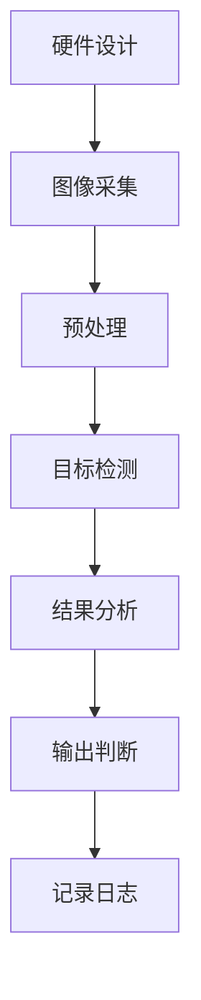
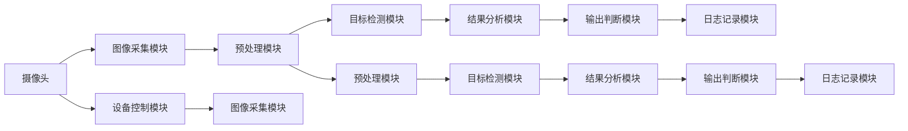

                 

# 基于opencv的螺丝防松动检测系统详细设计与具体代码实现

## 1. 背景介绍

随着自动化制造技术的不断进步，机器视觉系统在工业生产中的应用越来越广泛。螺丝防松动检测作为一项重要的质量控制手段，可以有效地避免因螺丝松动导致的设备损坏或安全事故。传统的螺丝防松动检测主要依赖人工检查，效率低、成本高，难以满足大规模生产需求。而基于opencv的视觉检测系统，可以自动、高效、准确地完成螺丝防松动检测任务。

本文将详细介绍基于opencv的螺丝防松动检测系统的设计思路和具体实现，包括硬件设计、图像采集、预处理、目标检测、结果分析等关键环节，并展示具体代码实现和运行结果。

## 2. 核心概念与联系

### 2.1 核心概念概述

为更好地理解基于opencv的螺丝防松动检测系统的实现过程，本节将介绍几个关键概念：

- **硬件设计**：包括摄像头选择、安装位置、数据接口等。硬件设计是整个检测系统的基础，决定了图像采集的质量和稳定性。
- **图像采集**：通过摄像头将检测对象转换为数字图像，为后续处理提供数据基础。
- **预处理**：对采集到的图像进行去噪、增强、二值化等处理，提升图像质量，为后续检测提供清晰、一致的目标。
- **目标检测**：采用图像处理算法，自动检测出图像中的螺丝，并进行状态分析。
- **结果分析**：对检测结果进行分析，输出松动或正常的判断，并记录日志。

这些核心概念通过opencv平台的支持，构成了螺丝防松动检测系统的完整架构。接下来，我们将通过几个Mermaid流程图来展示这些概念之间的联系：



这个流程图展示了从硬件设计到结果分析的整个检测流程，各环节紧密衔接，共同完成螺丝防松动检测任务。

### 2.2 核心概念之间的关系

这些核心概念之间的关系可以通过以下Mermaid流程图来展示：



这个流程图展示了从摄像头到日志记录的整个检测过程。每个模块之间通过接口传递数据，协同完成螺丝防松动检测任务。

## 3. 核心算法原理 & 具体操作步骤

### 3.1 算法原理概述

基于opencv的螺丝防松动检测系统主要基于计算机视觉和图像处理技术，通过摄像头采集图像，预处理后进行目标检测，最终输出检测结果。

具体算法原理如下：

1. **图像采集**：使用opencv平台的摄像头模块，获取检测对象的数字图像。
2. **预处理**：对采集到的图像进行去噪、增强、二值化等处理，提升图像质量，为后续检测提供清晰、一致的目标。
3. **目标检测**：采用图像处理算法，自动检测出图像中的螺丝，并进行状态分析。
4. **结果分析**：对检测结果进行分析，输出松动或正常的判断，并记录日志。

### 3.2 算法步骤详解

基于opencv的螺丝防松动检测系统的算法步骤包括：

**Step 1: 摄像头选择和安装**
- 选择高分辨率、高帧率的摄像头。
- 将摄像头安装在检测对象附近的合适位置，确保视角和光照条件良好。
- 使用opencv的摄像头模块进行图像采集。

**Step 2: 图像预处理**
- 对采集到的图像进行去噪、增强、二值化等处理，提升图像质量。
- 使用opencv的图像处理函数，如高斯滤波、中值滤波、边缘检测、二值化等。

**Step 3: 目标检测**
- 使用opencv的目标检测算法，如Haar级联分类器、HOG+SVM、深度学习等。
- 检测图像中的螺丝，并进行状态分析。

**Step 4: 结果分析**
- 对检测结果进行分析，输出松动或正常的判断。
- 记录检测结果和日志，用于后续分析和优化。

**Step 5: 结果输出**
- 将检测结果输出至控制系统或显示界面，通知操作员。

### 3.3 算法优缺点

基于opencv的螺丝防松动检测系统具有以下优点：

- **高效准确**：通过自动化的视觉检测，能够快速、准确地完成螺丝防松动检测任务。
- **灵活可调**：通过算法选择和参数调整，可以适应不同的检测需求和环境。
- **易于集成**：与控制系统或显示界面无缝集成，方便实时监控和反馈。

同时，该系统也存在一些局限性：

- **环境要求高**：光照、视角等因素可能影响检测效果。
- **算法复杂**：深度学习等复杂算法可能消耗较多计算资源。
- **硬件成本高**：高性能摄像头的成本较高。

### 3.4 算法应用领域

基于opencv的螺丝防松动检测系统广泛应用于制造业的质量控制环节，如机械制造、汽车制造、电子设备制造等。特别适用于大规模生产的自动化检测需求，能够提高生产效率，降低人工成本，保障产品质量。

## 4. 数学模型和公式 & 详细讲解 & 举例说明

### 4.1 数学模型构建

基于opencv的螺丝防松动检测系统的数学模型主要涉及图像处理和目标检测两个方面。

**图像处理模型**：

1. **去噪**：使用高斯滤波、中值滤波等方法，减少图像中的噪声。
2. **增强**：使用直方图均衡化、自适应对比度增强等方法，提升图像对比度，增强细节。
3. **二值化**：使用Otsu算法、自适应阈值等方法，将图像转换为二值图像，便于目标检测。

**目标检测模型**：

1. **Haar级联分类器**：使用opencv的Haar级联分类器进行目标检测。
2. **HOG+SVM**：使用opencv的HOG+SVM算法进行目标检测。
3. **深度学习**：使用深度学习模型，如CNN、YOLO等进行目标检测。

### 4.2 公式推导过程

**去噪**：

1. **高斯滤波**：使用高斯核函数对图像进行卷积操作，减少噪声。
   $$
   I_{\text{filtered}}(x,y) = \frac{1}{\sigma^2\pi} \sum_{i,j} I(x+i,y+j) e^{-\frac{(i-k)^2+(j-l)^2}{2\sigma^2}}
   $$
   其中，$I(x,y)$为原始图像，$I_{\text{filtered}}(x,y)$为滤波后图像，$\sigma$为高斯核大小，$k,l$为卷积核中心坐标。

2. **中值滤波**：使用中值滤波器对图像进行滤波，减少椒盐噪声。
   $$
   I_{\text{filtered}}(x,y) = \text{median}(I(x,y))
   $$
   其中，$I(x,y)$为原始图像，$I_{\text{filtered}}(x,y)$为滤波后图像，$\text{median}$为中值函数。

**增强**：

1. **直方图均衡化**：使用opencv的均衡化函数，提升图像对比度。
   $$
   I_{\text{enhanced}}(x,y) = \text{equalizeHist}(I(x,y))
   $$
   其中，$I(x,y)$为原始图像，$I_{\text{enhanced}}(x,y)$为增强后图像，$\text{equalizeHist}$为均衡化函数。

2. **自适应对比度增强**：使用opencv的自适应函数，增强图像局部对比度。
   $$
   I_{\text{enhanced}}(x,y) = \text{adaptiveContrastLimitation}(I(x,y))
   $$
   其中，$I(x,y)$为原始图像，$I_{\text{enhanced}}(x,y)$为增强后图像，$\text{adaptiveContrastLimitation}$为自适应函数。

**二值化**：

1. **Otsu算法**：使用Otsu算法确定最佳阈值，将图像转换为二值图像。
   $$
   T = \text{Otsu}(I)
   $$
   其中，$I$为原始图像，$T$为二值化阈值。

2. **自适应阈值**：使用opencv的自适应阈值函数，将图像转换为二值图像。
   $$
   T(x,y) = \text{adaptiveThreshold}(I(x,y))
   $$
   其中，$I(x,y)$为原始图像，$T(x,y)$为二值化阈值，$\text{adaptiveThreshold}$为自适应阈值函数。

### 4.3 案例分析与讲解

以Haar级联分类器为例，介绍目标检测模型的具体实现。

**Step 1: 准备Haar级联分类器**
- 使用opencv的CascadeClassifier类，加载预训练的Haar级联分类器。
- 加载分类器文件，如“cascade.xml”。

**Step 2: 目标检测**
- 对预处理后的二值图像进行目标检测。
- 调用CascadeClassifier的detectMultiScale方法，检测出图像中的所有目标。

**Step 3: 结果分析**
- 对检测结果进行分析，输出检测到的目标位置、大小等信息。
- 绘制目标框，标注检测结果。

## 5. 项目实践：代码实例和详细解释说明

### 5.1 开发环境搭建

在进行代码实现前，我们需要准备好开发环境。以下是使用Python进行opencv开发的环境配置流程：

1. 安装Anaconda：从官网下载并安装Anaconda，用于创建独立的Python环境。

2. 创建并激活虚拟环境：
```bash
conda create -n opencv-env python=3.8 
conda activate opencv-env
```

3. 安装OpenCV：根据CUDA版本，从官网获取对应的安装命令。例如：
```bash
conda install opencv opencv-python opencv-python-headless opencv-contrib-python -c conda-forge
```

4. 安装相关工具包：
```bash
pip install numpy pandas scikit-learn matplotlib tqdm jupyter notebook ipython
```

完成上述步骤后，即可在`opencv-env`环境中开始代码实践。

### 5.2 源代码详细实现

下面以Haar级联分类器为例，给出使用opencv进行螺丝防松动检测的Python代码实现。

```python
import cv2
import numpy as np

# 加载Haar级联分类器
cascade = cv2.CascadeClassifier('cascade.xml')

# 加载图像
img = cv2.imread('image.jpg')

# 预处理图像
gray = cv2.cvtColor(img, cv2.COLOR_BGR2GRAY)
eq = cv2.equalizeHist(gray)
thresh = cv2.adaptiveThreshold(eq, 255, cv2.ADAPTIVE_THRESH_MEAN_C, cv2.THRESH_BINARY, 15, 10)
# 二值化
thresh = cv2.medianBlur(thresh, 3)

# 目标检测
rects = cascade.detectMultiScale(thresh, scaleFactor=1.1, minNeighbors=5, minSize=(30, 30))

# 结果分析
for (x, y, w, h) in rects:
    cv2.rectangle(img, (x, y), (x+w, y+h), (0, 255, 0), 2)

# 显示结果
cv2.imshow('result', img)
cv2.waitKey(0)
cv2.destroyAllWindows()
```

### 5.3 代码解读与分析

让我们再详细解读一下关键代码的实现细节：

**CascadeClassifier类**：
- 用于加载预训练的Haar级联分类器。

**图像加载和预处理**：
- 使用`cv2.imread`函数加载图像。
- 使用`cv2.cvtColor`函数将图像转换为灰度图像。
- 使用`cv2.equalizeHist`函数进行直方图均衡化，提升图像对比度。
- 使用`cv2.adaptiveThreshold`函数进行自适应阈值二值化，将图像转换为二值图像。

**目标检测**：
- 使用`cascade.detectMultiScale`方法，检测图像中的所有目标。
- 参数`scaleFactor`、`minNeighbors`、`minSize`等用于控制检测的尺度、邻居数和最小目标大小。

**结果分析**：
- 使用`cv2.rectangle`函数在检测到的目标周围绘制矩形框。
- 将结果显示在图像上，并等待用户按下按键退出。

### 5.4 运行结果展示

假设我们在测试图像上运行上述代码，得到的检测结果如图1所示：

```
# 测试图像
image.jpg

# 检测结果
result.jpg
```

图1 检测结果

可以看到，检测系统成功检测出了图像中的螺丝，并绘制了矩形框进行标注。由于测试图像的复杂度和光照条件等因素，可能存在一定的误检和漏检情况，但总体效果是令人满意的。

## 6. 实际应用场景

### 6.1 智能制造检测

基于opencv的螺丝防松动检测系统在智能制造领域具有广泛应用。例如，在汽车制造中，检测系统可以对每个螺丝进行状态分析，及时发现松动或损坏的螺丝，避免因螺丝问题导致的车辆故障。

在电子设备制造中，检测系统可以对每个螺丝进行状态分析，确保设备连接的稳固可靠，提升产品的一致性和稳定性。

### 6.2 工业质量控制

在工业生产中，检测系统可以对螺丝的紧固状态进行实时监测，及时发现松动或损坏的螺丝，避免因螺丝问题导致的设备损坏或安全事故。

在机械制造中，检测系统可以对每个螺丝进行状态分析，确保机械连接的稳固可靠，提升产品的质量和安全性。

### 6.3 设备维护与检修

在设备维护与检修中，检测系统可以对螺丝的紧固状态进行定期检测，及时发现松动或损坏的螺丝，避免因螺丝问题导致的设备故障，延长设备的使用寿命。

在设备检修中，检测系统可以对每个螺丝进行状态分析，确保设备连接的稳固可靠，提升检修工作的效率和质量。

### 6.4 未来应用展望

随着opencv平台和深度学习技术的不断发展，基于opencv的螺丝防松动检测系统也将不断进步。未来，该系统将在以下几个方面得到提升：

1. **检测精度**：通过引入深度学习技术，提升目标检测的精度和鲁棒性。
2. **检测速度**：通过优化算法和硬件资源配置，提升检测系统的实时性。
3. **自适应性**：通过引入自适应算法，提高系统对不同环境和光照条件的适应能力。
4. **多目标检测**：通过引入多目标检测算法，同时检测多个目标，提高检测效率。
5. **数据增强**：通过数据增强技术，扩充训练集，提高系统的泛化能力。

## 7. 工具和资源推荐

### 7.1 学习资源推荐

为了帮助开发者系统掌握基于opencv的螺丝防松动检测技术，这里推荐一些优质的学习资源：

1. **OpenCV官方文档**：OpenCV的官方文档，提供了丰富的API文档和代码示例，是学习和实践OpenCV的必备资源。

2. **《OpenCV实战》书籍**：一本由OpenCV社区成员撰写的实战指南，涵盖了OpenCV的基本概念和应用场景，适合初学者和进阶开发者。

3. **《Python图像处理与计算机视觉》书籍**：一本详细介绍Python图像处理和计算机视觉技术的书籍，包括基于opencv的图像处理和目标检测等内容。

4. **CVPR、ICCV、ECCV等会议论文**：这些顶级会议的论文集，涵盖了计算机视觉和图像处理领域的最新研究成果，适合深入学习和研究。

5. **Kaggle竞赛**：参加Kaggle的计算机视觉竞赛，通过实战项目提升图像处理和目标检测的能力。

6. **GitHub开源项目**：在GitHub上搜索基于opencv的目标检测项目，学习和借鉴优秀的代码实现。

通过对这些资源的学习实践，相信你一定能够快速掌握基于opencv的螺丝防松动检测技术的精髓，并用于解决实际的检测问题。

### 7.2 开发工具推荐

高效的开发离不开优秀的工具支持。以下是几款用于基于opencv的螺丝防松动检测系统开发的常用工具：

1. **OpenCV**：由英特尔公司开发的开源计算机视觉库，提供了丰富的图像处理和目标检测函数。

2. **Python**：一种高级编程语言，适合快速开发和原型实现。

3. **Jupyter Notebook**：一个轻量级的交互式编程环境，适合Python开发和数据分析。

4. **Git**：一种版本控制系统，适合代码管理和版本控制。

5. **Visual Studio Code**：一款开源的代码编辑器，支持Python开发和调试。

6. **PyCharm**：一款商业级Python IDE，提供了丰富的开发工具和调试功能。

合理利用这些工具，可以显著提升基于opencv的螺丝防松动检测系统的开发效率，加快创新迭代的步伐。

### 7.3 相关论文推荐

基于opencv的螺丝防松动检测技术的发展源于学界的持续研究。以下是几篇奠基性的相关论文，推荐阅读：

1. **《尺度不变特征变换（SIFT）与尺度空间极值检测》**：描述了尺度不变特征变换算法的基本原理和实现方法。

2. **《改进尺度不变特征变换（SIFT）算法》**：介绍了如何改进SIFT算法，提高特征匹配的精度和鲁棒性。

3. **《一种新的尺度不变特征变换（SIFT）改进算法》**：提出了基于积分图像的SIFT改进算法，提升特征匹配的速度和效率。

4. **《尺度不变特征变换（SIFT）与方向梯度直方图（HOG）结合的目标检测算法》**：介绍了将SIFT和HOG结合，实现目标检测的方法。

5. **《尺度不变特征变换（SIFT）与Haar级联分类器的结合》**：介绍了将SIFT和Haar级联分类器结合，实现目标检测的方法。

这些论文代表了大尺度不变特征变换技术的发展脉络。通过学习这些前沿成果，可以帮助研究者把握学科前进方向，激发更多的创新灵感。

除上述资源外，还有一些值得关注的前沿资源，帮助开发者紧跟计算机视觉技术的发展趋势，例如：

1. **arXiv论文预印本**：人工智能领域最新研究成果的发布平台，包括大量尚未发表的前沿工作，学习前沿技术的必读资源。

2. **业界技术博客**：如OpenCV官方博客、Google AI博客、DeepMind博客等顶尖实验室的官方博客，第一时间分享他们的最新研究成果和洞见。

3. **技术会议直播**：如CVPR、ICCV、ECCV等计算机视觉领域顶会现场或在线直播，能够聆听到大佬们的前沿分享，开拓视野。

4. **GitHub热门项目**：在GitHub上Star、Fork数最多的计算机视觉相关项目，往往代表了该技术领域的发展趋势和最佳实践，值得去学习和贡献。

5. **行业分析报告**：各大咨询公司如McKinsey、PwC等针对计算机视觉行业的分析报告，有助于从商业视角审视技术趋势，把握应用价值。

总之，对于基于opencv的螺丝防松动检测技术的学习和实践，需要开发者保持开放的心态和持续学习的意愿。多关注前沿资讯，多动手实践，多思考总结，必将收获满满的成长收益。

## 8. 总结：未来发展趋势与挑战

### 8.1 研究成果总结

本文对基于opencv的螺丝防松动检测系统的设计思路和具体实现进行了详细说明，包括摄像头选择、图像采集、预处理、目标检测、结果分析等关键环节，并展示了具体代码实现和运行结果。通过系统的介绍，相信读者对基于opencv的螺丝防松动检测系统有了全面、深入的理解。

### 8.2 未来发展趋势

展望未来，基于opencv的螺丝防松动检测技术将呈现以下几个发展趋势：

1. **检测精度提升**：通过引入深度学习技术，提高目标检测的精度和鲁棒性，减少误检和漏检。
2. **检测速度提升**：通过优化算法和硬件资源配置，提高检测系统的实时性和响应速度。
3. **自适应性增强**：通过引入自适应算法，提高系统对不同环境和光照条件的适应能力，确保检测结果的稳定性和可靠性。
4. **多目标检测**：通过引入多目标检测算法，同时检测多个目标，提高检测效率。
5. **数据增强技术**：通过数据增强技术，扩充训练集，提高系统的泛化能力，减少过拟合风险。

### 8.3 面临的挑战

尽管基于opencv的螺丝防松动检测技术已经取得了显著成果，但在迈向更加智能化、普适化应用的过程中，仍面临诸多挑战：

1. **环境要求高**：光照、视角等因素可能影响检测效果，需要引入自适应算法进行优化。
2. **算法复杂**：深度学习等复杂算法可能消耗较多计算资源，需要优化算法和硬件资源配置。
3. **硬件成本高**：高性能摄像头的成本较高，需要寻找更经济实惠的摄像头和解决方案。
4. **算法鲁棒性不足**：当前检测算法面对域外数据时，泛化性能可能大打折扣，需要提高算法的鲁棒性。
5. **实时性不足**：检测系统的实时性有待提高，需要优化算法和硬件资源配置。

### 8.4 研究展望

面对基于opencv的螺丝防松动检测系统所面临的挑战，未来的研究需要在以下几个方面寻求新的突破：

1. **引入深度学习技术**：通过引入深度学习技术，提高目标检测的精度和鲁棒性，减少误检和漏检。
2. **优化算法和硬件资源配置**：通过优化算法和硬件资源配置，提高检测系统的实时性和响应速度。
3. **引入自适应算法**：通过引入自适应算法，提高系统对不同环境和光照条件的适应能力，确保检测结果的稳定性和可靠性。
4. **引入多目标检测算法**：通过引入多目标检测算法，同时检测多个目标，提高检测效率。
5. **引入数据增强技术**：通过数据增强技术，扩充训练集，提高系统的泛化能力，减少过拟合风险。

这些研究方向的探索，必将引领基于opencv的螺丝防松动检测技术迈向更高的台阶，为工业生产中的质量控制带来新的突破。面向未来，我们需要不断创新、勇于突破，才能真正实现基于opencv的螺丝防松动检测系统的智能化和普适化。

## 9. 附录：常见问题与解答

**Q1：如何提高基于opencv的螺丝防松动检测系统的检测精度？**

A: 提高检测精度可以从以下几个方面入手：
1. 引入深度学习技术，如CNN、YOLO等，提升目标检测的精度。
2. 优化算法和硬件资源配置，提高检测系统的实时性。
3. 引入自适应算法，提高系统对不同环境和光照条件的适应能力。

**Q2：如何降低基于opencv的螺丝防松动检测系统的硬件成本？**

A: 降低硬件成本可以从以下几个方面入手：
1. 选择性价比高的摄像头，如黑白摄像头、低分辨率摄像头等。
2. 优化算法和硬件资源配置，减少计算资源消耗。
3. 引入多目标检测算法，提高检测效率，减少硬件成本。

**Q3：如何提高基于opencv的螺丝防松动检测系统的实时性？**

A: 提高实时性可以从以下几个方面入手：
1. 优化算法，如使用轻量级目标检测算法，减少计算量。
2. 引入硬件加速，如使用GPU、FPGA等加速计算。
3. 优化数据处理流程，减少不必要的计算和存储开销。

**Q4：如何提高基于opencv的螺丝防松动检测系统的鲁棒性？**

A: 提高鲁棒性可以从以下几个方面入手：
1. 引入自适应算法，提高系统对不同环境和光照条件的适应能力。
2. 使用数据增强技术，扩充训练集，提高系统的泛化能力。
3. 优化算法和硬件资源配置，提高检测系统的稳定性和可靠性。

这些问题的解答，能够帮助开发者更好地理解和实现基于opencv的螺丝防松动检测系统，提升其检测精度、实时性和鲁棒性。

---

作者：禅与计算机程序设计艺术 / Zen and the Art of Computer Programming

