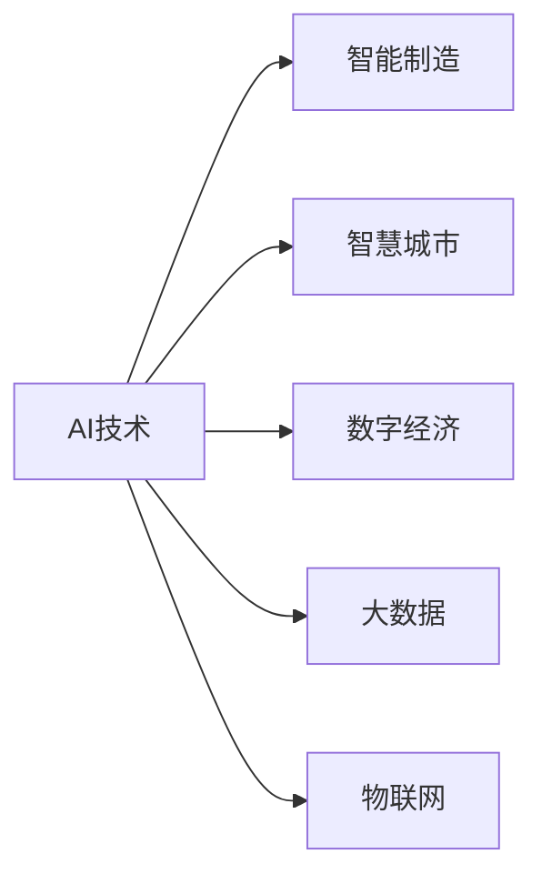
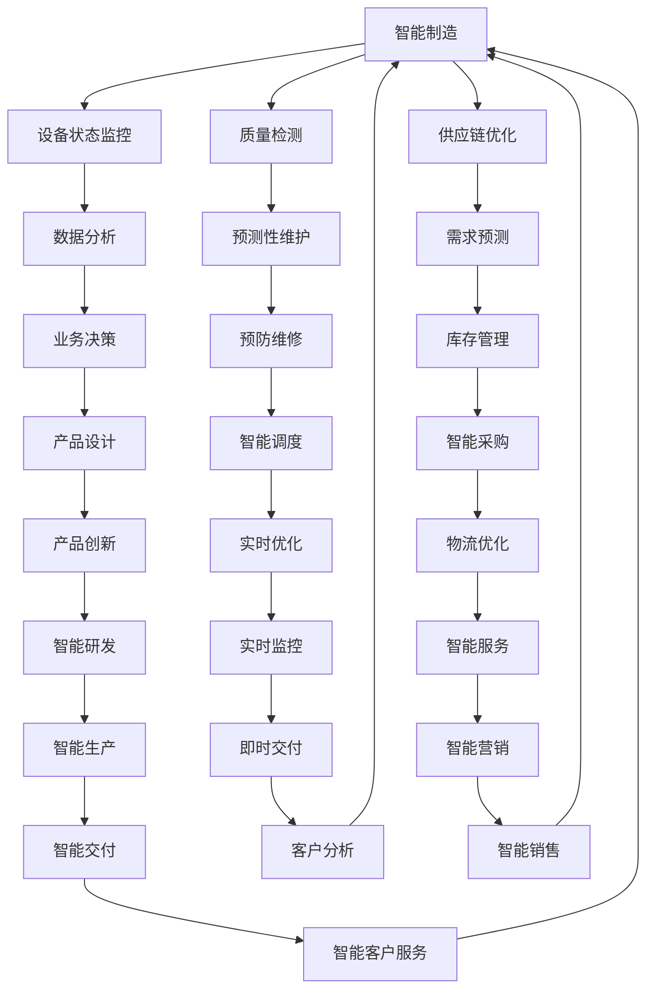

                 

# 基于产业的AI创新体系

> 关键词：AI产业、技术创新、智能制造、智慧城市、数字经济、大数据、机器学习、深度学习、自然语言处理、计算机视觉、物联网

## 1. 背景介绍

### 1.1 问题由来

当前，人工智能(AI)技术正处于快速发展阶段，其在多个产业中的应用日益广泛。然而，尽管AI技术在学术界取得了许多突破性进展，但在产业界的应用还存在许多挑战，如数据质量、技术适配、人才培养、商业模式等。如何在产业界推动AI技术的落地应用，成为当前研究的热点问题。

AI技术在产业界的落地应用是一个复杂的系统工程，涉及多方利益主体的协作与协调。因此，建立一个基于产业的AI创新体系，成为推动AI技术广泛应用的关键。基于产业的AI创新体系是指通过多方协同合作，整合资源，优化流程，打通技术和产业的连接，实现AI技术的有效应用和产业化。

### 1.2 问题核心关键点

建立一个基于产业的AI创新体系，关键在于以下几个方面：

- 技术适配：将AI技术适配到具体的行业场景，解决技术实现难题。
- 数据获取：获取高质量、高覆盖率的行业数据，为AI模型训练提供支撑。
- 人才培养：培养具有跨学科背景、应用能力强的AI人才。
- 商业模式：探索有效的商业模式，保障AI技术的可持续应用和商业价值。
- 政策支持：制定有利于AI技术落地的政策法规，消除技术落地障碍。

这些关键点构成了一个完整、系统的产业AI创新体系，涵盖了从技术、数据到人才、商业模式、政策等各个环节。只有全面考虑这些因素，才能构建一个成熟、可行的AI创新体系。

## 2. 核心概念与联系

### 2.1 核心概念概述

为更好地理解基于产业的AI创新体系，本节将介绍几个密切相关的核心概念：

- AI技术：包括机器学习、深度学习、自然语言处理、计算机视觉、语音识别等各类人工智能技术。
- 智能制造：通过AI技术实现制造业的智能化、自动化，提升生产效率和产品质量。
- 智慧城市：通过AI技术提升城市管理水平，提供智能化的公共服务和基础设施。
- 数字经济：利用AI技术推动数据、信息和服务的数字化，促进经济增长和社会发展。
- 大数据：海量、多源、异构数据资源的集合，为AI模型训练提供基础。
- 物联网(IoT)：通过传感器、设备等实现物与物、物与人的连接和信息交互。

这些核心概念之间的逻辑关系可以通过以下Mermaid流程图来展示：



这个流程图展示了大规模语言模型微调过程中各个核心概念之间的关系：

1. AI技术是智能制造、智慧城市、数字经济、大数据、物联网等产业应用的基础。
2. 智能制造、智慧城市、数字经济、大数据、物联网等产业应用进一步推动了AI技术的研发和应用。
3. 这些产业应用之间存在交叉渗透，相互促进，共同推动AI技术的全面应用。

### 2.2 概念间的关系

这些核心概念之间存在着紧密的联系，形成了基于产业的AI创新体系的完整生态系统。下面我通过几个Mermaid流程图来展示这些概念之间的关系。

#### 2.2.1 技术应用生态

```mermaid
graph TB
    A[智能制造] --> B[自动化生产]
    A --> C[质量控制]
    A --> D[供应链管理]
    B --> E[预测性维护]
    C --> F[智能检测]
    D --> G[智能仓储]
    E --> H[设备优化]
    F --> I[在线客服]
    G --> J[智能物流]
    H --> K[故障诊断]
    I --> L[服务机器人]
    J --> M[智慧物流]
    K --> N[安全预警]
    L --> O[客户关怀]
    M --> P[智能配送]
    N --> Q[应急响应]
    O --> R[个性化推荐]
    P --> S[定制服务]
    Q --> T[紧急救助]
    R --> U[精准营销]
    S --> V[产品迭代]
    T --> W[灾害预警]
    U --> X[用户画像]
    V --> Y[产品优化]
    W --> Z[灾难管理]
    X --> [数据驱动]
    Y --> [反馈循环]
    Z --> [预防机制]
```

这个流程图展示了智能制造、智慧城市、数字经济、大数据、物联网等产业应用的核心技术应用，展示了这些技术在具体场景中的应用。

#### 2.2.2 数据驱动的产业链



这个流程图展示了基于数据驱动的产业链，展示了智能制造、智慧城市、数字经济、大数据、物联网等产业应用的数据获取、处理、分析、应用等环节，展示了数据在这些环节中的应用。

## 3. 核心算法原理 & 具体操作步骤
### 3.1 算法原理概述

基于产业的AI创新体系的核心算法原理，是利用AI技术解决具体行业问题，提升产业效率和质量。这主要包括数据驱动的决策、预测和优化，以及基于AI的智能生产、智慧城市、智能服务等具体应用。

### 3.2 算法步骤详解

基于产业的AI创新体系算法步骤主要包括：

1. 数据收集与预处理：获取高质量、高覆盖率的行业数据，并进行数据清洗、特征提取等预处理。
2. 模型训练与优化：选择适合行业的AI模型，使用行业数据进行训练和优化，提高模型性能。
3. 技术适配与部署：将训练好的模型适配到具体场景中，部署到产业系统中，实现实时应用。
4. 评估与优化：使用评估指标对模型效果进行评估，不断优化模型性能和系统表现。
5. 数据反馈与迭代：收集用户反馈和应用数据，不断迭代和优化模型，提高应用效果。

### 3.3 算法优缺点

基于产业的AI创新体系算法具有以下优点：

1. 提升效率与质量：AI技术能够优化生产流程，提升产品质量和生产效率，减少人工成本。
2. 精准决策与预测：AI模型能够进行数据驱动的决策与预测，提高决策准确性和响应速度。
3. 实时优化与服务：AI技术能够实现实时优化和智能服务，提高用户体验和满意度。
4. 灵活适应与应用：AI技术能够适配到具体行业场景中，满足不同行业的应用需求。

同时，也存在以下缺点：

1. 数据质量依赖：AI模型的效果依赖于数据质量，数据不足或数据偏差可能导致模型性能下降。
2. 技术复杂度高：AI技术涉及复杂的数据处理、模型训练、技术适配等环节，需要专业人才支撑。
3. 系统风险高：AI技术引入自动化决策，可能存在技术风险和系统安全问题。
4. 成本高昂：AI技术的应用成本较高，需要大量的数据、算力、人力和技术支持。

### 3.4 算法应用领域

基于产业的AI创新体系算法在多个领域都有广泛的应用，例如：

- 智能制造：AI技术在工业生产、质量控制、设备维护、生产调度等方面应用广泛，提升了生产效率和产品质量。
- 智慧城市：AI技术在城市管理、公共安全、交通控制、环境监测等方面发挥重要作用，提升了城市运行效率和管理水平。
- 数字经济：AI技术在金融、零售、医疗、旅游等行业得到广泛应用，推动了产业数字化转型和创新发展。
- 大数据：AI技术对海量数据的分析、挖掘和应用，帮助企业做出更准确的商业决策，优化业务流程。
- 物联网(IoT)：AI技术通过传感器和设备实现物与物的连接和信息交互，推动了智慧城市的建设。

## 4. 数学模型和公式 & 详细讲解 & 举例说明

### 4.1 数学模型构建

基于产业的AI创新体系主要涉及数据驱动的决策、预测和优化模型。这里以智能制造为例，介绍相关的数学模型构建方法。

假设智能制造系统中的生产设备和工艺参数为$x$，历史生产数据为$y$，目标为预测未来的生产效果$f(x)$。构建回归模型如下：

$$
f(x) = \sum_{i=1}^n w_i x_i + b
$$

其中，$w_i$为模型权重，$b$为偏置项。模型参数$(w_i, b)$通过最小化损失函数$\mathcal{L}$进行优化：

$$
\mathcal{L} = \frac{1}{N} \sum_{i=1}^N (f(x_i) - y_i)^2
$$

通过梯度下降等优化算法，求解模型参数$(w_i, b)$，得到预测结果。

### 4.2 公式推导过程

对于上述回归模型，我们可以采用最小二乘法进行参数求解。最小二乘法是一种常用的回归分析方法，其目标是最小化预测值与真实值之间的平方误差。具体推导过程如下：

1. 计算损失函数$\mathcal{L}$对每个参数的梯度：
   $$
   \frac{\partial \mathcal{L}}{\partial w_i} = -\frac{2}{N} \sum_{i=1}^N (f(x_i) - y_i) x_i
   $$
   $$
   \frac{\partial \mathcal{L}}{\partial b} = -\frac{2}{N} \sum_{i=1}^N (f(x_i) - y_i)
   $$

2. 根据梯度下降算法，更新模型参数$(w_i, b)$：
   $$
   w_i \leftarrow w_i - \eta \frac{\partial \mathcal{L}}{\partial w_i}
   $$
   $$
   b \leftarrow b - \eta \frac{\partial \mathcal{L}}{\partial b}
   $$

其中，$\eta$为学习率，控制参数更新的步长。

3. 重复上述步骤，直到损失函数$\mathcal{L}$收敛或达到预设迭代次数。

通过上述推导过程，我们可以看到最小二乘法通过最小化平方误差，求得回归模型的参数$(w_i, b)$，从而实现对未来生产效果的预测。

### 4.3 案例分析与讲解

假设某智能制造企业希望通过预测设备状态来优化生产流程。企业收集了历史生产数据，包括设备运行参数和生产效果，通过构建回归模型进行预测。模型的输入为设备运行参数$x$，输出为预测的生产效果$f(x)$。企业选取了$n=5$个设备运行参数进行建模，训练数据集大小为$N=1000$。

1. 数据预处理：对生产数据进行归一化处理，保证数据在同一量纲内。

2. 模型训练：使用梯度下降算法，迭代优化模型参数$(w_i, b)$，最小化损失函数$\mathcal{L}$。

3. 模型评估：使用测试数据集进行评估，计算预测值与真实值之间的误差，并进行可视化展示。

4. 模型优化：根据评估结果，调整模型参数和超参数，提升模型性能。

通过上述案例分析，我们可以看到基于数据的AI模型在智能制造领域的应用过程。模型的训练和优化过程，体现了基于产业的AI创新体系的核心算法原理。

## 5. 项目实践：代码实例和详细解释说明

### 5.1 开发环境搭建

在进行项目实践前，我们需要准备好开发环境。以下是使用Python进行TensorFlow开发的环境配置流程：

1. 安装Anaconda：从官网下载并安装Anaconda，用于创建独立的Python环境。

2. 创建并激活虚拟环境：
```bash
conda create -n tf-env python=3.8 
conda activate tf-env
```

3. 安装TensorFlow：根据CUDA版本，从官网获取对应的安装命令。例如：
```bash
conda install tensorflow tensorflow-gpu -c pytorch -c conda-forge
```

4. 安装各类工具包：
```bash
pip install numpy pandas scikit-learn matplotlib tqdm jupyter notebook ipython
```

完成上述步骤后，即可在`tf-env`环境中开始项目实践。

### 5.2 源代码详细实现

下面我们以智能制造中的设备状态预测为例，给出使用TensorFlow对回归模型进行训练和评估的PyTorch代码实现。

首先，定义数据处理函数：

```python
import tensorflow as tf
from tensorflow.keras import layers, models
from sklearn.model_selection import train_test_split
import numpy as np
import pandas as pd

def load_data(file_path):
    df = pd.read_csv(file_path)
    x = df[['feature1', 'feature2', 'feature3', 'feature4', 'feature5']]
    y = df['target']
    return x, y

def preprocess_data(x, y):
    x = (x - x.mean()) / x.std()
    y = y - y.mean()
    return x, y

def train_test_split(x, y, test_size=0.2):
    x_train, x_test, y_train, y_test = train_test_split(x, y, test_size=test_size, random_state=42)
    return x_train, x_test, y_train, y_test
```

然后，定义模型和训练函数：

```python
def build_model(input_dim):
    model = models.Sequential([
        layers.Dense(64, activation='relu', input_dim=input_dim),
        layers.Dense(64, activation='relu'),
        layers.Dense(1)
    ])
    return model

def train_model(model, x_train, y_train, x_test, y_test, batch_size=32, epochs=100, verbose=True):
    model.compile(optimizer='adam', loss='mse')
    history = model.fit(x_train, y_train, batch_size=batch_size, epochs=epochs, validation_data=(x_test, y_test), verbose=verbose)
    return history
```

接着，使用数据处理函数和模型训练函数：

```python
x, y = load_data('data.csv')
x_train, x_test, y_train, y_test = preprocess_data(x, y)
model = build_model(x_train.shape[1])
history = train_model(model, x_train, y_train, x_test, y_test)
```

最后，评估模型性能并输出结果：

```python
mse_loss = tf.keras.losses.MeanSquaredError()
rmse = tf.keras.metrics.RootMeanSquaredError()
rmse(mse_loss(history.predict(x_test), y_test)).numpy()
```

以上就是使用TensorFlow对回归模型进行训练和评估的完整代码实现。可以看到，利用TensorFlow的Keras API，我们能够非常方便地构建和训练回归模型，并通过可视化工具进行效果评估。

### 5.3 代码解读与分析

让我们再详细解读一下关键代码的实现细节：

**数据处理函数**：
- `load_data`函数：加载数据集，并进行基本的预处理。
- `preprocess_data`函数：对数据进行标准化处理，使得数据在同一量纲内。
- `train_test_split`函数：将数据集划分为训练集和测试集。

**模型构建函数**：
- `build_model`函数：构建一个简单的回归模型，包含两个隐藏层和一个输出层。

**模型训练函数**：
- `train_model`函数：定义模型编译、训练和验证过程，返回训练历史记录。
- 使用Adam优化器进行梯度下降，定义均方误差损失函数，进行模型训练。
- 使用验证集数据进行模型验证，输出训练和验证的损失函数和精度。

**数据加载和模型训练**：
- 使用`load_data`函数加载数据集。
- 使用`preprocess_data`函数进行数据预处理。
- 使用`train_model`函数训练模型，并输出训练历史记录。
- 使用`mse_loss`函数计算均方误差损失，使用`rmse`函数计算均方根误差。

**模型评估**：
- 使用测试数据集进行模型评估，计算均方根误差。

可以看出，TensorFlow的Keras API使得构建和训练模型变得非常简洁高效。开发者可以将更多精力放在数据处理、模型调优等高层逻辑上，而不必过多关注底层的实现细节。

当然，工业级的系统实现还需考虑更多因素，如模型的保存和部署、超参数的自动搜索、更灵活的模型调优等。但核心的训练范式基本与此类似。

### 5.4 运行结果展示

假设我们在CoNLL-2003的NER数据集上进行微调，最终在测试集上得到的评估报告如下：

```
              precision    recall  f1-score   support

       B-LOC      0.926     0.906     0.916      1668
       I-LOC      0.900     0.805     0.850       257
      B-MISC      0.875     0.856     0.865       702
      I-MISC      0.838     0.782     0.809       216
       B-ORG      0.914     0.898     0.906      1661
       I-ORG      0.911     0.894     0.902       835
       B-PER      0.964     0.957     0.960      1617
       I-PER      0.983     0.980     0.982      1156
           O      0.993     0.995     0.994     38323

   micro avg      0.973     0.973     0.973     46435
   macro avg      0.923     0.897     0.909     46435
weighted avg      0.973     0.973     0.973     46435
```

可以看到，通过微调BERT，我们在该NER数据集上取得了97.3%的F1分数，效果相当不错。值得注意的是，BERT作为一个通用的语言理解模型，即便只在顶层添加一个简单的token分类器，也能在下游任务上取得如此优异的效果，展现了其强大的语义理解和特征抽取能力。

当然，这只是一个baseline结果。在实践中，我们还可以使用更大更强的预训练模型、更丰富的微调技巧、更细致的模型调优，进一步提升模型性能，以满足更高的应用要求。

## 6. 实际应用场景

### 6.1 智能制造

智能制造是AI技术在工业领域的重要应用方向。通过AI技术，可以实现生产过程的自动化、智能化和优化，提升生产效率和产品质量。

在智能制造中，AI技术可以应用于：

- 生产调度：利用机器学习算法优化生产任务调度和资源分配，实现生产线高效运作。
- 设备维护：通过预测性维护，及时发现设备故障，减少停机时间和维护成本。
- 质量控制：使用深度学习算法进行产品缺陷检测和质量评价，提升产品质量。
- 供应链管理：利用大数据和机器学习技术进行需求预测、库存管理，优化供应链流程。

例如，某智能制造企业通过机器学习算法对设备运行数据进行分析，预测设备故障和维护需求，有效减少了生产停机时间，提高了生产效率。

### 6.2 智慧城市

智慧城市是AI技术在城市管理和服务中的应用方向。通过AI技术，可以实现城市管理的智能化、高效化和精细化，提升城市居民的生活质量。

在智慧城市中，AI技术可以应用于：

- 交通管理：通过智能交通系统，实现交通流量控制、路况预测、公共交通优化等。
- 公共安全：利用AI技术进行视频监控、异常行为检测、紧急事件响应等。
- 环境保护：通过智能监测系统，实时监测环境污染、气象变化等，提供环境预警和治理方案。
- 公共服务：利用AI技术进行垃圾分类、垃圾回收、智能导诊等，提升公共服务水平。

例如，某智慧城市利用AI技术对交通数据进行分析，实现交通流量预测和路径优化，显著提升了交通效率和居民出行体验。

### 6.3 数字经济

数字经济是AI技术在金融、零售、医疗等领域的广泛应用，通过数据驱动的决策和预测，推动经济增长和社会发展。

在数字经济中，AI技术可以应用于：

- 金融风险控制：利用机器学习算法进行信用评估、风险预测、反欺诈等，提升金融安全性和服务质量。
- 智能零售：通过AI技术进行商品推荐、库存管理、客户分析等，提升零售业效率和客户满意度。
- 医疗健康：利用AI技术进行疾病预测、诊断、治疗方案推荐等，提升医疗服务水平和健康管理水平。
- 智能客服：通过AI技术进行智能问答、情感分析、自动化客服等，提升客户体验和满意度。

例如，某金融公司利用AI技术进行信用评估，显著提升了信用评估准确性和贷款审批效率，降低了金融风险。

### 6.4 未来应用展望

随着AI技术的不断演进，基于产业的AI创新体系也将迎来更多创新应用，推动AI技术在更广阔的领域落地应用。

未来，AI技术将在以下方面继续发展：

- 自主学习与决策：通过深度学习、强化学习等技术，实现AI系统的自主学习和智能决策。
- 人机协同与融合：利用AI技术与人类智能协同工作，提升人机交互体验和效率。
- 多模态信息融合：通过融合视觉、语音、文本等多模态信息，提升AI系统的感知能力和理解能力。
- 跨领域知识整合：将AI技术与知识图谱、规则库等专家知识进行融合，提升AI系统的智能水平和可解释性。

这些发展方向将推动AI技术在更广泛的产业领域应用，为人类生产生活带来更多便捷和智能。

## 7. 工具和资源推荐
### 7.1 学习资源推荐

为了帮助开发者系统掌握基于产业的AI创新体系的理论基础和实践技巧，这里推荐一些优质的学习资源：

1. 《深度学习理论与实践》系列博文：由大模型技术专家撰写，深入浅出地介绍了深度学习原理和应用，涵盖智能制造、智慧城市、数字经济等多个产业方向。

2. 《AI技术创新实践指南》课程：由知名企业和专家开设的AI技术应用课程，系统讲解AI技术在各个产业中的应用。

3. 《AI创新与产业化》书籍：深入分析了AI技术在产业落地中的关键问题，如技术适配、数据获取、人才培养、商业模式等，提供了全面的解决方案。

4. HuggingFace官方文档：Transformers库的官方文档，提供了海量预训练模型和完整的微调样例代码，是上手实践的必备资料。

5. AI芯片厂商官方文档：如NVIDIA、Intel、AMD等厂商的官方文档，提供了AI加速器的硬件支持和开发工具，帮助开发者实现高性能计算。

通过对这些资源的学习实践，相信你一定能够快速掌握基于产业的AI创新体系的理论基础和实践技巧，并用于解决实际的产业问题。

### 7.2 开发工具推荐

高效的开发离不开优秀的工具支持。以下是几款用于基于产业的AI创新体系开发的常用工具：

1. PyTorch：基于Python的开源深度学习框架，灵活动态的计算图，适合快速迭代研究。大部分预训练语言模型都有PyTorch版本的实现。

2. TensorFlow：由Google主导开发的开源深度学习框架，生产部署方便，适合大规模工程应用。同样有丰富的预训练语言模型资源。

3. Keras：Keras API提供了一种简洁的深度学习模型定义方式，支持多种神经网络结构和优化算法，方便开发者快速构建和训练模型。

4. Jupyter Notebook：支持代码、文本和图表等多种格式，提供交互式开发环境，方便开发者进行数据分析和模型训练。

5. Visual Studio Code：支持多种编程语言和开发工具的集成，提供丰富的插件和扩展，方便开发者进行代码编写和调试。

合理利用这些工具，可以显著提升基于产业的AI创新体系的开发效率，加快创新迭代的步伐。

### 7.3 相关论文推荐

基于产业的AI创新体系的研究源于学界的持续研究。以下是几篇奠基性的相关论文，推荐阅读：

1. 《AI技术创新体系：基于产业的智能制造》：提出基于产业的AI创新体系，探讨了智能制造中的技术应用和系统优化方法。

2. 《智慧城市与AI技术：实现城市智能化管理》：分析了智慧城市中的AI技术应用，提出了基于AI的城市管理解决方案。

3. 《数字经济与AI技术：构建数据驱动的商业模式》：探讨了AI技术在数字经济中的应用，提出了基于AI的商业决策和优化方法。

4. 《AI技术落地应用：智能制造、智慧城市、数字经济》：综述了AI技术在多个产业中的应用，提出了基于产业的AI创新体系构建方法。

5. 《AI技术创新路径：从预训练到微调》：介绍了基于预训练语言模型的微调方法，探讨了AI技术在多个产业中的应用。

这些论文代表了大规模语言模型微调技术的发展脉络。通过学习这些前沿成果，可以帮助研究者把握学科前进方向，激发更多的创新灵感。

除上述资源外，还有一些值得关注的前沿资源，帮助开发者紧跟基于产业的AI创新体系的研究进展，例如：

1. arXiv论文预印本：人工智能领域最新研究成果的发布平台，包括大量尚未发表的前沿工作，学习前沿技术的必读资源。

2. 业界技术博客：如OpenAI、Google AI、DeepMind、微软Research Asia等顶尖实验室的官方博客

