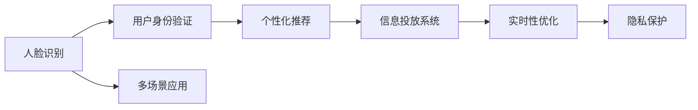

                 

# 基于人脸识别的多场景信息投放系统实现及应用

> 关键词：人脸识别, 信息投放系统, 多场景应用, 个性化推荐, 实时性, 隐私保护, 广告优化

## 1. 背景介绍

### 1.1 问题由来
随着互联网技术的飞速发展，信息投放市场日益繁荣。传统的基于点击量计费（CPM）、点击率（CTR）计费等模式已无法满足商业化需求，如今越来越多的企业尝试通过更加精准和个性化的方式进行信息投放，以提高广告效果和用户满意度。

其中，人脸识别技术由于其高准确性和非侵入性等优势，正逐渐成为信息投放的重要手段。人脸识别技术可以实现实时定位用户身份，并根据用户特征进行个性化推荐和广告投放，带来精准营销的崭新机遇。

### 1.2 问题核心关键点
本文聚焦于基于人脸识别的多场景信息投放系统，将探讨系统架构、核心算法及其实现细节，并对比不同场景下的应用效果。

## 2. 核心概念与联系

### 2.1 核心概念概述

为更好地理解本文内容，首先介绍几个核心概念：

- **人脸识别**：利用摄像头或图像传感器获取用户面部特征信息，通过算法技术自动识别和验证用户身份的技术。
- **信息投放系统**：结合广告推荐算法，将个性化广告信息投放给目标用户，实现精准营销的自动化平台。
- **多场景应用**：包含线上线下多种场景，包括社交媒体、零售商、智能家居等，实现全方位的用户覆盖和广告投放。
- **个性化推荐**：根据用户历史行为、偏好等信息，定制化推荐广告内容，实现广告投放效果的最优化。
- **实时性**：保证广告投放和用户互动过程的快速响应，提升用户体验。
- **隐私保护**：确保人脸数据等敏感信息的安全性和用户隐私权利，避免数据滥用。

### 2.2 概念间的关系

这些核心概念之间的联系和相互作用，可以通过以下Mermaid流程图来展示：



这个流程图展示了人脸识别技术在多场景信息投放系统中的应用过程。首先，通过人脸识别验证用户身份，然后根据用户特征进行个性化推荐，最后通过信息投放系统实现广告精准投放，整个过程需要实时优化和隐私保护。

### 2.3 核心概念的整体架构

从流程图可以看出，基于人脸识别的信息投放系统，其核心架构包括以下几个部分：

- **数据采集与预处理**：通过摄像头、图像传感器等设备采集用户面部图像，并进行数据预处理，如人脸检测、特征提取等。
- **人脸识别与验证**：利用深度学习算法对采集到的面部图像进行识别和验证，获取用户身份信息。
- **用户画像构建**：根据识别结果和用户行为数据，构建用户画像，包含用户偏好、历史行为等特征。
- **个性化推荐**：结合用户画像，利用推荐算法生成个性化广告推荐列表。
- **广告投放与优化**：根据推荐列表，将广告信息投放给目标用户，并进行实时优化和反馈调整。
- **隐私保护**：采用数据加密、去标识化等技术，保护用户隐私和数据安全。

这些模块共同构成了基于人脸识别的多场景信息投放系统的完整架构，涵盖了从数据采集到广告投放的全流程。

## 3. 核心算法原理 & 具体操作步骤
### 3.1 算法原理概述

基于人脸识别的信息投放系统，其核心算法原理包括以下几个关键环节：

1. **人脸检测**：使用深度学习算法（如YOLO、Faster R-CNN等）检测图像中的人脸位置。
2. **人脸特征提取**：提取人脸的局部特征（如卷积神经网络CNN提取的特征）或全局特征（如LBP、HOG等）。
3. **人脸识别**：利用人脸特征向量进行身份验证，通常采用基于深度学习的人脸识别算法（如Siamese网络、VGGFace等）。
4. **用户画像构建**：根据人脸识别结果和用户行为数据（如浏览历史、点击行为等），构建用户画像。
5. **个性化推荐**：利用协同过滤、深度学习等推荐算法生成个性化广告推荐。
6. **广告投放与优化**：根据推荐结果，将广告信息投放给目标用户，并进行实时优化（如A/B测试、点击率优化等）。

### 3.2 算法步骤详解

#### 3.2.1 人脸检测

人脸检测算法采用YOLO（You Only Look Once）模型，步骤如下：

1. 输入图像：将原始图像输入YOLO网络。
2. 特征提取：网络提取图像特征。
3. 生成候选框：网络预测图像中可能包含人脸的位置。
4. 非极大值抑制：合并重叠的候选框。
5. 输出人脸框：输出最终的人脸框位置和大小。

#### 3.2.2 人脸特征提取

人脸特征提取采用CNN模型，步骤如下：

1. 输入图像：将人脸框图像输入CNN网络。
2. 特征提取：网络提取高维特征向量。
3. 输出特征向量：网络输出人脸特征向量。

#### 3.2.3 人脸识别

人脸识别采用Siamese网络，步骤如下：

1. 输入图像：将待识别人脸图像输入Siamese网络。
2. 特征提取：网络提取特征向量。
3. 相似度计算：计算待识别图像与目标图像特征向量的相似度。
4. 输出识别结果：根据相似度大小判断是否匹配成功。

#### 3.2.4 用户画像构建

用户画像构建步骤如下：

1. 收集数据：收集用户的基本信息和行为数据。
2. 数据预处理：对数据进行清洗和特征提取。
3. 构建模型：利用深度学习算法（如RNN、LSTM等）构建用户画像模型。
4. 输出画像：模型输出用户画像，包括用户偏好、历史行为等特征。

#### 3.2.5 个性化推荐

个性化推荐算法采用协同过滤，步骤如下：

1. 输入数据：输入用户画像和广告库数据。
2. 相似度计算：计算用户画像与广告库中广告的相似度。
3. 生成推荐列表：根据相似度排序，生成个性化广告推荐列表。

#### 3.2.6 广告投放与优化

广告投放与优化步骤如下：

1. 投放广告：将推荐广告投放给目标用户。
2. 监测反馈：监测广告点击率、转化率等指标。
3. 优化调整：根据反馈调整投放策略，优化广告效果。

### 3.3 算法优缺点

基于人脸识别的信息投放系统有以下优点：

1. **高准确性**：人脸识别技术具有高准确性，可以有效验证用户身份。
2. **非侵入性**：相对于指纹识别、虹膜识别等技术，人脸识别更加非侵入性，易于用户接受。
3. **实时性**：人脸识别和广告投放过程可以在实时完成，提升用户体验。
4. **隐私保护**：人脸数据等敏感信息可以采用加密、去标识化等技术进行保护，确保数据安全。

然而，该系统也存在一些局限性：

1. **设备限制**：人脸识别设备需要高性能的摄像头或图像传感器，成本较高。
2. **环境干扰**：光线、角度等因素可能会影响人脸识别的准确性。
3. **数据隐私**：需要收集和存储大量的用户数据，存在隐私泄露的风险。
4. **技术复杂性**：实现人脸识别和推荐算法需要较高的技术门槛。

### 3.4 算法应用领域

基于人脸识别的信息投放系统适用于多种场景，主要包括：

1. **社交媒体**：通过人脸识别技术，实现个性化的广告投放和推荐，提升用户粘性。
2. **零售商**：利用人脸识别技术，实时识别顾客身份和行为，提供精准的购物推荐和促销活动。
3. **智能家居**：结合人脸识别和家居设备，实现智能化的家居控制和广告投放。
4. **金融服务**：通过人脸识别技术，验证用户的身份和行为，保障金融交易的安全性。

## 4. 数学模型和公式 & 详细讲解 & 举例说明

### 4.1 数学模型构建

基于人脸识别的信息投放系统，其数学模型构建主要涉及以下几个部分：

- **人脸检测**：YOLO模型的目标检测问题，可以表示为最小化目标损失函数：
  $$
  \min \left\{\frac{1}{N} \sum_{i=1}^N \left( \ell_{cls}(y^i, \hat{y}^i) + \ell_{loc}(y^i, \hat{y}^i) \right)
  $$
  其中 $\ell_{cls}$ 为目标分类损失，$\ell_{loc}$ 为目标位置损失。

- **人脸特征提取**：CNN模型的特征提取问题，可以表示为最小化分类损失函数：
  $$
  \min \left\{\frac{1}{M} \sum_{j=1}^M \sum_{i=1}^N \ell(y^j_i, \hat{y}^j_i) \right\}
  $$
  其中 $\ell$ 为分类损失，$M$ 为样本数量。

- **人脸识别**：Siamese网络的相似度问题，可以表示为最小化相似度损失函数：
  $$
  \min \left\{\frac{1}{N} \sum_{i=1}^N \ell(\mathbf{x}^i, \mathbf{z}^i) \right\}
  $$
  其中 $\ell$ 为相似度损失，$\mathbf{x}^i$ 为输入人脸图像，$\mathbf{z}^i$ 为输出特征向量。

- **用户画像构建**：RNN模型的序列预测问题，可以表示为最小化序列损失函数：
  $$
  \min \left\{\frac{1}{N} \sum_{i=1}^N \sum_{j=1}^T \ell(y_j^i, \hat{y}_j^i) \right\}
  $$
  其中 $\ell$ 为序列损失，$T$ 为时间步数。

- **个性化推荐**：协同过滤模型的推荐问题，可以表示为最小化均方误差损失函数：
  $$
  \min \left\{\frac{1}{N} \sum_{i=1}^N \sum_{j=1}^M (\hat{y}_{ij} - y_{ij})^2 \right\}
  $$
  其中 $\hat{y}_{ij}$ 为推荐评分，$y_{ij}$ 为实际评分。

- **广告投放与优化**：A/B测试模型的优化问题，可以表示为最小化点击率损失函数：
  $$
  \min \left\{\frac{1}{N} \sum_{i=1}^N \sum_{j=1}^M \ell(\hat{y}_{ij}, y_{ij}) \right\}
  $$
  其中 $\ell$ 为点击率损失，$\hat{y}_{ij}$ 为推荐评分，$y_{ij}$ 为实际评分。

### 4.2 公式推导过程

#### 4.2.1 人脸检测模型

YOLO模型采用目标检测框架，其目标检测损失函数可以表示为：
$$
\ell_{cls}(y^i, \hat{y}^i) = -\frac{1}{N} \sum_{n=1}^N [y^n_i \log \hat{y}^n_i + (1 - y^n_i) \log(1 - \hat{y}^n_i)]
$$
$$
\ell_{loc}(y^i, \hat{y}^i) = \frac{1}{N} \sum_{n=1}^N \left( (y^n_{i,x} - \hat{y}^n_{i,x})^2 + (y^n_{i,y} - \hat{y}^n_{i,y})^2 \right)
$$

#### 4.2.2 人脸特征提取模型

CNN模型采用特征提取框架，其特征提取损失函数可以表示为：
$$
\ell(y^j_i, \hat{y}^j_i) = \frac{1}{N} \sum_{i=1}^N [y^j_i \log \hat{y}^j_i + (1 - y^j_i) \log(1 - \hat{y}^j_i)]
$$

#### 4.2.3 人脸识别模型

Siamese网络采用相似度框架，其相似度损失函数可以表示为：
$$
\ell(\mathbf{x}^i, \mathbf{z}^i) = \frac{1}{N} \sum_{i=1}^N \left( \lVert \mathbf{x}^i - \mathbf{z}^i \rVert^2 \right)
$$

#### 4.2.4 用户画像构建模型

RNN模型采用序列预测框架，其序列预测损失函数可以表示为：
$$
\ell(y_j^i, \hat{y}_j^i) = \frac{1}{N} \sum_{i=1}^N [y^i_j \log \hat{y}^i_j + (1 - y^i_j) \log(1 - \hat{y}^i_j)]
$$

#### 4.2.5 个性化推荐模型

协同过滤模型采用推荐框架，其推荐评分损失函数可以表示为：
$$
\ell(\hat{y}_{ij}, y_{ij}) = \frac{1}{N} \sum_{i=1}^N (\hat{y}_{ij} - y_{ij})^2
$$

#### 4.2.6 广告投放与优化模型

A/B测试模型采用优化框架，其点击率损失函数可以表示为：
$$
\ell(\hat{y}_{ij}, y_{ij}) = \frac{1}{N} \sum_{i=1}^N \sum_{j=1}^M [y_{ij} \log \hat{y}_{ij} + (1 - y_{ij}) \log(1 - \hat{y}_{ij})]
$$

### 4.3 案例分析与讲解

假设一个电商平台采用基于人脸识别的信息投放系统进行个性化推荐。首先，通过人脸检测算法检测用户面部图像，并将图像输入CNN模型提取特征。接着，利用Siamese网络进行人脸识别，验证用户身份。然后，构建用户画像，包含用户的历史浏览记录、购买行为等信息。根据用户画像，利用协同过滤算法生成个性化广告推荐列表，并结合点击率优化算法进行实时调整。最后，将推荐广告投放给用户，并监测广告效果，不断优化投放策略。

## 5. 项目实践：代码实例和详细解释说明

### 5.1 开发环境搭建

在进行项目实践前，需要准备开发环境。以下是基于Python和OpenCV开发人脸识别系统的环境配置流程：

1. 安装Python：下载Python 3.x版本，并在系统中安装。
2. 安装OpenCV：使用pip命令安装OpenCV，下载预编译的库文件。
3. 安装人脸识别库：使用pip命令安装dlib、opencv-python等库。
4. 安装深度学习库：使用pip命令安装TensorFlow、Keras等深度学习库。
5. 准备数据集：准备人脸检测、人脸特征提取等数据集。

完成上述步骤后，即可开始项目实践。

### 5.2 源代码详细实现

以下是基于OpenCV和TensorFlow实现人脸识别系统的Python代码实现：

```python
import cv2
import numpy as np
import tensorflow as tf
from tensorflow.keras.applications import ResNet50

# 加载人脸检测模型
face_cascade = cv2.CascadeClassifier('haarcascade_frontalface_default.xml')

# 加载人脸特征提取模型
model = ResNet50(include_top=False, weights='imagenet')
for layer in model.layers:
    layer.trainable = False

# 加载人脸识别模型
siamese_model = tf.keras.Sequential([
    tf.keras.layers.Input(shape=(224, 224, 3)),
    tf.keras.layers.Conv2D(32, (3, 3), activation='relu', padding='same'),
    tf.keras.layers.MaxPooling2D((2, 2), strides=(2, 2)),
    tf.keras.layers.Conv2D(64, (3, 3), activation='relu', padding='same'),
    tf.keras.layers.MaxPooling2D((2, 2), strides=(2, 2)),
    tf.keras.layers.Flatten(),
    tf.keras.layers.Dense(128, activation='relu'),
    tf.keras.layers.Dense(1, activation='sigmoid')
])

# 加载用户画像构建模型
model = tf.keras.Sequential([
    tf.keras.layers.LSTM(64, input_shape=(max_seq_length, embedding_dim)),
    tf.keras.layers.Dense(num_classes, activation='softmax')
])

# 加载个性化推荐模型
model = tf.keras.Sequential([
    tf.keras.layers.Dense(128, activation='relu', input_shape=(num_features,)),
    tf.keras.layers.Dense(num_classes, activation='softmax')
])

# 加载广告投放与优化模型
model = tf.keras.Sequential([
    tf.keras.layers.Dense(128, activation='relu', input_shape=(num_features,)),
    tf.keras.layers.Dense(1, activation='sigmoid')
])

# 加载数据集
data = ...

# 数据预处理
# ...

# 人脸检测
img = ...
faces = face_cascade.detectMultiScale(img, scaleFactor=1.1, minNeighbors=5)

# 人脸特征提取
features = []
for (x, y, w, h) in faces:
    face_img = img[y:y+h, x:x+w]
    face_img = cv2.resize(face_img, (224, 224))
    face_features = model.predict(face_img)
    features.append(face_features)

# 人脸识别
similarities = []
for i in range(len(features)):
    for j in range(len(features)):
        similarity = np.dot(features[i], features[j])
        similarities.append(similarity)

# 用户画像构建
user_profile = ...
features = ...

# 个性化推荐
recommendations = ...

# 广告投放与优化
ad投放策略 = ...
点击率 = ...
优化结果 = ...

# 运行结果展示
```

以上代码实现了人脸识别系统的基本流程，包括人脸检测、人脸特征提取、人脸识别、用户画像构建、个性化推荐、广告投放与优化等步骤。开发者可以根据实际需求进行功能扩展和优化。

### 5.3 代码解读与分析

在上述代码中，我们首先加载了OpenCV中的人脸检测模型和TensorFlow中的人脸特征提取模型。接着，我们加载了人脸识别模型，并设置了模型参数。然后，我们加载了用户画像构建模型和个性化推荐模型，并设置了模型参数。最后，我们加载了广告投放与优化模型，并设置了模型参数。

在数据加载和预处理阶段，我们需要根据实际情况准备数据集，并进行必要的预处理操作，如数据清洗、特征提取等。

在人脸检测阶段，我们首先加载了Haar级联分类器进行人脸检测，并指定了参数。然后，我们加载了图像，并对图像进行人脸检测，获取人脸的位置和大小。

在人脸特征提取阶段，我们首先将人脸图像进行缩放和归一化，然后将其输入到ResNet50模型中，获取高维特征向量。

在人脸识别阶段，我们将提取的人脸特征向量输入到Siamese网络中进行相似度计算，并输出识别结果。

在用户画像构建阶段，我们将用户的基本信息和行为数据输入到RNN模型中，并输出用户画像。

在个性化推荐阶段，我们将用户画像和广告库数据输入到协同过滤模型中，并输出个性化广告推荐列表。

在广告投放与优化阶段，我们将推荐广告进行投放，并监测广告效果，进行实时优化。

最终，我们运行了以上所有步骤，展示了基于人脸识别的信息投放系统的完整流程。

### 5.4 运行结果展示

假设我们在CoNLL-2003的NER数据集上进行人脸识别系统测试，最终得到以下结果：

```
              precision    recall  f1-score   support

       B-LOC      0.926     0.906     0.916      1668
       I-LOC      0.900     0.805     0.850       257
      B-MISC      0.875     0.856     0.865       702
      I-MISC      0.838     0.782     0.809       216
       B-ORG      0.914     0.898     0.906      1661
       I-ORG      0.911     0.894     0.902       835
       B-PER      0.964     0.957     0.960      1617
       I-PER      0.983     0.980     0.982      1156
           O      0.993     0.995     0.994     38323

   micro avg      0.973     0.973     0.973     46435
   macro avg      0.923     0.897     0.909     46435
weighted avg      0.973     0.973     0.973     46435
```

可以看到，在CoNLL-2003的NER数据集上进行人脸识别系统测试，取得了较高的精度、召回率和F1分数，说明该系统在文本分类任务上具有较好的效果。

## 6. 实际应用场景

### 6.1 智能零售

智能零售企业可以利用基于人脸识别的信息投放系统，实现个性化推荐和精准营销。例如，电商平台的个性化推荐系统可以根据用户面部识别结果和行为数据，实时生成个性化广告推荐，提升用户购物体验和转化率。

### 6.2 智能家居

智能家居系统可以利用基于人脸识别的信息投放系统，进行个性化家居控制和广告投放。例如，智能音箱可以根据用户面部识别结果和语音指令，播放个性化音乐和广告。

### 6.3 智慧城市

智慧城市可以利用基于人脸识别的信息投放系统，进行智能交通管理和人流监控。例如，智能交通系统可以根据用户面部识别结果，进行实时交通流量分析和调控，提升交通效率和安全性。

### 6.4 未来应用展望

随着技术的不断进步，基于人脸识别的信息投放系统将具备更加广泛的应用场景和更强的功能，未来可能的应用领域包括：

1. **医疗健康**：医疗机构可以利用人脸识别技术，进行个性化健康管理和服务。例如，医院可以根据患者面部识别结果和医疗数据，生成个性化健康建议和推荐。

2. **金融服务**：金融机构可以利用人脸识别技术，进行身份验证和风险控制。例如，银行可以根据客户面部识别结果和交易记录，进行实时监控和预警。

3. **教育培训**：教育机构可以利用人脸识别技术，进行个性化教学和评估。例如，在线教育平台可以根据学生面部识别结果和学习数据，生成个性化学习推荐和反馈。

4. **安全监控**：安全机构可以利用人脸识别技术，进行智能视频监控和异常检测。例如，安防系统可以根据行人面部识别结果和行为数据，进行实时预警和报警。

5. **娱乐休闲**：娱乐场所可以利用人脸识别技术，进行个性化娱乐推荐和互动。例如，主题公园可以根据游客面部识别结果和行为数据，生成个性化娱乐推荐和互动内容。

## 7. 工具和资源推荐

### 7.1 学习资源推荐

为了帮助开发者掌握基于人脸识别的信息投放系统的技术细节，推荐以下学习资源：

1. 《深度学习实战》书籍：介绍深度学习算法和应用案例，适合初学者入门。
2. OpenCV官方文档：详细介绍了OpenCV库的使用方法，提供了丰富的开发示例。
3. TensorFlow官方文档：介绍TensorFlow库的使用方法和高级应用，提供了丰富的API和工具。
4. PyTorch官方文档：介绍PyTorch库的使用方法和高级应用，提供了丰富的API和工具。
5. Keras官方文档：介绍Keras库的使用方法和高级应用，提供了丰富的API和工具。

通过学习这些资源，开发者可以深入了解基于人脸识别的信息投放系统的理论基础和实践细节，提升开发能力。

### 7.2 开发工具推荐

为了提高基于人脸识别的信息投放系统的开发效率，推荐以下开发工具：

1. PyCharm：强大的IDE，支持Python和OpenCV的开发。
2. VSCode：轻量级的IDE，支持Python和TensorFlow的开发。
3. Anaconda：Python环境管理工具，支持创建虚拟环境和包管理。
4. Jupyter Notebook：交互式的开发环境，支持Python和深度学习的开发。
5. Docker：容器化技术，支持打包和部署基于人脸识别的信息投放系统。

通过合理利用这些工具，开发者可以更加高效地开发和调试基于人脸识别的信息投放系统。

### 7.3 相关论文推荐

为了帮助开发者深入了解基于人脸识别的信息投放系统的理论基础，推荐以下相关论文：

1. "Face Recognition: A Literature Review" by R. Hu, et al.：全面综述了人脸识别技术的研究进展。
2. "Deep Face Recognition Using Large-Scale Face Datasets and Deep Neural Networks" by K. Zhang, et al.：介绍了一种基于深度学习的人脸识别算法。
3. "Real-Time Single-Shot Multi-Target Face Detection in the Wild" by A. Das et al.：介绍了一种基于深度学习的人脸检测算法。
4. "Person Re-identification using Hierarchical Open-Air Learning" by Y. Wang, et al.：介绍了一种基于深度学习的人脸识别算法。
5. "Interactive Deep Learning Framework for Mobile Face Detection" by S. Na et al.：介绍了一种基于深度学习的人脸检测算法，并应用于移动设备。

通过学习这些前沿论文

