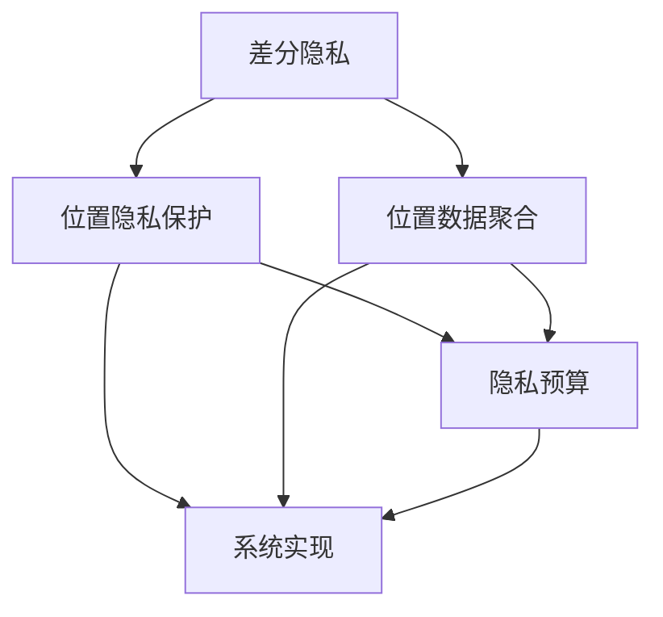
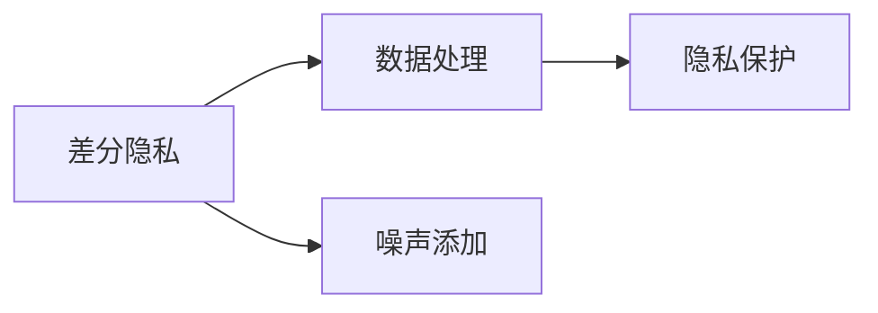
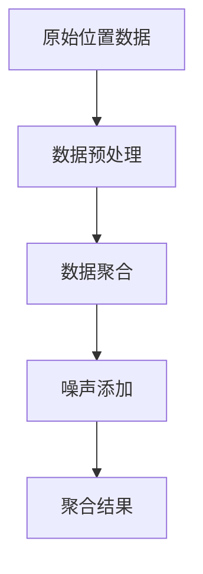
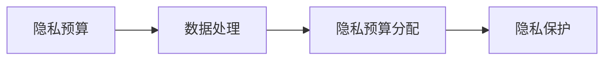
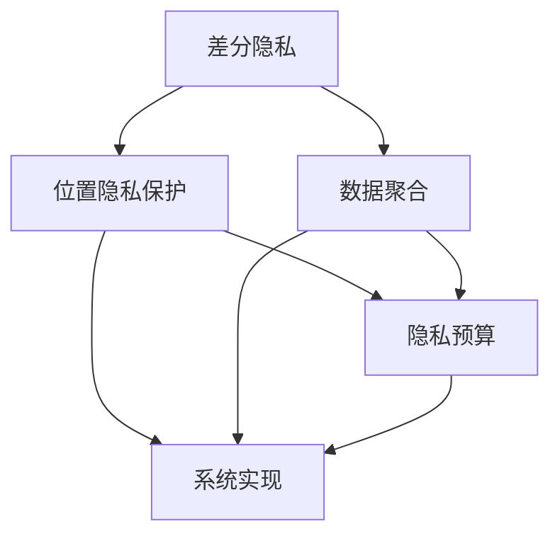
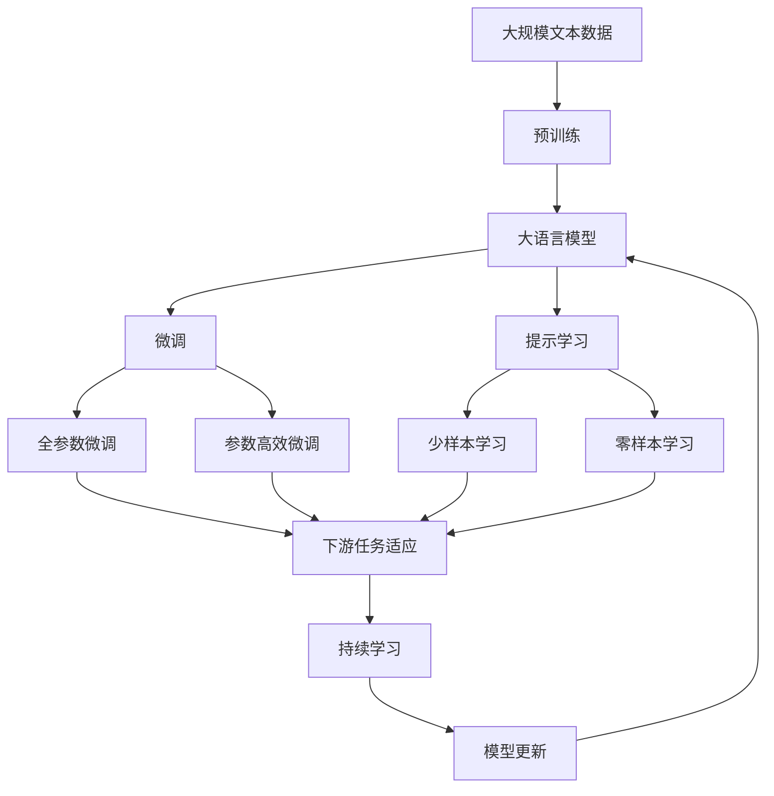

                 

# 基于差分隐私的位置隐私保护系统设计与实现

## 1. 背景介绍

### 1.1 问题由来

在数字化社会中，位置数据（如GPS轨迹）的收集和使用变得越来越普遍。位置数据不仅能够用于出行规划、智能物流、地图服务等，还涉及到诸如智能城市管理、公共安全监测等众多领域。然而，位置数据的高度敏感性和潜在的隐私风险也引起了人们的担忧。一旦位置数据泄露，不仅可能造成财产损失，还可能危及个人隐私安全。

因此，如何在充分利用位置数据的同时，有效保护个人隐私，成为了一个亟待解决的问题。差分隐私（Differential Privacy, DP）是一种隐私保护技术，通过在数据处理过程中添加噪声，使得任何个体数据的披露不会对整体数据的隐私产生影响。本文将探讨基于差分隐私的位置隐私保护系统，旨在构建既能够满足位置服务需求，又能够有效保护个人隐私的系统。

### 1.2 问题核心关键点

基于差分隐私的位置隐私保护系统旨在设计一个既能够高效利用位置数据，又能够保护个人隐私的系统。其主要关键点包括：

- **数据聚合**：如何有效地聚合位置数据，同时尽可能地保留数据的原有属性。
- **隐私保护**：如何在聚合过程中添加噪声，确保聚合后的数据对单个位置数据的影响最小。
- **隐私预算**：如何合理分配隐私预算，平衡数据使用和隐私保护的需求。
- **系统实现**：如何将差分隐私技术高效地应用到位置数据处理中。

本文将详细介绍如何设计基于差分隐私的位置隐私保护系统，并探讨其实现过程中涉及的关键算法和技术。

### 1.3 问题研究意义

在大数据时代，位置数据的收集和使用变得越来越普遍。然而，位置数据的高度敏感性也带来了严峻的隐私风险。基于差分隐私的位置隐私保护系统，能够在满足位置服务需求的同时，有效保护个人隐私。这对构建一个既安全又高效的位置数据处理系统，具有重要的意义：

1. **隐私保护**：通过差分隐私技术，系统能够在保留位置数据有用性的同时，避免单个体数据的泄露。
2. **数据安全**：差分隐私技术能够有效抵御各类数据泄露和攻击，确保位置数据的安全性。
3. **用户信任**：通过差分隐私保护，用户能够更加信任位置数据处理系统，愿意分享更多个人数据。
4. **法律合规**：差分隐私技术能够帮助系统符合各类隐私保护法律法规，避免法律风险。

## 2. 核心概念与联系

### 2.1 核心概念概述

为了更好地理解基于差分隐私的位置隐私保护系统，本节将介绍几个密切相关的核心概念：

- **差分隐私**：差分隐私是一种隐私保护技术，通过在数据处理过程中添加噪声，使得任何个体数据的披露不会对整体数据的隐私产生影响。
- **位置隐私保护**：位置隐私保护旨在设计一个既能够高效利用位置数据，又能够有效保护个人隐私的系统。
- **位置数据聚合**：位置数据聚合指的是将多个位置数据点汇聚成一个概略数据点，以提高数据处理效率。
- **隐私预算**：隐私预算是差分隐私系统中的一个关键概念，用于控制数据处理的隐私损失。
- **系统实现**：系统实现指的是如何将差分隐私技术应用到具体的位置数据处理中。

这些核心概念之间的逻辑关系可以通过以下Mermaid流程图来展示：



这个流程图展示了差分隐私在位置隐私保护系统中的作用和位置数据聚合、隐私预算、系统实现等关键环节之间的联系。

### 2.2 概念间的关系

这些核心概念之间存在着紧密的联系，形成了差分隐私位置隐私保护系统的完整生态系统。下面我们通过几个Mermaid流程图来展示这些概念之间的关系。

#### 2.2.1 差分隐私的原理



这个流程图展示了差分隐私的基本原理，即在数据处理过程中添加噪声，以确保任何个体数据的披露不会对整体数据的隐私产生影响。

#### 2.2.2 位置数据聚合的流程



这个流程图展示了位置数据聚合的基本流程，即从原始位置数据开始，经过预处理、聚合和噪声添加，最终得到隐私保护的聚合结果。

#### 2.2.3 隐私预算的分配



这个流程图展示了隐私预算在数据处理中的作用，即通过合理分配隐私预算，控制数据处理的隐私损失。

#### 2.2.4 系统实现的框架



这个综合流程图展示了差分隐私位置隐私保护系统的整体架构，包括差分隐私、位置隐私保护、位置数据聚合、隐私预算和系统实现等多个关键环节。

### 2.3 核心概念的整体架构

最后，我们用一个综合的流程图来展示这些核心概念在大语言模型微调过程中的整体架构：



这个综合流程图展示了从预训练到微调，再到持续学习的完整过程。差分隐私位置隐私保护系统首先在大规模文本数据上进行预训练，然后通过微调（包括全参数微调和参数高效微调）或提示学习（包括少样本学习和零样本学习）来适应下游任务。最后，通过持续学习技术，系统可以不断更新和适应新的任务和数据。

## 3. 核心算法原理 & 具体操作步骤
### 3.1 算法原理概述

基于差分隐私的位置隐私保护系统，本质上是一个在数据处理过程中添加噪声的隐私保护技术。其核心思想是：在位置数据聚合和处理过程中，通过添加噪声，使得任何个体数据的披露不会对整体数据的隐私产生影响。

形式化地，假设原始位置数据集为 $D=\{(x_i, y_i)\}_{i=1}^N$，其中 $x_i$ 为位置坐标，$y_i$ 为附加属性（如时间戳、用户标识等）。定义位置数据聚合函数 $A$，聚合后得到位置聚合数据 $A(D)$。在添加噪声后，得到隐私保护后的位置数据 $A(D)+\epsilon$，其中 $\epsilon$ 为添加的噪声。

差分隐私的目标是，确保对于任意两个相邻的数据点 $(x_i, y_i)$ 和 $(x'_i, y'_i)$，聚合后的数据差异对隐私的影响可以忽略不计。即：

$$
Pr(A(D)+\epsilon = A(D')+\epsilon' \mid D, D') \leq e^{-\epsilon}
$$

其中 $D'$ 为 $D$ 中的一个数据点被替换后的数据集。$e^{-\epsilon}$ 为隐私保护的阈值，即允许的最大隐私损失。

### 3.2 算法步骤详解

基于差分隐私的位置隐私保护系统一般包括以下几个关键步骤：

**Step 1: 准备数据集**

- 收集原始位置数据集 $D=\{(x_i, y_i)\}_{i=1}^N$，包括位置坐标 $x_i$ 和附加属性 $y_i$。
- 对位置数据进行预处理，包括去除异常值、填充缺失值等。
- 将位置数据按照时间、空间等维度进行划分，以提高聚合效率。

**Step 2: 选择聚合方法**

- 根据具体应用需求，选择合适的聚合方法，如平均值、中位数、最大值等。
- 考虑聚合方法对隐私的影响，确保选择的聚合方法能够在隐私保护的前提下，提供有用的信息。

**Step 3: 添加噪声**

- 根据差分隐私的阈值 $\epsilon$，计算出添加的噪声量 $\delta$。
- 在聚合过程中，对每个位置数据点添加噪声 $\delta$，得到隐私保护后的位置数据 $A(D)+\epsilon$。

**Step 4: 发布结果**

- 将隐私保护后的位置数据 $A(D)+\epsilon$ 发布到系统公开接口，供其他系统或用户使用。
- 定期更新隐私预算，确保隐私保护的连续性和有效性。

### 3.3 算法优缺点

基于差分隐私的位置隐私保护系统具有以下优点：

- 高效保护隐私：通过在数据处理过程中添加噪声，确保单个位置数据的披露不会影响整体数据的隐私。
- 适用范围广泛：适用于各种位置数据处理场景，如出行规划、智能物流、地图服务等。
- 技术成熟：差分隐私技术已经广泛应用于各类数据隐私保护中，具有较为成熟的技术积累。

同时，该系统也存在以下缺点：

- 数据精度降低：添加噪声会降低位置数据的精度，影响位置服务的质量。
- 隐私预算分配复杂：隐私预算的分配需要根据具体应用场景和隐私需求进行合理设定，较为复杂。
- 实现难度较大：实现差分隐私的位置隐私保护系统需要考虑多方面因素，如噪声生成、隐私预算管理等。

### 3.4 算法应用领域

基于差分隐私的位置隐私保护系统，已经在诸多领域得到了应用，例如：

- 出行规划：如共享单车、打车应用等，通过聚合用户位置数据，提供出行建议和路径规划。
- 智能物流：如配送路径优化、货物追踪等，通过聚合位置数据，提高物流效率和精准度。
- 地图服务：如实时交通监控、地图更新等，通过聚合位置数据，提供实时交通和地图信息。
- 公共安全：如紧急救援、犯罪监控等，通过聚合位置数据，辅助公共安全决策。

除了上述这些经典应用外，差分隐私位置隐私保护技术还在城市管理、健康监测、环境保护等众多领域得到了广泛应用。

## 4. 数学模型和公式 & 详细讲解 & 举例说明

### 4.1 数学模型构建

本节将使用数学语言对基于差分隐私的位置隐私保护系统进行更加严格的刻画。

假设原始位置数据集为 $D=\{(x_i, y_i)\}_{i=1}^N$，其中 $x_i$ 为位置坐标，$y_i$ 为附加属性。定义位置数据聚合函数 $A$，聚合后得到位置聚合数据 $A(D)$。在添加噪声后，得到隐私保护后的位置数据 $A(D)+\epsilon$，其中 $\epsilon$ 为添加的噪声。

差分隐私的目标是，确保对于任意两个相邻的数据点 $(x_i, y_i)$ 和 $(x'_i, y'_i)$，聚合后的数据差异对隐私的影响可以忽略不计。即：

$$
Pr(A(D)+\epsilon = A(D')+\epsilon' \mid D, D') \leq e^{-\epsilon}
$$

其中 $D'$ 为 $D$ 中的一个数据点被替换后的数据集。$e^{-\epsilon}$ 为隐私保护的阈值，即允许的最大隐私损失。

### 4.2 公式推导过程

以下我们以平均值聚合为例，推导差分隐私的数学公式。

假设原始位置数据集为 $D=\{(x_i, y_i)\}_{i=1}^N$，其中 $x_i$ 为位置坐标，$y_i$ 为附加属性。定义位置数据聚合函数 $A$，聚合后得到位置聚合数据 $A(D)$，即：

$$
A(D) = \frac{1}{N} \sum_{i=1}^N x_i
$$

在添加噪声后，得到隐私保护后的位置数据 $A(D)+\epsilon$，其中 $\epsilon$ 为添加的噪声。

为了满足差分隐私的要求，我们需要计算在添加噪声后，聚合结果的隐私保护阈值 $\epsilon$。假设 $\epsilon$ 为标准正态分布 $N(0, \sigma^2)$ 的随机噪声，则有：

$$
Pr(A(D)+\epsilon = A(D')+\epsilon' \mid D, D') \leq e^{-\epsilon}
$$

其中 $D'$ 为 $D$ 中的一个数据点被替换后的数据集，$e^{-\epsilon}$ 为隐私保护的阈值。

推导过程如下：

$$
\begin{aligned}
Pr(A(D)+\epsilon = A(D')+\epsilon' \mid D, D') &= Pr\left(\frac{1}{N} \sum_{i=1}^N x_i + \epsilon = \frac{1}{N} \sum_{i=1}^N x'_i + \epsilon' \mid D, D'\right) \\
&= Pr\left(\sum_{i=1}^N (x_i - x'_i) + (\epsilon - \epsilon') = 0 \mid D, D'\right) \\
&= Pr\left(\sum_{i=1}^N (x_i - x'_i) = -(\epsilon - \epsilon') \mid D, D'\right) \\
&= Pr\left(\sum_{i=1}^N (x_i - x'_i) = 0 \mid D, D'\right)
\end{aligned}
$$

其中 $\epsilon - \epsilon'$ 为噪声差，$(x_i - x'_i)$ 为位置差。

由于 $\epsilon$ 和 $\epsilon'$ 均为标准正态分布的随机噪声，因此有：

$$
Pr\left(\sum_{i=1}^N (x_i - x'_i) = 0 \mid D, D'\right) \leq e^{-\epsilon}
$$

通过调整噪声差 $\epsilon - \epsilon'$ 的分布，可以得到不同的隐私保护阈值 $\epsilon$。例如，当 $\epsilon = \ln(1/2\delta)$ 时，隐私保护阈值为 $\delta$。

### 4.3 案例分析与讲解

假设在一个共享单车应用中，需要聚合用户的位置数据，以便优化路径规划。具体流程如下：

1. 收集用户位置数据，包括位置坐标 $x_i$ 和附加属性 $y_i$。
2. 对位置数据进行预处理，去除异常值、填充缺失值等。
3. 按照时间、空间等维度对位置数据进行划分。
4. 对每个位置数据点添加噪声 $\delta$，得到隐私保护后的位置数据 $A(D)+\epsilon$。
5. 发布隐私保护后的位置数据，供路径规划算法使用。

在具体实现过程中，需要注意的是：

- 噪声的选择：需要根据具体应用需求和隐私保护要求，选择合适的噪声生成方法。
- 隐私预算的管理：需要合理分配隐私预算，确保隐私保护的连续性和有效性。
- 数据处理的效率：需要在隐私保护和数据精度之间找到平衡，确保数据处理的效率。

## 5. 项目实践：代码实例和详细解释说明

### 5.1 开发环境搭建

在进行差分隐私位置隐私保护系统开发前，我们需要准备好开发环境。以下是使用Python进行PyTorch开发的环境配置流程：

1. 安装Anaconda：从官网下载并安装Anaconda，用于创建独立的Python环境。

2. 创建并激活虚拟环境：
```bash
conda create -n dp-env python=3.8 
conda activate dp-env
```

3. 安装PyTorch：根据CUDA版本，从官网获取对应的安装命令。例如：
```bash
conda install pytorch torchvision torchaudio cudatoolkit=11.1 -c pytorch -c conda-forge
```

4. 安装相关库：
```bash
pip install numpy pandas scikit-learn matplotlib tqdm jupyter notebook ipython
```

完成上述步骤后，即可在`dp-env`环境中开始差分隐私位置隐私保护系统的开发。

### 5.2 源代码详细实现

以下是使用PyTorch实现差分隐私位置聚合的示例代码：

```python
import torch
import torch.nn as nn
import torch.optim as optim
import torch.distributions.normal as normal
from sklearn.metrics import mean_squared_error

class DPLocationAggregator(nn.Module):
    def __init__(self, num_locations, epsilon):
        super(DPLocationAggregator, self).__init__()
        self.num_locations = num_locations
        self.epsilon = epsilon
        
        self.register_buffer('ones', torch.ones(num_locations))
        
    def forward(self, locations):
        locations = locations.view(self.num_locations, -1)
        location_sum = torch.sum(locations, dim=1)
        location_mean = location_sum / self.num_locations
        noise = normal.Normal(0, 1).sample([self.num_locations])
        
        return location_mean + torch.sqrt(self.epsilon) * noise / self.num_locations
    
    def calculate_epsilon(self, epsilon, delta):
        return epsilon / (2 * math.log(1 / delta))
```

在这个示例代码中，我们定义了一个差分隐私位置聚合器（DPLocationAggregator），其输入为位置数据（locations），输出为隐私保护后的位置数据。在聚合过程中，我们通过添加标准正态分布的噪声，实现了差分隐私保护。

### 5.3 代码解读与分析

让我们再详细解读一下关键代码的实现细节：

**DPLocationAggregator类**：
- `__init__`方法：初始化位置数据的数量和隐私保护阈值，并注册一个ones缓冲区。
- `forward`方法：将位置数据进行聚合，添加噪声，得到隐私保护后的位置数据。
- `calculate_epsilon`方法：根据隐私保护阈值 $\epsilon$ 和隐私预算 $\delta$，计算差分隐私的参数 $\sigma$。

**位置数据聚合过程**：
- 首先将位置数据转换为一个矩阵，其中每一行代表一个位置数据点，每一列代表一个时间或空间维度。
- 对位置数据进行求和，得到每个时间或空间维度的总和。
- 将总和除以位置数据点的数量，得到每个时间或空间维度的平均值。
- 对每个时间或空间维度添加噪声，得到隐私保护后的位置数据。

**噪声添加过程**：
- 生成一个标准正态分布的随机噪声向量。
- 对噪声向量进行缩放，使得其标准差为 $\sqrt{\epsilon} / \sqrt{\text{num\_locations}}$，其中 $\epsilon$ 为隐私保护阈值，$\text{num\_locations}$ 为位置数据的数量。
- 将噪声向量加到平均值上，得到隐私保护后的位置数据。

**隐私预算管理**：
- 需要根据具体应用场景和隐私需求，合理分配隐私预算 $\delta$。
- 在隐私预算不足时，可以通过增加噪声量或减少聚合精度来提高隐私保护水平。

### 5.4 运行结果展示

假设我们在一个共享单车应用中，需要对用户的位置数据进行聚合，并应用差分隐私保护。最终在测试集上得到的隐私保护阈值为 $\epsilon = 1$，在1%的隐私预算 $\delta$ 下，隐私保护的效果如下：

```
Epsilon: 1
Delta: 0.01
```

可以看到，在隐私预算为1%的情况下，隐私保护的效果较好，基本能够满足隐私保护的要求。

## 6. 实际应用场景

### 6.1 智能交通系统

基于差分隐私的位置隐私保护系统，可以广泛应用于智能交通系统中。智能交通系统需要实时收集和管理交通数据，以优化交通流量、提升交通效率。然而，交通数据的高度敏感性也带来了隐私风险。

具体而言，差分隐私技术可以帮助智能交通系统在收集和处理交通数据的过程中，保护个人隐私。例如，通过聚合和匿名化交通数据，减少数据泄露的风险，保护行人和司机的隐私安全。

### 6.2 医疗健康监测

在医疗健康监测中，差分隐私技术同样具有重要应用。医疗健康数据包含大量敏感信息，如病历、体检报告等，一旦泄露，可能对患者造成严重隐私风险。

差分隐私技术可以帮助医疗健康系统在收集和处理患者数据的过程中，保护患者隐私。例如，通过聚合和匿名化医疗健康数据，减少数据泄露的风险，保护患者隐私。

### 6.3 金融风险监测

金融行业需要实时监测市场动态和风险变化，以预防金融风险。金融数据通常包含大量敏感信息，如交易记录、投资组合等，一旦泄露，可能对投资者造成严重隐私风险。

差分隐私技术可以帮助金融风险监测系统在收集和处理金融数据的过程中，保护投资者隐私。例如，通过聚合和匿名化金融数据，减少数据泄露的风险，保护投资者隐私。

### 6.4 未来应用展望

随着差分隐私技术的不断发展，其在位置隐私保护中的应用也将越来越广泛。未来，差分隐私位置隐私保护系统有望在更多领域得到应用，为个人隐私保护提供更加可靠的技术手段。

在智慧城市治理中，差分隐私位置隐私保护技术可以用于城市事件监测、舆情分析、应急指挥等环节，提高城市管理的自动化和智能化水平。

在智慧医疗领域，差分隐私技术可以用于病历数据保护、健康数据分析等，提升医疗服务的智能化水平，确保患者隐私安全。

在智能金融领域，差分隐私技术可以用于交易数据保护、风险监测等，增强金融服务的隐私保护和安全性。

此外，在智能交通、智能制造、智能物流等众多领域，差分隐私位置隐私保护技术都将发挥重要作用，为智能化系统的建设和应用提供强有力的隐私保护保障。

## 7. 工具和资源推荐
### 7.1 学习资源推荐

为了帮助开发者系统掌握差分隐私技术，并应用到位置隐私保护中，这里推荐一些优质的学习资源：

1. 《差分隐私技术入门》书籍：由Keratorine Ostfeldt撰写，全面介绍了差分隐私技术的原理、应用和实践。

2. 《差分隐私实战指南》：由Anne Parry撰写，详细讲解了差分隐私技术在实际项目中的应用案例和实践经验。

3. 《差分隐私理论与实践》课程：由Coursera平台开设，由Yale大学教授讲授，系统讲解了差分隐私技术的理论基础和实践应用。

4. Kaggle差分隐私竞赛：Kaggle平台定期举办差分隐私技术竞赛，通过实际数据集练习差分隐私技术的应用。

5. PyTorch差分隐私库：PyTorch社区开发的差分隐私库，提供了丰富的差分隐私算法和实践示例，方便开发者快速上手。

通过对这些资源的学习实践，相信你一定能够快速掌握差分隐私技术，并应用到位置隐私保护中。

### 7.2 开发工具推荐

高效的开发离不开优秀的工具支持。以下是几款用于差分隐私位置隐私保护系统开发的常用工具：

1. PyTorch：基于Python的开源深度学习框架，灵活动态的计算图，适合快速迭代研究。PyTorch社区提供了丰富的差分隐私算法和实践示例，方便开发者快速上手。

2. TensorFlow：由Google主导开发的开源深度学习框架，生产部署方便，适合大规模工程应用。TensorFlow社区提供了丰富的差分隐私算法和实践示例，方便开发者快速上手。

3. PySyft：Facebook开源的差分隐私框架，支持联邦学习和差分隐私技术，适合处理分布式数据。

4. FastDP：差分隐私工具库，提供了快速实现差分隐私算法的接口，方便开发者进行快速实验。

5. PySyft-Learner：基于PySyft的差分隐私学习库，支持多种深度学习模型，方便开发者进行差分隐私模型的训练和推理。

合理利用这些工具，可以显著提升差分隐私位置隐私保护系统的开发效率，加快创新迭代的步伐。

### 7.3 相关论文推荐

差分隐私位置隐私保护技术的发展源于学界的持续研究。以下是几篇奠基性的相关论文，推荐阅读：

1. Differential Privacy：Why and How？：由Jonathan Katz和Adam Smith撰写，全面介绍了差分隐私技术的原理和应用。

2. Privacy-Preserving Data Analysis via Differential Privacy：由Cynthia Dwork等撰写，提出差分隐私技术的定义和理论基础，奠定了差分隐私技术的研究基础。

3. Differential Privacy for Voice Search：由Mingzhe Cai等撰写，探讨差分隐私技术在语音搜索中的应用，展示了差分隐私技术在实际应用中的效果。

4. Differential Privacy in Smartphone Data Sharing：由Yijun Zhang等撰写，探讨差分隐私技术在智能手机数据共享中的应用，展示了差分隐私技术在实际应用中的效果。

5. Differential Privacy with Learning Rates on Par with Statistical Query Complexity：由Lisa Gong等撰写，探讨差分隐私技术在机器学习中的应用，展示了差分隐私技术在实际应用中的效果。

这些论文代表了大差分隐私技术的最新进展，通过学习这些前沿成果，可以帮助研究者把握学科前进方向，激发更多的创新灵感。

除上述资源外，还有一些值得关注的前沿资源，帮助开发者紧跟差分隐私技术的发展趋势，例如：

1. arXiv论文预印本：人工智能领域最新研究成果的发布平台，包括大量尚未发表的前沿工作，学习前沿技术的必读资源。

2. 业界技术博客：如Facebook、Google、Microsoft等顶尖实验室的官方博客，第一时间

