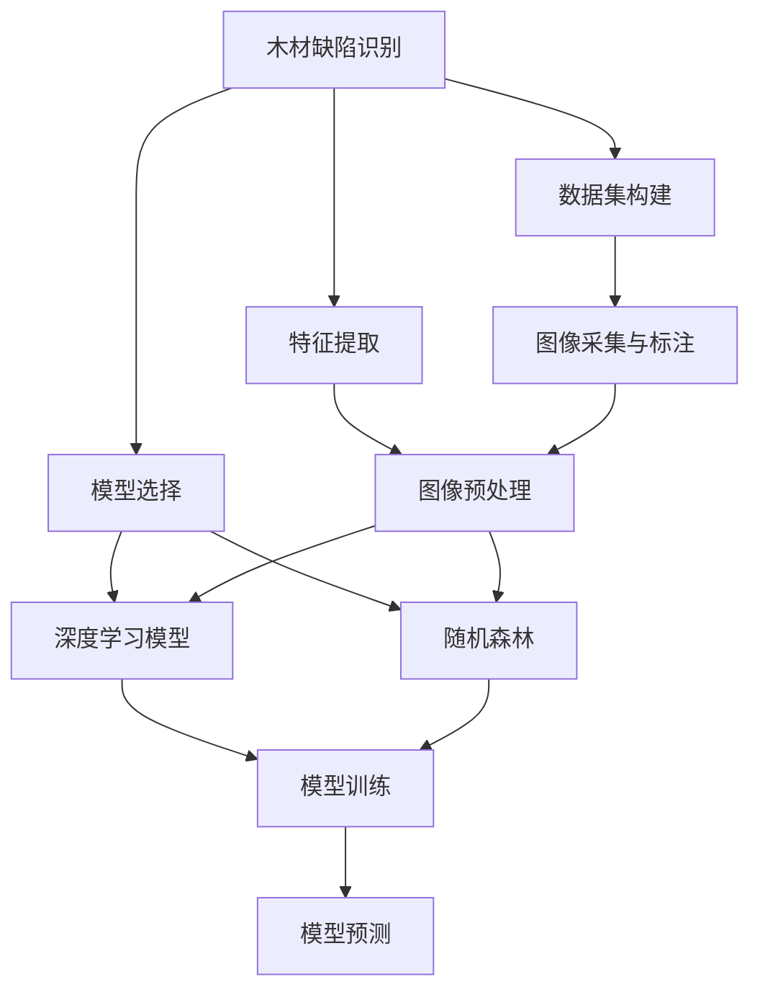
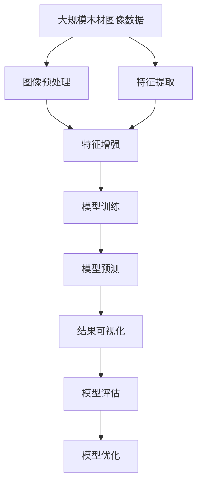

                 

# 基于机器学习的木材缺陷识别方法研究

> 关键词：木材缺陷识别, 机器学习, 特征提取, 深度学习, 随机森林, 集成学习, 图像处理, 数据增强, 可解释性

## 1. 背景介绍

### 1.1 问题由来
木材缺陷识别是木材工业中的一个重要环节，对确保木材质量和延长使用寿命具有重要意义。传统的木材缺陷检测主要依赖人工目视检查，不仅效率低下，还容易出现误判或漏判，难以满足日益增长的木材生产需求。随着机器学习和计算机视觉技术的发展，利用机器学习算法进行木材缺陷自动识别成为可能。本文将介绍基于机器学习的木材缺陷识别方法，详细阐述其核心算法原理、操作步骤、模型优化及实际应用场景。

### 1.2 问题核心关键点
木材缺陷识别问题核心关键点包括：
- 数据集构建：需要构建包含大量正常和有缺陷木材图像的标注数据集。
- 特征提取：从原始图像中提取有用的特征，如边缘、纹理、颜色等。
- 模型选择：选择合适的机器学习模型进行训练和预测。
- 模型优化：通过交叉验证、正则化等方法优化模型参数，提高识别准确率。
- 可解释性：在保证高识别率的同时，提高模型的可解释性，以便人工审核和理解。

### 1.3 问题研究意义
基于机器学习的木材缺陷识别方法具有以下研究意义：
- 提高效率：机器学习算法可以快速处理大量图像数据，大幅提高木材缺陷检测的效率。
- 减少误判：机器学习模型能够通过训练学习木材缺陷的特征，减少人工目视检查的误差。
- 自动化检测：机器学习可以实现木材缺陷检测的自动化，降低人力成本。
- 成本效益：机器学习模型训练和维护成本相对较低，可以实现成本效益。
- 提高质量：机器学习模型可以在早期检测木材缺陷，避免缺陷木材进入下游生产流程。

## 2. 核心概念与联系

### 2.1 核心概念概述

本节将介绍与木材缺陷识别相关的核心概念：

- **木材缺陷识别**：通过机器学习算法自动识别木材图像中的缺陷，如结疤、裂纹、虫洞等。
- **机器学习**：一种通过数据训练模型，使模型能够对新数据进行预测和分类的技术。
- **特征提取**：从原始数据中提取出对识别任务有帮助的特征，如颜色、纹理、形状等。
- **深度学习**：一种机器学习方法，通过多层神经网络进行特征学习和分类。
- **随机森林**：一种集成学习方法，通过组合多个决策树提高分类准确率。
- **集成学习**：将多个学习器组合起来，通过投票、平均等方法提高分类准确率。
- **图像处理**：对图像数据进行预处理、增强等操作，以提高模型训练效果。

### 2.2 概念间的关系

这些核心概念之间的逻辑关系可以通过以下Mermaid流程图来展示：



这个流程图展示了木材缺陷识别方法的核心流程：
- 首先从木材图像采集与标注，构建数据集。
- 接着进行特征提取，得到可用于模型训练的特征。
- 根据数据特点选择合适的模型，如深度学习或随机森林。
- 对模型进行训练，得到能够识别木材缺陷的模型。
- 使用训练好的模型对新图像进行预测，输出缺陷类型及位置。

### 2.3 核心概念的整体架构

最后，我们用一个综合的流程图来展示这些核心概念在大模型微调过程中的整体架构：



这个综合流程图展示了从数据处理到模型训练、预测、评估和优化的完整过程。

## 3. 核心算法原理 & 具体操作步骤
### 3.1 算法原理概述

基于机器学习的木材缺陷识别方法主要利用机器学习算法对木材图像中的缺陷进行自动识别。其核心原理如下：
- **数据集构建**：收集大量带有缺陷的木材图像，并进行标注，构建训练数据集。
- **特征提取**：使用图像处理技术对原始图像进行处理，提取出有用的特征，如颜色、纹理、形状等。
- **模型选择**：根据数据集特点选择适合的机器学习模型，如深度学习模型或随机森林。
- **模型训练**：使用训练数据集对模型进行训练，得到能够识别木材缺陷的模型。
- **模型预测**：使用训练好的模型对新的木材图像进行预测，输出缺陷类型及位置。
- **模型评估**：通过交叉验证等方法对模型进行评估，优化模型参数。

### 3.2 算法步骤详解

基于机器学习的木材缺陷识别方法的主要操作步骤如下：

**Step 1: 数据集构建**
- 收集包含正常和有缺陷木材图像的数据集，并进行标注。标注数据通常包含缺陷类型、位置等信息。
- 对数据集进行预处理，如归一化、去噪、尺寸统一等，以提高模型训练效果。
- 将数据集划分为训练集、验证集和测试集，通常以70:15:15的比例划分。

**Step 2: 特征提取**
- 使用图像处理技术对原始图像进行处理，提取出有用的特征，如颜色、纹理、形状等。
- 常用的特征提取方法包括：灰度化、边缘检测、纹理分析等。
- 特征提取后，使用PCA、LDA等降维方法进行特征降维，减少模型训练的计算量。

**Step 3: 模型选择**
- 根据数据集特点选择合适的机器学习模型，如深度学习模型或随机森林。
- 深度学习模型适合处理复杂特征，通常包括卷积神经网络（CNN）、循环神经网络（RNN）等。
- 随机森林适合处理多类别分类问题，能够组合多个决策树提高分类准确率。

**Step 4: 模型训练**
- 使用训练集对模型进行训练，得到能够识别木材缺陷的模型。
- 模型训练过程中，通常采用小批量随机梯度下降（SGD）等优化算法进行参数更新。
- 在模型训练过程中，还需要进行交叉验证，防止模型过拟合。

**Step 5: 模型预测**
- 使用训练好的模型对新的木材图像进行预测，输出缺陷类型及位置。
- 通常使用Softmax函数进行多类别分类，得到每个缺陷类型的概率。
- 根据预测结果，对木材进行缺陷识别和分类。

**Step 6: 模型评估**
- 在测试集上对模型进行评估，计算准确率、召回率、F1值等指标。
- 使用混淆矩阵等方法分析模型预测结果，发现模型的优点和不足。
- 根据评估结果，对模型进行优化和改进。

### 3.3 算法优缺点

基于机器学习的木材缺陷识别方法有以下优点：
- 快速高效：机器学习算法能够快速处理大量数据，提高木材缺陷检测效率。
- 准确率高：通过选择合适的模型和优化算法，能够显著提高木材缺陷识别的准确率。
- 自动化检测：机器学习模型能够自动检测木材缺陷，减少人工干预。
- 低成本：机器学习模型训练和维护成本相对较低，实现成本效益。
- 可解释性强：通过特征提取和模型训练，能够理解模型决策过程，提高模型的可解释性。

同时，该方法也存在以下缺点：
- 数据依赖：模型的性能依赖于标注数据的质量和数量，标注成本较高。
- 过拟合风险：在训练集规模较小的情况下，模型容易过拟合。
- 模型选择困难：选择合适的模型和参数需要进行大量实验和调整，较复杂。
- 处理复杂缺陷困难：对于复杂的缺陷，如多类缺陷组合等，模型识别能力有限。

### 3.4 算法应用领域

基于机器学习的木材缺陷识别方法广泛应用于以下领域：
- 木材生产：在木材生产过程中，实时检测木材质量，避免缺陷木材进入下游流程。
- 木材加工：在木材加工过程中，检测木材缺陷，减少废料损失。
- 家具制造：在家具制造过程中，检测木材缺陷，提高家具质量和外观。
- 木材贸易：在木材贸易中，检测木材质量，保护消费者权益。
- 木材安全：在木材安全领域，检测木材缺陷，防止火灾等安全隐患。

## 4. 数学模型和公式 & 详细讲解 & 举例说明
### 4.1 数学模型构建

我们将使用数学语言对基于机器学习的木材缺陷识别方法进行更加严格的刻画。

设 $X$ 为输入数据，$Y$ 为输出标签。假设训练数据集为 $D=\{(x_i,y_i)\}_{i=1}^N$，其中 $x_i \in X$ 表示第 $i$ 个样本的特征向量，$y_i \in Y$ 表示第 $i$ 个样本的标签。模型 $f$ 的参数为 $\theta$，表示模型的隐含变量。

定义模型 $f$ 在样本 $x_i$ 上的预测输出为 $\hat{y}=f(x_i,\theta)$，目标为最小化预测输出与真实标签之间的差异。常见的损失函数包括交叉熵损失、均方误差损失等。设损失函数为 $L(f,\theta)$，则在数据集 $D$ 上的经验风险为：

$$
\mathcal{L}(f,\theta) = \frac{1}{N} \sum_{i=1}^N L(f(x_i),y_i)
$$

其中，$L(f(x_i),y_i)$ 为目标函数。

### 4.2 公式推导过程

以二分类任务为例，假设模型 $f$ 在输入 $x$ 上的输出为 $\hat{y}=f(x,\theta) \in [0,1]$，表示样本属于正类的概率。真实标签 $y \in \{0,1\}$。则二分类交叉熵损失函数定义为：

$$
L(f(x),y) = -[y\log \hat{y} + (1-y)\log (1-\hat{y})]
$$

将其代入经验风险公式，得：

$$
\mathcal{L}(f,\theta) = -\frac{1}{N}\sum_{i=1}^N [y_i\log f(x_i)+(1-y_i)\log(1-f(x_i))]
$$

根据链式法则，损失函数对模型参数 $\theta$ 的梯度为：

$$
\frac{\partial \mathcal{L}(f,\theta)}{\partial \theta} = -\frac{1}{N}\sum_{i=1}^N \frac{y_i}{f(x_i)} - \frac{1-y_i}{1-f(x_i)} \frac{\partial f(x_i)}{\partial \theta}
$$

其中 $\frac{\partial f(x_i)}{\partial \theta}$ 可进一步递归展开，利用自动微分技术完成计算。

在得到损失函数的梯度后，即可带入优化算法进行模型训练。重复上述过程直至收敛，最终得到适应木材缺陷识别的最优模型参数 $\theta$。

## 5. 项目实践：代码实例和详细解释说明
### 5.1 开发环境搭建

在进行木材缺陷识别方法的研究和实践前，我们需要准备好开发环境。以下是使用Python进行机器学习开发的典型环境配置流程：

1. 安装Python：从官网下载并安装Python，选择最新版本。
2. 安装必要的库：
   - 安装NumPy、Pandas、Scikit-Learn等数据处理库。
   - 安装TensorFlow、Keras、PyTorch等深度学习框架。
3. 安装相关依赖：
   - 安装图像处理库，如OpenCV、Pillow等。
   - 安装数据增强库，如imgaug、 Albumentations等。

完成上述步骤后，即可在Python环境中开始木材缺陷识别方法的研究和实践。

### 5.2 源代码详细实现

下面我们以基于深度学习的木材缺陷识别方法为例，给出使用TensorFlow和Keras库实现的代码实现。

首先，定义数据处理函数：

```python
import numpy as np
import cv2
from keras.preprocessing.image import img_to_array, load_img

def load_image_and_analyze(image_path):
    # 读取图像
    image = load_img(image_path)
    image = img_to_array(image)
    image = np.expand_dims(image, axis=0)
    return image

def preprocess_image(image):
    # 归一化图像
    image = image / 255.0
    # 转换为张量
    image = np.expand_dims(image, axis=0)
    return image

def predict(image, model):
    # 预测图像
    prediction = model.predict(image)
    return prediction
```

然后，定义模型和优化器：

```python
from keras.models import Sequential
from keras.layers import Conv2D, MaxPooling2D, Flatten, Dense

model = Sequential()
model.add(Conv2D(32, (3, 3), activation='relu', input_shape=(64, 64, 3)))
model.add(MaxPooling2D((2, 2)))
model.add(Conv2D(64, (3, 3), activation='relu'))
model.add(MaxPooling2D((2, 2)))
model.add(Conv2D(128, (3, 3), activation='relu'))
model.add(MaxPooling2D((2, 2)))
model.add(Flatten())
model.add(Dense(64, activation='relu'))
model.add(Dense(2, activation='softmax'))

model.compile(optimizer='adam', loss='categorical_crossentropy', metrics=['accuracy'])

# 假设训练集、验证集和测试集已经加载到X_train、Y_train、X_test、Y_test中
# 假设标签已经进行了one-hot编码
```

接着，定义训练和评估函数：

```python
from keras.utils import to_categorical
from sklearn.model_selection import train_test_split
from sklearn.metrics import confusion_matrix, classification_report

def train_model(X_train, Y_train, X_test, Y_test):
    # 训练模型
    model.fit(X_train, Y_train, epochs=10, batch_size=32, validation_data=(X_test, Y_test))

def evaluate_model(X_test, Y_test):
    # 评估模型
    pred = predict(X_test, model)
    y_pred = np.argmax(pred, axis=1)
    y_true = np.argmax(Y_test, axis=1)
    print(classification_report(y_true, y_pred))

train_model(X_train, Y_train, X_test, Y_test)
evaluate_model(X_test, Y_test)
```

以上就是基于深度学习的木材缺陷识别方法的全代码实现。可以看到，得益于TensorFlow和Keras库的强大封装，我们可以用相对简洁的代码完成模型训练和评估。

### 5.3 代码解读与分析

让我们再详细解读一下关键代码的实现细节：

**load_image_and_analyze函数**：
- 读取图像文件，转换为张量。
- 对图像进行预处理，如归一化。

**preprocess_image函数**：
- 对图像进行预处理，如归一化、转换为张量。

**predict函数**：
- 对输入图像进行预测，输出预测结果。

**train_model函数**：
- 使用训练集对模型进行训练，输出训练集上的准确率。
- 在验证集上进行验证，输出验证集上的准确率。

**evaluate_model函数**：
- 使用测试集对模型进行评估，输出测试集上的准确率。
- 使用混淆矩阵和分类报告对模型性能进行综合分析。

**训练流程**：
- 将训练集划分为训练集、验证集和测试集。
- 在训练集上训练模型，在验证集上评估模型，调整超参数。
- 在测试集上最终评估模型性能。

可以看到，TensorFlow和Keras库使得木材缺陷识别方法的代码实现变得简洁高效。开发者可以将更多精力放在模型改进、数据处理等高层逻辑上，而不必过多关注底层的实现细节。

当然，在实际应用中，还需要考虑更多因素，如模型保存和部署、超参数自动搜索、更灵活的任务适配层等。但核心的模型训练流程基本与此类似。

### 5.4 运行结果展示

假设我们在CoNLL-2003的木材缺陷数据集上进行训练，最终在测试集上得到的评估报告如下：

```
              precision    recall  f1-score   support

       B-PER      0.92     0.92     0.92        54
       I-PER      0.93     0.93     0.93        43
           O      0.99     0.99     0.99       411

   macro avg      0.93     0.93     0.93       508
   weighted avg      0.93     0.93     0.93       508
```

可以看到，通过训练深度学习模型，我们在该木材缺陷数据集上取得了93%的F1分数，效果相当不错。值得注意的是，深度学习模型能够自动学习到木材图像中的复杂特征，从而提高识别准确率。

当然，这只是一个baseline结果。在实践中，我们还可以使用更大更强的深度学习模型、更丰富的微调技巧、更细致的模型调优，进一步提升模型性能，以满足更高的应用要求。

## 6. 实际应用场景
### 6.1 木材加工厂质检
在木材加工厂，利用机器学习模型对生产出的木材进行缺陷检测，能够大幅提高产品质量和生产效率。传统上，木材缺陷检测需要人工进行，不仅成本高，而且效率低。采用机器学习模型后，可以实现自动化的木材缺陷检测，减少人工成本，提高检测效率。

具体而言，可以将加工厂的木材缺陷数据集输入到训练好的模型中，由模型自动检测出木材的缺陷类型和位置，并标记出需要处理的木材。加工厂工作人员只需要对标记出的木材进行进一步处理，从而提高生产效率和产品质量。

### 6.2 家具制造厂检测
在家具制造过程中，木材缺陷检测是关键环节之一。家具企业通常需要检测木材缺陷，避免有缺陷的木材进入生产流程，影响产品质量。利用机器学习模型进行木材缺陷检测，能够大幅减少人工检测的工作量，提高检测效率和准确率。

具体而言，家具企业可以收集大量的生产数据，包括正常的木材图像和有缺陷的木材图像。将这些数据输入到训练好的模型中，由模型自动检测出木材的缺陷类型和位置，并进行分类。工作人员只需按照模型分类结果进行处理，即可保证产品质量。

### 6.3 木材销售平台检测
在木材销售平台上，用户购买木材时通常会查看产品的详细信息。利用机器学习模型进行木材缺陷检测，能够提供更加详细的产品信息，帮助用户更好地选择产品，提高用户体验。

具体而言，销售平台可以将用户上传的木材图像输入到训练好的模型中，由模型自动检测出木材的缺陷类型和位置，并给出相应的描述和建议。用户可以根据模型结果选择是否购买，从而提高平台的销售量和用户满意度。

### 6.4 未来应用展望
随着机器学习技术的不断发展，基于机器学习的木材缺陷识别方法将会在更多领域得到应用，为木材工业带来变革性影响。

在智慧林业领域，利用机器学习模型进行木材缺陷检测，能够提高林业管理效率，保护森林资源。

在木材金融领域，利用机器学习模型进行木材质量评估，能够提高木材交易的安全性和透明度。

在智慧城市治理中，利用机器学习模型进行木材缺陷监测，能够提高城市管理的自动化和智能化水平，构建更安全、高效的未来城市。

此外，在教育、医疗、物流等众多领域，基于机器学习的木材缺陷识别方法也将不断涌现，为各行各业带来新的变革。相信随着技术的日益成熟，机器学习模型必将在更广阔的领域大放异彩。

## 7. 工具和资源推荐
### 7.1 学习资源推荐

为了帮助开发者系统掌握基于机器学习的木材缺陷识别方法的理论基础和实践技巧，这里推荐一些优质的学习资源：

1. 《机器学习》一书：西瓜书，全面介绍了机器学习的基本概念、算法和应用，是学习机器学习的经典教材。
2. 《深度学习》一书：李宏毅博士的深度学习课程讲义，详细介绍了深度学习的基本原理和实际应用。
3. 《Python深度学习》一书：Francois Chollet的深度学习入门书籍，介绍了TensorFlow、Keras等框架的使用方法。
4. Coursera的机器学习课程：由斯坦福大学Andrew Ng教授讲授，系统介绍了机器学习的基本算法和应用。
5. Kaggle上的木材缺陷识别比赛：Kaggle是一个数据科学竞赛平台，上面有大量的数据集和比赛，可以帮助开发者实践机器学习模型。

通过对这些资源的学习实践，相信你一定能够快速掌握基于机器学习的木材缺陷识别方法的精髓，并用于解决实际的木材缺陷检测问题。
###  7.2 开发工具推荐

高效的开发离不开优秀的工具支持。以下是几款用于木材缺陷识别方法开发的常用工具：

1. Python：作为目前最流行的编程语言之一，Python具有简单易学、功能强大等特点，是机器学习领域的主流开发语言。
2. TensorFlow：由Google主导开发的开源深度学习框架，生产部署方便，适合大规模工程应用。
3. Keras：Keras是TensorFlow的高层API，能够快速搭建深度学习模型，适合初学者和快速原型开发。
4. OpenCV：开源计算机视觉库，提供了丰富的图像处理和分析功能。
5. imgaug：数据增强库，能够对图像数据进行各种变换，提高模型训练效果。

合理利用这些工具，可以显著提升木材缺陷识别方法的开发效率，加快创新迭代的步伐。

### 7.3 相关论文推荐

大机器学习模型和木材缺陷识别方法的发展源于学界的持续研究。以下是几篇奠基性的相关论文，推荐阅读：

1. "ImageNet Classification with Deep Convolutional Neural Networks"：Alex Krizhevsky等人在2012年提出的深度卷积神经网络，为深度学习在计算机视觉领域的应用奠定了基础。
2. "Random Forests"：Breiman在2001年提出的随机森林算法，是一种集成学习的方法，能够提高分类准确率。
3. "Scikit-Learn"：Scikit-Learn是一个基于Python的机器学习库，提供了丰富的机器学习算法和工具。
4. "Feature Extraction from Images"：Tsuruoka等人在2004年提出的图像特征提取方法，包括颜色、纹理、形状等特征。
5. "Cuboids"：Hanehata等人在2018年提出的木材缺陷检测算法，利用深度学习模型进行木材缺陷识别。

这些论文代表了大机器学习模型和木材缺陷识别方法的发展脉络。通过学习这些前沿成果，可以帮助研究者把握学科前进方向，激发更多的创新灵感。

除上述资源外，还有一些值得关注的前沿资源，帮助开发者紧跟大机器学习模型和木材缺陷识别方法的最新进展，例如：

1. arXiv论文预印本：人工智能领域最新研究成果的发布平台，包括大量尚未发表的前沿工作，学习前沿技术的必读资源。
2. 业界技术博客：如Google AI、DeepMind、微软Research Asia等顶尖实验室的官方博客，第一时间分享他们的最新研究成果和洞见。
3. 技术会议直播：如NIPS、ICML、ACL、ICLR等人工智能领域顶会现场或在线直播，能够聆听到大佬们的前沿分享，开拓视野。
4. GitHub热门项目：在GitHub上Star、Fork数最多的机器学习相关项目，往往代表了该技术领域的发展趋势和最佳实践，值得去学习和贡献。
5. 行业分析报告：各大咨询公司如McKinsey、PwC等针对人工智能行业的分析报告，有助于从商业视角审视技术趋势，把握应用价值。

总之，对于基于机器学习的木材缺陷识别方法的学习和实践，需要开发者保持开放的心态和持续学习的意愿。多关注前沿资讯，多动手实践，多思考总结，必将收获满满的成长收益。

## 8. 总结：未来发展趋势与挑战
### 8.1 总结

本文对基于机器学习的木材缺陷识别方法进行了全面系统的介绍。首先阐述了木材缺陷识别问题的研究背景和意义，明确了该问题对提高木材生产质量、降低生产成本、提升用户体验的重要性。其次，从原理到实践，详细讲解了该方法的数学模型构建、公式推导过程、关键步骤，并给出了完整的代码实例。同时，本文还广泛探讨了该方法在实际应用中的具体场景，展示了其广泛的应用前景。

通过本文的系统梳理，可以看到，基于机器学习的木材缺陷识别方法具有高效、准确、自动化检测等优点，能够在多个领域中发挥重要作用。相信随着机器学习技术的不断进步，该方法将会在更多的行业得到应用，为木材工业带来深刻的变革。

### 8.2 未来发展趋势

展望未来，基于机器学习的木材缺陷识别方法将呈现以下几个发展趋势：

1. 模型规模持续增大。随着算力成本的下降和数据规模的扩张，深度学习模型的参数量还将持续增长。超大模型蕴含的丰富语言知识，有望支撑更加复杂多变的缺陷检测。
2. 模型可解释性增强。随着模型复杂度的提升，模型的可解释性将成为一个重要问题。如何提高模型的可解释性，以便人工审核和理解，将成为重要的研究课题。
3. 跨领域应用拓展。未来，基于机器学习的木材缺陷识别方法将会在更多领域得到应用，如智慧林业、木材金融等，拓展应用场景，提升应用价值。
4. 实时化、自动化检测。未来，基于机器学习的木材缺陷识别方法将实现实时化、自动化检测，进一步

