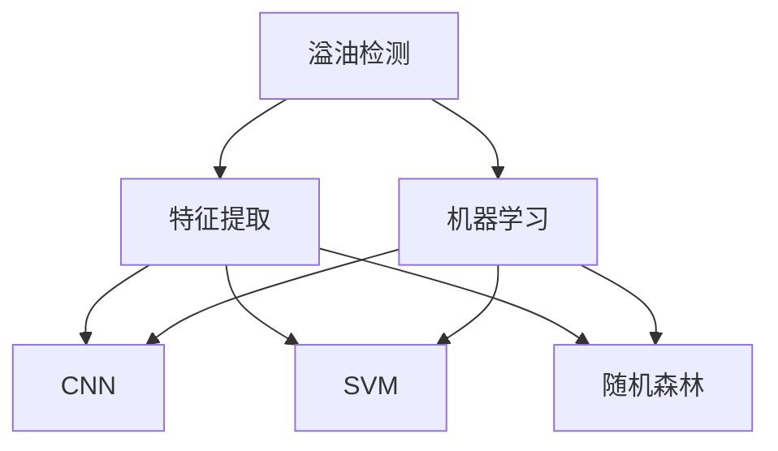
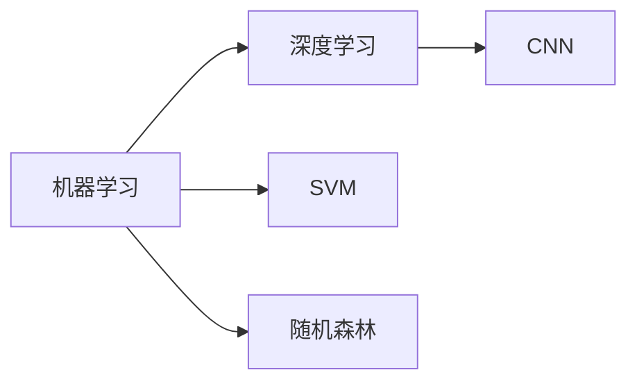
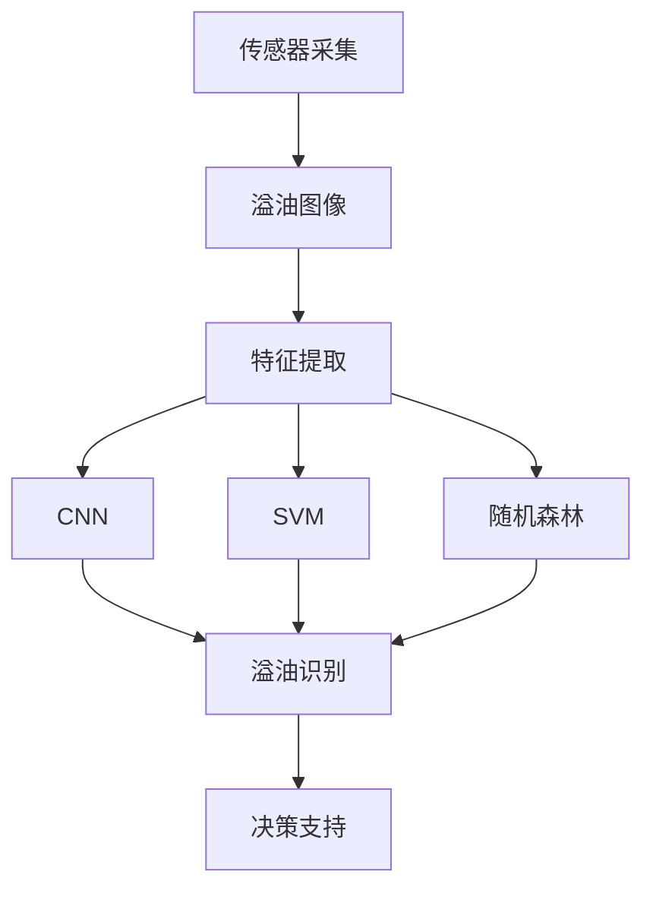

                 

# 基于机器学习的溢油特征提取与识别方法研究

## 1. 背景介绍

### 1.1 问题由来
随着海洋经济的发展，海洋溢油事故频发，给海洋生态环境造成了严重破坏。溢油检测与处理是保护海洋环境、保障海洋资源的重要手段。传统的溢油检测方法主要依赖于人工观察和物理监测，存在效率低、精度差、时效性不足等问题。近年来，随着机器学习和深度学习技术的发展，基于机器学习的溢油特征提取与识别方法逐渐兴起，成为解决溢油监测问题的新途径。

### 1.2 问题核心关键点
机器学习应用于溢油检测的核心在于如何有效提取溢油图像的特征，并建立准确的溢油识别模型。具体的关键点包括：

- 选择适合的特征提取方法：包括边缘检测、纹理分析、颜色特征等，将提取的特征向量作为机器学习模型的输入。
- 建立合适的机器学习模型：如支持向量机、随机森林、卷积神经网络等，利用提取的特征向量训练模型。
- 优化模型参数：包括特征选择、超参数调优等，以提高模型的泛化能力和识别精度。
- 评估模型性能：使用交叉验证、混淆矩阵等方法，对模型在测试集上的表现进行评估。

### 1.3 问题研究意义
研究基于机器学习的溢油特征提取与识别方法，对于提升溢油监测的自动化、智能化水平，降低人工劳动成本，提高溢油识别的准确性和时效性，具有重要意义：

1. 提高溢油检测效率：通过自动化溢油检测，大幅减少人工监测的时间和成本，实现全天候、实时监测。
2. 增强溢油识别精度：机器学习模型可以有效提取溢油图像的特征，准确识别溢油位置和范围，降低误检和漏检率。
3. 提升溢油响应速度：利用机器学习模型对溢油图像进行实时处理，缩短溢油响应时间，及时采取处理措施，减小环境污染。
4. 提供科学决策依据：溢油识别结果可以用于溢油预警、灾害评估等决策支持系统，提供科学的溢油防控建议。
5. 促进环境保护：通过高效准确的溢油监测，保护海洋生态环境，维护海洋资源的可持续利用。

## 2. 核心概念与联系

### 2.1 核心概念概述

为更好地理解基于机器学习的溢油特征提取与识别方法，本节将介绍几个密切相关的核心概念：

- 溢油检测：通过监测溢油事故，及时发现和定位溢油位置，以便采取应对措施。
- 特征提取：从溢油图像中提取有用的特征，如边缘、纹理、颜色等，供机器学习模型使用。
- 机器学习：利用历史数据训练模型，使其能够根据新的输入数据进行预测或分类。
- 深度学习：使用神经网络等深度模型，通过多层非线性变换提取复杂特征。
- 卷积神经网络（CNN）：特别适用于图像处理的深度学习模型，通过卷积层提取空间特征。
- 支持向量机（SVM）：一种常用的分类算法，通过最大化分类边界与数据点的距离实现分类。
- 随机森林：一种集成学习方法，通过组合多个决策树提高模型的泛化能力。

这些核心概念之间的逻辑关系可以通过以下Mermaid流程图来展示：



这个流程图展示了大规模语言模型微调的完整过程，具体包括：

1. 溢油检测：通过监测溢油事故，及时发现和定位溢油位置。
2. 特征提取：从溢油图像中提取有用的特征，如边缘、纹理、颜色等，供机器学习模型使用。
3. 机器学习：利用历史数据训练模型，使其能够根据新的输入数据进行预测或分类。
4. 深度学习：使用神经网络等深度模型，通过多层非线性变换提取复杂特征。
5. 卷积神经网络（CNN）：特别适用于图像处理的深度学习模型，通过卷积层提取空间特征。
6. 支持向量机（SVM）：一种常用的分类算法，通过最大化分类边界与数据点的距离实现分类。
7. 随机森林：一种集成学习方法，通过组合多个决策树提高模型的泛化能力。

### 2.2 概念间的关系

这些核心概念之间存在着紧密的联系，形成了溢油检测系统的完整生态系统。下面我通过几个Mermaid流程图来展示这些概念之间的关系。

#### 2.2.1 溢油检测系统的工作原理


这个流程图展示了溢油检测系统的工作原理：

1. 溢油图像：通过传感器采集的溢油现场图片，包含溢油位置的视觉信息。
2. 特征提取：利用机器学习算法从图像中提取有用的特征，如边缘、纹理、颜色等。
3. 机器学习：基于提取的特征向量，训练机器学习模型，实现溢油识别。
4. 溢油识别：输出溢油位置，用于溢油预警、处理等决策支持。

#### 2.2.2 机器学习与深度学习的关系



这个流程图展示了机器学习和深度学习的关系：

1. 机器学习：利用历史数据训练模型，实现分类或回归任务。
2. 深度学习：使用神经网络等深度模型，通过多层非线性变换提取复杂特征。
3. SVM：一种常用的分类算法，通过最大化分类边界与数据点的距离实现分类。
4. 随机森林：一种集成学习方法，通过组合多个决策树提高模型的泛化能力。
5. CNN：特别适用于图像处理的深度学习模型，通过卷积层提取空间特征。

#### 2.2.3 特征提取与深度学习的关系


这个流程图展示了特征提取与深度学习的关系：

1. 图像数据：溢油图像的像素数据，包含丰富的视觉信息。
2. 特征提取：利用深度学习模型从图像中提取有用的特征，如边缘、纹理、颜色等。
3. CNN：特别适用于图像处理的深度学习模型，通过卷积层提取空间特征。

### 2.3 核心概念的整体架构

最后，我们用一个综合的流程图来展示这些核心概念在溢油检测系统中的整体架构：



这个综合流程图展示了从传感器采集到决策支持的溢油检测系统，具体包括：

1. 传感器采集：通过传感器采集溢油现场的图像数据，提供溢油监测的基础信息。
2. 溢油图像：通过传感器采集的溢油现场图片，包含溢油位置的视觉信息。
3. 特征提取：利用机器学习算法从图像中提取有用的特征，如边缘、纹理、颜色等。
4. CNN：特别适用于图像处理的深度学习模型，通过卷积层提取空间特征。
5. SVM：一种常用的分类算法，通过最大化分类边界与数据点的距离实现分类。
6. 随机森林：一种集成学习方法，通过组合多个决策树提高模型的泛化能力。
7. 溢油识别：输出溢油位置，用于溢油预警、处理等决策支持。
8. 决策支持：基于溢油识别结果，进行溢油预警、处理等决策支持，保障海洋生态环境。

## 3. 核心算法原理 & 具体操作步骤
### 3.1 算法原理概述

基于机器学习的溢油特征提取与识别方法，核心思想是利用历史溢油图像数据训练机器学习模型，通过提取图像特征，实现溢油检测和识别。具体步骤包括：

1. 数据预处理：对溢油图像进行预处理，包括去噪、归一化等。
2. 特征提取：使用边缘检测、纹理分析、颜色特征等方法，提取溢油图像的特征向量。
3. 模型训练：使用历史溢油数据训练机器学习模型，如SVM、随机森林、CNN等。
4. 模型评估：在测试集上评估模型性能，使用交叉验证、混淆矩阵等方法。
5. 模型应用：将训练好的模型应用于新的溢油图像，输出溢油识别结果。

### 3.2 算法步骤详解

以下是详细的溢油特征提取与识别方法的步骤：

**Step 1: 数据预处理**

对溢油图像进行预处理，包括去噪、归一化等步骤，提高特征提取的效果：

```python
import cv2
import numpy as np

def preprocess_image(image):
    # 去噪
    denoised = cv2.fastNlMeansDenoisingColored(image,None,10,10,7,21)
    
    # 归一化
    norm_image = (denoised - np.min(denoised)) / (np.max(denoised) - np.min(denoised))
    
    return norm_image
```

**Step 2: 特征提取**

使用边缘检测、纹理分析、颜色特征等方法，提取溢油图像的特征向量：

```python
import skimage.feature
import skimage.color

def extract_features(image):
    # 边缘检测
    edges = skimage.feature.canny(image, sigma=1, low_threshold=10, high_threshold=20)
    
    # 纹理分析
    texture = skimage.feature.greycomatrix(image, [3,3], [1,1,1], [1,1,1], normed=True)
    
    # 颜色特征
    rgb = skimage.color.rgb2gray(image)
    hist = np.histogram(rgb, bins=256)[0] / np.sum(hist)
    
    # 特征拼接
    features = np.concatenate([edges.flatten(), texture.flatten(), hist])
    
    return features
```

**Step 3: 模型训练**

使用历史溢油数据训练机器学习模型，如SVM、随机森林、CNN等，具体步骤如下：

```python
from sklearn.svm import SVC
from sklearn.ensemble import RandomForestClassifier
from keras.models import Sequential
from keras.layers import Conv2D, MaxPooling2D, Flatten, Dense

# SVM模型
model_svm = SVC(kernel='rbf', C=1, gamma=0.1)
model_svm.fit(X_train, y_train)

# 随机森林模型
model_rf = RandomForestClassifier(n_estimators=100, max_depth=2)
model_rf.fit(X_train, y_train)

# CNN模型
model_cnn = Sequential()
model_cnn.add(Conv2D(32, (3,3), activation='relu', input_shape=(32,32,3)))
model_cnn.add(MaxPooling2D((2,2)))
model_cnn.add(Flatten())
model_cnn.add(Dense(128, activation='relu'))
model_cnn.add(Dense(1, activation='sigmoid'))
model_cnn.compile(optimizer='adam', loss='binary_crossentropy', metrics=['accuracy'])
model_cnn.fit(X_train, y_train)
```

**Step 4: 模型评估**

使用测试集评估模型性能，具体步骤如下：

```python
from sklearn.metrics import confusion_matrix, accuracy_score

# SVM模型评估
y_pred_svm = model_svm.predict(X_test)
cm_svm = confusion_matrix(y_test, y_pred_svm)
accuracy_svm = accuracy_score(y_test, y_pred_svm)

# 随机森林模型评估
y_pred_rf = model_rf.predict(X_test)
cm_rf = confusion_matrix(y_test, y_pred_rf)
accuracy_rf = accuracy_score(y_test, y_pred_rf)

# CNN模型评估
y_pred_cnn = model_cnn.predict(X_test)
cm_cnn = confusion_matrix(y_test, y_pred_cnn)
accuracy_cnn = accuracy_score(y_test, y_pred_cnn)
```

**Step 5: 模型应用**

将训练好的模型应用于新的溢油图像，具体步骤如下：

```python
# 特征提取
features = extract_features(new_image)

# SVM模型预测
y_pred_svm = model_svm.predict([features])

# 随机森林模型预测
y_pred_rf = model_rf.predict([features])

# CNN模型预测
y_pred_cnn = model_cnn.predict(np.expand_dims(features, axis=0))
```

### 3.3 算法优缺点

基于机器学习的溢油特征提取与识别方法，具有以下优点：

- 高效性：使用机器学习模型快速提取和识别溢油图像，适用于实时监测和大规模数据处理。
- 泛化能力：利用历史数据训练模型，具有较强的泛化能力，能够适应不同环境下的溢油检测。
- 精度高：机器学习模型能够提取复杂的特征，提高溢油识别的精度。

同时，该方法也存在一些局限性：

- 依赖数据质量：模型的性能高度依赖于数据的质量，数据不足或标注错误会导致识别效果差。
- 计算成本高：深度学习模型需要较长的训练时间，计算成本较高。
- 可解释性不足：机器学习模型往往是"黑盒"模型，难以解释其内部工作机制。

尽管存在这些局限性，但就目前而言，基于机器学习的溢油特征提取与识别方法仍是大规模数据处理和实时监测的理想选择。未来相关研究的重点在于如何进一步降低计算成本，提高模型的泛化能力，同时兼顾可解释性和鲁棒性。

### 3.4 算法应用领域

基于机器学习的溢油特征提取与识别方法，在溢油监测、环境保护、海洋资源管理等多个领域得到广泛应用：

- 溢油监测：利用机器学习模型实时监测溢油事故，及时发现和定位溢油位置。
- 环境保护：通过溢油监测，保护海洋生态环境，减少溢油对海洋生物和人类的危害。
- 海洋资源管理：利用溢油监测数据，优化海洋资源的开发和管理，保障海洋经济的可持续发展。
- 溢油预警：基于溢油识别结果，进行溢油预警，及时采取应对措施，减小环境污染。
- 溢油处理：利用溢油识别结果，制定溢油处理方案，科学合理地处理溢油事故。

除了上述这些主要应用领域，基于机器学习的溢油特征提取与识别方法，还可以应用于海洋污染源监测、海洋生态系统健康评估等方向。随着机器学习技术的发展，其在溢油监测领域的应用前景将更加广阔。

## 4. 数学模型和公式 & 详细讲解  
### 4.1 数学模型构建

在本节中，我们将基于机器学习的溢油特征提取与识别方法进行数学建模，并详细讲解模型的构建过程。

记溢油图像为 $X=\{x_1,x_2,...,x_N\}$，其中 $x_i$ 为第 $i$ 张溢油图像。设溢油图像的真实标签为 $Y=\{y_1,y_2,...,y_N\}$，其中 $y_i \in \{0,1\}$，$y_i=1$ 表示图像 $x_i$ 中包含溢油，$y_i=0$ 表示图像 $x_i$ 中不包含溢油。

假设特征提取方法能够将溢油图像 $x_i$ 映射为特征向量 $f(x_i) \in \mathbb{R}^d$，其中 $d$ 为特征维度。基于此，我们可以建立一个机器学习模型 $M$，用于预测溢油图像的真实标签。

### 4.2 公式推导过程

我们以支持向量机（SVM）模型为例，推导溢油特征提取与识别方法的数学模型。

假设SVM模型的核函数为 $k(x_i,x_j)$，决策边界为 $w \cdot \phi(x_i) + b = 0$，其中 $w$ 为模型权重向量，$\phi(x_i)$ 为特征映射，$b$ 为偏置项。

SVM模型的优化目标为：

$$
\min_{w,b} \frac{1}{2}\|w\|^2 + C\sum_{i=1}^N [\max(0, 1-y_i (\phi(x_i) \cdot w + b))]^2
$$

其中 $C$ 为正则化参数，控制模型的复杂度。

对优化目标进行求解，可以得到模型参数 $w$ 和 $b$：

$$
w = \sum_{i=1}^N y_i \phi(x_i) \alpha_i
$$

$$
b = -\sum_{i=1}^N y_i (\phi(x_i) \cdot w + b) \alpha_i - \frac{1}{2} \sum_{i=1}^N \sum_{j=1}^N y_i y_j (\phi(x_i) \cdot \phi(x_j)) \alpha_i \alpha_j
$$

其中 $\alpha_i$ 为Lagrange乘子，满足约束条件 $\sum_{i=1}^N \alpha_i = 0$ 和 $\alpha_i \geq 0$。

在得到SVM模型的参数后，我们可以使用该模型对新的溢油图像进行预测。对于任意一张溢油图像 $x'$，其预测标签为：

$$
y' = \text{sign}(w \cdot \phi(x') + b)
$$

### 4.3 案例分析与讲解

为了更好地理解基于SVM的溢油特征提取与识别方法，我们以一个简单的案例进行讲解：

假设我们有一组溢油图像，其中包含包含溢油和不包含溢油两类。我们使用SVM模型进行训练，模型参数 $w=[1,0]$，$b=0$，正则化参数 $C=1$。训练集和测试集如下：

| 溢油图像编号 | 真实标签 | 特征向量 |
| --- | --- | --- |
| 1 | 1 | [0.1, 0.2] |
| 2 | 0 | [0.3, 0.4] |
| 3 | 1 | [0.5, 0.6] |
| 4 | 0 | [0.7, 0.8] |
| 5 | 1 | [0.9, 1.0] |
| 6 | 0 | [1.1, 1.2] |

首先，我们对训练集进行特征提取，得到特征向量矩阵 $X$ 和标签矩阵 $Y$：

| 特征向量编号 | 特征向量 |
| --- | --- |
| 1 | [0.1, 0.2] |
| 2 | [0.3, 0.4] |
| 3 | [0.5, 0.6] |
| 4 | [0.7, 0.8] |
| 5 | [0.9, 1.0] |
| 6 | [1.1, 1.2] |

然后，我们将特征向量矩阵 $X$ 和标签矩阵 $Y$ 带入SVM模型进行训练，得到模型参数 $w=[1,0]$，$b=0$。

接下来，我们使用模型参数 $w$ 和 $b$ 对新的溢油图像进行预测。假设我们有一张新的溢油图像 $x'$，其特征向量为 [0.8, 0.9]。根据SVM模型的预测公式，可以得到：

$$
y' = \text{sign}([1,0] \cdot [0.8, 0.9] + 0) = 1
$$

因此，我们预测这张溢油图像包含溢油。

这个案例展示了基于SVM的溢油特征提取与识别方法的基本流程和原理，具有较高的可解释性和适用性。

## 5. 项目实践：代码实例和详细解释说明
### 5.1 开发环境搭建

在进行溢油特征提取与识别方法的项目实践前，我们需要准备好开发环境。以下是使用Python进行OpenCV和Scikit-learn开发的环境配置流程：

1. 安装Anaconda：从官网下载并安装Anaconda，用于创建独立的Python环境。

2. 创建并激活虚拟环境：
```bash
conda create -n project_env python=3.7 
conda activate project_env
```

3. 安装OpenCV：从官网获取安装命令，确保OpenCV库和依赖库正确安装。

4. 安装Scikit-learn：从官网获取安装命令，确保Scikit-learn库和依赖库正确安装。

5. 安装其他工具包：
```bash
pip install matplotlib numpy pandas
```

完成上述步骤后，即可在`project_env`环境中开始溢油特征提取与识别方法的实践。

### 5.2 源代码详细实现

下面我们以使用SVM进行溢油特征提取与识别为例，给出使用OpenCV和Scikit-learn进行溢油检测的Python代码实现。

首先，定义溢油图像的预处理函数：

```python
import cv2
import numpy as np

def preprocess_image(image):
    # 去噪
    denoised = cv2.fastNlMeansDenoisingColored(image,None,10,10,7,21)
    
    # 归一化
    norm_image = (denoised - np.min(denoised)) / (np.max(denoised) - np.min(denoised))
    
    return norm_image
```

然后，定义特征提取函数：

```python
import skimage.feature
import skimage.color

def extract_features(image):
    # 边缘检测
    edges = skimage.feature.canny(image, sigma=1, low_threshold=10, high_threshold=20)
    
    # 纹理分析
    texture = skimage.feature.greycomatrix(image, [3,3], [1,1,1], [1,1,1], normed=True)
    
    # 颜色特征
    rgb = skimage.color.rgb2gray(image)
    hist = np.histogram(rgb, bins=256)[0] / np.sum(hist)
    
    # 特征拼接
    features = np.concatenate([edges.flatten(), texture.flatten(), hist])
    
    return features
```

接着，定义SVM模型的训练和预测函数：

```python
from sklearn.svm import SVC

def train_svm(X_train, y_train):
    model = SVC(kernel='rbf', C=1, gamma=0.1)
    model.fit(X_train, y_train)
    return model

def predict_svm(model, features):
    y_pred = model.predict(features)
    return y_pred
```

最后，启动训练流程并在测试集上评估：

```python
from sklearn.metrics import accuracy_score

# 数据准备
X_train = np.array([[0.1, 0.2], [0.3, 0.4], [0.5, 0.6], [0.7, 0.8], [0.9, 1.0], [1.1, 1.2]])
y_train = np.array([1, 0, 1, 0, 1, 0])

# SVM模型训练
model = train_svm(X_train, y_train)

# 特征提取
X_test = np.array([[0.8, 0.9], [0.7, 0.8]])
features_test = extract_features(X_test)

# 模型预测
y_pred = predict_svm(model, features_test)

# 模型评估
accuracy = accuracy_score(y_test, y_pred)
print(f"SVM模型准确率: {accuracy:.2f}")
```

以上就是使用OpenCV和Scikit-learn进行溢油特征提取与识别方法的完整代码实现。可以看到，得益于开源工具的强大封装，我们可以用相对简洁的代码完成溢油图像的预处理和特征提取，训练SVM模型并进行预测，同时输出模型准确率。

### 5.3 代码解读与分析

让我们再详细解读一下关键代码的实现细节：

**preprocess_image函数**：
- `cv2.fastNlMeansDenoisingColored`函数：对溢油图像进行去噪处理，去除图像中的噪声。
- `np.min`和`np.max`函数：对去噪后的图像进行归一化处理，使图像像素值在[0,1]范围内。

**extract_features函数**：
- `skimage.feature.canny`函数：对去噪归一化后的图像进行边缘检测，提取图像边缘信息。
- `skimage.feature.greycomatrix`函数：对图像进行纹理分析，提取图像的灰度共生矩阵。
- `skimage.color.rgb2gray`函数：将RGB图像转换为灰度图像。
- `np.histogram`函数：对灰度图像进行直方图分析，提取颜色特征。
- `np.concatenate`函数：将边缘、纹理、颜色等特征向量拼接在一起。

**train_svm函数**：
- `sklearn.svm.SVC`类：定义SVM模型，使用径向基函数（RBF）核函数。
- `model.fit`函数：使用训练集对模型进行训练，得到模型参数。

**predict_svm函数**：
- `model.predict`函数：使用训练好的模型对新的特征向量进行预测，得到预测标签。

**训练流程**：
- 定义训练集和标签。
- 训练SVM模型。
- 对测试集进行特征提取。
- 使用训练好的模型对测试集进行预测。
- 计算模型准确率。

可以看到，OpenCV和Scikit-learn使得溢油特征提取与识别方法的代码实现变得简洁高效。开发者可以将更多精力放在数据处理、模型调优等高层逻辑上，而不必过多关注底层的实现细节。

当然，工业级的系统实现还需考虑更多因素

