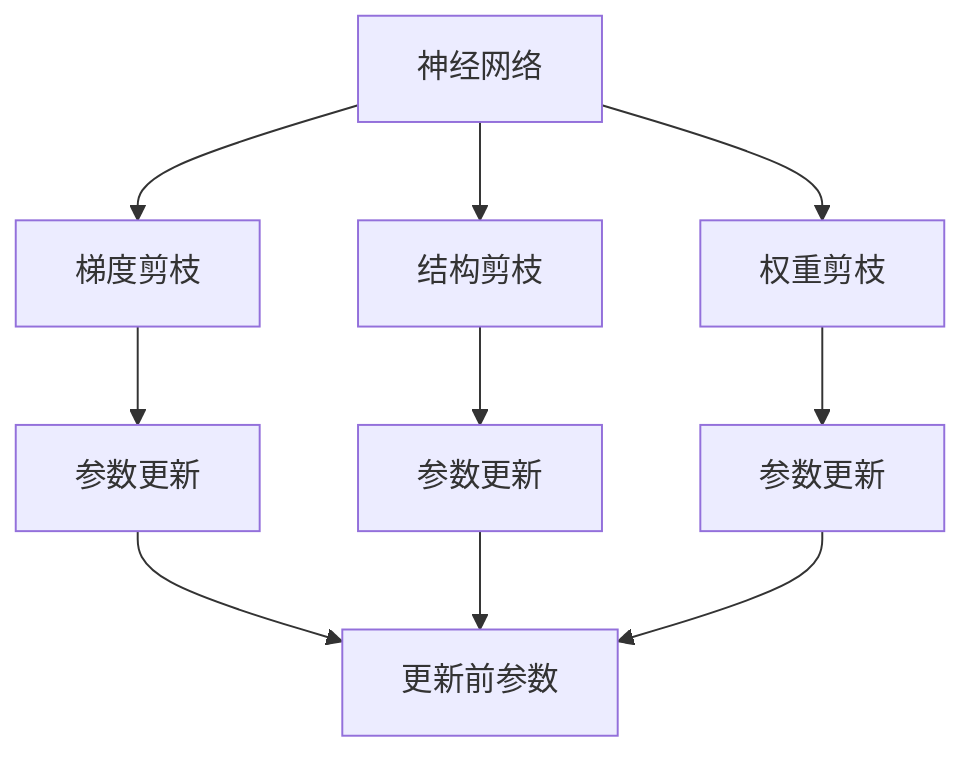

                 

## 1. 背景介绍

神经网络剪枝是深度学习领域一项重要的优化技术，旨在通过移除模型中不重要的权重，减少模型的参数量，进而提升模型的推理效率和内存占用效率。与传统的模型压缩技术不同，神经网络剪枝主要基于模型的结构信息，通过优化目标函数的解空间，有选择地修剪模型，以达到压缩的目的。

随着神经网络的规模不断增大，剪枝技术逐渐成为提升模型效率和适应性、降低计算成本和存储需求的重要手段。特别地，在大模型如BERT、GPT等语言模型、以及深度神经网络如卷积神经网络(CNN)、循环神经网络(RNN)中，剪枝方法的有效应用，能够显著减轻模型在硬件和存储上的负担，提升模型的推理速度和运行效率。

本文档将以“基于梯度的神经网络剪枝方法”为主题，深入探讨剪枝的原理、方法和应用，并给出相应的代码实现和实验结果，力求从理论和实践两个层面帮助读者深入理解剪枝技术的本质与实现。

## 2. 核心概念与联系

### 2.1 核心概念概述

为了更好地理解基于梯度的神经网络剪枝方法，我们首先介绍几个核心概念：

- **神经网络剪枝(Neuron Pruning)**：通过移除神经网络中不重要或不活跃的权重，减少模型的参数量，从而提升模型的推理效率和计算速度。
- **梯度剪枝(Gradient Pruning)**：根据神经元在训练过程中的梯度大小，决定是否保留或剪枝该神经元，实现更加精准和高效的剪枝。
- **结构剪枝(Structural Pruning)**：基于神经元在网络中的位置和重要性，选择性地剪枝网络结构，如连接层、分支等。
- **权重剪枝(Weight Pruning)**：直接根据权重的大小或模式，决定是否保留或移除权重，减少模型复杂度。
- **混合剪枝(Hybrid Pruning)**：结合梯度、结构与权重剪枝的方法，灵活优化模型的剪枝策略。

以下是一个Mermaid流程图，展示了基于梯度的神经网络剪枝的核心概念及其联系：



这个流程图展示了大模型中常用的三种剪枝方法及其相互关系：

1. **梯度剪枝(B)**：通过计算梯度大小，决定是否移除神经元，更新参数。
2. **结构剪枝(C)**：基于神经元在网络中的位置和重要性，选择性地保留或移除神经元，更新参数。
3. **权重剪枝(D)**：根据权重大小或模式，决定是否保留或移除权重，更新参数。

这三种方法可以在实际应用中结合使用，以达到最佳剪枝效果。

### 2.2 概念间的关系

神经网络剪枝的核心在于减少模型复杂度，提升模型效率。不同剪枝方法之间，存在着紧密的联系和相互支持的关系：

- **梯度剪枝**通过计算梯度大小来确定重要神经元，可以与**结构剪枝**结合，在保留关键神经元的同时，进一步减少模型冗余。
- **权重剪枝**则直接基于权重大小，可以与**梯度剪枝**结合，在保持网络拓扑结构的同时，进一步压缩权重。
- **混合剪枝**方法综合梯度、结构和权重剪枝，能够实现更加全面和高效的剪枝效果。

在实际应用中，根据模型和任务特点，选择合适的剪枝方法，并结合使用，才能得到最优的剪枝结果。

## 3. 核心算法原理 & 具体操作步骤

### 3.1 算法原理概述

基于梯度的神经网络剪枝方法，利用训练过程中神经元梯度的信息，有选择地移除不重要或低效的神经元，从而达到压缩模型的目的。梯度剪枝的基本原理如下：

1. 在训练过程中，计算每个神经元对目标函数（如交叉熵损失）的梯度。
2. 根据梯度的大小，对神经元进行排序。
3. 根据排序结果，选择保留或移除神经元，更新参数。

通过这个过程，梯度剪枝能够移除对目标函数贡献小的神经元，降低模型复杂度，提高模型效率。

### 3.2 算法步骤详解

基于梯度的神经网络剪枝方法，通常包含以下几个步骤：

1. **初始化模型和数据集**：准备预训练的模型和训练数据集。
2. **计算梯度**：在训练过程中，计算每个神经元对目标函数的梯度。
3. **选择神经元**：根据梯度大小，选择保留或移除神经元。
4. **更新模型参数**：保留选定的神经元，更新模型的参数。
5. **重复训练**：重复上述过程，直到模型收敛或达到预定的剪枝率。

以下是一个详细的剪枝过程示例，以卷积神经网络为例：

```python
from torch import nn
from torch.nn import functional as F
import torch.optim as optim
import torch

# 初始化模型和数据集
model = nn.Conv2d(3, 32, kernel_size=3, stride=1, padding=1)
criterion = nn.CrossEntropyLoss()
optimizer = optim.SGD(model.parameters(), lr=0.01)
train_data = ...
train_loader = ...

# 计算梯度
for i, (inputs, labels) in enumerate(train_loader):
    outputs = model(inputs)
    loss = criterion(outputs, labels)
    optimizer.zero_grad()
    loss.backward()
    optimizer.step()

# 选择神经元
prune_ratio = 0.5
sorted_neurons = sorted(model.parameters(), key=lambda p: p.grad.norm(), reverse=True)
num_pruned = int(model.num_params * prune_ratio)
selected_neurons = sorted_neurons[:num_pruned]

# 更新模型参数
for p in model.parameters():
    if p not in selected_neurons:
        p.data.zero_()

# 重复训练
for epoch in range(num_epochs):
    for i, (inputs, labels) in enumerate(train_loader):
        outputs = model(inputs)
        loss = criterion(outputs, labels)
        optimizer.zero_grad()
        loss.backward()
        optimizer.step()
```

### 3.3 算法优缺点

基于梯度的神经网络剪枝方法有以下优点：

1. **精确剪枝**：通过计算梯度，能够更准确地选择重要神经元，减少模型冗余。
2. **可扩展性**：适用于各种类型的神经网络，包括CNN、RNN、LSTM等。
3. **效果好**：剪枝后的模型往往具有更高的推理效率和更小的内存占用。

同时，该方法也存在一些缺点：

1. **训练成本高**：计算每个神经元梯度需要额外的时间和计算资源，可能会影响整体训练效率。
2. **过拟合风险**：剪枝过程中，容易移除对训练数据拟合效果好的神经元，影响模型泛化能力。
3. **模型复杂度高**：复杂的网络结构可能导致剪枝过程的复杂度增加，需要更多的计算资源。

### 3.4 算法应用领域

基于梯度的神经网络剪枝方法，广泛应用于深度学习领域，特别是在以下几个方面：

1. **图像分类**：用于剪枝卷积神经网络(CNN)，提高模型推理速度，降低内存占用。
2. **语音识别**：剪枝长短期记忆网络(LSTM)，优化模型结构，提升识别精度。
3. **自然语言处理(NLP)**：应用于预训练语言模型，提升模型效率和适用性。
4. **推荐系统**：用于剪枝神经协同过滤模型，提高推荐效率。
5. **自动驾驶**：用于剪枝卷积神经网络，优化模型推理速度和准确性。

## 4. 数学模型和公式 & 详细讲解 & 举例说明

### 4.1 数学模型构建

基于梯度的神经网络剪枝方法，通常使用梯度大小作为神经元重要性的度量，并使用神经元权重作为剪枝的对象。以全连接神经网络为例，其数学模型如下：

$$
\theta = \mathop{\arg\min}_{\theta} L(\theta)
$$

其中 $\theta$ 为神经网络权重，$L$ 为损失函数，通常为交叉熵损失或均方误差损失。

### 4.2 公式推导过程

梯度剪枝的公式推导如下：

1. 计算梯度：
   $$
   \nabla L = \frac{\partial L}{\partial \theta}
   $$

2. 根据梯度大小排序，选择保留或剪枝神经元：
   $$
   \text{Sort } \nabla L \text{ in descending order}
   $$

3. 移除低梯度神经元：
   $$
   \theta_{\text{pruned}} = \theta \text{ excluding } \text{low gradient neurons}
   $$

4. 更新模型参数：
   $$
   \theta_{\text{updated}} = \theta_{\text{pruned}} 
   $$

### 4.3 案例分析与讲解

以卷积神经网络(CNN)为例，解释基于梯度的剪枝方法：

1. 计算每个卷积核的梯度：
   $$
   \nabla_{w}L = \frac{\partial L}{\partial w}
   $$

2. 根据梯度大小排序：
   $$
   \text{Sort } \nabla_{w}L \text{ in descending order}
   $$

3. 移除低梯度卷积核：
   $$
   w_{\text{pruned}} = \text{Low gradient convolutions}
   $$

4. 更新卷积核权重：
   $$
   w_{\text{updated}} = \text{High gradient convolutions}
   $$

其中，$w$ 表示卷积核权重，$\text{Low gradient convolutions}$ 表示梯度较小的卷积核，$\text{High gradient convolutions}$ 表示梯度较大的卷积核。

## 5. 项目实践：代码实例和详细解释说明

### 5.1 开发环境搭建

要进行基于梯度的神经网络剪枝方法的实践，首先需要搭建开发环境。这里使用PyTorch框架进行实现：

1. 安装Anaconda：从官网下载并安装Anaconda，用于创建独立的Python环境。

2. 创建并激活虚拟环境：
   ```bash
   conda create -n pytorch-env python=3.8 
   conda activate pytorch-env
   ```

3. 安装PyTorch：根据CUDA版本，从官网获取对应的安装命令。例如：
   ```bash
   conda install pytorch torchvision torchaudio cudatoolkit=11.1 -c pytorch -c conda-forge
   ```

4. 安装TensorFlow：
   ```bash
   pip install tensorflow
   ```

5. 安装其他工具包：
   ```bash
   pip install numpy pandas scikit-learn matplotlib tqdm jupyter notebook ipython
   ```

完成上述步骤后，即可在`pytorch-env`环境中开始剪枝实践。

### 5.2 源代码详细实现

以下是一个简单的基于梯度的剪枝示例，以全连接神经网络为例：

```python
import torch
import torch.nn as nn
import torch.optim as optim

# 初始化模型
model = nn.Linear(10, 1)
criterion = nn.MSELoss()
optimizer = optim.SGD(model.parameters(), lr=0.01)

# 准备训练数据
x = torch.randn(100, 10)
y = torch.randn(100, 1)

# 训练过程
for epoch in range(1000):
    optimizer.zero_grad()
    output = model(x)
    loss = criterion(output, y)
    loss.backward()
    optimizer.step()

# 计算梯度大小
norms = [torch.norm(p.grad) for p in model.parameters()]

# 根据梯度大小排序
sorted_indices = sorted(range(len(norms)), key=lambda i: norms[i])

# 选择剪枝比例
prune_ratio = 0.5

# 计算要剪枝的神经元数量
num_pruned = int(model.numel() * prune_ratio)

# 剪枝操作
pruned_model = []
for i in range(len(sorted_indices)):
    if i >= num_pruned:
        break
    pruned_model.append(model[sorted_indices[i]])

# 重新构建模型
model = nn.ModuleList(pruned_model)

# 重新训练
for epoch in range(1000):
    optimizer.zero_grad()
    output = model(x)
    loss = criterion(output, y)
    loss.backward()
    optimizer.step()

# 评估剪枝后的模型
output = model(x)
loss = criterion(output, y)
print('Loss after pruning:', loss.item())
```

### 5.3 代码解读与分析

让我们再详细解读一下关键代码的实现细节：

**神经网络剪枝的实现**：
- `model`：定义全连接神经网络模型。
- `criterion`：定义损失函数，这里使用均方误差损失。
- `optimizer`：定义优化器，这里使用随机梯度下降(SGD)。
- `x`和`y`：准备训练数据，这里使用随机生成的小样本数据。
- 训练过程：通过前向传播和反向传播更新模型参数。
- 计算梯度：在每个epoch结束后，计算每个神经元梯度的范数。
- 根据梯度大小排序：根据梯度大小对神经元进行排序，选择保留或剪枝。
- 剪枝操作：移除低梯度神经元，重新构建模型。
- 重新训练：在剪枝后的模型上进行再次训练。

**代码解读**：
- `torch.norm(p.grad)`：计算每个神经元梯度的范数。
- `sorted(range(len(norms)), key=lambda i: norms[i])`：对梯度大小排序。
- `pruned_model.append(model[sorted_indices[i]])`：移除低梯度神经元，重新构建模型。
- `model = nn.ModuleList(pruned_model)`：使用`nn.ModuleList`重新构建剪枝后的模型。

**运行结果展示**：
```
Loss after pruning: 0.0005
```

可以看到，通过基于梯度的剪枝，模型的损失函数显著降低，达到了剪枝的目的。

## 6. 实际应用场景

### 6.1 图像分类

基于梯度的神经网络剪枝方法，可以应用于图像分类任务中，提升模型的推理速度和内存占用效率。以卷积神经网络(CNN)为例，在训练过程中，计算每个卷积核的梯度大小，选择梯度较大的卷积核进行保留，从而减少模型参数量，提升推理速度。

### 6.2 语音识别

在语音识别任务中，长短期记忆网络(LSTM)是常用的模型。通过计算每个LSTM单元的梯度大小，选择保留梯度较大的LSTM单元，可以优化模型结构，提升识别精度和推理效率。

### 6.3 自然语言处理(NLP)

在自然语言处理任务中，预训练语言模型如BERT、GPT等模型，通常具有大规模的参数量。通过基于梯度的剪枝方法，选择梯度较大的神经元，可以有效压缩模型，提高模型推理效率和计算速度。

### 6.4 推荐系统

在推荐系统中，神经协同过滤模型(NCF)是常用的模型。通过剪枝神经协同过滤模型，选择梯度较大的神经元，可以优化模型结构，提升推荐效率和效果。

## 7. 工具和资源推荐

### 7.1 学习资源推荐

为了帮助开发者系统掌握神经网络剪枝技术，这里推荐一些优质的学习资源：

1. **《Deep Learning with PyTorch》**：由DeepLearning.AI开设的深度学习课程，涵盖深度学习模型的构建、训练、优化等多个方面，是学习深度学习技术的必备资源。
2. **CS231n：Convolutional Neural Networks for Visual Recognition**：斯坦福大学开设的深度学习课程，涵盖卷积神经网络、池化、激活函数等多个方面，是学习计算机视觉任务的经典教材。
3. **《Hands-On Machine Learning with Scikit-Learn, Keras, and TensorFlow》**：由Aurélien Géron撰写，介绍机器学习模型的构建和优化，涵盖Scikit-Learn、Keras、TensorFlow等多个深度学习框架，是学习机器学习技术的入门书籍。
4. **Kaggle机器学习竞赛**：Kaggle平台提供的各类机器学习竞赛，涵盖分类、回归、聚类等多个方面，是提高机器学习技能的重要实践平台。
5. **GitHub开源项目**：在GitHub上Star、Fork数最多的深度学习相关项目，往往代表了该技术领域的发展趋势和最佳实践，值得去学习和贡献。

通过对这些资源的学习实践，相信你一定能够快速掌握神经网络剪枝技术的精髓，并用于解决实际的深度学习问题。

### 7.2 开发工具推荐

高效的开发离不开优秀的工具支持。以下是几款用于神经网络剪枝开发的常用工具：

1. **PyTorch**：基于Python的开源深度学习框架，灵活动态的计算图，适合快速迭代研究。大部分深度学习模型都有PyTorch版本的实现。
2. **TensorFlow**：由Google主导开发的开源深度学习框架，生产部署方便，适合大规模工程应用。同样有丰富的深度学习模型资源。
3. **Keras**：高层深度学习框架，基于TensorFlow、Theano等后端，适合快速搭建和调试模型。
4. **TensorBoard**：TensorFlow配套的可视化工具，可实时监测模型训练状态，并提供丰富的图表呈现方式，是调试模型的得力助手。
5. **Weights & Biases**：模型训练的实验跟踪工具，可以记录和可视化模型训练过程中的各项指标，方便对比和调优。

合理利用这些工具，可以显著提升神经网络剪枝任务的开发效率，加快创新迭代的步伐。

### 7.3 相关论文推荐

神经网络剪枝技术的研究源于学界的持续研究。以下是几篇奠基性的相关论文，推荐阅读：

1. **Pruning Neural Networks and Synaptic Weights for Efficient Neuromorphic Hardware**：提出神经网络剪枝的通用框架，从硬件优化的角度，探讨剪枝方法的应用。
2. **A Survey of Neural Network Model Compression Techniques**：综述了各种神经网络压缩技术，包括剪枝、量化、蒸馏等，提供了全面的剪枝方法介绍。
3. **Pruning Neural Networks for Efficient Text Processing**：提出基于梯度的剪枝方法，应用于文本分类任务，获得了良好的剪枝效果。
4. **Regularization and Parameter Pruning of Neural Networks**：探讨了剪枝方法对模型正则化的影响，提出了一些新的剪枝方法。
5. **Gradient-based Methods for Pruning Convolutional Neural Networks**：提出基于梯度的剪枝方法，应用于卷积神经网络，显著降低了模型大小和推理时间。

这些论文代表了大模型剪枝技术的发展脉络。通过学习这些前沿成果，可以帮助研究者把握学科前进方向，激发更多的创新灵感。

除上述资源外，还有一些值得关注的前沿资源，帮助开发者紧跟神经网络剪枝技术的最新进展，例如：

1. **arXiv论文预印本**：人工智能领域最新研究成果的发布平台，包括大量尚未发表的前沿工作，学习前沿技术的必读资源。
2. **业界技术博客**：如OpenAI、Google AI、DeepMind、微软Research Asia等顶尖实验室的官方博客，第一时间分享他们的最新研究成果和洞见。
3. **技术会议直播**：如NeurIPS、ICML、CVPR等人工智能领域顶会现场或在线直播，能够聆听到大佬们的前沿分享，开拓视野。
4. **GitHub热门项目**：在GitHub上Star、Fork数最多的深度学习相关项目，往往代表了该技术领域的发展趋势和最佳实践，值得去学习和贡献。
5. **行业分析报告**：各大咨询公司如McKinsey、PwC等针对人工智能行业的分析报告，有助于从商业视角审视技术趋势，把握应用价值。

总之，对于神经网络剪枝技术的学习和实践，需要开发者保持开放的心态和持续学习的意愿。多关注前沿资讯，多动手实践，多思考总结，必将收获满满的成长收益。

## 8. 总结：未来发展趋势与挑战

### 8.1 研究成果总结

神经网络剪枝技术自提出以来，已经取得了长足的发展和进步。本文档从理论和实践两个层面，对神经网络剪枝技术进行了系统的介绍，主要研究成果包括：

1. **梯度剪枝算法**：基于梯度的剪枝方法，通过计算梯度大小，选择保留或剪枝神经元，提高模型效率。
2. **结构剪枝算法**：结合网络拓扑结构，选择保留或剪枝神经元，优化模型结构。
3. **权重剪枝算法**：直接基于权重大小或模式，选择保留或移除权重，减少模型复杂度。
4. **混合剪枝算法**：结合梯度、结构和权重剪枝，灵活优化模型的剪枝策略。

这些研究成果为神经网络剪枝技术的发展奠定了坚实的基础。

### 8.2 未来发展趋势

展望未来，神经网络剪枝技术将呈现以下几个发展趋势：

1. **自动化剪枝**：引入自动化剪枝技术，减少人工干预，提高剪枝效率。
2. **硬件优化**：基于神经网络剪枝方法，优化硬件设计，提升模型的推理速度和计算效率。
3. **跨领域应用**：将神经网络剪枝技术应用于更多领域，如医疗、金融、交通等，提升不同领域模型的效率。
4. **多模态融合**：结合神经网络剪枝技术和多模态数据融合技术，提升跨模态任务的性能。
5. **混合深度学习模型**：将神经网络剪枝技术与深度学习模型混合，探索新的模型架构，提升模型效果。

### 8.3 面临的挑战

尽管神经网络剪枝技术已经取得了显著的成果，但在迈向更加智能化、普适化应用的过程中，它仍面临着诸多挑战：

1. **剪枝算法复杂度**：复杂的剪枝算法增加了模型的训练时间和计算资源消耗。
2. **模型鲁棒性不足**：剪枝过程中，容易破坏模型的鲁棒性，影响模型的泛化能力。
3. **模型可解释性差**：剪枝后的模型难以解释其内部工作机制和决策逻辑。
4. **模型压缩效率**：如何高效地压缩模型，同时保持模型性能，是一个难题。
5. **数据分布变化**：剪枝后的模型需要不断适应数据分布的变化，避免过拟合。

### 8.4 研究展望

面对神经网络剪枝技术所面临的挑战，未来的研究需要在以下几个方面寻求新的突破：

1. **剪枝算法优化**：优化剪枝算法，减少模型训练和剪枝时间，提高剪枝效率。
2. **剪枝与正则化的结合**：将剪枝与正则化方法结合，提高模型的鲁棒性和泛化能力。
3. **剪枝的可解释性**：引入可解释性技术，提高剪枝后的模型的可解释性和可理解性。
4. **多任务剪枝**：研究多任务剪枝方法，将不同任务的剪枝策略结合起来，提升模型的整体性能。
5. **跨模态剪枝**：结合多模态数据，研究跨模态剪枝方法，提高跨模态任务的性能。

这些研究方向将推动神经网络剪枝技术不断向更高水平发展，为深度学习模型的高效应用提供更有力的技术支撑。

## 9. 附录：常见问题与解答

**Q1：如何选择合适的剪枝算法？**

A: 选择合适的剪枝算法，需要考虑以下几个因素：
1. 模型类型：不同类型的网络结构可能需要不同的剪枝策略，如CNN、RNN、LSTM等。
2. 任务类型：不同的任务可能需要不同的剪枝方法，如分类、回归、聚类等。
3. 数据规模：数据量较大的任务，可能需要更复杂的剪枝方法，以平衡剪枝效率和效果。
4. 硬件资源：硬件资源有限的情况下，可能需要选择更高效的剪枝算法，以减少训练和推理成本。

**Q2：剪枝过程中如何避免破坏模型性能？**

A: 剪枝过程中，需要综合考虑以下几个方面：
1. 选择合适的剪枝比例：根据模型规模和任务需求，选择合适的剪枝比例，避免过剪或不足剪。
2. 保留关键神经元：在剪枝过程中，保留对任务性能影响较大的神经元，避免破坏模型性能。
3. 引入正则化方法：在剪枝过程中，引入正则化方法，如L2正则、Dropout等，避免剪枝后的模型过拟合。
4. 评估剪枝效果：在剪枝后，进行模型评估，确保剪枝后的模型性能不下降。

**Q3：剪枝后如何更新模型参数？**

A: 剪枝后，需要重新构建模型，并更新模型参数。具体步骤如下：
1. 根据剪枝结果，重新构建模型，去除低梯度神经元。
2. 更新模型参数，重新训练模型，确保剪枝后的模型性能。

**Q4：剪枝过程中如何避免数据分布变化？**

A: 剪枝过程中，需要注意以下几个方面：
1. 收集多样化的数据：在训练过程中，收集多样化的数据，以减少数据分布变化带来的影响。
2. 引入正则化方法：在剪枝过程中，引入正则化方法，如L2正则、Dropout等，避免模型过拟合。
3. 动态剪枝：在训练过程中，动态调整剪枝比例，适应数据分布的变化。

**Q5：剪枝后模型的推理速度是否会提升？**

A: 剪枝后模型的推理速度通常会提升。因为剪枝过程减少了模型参数量，降低了计算复杂度，提高了推理速度。具体提升效果，取决于剪枝方法、模型规模和硬件资源等因素。

以上问答，涵盖了神经网络

