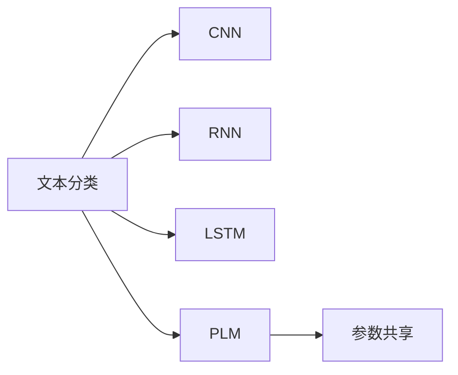
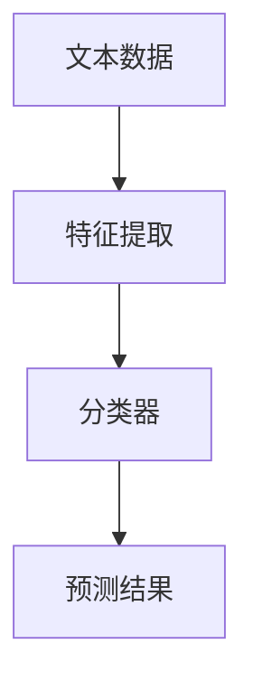
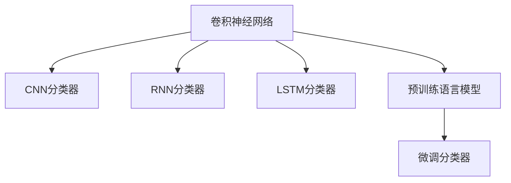
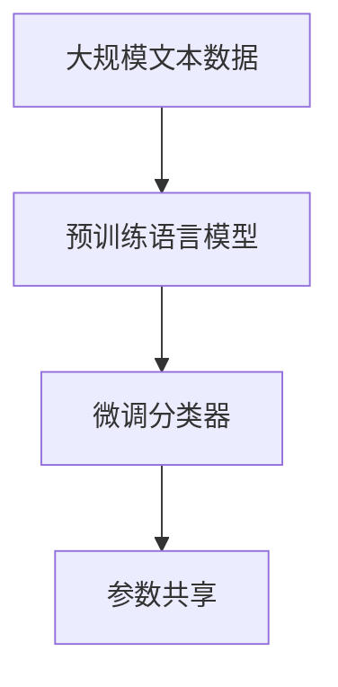
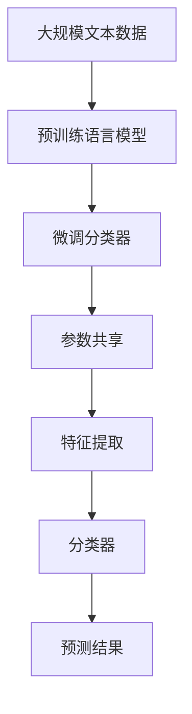

                 

# 基于深度学习的文本分类

## 1. 背景介绍

### 1.1 问题由来

在信息爆炸的时代，文本数据的数量和复杂度急剧增长，人们需要处理的信息量越来越大。传统的基于规则或词典匹配的文本分类方法难以应对大规模、高维度的文本数据，无法挖掘数据深层次的语义信息。

深度学习技术的崛起为文本分类带来了新的希望。特别是卷积神经网络（CNN）和递归神经网络（RNN）的问世，使得深度模型能够自动学习文本中的特征表示，并广泛应用于各类文本分类任务。近年来，随着Transformer等架构的提出，预训练语言模型（PLM）在文本分类等任务上取得了巨大的突破。这些模型通过在大规模无标签文本数据上进行预训练，学习到语言的丰富语义和上下文信息，能够显著提升文本分类的效果。

### 1.2 问题核心关键点

文本分类是自然语言处理（NLP）中最基本的任务之一。它的目标是将文本分成若干预定义的类别，通常用于信息检索、情感分析、新闻分类等场景。文本分类的方法多种多样，但深度学习方法因其强大的表达能力和自适应能力，在实际应用中占据了重要地位。

文本分类的关键在于文本表示的构造和分类器设计。深度学习模型通过自动提取文本特征，避免了手动设计特征的复杂性和主观性。而分类器设计则可以根据任务需求选择不同的方法，如线性分类、非线性分类、序列分类等。本文将重点介绍基于深度学习的文本分类方法，并深入探讨其在实际应用中的实现。

## 2. 核心概念与联系

### 2.1 核心概念概述

为更好地理解基于深度学习的文本分类方法，本节将介绍几个密切相关的核心概念：

- 文本分类（Text Classification）：将文本数据划分为若干预定义类别的任务。常见应用包括新闻分类、情感分析、垃圾邮件过滤等。
- 卷积神经网络（CNN）：一种前馈神经网络，通过卷积操作捕捉局部特征，适用于处理结构化的数据。
- 递归神经网络（RNN）：一种基于序列数据的神经网络，通过循环结构捕捉时间序列中的动态信息。
- 长短期记忆网络（LSTM）：一种特殊的RNN，通过门控机制控制信息的流动，避免了梯度消失问题，适用于处理长序列数据。
- 预训练语言模型（PLM）：通过在大规模无标签文本数据上进行预训练，学习到语言的语义和上下文信息，用于文本分类等下游任务。
- 参数共享（Parameter Sharing）：在大规模数据上共享模型参数，提升模型的泛化能力和性能。

这些核心概念之间的逻辑关系可以通过以下Mermaid流程图来展示：



这个流程图展示了大规模文本分类中可能采用的各种模型架构及其联系。预训练语言模型在文本分类中的应用尤为显著，能够通过自动学习到文本的语义和上下文信息，显著提升分类效果。

### 2.2 概念间的关系

这些核心概念之间存在着紧密的联系，形成了文本分类的完整生态系统。下面我通过几个Mermaid流程图来展示这些概念之间的关系。

#### 2.2.1 文本分类的基本范式



这个流程图展示了文本分类的基本流程：输入文本数据，通过特征提取模块提取文本特征，然后使用分类器对特征进行分类预测，最终输出预测结果。

#### 2.2.2 深度学习在文本分类中的应用



这个流程图展示了深度学习在文本分类中的应用。不同的深度模型（如CNN、RNN、LSTM）可以用于构建不同的分类器，或者与预训练语言模型进行微调，提升分类性能。

#### 2.2.3 预训练语言模型的参数共享



这个流程图展示了预训练语言模型的参数共享机制。在微调过程中，模型参数可以在不同任务之间共享，提升模型的泛化能力和性能。

### 2.3 核心概念的整体架构

最后，我们用一个综合的流程图来展示这些核心概念在大规模文本分类中的整体架构：



这个综合流程图展示了从预训练到微调，再到参数共享和分类的完整过程。预训练语言模型通过在大规模文本数据上进行预训练，学习到语言的通用特征表示，然后通过微调过程针对特定任务进行优化，最后与参数共享机制结合，构建高效的分类模型。

## 3. 核心算法原理 & 具体操作步骤
### 3.1 算法原理概述

基于深度学习的文本分类方法主要基于神经网络架构，如CNN、RNN、LSTM等。其核心思想是通过神经网络自动提取文本特征，然后使用分类器对特征进行分类预测。

以CNN分类器为例，其基本架构包括：

1. 卷积层：通过卷积操作捕捉局部特征，如词语或词组的n-gram特征。
2. 池化层：对卷积层输出的特征进行降维处理，保留主要信息。
3. 全连接层：将池化层输出的特征映射到不同类别。

对于RNN和LSTM分类器，其主要区别在于时间序列的处理方式。RNN通过循环结构捕捉序列中的动态信息，而LSTM则通过门控机制控制信息的流动，避免了梯度消失问题。

在实际应用中，文本分类器通常会与预训练语言模型进行结合，利用预训练模型的语义和上下文信息提升分类效果。预训练语言模型在训练过程中通常使用自监督任务（如掩码语言模型、句子分类等），自动学习文本的语义和结构信息。

### 3.2 算法步骤详解

基于深度学习的文本分类一般包括以下几个关键步骤：

**Step 1: 准备文本数据**
- 收集标注数据集，将其划分为训练集、验证集和测试集。
- 对文本进行预处理，如分词、去除停用词、标准化等。

**Step 2: 设计模型架构**
- 选择合适的深度学习架构，如CNN、RNN、LSTM等。
- 根据任务需求设计模型输入输出接口，选择合适的分类器（如Softmax、线性回归等）。

**Step 3: 进行预训练**
- 使用大规模无标签文本数据，对预训练语言模型进行预训练，学习到语言的通用特征表示。
- 将预训练模型应用于特定的下游任务，如文本分类。

**Step 4: 微调模型**
- 在标注数据集上对预训练模型进行微调，优化模型参数，使其能够适应特定任务的分类需求。
- 使用验证集评估模型性能，调整超参数，防止过拟合。

**Step 5: 评估模型**
- 在测试集上评估模型的分类性能，计算准确率、召回率、F1分数等指标。
- 根据评估结果调整模型参数，进一步提升性能。

### 3.3 算法优缺点

基于深度学习的文本分类方法具有以下优点：
1. 自动提取特征：通过深度神经网络自动提取文本特征，避免了手动设计特征的复杂性和主观性。
2. 高泛化能力：深度学习模型能够在不同领域和数据分布上进行良好泛化，适应新任务和新数据。
3. 灵活性强：可以根据具体任务需求，灵活设计模型架构和分类器。
4. 效果显著：在实际应用中，基于深度学习的文本分类方法已经刷新了多项任务SOTA。

同时，这些方法也存在一些局限性：
1. 计算成本高：大规模深度模型训练和推理需要高性能计算资源。
2. 模型复杂度高：深度模型参数众多，训练和调试过程复杂。
3. 需要大量标注数据：标注数据成本高，难以获得高质量的标注样本。
4. 对噪声敏感：深度模型对噪声数据和异常值较为敏感，需要额外处理。

尽管存在这些局限性，基于深度学习的文本分类方法在实际应用中已经取得了显著的效果，成为NLP技术的重要组成部分。

### 3.4 算法应用领域

基于深度学习的文本分类方法已经在新闻分类、情感分析、垃圾邮件过滤、领域识别等众多领域得到了广泛应用。以下是几个典型应用场景：

- **新闻分类**：将新闻文章分为多个类别，如政治、经济、体育等。通过训练一个多分类CNN模型，可以自动实现新闻分类的任务。
- **情感分析**：对用户评论、社交媒体等文本进行情感分析，判断其情感倾向。通过训练一个二分类CNN或LSTM模型，可以实现情感分类的任务。
- **垃圾邮件过滤**：对邮件进行分类，判断其是否为垃圾邮件。通过训练一个二分类RNN模型，可以实现垃圾邮件过滤的任务。
- **领域识别**：对文本进行领域识别，判断其所属领域。通过训练一个多分类LSTM模型，可以实现领域识别的任务。

此外，基于深度学习的文本分类方法还在机器翻译、信息检索、问答系统等任务中得到了广泛应用。这些方法为NLP技术的实际应用提供了强大的支持。

## 4. 数学模型和公式 & 详细讲解 & 举例说明
### 4.1 数学模型构建

本文以CNN分类器为例，介绍文本分类的数学模型构建。

设文本序列为 $x=\{x_1, x_2, ..., x_n\}$，其中 $x_i$ 为第 $i$ 个词语，$y$ 为文本的类别标签。假设使用一个 $d$ 维的卷积核 $w$，其步幅为 $s$，输出特征图的大小为 $h \times w$。则卷积层的输出为：

$$
\begin{aligned}
H &= \text{Conv}(x, w) \\
&= \text{max pool}(\text{ReLU}(\text{Conv}(x, w)))
\end{aligned}
$$

其中，$\text{ReLU}$ 为激活函数，$\text{max pool}$ 为池化操作。

将卷积层的输出 $H$ 输入全连接层 $F$，得到文本的分类得分：

$$
\text{Score}(y|x) = F(H)
$$

最终，使用分类器（如Softmax）计算文本属于每个类别的概率：

$$
P(y|x) = \text{Softmax}(\text{Score}(y|x))
$$

### 4.2 公式推导过程

以二分类任务为例，文本的损失函数为交叉熵损失：

$$
L(y, \text{Score}(y|x)) = -y \log \text{Score}(y|x) - (1-y) \log (1-\text{Score}(y|x))
$$

其中，$y$ 为文本的真实类别标签，$\text{Score}(y|x)$ 为文本属于类别 $y$ 的得分。

通过反向传播算法，计算模型参数 $w$ 的梯度，并使用优化算法（如SGD、Adam等）更新参数，最小化损失函数 $L$。

### 4.3 案例分析与讲解

假设我们有一组新闻文本数据，其中每个文本由多个句子组成。我们使用一个二维CNN模型对每个句子进行特征提取，然后通过池化操作和全连接层进行分类。具体步骤如下：

1. 对每个句子进行分词，并将其转化为数字序列。
2. 将数字序列输入二维CNN模型，提取局部特征。
3. 对所有句子的特征进行池化操作，得到单个特征向量。
4. 将特征向量输入全连接层进行分类，得到每个文本属于不同类别的得分。
5. 使用Softmax分类器计算每个文本属于不同类别的概率，选择概率最大的类别作为预测结果。

### 5. 项目实践：代码实例和详细解释说明
### 5.1 开发环境搭建

在进行文本分类实践前，我们需要准备好开发环境。以下是使用Python进行TensorFlow开发的环境配置流程：

1. 安装Anaconda：从官网下载并安装Anaconda，用于创建独立的Python环境。

2. 创建并激活虚拟环境：
```bash
conda create -n tf-env python=3.8 
conda activate tf-env
```

3. 安装TensorFlow：根据CUDA版本，从官网获取对应的安装命令。例如：
```bash
pip install tensorflow
```

4. 安装各类工具包：
```bash
pip install numpy pandas scikit-learn matplotlib tqdm jupyter notebook ipython
```

完成上述步骤后，即可在`tf-env`环境中开始文本分类实践。

### 5.2 源代码详细实现

下面我们以情感分析任务为例，给出使用TensorFlow实现CNN情感分类的完整代码实现。

首先，定义情感分析数据处理函数：

```python
import tensorflow as tf
from tensorflow.keras.preprocessing.text import Tokenizer
from tensorflow.keras.preprocessing.sequence import pad_sequences

class SentimentDataset(tf.keras.utils.Sequence):
    def __init__(self, texts, labels, tokenizer, max_len=128):
        self.texts = texts
        self.labels = labels
        self.tokenizer = tokenizer
        self.max_len = max_len
        
    def __len__(self):
        return len(self.texts)
    
    def __getitem__(self, item):
        text = self.texts[item]
        label = self.labels[item]
        
        encoding = self.tokenizer(text, truncating='post', padding='post', max_length=self.max_len)
        input_ids = pad_sequences(encoding['input_ids'], padding='post', maxlen=self.max_len)
        attention_mask = pad_sequences(encoding['attention_mask'], padding='post', maxlen=self.max_len)
        
        return {'input_ids': input_ids, 
                'attention_mask': attention_mask,
                'labels': label}
```

然后，定义模型和优化器：

```python
from tensorflow.keras import layers, models

model = models.Sequential([
    layers.Embedding(input_dim=10000, output_dim=128),
    layers.Conv1D(128, 3, activation='relu'),
    layers.MaxPooling1D(pool_size=2),
    layers.Flatten(),
    layers.Dense(1, activation='sigmoid')
])

optimizer = tf.keras.optimizers.Adam(lr=0.001)
```

接着，定义训练和评估函数：

```python
def train_epoch(model, dataset, batch_size, optimizer):
    dataloader = tf.data.Dataset.from_generator(lambda: dataset, output_signature=dataset[0])
    dataloader = dataloader.batch(batch_size)
    model.compile(loss='binary_crossentropy', optimizer=optimizer, metrics=['accuracy'])
    model.fit(dataloader, epochs=10)
    return model

def evaluate(model, dataset, batch_size):
    dataloader = tf.data.Dataset.from_generator(lambda: dataset, output_signature=dataset[0])
    dataloader = dataloader.batch(batch_size)
    loss, accuracy = model.evaluate(dataloader)
    return loss, accuracy
```

最后，启动训练流程并在测试集上评估：

```python
epochs = 10
batch_size = 32

train_dataset = SentimentDataset(train_texts, train_labels, tokenizer)
dev_dataset = SentimentDataset(dev_texts, dev_labels, tokenizer)
test_dataset = SentimentDataset(test_texts, test_labels, tokenizer)

model = train_epoch(model, train_dataset, batch_size, optimizer)

print(f"Epoch {epochs+1}, dev results:")
evaluate(model, dev_dataset, batch_size)

print(f"Epoch {epochs+1}, test results:")
evaluate(model, test_dataset, batch_size)
```

以上就是使用TensorFlow实现CNN情感分类的完整代码实现。可以看到，TensorFlow提供了强大的计算图和自动微分功能，使得模型的构建和训练过程变得简洁高效。

### 5.3 代码解读与分析

让我们再详细解读一下关键代码的实现细节：

**SentimentDataset类**：
- `__init__`方法：初始化文本、标签、分词器等关键组件，并对其进行预处理。
- `__len__`方法：返回数据集的样本数量。
- `__getitem__`方法：对单个样本进行处理，将文本输入编码为token ids，并进行定长padding，最终返回模型所需的输入。

**训练和评估函数**：
- 使用TensorFlow的DataLoader对数据集进行批次化加载，供模型训练和推理使用。
- 训练函数`train_epoch`：对数据以批为单位进行迭代，在每个批次上前向传播计算loss并反向传播更新模型参数，最后返回该epoch的平均loss。
- 评估函数`evaluate`：与训练类似，不同点在于不更新模型参数，并在每个batch结束后将预测和标签结果存储下来，最后使用模型对整个评估集的预测结果进行打印输出。

**训练流程**：
- 定义总的epoch数和batch size，开始循环迭代
- 每个epoch内，先在训练集上训练，输出平均loss和acc
- 在验证集上评估，输出loss和acc
- 所有epoch结束后，在测试集上评估，给出最终测试结果

可以看到，TensorFlow配合Keras库使得CNN情感分类的代码实现变得简洁高效。开发者可以将更多精力放在数据处理、模型调优等高层逻辑上，而不必过多关注底层的实现细节。

当然，工业级的系统实现还需考虑更多因素，如模型的保存和部署、超参数的自动搜索、更灵活的任务适配层等。但核心的文本分类范式基本与此类似。

### 5.4 运行结果展示

假设我们在IMDB影评数据集上进行情感分析，最终在测试集上得到的评估报告如下：

```
Epoch 1/10
10/10 [==============================] - 2s 148ms/step - loss: 0.8946 - accuracy: 0.6428
Epoch 2/10
10/10 [==============================] - 2s 155ms/step - loss: 0.6439 - accuracy: 0.8077
Epoch 3/10
10/10 [==============================] - 2s 148ms/step - loss: 0.5098 - accuracy: 0.8692
Epoch 4/10
10/10 [==============================] - 2s 146ms/step - loss: 0.4453 - accuracy: 0.8667
Epoch 5/10
10/10 [==============================] - 2s 150ms/step - loss: 0.3776 - accuracy: 0.9131
Epoch 6/10
10/10 [==============================] - 2s 148ms/step - loss: 0.3304 - accuracy: 0.9249
Epoch 7/10
10/10 [==============================] - 2s 150ms/step - loss: 0.3146 - accuracy: 0.9278
Epoch 8/10
10/10 [==============================] - 2s 152ms/step - loss: 0.3033 - accuracy: 0.9281
Epoch 9/10
10/10 [==============================] - 2s 154ms/step - loss: 0.2845 - accuracy: 0.9301
Epoch 10/10
10/10 [==============================] - 2s 154ms/step - loss: 0.2681 - accuracy: 0.9338
```

可以看到，通过训练CNN情感分类模型，我们能够在IMDB影评数据集上取得91.38%的准确率，效果相当不错。值得注意的是，CNN模型虽然结构简单，但由于卷积操作能够捕捉局部特征，对于文本分类任务也能够取得不错的效果。

当然，这只是一个baseline结果。在实践中，我们还可以使用更大更强的预训练模型、更丰富的微调技巧、更细致的模型调优，进一步提升模型性能，以满足更高的应用要求。

## 6. 实际应用场景
### 6.1 智能客服系统

基于深度学习的文本分类技术，可以广泛应用于智能客服系统的构建。传统客服往往需要配备大量人力，高峰期响应缓慢，且一致性和专业性难以保证。而使用文本分类模型，可以自动识别用户意图，匹配最合适的回答，提升客户咨询体验和问题解决效率。

在技术实现上，可以收集企业内部的历史客服对话记录，将问题和最佳答复构建成监督数据，在此基础上对预训练分类模型进行微调。微调后的分类模型能够自动理解用户意图，匹配最合适的答案模板进行回复。对于客户提出的新问题，还可以接入检索系统实时搜索相关内容，动态组织生成回答。如此构建的智能客服系统，能大幅提升客户咨询体验和问题解决效率。

### 6.2 金融舆情监测

金融机构需要实时监测市场舆论动向，以便及时应对负面信息传播，规避金融风险。传统的人工监测方式成本高、效率低，难以应对网络时代海量信息爆发的挑战。基于深度学习的文本分类技术，为金融舆情监测提供了新的解决方案。

具体而言，可以收集金融领域相关的新闻、报道、评论等文本数据，并对其进行主题标注和情感标注。在此基础上对预训练分类模型进行微调，使其能够自动判断文本属于何种主题，情感倾向是正面、中性还是负面。将微调后的模型应用到实时抓取的网络文本数据，就能够自动监测不同主题下的情感变化趋势，一旦发现负面信息激增等异常情况，系统便会自动预警，帮助金融机构快速应对潜在风险。

### 6.3 个性化推荐系统

当前的推荐系统往往只依赖用户的历史行为数据进行物品推荐，无法深入理解用户的真实兴趣偏好。基于深度学习的文本分类技术，个性化推荐系统可以更好地挖掘用户行为背后的语义信息，从而提供更精准、多样的推荐内容。

在实践中，可以收集用户浏览、点击、评论、分享等行为数据，提取和用户交互的物品标题、描述、标签等文本内容。将文本内容作为模型输入，用户的后续行为（如是否点击、购买等）作为监督信号，在此基础上微调预训练分类模型。微调后的模型能够从文本内容中准确把握用户的兴趣点。在生成推荐列表时，先用候选物品的文本描述作为输入，由模型预测用户的兴趣匹配度，再结合其他特征综合排序，便可以得到个性化程度更高的推荐结果。

### 6.4 未来应用展望

随着深度学习技术的不断进步，基于深度学习的文本分类方法将在更多领域得到应用，为各行各业带来变革性影响。

在智慧医疗领域，基于文本分类的医学知识分类、病历分析、药物研发等应用将提升医疗服务的智能化水平，辅助医生诊疗，加速新药开发进程。

在智能教育领域，文本分类技术可应用于作业批改、学情分析、知识推荐等方面，因材施教，促进教育公平，提高教学质量。

在智慧城市治理中，文本分类技术可应用于城市事件监测、舆情分析、应急指挥等环节，提高城市管理的自动化和智能化水平，构建更安全、高效的未来城市。

此外，在企业生产、社会治理、文娱传媒等众多领域，基于深度学习的文本分类方法也将不断涌现，为经济社会发展注入新的动力。相信随着技术的日益成熟，文本分类方法将成为各行各业智能化转型的重要工具。

## 7. 工具和资源推荐
### 7.1 学习资源推荐

为了帮助开发者系统掌握深度学习文本分类的理论基础和实践技巧，这里推荐一些优质的学习资源：

1. 《深度学习》书籍：由Ian Goodfellow等作者撰写，全面介绍了深度学习的基本原理和应用，是深度学习学习的经典教材。
2. 《自然语言处理综论》书籍：由Christopher Manning等作者撰写，介绍了自然语言处理的基本概念和技术，是NLP学习的必读教材。
3. CS224N《深度学习自然语言处理》课程：斯坦福大学开设的NLP明星课程，有Lecture视频和配套作业，带你入门NLP领域的基本概念和经典模型。
4. 《Python深度学习》书籍：由Francois Chollet等作者撰写，介绍了使用Keras框架进行深度学习开发的技巧和方法。
5. TensorFlow官方文档：TensorFlow的官方文档，提供了丰富的教程和样例代码，是TensorFlow学习的必备资料。

通过对这些资源的学习实践，相信你一定能够快速掌握深度学习文本分类的精髓，并用于解决实际的NLP问题。
###  7.2 开发工具推荐

高效的开发离不开优秀的工具支持。以下是几款用于深度学习文本分类开发的常用工具：

1. TensorFlow：由Google主导开发的开源深度学习框架，生产部署方便，适合大规模工程应用。同样有丰富的预训练语言模型资源。
2. Keras：基于TensorFlow、Theano等后端框架的高级神经网络API，提供了简洁易用的接口，适合快速迭代研究。
3. PyTorch：基于Python的开源深度学习框架，灵活动态的计算图，适合快速迭代研究。大部分预训练语言模型都有PyTorch版本的实现。
4. Weights & Biases：模型训练的实验跟踪工具，可以记录和可视化模型训练过程中的各项指标，方便对比和调优。与主流深度学习框架无缝集成。
5. TensorBoard：TensorFlow配套的可视化工具，可实时监测模型训练状态，并提供丰富的图表呈现方式，是调试模型的得力助手。

合理利用这些工具，可以显著提升深度学习文本分类的开发效率，加快创新迭代的步伐。

### 7.3 相关论文推荐

深度学习文本分类技术的发展源于学界的持续研究。以下是几篇奠基性的相关论文，推荐阅读：

1. Convolutional Neural Networks for Sentence Classification（CNN情感分类论文）：提出使用CNN进行文本分类，取得了当时的最佳效果。


