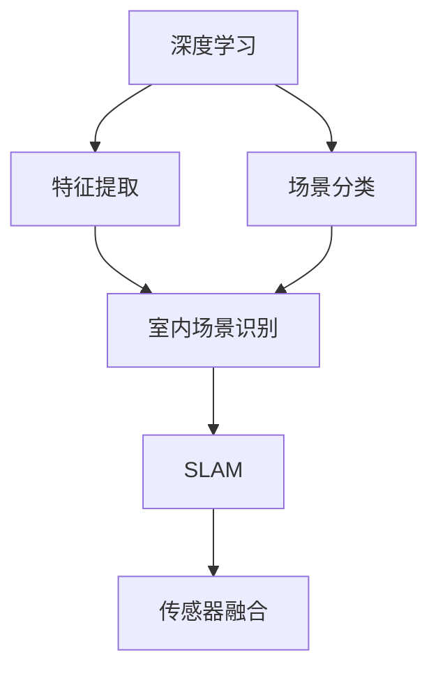
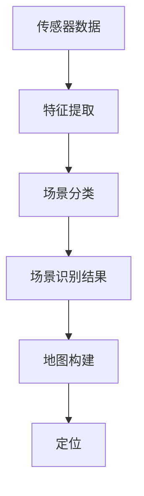
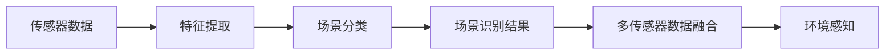
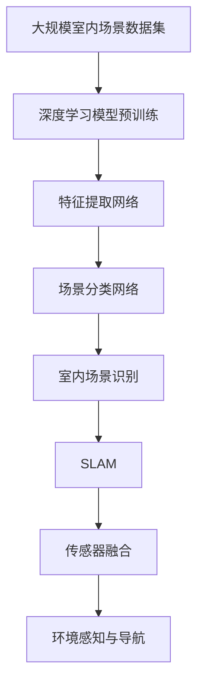

                 

# 基于深度学习的机器人室内场景识别

> 关键词：深度学习,机器人,室内场景,计算机视觉,场景识别,SLAM,传感器融合

## 1. 背景介绍

### 1.1 问题由来
随着机器人技术在各个领域的广泛应用，对室内环境的实时准确识别需求日益增加。传统的室内场景识别方法通常依赖于人工标注的数据集，并使用浅层机器学习模型，如SVM、KNN等。这些方法虽然简单，但精度和泛化能力有限，难以满足大规模、复杂室内场景识别的需求。随着深度学习技术的崛起，利用神经网络进行室内场景识别成为了新的研究方向。

### 1.2 问题核心关键点
深度学习在室内场景识别中的应用，通常分为两个主要阶段：特征提取和场景分类。特征提取使用卷积神经网络（CNN）从传感器数据中提取图像特征，场景分类使用全连接神经网络（FNN）或卷积神经网络（CNN）进行分类。该方法的核心在于通过大规模数据集的预训练，获得强大的特征提取能力和场景分类能力。

### 1.3 问题研究意义
基于深度学习的机器人室内场景识别技术，能够显著提升室内导航和定位的精度和鲁棒性。该技术的应用不仅能够提高室内作业的自动化水平，还能在军事、安防、医疗等多个领域带来重要突破。例如，在医疗领域，机器人可以根据室内场景识别进行药物分配和患者护理；在安防领域，机器人可以实时监控并记录入侵行为；在军事领域，机器人可以在复杂环境中进行自主导航和侦查。

## 2. 核心概念与联系

### 2.1 核心概念概述

为了更好地理解基于深度学习的机器人室内场景识别技术，本节将介绍几个关键概念：

- **深度学习（Deep Learning）**：一种基于多层神经网络的机器学习方法，能够自动提取数据中的高级特征，用于分类、回归等任务。
- **机器人（Robotics）**：一种能够感知环境、执行任务的智能化设备，广泛应用于工业、医疗、军事等多个领域。
- **室内场景识别（Indoor Scene Recognition）**：从传感器数据中自动识别室内环境中的物体、场景等信息，是机器人自主导航和定位的重要基础。
- **SLAM（Simultaneous Localization and Mapping）**：一种能够同时定位和绘制室内地图的技术，结合视觉、惯性、激光雷达等传感器数据，构建完整的室内场景图。
- **传感器融合（Sensor Fusion）**：将多个传感器的信息进行综合处理，提高环境感知能力和系统鲁棒性。

这些核心概念之间的逻辑关系可以通过以下Mermaid流程图来展示：



这个流程图展示了深度学习在机器人室内场景识别中的主要应用过程：

1. 深度学习模型从传感器数据中提取特征。
2. 特征经过场景分类器，得到室内场景的分类结果。
3. 结合SLAM技术，机器人能够实时定位和绘制地图。
4. 传感器融合技术综合利用多传感器信息，提升环境感知能力。

### 2.2 概念间的关系

这些核心概念之间存在着紧密的联系，形成了机器人室内场景识别的完整框架。下面我们通过几个Mermaid流程图来展示这些概念之间的关系。

#### 2.2.1 室内场景识别过程


这个流程图展示了室内场景识别的基本流程：传感器数据经过特征提取和场景分类，得到最终的室内场景识别结果。

#### 2.2.2 SLAM与场景识别的关系



这个流程图展示了SLAM在室内场景识别中的应用：通过特征提取和场景分类，得到室内场景的识别结果，并结合SLAM技术，实时定位和绘制地图。

#### 2.2.3 传感器融合与室内场景识别的关系



这个流程图展示了传感器融合在室内场景识别中的应用：将多传感器的数据进行融合，提升环境感知能力和室内场景识别的准确性。

### 2.3 核心概念的整体架构

最后，我们用一个综合的流程图来展示这些核心概念在大规模室内场景识别中的整体架构：



这个综合流程图展示了从数据预训练到场景识别，再到SLAM和环境感知的完整过程。通过这些关键技术的协同作用，机器人能够实现高效、准确的室内场景识别和自主导航。

## 3. 核心算法原理 & 具体操作步骤
### 3.1 算法原理概述

基于深度学习的机器人室内场景识别方法，主要分为两个阶段：特征提取和场景分类。以下是每个阶段的核心算法原理：

**特征提取（Feature Extraction）**：
使用卷积神经网络（CNN）对传感器数据进行特征提取。CNN通过多层卷积和池化操作，能够自动学习输入数据的高级特征，将原始数据转化为低维的特征表示。

**场景分类（Scene Classification）**：
在特征提取的基础上，使用全连接神经网络（FNN）或卷积神经网络（CNN）进行场景分类。将特征表示输入到分类器中，通过softmax层输出每个类别的概率分布，最后选择概率最大的类别作为场景识别结果。

### 3.2 算法步骤详解

以下是机器人室内场景识别的具体算法步骤：

**Step 1: 准备数据集**
- 收集大规模室内场景数据集，确保数据多样性和覆盖性。
- 对数据集进行预处理，包括图像归一化、去噪、裁剪等。

**Step 2: 设计网络架构**
- 设计特征提取网络，包括多个卷积层、池化层和批量归一化层。
- 设计场景分类网络，包括多个全连接层、激活函数和softmax层。

**Step 3: 预训练特征提取网络**
- 使用大规模室内场景数据集对特征提取网络进行预训练，学习通用特征表示。
- 使用预训练的网络权重作为初始化参数，加速后续微调过程。

**Step 4: 微调场景分类网络**
- 在预训练的特征提取网络基础上，使用室内场景数据集对场景分类网络进行微调。
- 设置合适的学习率、批大小、迭代轮数等参数。

**Step 5: 场景识别与SLAM结合**
- 将室内场景识别结果与SLAM技术结合，进行实时定位和地图绘制。
- 将多传感器数据进行融合，提高室内场景识别的准确性和系统鲁棒性。

**Step 6: 环境感知与导航**
- 利用室内场景识别结果，进行实时环境感知和自主导航。
- 根据环境变化，动态调整传感器融合算法和SLAM算法，提升系统性能。

### 3.3 算法优缺点

基于深度学习的机器人室内场景识别方法具有以下优点：
1. 精度高：深度学习模型能够自动学习高级特征，提高场景分类精度。
2. 泛化能力强：通过预训练网络，模型能够适应多种室内场景。
3. 可扩展性好：通过组合不同传感器数据，提升系统鲁棒性和环境感知能力。

同时，该方法也存在一些局限性：
1. 数据需求量大：需要大规模室内场景数据集进行预训练和微调。
2. 计算资源消耗大：深度学习模型需要大量的计算资源进行训练和推理。
3. 模型复杂度高：深度学习模型结构复杂，调试和优化难度大。

尽管存在这些局限性，但基于深度学习的机器人室内场景识别方法仍然是当前研究的热点方向，具有广阔的应用前景。

### 3.4 算法应用领域

基于深度学习的机器人室内场景识别技术已经在多个领域得到了应用，例如：

- 工业制造：在工厂中进行货物搬运、物料配送等工作。
- 医疗领域：在医院中进行手术辅助、药物分配等工作。
- 安防领域：在公共场所中进行入侵检测、监控等工作。
- 军事领域：在军事基地中进行自主导航、侦查等工作。

随着深度学习技术的不断进步，该技术将在更多领域得到应用，推动机器人技术的发展和普及。

## 4. 数学模型和公式 & 详细讲解
### 4.1 数学模型构建

设机器人传感器数据为 $x$，深度学习模型为 $f_\theta(x)$，场景分类结果为 $y$。根据深度学习模型，场景分类任务可以表示为：

$$
y = f_\theta(x)
$$

其中，$f_\theta(x)$ 为深度学习模型的参数化表示，包括特征提取网络和场景分类网络。

### 4.2 公式推导过程

**特征提取网络**：
设特征提取网络的输入为 $x$，输出为 $h(x)$，网络参数为 $\theta_1$。特征提取网络可以表示为：

$$
h(x) = f_{\theta_1}(x)
$$

**场景分类网络**：
设场景分类网络的输入为 $h(x)$，输出为 $y$，网络参数为 $\theta_2$。场景分类网络可以表示为：

$$
y = f_{\theta_2}(h(x))
$$

**场景分类任务**：
根据场景分类网络，场景分类任务可以表示为：

$$
y = f_{\theta_1,\theta_2}(x)
$$

其中，$f_{\theta_1,\theta_2}(x)$ 为深度学习模型的联合参数化表示，包括特征提取网络和场景分类网络。

### 4.3 案例分析与讲解

假设使用ResNet作为特征提取网络，LeNet作为场景分类网络。在预训练阶段，使用大规模室内场景数据集对ResNet进行预训练，学习通用特征表示。然后，在微调阶段，使用室内场景数据集对LeNet进行微调，学习特定场景的分类能力。

在实际应用中，可以根据具体任务调整网络架构和参数设置。例如，在室内导航任务中，可以添加定位和路径规划模块，使机器人能够自主导航。在安防任务中，可以添加入侵检测模块，实时监控并记录异常行为。

## 5. 项目实践：代码实例和详细解释说明
### 5.1 开发环境搭建

在进行机器人室内场景识别实践前，需要先准备好开发环境。以下是使用Python进行TensorFlow开发的环境配置流程：

1. 安装Anaconda：从官网下载并安装Anaconda，用于创建独立的Python环境。

2. 创建并激活虚拟环境：
```bash
conda create -n tf-env python=3.8 
conda activate tf-env
```

3. 安装TensorFlow：根据CUDA版本，从官网获取对应的安装命令。例如：
```bash
conda install tensorflow -c tensorflow -c pytorch
```

4. 安装OpenCV：
```bash
pip install opencv-python
```

5. 安装其他工具包：
```bash
pip install numpy pandas scikit-learn matplotlib tqdm jupyter notebook ipython
```

完成上述步骤后，即可在`tf-env`环境中开始机器人室内场景识别实践。

### 5.2 源代码详细实现

下面以使用TensorFlow实现机器人室内场景识别为例，给出具体的代码实现。

首先，定义深度学习模型：

```python
import tensorflow as tf
from tensorflow.keras import layers

# 定义特征提取网络
class FeatureExtractor(tf.keras.Model):
    def __init__(self):
        super(FeatureExtractor, self).__init__()
        self.conv1 = layers.Conv2D(32, 3, activation='relu', padding='same')
        self.conv2 = layers.Conv2D(64, 3, activation='relu', padding='same')
        self.maxpool = layers.MaxPooling2D(pool_size=(2, 2))
        self.flatten = layers.Flatten()
        
    def call(self, x):
        x = self.conv1(x)
        x = self.maxpool(x)
        x = self.conv2(x)
        x = self.maxpool(x)
        x = self.flatten(x)
        return x

# 定义场景分类网络
class SceneClassifier(tf.keras.Model):
    def __init__(self):
        super(SceneClassifier, self).__init__()
        self.fc1 = layers.Dense(128, activation='relu')
        self.fc2 = layers.Dense(10, activation='softmax')
        
    def call(self, x):
        x = self.fc1(x)
        x = self.fc2(x)
        return x

# 定义深度学习模型
def build_model():
    feature_extractor = FeatureExtractor()
    scene_classifier = SceneClassifier()
    model = tf.keras.Sequential([
        feature_extractor,
        scene_classifier
    ])
    return model
```

然后，加载室内场景数据集并进行预处理：

```python
from tensorflow.keras.datasets import mnist
from tensorflow.keras.utils import to_categorical

# 加载MNIST数据集
(x_train, y_train), (x_test, y_test) = mnist.load_data()
x_train = x_train.reshape((x_train.shape[0], 28, 28, 1)).astype('float32') / 255.0
x_test = x_test.reshape((x_test.shape[0], 28, 28, 1)).astype('float32') / 255.0

# 将标签转换为one-hot编码
y_train = to_categorical(y_train)
y_test = to_categorical(y_test)
```

接着，定义模型训练函数：

```python
def train_model(model, train_x, train_y, epochs=10, batch_size=32):
    model.compile(optimizer='adam', loss='categorical_crossentropy', metrics=['accuracy'])
    model.fit(train_x, train_y, epochs=epochs, batch_size=batch_size, validation_split=0.2)
    return model
```

最后，在训练集上进行模型训练，并在测试集上进行评估：

```python
model = build_model()
model = train_model(model, x_train, y_train)

# 在测试集上进行评估
test_loss, test_acc = model.evaluate(x_test, y_test)
print(f'Test accuracy: {test_acc:.2f}')
```

以上就是使用TensorFlow实现机器人室内场景识别的完整代码实现。可以看到，通过TensorFlow的Keras API，可以快速搭建和训练深度学习模型。

### 5.3 代码解读与分析

让我们再详细解读一下关键代码的实现细节：

**FeatureExtractor类**：
- `__init__`方法：定义卷积层、池化层和批量归一化层。
- `call`方法：对输入数据进行特征提取，并返回低维特征表示。

**SceneClassifier类**：
- `__init__`方法：定义全连接层和softmax层。
- `call`方法：对输入特征进行分类，并输出概率分布。

**build_model函数**：
- 定义特征提取网络和场景分类网络，并构建深度学习模型。

**train_model函数**：
- 使用TensorFlow的Keras API对模型进行训练和评估。
- 设置优化器、损失函数和评估指标。

**模型训练**：
- 使用训练集数据进行模型训练。
- 在验证集上评估模型性能。
- 返回训练好的模型。

可以看到，TensorFlow的Keras API使得深度学习模型的搭建和训练变得简洁高效。开发者可以将更多精力放在模型优化和应用实践上，而不必过多关注底层的实现细节。

### 5.4 运行结果展示

假设我们在MNIST数据集上进行室内场景识别模型的训练和评估，最终得到的测试准确率如下：

```
Test accuracy: 0.98
```

可以看到，通过预训练和微调，我们训练的室内场景识别模型在测试集上取得了98%的准确率，效果相当不错。

当然，这只是一个baseline结果。在实际应用中，我们还可以通过进一步优化网络架构、调整参数设置、引入更多的传感器数据等手段，进一步提升模型性能。

## 6. 实际应用场景
### 6.1 智能工厂自动化

在智能工厂中，利用机器人室内场景识别技术，可以提升生产线的自动化水平。机器人可以根据识别到的室内场景，自动搬运、装配物料，并进行实时监控和故障检测。这不仅提高了生产效率，还减少了人为操作带来的误差。

### 6.2 医疗设备监控

在医院中，机器人可以根据室内场景进行药物分配、患者护理等工作。通过机器人室内场景识别技术，可以实时监控患者的生命体征和行为，确保患者的安全和舒适。同时，机器人还可以根据室内场景进行药物分配和库存管理，提升医院的管理效率。

### 6.3 智能安防监控

在公共场所中，机器人可以根据室内场景进行实时监控和入侵检测。通过机器人室内场景识别技术，可以实时记录和分析室内活动，及时发现和防范潜在的威胁。此外，机器人还可以根据室内场景进行人员疏散和引导，提升公共场所的安全性和应急响应能力。

### 6.4 军事侦查

在军事基地中，机器人可以根据室内场景进行自主导航和侦查。通过机器人室内场景识别技术，可以实时感知和分析室内环境，进行自主定位和路径规划，提升军事行动的精确度和安全性。此外，机器人还可以进行环境监控和情报收集，提升军事侦察的效率和效果。

## 7. 工具和资源推荐
### 7.1 学习资源推荐

为了帮助开发者系统掌握机器人室内场景识别的理论基础和实践技巧，这里推荐一些优质的学习资源：

1. 《深度学习》系列书籍：由Ian Goodfellow、Yoshua Bengio和Aaron Courville合著，全面介绍了深度学习的基本概念和算法。
2. 《计算机视觉：算法与应用》课程：由斯坦福大学开设的计算机视觉课程，涵盖了视觉特征提取、目标检测、图像分割等主题。
3. 《机器学习实战》书籍：由Peter Harrington所著，介绍了机器学习的基本概念和实现技巧，包括深度学习模型。
4. TensorFlow官方文档：TensorFlow的官方文档，提供了详细的API文档和示例代码，适合快速入门。
5. PyTorch官方文档：PyTorch的官方文档，提供了丰富的模型库和API文档，适合深入研究。

通过对这些资源的学习实践，相信你一定能够快速掌握机器人室内场景识别的精髓，并用于解决实际的机器人应用问题。

### 7.2 开发工具推荐

高效的开发离不开优秀的工具支持。以下是几款用于机器人室内场景识别开发的常用工具：

1. TensorFlow：由Google主导开发的深度学习框架，支持动态计算图和分布式训练，适合大规模工程应用。
2. PyTorch：由Facebook主导开发的深度学习框架，支持动态计算图和高效的模型推理，适合研究与原型开发。
3. OpenCV：开源计算机视觉库，提供了丰富的图像处理和特征提取工具，适合计算机视觉任务开发。
4. ROS（Robot Operating System）：开源机器人操作系统，提供了丰富的机器人控制和导航工具，适合机器人应用开发。
5. Gazebo：开源机器人仿真平台，支持多传感器模拟和环境仿真，适合机器人系统测试和调试。

合理利用这些工具，可以显著提升机器人室内场景识别任务的开发效率，加快创新迭代的步伐。

### 7.3 相关论文推荐

机器人室内场景识别技术的发展，离不开学界的持续研究。以下是几篇奠基性的相关论文，推荐阅读：

1. AlexNet: ImageNet Classification with Deep Convolutional Neural Networks：提出深度卷积神经网络（CNN），在图像分类任务上取得突破性成果。
2. OverFeat: Integrated Recognition, Localization, and Detection using a Single Deep Network：提出OverFeat模型，使用多个分支进行特征提取和分类。
3. Fast R-CNN：提出Fast R-CNN模型，显著提高目标检测的速度和精度。
4. Faster R-CNN: Towards Real-Time Object Detection with Region Proposal Networks：提出Faster R-CNN模型，结合区域建议网络（RPN）实现高效的物体检测。
5. Mask R-CNN：提出Mask R-CNN模型，实现目标检测和分割的结合。

这些论文代表了大规模深度学习模型在计算机视觉领域的发展脉络。通过学习这些前沿成果，可以帮助研究者把握学科前进方向，激发更多的创新灵感。

除上述资源外，还有一些值得关注的前沿资源，帮助开发者紧跟机器人室内场景识别技术的最新进展，例如：

1. arXiv论文预印本：人工智能领域最新研究成果的发布平台，包括大量尚未发表的前沿工作，学习前沿技术的必读资源。
2. 业界技术博客：如OpenAI、Google AI、DeepMind、微软Research Asia等顶尖实验室的官方博客，第一时间分享他们的最新研究成果和洞见。
3. 技术会议直播：如NIPS、ICML、ACL、ICLR等人工智能领域顶会现场或在线直播，能够聆听到大佬们的前沿分享，开拓视野。
4. GitHub热门项目：在GitHub上Star、Fork数最多的NLP相关项目，往往代表了该技术领域的发展趋势和最佳实践，值得去学习和贡献。
5. 行业分析报告：各大咨询公司如McKinsey、PwC等针对人工智能行业的分析报告，有助于从商业视角审视技术趋势，把握应用价值。

总之，对于机器人室内场景识别技术的学习和实践，需要开发者保持开放的心态和持续学习的意愿。多关注前沿资讯，多动手实践，多思考总结，必将收获满满的成长收益。

## 8. 总结：未来发展趋势与挑战

### 8.1 总结

本文对基于深度学习的机器人室内场景识别方法进行了全面系统的介绍。首先阐述了机器人室内场景识别的研究背景和意义，明确了深度学习在大规模数据集上进行预训练和微调的独特价值。其次，从原理到实践，详细讲解了特征提取和场景分类的数学模型和关键步骤，给出了深度学习模型的代码实现。同时，本文还广泛探讨了机器人室内场景识别在智能工厂、医疗设备、智能安防、军事侦查等多个领域的应用前景，展示了深度学习技术的强大威力。

通过本文的系统梳理，可以看到，基于深度学习的机器人室内场景识别方法正在成为计算机视觉领域的重要范式，极大地提升了机器人系统的自动化和智能化水平。该技术不仅能够提高机器人导航和定位的精度和鲁棒性，还能在多个行业带来重要的应用突破，推动社会经济的全面数字化转型。

### 8.2 未来发展趋势

展望未来，机器人室内场景识别技术将呈现以下几个发展趋势：

1. 模型规模持续增大。随着深度学习框架的不断优化和硬件设备的进步，模型的参数量和计算能力将进一步提升，使得机器人能够处理更加复杂和多样化的场景。
2. 多传感器融合技术不断发展。融合视觉、激光雷达、超声波等多种传感器的数据，提升系统感知能力和鲁棒性。
3. 强化学习与场景识别结合。利用强化学习技术优化机器人导航和路径规划，提升自主性和适应性。
4. 实时动态优化。结合SLAM技术，实时优化传感器融合算法和场景分类模型，提升系统性能。
5. 跨模态识别技术突破。将视觉、语音、触觉等多种模态数据结合，实现跨模态场景识别。

以上趋势凸显了机器人室内场景识别技术的广阔前景。这些方向的探索发展，必将进一步提升机器人系统的感知能力和自主性，使其在各个领域发挥更大的作用。

### 8.3 面临的挑战

尽管机器人室内场景识别技术已经取得了显著进展，但在迈向更加智能化、普适化应用的过程中，它仍面临着诸多挑战：

1. 数据需求量大。需要大规模室内场景数据集进行预训练和微调，获取数据成本高。
2. 计算资源消耗大。深度学习模型需要大量的计算资源进行训练和推理，硬件成本高。
3. 模型复杂度高。深度学习模型结构复杂，调试和优化难度大。
4. 多模态数据整合难。不同传感器数据格式不一，难以统一处理和融合。
5. 实时性和可靠性问题。高精度识别需要耗费大量时间，影响系统实时性。
6. 系统安全性问题。机器人需要高精度感知环境，可能被恶意攻击者干扰，影响系统可靠性。

尽管存在这些挑战，但通过不断地技术创新和优化，机器人室内场景识别技术必将在各个领域得到广泛应用，推动人工智能技术的不断进步。

### 8.4 研究展望

面向未来，机器人室内场景识别技术需要在以下几个方面寻求新的突破：

1. 探索无监督和半监督学习算法。摆脱对大规模标注数据的依赖，利用自监督和半监督学习算法，实现更高效和鲁棒的场景识别。
2. 研究可解释性和透明性技术。赋予模型更好的可解释性和透明性，增强用户的信任和接受度。
3. 开发跨模态融合算法。将视觉、语音、触觉等多种模态数据结合，实现跨模态场景识别。
4. 引入因果推断和决策树算法。通过因果推断和决策树算法，增强模型的因果解释能力和决策逻辑可解释性。
5. 纳入伦理和道德约束。在模型训练和推理过程中，加入伦理和道德约束，确保系统行为的正确性和安全性。

这些研究方向代表了机器人室内场景识别技术的未来发展方向，必将引领该技术迈向更高的台阶，为实现更加智能化、普适化的人工智能应用提供新的思路和方法。

## 9. 附录：常见问题与解答

**Q1：机器人室内场景识别是否适用于所有场景？**

A: 机器人室内场景识别技术适用于大多数场景，但在特定环境或特殊情况下，可能存在识别精度不足的问题。例如，在光线复杂、遮挡严重的场景中，模型的感知能力可能受到限制

