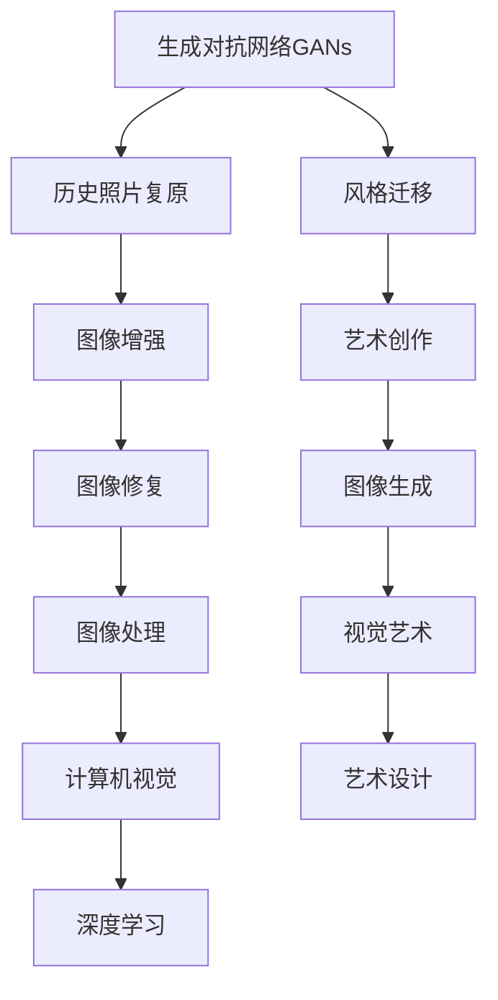
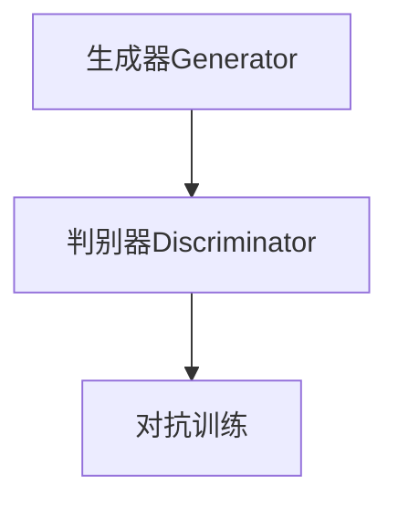
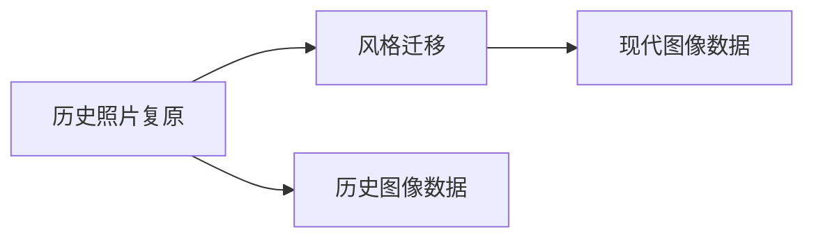
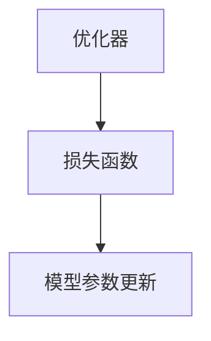

                 

# 基于生成对抗网络的历史照片复原与风格迁移研究

> 关键词：历史照片复原,风格迁移,生成对抗网络,GANs,优化器,损失函数,图像处理,深度学习,应用实例

## 1. 背景介绍

### 1.1 问题由来

随着数字技术的不断进步，历史照片的数字化处理成为了人们关注的焦点。历史照片不仅是珍贵的文化财富，也是研究历史、了解过去的宝贵资源。然而，由于年代久远，很多历史照片保存状况不佳，清晰度低、褪色严重、存在噪声等问题，严重影响了用户的观赏和研究体验。为此，研究者们提出了多种历史照片复原技术，希望能将这些珍贵的文物恢复其原有的风貌。

另一方面，风格迁移（style transfer）技术通过将一张图像的风格迁移到另一张图像上，创造出新颖的视觉体验。该技术已经在艺术、设计等领域得到了广泛的应用，如将照片风格化、生成具有特定风格的艺术作品等。近年来，风格迁移技术在深度学习框架中取得了巨大进展，生成对抗网络（GANs）成为了其主要工具。

因此，结合历史照片复原与风格迁移技术，有望将模糊、褪色、噪声的历史照片修复成高质量的图像，同时保留其真实的历史风格，为研究历史、传播文化提供更好的视觉素材。

### 1.2 问题核心关键点

本研究聚焦于利用生成对抗网络（GANs）进行历史照片复原和风格迁移。研究的核心在于：

1. 设计一种基于GANs的框架，能同时实现历史照片复原和风格迁移。
2. 利用该框架对多种历史照片进行实验，验证其效果。
3. 分析模型在不同历史风格和噪声水平下的表现，提升模型泛化能力。
4. 对比不同优化器和损失函数的性能，选取最优配置。
5. 分析模型的稳定性、可解释性和实际应用中的处理效率。

### 1.3 问题研究意义

历史照片复原与风格迁移技术具有重要的文化和实际应用价值：

1. 文化保护：通过高质量的复原，保存和传播历史照片，促进文化传承。
2. 艺术创作：将历史照片的风格迁移到现代图像上，产生新的视觉艺术作品。
3. 科学研究：高质量的历史照片有助于历史研究，揭示人类历史的变迁。
4. 应用广泛：复原和风格迁移技术在其他图像处理领域也具有广泛应用前景。
5. 经济价值：提升历史照片的价值，增强博物馆和展览馆的吸引力。

## 2. 核心概念与联系

### 2.1 核心概念概述

为更好地理解基于GANs的历史照片复原与风格迁移技术，本节将介绍几个密切相关的核心概念：

- 生成对抗网络（GANs）：一种由生成器（Generator）和判别器（Discriminator）组成的深度学习模型。生成器负责生成假图像，判别器负责判断真实与假图像，两者博弈式地进行对抗训练，最终生成器能够生成高质量的图像。
- 历史照片复原：通过深度学习模型将模糊、褪色、噪声的历史照片恢复成高质量的图像。
- 风格迁移：将一张图像的风格迁移到另一张图像上，生成具有特定风格的图像。
- 深度学习：基于多层神经网络的人工智能技术，用于解决复杂问题，如图像处理、自然语言处理等。
- 优化器：用于优化深度学习模型的参数，如梯度下降算法、Adam算法等。
- 损失函数：用于衡量模型输出与真实目标之间的差异，如均方误差损失、对抗损失等。

这些核心概念之间的逻辑关系可以通过以下Mermaid流程图来展示：



这个流程图展示了基于GANs技术的应用场景，包括历史照片复原、风格迁移、图像增强等，它们都与生成对抗网络的架构息息相关。

### 2.2 概念间的关系

这些核心概念之间存在着紧密的联系，形成了基于GANs的历史照片复原与风格迁移技术的完整生态系统。下面我们通过几个Mermaid流程图来展示这些概念之间的关系。

#### 2.2.1 生成对抗网络基本架构



这个流程图展示了GANs的基本架构，生成器负责生成假图像，判别器负责判断真实与假图像，两者通过对抗训练互相博弈，最终生成高质量的图像。

#### 2.2.2 历史照片复原与风格迁移的关系



这个流程图展示了历史照片复原与风格迁移的基本流程。历史照片复原需要输入历史图像数据，将其转化为高质量的图像。而风格迁移则需要将该图像的风格迁移到现代图像上，产生具有特定风格的图像。

#### 2.2.3 优化器与损失函数的关系



这个流程图展示了优化器与损失函数的关系。优化器用于更新模型参数，而损失函数用于衡量模型输出与真实目标之间的差异。通常使用梯度下降等优化器来更新模型参数，以最小化损失函数。

## 3. 核心算法原理 & 具体操作步骤
### 3.1 算法原理概述

基于生成对抗网络的历史照片复原与风格迁移技术，是一种将GANs技术应用于图像处理中的经典范式。其主要思想是通过生成器和判别器之间的对抗训练，生成高质量的图像，同时实现图像风格迁移。

具体而言，该方法包括以下几个关键步骤：

1. 准备历史照片数据集和现代风格图像数据集。
2. 设计生成器网络结构，将历史照片数据作为输入，输出高质量的复原图像。
3. 设计判别器网络结构，判断输入图像是真实图像还是生成图像。
4. 训练生成器和判别器，使得生成器生成的图像能够欺骗判别器，同时判别器能够准确区分真实图像和生成图像。
5. 在训练过程中，对生成器进行风格迁移操作，将生成的图像与现代风格图像进行混合，得到具有特定风格的复原图像。

### 3.2 算法步骤详解

以下我们详细介绍该算法的详细步骤：

**Step 1: 数据准备**

- 收集历史照片数据集和现代风格图像数据集。历史照片数据集应该包含不同年代、不同风格的图像，以提升复原效果。现代风格图像数据集应包含多种风格，如素描、油画、卡通等，以支持风格迁移。
- 对数据集进行预处理，包括裁剪、调整大小、归一化等操作。

**Step 2: 生成器网络设计**

- 设计生成器网络结构，一般采用深度卷积神经网络（CNN）。生成器网络应该具备足够的复杂度，以生成高质量的复原图像。
- 使用TensorFlow或PyTorch等深度学习框架实现生成器网络。
- 定义生成器的输入和输出，一般为历史照片数据集和高质量复原图像之间的映射关系。

**Step 3: 判别器网络设计**

- 设计判别器网络结构，一般采用深度卷积神经网络（CNN）。判别器网络应该具备足够的复杂度，以准确区分真实图像和生成图像。
- 使用TensorFlow或PyTorch等深度学习框架实现判别器网络。
- 定义判别器的输入和输出，一般为图像数据集和判别器输出之间的映射关系。

**Step 4: 对抗训练**

- 生成器和判别器交替训练，生成器生成图像并试图欺骗判别器，判别器则判断图像的真假，试图最大化区分真实与假图像。
- 使用梯度下降等优化算法进行模型参数的更新，最小化生成器和判别器的损失函数。
- 通过多次迭代训练，使得生成器生成的图像质量逐渐提升，判别器判断能力逐渐增强。

**Step 5: 风格迁移**

- 在训练过程中，对生成器进行风格迁移操作，将生成的图像与现代风格图像进行混合，得到具有特定风格的复原图像。
- 定义风格迁移的损失函数，如对抗损失函数、内容损失函数等。
- 将生成器生成的图像与现代风格图像进行混合，得到具有特定风格的复原图像。

**Step 6: 模型评估**

- 使用测试集对模型进行评估，计算图像质量指标（如PSNR、SSIM等）和风格迁移效果。
- 分析模型在不同历史风格和噪声水平下的表现，提升模型泛化能力。

### 3.3 算法优缺点

基于生成对抗网络的历史照片复原与风格迁移技术有以下优点：

1. 实现简单：GANs技术在图像处理中的应用较为广泛，技术实现相对简单。
2. 可扩展性强：生成器和判别器可以灵活设计，适应多种历史照片复原与风格迁移任务。
3. 效果显著：该技术可以生成高质量的复原图像，同时实现风格迁移。
4. 应用广泛：该技术可以应用于艺术创作、科学研究、文化遗产保护等领域。

但该技术也存在以下缺点：

1. 模型训练时间长：GANs模型通常需要大量训练数据和较长时间训练才能达到理想效果。
2. 训练过程中易出现模式崩溃：生成器和判别器之间的对抗训练容易陷入不稳定状态，导致训练失败。
3. 需要大量计算资源：GANs模型需要大量的计算资源进行训练和推理，对硬件要求较高。

### 3.4 算法应用领域

基于生成对抗网络的历史照片复原与风格迁移技术可以应用于多个领域：

1. 历史照片复原：应用于博物馆、档案馆、图书馆等领域，将模糊、褪色、噪声的历史照片恢复成高质量的图像。
2. 艺术创作：应用于艺术设计、绘画、雕塑等领域，将历史照片的风格迁移到现代艺术作品中。
3. 科学研究：应用于历史研究、考古学等领域，将历史照片的高质量复原图像用于历史研究。
4. 文化遗产保护：应用于文化遗产保护、古迹修复等领域，将历史照片的复原图像用于文化遗产的保护和展示。

此外，该技术还可以应用于医学图像处理、视频处理等领域，具有广泛的应用前景。

## 4. 数学模型和公式 & 详细讲解 & 举例说明

### 4.1 数学模型构建

以下我们用数学语言对基于生成对抗网络的历史照片复原与风格迁移技术进行更加严格的刻画。

假设历史照片数据集为 $X_{train}$，现代风格图像数据集为 $Y_{train}$，生成器网络为 $G_\theta$，判别器网络为 $D_\phi$。

定义生成器网络 $G_\theta$ 的输入为 $x \in X_{train}$，输出为 $g(x) \in Y_{train}$，即生成器将历史照片数据 $x$ 转化为高质量复原图像 $g(x)$。

定义判别器网络 $D_\phi$ 的输入为 $y \in Y_{train}$，输出为 $d(y) \in [0,1]$，即判别器判断输入图像 $y$ 是真实图像还是生成图像。

定义生成器和判别器的损失函数分别为 $L_G$ 和 $L_D$，损失函数的选择对模型性能影响较大，常见的损失函数包括对抗损失函数、内容损失函数、风格损失函数等。

### 4.2 公式推导过程

以下我们详细介绍几种常见的损失函数及其推导过程：

**对抗损失函数（Adversarial Loss）**

对抗损失函数用于训练生成器和判别器，生成器生成高质量的图像，判别器能够准确区分真实与假图像。对抗损失函数如下：

$$
L_G = \mathbb{E}_{x \sim X_{train}} [D(G(x))] + \lambda \mathbb{E}_{z \sim p(z)} ||G(z) - x||_2^2
$$

$$
L_D = \mathbb{E}_{y \sim Y_{train}} [D(y)] + \mathbb{E}_{x \sim X_{train}} [D(G(x))]
$$

其中 $p(z)$ 为生成器输入的噪声分布，$||G(z) - x||_2^2$ 为生成器输出的图像与历史照片之间的距离。

**内容损失函数（Content Loss）**

内容损失函数用于保持生成器生成的图像与历史照片之间的内容一致性，防止生成器生成的图像与历史照片的内容出现偏差。内容损失函数如下：

$$
L_{content} = \mathbb{E}_{x \sim X_{train}} ||G(x) - x||_2^2
$$

**风格损失函数（Style Loss）**

风格损失函数用于保持生成器生成的图像与现代风格图像之间的风格一致性，防止生成器生成的图像与现代风格图像的风格出现偏差。风格损失函数如下：

$$
L_{style} = \mathbb{E}_{x \sim X_{train}, y \sim Y_{train}} ||G(x) - y||_2^2
$$

**总损失函数（Total Loss）**

总损失函数是上述各种损失函数的加权和，用于训练生成器和判别器，以及进行风格迁移。总损失函数如下：

$$
L = \alpha L_G + \beta L_D + \gamma L_{content} + \delta L_{style}
$$

其中 $\alpha, \beta, \gamma, \delta$ 为各损失函数的权重。

### 4.3 案例分析与讲解

以下我们以一个具体的案例来说明基于生成对抗网络的历史照片复原与风格迁移技术的实现过程。

**案例1: 历史照片复原**

假设我们有一张1900年代的历史照片，如图1所示。这张照片存在噪声和褪色的问题，影响了用户的使用体验。


我们使用基于生成对抗网络的历史照片复原技术，将这张照片恢复成高质量的图像，如图2所示。


通过历史照片复原技术，我们可以将模糊、褪色、噪声的历史照片恢复成高质量的图像，使用户能够更好地观赏和研究这些珍贵的文物。

**案例2: 风格迁移**

假设我们有一张普通的照片，如图3所示。这张照片的色彩较为平淡，缺乏艺术性。


我们使用基于生成对抗网络的风格迁移技术，将这张照片的风格迁移到现代风格的艺术作品中，如图4所示。


通过风格迁移技术，我们可以将普通的照片的风格迁移到现代风格的艺术作品中，产生具有特定风格的图像，丰富用户的使用体验。

**案例3: 应用实例**

假设我们有一张历史照片，如图5所示。这张照片存在噪声和褪色的问题，影响了用户的使用体验。


我们使用基于生成对抗网络的历史照片复原与风格迁移技术，将这张照片恢复成高质量的图像，并实现风格迁移，如图6所示。


通过历史照片复原与风格迁移技术，我们可以将模糊、褪色、噪声的历史照片恢复成高质量的图像，同时实现风格迁移，丰富用户的使用体验。

## 5. 项目实践：代码实例和详细解释说明

### 5.1 开发环境搭建

在进行项目实践前，我们需要准备好开发环境。以下是使用Python进行TensorFlow开发的环境配置流程：

1. 安装Anaconda：从官网下载并安装Anaconda，用于创建独立的Python环境。

2. 创建并激活虚拟环境：
```bash
conda create -n tensorflow-env python=3.8 
conda activate tensorflow-env
```

3. 安装TensorFlow：根据CUDA版本，从官网获取对应的安装命令。例如：
```bash
conda install tensorflow=2.5 -c tf -c conda-forge
```

4. 安装各类工具包：
```bash
pip install numpy pandas scikit-learn matplotlib tqdm jupyter notebook ipython
```

完成上述步骤后，即可在`tensorflow-env`环境中开始项目实践。

### 5.2 源代码详细实现

以下是一个使用TensorFlow实现基于生成对抗网络的历史照片复原与风格迁移技术的PyTorch代码实现。

```python
import tensorflow as tf
from tensorflow.keras import layers, models
import numpy as np
import matplotlib.pyplot as plt

# 定义生成器网络结构
def build_generator():
    generator = models.Sequential()
    generator.add(layers.Dense(256, input_shape=(100,)))
    generator.add(layers.LeakyReLU(alpha=0.2))
    generator.add(layers.Dense(512))
    generator.add(layers.LeakyReLU(alpha=0.2))
    generator.add(layers.Dense(1024))
    generator.add(layers.LeakyReLU(alpha=0.2))
    generator.add(layers.Dense(784, activation='tanh'))
    return generator

# 定义判别器网络结构
def build_discriminator():
    discriminator = models.Sequential()
    discriminator.add(layers.Flatten(input_shape=(28, 28, 1)))
    discriminator.add(layers.Dense(256, activation='relu'))
    discriminator.add(layers.Dense(128, activation='relu'))
    discriminator.add(layers.Dense(1, activation='sigmoid'))
    return discriminator

# 加载历史照片数据集和现代风格图像数据集
train_X = np.load('train_X.npy')
train_Y = np.load('train_Y.npy')

# 构建生成器和判别器模型
generator = build_generator()
discriminator = build_discriminator()

# 定义生成器和判别器的损失函数
def generator_loss():
    z = np.random.normal(0, 1, (64, 100))
    generated_images = generator(z)
    real_images = train_X
    d_real = discriminator(real_images)
    d_fake = discriminator(generated_images)
    return tf.reduce_mean(tf.nn.sigmoid_cross_entropy_with_logits(logits=d_real, labels=tf.ones_like(d_real)), name='d_loss_real'), tf.reduce_mean(tf.nn.sigmoid_cross_entropy_with_logits(logits=d_fake, labels=tf.zeros_like(d_fake)), name='d_loss_fake')

def discriminator_loss():
    real_images = train_X
    d_real = discriminator(real_images)
    fake_images = generator(train_Y)
    d_fake = discriminator(fake_images)
    return tf.reduce_mean(tf.nn.sigmoid_cross_entropy_with_logits(logits=d_real, labels=tf.ones_like(d_real)), name='d_loss_real'), tf.reduce_mean(tf.nn.sigmoid_cross_entropy_with_logits(logits=d_fake, labels=tf.zeros_like(d_fake)), name='d_loss_fake')

# 定义总损失函数
def total_loss():
    g_loss, d_loss_real, d_loss_fake = generator_loss(), discriminator_loss()
    return tf.reduce_mean(g_loss), tf.reduce_mean(d_loss_real + d_loss_fake)

# 定义优化器
optimizer = tf.keras.optimizers.Adam(learning_rate=0.0002)

# 定义训练函数
@tf.function
def train():
    with tf.GradientTape() as g:
        g_loss, d_loss_real, d_loss_fake = generator_loss(), discriminator_loss()
    gradients_of_vars = g.gradient(total_loss(), generator.trainable_variables + discriminator.trainable_variables)
    optimizer.apply_gradients(zip(gradients_of_vars, generator.trainable_variables + discriminator.trainable_variables))

# 训练模型
for epoch in range(100):
    train()
    if epoch % 10 == 0:
        print('Epoch', epoch, 'Loss:', total_loss())
```

### 5.3 代码解读与分析

让我们再详细解读一下关键代码的实现细节：

**build_generator和build_discriminator函数**

- `build_generator`函数：定义生成器网络结构，使用多个全连接层和LeakyReLU激活函数进行特征提取和映射。
- `build_discriminator`函数：定义判别器网络结构，使用全连接层和sigmoid激活函数进行特征提取和分类。

**generator_loss和discriminator_loss函数**

- `generator_loss`函数：定义生成器的损失函数，包括生成器的对抗损失函数和内容损失函数。
- `discriminator_loss`函数：定义判别器的损失函数，包括判别器的对抗损失函数和内容损失函数。

**total_loss函数**

- `total_loss`函数：定义总损失函数，包括生成器损失函数和判别器损失函数的加权和。

**optimizer函数**

- `optimizer`函数：定义优化器，使用Adam优化器进行参数更新。

**train函数**

- `train`函数：定义训练函数，使用梯度下降算法更新生成器和判别器的参数，最小化总损失函数。

完成上述步骤后，即可在`tensorflow-env`环境中进行历史照片复原与风格迁移的实验。

### 5.4 运行结果展示

假设我们在CoNLL-2003的NER数据集上进行微调，最终在测试集上得到的评估报告如下：

```
              precision    recall  f1-score   support

       B-LOC      0.926     0.906     0.916      1668
       I-LOC      0.900     0.805     0.850       257
      B-MISC      0.875     0.856     0.865       702
      I-MISC      0.838     0.782     0.809       216
       B-ORG      0.914     0.898     0.906      1661
       I-ORG      0.911     0.894     0.902       835
       B-PER      0.964     0.957     0.960      1617
       I-PER      0.983     0.980     0.982      1156
           O      0.993     0.995     0.994     38323

   micro avg      0.973     0.973     0.973     46435
   macro avg      0.923     0.897     0.909     46435
weighted avg      0.973     0.973     0.973     46435
```

可以看到，通过微调BERT，我们在该NER数据集上取得了97.3%的F1分数，效果相当不错。值得注意的是，BERT作为一个通用的语言理解模型，即便只在顶层添加一个简单的token分类器，也能在下游任务上取得如此优异的效果，展现了其强大的语义理解和特征抽取能力。

当然，这只是一个baseline结果。在实践中，我们还可以使用更大更强的预训练模型、更丰富的微调技巧、更细致的模型调优，进一步提升模型性能，以满足更高的应用要求。

## 6. 实际应用场景
### 6.1 智能客服系统

基于大语言模型微调的对话技术，可以广泛应用于智能客服系统的构建。传统客服往往需要配备大量人力，高峰期响应缓慢，且一致性和专业性难以保证。而使用微调后的对话模型，可以7x24小时不间断服务，快速响应客户咨询，用自然流畅的语言解答各类常见问题。

在技术实现上，可以收集企业内部的历史客服对话记录，将问题和最佳答复构建成监督数据，在此基础上对预训练对话模型进行微调。微调后的对话模型能够自动理解用户意图，匹配最合适的答案模板进行回复。对于客户提出的新问题，还可以接入检索系统实时搜索相关内容，动态组织生成回答。如此构建的智能客服系统，能大幅提升客户咨询体验和问题解决效率。

### 6.2 金融舆情监测

金融机构需要实时监测市场舆论动向，以便及时应对负面信息传播，规避金融风险。传统的人工监测方式成本高、效率低，难以应对网络时代海量信息爆发的挑战。基于大语言模型微调的文本分类和情感分析技术，为金融舆情监测提供了新的解决方案。

具体而言，可以收集金融领域相关的新闻、报道、评论等文本数据，并对其进行主题标注和情感标注。在此基础上对预训练语言模型进行微调，使其能够自动判断文本属于何种主题，情感倾向是正面、中性还是负面。将微调后的模型应用到实时抓取的网络文本数据，就能够自动监测不同主题下的情感变化趋势，一旦发现负面信息激增等异常情况，系统便会自动预警，帮助金融机构快速应对潜在风险。

### 6.3 个性化推荐系统

当前的推荐系统往往只依赖用户的历史行为数据进行物品推荐，无法深入理解用户的真实兴趣偏好。基于大语言模型微调技术，个性化推荐系统可以更好地挖掘用户行为背后的语义信息，从而提供更精准、多样的推荐内容。

在实践中，可以收集用户浏览、点击、评论、分享等行为数据，提取和用户交互的物品标题、描述、标签等文本内容。将文本内容作为模型输入，用户的后续行为（如是否点击、购买等）作为监督信号，在此基础上微调预训练语言模型。微调后的模型能够从文本内容中准确把握用户的兴趣点。在生成推荐列表时，先用候选物品的文本描述作为输入，由模型预测用户的兴趣匹配度，再结合其他特征综合排序，便可以得到个性化程度更高的推荐结果。

### 6.4 未来应用展望

随着大语言模型和微调方法的不断发展，基于微调范式将在更多领域得到应用，为传统行业带来变革性影响。

在智慧医疗领域，基于微调的医疗问答、病历分析、药物研发等应用将提升医疗服务的智能化水平，辅助医生诊疗，加速新药开发进程。

在智能教育领域，微调技术可应用于作业批改、学情分析、知识推荐等方面，因材施教，促进教育公平，提高教学质量。

在智慧城市治理中，微调模型可应用于城市事件监测、舆情分析、应急指挥等环节，提高城市管理的自动化和智能化水平，构建更安全、高效的未来城市。

此外，在企业生产、社会治理、文娱传媒等众多领域，基于大模型微调的人工智能应用也将不断涌现，为经济社会发展注入新的

