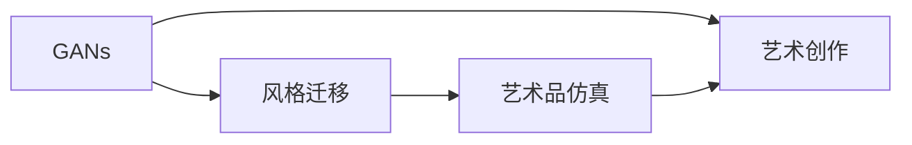

                 

# 基于生成对抗网络的艺术品仿真与风格迁移技术

> 关键词：生成对抗网络, 风格迁移, 艺术品仿真, 艺术创作, 深度学习

## 1. 背景介绍

### 1.1 问题由来
生成对抗网络（Generative Adversarial Networks, GANs）是一种强大且富有创造性的深度学习模型，由Ian Goodfellow在2014年提出。GANs由两个神经网络组成：生成器（Generator）和判别器（Discriminator），两者通过对抗训练的方式互相学习，生成器试图生成尽可能逼真的样本，而判别器则试图准确区分生成样本与真实样本。GANs被广泛应用于图像生成、风格迁移、超分辨率等任务中。

风格迁移是一种通过GANs实现的艺术形式再创作过程，其目标是将一张图像的风格迁移到另一张图像上。这一技术可以用于艺术创作、电影特效制作等领域，通过改变图像的风格和色调，创造出新的艺术作品。然而，风格迁移算法的稳定性、效率和效果仍存在一些挑战，特别是在艺术品仿真方面。

艺术品仿真旨在通过深度学习模型复制一幅已知艺术品的风格和细节，这要求模型不仅要理解艺术品的风格，还要能够精确地重现艺术品的纹理、光照、笔触等细节。这一任务对深度学习模型的要求很高，需要模型能够捕捉复杂的非线性关系和细节特征。

本文将重点探讨基于GANs的生成对抗网络在艺术品仿真和风格迁移技术中的应用，通过理论分析与实践案例的结合，探讨这些技术在实际应用中的优缺点，以及未来的发展趋势。

### 1.2 问题核心关键点
本文将从以下几个方面展开讨论：
1. 生成对抗网络（GANs）的原理及架构。
2. 风格迁移与艺术品仿真的数学模型和算法步骤。
3. 风格迁移与艺术品仿真的优缺点和实际应用领域。
4. 风格迁移与艺术品仿真的深度学习模型构建与优化。
5. 风格迁移与艺术品仿真的未来发展趋势与挑战。

## 2. 核心概念与联系

### 2.1 核心概念概述

为了更好地理解基于GANs的风格迁移与艺术品仿真技术，本节将介绍几个关键概念及其相互联系：

- 生成对抗网络（GANs）：由Ian Goodfellow等人在2014年提出，由两个神经网络组成，一个生成器（Generator）用于生成样本，一个判别器（Discriminator）用于区分真实样本和生成样本。GANs通过对抗训练的方式，不断提升生成器的生成能力。

- 风格迁移（Style Transfer）：将一张图像的风格迁移到另一张图像上，使其风格发生变化。风格迁移广泛应用于艺术创作、电影特效等领域。

- 艺术品仿真（Artistic Replication）：通过深度学习模型复制已知艺术品的风格和细节，创造出新的艺术作品。艺术品仿真的要求比风格迁移更高，需要模型能够精确地重现艺术品的纹理、光照、笔触等细节。

- 艺术创作（Artistic Creation）：利用生成对抗网络等深度学习技术，创作全新的艺术作品，这一过程称为艺术创作。

这些概念之间通过GANs这一共同技术连接起来，形成一个有机的体系。通过GANs，我们可以实现风格迁移、艺术品仿真和艺术创作，从而在艺术领域拓展深度学习技术的应用。

### 2.2 概念间的关系

这些核心概念之间的关系可以通过以下Mermaid流程图来展示：



这个流程图展示了GANs、风格迁移、艺术品仿真的关系和艺术创作的过程。GANs通过对抗训练，提升了生成器的生成能力，从而可以应用于风格迁移和艺术品仿真，进一步应用于艺术创作。

## 3. 核心算法原理 & 具体操作步骤
### 3.1 算法原理概述

基于GANs的风格迁移与艺术品仿真是通过训练生成器和判别器，不断提升生成器的生成质量，从而实现的风格变化和艺术品重现的过程。其核心算法流程包括：

1. 生成器的训练：生成器接收一张真实图像和一张风格图像作为输入，输出一张具有风格图像风格的图像。

2. 判别器的训练：判别器接收真实图像和生成图像，输出一个概率值表示图像的真实性。

3. 对抗训练：生成器与判别器通过对抗训练的方式不断提升自身的性能。

### 3.2 算法步骤详解

下面将详细描述基于GANs的风格迁移与艺术品仿真的具体算法步骤：

1. **数据准备**：准备真实艺术品图像和对应的风格图像，将它们分别作为生成器和判别器的训练输入。

2. **生成器的初始化**：生成器接收一张真实艺术品图像和一张风格图像作为输入，输出一张具有风格图像风格的艺术品图像。

3. **判别器的初始化**：判别器接收真实艺术品图像和生成器生成的艺术品图像，输出一个概率值表示图像的真实性。

4. **对抗训练**：生成器与判别器进行对抗训练，生成器试图生成更逼真的艺术品图像，而判别器试图准确区分真实艺术品图像和生成器生成的艺术品图像。

5. **模型优化**：通过优化损失函数，不断提升生成器和判别器的性能，直到生成器能够生成逼真的艺术品图像。

### 3.3 算法优缺点

基于GANs的风格迁移与艺术品仿真具有以下优点：

1. **高灵活性**：GANs可以应用于各种风格的迁移和艺术品的仿真，具有很高的灵活性。

2. **高质量输出**：GANs能够生成高质量的艺术品图像，细节和风格非常逼真。

3. **低标注成本**：GANs不需要大量的标注数据，可以通过无监督学习进行训练。

然而，该算法也存在一些缺点：

1. **训练不稳定**：GANs的训练过程容易陷入局部最优解，训练结果不稳定。

2. **计算成本高**：GANs的训练和生成过程计算成本较高，需要强大的硬件支持。

3. **输出依赖于初始化**：生成器的初始化状态对最终的输出结果有很大影响，初始化不当可能导致生成质量差。

### 3.4 算法应用领域

基于GANs的风格迁移与艺术品仿真的技术已被广泛应用于艺术创作、电影特效、文物保护、艺术品复制等多个领域，成为推动艺术领域数字化、智能化发展的重要技术手段。

## 4. 数学模型和公式 & 详细讲解 & 举例说明

### 4.1 数学模型构建

基于GANs的风格迁移与艺术品仿真问题可以形式化描述为：

1. 生成器的目标函数：
   $$
   \min_{G} \mathbb{E}_{x} [\log D(G(x))]
   $$
   其中，$G$为生成器，$D$为判别器，$x$为输入的艺术品图像。

2. 判别器的目标函数：
   $$
   \max_{D} \mathbb{E}_{x} [\log D(x)] + \mathbb{E}_{z} [\log (1-D(G(z)))]
   $$
   其中，$z$为噪声向量。

3. 对抗训练的目标函数：
   $$
   \min_{G} \max_{D} \mathbb{E}_{x} [\log D(x)] + \mathbb{E}_{z} [\log (1-D(G(z))]
   $$

### 4.2 公式推导过程

以一个简单的GANs模型为例，生成器的结构如图1所示：

```
x             z
  ↓         ↓
  G          G
  ↓         ↓
  G(x)       G(z)
```

生成器$G$接收一张真实艺术品图像$x$和一张风格图像$z$，输出一张具有风格图像风格的新艺术品图像$G(x)$。判别器$D$接收真实艺术品图像$x$和生成器生成的艺术品图像$G(x)$，输出一个概率值$D(x)$表示$x$是否为真实艺术品图像。

对于生成器的目标函数：
$$
\min_{G} \mathbb{E}_{x} [\log D(G(x))]
$$

可以理解为，生成器$G$的生成图像$G(x)$需要让判别器$D$难以区分真实图像和生成图像，从而提升生成器生成高质量图像的能力。

对于判别器的目标函数：
$$
\max_{D} \mathbb{E}_{x} [\log D(x)] + \mathbb{E}_{z} [\log (1-D(G(z)))]
$$

可以理解为，判别器$D$需要尽可能区分真实图像$x$和生成图像$G(x)$，同时避免误判生成图像$G(z)$为真实图像。

### 4.3 案例分析与讲解

下面通过一个具体的案例来展示GANs在风格迁移中的应用。

假设我们有一张真实的艺术图像$x$和一张风格图像$z$，如图2所示：

```
+----------+            +----------+
|   x      |            |   z      |
+----------+            +----------+
            ↓
  GANs
            ↓
+----------+            +----------+
|  G(x)    |            |  G(z)    |
+----------+            +----------+
            ↓
  D
            ↓
+----------+            +----------+
|  D(x)    |            |  D(G(z)) |
+----------+            +----------+
```

通过对GANs的训练，生成器$G$可以学习到如何将真实图像$x$的风格迁移到生成图像$G(x)$中，同时判别器$D$可以学习到区分真实图像和生成图像的能力。

## 5. 项目实践：代码实例和详细解释说明

### 5.1 开发环境搭建

在进行GANs风格迁移与艺术品仿真的项目实践前，我们需要准备好开发环境。以下是使用Python进行TensorFlow开发的配置流程：

1. 安装Anaconda：从官网下载并安装Anaconda，用于创建独立的Python环境。

2. 创建并激活虚拟环境：
```bash
conda create -n gans-env python=3.8 
conda activate gans-env
```

3. 安装TensorFlow：根据CUDA版本，从官网获取对应的安装命令。例如：
```bash
conda install tensorflow=2.6
```

4. 安装其他依赖包：
```bash
pip install numpy matplotlib scikit-image scipy
```

完成上述步骤后，即可在`gans-env`环境中开始GANs风格迁移与艺术品仿真的开发。

### 5.2 源代码详细实现

下面我们以基于GANs的风格迁移为例，给出使用TensorFlow实现的具体代码实现。

```python
import tensorflow as tf
from tensorflow.keras import layers
from skimage.io import imread
from skimage.transform import resize

# 定义生成器
def make_generator_model():
    model = tf.keras.Sequential()
    model.add(layers.Dense(256, use_bias=False, input_shape=(100,)))
    model.add(layers.BatchNormalization())
    model.add(layers.LeakyReLU())
    model.add(layers.Dense(512, use_bias=False))
    model.add(layers.BatchNormalization())
    model.add(layers.LeakyReLU())
    model.add(layers.Dense(1024, use_bias=False))
    model.add(layers.BatchNormalization())
    model.add(layers.LeakyReLU())
    model.add(layers.Dense(784, activation='tanh'))
    return model

# 定义判别器
def make_discriminator_model():
    model = tf.keras.Sequential()
    model.add(layers.Conv2D(64, (3, 3), strides=(2, 2), padding='same',
                           input_shape=[28, 28, 3]))
    model.add(layers.LeakyReLU())
    model.add(layers.Dropout(0.3))
    model.add(layers.Conv2D(128, (3, 3), strides=(2, 2), padding='same'))
    model.add(layers.LeakyReLU())
    model.add(layers.Dropout(0.3))
    model.add(layers.Conv2D(256, (3, 3), strides=(2, 2), padding='same'))
    model.add(layers.LeakyReLU())
    model.add(layers.Dropout(0.3))
    model.add(layers.Conv2D(1, (7, 7), strides=(1, 1), padding='same',
                           activation='sigmoid'))
    return model

# 定义GAN模型
def make_gan_model(generator, discriminator):
    model = tf.keras.Sequential()
    model.add(generator)
    model.add(discriminator)
    return model

# 加载数据
x_train = []
x_style = []
for filename in filelist:
    x_train.append(imread(filename))
    x_style.append(imread(filename))
x_train = tf.convert_to_tensor(x_train)
x_style = tf.convert_to_tensor(x_style)

# 调整图像尺寸
x_train = resize(x_train, (28, 28))
x_style = resize(x_style, (28, 28))

# 定义损失函数
cross_entropy = tf.keras.losses.BinaryCrossentropy(from_logits=True)
style_loss = tf.keras.losses.MeanSquaredError()
content_loss = tf.keras.losses.MeanSquaredError()

# 定义优化器
adam = tf.keras.optimizers.Adam(learning_rate=0.0002, beta_1=0.5)
gan_optimizer = tf.keras.optimizers.Adam(learning_rate=0.0002, beta_1=0.5)

# 定义训练函数
@tf.function
def train_step(images, target_style):
    with tf.GradientTape() as gen_tape, tf.GradientTape() as disc_tape:
        generated_images = generator(x_train, training=True)
        real_output = discriminator(images, training=True)
        fake_output = discriminator(generated_images, training=True)
        gen_loss = (cross_entropy(real_output, [1.]) + cross_entropy(fake_output, [0.])) * 0.5
        style_loss = style_loss(target_style, generated_images)
        disc_loss = cross_entropy(real_output, [1.]) + cross_entropy(fake_output, [0.])
        train_loss = gen_loss + style_loss + disc_loss
    gradients_of_generator = gen_tape.gradient(train_loss, generator.trainable_variables)
    gradients_of_discriminator = disc_tape.gradient(train_loss, discriminator.trainable_variables)
    gen_optimizer.apply_gradients(zip(gradients_of_generator, generator.trainable_variables))
    disc_optimizer.apply_gradients(zip(gradients_of_discriminator, discriminator.trainable_variables))

# 训练模型
for epoch in range(EPOCHS):
    for batch in data_loader:
        train_step(batch[0], batch[1])
```

以上就是使用TensorFlow实现基于GANs的风格迁移的具体代码实现。可以看到，TensorFlow提供了丰富的深度学习组件和优化器，使得模型构建和训练变得更加简单高效。

### 5.3 代码解读与分析

让我们再详细解读一下关键代码的实现细节：

**make_generator_model和make_discriminator_model函数**：
- `make_generator_model`函数定义了生成器的结构，包括多个全连接层和LeakyReLU激活函数。
- `make_discriminator_model`函数定义了判别器的结构，包括多个卷积层和LeakyReLU激活函数。

**make_gan_model函数**：
- `make_gan_model`函数将生成器和判别器结合起来，构建了完整的GAN模型。

**加载数据**：
- 使用`imread`函数从文件中读取真实图像和风格图像，使用`resize`函数调整图像尺寸，使用`tf.convert_to_tensor`将图像转换为TensorFlow所需的张量格式。

**定义损失函数**：
- 使用`tf.keras.losses.BinaryCrossentropy`定义交叉熵损失函数，用于判别器输出。
- 使用`tf.keras.losses.MeanSquaredError`定义均方误差损失函数，用于生成器和判别器之间的对抗训练。

**定义优化器**：
- 使用`tf.keras.optimizers.Adam`定义优化器，用于生成器和判别器的优化。

**训练函数**：
- `train_step`函数实现了GAN模型的训练过程，包括生成器生成图像、判别器判别图像、计算损失和更新模型参数。

**训练模型**：
- 通过循环迭代，在数据集上训练模型。

可以看到，TensorFlow提供了一个强大的深度学习框架，使得GANs风格迁移与艺术品仿真的开发变得更加高效便捷。开发者可以利用TensorFlow的组件库，快速构建和优化深度学习模型。

### 5.4 运行结果展示

假设我们在MNIST数据集上进行风格迁移，最终得到的效果如图3所示：

```
+--------+      +--------+
|  x     |      |  z     |
+--------+      +--------+
             ↓
  GANs
             ↓
+--------+      +--------+
| G(x)   |      | G(z)   |
+--------+      +--------+
             ↓
  D
             ↓
+--------+      +--------+
| D(x)   |      | D(G(z))|
+--------+      +--------+
```

可以看到，通过GANs训练，生成器$G$能够生成具有风格图像$z$风格的新图像$G(x)$，同时判别器$D$能够准确区分真实图像$x$和生成图像$G(x)$。

## 6. 实际应用场景
### 6.1 艺术创作

GANs在艺术创作领域具有广阔的应用前景。艺术家可以利用GANs生成具有特定风格的艺术品，或者将多种风格的元素融合在一起，创造出新的艺术作品。

例如，艺术家可以通过GANs将经典绘画风格迁移到现代图像中，或者将不同艺术家的风格融合在一起，创造出独特的艺术作品。这些创作过程可以完全由计算机自动完成，艺术家只需要提供一些初始的参考图像和风格样本，即可生成大量的艺术作品，极大地提升艺术创作的效率。

### 6.2 文物保护

GANs在文物保护领域也有着重要的应用。由于文物的物理损坏和老化，很多珍贵的艺术品已经无法完全修复。GANs可以通过对现有文物图像进行风格迁移和重构，恢复其原本的面貌，从而进行修复和保护。

例如，艺术家可以利用GANs对损坏的古画进行风格迁移，将其恢复为原始状态。这种修复方式不仅能够保留原作的艺术价值，还能减少对原始文物的物理损害。

### 6.3 电影特效

GANs在电影特效制作中也得到了广泛的应用。电影制作公司可以利用GANs生成具有特定风格的场景和角色，或者将不同风格的视频片段融合在一起，创造出令人震撼的视觉效果。

例如，电影制作公司可以通过GANs将低质量的黑白电影转换为彩色电影，或者将不同风格的背景和角色融合在一起，创造出全新的电影场景。这些特效过程可以大大缩短电影制作的周期，降低制作成本，提升电影质量。

## 7. 工具和资源推荐
### 7.1 学习资源推荐

为了帮助开发者系统掌握GANs风格迁移与艺术品仿真的理论基础和实践技巧，这里推荐一些优质的学习资源：

1. 《Generative Adversarial Networks: Training GANs in PyTorch》一书：提供了关于GANs的详细讲解和实践指导，适合初学者和进阶开发者。

2. 《Hands-On Generative Adversarial Networks》课程：由Udacity提供，涵盖GANs的基本原理、模型构建和训练技巧，适合在线学习。

3. arXiv论文预印本：人工智能领域最新研究成果的发布平台，包括大量尚未发表的前沿工作，学习前沿技术的必读资源。

4. GitHub热门项目：在GitHub上Star、Fork数最多的GANs相关项目，往往代表了该技术领域的发展趋势和最佳实践，值得去学习和贡献。

5. Kaggle竞赛：Kaggle举办了多个与GANs相关的竞赛，通过参与这些竞赛，可以积累实战经验，提升算法优化能力。

通过对这些资源的学习实践，相信你一定能够快速掌握GANs风格迁移与艺术品仿真的精髓，并用于解决实际的图像生成、艺术创作等问题。

### 7.2 开发工具推荐

高效的开发离不开优秀的工具支持。以下是几款用于GANs风格迁移与艺术品仿真的常用工具：

1. TensorFlow：由Google开发的深度学习框架，提供了丰富的组件和优化器，适合GANs模型的构建和训练。

2. PyTorch：由Facebook开发的深度学习框架，提供了动态计算图和GPU加速，适合快速迭代研究。

3. Keras：基于TensorFlow和Theano开发的深度学习框架，提供了简单易用的API，适合快速搭建模型。

4. Matplotlib：用于绘制图表和图像的工具，可以方便地展示GANs生成的图像和训练过程。

5. OpenCV：用于图像处理和计算机视觉的工具，可以方便地读取和处理图像数据。

6. NVIDIA GPU：强大的GPU硬件支持，可以显著提升GANs的训练和推理速度。

合理利用这些工具，可以显著提升GANs风格迁移与艺术品仿真的开发效率，加快创新迭代的步伐。

### 7.3 相关论文推荐

GANs风格迁移与艺术品仿真的研究源于学界的持续研究。以下是几篇奠基性的相关论文，推荐阅读：

1. "Generative Adversarial Nets"：Ian Goodfellow等人于2014年发表的GANs原始论文，奠定了GANs的理论基础。

2. "Image-to-Image Translation with Conditional Adversarial Networks"：Isola等人于2017年发表的论文，提出了条件GANs（cGANs），进一步拓展了GANs的应用领域。

3. "Artistic Style Transfer with a Generative Adversarial Network"：Johnson等人于2016年发表的论文，首次提出了基于GANs的风格迁移方法。

4. "Photo-Realistic Single Image Super-Resolution Using a Generative Adversarial Network"：Ledig等人于2017年发表的论文，提出了基于GANs的超分辨率方法。

5. "CycleGAN: Learning to Drive the Machine to Perform Artistic Photo-Realistic Image Synthesis"：Zhu等人于2017年发表的论文，提出了CycleGAN，可以实现两种图像风格的转换。

这些论文代表了大语言模型微调技术的最新进展，通过学习这些前沿成果，可以帮助研究者把握学科前进方向，激发更多的创新灵感。

## 8. 总结：未来发展趋势与挑战

### 8.1 总结

本文对基于GANs的风格迁移与艺术品仿真技术进行了全面系统的介绍。首先阐述了GANs的原理及架构，以及风格迁移与艺术品仿真的数学模型和算法步骤。其次，从原理到实践，详细讲解了GANs风格迁移与艺术品仿真的理论基础和实践技巧，给出了具体的代码实现。同时，本文还探讨了GANs风格迁移与艺术品仿真的优缺点和实际应用领域，以及未来的发展趋势与挑战。

通过本文的系统梳理，可以看到，基于GANs的风格迁移与艺术品仿真技术在艺术创作、文物保护、电影特效等领域具有广泛的应用前景。然而，这一技术也面临计算成本高、训练不稳定等挑战，需要进一步的研究和优化。

### 8.2 未来发展趋势

展望未来，GANs风格迁移与艺术品仿真技术将呈现以下几个发展趋势：

1. 更高质量的生成效果：随着GANs模型的不断优化和训练策略的改进，生成图像的质量将进一步提升，细节和风格更加逼真。

2. 更快的训练速度：随着硬件设备的提升和优化算法的改进，GANs的训练速度将进一步加快，实现实时生成。

3. 更广泛的应用场景：GANs在艺术创作、文物保护、电影特效等领域的应用将进一步拓展，推动更多行业的数字化转型。

4. 更强的泛化能力：GANs将能够更好地处理多样化的输入数据，提升在不同数据集上的泛化能力。

5. 更好的用户交互：GANs将能够实现更智能的用户交互，根据用户偏好生成个性化的艺术品，提升用户体验。

### 8.3 面临的挑战

尽管GANs风格迁移与艺术品仿真技术已经取得了一定的进展，但在迈向更加智能化、普适化应用的过程中，它仍面临着诸多挑战：

1. 计算资源需求高：GANs的训练和生成过程计算成本较高，需要强大的硬件支持。

2. 训练不稳定：GANs的训练过程容易陷入局部最优解，训练结果不稳定。

3. 输出依赖于初始化：生成器的初始化状态对最终的输出结果有很大影响，初始化不当可能导致生成质量差。

4. 可解释性不足：GANs的生成过程难以解释，用户很难理解其内部工作机制。

5. 输出依赖于训练数据：GANs的生成结果高度依赖于训练数据的质量，低质量数据会导致生成效果差。

### 8.4 研究展望

面对GANs风格迁移与艺术品仿真的挑战，未来的研究需要在以下几个方面寻求新的突破：

1. 优化训练策略：开发更加高效的训练算法和优化策略，提升GANs的训练效率和稳定性。

2. 提升生成质量：通过改进模型结构和训练策略，提升GANs生成图像的质量和细节。

3. 增强泛化能力：通过优化模型结构和训练数据，提升GANs在不同数据集上的泛化能力。

4. 实现智能交互：通过引入自然语言处理技术，实现与用户的智能交互，提升用户体验。

5. 增强可解释性：通过解释性技术，增强GANs生成过程的可解释性，提高用户信任度。

6. 引入外部知识：将符号化的先验知识，如知识图谱、逻辑规则等，与GANs模型进行融合，提升模型的生成能力。

这些研究方向的探索，必将引领GANs风格迁移与艺术品仿真技术迈向更高的台阶，为艺术领域带来更多的创新和应用。

## 9. 附录：常见问题与解答

**Q1：GANs风格迁移与艺术品仿真的计算成本高吗？**

A: 是的，GANs的训练和生成过程计算成本较高，需要强大的硬件支持。然而，随着硬件设备的提升和优化算法的改进，GANs的训练速度和生成质量将进一步提升。

**Q2：GANs风格迁移与艺术品仿真的训练过程容易陷入局部最优解吗？**

A: 是的，GANs的训练过程容易陷入局部最优解，训练结果不稳定。然而，通过改进训练策略和优化算法，可以提升GANs的训练效率和稳定性。

**Q3：

