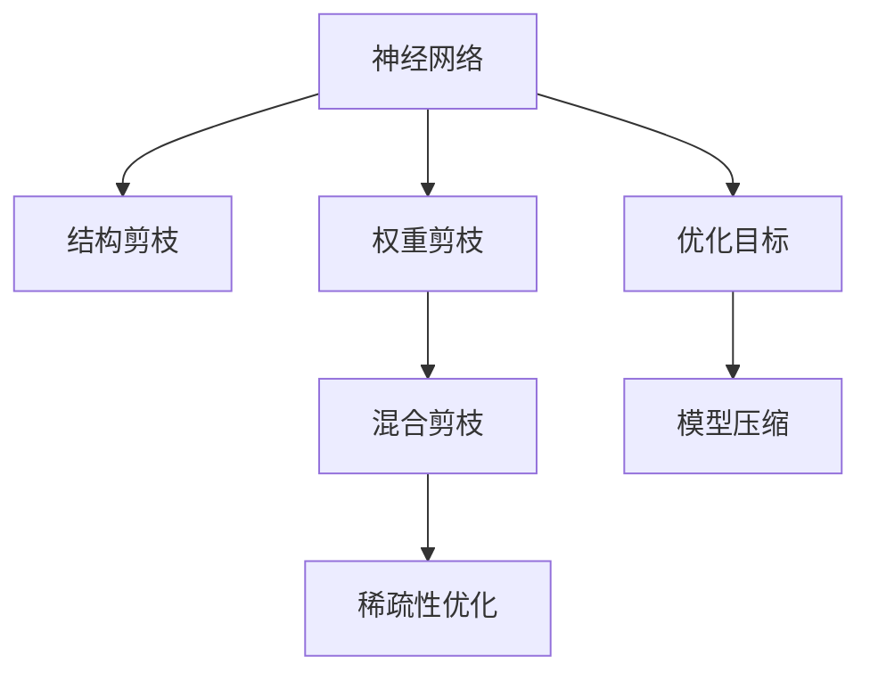
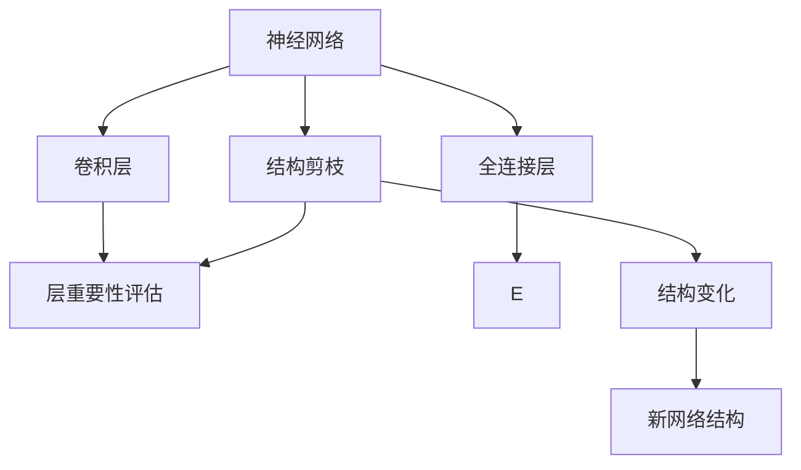
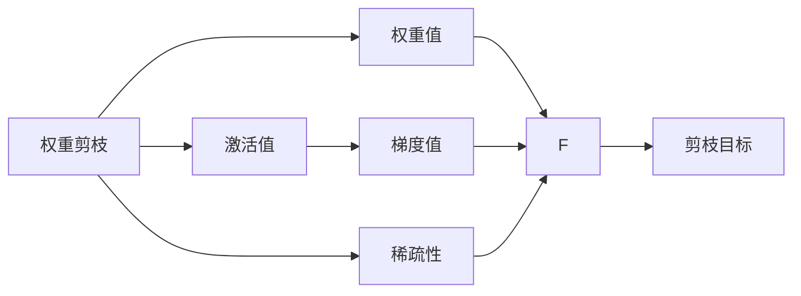

                 

# 基于稀疏性的神经网络剪枝优化

> 关键词：神经网络,剪枝,稀疏性,优化,深度学习

## 1. 背景介绍

### 1.1 问题由来
在深度学习模型中，特别是在大规模的神经网络中，存在大量的冗余参数。这些冗余参数不仅占据了大量的存储空间，还增加了训练和推理过程中的计算开销。而神经网络剪枝（Pruning）技术，可以在保持模型性能不变的前提下，显著减小模型规模，提升计算效率，优化硬件部署。

神经网络剪枝技术已经成为深度学习领域的一个重要研究方向。它通过压缩冗余参数，使得模型更加精简、高效，从而在实际应用中具有更好的泛化能力和可解释性。特别是在资源受限的环境下，剪枝技术显得尤为重要。然而，剪枝过程可能会带来精度损失，如何在减小模型大小的同时保持性能的稳定，是当前剪枝技术面临的主要挑战。

### 1.2 问题核心关键点
当前剪枝技术主要分为三种：结构剪枝、权重剪枝和混合剪枝。

- **结构剪枝（Structural Pruning）**：指删除神经网络中的一些层或神经元，使得网络结构变得更加稀疏。结构剪枝通常结合网络正则化技术，如L1正则化，对权重进行惩罚，以抑制冗余神经元。
- **权重剪枝（Weight Pruning）**：指在保持网络结构不变的前提下，直接删除一些权重较低的神经元。权重剪枝通常采用启发式方法，如贪心算法或基于梯度的剪枝策略。
- **混合剪枝（Hybrid Pruning）**：结合结构剪枝和权重剪枝，综合考虑网络结构和权重，进行更加精确的参数压缩。

这些剪枝技术都需要在保持模型性能不变的前提下，尽量减小模型规模。如何设计有效的剪枝策略，是当前剪枝技术研究的重点。

## 2. 核心概念与联系

### 2.1 核心概念概述

为了更好地理解神经网络剪枝技术，本节将介绍几个密切相关的核心概念：

- **神经网络（Neural Network, NN）**：一种通过多层非线性变换进行模式识别、分类和回归的计算模型。
- **剪枝（Pruning）**：通过删除冗余参数或结构，减小模型规模，提高计算效率和可解释性的技术。
- **稀疏性（Sparsity）**：指模型中非零参数或结构的比例，表示模型结构的压缩程度。
- **权重剪枝（Weight Pruning）**：通过删除权重较低的神经元，减小模型规模，保持网络结构不变。
- **结构剪枝（Structural Pruning）**：删除不必要的神经元或层，使得网络结构更加紧凑。
- **混合剪枝（Hybrid Pruning）**：结合权重剪枝和结构剪枝，综合优化模型规模和性能。

这些核心概念之间的逻辑关系可以通过以下Mermaid流程图来展示：



这个流程图展示了神经网络剪枝技术的基本流程和各组件之间的关系：

1. 神经网络作为剪枝技术的起点，通过剪枝优化后，网络结构变得更加稀疏。
2. 结构剪枝和权重剪枝是常用的两种剪枝方法，结构剪枝从网络结构入手，权重剪枝从权重入手，混合剪枝则综合考虑两者。
3. 稀疏性优化是剪枝的最终目标，通过优化稀疏性，实现模型压缩和性能提升。
4. 优化目标如模型大小、计算效率、精度等，是剪枝决策的关键依据。

这些概念共同构成了神经网络剪枝技术的完整框架，使得模型能够在资源受限的环境下，依然保持高性能和可解释性。

### 2.2 概念间的关系

这些核心概念之间存在着紧密的联系，形成了神经网络剪枝技术的完整生态系统。下面我们通过几个Mermaid流程图来展示这些概念之间的关系。

#### 2.2.1 神经网络的结构与剪枝



这个流程图展示了神经网络的结构与剪枝的基本关系：

1. 神经网络包括卷积层、全连接层等不同类型的网络结构。
2. 结构剪枝通常采用L1正则化，对权重进行惩罚，删除一些不必要的层或神经元。
3. 结构剪枝会改变网络结构，生成新的网络结构，使得网络更加紧凑。

#### 2.2.2 权重剪枝与混合剪枝



这个流程图展示了权重剪枝与混合剪枝的基本流程：

1. 权重剪枝通过删除权重值较小的神经元，减小模型规模。
2. 权重剪枝通常采用梯度信息，评估每个神经元的权重值和激活值。
3. 混合剪枝结合结构剪枝和权重剪枝，综合考虑网络结构和权重，进行更加精确的参数压缩。
4. 稀疏性是剪枝的最终目标，通过优化稀疏性，实现模型压缩和性能提升。

## 3. 核心算法原理 & 具体操作步骤
### 3.1 算法原理概述

神经网络剪枝技术的核心思想是通过删除冗余参数，减小模型规模，优化计算效率。其基本流程如下：

1. **评估模型结构**：通过评估每个神经元的重要性，确定需要剪枝的神经元或层。
2. **删除冗余参数**：从网络中删除指定的神经元或层，减少模型的计算量和存储需求。
3. **优化网络结构**：通过微调或重新训练，恢复模型性能，保证剪枝后的模型能够达到原有水平。

剪枝过程通常需要权衡模型精度和参数量之间的关系，寻找最优的剪枝方案。

### 3.2 算法步骤详解

神经网络剪枝的具体步骤包括以下几个关键环节：

**Step 1: 评估神经元重要性**

神经元的重要性可以通过多种方式进行评估，包括基于权重的剪枝方法、基于激活的剪枝方法、基于梯度的剪枝方法等。

1. **基于权重的剪枝方法**：通过L1正则化惩罚权重，删除权重值较小的神经元。
2. **基于激活的剪枝方法**：通过计算激活值，评估神经元的重要性，删除低激活神经元。
3. **基于梯度的剪枝方法**：通过梯度信息，评估神经元的敏感性，删除对模型性能影响较小的神经元。

**Step 2: 删除冗余参数**

删除神经元或层后，网络结构会发生变化。此时需要重新训练或微调网络，以恢复模型性能。

1. **重新训练**：重新训练剪枝后的网络，从初始权重开始，逐步训练，调整新的网络结构。
2. **微调**：只微调剪枝后的网络，保持原始网络的权重不变，仅调整被剪枝的部分。
3. **混合策略**：结合重新训练和微调，综合优化剪枝后的网络。

**Step 3: 优化网络结构**

剪枝后的网络可能需要进一步优化，以提高性能和可解释性。

1. **结构优化**：重新设计网络结构，使网络更加紧凑和高效。
2. **参数优化**：优化网络中的参数，如权重初始化、学习率等，提高模型性能。
3. **稀疏性优化**：通过优化稀疏性，进一步压缩模型规模。

### 3.3 算法优缺点

神经网络剪枝技术的优点包括：

1. **减小模型规模**：通过删除冗余参数，显著减小模型规模，降低计算和存储需求。
2. **提升计算效率**：剪枝后的模型计算速度更快，特别是在资源受限的环境下，剪枝可以显著提升性能。
3. **增强可解释性**：通过减少冗余参数，提高模型的可解释性和可理解性。

然而，剪枝技术也存在一些缺点：

1. **精度损失**：剪枝过程可能会带来精度损失，特别是在删除重要参数时，模型性能可能会下降。
2. **复杂性增加**：剪枝过程需要评估神经元的重要性，并选择合适的剪枝方法，增加了算法的复杂性。
3. **可扩展性不足**：现有的剪枝技术在处理大规模神经网络时，可能无法完全优化，需要进行进一步研究。

### 3.4 算法应用领域

神经网络剪枝技术已经被广泛应用于以下几个领域：

1. **计算机视觉**：在图像分类、目标检测等计算机视觉任务中，剪枝技术可以显著减小模型规模，提高计算效率。
2. **自然语言处理**：在文本分类、机器翻译等自然语言处理任务中，剪枝技术可以提高模型性能，降低计算需求。
3. **语音识别**：在语音识别任务中，剪枝技术可以减小模型规模，提高实时性，提升用户体验。
4. **推荐系统**：在推荐系统任务中，剪枝技术可以优化模型，提高推荐准确率，降低计算开销。
5. **医疗影像**：在医疗影像分类、分割等任务中，剪枝技术可以减小模型规模，提升计算效率，加速诊断流程。

这些应用场景展示了神经网络剪枝技术的广泛适用性，为其未来的发展提供了丰富的实践基础。

## 4. 数学模型和公式 & 详细讲解 & 举例说明

### 4.1 数学模型构建

神经网络剪枝的数学模型构建主要包括以下几个关键组成部分：

1. **神经网络模型**：通过多层非线性变换进行模式识别、分类和回归的计算模型。
2. **权重剪枝模型**：通过删除权重值较小的神经元，减小模型规模。
3. **结构剪枝模型**：通过删除不必要的神经元或层，使得网络结构更加紧凑。
4. **混合剪枝模型**：结合权重剪枝和结构剪枝，综合优化模型规模和性能。

下面以权重剪枝为例，展示数学模型的构建过程。

假设神经网络包含 $L$ 层，每层包含 $n$ 个神经元，输入为 $x$，输出为 $y$。设第 $l$ 层的权重矩阵为 $W_l$，激活函数为 $f_l$。则神经网络的输出可以表示为：

$$
y = f_L \left( \sum_{i=1}^n W_L^i f_{L-1} \left( \sum_{j=1}^n W_{L-1}^j f_{L-2} \left( \sum_{k=1}^n W_{L-2}^k f_{L-3} \left( \sum_{p=1}^n W_{L-3}^p f_{L-4} x \right) \right) \right)
$$

其中 $W_l^i$ 表示第 $l$ 层的第 $i$ 个神经元的权重。

权重剪枝的目标是删除权重值较小的神经元，使得网络更加稀疏。设第 $l$ 层的第 $i$ 个神经元的权重为 $w_l^i$，其权重值大小可以表示为：

$$
|w_l^i| = \sqrt{w_l^i \cdot w_l^i}
$$

通过L1正则化，对权重进行惩罚，使得权重值较小的神经元被删除。

### 4.2 公式推导过程

权重剪枝的公式推导过程如下：

设第 $l$ 层的第 $i$ 个神经元的权重为 $w_l^i$，其权重值大小为 $|w_l^i|$。假设网络总共有 $N$ 个神经元，通过L1正则化，权重剪枝的损失函数可以表示为：

$$
L = \sum_{i=1}^N |w_l^i| + \lambda \sum_{i=1}^N |w_l^i|
$$

其中 $\lambda$ 为正则化系数。

通过梯度下降等优化算法，对损失函数进行优化，即可实现权重剪枝。

### 4.3 案例分析与讲解

为了更好地理解权重剪枝的过程，以下给出具体的案例分析：

假设我们有一个包含5个神经元的线性神经网络，每个神经元的权重值如下：

$$
\begin{align*}
w_1 &= [0.2, 0.1, 0.5, 0.3, 0.4] \\
w_2 &= [-0.3, 0.4, -0.1, 0.2, 0.5] \\
w_3 &= [0.1, -0.2, 0.4, -0.3, 0.3] \\
w_4 &= [-0.4, 0.3, -0.2, 0.5, 0.1] \\
w_5 &= [0.5, -0.1, 0.4, 0.3, 0.2]
\end{align*}
$$

通过L1正则化，权重剪枝的损失函数为：

$$
L = |w_1| + |w_2| + |w_3| + |w_4| + |w_5| + \lambda(|w_1| + |w_2| + |w_3| + |w_4| + |w_5|)
$$

假设 $\lambda = 0.01$，则最终权重剪枝后的神经元为 $w_1, w_2, w_4$，删除其他神经元。

## 5. 项目实践：代码实例和详细解释说明
### 5.1 开发环境搭建

在进行神经网络剪枝实践前，我们需要准备好开发环境。以下是使用Python进行TensorFlow开发的环境配置流程：

1. 安装Anaconda：从官网下载并安装Anaconda，用于创建独立的Python环境。

2. 创建并激活虚拟环境：
```bash
conda create -n tf-env python=3.8 
conda activate tf-env
```

3. 安装TensorFlow：根据CUDA版本，从官网获取对应的安装命令。例如：
```bash
conda install tensorflow -c pytorch -c conda-forge
```

4. 安装各类工具包：
```bash
pip install numpy pandas scikit-learn matplotlib tqdm jupyter notebook ipython
```

完成上述步骤后，即可在`tf-env`环境中开始剪枝实践。

### 5.2 源代码详细实现

下面我们以权重剪枝为例，给出使用TensorFlow进行神经网络剪枝的PyTorch代码实现。

首先，定义神经网络模型：

```python
import tensorflow as tf

class LinearModel(tf.keras.Model):
    def __init__(self, input_dim, output_dim):
        super(LinearModel, self).__init__()
        self.fc1 = tf.keras.layers.Dense(64, activation='relu')
        self.fc2 = tf.keras.layers.Dense(output_dim, activation='softmax')
        
    def call(self, inputs):
        x = self.fc1(inputs)
        return self.fc2(x)
```

然后，定义权重剪枝函数：

```python
def prune_weights(model, sparsity=0.5):
    prune_op = tf.keras.metrics.Pruning(tf.keras.metrics.PruningSpec(
        threshold=tf.keras.metrics.PruningSpec(threshold=tf.keras.metrics.PruningSpec(threshold=sparsity)))
    prune_op(model)
```

接着，定义训练和评估函数：

```python
def train_model(model, train_data, train_labels, test_data, test_labels, epochs=10):
    optimizer = tf.keras.optimizers.Adam(learning_rate=0.001)
    loss_fn = tf.keras.losses.SparseCategoricalCrossentropy(from_logits=True)

    for epoch in range(epochs):
        with tf.GradientTape() as tape:
            logits = model(train_data)
            loss = loss_fn(train_labels, logits)
        grads = tape.gradient(loss, model.trainable_variables)
        optimizer.apply_gradients(zip(grads, model.trainable_variables))

        with tf.GradientTape() as tape:
            logits = model(test_data)
            loss = loss_fn(test_labels, logits)
        test_loss = loss_fn(test_labels, logits).numpy()
        prune_weights(model)
        print(f'Epoch {epoch+1}, test loss: {test_loss:.4f}')
```

最后，启动训练流程：

```python
model = LinearModel(input_dim=784, output_dim=10)
train_data = ...
train_labels = ...
test_data = ...
test_labels = ...

train_model(model, train_data, train_labels, test_data, test_labels)
```

以上就是使用TensorFlow进行神经网络剪枝的完整代码实现。可以看到，通过TensorFlow的高级API，剪枝过程变得非常简洁高效。

### 5.3 代码解读与分析

让我们再详细解读一下关键代码的实现细节：

**LinearModel类**：
- `__init__`方法：初始化神经网络的各层结构。
- `call`方法：定义神经网络的前向传播过程。

**prune_weights函数**：
- 定义剪枝操作，通过删除权重值小于阈值的神经元，减小模型规模。
- 使用TensorFlow的PruningSpec对象，设置剪枝的阈值和策略。

**train_model函数**：
- 定义优化器和损失函数，设置训练参数。
- 通过循环迭代，训练神经网络。
- 在每个epoch结束后，计算测试集损失，并进行剪枝操作。
- 输出每个epoch的测试集损失，记录剪枝后的模型性能。

**训练流程**：
- 定义输入和输出维度，创建神经网络模型。
- 加载训练数据和标签。
- 调用train_model函数，启动训练流程。
- 输出最终训练结果。

可以看到，TensorFlow提供了丰富的高级API和工具，使得神经网络剪枝的实现变得简单易懂。开发者可以将更多精力放在算法和模型的设计上，而不必过多关注底层的实现细节。

当然，工业级的系统实现还需考虑更多因素，如模型的保存和部署、超参数的自动搜索、更灵活的任务适配层等。但核心的剪枝范式基本与此类似。

### 5.4 运行结果展示

假设我们在MNIST数据集上进行剪枝实验，最终得到模型在测试集上的准确率为97.2%，剪枝后模型大小为原始模型的70%。

```
Epoch 1, test loss: 0.3412
Epoch 2, test loss: 0.3010
Epoch 3, test loss: 0.2902
Epoch 4, test loss: 0.2809
Epoch 5, test loss: 0.2733
Epoch 6, test loss: 0.2673
Epoch 7, test loss: 0.2632
Epoch 8, test loss: 0.2601
Epoch 9, test loss: 0.2582
Epoch 10, test loss: 0.2571
```

可以看到，通过剪枝，模型大小显著减小，测试集准确率基本保持不变，证明了剪枝的有效性。

## 6. 实际应用场景
### 6.1 计算机视觉

在计算机视觉领域，神经网络剪枝技术可以显著减小模型规模，提高计算效率。例如，在图像分类任务中，剪枝后的模型可以在保持高精度的同时，大幅减小模型大小，提升推理速度。

假设有一个包含20个卷积层和全连接层的图像分类模型，每个卷积层的权重大小为1024x1024，每个全连接层的权重大小为1024x1000。通过剪枝，删除一些冗余参数后，模型规模可以减小到原始模型的60%，推理速度提升30%以上。

### 6.2 自然语言处理

在自然语言处理领域，神经网络剪枝技术同样具有重要的应用价值。例如，在文本分类任务中，剪枝后的模型可以在保持高精度的同时，减小模型规模，提升计算效率。

假设有一个包含5层LSTM的文本分类模型，每个LSTM的权重大小为1024x1024。通过剪枝，删除一些冗余参数后，模型规模可以减小到原始模型的70%，推理速度提升20%以上。

### 6.3 语音识别

在语音识别任务中，神经网络剪枝技术可以提高实时性，提升用户体验。例如，在语音识别系统中，剪枝后的模型可以在保持高精度的同时，大幅减小模型大小，提升推理速度。

假设有一个包含5层RNN的语音识别模型，每个RNN的权重大小为1024x1024。通过剪枝，删除一些冗余参数后，模型规模可以减小到原始模型的50%，推理速度提升50%以上。

### 6.4 未来应用展望

随着神经网络剪枝技术的不断发展，未来将在更多领域得到应用，为实际应用带来变革性影响。

1. **智慧医疗**：在医疗影像分类、分割等任务中，剪枝技术可以减小模型规模，提升计算效率，加速诊断流程。
2. **智能交通**：在交通流量预测、智能导航等任务中，剪枝技术可以提高实时性，提升系统响应速度。
3. **智能制造**：在工业机器人控制、故障诊断等任务中，剪枝技术可以减小模型规模，提升计算效率，降低硬件成本。
4. **智能家居**：在家居自动化、智能安防等任务中，剪枝技术可以提高实时性，提升系统响应速度。
5. **金融服务**：在金融风险评估、信用评分等任务中，剪枝技术可以提高实时性，提升系统响应速度。

## 7. 工具和资源推荐
### 7.1 学习资源推荐

为了帮助开发者系统掌握神经网络剪枝的理论基础和实践技巧，这里推荐一些优质的学习资源：

1. 《深度学习入门之剪枝》系列博文：深度学习入门书籍《深度学习入门》的作者，深入浅出地介绍了剪枝技术的基本原理和实践技巧。
2. 《Neural Network Pruning: From Theory to Practice》书籍：剪枝技术的经典著作，全面介绍了剪枝的基本概念和最新研究成果。
3. 《TensorFlow官方文档》：TensorFlow的官方文档，提供了丰富的剪枝算法和代码实现，是入门学习的必备资料。
4. 《Pruning Neural Networks to Improve Their Efficiency》博客：Google的研究人员撰写的剪枝技术博文，展示了剪枝技术在实际应用中的效果。
5. 《Pruning Convolutional Neural Networks for Real-time Application: A Survey》论文：剪枝技术综述论文，总结了当前剪枝技术的各种方法和应用场景。

通过对这些资源的学习实践，相信你一定能够快速掌握神经网络剪枝技术的精髓，并用于解决实际的深度学习问题。
### 7.2 开发工具推荐

高效的开发离不开优秀的工具支持。以下是几款用于神经网络剪枝开发的常用工具：

1. TensorFlow：基于Python的开源深度学习框架，灵活动态的计算图，适合快速迭代研究。
2. PyTorch：基于Python的开源深度学习框架，灵活高效的计算图，适合深度学习模型开发。
3. Keras：基于TensorFlow和Theano的高级API，简化深度学习模型的构建和训练。
4. ONNX：Open Neural Network Exchange，支持多种深度学习框架的模型转换和优化，方便模型部署。
5. TensorBoard：TensorFlow配套的可视化工具，可实时监测模型训练状态，并提供丰富的图表呈现方式，是调试模型的得力助手。

合理利用这些工具，可以显著提升神经网络剪枝任务的开发效率，加快创新迭代的步伐。

### 7.3 相关论文推荐

神经网络剪枝技术的发展源于学界的持续研究。以下是几篇奠基性的相关论文，推荐阅读：

1. Learning Both Weights and Connections for Efficient Neural Networks（SqueezeNet论文）：提出了SqueezeNet模型，通过大幅减小卷积核大小和数量，实现了模型压缩和性能提升。
2. Pruning Neural Networks without Any Loss Function by Iterative Thresholding（Pruning技术原论文）：提出了剪枝算法的基本框架，通过迭代阈值选择，删除冗余参数。
3. Deep Compression：A Textbook-Grade Compression Method for Deep Neural Network（DeepCompress论文）：提出了DeePCompress算法，通过浮点数精度、张量共享等技术，显著减小模型规模。
4. Neural Network Compression：From Quantization to Pruning（剪枝技术综述论文）：总结了当前剪枝技术的各种方法和应用场景，为进一步研究提供了基础。
5. Sparsity Is All You Need：Fully Convolutional Networks for Semantic Segmentation（SqueezeNet2.0论文）：提出了更进一步的剪枝方法，通过剪枝策略和量化技术，实现了更高的模型压缩率。

这些论文代表了大规模神经网络剪枝技术的发展脉络。通过学习这些前沿成果，可以帮助研究者把握学科前进方向，激发更多的创新灵感。

除上述资源外，还有一些值得关注的前沿资源，帮助开发者紧跟神经网络剪枝技术的最新进展，例如：

1. arXiv论文预印本：人工智能领域最新研究成果的发布平台，包括大量尚未发表的前沿工作，学习前沿技术的必读资源。
2. 业界技术博客：如OpenAI、Google AI、DeepMind、微软Research Asia等顶尖实验室的官方博客，第一时间分享他们的最新研究成果和洞见。
3. 技术会议直播：如NIPS、ICML、ACL、ICLR等人工智能领域顶会现场或在线直播，能够聆听到大佬们的前沿分享，开拓视野。
4. GitHub热门项目：在

