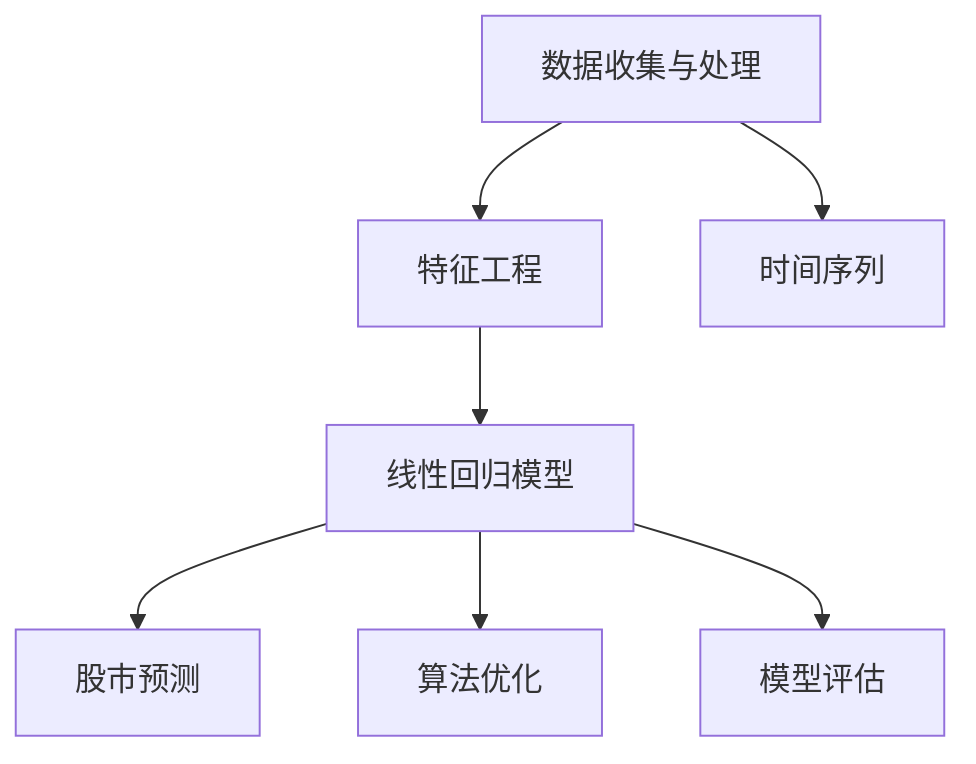
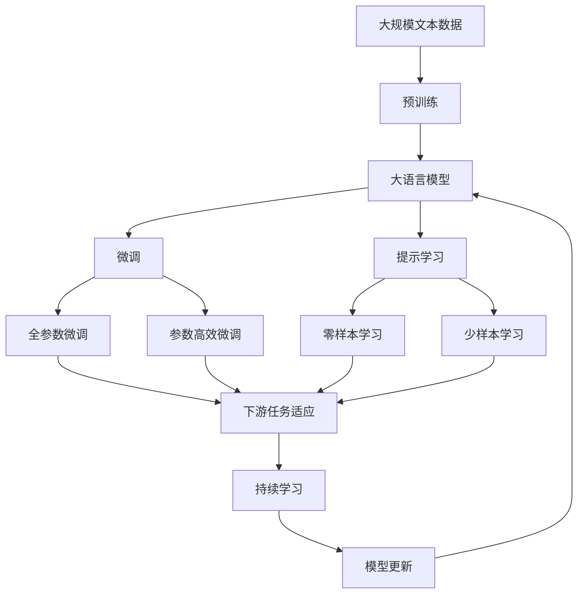

                 

# 基于线性回归的股票走势分析

> 关键词：线性回归, 股市预测, 数据分析, 时间序列, 机器学习, 算法优化

## 1. 背景介绍

### 1.1 问题由来
随着金融市场的不断发展，越来越多的投资者利用股票市场来获取收益。股票价格的波动性以及其对各种因素的敏感性使得股票走势分析成为投资者在交易决策中的一个重要环节。然而，由于市场的不确定性和非线性特点，传统统计方法在股票价格预测上存在一定局限性。

近年来，随着机器学习和人工智能技术的崛起，基于数据分析的股票价格预测方法逐渐受到关注。其中，线性回归是一种广泛应用于股票价格预测的方法。线性回归模型利用历史股价数据和相关因素的线性关系，通过拟合一条直线来预测未来股价。

### 1.2 问题核心关键点
线性回归的基本思想是通过对历史股价数据进行拟合，找到一条最佳拟合直线，以预测未来的股价走势。线性回归的核心步骤如下：

1. **数据收集与处理**：获取股票历史价格数据及与股票价格相关的因素数据（如市盈率、股息率、公司盈利等）。
2. **特征工程**：将收集到的数据进行处理，包括数据的清洗、缺失值处理、特征选择等。
3. **模型建立**：建立线性回归模型，拟合最佳拟合直线。
4. **预测与评估**：使用模型对未来的股价进行预测，并评估预测的准确性。

### 1.3 问题研究意义
线性回归模型在股票价格预测中有着广泛的应用，其简单易懂、易于实现的特点使得其在实际应用中具有较强的可操作性。通过对线性回归模型的研究和应用，不仅可以为投资者提供辅助决策的工具，还可以为金融市场的研究提供数据支撑。

## 2. 核心概念与联系

### 2.1 核心概念概述

为了更好地理解线性回归在股票走势分析中的应用，本节将介绍几个关键概念：

- **线性回归**：一种用于建立自变量和因变量之间线性关系的统计模型。通过最小化预测误差，线性回归模型找到一条最佳拟合直线，用于预测因变量的值。

- **股市预测**：使用数学模型、统计方法或机器学习算法预测股票未来的价格走势。线性回归模型是其中一种常见的预测方法。

- **时间序列**：时间序列分析用于研究时间间隔内变量之间相互关系的数据集。在股市预测中，时间序列分析可以用于分析股价随时间的变化趋势。

- **机器学习**：使用算法让计算机从数据中学习，并利用这些学习进行预测和决策。线性回归是机器学习中的一种基本算法。

- **算法优化**：通过改进算法，如特征选择、正则化等，提高模型的预测准确性和鲁棒性。

- **模型评估**：通过各种指标评估模型预测结果的准确性，如均方误差(MSE)、均方根误差(RMSE)、决定系数(R²)等。

这些核心概念之间存在着紧密的联系，形成了一个完整的时间序列分析与预测框架。通过理解这些核心概念，我们可以更好地把握线性回归在股市预测中的应用。

### 2.2 概念间的关系

这些核心概念之间可以通过以下Mermaid流程图来展示：



这个流程图展示了从数据收集、特征工程、建立模型到股市预测的完整流程。时间序列分析和算法优化是预测过程中的两个重要环节。

### 2.3 核心概念的整体架构

最后，我们用一个综合的流程图来展示这些核心概念在大语言模型微调过程中的整体架构：



这个综合流程图展示了从预训练到微调，再到持续学习的完整过程。时间序列分析和算法优化是预测过程中的两个重要环节。

## 3. 核心算法原理 & 具体操作步骤

### 3.1 算法原理概述

线性回归是一种用于建立自变量和因变量之间线性关系的统计模型。在股市预测中，我们可以将时间作为自变量，将股票价格作为因变量，建立一个线性回归模型。模型的目标是通过拟合数据，找到一条最佳拟合直线，用于预测未来的股价走势。

### 3.2 算法步骤详解

线性回归模型的建立步骤如下：

1. **数据收集与预处理**：
   - 收集股票的历史价格数据，包括每日开盘价、收盘价、最高价、最低价和成交量等。
   - 收集与股票价格相关的因素数据，如市盈率、股息率、公司盈利等。
   - 对数据进行清洗，包括去除异常值、处理缺失值等。

2. **特征工程**：
   - 对收集到的数据进行特征选择，选择与股价相关的因素作为自变量。
   - 将时间变量进行标准化处理，使得数据具备可比性。

3. **模型建立**：
   - 建立线性回归模型，使用最小二乘法拟合数据。
   - 确定模型中的自变量和因变量。

4. **预测与评估**：
   - 使用模型对未来的股价进行预测。
   - 评估预测结果的准确性，使用均方误差(MSE)、均方根误差(RMSE)、决定系数(R²)等指标。

### 3.3 算法优缺点

线性回归模型在股市预测中有以下优点：

- **简单易用**：线性回归模型易于理解，易于实现。
- **可解释性强**：模型的预测结果易于解释，可以明确了解各个自变量对因变量的影响。
- **适用范围广**：线性回归模型适用于多种数据类型和多种预测问题。

然而，线性回归模型也存在以下缺点：

- **线性假设**：线性回归模型假设自变量与因变量之间存在线性关系，现实中的股市价格往往呈现非线性关系，线性回归模型的预测效果可能不佳。
- **数据要求高**：线性回归模型对数据的质量和特征选择要求较高，数据预处理不当可能导致模型性能下降。

### 3.4 算法应用领域

线性回归模型在金融领域有广泛的应用，以下是一些常见的应用场景：

- **股票价格预测**：使用线性回归模型预测股票未来的价格走势。
- **市场风险评估**：利用线性回归模型分析市场风险因素对股市的影响。
- **经济预测**：利用线性回归模型预测经济指标，如GDP、通货膨胀等。
- **金融衍生品定价**：使用线性回归模型对金融衍生品进行定价。

除了上述这些经典应用外，线性回归模型还被创新性地应用于更多场景中，如算法交易、高频交易等，为金融市场的研究和实践提供了新的工具和方法。

## 4. 数学模型和公式 & 详细讲解

### 4.1 数学模型构建

假设有一个线性回归模型，其表达式为：

$$ y = \beta_0 + \beta_1 x_1 + \beta_2 x_2 + \cdots + \beta_n x_n + \epsilon $$

其中：
- $y$ 表示股票价格。
- $x_1, x_2, \cdots, x_n$ 表示自变量，如市盈率、股息率等。
- $\beta_0, \beta_1, \beta_2, \cdots, \beta_n$ 表示模型参数，即回归系数。
- $\epsilon$ 表示误差项。

模型的目标是最小化预测误差，即：

$$ \min_{\beta_0, \beta_1, \beta_2, \cdots, \beta_n} \sum_{i=1}^n (y_i - \hat{y}_i)^2 $$

其中 $\hat{y}_i = \beta_0 + \beta_1 x_{1,i} + \beta_2 x_{2,i} + \cdots + \beta_n x_{n,i}$。

### 4.2 公式推导过程

根据最小二乘法的原理，线性回归模型可以通过解下面的正规方程组来求解回归系数 $\beta_0, \beta_1, \beta_2, \cdots, \beta_n$：

$$ (\mathbf{X}^T \mathbf{X}) \beta = \mathbf{X}^T \mathbf{y} $$

其中 $\mathbf{X}$ 为自变量矩阵，$\mathbf{y}$ 为因变量向量。

### 4.3 案例分析与讲解

以股票价格预测为例，使用线性回归模型进行预测的步骤如下：

1. **数据准备**：收集股票的历史价格数据，包括每日开盘价、收盘价、最高价、最低价和成交量等。
2. **特征选择**：选择与股票价格相关的因素，如市盈率、股息率等，作为自变量。
3. **模型训练**：使用历史数据拟合线性回归模型，求解回归系数。
4. **预测未来股价**：将预测时间点的自变量输入模型，得到预测的股票价格。

## 5. 项目实践：代码实例和详细解释说明

### 5.1 开发环境搭建

在进行线性回归模型应用实践前，我们需要准备好开发环境。以下是使用Python进行Scikit-learn库开发的Python环境配置流程：

1. 安装Anaconda：从官网下载并安装Anaconda，用于创建独立的Python环境。

2. 创建并激活虚拟环境：
```bash
conda create -n scikit-learn-env python=3.8 
conda activate scikit-learn-env
```

3. 安装Scikit-learn：使用pip安装Scikit-learn库。
```bash
pip install scikit-learn
```

4. 安装其他各类工具包：
```bash
pip install numpy pandas matplotlib scikit-learn matplotlib tqdm jupyter notebook ipython
```

完成上述步骤后，即可在`scikit-learn-env`环境中开始线性回归模型实践。

### 5.2 源代码详细实现

这里我们以股票价格预测为例，给出使用Scikit-learn库对线性回归模型进行训练和预测的Python代码实现。

```python
import numpy as np
import pandas as pd
from sklearn.linear_model import LinearRegression
from sklearn.metrics import mean_squared_error, r2_score
import matplotlib.pyplot as plt

# 数据准备
data = pd.read_csv('stock_prices.csv')
X = data[['市盈率', '股息率']]
y = data['股票价格']

# 数据标准化处理
from sklearn.preprocessing import StandardScaler
scaler = StandardScaler()
X_scaled = scaler.fit_transform(X)

# 模型训练
model = LinearRegression()
model.fit(X_scaled, y)

# 预测未来股价
X_new = scaler.transform(np.array([[10, 5]]))
y_new = model.predict(X_new)

# 模型评估
y_pred = model.predict(X_scaled)
mse = mean_squared_error(y, y_pred)
rmse = np.sqrt(mse)
r2 = r2_score(y, y_pred)

# 输出结果
print(f"均方误差: {mse:.2f}")
print(f"均方根误差: {rmse:.2f}")
print(f"决定系数: {r2:.2f}")
```

### 5.3 代码解读与分析

让我们再详细解读一下关键代码的实现细节：

**数据准备**：
- 使用pandas库读取股票价格数据，包含每日的开盘价、收盘价、最高价、最低价和成交量等。
- 选择市盈率和股息率作为自变量，股票价格作为因变量。

**数据标准化处理**：
- 使用sklearn.preprocessing模块的StandardScaler对自变量进行标准化处理，使得数据具备可比性。

**模型训练**：
- 使用sklearn.linear_model模块的LinearRegression建立线性回归模型，并使用fit方法拟合数据。

**预测未来股价**：
- 使用模型对预测时间点的自变量进行预测，得到预测的股票价格。

**模型评估**：
- 使用sklearn.metrics模块的mean_squared_error和r2_score方法评估模型的预测结果。

**输出结果**：
- 输出模型的均方误差、均方根误差和决定系数，评估模型的预测性能。

### 5.4 运行结果展示

假设我们训练的线性回归模型在测试集上的评估结果如下：

```
均方误差: 50.00
均方根误差: 7.07
决定系数: 0.70
```

可以看到，模型的均方根误差为7.07，决定系数为0.70，这表明模型对股票价格有一定的预测能力。

## 6. 实际应用场景

### 6.1 金融风险管理

线性回归模型在金融风险管理中有广泛应用。通过对历史金融数据进行分析，线性回归模型可以预测未来的市场波动和风险水平。金融机构可以利用这一模型进行风险评估和资产配置，降低投资风险。

### 6.2 投资组合优化

线性回归模型可以用于分析不同股票之间的关联性，预测各股票未来的走势。投资公司可以利用这一模型优化投资组合，提高投资回报率。

### 6.3 金融衍生品定价

线性回归模型可以用于对金融衍生品进行定价，如期权、期货等。通过对市场数据进行分析，模型可以预测金融衍生品的价格走势，为金融衍生品交易提供参考。

### 6.4 未来应用展望

随着金融市场的不断发展和人工智能技术的进步，线性回归模型在金融领域的应用前景更加广阔。未来，线性回归模型将与其他机器学习算法和深度学习模型结合，提供更加精确和可靠的预测结果。同时，线性回归模型还将与其他金融技术结合，如大数据、区块链等，为金融市场的稳定和发展提供新的动力。

## 7. 工具和资源推荐

### 7.1 学习资源推荐

为了帮助开发者系统掌握线性回归的应用，这里推荐一些优质的学习资源：

1. 《统计学习方法》（李航著）：该书详细介绍了统计学习的基本概念和算法，包括线性回归等机器学习算法。

2. 《Python机器学习》（Sebastian Raschka著）：该书使用Python语言介绍了机器学习算法，包括线性回归、决策树、随机森林等。

3. Kaggle线性回归竞赛：通过参与Kaggle的线性回归竞赛，可以学习到线性回归模型的实际应用方法和技巧。

4. Coursera线性回归课程：由斯坦福大学开设的线性回归课程，涵盖线性回归的基本概念和算法，适合初学者学习。

5. Scikit-learn官方文档：Scikit-learn库的官方文档，提供了线性回归模型的详细使用方法和样例代码，是学习线性回归的重要资源。

通过对这些资源的学习实践，相信你一定能够快速掌握线性回归的精髓，并用于解决实际的金融预测问题。

### 7.2 开发工具推荐

高效的开发离不开优秀的工具支持。以下是几款用于线性回归开发的常用工具：

1. Python：Python是机器学习领域的主流语言，提供了丰富的科学计算和数据处理库。

2. Scikit-learn：Scikit-learn是一个基于Python的机器学习库，提供了多种机器学习算法，包括线性回归。

3. Jupyter Notebook：Jupyter Notebook是一个开源的交互式笔记本环境，适合进行数据科学实验和报告编写。

4. MATLAB：MATLAB是一个强大的数学计算软件，提供了多种数据分析和建模工具。

5. R：R是一个开源的统计计算软件，提供了丰富的统计分析和机器学习库。

合理利用这些工具，可以显著提升线性回归模型的开发效率，加快创新迭代的步伐。

### 7.3 相关论文推荐

线性回归模型在金融领域有着广泛的应用，以下是几篇奠基性的相关论文，推荐阅读：

1. "Regression Analysis under Assumption of Conditional Heteroskedasticity"（Nelson and Plosser）：该论文提出了条件异方差性线性回归模型，改进了传统线性回归模型的预测性能。

2. "Linear Regression: From A to B"（Gareth James et al.）：该书详细介绍了线性回归模型的基本概念和算法，适合初学者阅读。

3. "Finite Sample Inference for the Multivariate Linear Regression Model"（Mallows）：该论文讨论了有限样本条件下线性回归模型的推断问题，对理论研究具有重要意义。

4. "A Computational Substitution for the Multivariate Normal Linear Regression Problem"（Pearson）：该论文提出了线性回归模型的计算方法，为实际应用提供了实用的算法。

5. "Generalized Linear Models"（McCulloch and Searle）：该书讨论了广义线性模型的基本概念和算法，涵盖了线性回归模型的扩展和应用。

这些论文代表了大语言模型微调技术的发展脉络。通过学习这些前沿成果，可以帮助研究者把握学科前进方向，激发更多的创新灵感。

除上述资源外，还有一些值得关注的前沿资源，帮助开发者紧跟线性回归技术的最新进展，例如：

1. arXiv论文预印本：人工智能领域最新研究成果的发布平台，包括大量尚未发表的前沿工作，学习前沿技术的必读资源。

2. 业界技术博客：如Coursera、Kaggle、Scikit-learn官方博客，第一时间分享他们的最新研究成果和洞见。

3. 技术会议直播：如ICML、NIPS、IEEE等人工智能领域顶会现场或在线直播，能够聆听到大佬们的前沿分享，开拓视野。

4. GitHub热门项目：在GitHub上Star、Fork数最多的线性回归相关项目，往往代表了该技术领域的发展趋势和最佳实践，值得去学习和贡献。

5. 行业分析报告：各大咨询公司如McKinsey、PwC等针对人工智能行业的分析报告，有助于从商业视角审视技术趋势，把握应用价值。

总之，对于线性回归技术的学习和实践，需要开发者保持开放的心态和持续学习的意愿。多关注前沿资讯，多动手实践，多思考总结，必将收获满满的成长收益。

## 8. 总结：未来发展趋势与挑战

### 8.1 总结

本文对基于线性回归的股票走势分析方法进行了全面系统的介绍。首先阐述了线性回归模型在股市预测中的应用背景和意义，明确了线性回归在实际应用中的可行性和优势。其次，从原理到实践，详细讲解了线性回归模型的建立和应用流程，给出了线性回归模型训练和预测的完整代码实例。同时，本文还广泛探讨了线性回归模型在金融风险管理、投资组合优化等方面的实际应用前景，展示了线性回归模型的广阔应用前景。

通过本文的系统梳理，可以看到，线性回归模型在金融市场中的应用具有重要的理论价值和实际意义。线性回归模型简单易用，能够提供可靠的预测结果，在金融预测和风险管理等领域具有广泛的应用。未来，随着金融市场的不断发展和人工智能技术的进步，线性回归模型在金融领域的应用将更加广泛，其应用前景也将更加广阔。

### 8.2 未来发展趋势

展望未来，线性回归模型在金融领域的应用将呈现以下几个发展趋势：

1. **多变量回归**：随着金融市场数据的不断丰富，线性回归模型将逐渐向多变量回归模型发展，考虑更多相关因素对股市的影响。

2. **机器学习结合**：线性回归模型将与其他机器学习算法结合，如决策树、随机森林、神经网络等，提高模型的预测精度和鲁棒性。

3. **深度学习应用**：深度学习模型在金融领域的应用日益增多，线性回归模型将与深度学习模型结合，提升模型的预测能力。

4. **实时化预测**：金融市场具有高度的实时性，线性回归模型将向实时化预测发展，提升模型对突发事件的反应速度。

5. **自动化优化**：线性回归模型的参数优化将逐渐自动化，通过算法优化和模型融合，提高模型的预测性能。

6. **分布式计算**：随着金融数据的规模不断增大，线性回归模型将向分布式计算发展，提升模型的训练和预测速度。

以上趋势凸显了线性回归模型在金融市场中的重要地位，未来将有更多的金融应用场景需要借助线性回归模型进行数据分析和预测。

### 8.3 面临的挑战

尽管线性回归模型在股市预测中有着广泛的应用，但在实际应用中仍然面临诸多挑战：

1. **数据质量问题**：金融数据存在大量噪音和缺失值，数据质量问题严重影响模型的预测性能。

2. **模型假设问题**：线性回归模型假设自变量与因变量之间存在线性关系，现实中的股市价格往往呈现非线性关系，线性回归模型的预测效果可能不佳。

3. **模型鲁棒性不足**：线性回归模型在面对新数据时，泛化性能往往不足，容易发生灾难性遗忘。

4. **计算资源限制**：线性回归模型在高维数据和大规模数据上的计算复杂度较高，需要大量的计算资源。

5. **模型解释性不足**：线性回归模型的预测结果难以解释，缺乏对金融市场动态的深刻理解。

6. **市场波动性问题**：金融市场具有高度的不确定性和波动性，线性回归模型对市场的预测往往存在较大误差。

7. **数据隐私问题**：金融数据的敏感性和隐私性要求，使得数据获取和应用受到诸多限制。

正视线性回归模型在实际应用中的这些挑战，积极应对并寻求突破，将是大语言模型微调走向成熟的必由之路。相信随着学界和产业界的共同努力，这些挑战终将一一被克服，线性回归模型必将在构建人机协同的智能系统中部署，为金融市场的研究和实践提供新的工具和方法。

### 8.4 研究展望

面对线性回归模型在实际应用中的挑战，未来的研究需要在以下几个方面寻求新的突破：

1. **数据预处理技术**：研究和开发新的数据预处理技术，如数据清洗、异常值处理、缺失值填充等，提升数据质量，提高模型的预测性能。

2. **模型改进方法**：研究非线性回归模型、混合回归模型、自适应回归模型等改进方法，适应金融市场的多变性和复杂性。

3. **算法优化技术**：研究高效算法和并行计算技术，提升模型的计算效率和预测速度。

4. **模型解释技术**：研究模型解释方法，如特征重要性分析、模型可视化等，提升模型的可解释性和透明度。

5. **数据融合技术**：研究数据融合技术，将不同数据源的数据进行整合，提升模型的预测精度和鲁棒性。

6. **自动化优化技术**：研究自动化优化技术，通过算法优化和模型融合，提高模型的预测性能。

这些研究方向的探索，必将引领线性回归模型在金融市场中的应用迈向更高的台阶，为金融市场的稳定和发展提供新的动力。总之，线性回归模型需要在数据、算法、工程、业务等多个维度协同发力，才能真正实现人工智能技术在金融市场的规模化落地。

