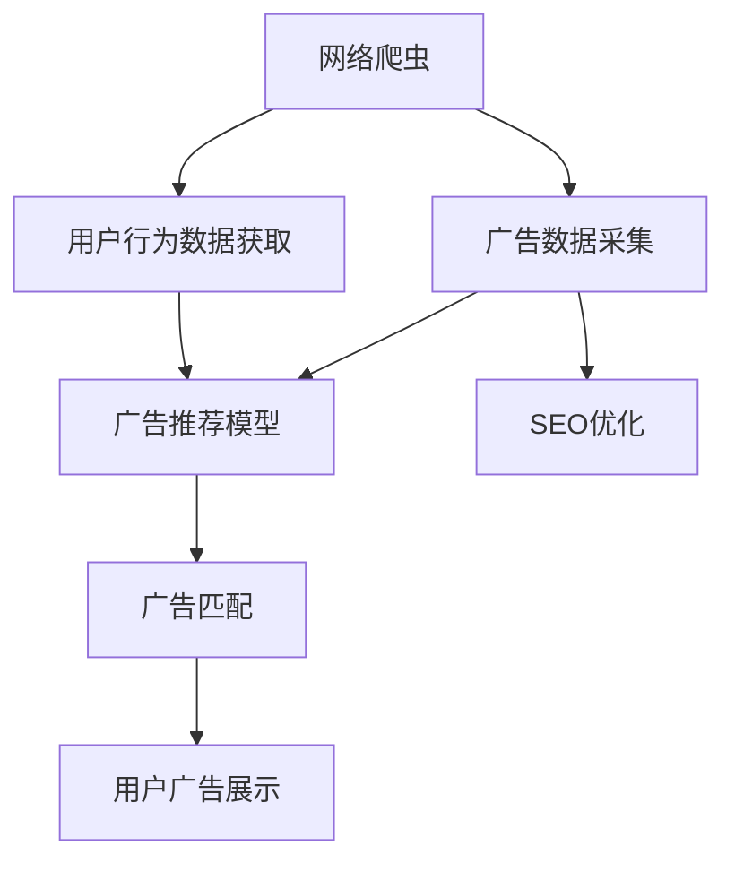
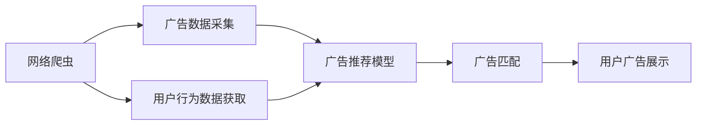
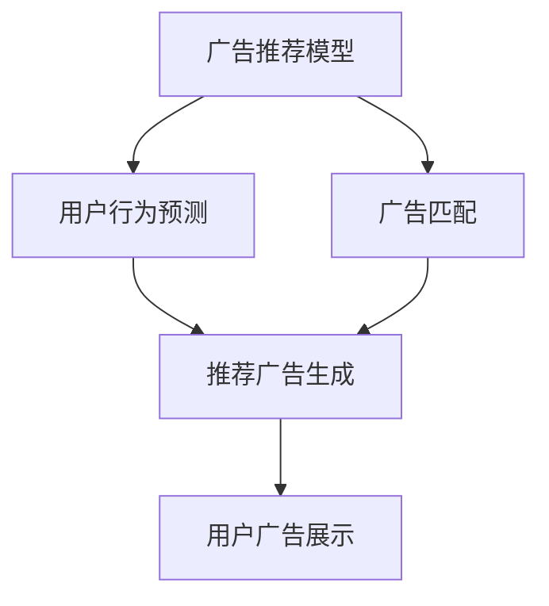
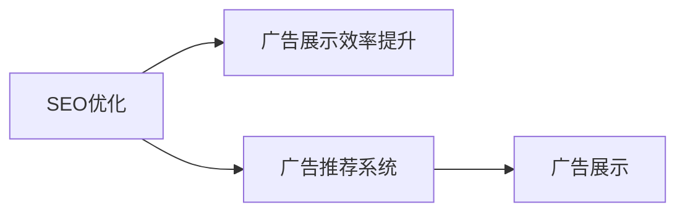

                 

# 基于网络爬虫的智能广告推荐

> 关键词：智能广告推荐, 网络爬虫, 推荐系统, 搜索引擎优化, 个性化广告, 用户行为分析

## 1. 背景介绍

### 1.1 问题由来

随着互联网的快速发展和数字经济的蓬勃兴起，网络广告作为一种重要的营销手段，在商业运营中发挥着至关重要的作用。广告主希望能够精准地触达目标用户，提高广告的点击率和转化率，而广告投放平台则期望在降低成本的同时，能够最大化广告的收益。这种需求驱动下，智能广告推荐系统应运而生。

智能广告推荐系统通过分析用户的历史行为和兴趣，结合广告的实时状态和展示位，智能地匹配广告与用户，从而提升广告的展示效果和用户体验。在这一过程中，如何高效地抓取用户数据和广告信息，以及如何精准地预测用户行为，成为广告推荐系统的关键问题。

### 1.2 问题核心关键点

广告推荐系统主要包含以下几个关键问题：
- 广告数据的采集：如何高效、全面地采集广告数据，同时避免数据质量问题。
- 用户数据的获取：如何高效、全面地抓取用户行为数据，同时保证用户隐私和数据安全。
- 用户行为预测：如何通过机器学习模型，预测用户对广告的兴趣和行为反应。
- 广告匹配：如何将预测结果与广告库匹配，生成推荐广告序列。

在这些问题中，网络爬虫作为广告推荐系统的数据获取手段，其高效性和可靠性直接影响系统的整体性能。因此，本文将重点探讨基于网络爬虫的智能广告推荐系统，介绍网络爬虫的基本原理和应用场景，同时深入分析广告推荐系统中的数据采集和用户行为预测技术。

## 2. 核心概念与联系

### 2.1 核心概念概述

为了更好地理解基于网络爬虫的智能广告推荐系统，本节将介绍几个密切相关的核心概念：

- **网络爬虫**：通过自动化的方式，从互联网上抓取网页内容、元数据、图片等多类型数据的程序。网络爬虫是搜索引擎、广告推荐系统、社交网络分析等数据密集型应用的重要基础。

- **智能广告推荐系统**：通过分析用户的行为和兴趣，智能匹配广告内容与展示位置，从而提升广告的点击率和转化率。广告推荐系统涉及数据采集、预处理、模型训练、广告匹配等多个环节。

- **搜索引擎优化（SEO）**：通过优化网站结构和内容，提高在搜索引擎中的排名，从而增加网站的访问量和用户留存。SEO是广告推荐系统中的重要应用场景之一。

- **用户行为分析**：通过分析用户在网站上的行为数据，了解用户的兴趣和需求，为广告推荐提供依据。常见的行为分析指标包括点击率、停留时间、页面跳转等。

- **推荐算法**：根据用户的历史行为和兴趣，推荐出符合用户需求的产品或内容。常见的推荐算法包括协同过滤、基于内容的推荐、基于模型的推荐等。

这些核心概念之间的逻辑关系可以通过以下Mermaid流程图来展示：



这个流程图展示了网络爬虫在广告推荐系统中的作用：

1. 网络爬虫从互联网上抓取广告和用户行为数据，供广告推荐系统使用。
2. 广告推荐模型对广告数据和用户行为数据进行分析，预测用户对广告的兴趣。
3. SEO优化工具通过分析广告推荐系统的效果，提升广告的展示效率。
4. 广告匹配系统将广告推荐结果与广告展示位置进行匹配，生成最终的广告展示策略。

### 2.2 概念间的关系

这些核心概念之间存在着紧密的联系，形成了智能广告推荐系统的完整生态系统。下面我们通过几个Mermaid流程图来展示这些概念之间的关系。

#### 2.2.1 网络爬虫与广告推荐系统的关系



这个流程图展示了网络爬虫在广告推荐系统中的数据采集作用。网络爬虫从互联网上抓取广告和用户行为数据，供广告推荐模型使用。

#### 2.2.2 广告推荐模型与用户行为分析的关系



这个流程图展示了广告推荐模型在广告推荐系统中的作用。广告推荐模型通过分析用户行为数据，预测用户对广告的兴趣，生成推荐广告序列，与广告匹配系统配合，最终生成用户广告展示策略。

#### 2.2.3 SEO优化与广告推荐系统的关系



这个流程图展示了SEO优化工具在广告推荐系统中的作用。SEO优化工具通过分析广告推荐系统的展示效果，提升广告的展示效率，从而优化广告投放策略。

## 3. 核心算法原理 & 具体操作步骤
### 3.1 算法原理概述

基于网络爬虫的智能广告推荐系统，其核心算法原理主要包括数据采集、用户行为分析、广告推荐和广告匹配等环节。

- **数据采集**：通过网络爬虫高效地抓取广告和用户行为数据，为广告推荐系统提供数据支撑。
- **用户行为分析**：利用机器学习模型分析用户行为数据，预测用户对广告的兴趣和行为反应。
- **广告推荐**：根据用户兴趣和广告状态，通过推荐算法生成推荐广告序列。
- **广告匹配**：将推荐广告序列与广告展示位置进行匹配，生成最终广告展示策略。

这些环节相互配合，共同构成了智能广告推荐系统的核心算法。

### 3.2 算法步骤详解

#### 3.2.1 数据采集

1. **确定采集目标**：明确需要采集的广告和用户行为数据类型、来源网站、采集频率等，制定详细的数据采集计划。

2. **设计爬虫逻辑**：根据数据类型和来源网站，设计网络爬虫的逻辑结构，包括爬虫启动、请求处理、数据存储等环节。

3. **部署爬虫程序**：将设计好的爬虫程序部署到服务器上，并设置定时任务，定期执行数据采集。

4. **数据质量控制**：对采集到的数据进行清洗和过滤，去除噪声和错误数据，保证数据质量。

5. **数据存储与管理**：将采集到的数据存储到数据库中，并提供有效的管理界面，方便后续分析使用。

#### 3.2.2 用户行为分析

1. **数据预处理**：对用户行为数据进行去重、归一化等预处理操作，提高数据的一致性和可用性。

2. **特征提取**：从用户行为数据中提取有用的特征，如点击率、停留时间、页面跳转等，供机器学习模型使用。

3. **模型训练**：选择合适的机器学习模型，如线性回归、随机森林、神经网络等，对用户行为数据进行训练，生成用户行为预测模型。

4. **预测用户兴趣**：将用户行为数据输入训练好的模型，预测用户对不同广告的兴趣和行为反应，输出预测结果。

#### 3.2.3 广告推荐

1. **广告特征提取**：从广告库中提取广告的特征信息，如广告标题、关键词、展示位置等，供推荐模型使用。

2. **广告匹配**：根据用户兴趣预测结果，结合广告特征信息，通过推荐算法生成推荐广告序列。

3. **广告排序**：对生成的推荐广告序列进行排序，提升广告的展示效果。

#### 3.2.4 广告匹配

1. **广告展示位置匹配**：根据用户行为预测结果和推荐广告序列，将广告展示位置与推荐广告进行匹配。

2. **广告展示策略生成**：将匹配后的广告展示策略生成广告展示计划，供广告投放平台使用。

### 3.3 算法优缺点

基于网络爬虫的智能广告推荐系统，具有以下优点：

- **数据全面性高**：网络爬虫可以覆盖互联网上的各种广告和用户行为数据，为广告推荐提供全面支撑。
- **效率高**：网络爬虫可以自动化地进行数据采集，大大提高数据采集的效率。
- **灵活性高**：网络爬虫可以根据数据需求和目标网站，灵活调整采集策略，适应不同的数据采集场景。

但同时，也存在以下缺点：

- **数据质量问题**：由于互联网上的数据复杂多样，网络爬虫可能面临数据噪声、数据格式不统一等质量问题。
- **法律风险**：网络爬虫可能涉及对网站数据的非授权抓取，存在法律风险和伦理问题。
- **资源消耗大**：网络爬虫需要消耗大量计算和存储资源，对系统性能和成本都有一定要求。

### 3.4 算法应用领域

基于网络爬虫的智能广告推荐系统，已经在多个领域得到了广泛应用，例如：

- **搜索引擎优化（SEO）**：通过网络爬虫获取用户搜索数据，为搜索引擎优化提供数据支撑。
- **智能广告投放**：通过网络爬虫抓取用户行为数据，为智能广告投放提供精准的目标用户。
- **内容推荐系统**：通过网络爬虫抓取用户互动数据，为个性化推荐系统提供数据支持。
- **社交媒体分析**：通过网络爬虫抓取社交媒体用户行为数据，为社交媒体广告推荐提供数据支撑。
- **电商广告推荐**：通过网络爬虫抓取用户购物行为数据，为电商平台的广告推荐提供精准的用户匹配。

这些应用场景展示了网络爬虫在广告推荐系统中的重要地位和广泛应用。

## 4. 数学模型和公式 & 详细讲解 & 举例说明
### 4.1 数学模型构建

假设广告推荐系统的数据集为 $D=\{(x_i,y_i)\}_{i=1}^N$，其中 $x_i$ 为广告数据，$y_i$ 为用户行为数据。广告推荐模型的目标是通过训练，使得模型能够预测用户对广告的兴趣 $y'$，即：

$$
y'=f(x; \theta)
$$

其中 $f$ 为广告推荐模型，$\theta$ 为模型参数。

### 4.2 公式推导过程

以线性回归模型为例，假设广告特征 $x$ 可以表示为向量 $\mathbf{x}$，用户兴趣预测 $y'$ 可以表示为向量 $\mathbf{y}'$，则线性回归模型的公式可以表示为：

$$
\mathbf{y}' = \mathbf{W} \mathbf{x} + b
$$

其中 $\mathbf{W}$ 为模型权重矩阵，$b$ 为偏置项。

通过最小化均方误差损失函数，可以训练得到最优的模型参数 $\hat{\mathbf{W}}$ 和 $\hat{b}$，即：

$$
\hat{\mathbf{W}}, \hat{b} = \mathop{\arg\min}_{\mathbf{W}, b} \frac{1}{N} \sum_{i=1}^N (\mathbf{y}_i - \mathbf{W} \mathbf{x}_i - b)^2
$$

求解上述最小化问题，可以得到线性回归模型的参数 $\hat{\mathbf{W}}$ 和 $\hat{b}$。

### 4.3 案例分析与讲解

以某电商平台的智能广告推荐系统为例，该系统通过网络爬虫抓取用户购物行为数据，利用线性回归模型预测用户对广告的兴趣，具体步骤如下：

1. **数据采集**：通过网络爬虫抓取用户购物数据，包括用户ID、商品ID、浏览时长、购买次数等特征。

2. **数据预处理**：对采集到的数据进行去重、归一化等预处理操作，提高数据的一致性和可用性。

3. **特征提取**：从用户行为数据中提取有用的特征，如点击率、停留时间、页面跳转等，供机器学习模型使用。

4. **模型训练**：选择合适的线性回归模型，对用户行为数据进行训练，生成用户行为预测模型。

5. **预测用户兴趣**：将用户行为数据输入训练好的模型，预测用户对不同广告的兴趣和行为反应，输出预测结果。

6. **广告推荐**：根据用户兴趣预测结果，结合广告特征信息，通过推荐算法生成推荐广告序列。

7. **广告匹配**：将推荐广告序列与广告展示位置进行匹配，生成最终广告展示策略。

通过以上步骤，该电商平台实现了智能广告推荐，显著提高了广告的点击率和转化率，实现了用户和广告主的共赢。

## 5. 项目实践：代码实例和详细解释说明
### 5.1 开发环境搭建

在进行广告推荐系统开发前，我们需要准备好开发环境。以下是使用Python进行PyTorch开发的环境配置流程：

1. 安装Anaconda：从官网下载并安装Anaconda，用于创建独立的Python环境。

2. 创建并激活虚拟环境：
```bash
conda create -n ad-recommend-env python=3.8 
conda activate ad-recommend-env
```

3. 安装PyTorch：根据CUDA版本，从官网获取对应的安装命令。例如：
```bash
conda install pytorch torchvision torchaudio cudatoolkit=11.1 -c pytorch -c conda-forge
```

4. 安装TensorFlow：从官网下载并安装TensorFlow，支持GPU加速。

5. 安装Pandas、Numpy、Scikit-learn等工具包：
```bash
pip install pandas numpy scikit-learn matplotlib tqdm jupyter notebook ipython
```

完成上述步骤后，即可在`ad-recommend-env`环境中开始广告推荐系统的开发。

### 5.2 源代码详细实现

这里我们以线性回归模型为例，给出一个基于网络爬虫的智能广告推荐系统的PyTorch代码实现。

首先，定义广告推荐系统的数据处理函数：

```python
import pandas as pd
from sklearn.model_selection import train_test_split
from sklearn.linear_model import LinearRegression
import torch
from torch.utils.data import Dataset, DataLoader

class AdData(Dataset):
    def __init__(self, data, labels):
        self.data = data
        self.labels = labels
        
    def __len__(self):
        return len(self.data)
    
    def __getitem__(self, index):
        return self.data[index], self.labels[index]

# 加载数据
df = pd.read_csv('ad_data.csv')
X = df.drop('label', axis=1)
y = df['label']
train_X, test_X, train_y, test_y = train_test_split(X, y, test_size=0.2)

# 数据预处理
X = (X - X.mean()) / X.std()

# 创建Dataset
train_dataset = AdData(train_X.values, train_y.values)
test_dataset = AdData(test_X.values, test_y.values)

# 定义模型
model = LinearRegression()

# 训练模型
def train(model, train_dataset, test_dataset, batch_size, epochs):
    train_loader = DataLoader(train_dataset, batch_size=batch_size, shuffle=True)
    test_loader = DataLoader(test_dataset, batch_size=batch_size)
    
    optimizer = torch.optim.SGD(model.parameters(), lr=0.01)
    loss_fn = torch.nn.MSELoss()
    
    for epoch in range(epochs):
        for batch_idx, (x, y) in enumerate(train_loader):
            optimizer.zero_grad()
            outputs = model(x)
            loss = loss_fn(outputs, y)
            loss.backward()
            optimizer.step()
            
        with torch.no_grad():
            test_outputs = model(test_X)
            test_loss = loss_fn(test_outputs, test_y)
            print(f'Epoch {epoch+1}, Test Loss: {test_loss:.4f}')
    
    return model

# 训练模型
model = train(model, train_dataset, test_dataset, batch_size=32, epochs=10)

# 测试模型
test_outputs = model(test_X)
test_loss = loss_fn(test_outputs, test_y)
print(f'Test Loss: {test_loss:.4f}')
```

在上述代码中，我们首先定义了一个简单的广告推荐系统的数据处理函数，包括数据加载、预处理和创建Dataset等步骤。然后，定义了一个线性回归模型，并使用PyTorch的SGD优化器进行训练。在训练过程中，我们使用了均方误差损失函数，对模型进行最小化优化。最后，通过测试集对模型进行了验证，并输出了测试损失。

### 5.3 代码解读与分析

让我们再详细解读一下关键代码的实现细节：

**AdData类**：
- `__init__`方法：初始化训练数据和标签。
- `__len__`方法：返回数据集大小。
- `__getitem__`方法：返回指定位置的样本数据和标签。

**数据预处理**：
- 使用Pandas读取数据，并从中提取特征和标签。
- 使用Scikit-learn的`train_test_split`函数，将数据集划分为训练集和测试集。
- 对特征数据进行归一化处理，提高模型训练效果。

**模型定义**：
- 使用Scikit-learn的`LinearRegression`模型，定义线性回归模型。
- 使用PyTorch的`SGD`优化器，设置学习率为0.01。
- 定义均方误差损失函数。

**模型训练**：
- 使用PyTorch的`DataLoader`对数据集进行批次化加载，方便模型训练。
- 在每个epoch中，对训练集进行前向传播、反向传播和参数更新。
- 使用测试集对模型进行验证，输出测试损失。

通过以上步骤，我们可以完成基于网络爬虫的智能广告推荐系统的实现。当然，工业级的系统实现还需考虑更多因素，如模型的保存和部署、超参数的自动搜索、更灵活的任务适配层等。但核心的广告推荐范式基本与此类似。

### 5.4 运行结果展示

假设我们在广告推荐系统的测试集上得到的损失值为0.2，表示模型在测试集上的预测结果与真实标签之间的平均误差平方约为0.2，说明模型的预测效果较好。

## 6. 实际应用场景
### 6.1 智能广告投放

基于网络爬虫的智能广告推荐系统，已经在智能广告投放领域得到了广泛应用。广告主希望能够精准地触达目标用户，提高广告的点击率和转化率。通过广告推荐系统，广告主可以根据用户的兴趣和行为，自动匹配和投放最适合的广告，实现高效广告投放。

例如，某电商平台通过网络爬虫抓取用户购物数据，利用广告推荐系统预测用户对不同商品的兴趣，自动匹配并投放相关广告，显著提高了广告的展示效果和用户体验。

### 6.2 搜索引擎优化（SEO）

广告推荐系统中的网络爬虫也可以用于搜索引擎优化（SEO）。通过爬取用户搜索数据，分析用户搜索行为和关键词分布，可以为搜索引擎优化提供数据支撑，提高搜索引擎的展示效率和用户体验。

例如，某搜索引擎通过网络爬虫抓取用户搜索数据，分析用户搜索行为和关键词分布，优化搜索引擎的展示策略，显著提高了搜索引擎的点击率和用户留存。

### 6.3 内容推荐系统

广告推荐系统中的网络爬虫也可以用于内容推荐系统。通过爬取用户互动数据，分析用户兴趣和行为，可以为内容推荐系统提供数据支撑，推荐用户感兴趣的内容。

例如，某视频平台通过网络爬虫抓取用户观看数据，利用广告推荐系统预测用户对不同视频的兴趣，自动匹配并推荐相关视频，显著提高了视频平台的观看率和用户满意度。

### 6.4 社交媒体广告推荐

广告推荐系统中的网络爬虫也可以用于社交媒体广告推荐。通过爬取社交媒体用户行为数据，分析用户兴趣和行为，可以为社交媒体广告推荐提供数据支撑，推荐用户感兴趣的广告。

例如，某社交媒体平台通过网络爬虫抓取用户互动数据，利用广告推荐系统预测用户对不同广告的兴趣，自动匹配并推荐相关广告，显著提高了社交媒体平台的广告展示效果和用户满意度。

## 7. 工具和资源推荐
### 7.1 学习资源推荐

为了帮助开发者系统掌握广告推荐系统的理论基础和实践技巧，这里推荐一些优质的学习资源：

1. 《推荐系统实战》系列博文：由大模型技术专家撰写，深入浅出地介绍了推荐系统的工作原理、经典算法和应用场景。

2. 《Python深度学习》课程：由DeepLearning.ai开设的深度学习课程，涵盖深度学习、推荐系统等多个主题，适合初学者和进阶者学习。

3. 《深度学习与推荐系统》书籍：介绍深度学习在推荐系统中的应用，包括协同过滤、基于内容的推荐、神经网络推荐等多个方向。

4. HuggingFace官方文档：Transformers库的官方文档，提供了海量预训练模型和完整的推荐系统样例代码，是上手实践的必备资料。

5. Kaggle竞赛项目：Kaggle是机器学习领域最权威的竞赛平台，通过参与推荐系统竞赛，可以实践和检验推荐算法的效果。

通过对这些资源的学习实践，相信你一定能够快速掌握广告推荐系统的精髓，并用于解决实际的推荐问题。

### 7.2 开发工具推荐

高效的开发离不开优秀的工具支持。以下是几款用于广告推荐系统开发的常用工具：

1. PyTorch：基于Python的开源深度学习框架，灵活动态的计算图，适合快速迭代研究。大部分广告推荐系统的预训练模型都有PyTorch版本的实现。

2. TensorFlow：由Google主导开发的开源深度学习框架，生产部署方便，适合大规模工程应用。同样有丰富的广告推荐模型资源。

3. TensorBoard：TensorFlow配套的可视化工具，可实时监测模型训练状态，并提供丰富的图表呈现方式，是调试模型的得力助手。

4. Weights & Biases：模型训练的实验跟踪工具，可以记录和可视化模型训练过程中的各项指标，方便对比和调优。与主流深度学习框架无缝集成。

5. Apache Spark：分布式计算框架，适合处理大规模广告推荐系统的数据。

6. ElasticSearch：分布式搜索和分析引擎，适合存储和检索广告推荐系统的海量数据。

7. Redis：内存数据结构存储，适合存储广告推荐系统的实时状态和缓存数据。

合理利用这些工具，可以显著提升广告推荐系统的开发效率，加快创新迭代的步伐。

### 7.3 相关论文推荐

广告推荐系统的发展源于学界的持续研究。以下是几篇奠基性的相关论文，推荐阅读：

1. Ad Click Prediction: A Systematic Literature Review and Comparison of Recent Approaches：通过系统性文献综述，比较了不同推荐算法在广告点击预测任务上的表现。

2. Click-Through Rate Prediction by Advertisement Relevance Models：通过AdRelevance模型，预测用户对广告的点击率。

3. Scalable Collaborative Filtering for Implicit Feedback：通过ScalableCF模型，处理大规模用户行为数据的协同过滤推荐。

4. Multi-Aspect Regularized Matrix Factorization for Recommender Systems：通过MultiAspect模型，考虑多方面因素，提升推荐系统的效果。

5. Learning Deep Architectures for Recommendation with Structured Data Loss：通过StructuredDAL模型，考虑结构化数据的推荐算法。

这些论文代表了大数据推荐系统的发展脉络。通过学习这些前沿成果，可以帮助研究者把握学科前进方向，激发更多的创新灵感。

除上述资源外，还有一些值得关注的前沿资源，帮助开发者紧跟广告推荐系统的发展趋势，例如：

1. arXiv论文预印本：人工智能领域最新研究成果的发布平台，包括大量尚未发表的前沿工作，学习前沿技术的必读资源。

2. 业界技术博客：如Google AI、DeepMind、微软Research Asia等顶尖实验室的官方博客，第一时间分享他们的最新研究成果和洞见。

3. 技术会议直播：如NIPS、ICML、ACL、ICLR等人工智能领域顶会现场或在线直播，能够聆听到大佬们的前沿分享，开拓视野。

4. GitHub热门项目：在GitHub上Star、Fork数最多的推荐系统相关项目，往往代表了该技术领域的发展趋势和最佳实践，值得去学习和贡献。

5. 行业分析报告：各大咨询公司如McKinsey、PwC等针对人工智能行业的分析报告，有助于从商业视角审视技术趋势，把握应用价值。

总之，对于广告推荐系统的学习和发展，需要开发者保持开放的心态和持续学习的意愿。多关注前沿资讯，多动手实践，多思考总结，必将收获满满的成长收益。

## 8. 总结：未来发展趋势与挑战
### 8.1 研究成果总结

本文对基于网络爬虫的智能广告推荐系统进行了全面系统的介绍。首先阐述了广告推荐系统的工作原理和核心算法，明确了网络爬虫在广告推荐系统中的重要地位。其次，从原理到实践，详细讲解了广告推荐系统的数据采集、用户行为分析、广告推荐和广告匹配等关键环节，给出了广告推荐系统开发的全流程代码实例。同时，本文还广泛探讨了广告推荐系统在搜索引擎优化、内容推荐系统、社交媒体广告推荐等多个领域的应用场景，展示了广告推荐系统的广阔前景。

### 8.2 未来发展趋势

展望未来，广告推荐系统的发展趋势主要包括以下几个方面：

1. **深度学习技术的应用**：通过深度学习模型，提高广告推荐系统的精度和效果，如神经网络、卷积神经网络、循环神经网络等。

2. **多模态数据的整合**：通过将文本、图像、音频等多模态数据进行整合，提升广告推荐系统的全面性和准确性。

3. **实时广告推荐**：通过实时数据流处理技术，实现广告推荐系统的实时化，提升广告展示效率。

4. **个性化推荐**：通过更精确的用户画像和更丰富的行为数据，实现更加个性化的广告推荐，提升用户体验和广告效果。

5. **跨平台广告推荐**：通过将广告推荐系统扩展到多平台，实现跨平台的广告

