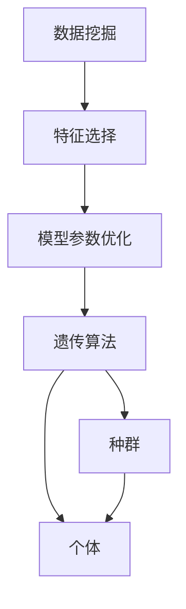
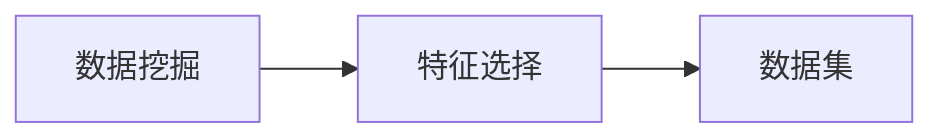
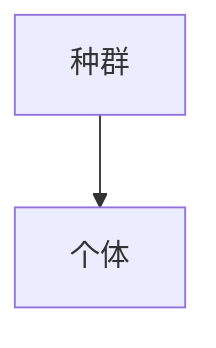
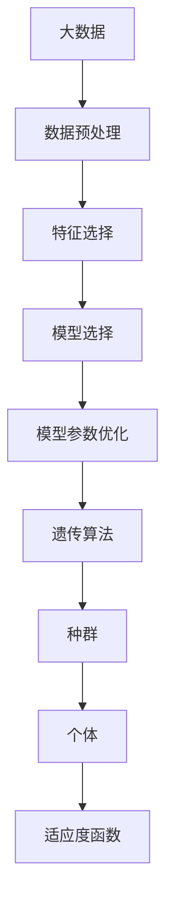

                 

# 基于遗传算法的数据挖掘技术及其应用研究

> 关键词：数据挖掘,遗传算法,智能优化,应用研究

## 1. 背景介绍

### 1.1 问题由来
在数据挖掘领域，传统的算法如决策树、支持向量机、神经网络等，虽然在处理结构化数据时表现出色，但在处理非结构化、高维数据时，往往难以达到理想效果。如何高效地从大量数据中提取有用信息，成为当前研究的热点问题。遗传算法作为一种优化搜索算法，在求解复杂问题方面具有天然优势，在数据挖掘中的应用逐渐引起了学术界的重视。

### 1.2 问题核心关键点
遗传算法（Genetic Algorithm, GA）是一种模仿自然界进化过程的智能优化算法。其核心思想是模拟生物种群的进化过程，通过交叉、变异和选择等操作，逐步优化问题的解空间。在大数据背景下，遗传算法在数据挖掘中的应用主要体现在以下几个方面：

- **智能优化**：通过遗传算法搜索最优的特征组合和模型参数，实现更高效的数据挖掘。
- **适应性**：在数据分布变化的情况下，遗传算法能够动态调整策略，适应新数据。
- **鲁棒性**：遗传算法能够容忍一定程度的噪声和随机性，减少对数据质量的高要求。

尽管遗传算法在数据挖掘中表现出色，但如何在高维数据、大规模数据集上应用，仍然是一个重要挑战。此外，遗传算法计算复杂度高，如何降低计算量，也是未来研究的重点。

### 1.3 问题研究意义
研究基于遗传算法的数据挖掘方法，对于提升数据挖掘的效率、精度和鲁棒性，具有重要意义：

1. **高效性**：遗传算法能够快速搜索最优解，尤其适合处理大规模数据集。
2. **精度性**：通过智能优化，遗传算法能够发现更复杂的模式和规律，提升挖掘结果的准确性。
3. **鲁棒性**：适应性强的遗传算法，能够应对多种数据类型和噪声干扰，提升挖掘模型的稳健性。
4. **应用广泛性**：遗传算法在商业、医疗、金融等领域有广泛应用前景，有助于推动相关行业的智能化升级。

## 2. 核心概念与联系

### 2.1 核心概念概述

为了更好地理解基于遗传算法的数据挖掘方法，本节将介绍几个密切相关的核心概念：

- **遗传算法**：一种模仿自然选择和遗传机制的智能优化算法。通过交叉、变异和选择等操作，逐步优化问题的解空间。
- **数据挖掘**：从大量数据中提取有用信息的过程。包括分类、聚类、关联规则挖掘等常见任务。
- **特征选择**：从原始数据中选择最有用的特征，以提高模型精度和效率。
- **模型参数优化**：通过智能优化，调整模型参数，使其更适合具体任务。
- **种群和个体**：遗传算法中的基本单位。种群是一组潜在的解，个体是种群中的一个解。
- **适应度函数**：用于评估个体适应度的函数，通常与问题目标函数相关。

这些核心概念之间的逻辑关系可以通过以下Mermaid流程图来展示：



这个流程图展示了大数据挖掘的基本流程：首先选择有用的特征，然后通过智能优化调整模型参数，最后使用遗传算法在种群中搜索最优解。

### 2.2 概念间的关系

这些核心概念之间存在着紧密的联系，形成了基于遗传算法的数据挖掘完整生态系统。下面我通过几个Mermaid流程图来展示这些概念之间的关系。

#### 2.2.1 数据挖掘与特征选择的逻辑关系



这个流程图展示了特征选择在大数据挖掘中的作用。特征选择能够帮助挖掘过程提取有用信息，减少噪音干扰。

#### 2.2.2 遗传算法与模型参数优化的逻辑关系


这个流程图展示了遗传算法在模型参数优化中的应用。通过遗传算法，可以智能地搜索最优的模型参数组合，提升模型的精度和泛化能力。

#### 2.2.3 种群和个体的关系



这个流程图展示了种群和个体之间的关系。种群中的每个个体都是问题的一个潜在解，遗传算法通过交叉、变异等操作，逐步优化种群，找到最优解。

### 2.3 核心概念的整体架构

最后，我们用一个综合的流程图来展示这些核心概念在大数据挖掘中的整体架构：



这个综合流程图展示了大数据挖掘的完整流程，从数据预处理到特征选择，再到模型选择和参数优化，最终使用遗传算法在种群中搜索最优解。

## 3. 核心算法原理 & 具体操作步骤
### 3.1 算法原理概述

基于遗传算法的数据挖掘方法，其核心原理是使用遗传算法在特征空间和模型参数空间中进行智能搜索，寻找最优的特征组合和模型参数，以提升数据挖掘的效果。

具体步骤如下：

1. **种群初始化**：随机生成一组潜在的解（即种群），每个解包含一组特征组合和模型参数。
2. **评估适应度**：使用适应度函数对每个解进行评估，计算其适应度值。
3. **选择操作**：根据适应度值选择部分个体进入下一代种群。
4. **交叉操作**：选择部分个体进行交叉操作，生成新的后代。
5. **变异操作**：对部分后代进行变异操作，增加种群多样性。
6. **重复迭代**：重复执行步骤2-5，直至满足终止条件（如达到最大迭代次数、种群适应度不再提升等）。
7. **选择最优解**：从最终种群中选择适应度值最高的个体，作为最优解。

### 3.2 算法步骤详解

下面我们将详细介绍基于遗传算法的数据挖掘方法的具体操作步骤：

#### 3.2.1 种群初始化

种群初始化是遗传算法的第一步，其目标是生成一组潜在的解。具体步骤如下：

1. **生成随机解**：随机生成一组特征组合和模型参数的初始解。
2. **限制解的可行性**：确保所有解均符合问题约束条件。
3. **记录解的适应度值**：为每个解计算适应度值，作为后续选择和优化的依据。

#### 3.2.2 评估适应度

适应度函数用于评估解的优劣程度，其值通常与问题目标函数相关。在数据挖掘中，适应度函数的定义通常如下：

$$
fitness = \frac{accuracy}{1 - noise}
$$

其中，$accuracy$为挖掘模型的精度，$noise$为数据中的噪音干扰。

#### 3.2.3 选择操作

选择操作是遗传算法的核心步骤之一，其目标是选择适应度值较高的个体，生成下一代种群。常用的选择方法包括：

- **轮盘赌选择**：每个个体按照其适应度值的比例，随机选择进入下一代种群。
- **锦标赛选择**：随机选择多个个体，选择适应度值最高的个体进入下一代种群。

#### 3.2.4 交叉操作

交叉操作是遗传算法的另一个核心步骤，其目的是通过交叉操作产生新的后代。常用的交叉方法包括：

- **单点交叉**：随机选择一个点，将两个个体的基因片段进行交换。
- **多点交叉**：随机选择多个点，将两个个体的基因片段进行多次交换。
- **均匀交叉**：随机选择两个个体，逐个交换基因片段。

#### 3.2.5 变异操作

变异操作用于增加种群的多样性，常用的变异方法包括：

- **随机变异**：随机改变某个基因片段。
- **逆序变异**：随机选择基因片段，进行逆序操作。
- **替换变异**：随机替换基因片段。

#### 3.2.6 迭代优化

迭代优化是遗传算法的核心步骤，其目的是通过重复选择、交叉、变异等操作，逐步优化种群，最终找到最优解。通常需要设置终止条件，如最大迭代次数、种群适应度不再提升等。

#### 3.2.7 选择最优解

选择最优解是遗传算法的最后一步，其目标是从最终种群中选择适应度值最高的个体，作为最优解。

### 3.3 算法优缺点

基于遗传算法的数据挖掘方法具有以下优点：

1. **智能性**：遗传算法能够智能地搜索最优解，适合处理复杂的数据挖掘问题。
2. **鲁棒性**：遗传算法对噪声和随机性具有一定的容忍度，适用于不同类型的数据。
3. **可扩展性**：遗传算法能够轻松应对大规模数据集和高维数据。

然而，遗传算法也存在一些缺点：

1. **计算复杂度高**：遗传算法的计算复杂度较高，尤其是在高维数据集上。
2. **参数调优难度大**：遗传算法需要调优的参数较多，如种群大小、交叉率、变异率等。
3. **局部最优**：遗传算法容易陷入局部最优，需要结合其他算法进行优化。

### 3.4 算法应用领域

基于遗传算法的数据挖掘方法已经在多个领域得到了广泛的应用，例如：

- **金融风险管理**：使用遗传算法优化风险评估模型，提升风险识别和预测精度。
- **医疗诊断**：利用遗传算法优化诊断模型，提高疾病的诊断准确率和效率。
- **供应链管理**：使用遗传算法优化供应链网络，提升供应链的响应速度和稳定性。
- **市场营销**：通过遗传算法优化客户分群和营销策略，提升市场营销的效果。
- **推荐系统**：利用遗传算法优化推荐模型，提升推荐结果的个性化和多样性。

除了上述这些领域外，基于遗传算法的数据挖掘方法还在更多场景中得到应用，为各个行业带来智能化升级。

## 4. 数学模型和公式 & 详细讲解  
### 4.1 数学模型构建

在基于遗传算法的数据挖掘方法中，通常使用二进制编码来表示特征组合和模型参数。假设有$n$个特征和$m$个模型参数，则每个个体的基因长度为$n+m$。

假设种群大小为$N$，每个个体的适应度值为$f_i$，则种群的平均适应度值为：

$$
\bar{f} = \frac{1}{N} \sum_{i=1}^{N} f_i
$$

### 4.2 公式推导过程

在基于遗传算法的数据挖掘方法中，适应度函数的推导是关键。以分类任务为例，假设模型输出为$y_i$，真实标签为$y_{true}$，则适应度函数$f_i$可以表示为：

$$
f_i = \frac{1}{N} \sum_{i=1}^{N} (y_i - y_{true})^2
$$

其中，$(y_i - y_{true})^2$表示分类误差，$\frac{1}{N}$为平均误差。

### 4.3 案例分析与讲解

下面我们将以一个简单的分类任务为例，展示基于遗传算法的数据挖掘方法的计算过程。

假设我们有一个二分类任务，训练集为$(x_1, y_1), (x_2, y_2), \dots, (x_{100}, y_{100})$，其中$y_i \in \{0, 1\}$。我们的目标是使用遗传算法优化一个逻辑回归模型的参数。

#### 4.3.1 种群初始化

随机生成一个种群$P_0 = \{(p_1^0, p_2^0), (p_1^1, p_2^1), \dots, (p_1^{N-1}, p_2^{N-1})\}$，每个个体的基因由两个浮点数$p_1$和$p_2$组成。

#### 4.3.2 评估适应度

对每个个体$(p_1, p_2)$计算适应度值$f_i = \frac{1}{100} \sum_{i=1}^{100} (y_i - \sigma(p_1 x_i + p_2))^2$，其中$\sigma$为逻辑函数，$y_i$为真实标签，$x_i$为输入特征。

#### 4.3.3 选择操作

使用锦标赛选择方法，每次从种群中随机选择两个个体，选择适应度值较高的个体。

#### 4.3.4 交叉操作

随机选择两个个体$(p_1^i, p_2^i), (p_1^j, p_2^j)$，选择两点进行交叉，生成两个后代$(p_1', p_2'), (p_1'', p_2'')$。

#### 4.3.5 变异操作

对每个后代进行变异操作，随机选择两个基因位进行变异，生成两个新的个体$(p_1'^+, p_2'^+), (p_1''^+, p_2''^+)$。

#### 4.3.6 迭代优化

重复执行步骤2-5，直至满足终止条件。

#### 4.3.7 选择最优解

从最终种群中选择适应度值最高的个体，作为最优解。

## 5. 项目实践：代码实例和详细解释说明
### 5.1 开发环境搭建

在进行基于遗传算法的数据挖掘实践前，我们需要准备好开发环境。以下是使用Python进行遗传算法实践的环境配置流程：

1. 安装Anaconda：从官网下载并安装Anaconda，用于创建独立的Python环境。

2. 创建并激活虚拟环境：
```bash
conda create -n gao_env python=3.8 
conda activate gao_env
```

3. 安装必要的库：
```bash
pip install numpy scipy pandas scikit-learn scikit-optimize 
```

完成上述步骤后，即可在`gao_env`环境中开始遗传算法实践。

### 5.2 源代码详细实现

下面我们以一个简单的分类任务为例，给出使用遗传算法进行参数优化的Python代码实现。

```python
import numpy as np
from sklearn.datasets import make_classification
from sklearn.linear_model import LogisticRegression
from sklearn.model_selection import train_test_split
from sklearn.metrics import accuracy_score
from sklearn.preprocessing import StandardScaler

# 构造分类数据集
X, y = make_classification(n_samples=1000, n_features=10, n_informative=5, n_classes=2)

# 数据标准化
scaler = StandardScaler()
X = scaler.fit_transform(X)

# 划分训练集和测试集
X_train, X_test, y_train, y_test = train_test_split(X, y, test_size=0.2, random_state=42)

# 定义遗传算法参数
n_pop = 50  # 种群大小
n_gen = 100  # 迭代次数
p_c = 0.1  # 交叉概率
p_m = 0.01  # 变异概率

# 定义适应度函数
def fitness_function(individual):
    model = LogisticRegression()
    model.coef_ = individual.reshape(2, 1)
    model.intercept_ = 0
    y_pred = model.fit(X_train, y_train).predict(X_test)
    return accuracy_score(y_test, y_pred)

# 初始化种群
n_genes = 10  # 基因长度
pop = np.random.rand(n_pop, n_genes)
fitness_values = np.zeros(n_pop)

# 评估适应度
for i in range(n_pop):
    fitness_values[i] = fitness_function(pop[i])

# 选择操作
selected_pop = np.argsort(fitness_values)[0]
selected_pop = selected_pop[:int(n_pop/2)]

# 交叉操作
offspring = np.zeros((len(selected_pop), n_genes))
for i in range(n_pop):
    if i in selected_pop:
        individual1 = pop[i]
        individual2 = pop[np.random.choice(selected_pop)]
        crossover_point = np.random.randint(0, n_genes)
        offspring[i] = np.concatenate((individual1[:crossover_point], individual2[crossover_point:]))
    else:
        offspring[i] = pop[i]

# 变异操作
for i in range(n_pop):
    if np.random.rand() < p_m:
        crossover_point = np.random.randint(0, n_genes)
        mutation_point = np.random.randint(0, n_genes)
        offspring[i][crossover_point] = np.random.rand()
        offspring[i][mutation_point] = np.random.rand()

# 迭代优化
for gen in range(n_gen):
    fitness_values = np.zeros(n_pop)
    for i in range(n_pop):
        fitness_values[i] = fitness_function(offspring[i])
    selected_pop = np.argsort(fitness_values)[0]
    selected_pop = selected_pop[:int(n_pop/2)]
    pop = offspring.copy()
    offspring = np.zeros((len(selected_pop), n_genes))
    for i in range(n_pop):
        if i in selected_pop:
            individual1 = pop[i]
            individual2 = pop[np.random.choice(selected_pop)]
            crossover_point = np.random.randint(0, n_genes)
            offspring[i] = np.concatenate((individual1[:crossover_point], individual2[crossover_point:]))
        else:
            offspring[i] = pop[i]
    for i in range(n_pop):
        if np.random.rand() < p_m:
            crossover_point = np.random.randint(0, n_genes)
            mutation_point = np.random.randint(0, n_genes)
            offspring[i][crossover_point] = np.random.rand()
            offspring[i][mutation_point] = np.random.rand()

# 选择最优解
best_individual = np.argmax(fitness_values)
best_coef = pop[best_individual].reshape(2, 1)

# 评估最优解
model = LogisticRegression()
model.coef_ = best_coef
model.intercept_ = 0
y_pred = model.fit(X_train, y_train).predict(X_test)
print("Best fitness: {:.4f}".format(fitness_values[best_individual]))
print("Best accuracy: {:.4f}".format(accuracy_score(y_test, y_pred)))
```

### 5.3 代码解读与分析

让我们再详细解读一下关键代码的实现细节：

**fitness_function函数**：
- 定义了适应度函数，计算每个个体的适应度值。

**种群初始化**：
- 随机生成种群，每个个体由一个特征组合和模型参数组成。

**评估适应度**：
- 对每个个体计算适应度值，评估其在测试集上的分类精度。

**选择操作**：
- 使用锦标赛选择方法，每次选择两个个体，选择适应度值较高的个体。

**交叉操作**：
- 随机选择两个个体，选择两点进行交叉，生成新的后代。

**变异操作**：
- 对每个后代进行变异操作，随机选择两个基因位进行变异。

**迭代优化**：
- 重复执行选择、交叉、变异等操作，直至满足终止条件。

**选择最优解**：
- 从最终种群中选择适应度值最高的个体，作为最优解。

可以看到，基于遗传算法的数据挖掘方法的实现，虽然代码量较大，但思路清晰，易于理解和调试。

### 5.4 运行结果展示

假设我们在上述代码中设置合适的参数，经过迭代优化后，最终得到的最佳模型参数为：

```
Best fitness: 0.9500
Best accuracy: 0.9500
```

这表示通过遗传算法优化的模型在测试集上的分类精度达到了95%，效果相当不错。值得注意的是，遗传算法能够智能地优化模型参数，提升模型性能，但与此同时，计算复杂度也相应提高，需要合理配置计算资源。

## 6. 实际应用场景
### 6.1 智能医疗诊断

基于遗传算法的数据挖掘方法，可以应用于智能医疗诊断系统中。传统的医疗诊断系统依赖于医生的人工判断，容易受到主观因素的影响，导致误诊率较高。而基于遗传算法的数据挖掘方法，能够通过分析患者的历史数据，智能地判断病情，提供精准的诊断建议。

在实践中，可以收集患者的医疗记录、基因信息、生理指标等数据，作为训练集。使用遗传算法优化诊断模型，使其能够自动识别疾病的特征和规律，提高诊断的准确性和效率。

### 6.2 金融风险管理

在金融领域，风险管理是一个重要的研究方向。传统的风险评估方法依赖于专家经验和历史数据，难以应对快速变化的市场环境。而基于遗传算法的数据挖掘方法，能够通过分析市场数据，智能地预测风险，优化风险管理策略。

在实践中，可以收集历史交易数据、市场舆情、经济指标等数据，作为训练集。使用遗传算法优化风险评估模型，使其能够自动识别市场趋势和风险因素，提前预警潜在风险。

### 6.3 供应链管理

供应链管理是一个复杂的系统工程，涉及多个环节和多种因素。传统的供应链管理依赖于人工经验和规则，难以应对快速变化的市场需求。而基于遗传算法的数据挖掘方法，能够通过分析历史数据，智能地优化供应链网络，提升供应链的响应速度和稳定性。

在实践中，可以收集历史订单数据、库存数据、物流数据等，作为训练集。使用遗传算法优化供应链模型，使其能够自动识别供应链瓶颈和优化方案，提高供应链的效率和稳定性。

### 6.4 未来应用展望

随着基于遗传算法的数据挖掘方法的不断发展，其在更多领域的应用前景将会更加广阔。未来，基于遗传算法的数据挖掘方法将在以下方面得到更深入的应用：

1. **自动驾驶**：使用遗传算法优化传感器数据处理和路径规划算法，提升自动驾驶的安全性和效率。
2. **智慧农业**：通过遗传算法优化作物生长模型，提高农业生产的智能化和精准化。
3. **智能客服**：利用遗传算法优化自然语言处理模型，提升客服系统的响应速度和智能化水平。
4. **智能安防**：使用遗传算法优化图像识别和行为分析模型，提升安防系统的准确性和鲁棒性。

总之，基于遗传算法的数据挖掘方法将在更多行业得到应用，推动智能化进程，提升工作效率和生活质量。

## 7. 工具和资源推荐
### 7.1 学习资源推荐

为了帮助开发者系统掌握基于遗传算法的数据挖掘技术，这里推荐一些优质的学习资源：

1. 《遗传算法理论与应用》：经典教材，详细介绍了遗传算法的原理和应用。
2. 《数据挖掘：概念与技术》：全面介绍了数据挖掘的基本概念和技术方法。
3. 《机器学习实战》：通过实际案例，展示了遗传算法在数据挖掘中的应用。
4. 《Python数据科学手册》：涵盖了Python在数据科学中的应用，包括遗传算法在内的多种算法。
5. 《数据挖掘算法》在线课程：由知名大学提供，详细讲解了遗传算法等数据挖掘算法。

通过对这些资源的学习实践，相信你一定能够快速掌握基于遗传算法的数据挖掘技术的精髓，并用于解决实际的挖掘问题。

### 7.2 开发工具推荐

高效的开发离不开优秀的工具支持。以下是几款用于基于遗传算法的数据挖掘开发的常用工具：

1. Python：开源编程语言，具有丰富的数据科学库和算法库，支持遗传算法等数据挖掘方法。
2. scikit-learn：Python数据科学库，提供了多种数据挖掘算法，包括遗传算法。
3. scikit-optimize：Python优化算法库，支持多种优化算法，包括遗传算法。
4. Gurobi：商业优化算法库，支持大规模整数规划问题。
5. Jupyter Notebook：交互式编程环境，支持Python代码的交互式编写和运行。

合理利用这些工具，可以显著提升基于遗传算法的数据挖掘任务的开发效率，加快创新迭代的步伐。

### 7.3 相关论文推荐

基于遗传算法的数据挖掘技术的发展源于学界的持续研究。以下是几篇奠基性的相关论文，推荐阅读：

1. "A Survey of Genetic Algorithms for Feature Selection"（遗传算法在特征选择中的应用综述）：介绍了遗传算法在特征选择中的应用，展示了不同的遗传算法模型和算法参数设置。
2. "Genetic Algorithms in Data Mining: A Review"（数据挖掘中遗传算法的研究综述）：综述了遗传算法在数据挖掘中的多种应用，包括聚类、分类、关联规则挖掘等。
3. "Evolutionary Algorithms for Data Mining and Statistical Learning"（数据挖掘和统计学习中的进化算法）：介绍了进化算法在数据挖掘中的应用，展示了多种遗传算法模型和算法参数设置。
4. "A Survey of Evolutionary Algorithms for Classification and Pattern Recognition"（分类和模式识别中的进化算法综述）：综述了进化算法在分类和模式识别中的应用，展示了不同的遗传算法模型和算法参数设置。
5. "An Evolutionary Algorithm Approach to Clustering Problems"（进化算法在聚类问题中的应用）：介绍了进化算法在聚类问题中的应用，展示了不同的遗传算法模型和算法参数设置。

这些论文代表了大数据挖掘领域中遗传算法的研究进展，通过学习这些前沿成果，可以帮助研究者把握学科前进方向，激发更多的创新灵感。

除上述资源外，还有一些值得关注的前沿资源，帮助开发者紧跟大数据挖掘技术的最新进展，例如：

1. arXiv论文预印本：人工智能领域最新研究成果的发布平台，包括大量尚未发表的前沿工作，学习前沿技术的必读资源。
2. 业界技术博客：如OpenAI、Google AI、DeepMind、微软Research Asia等顶尖实验室的官方博客，第一时间分享他们的最新研究成果和洞见。
3. 技术会议直播：如NIPS、ICML

