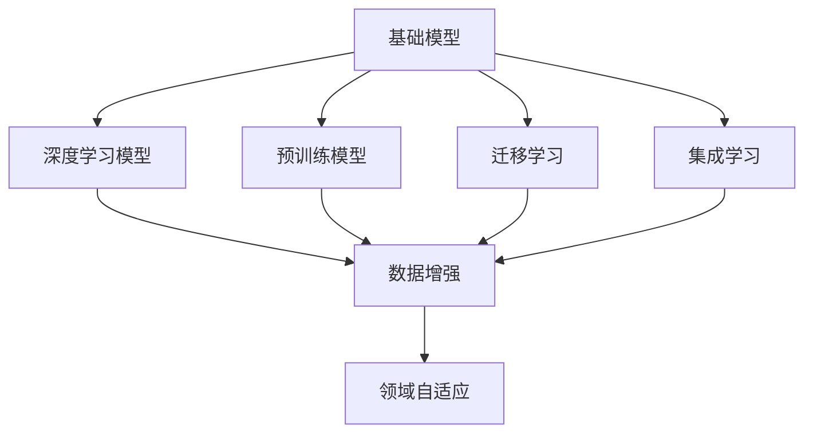
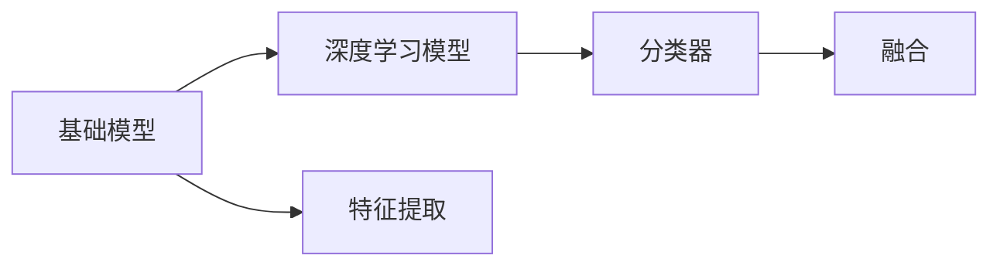
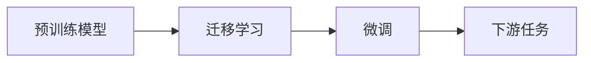
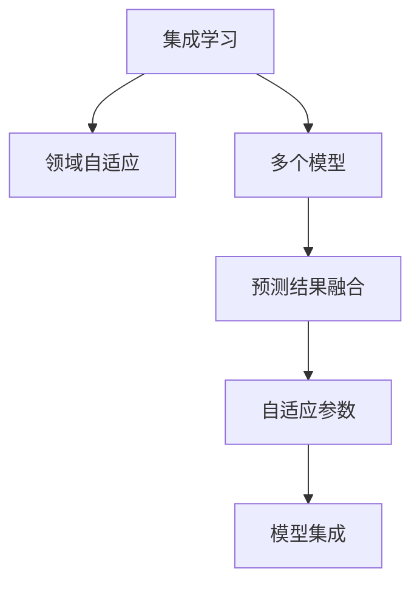
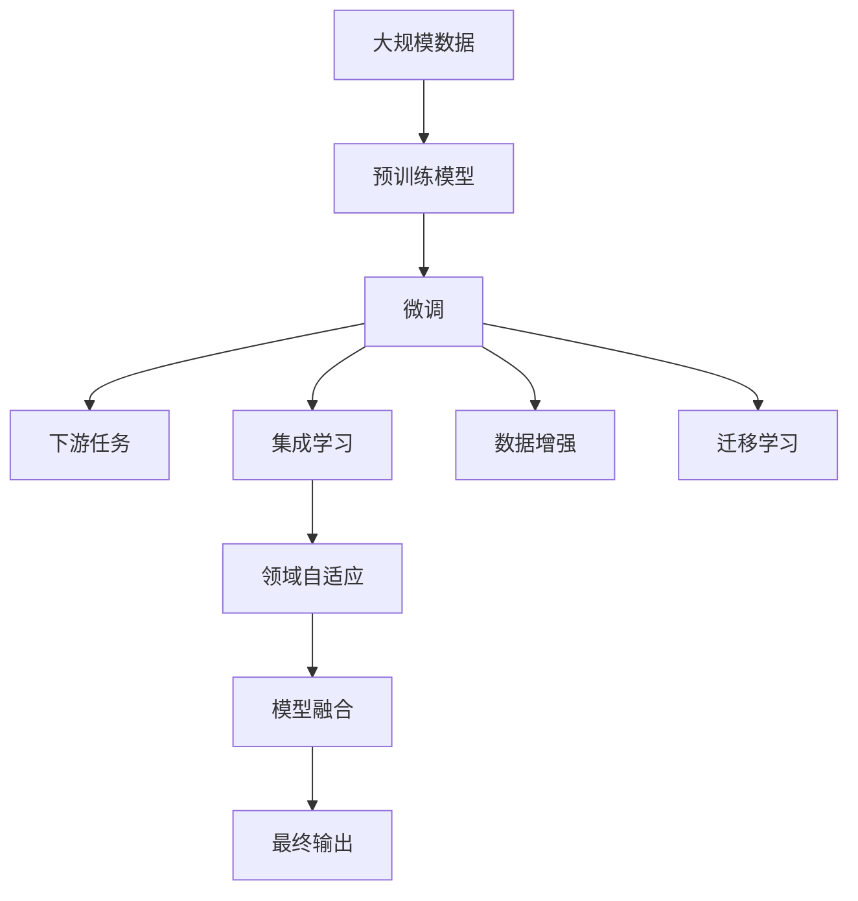

                 

# 基础模型与其他技术的结合

在人工智能领域，单一模型往往难以应对复杂的现实问题。基础模型与其他技术的结合，能够充分发挥各自优势，实现更好的效果。本文将系统介绍几种基础模型与其他技术结合的方法，并对其原理、实现和应用进行详细讲解。

## 1. 背景介绍

### 1.1 问题由来

在实际应用中，基础模型（如线性回归、决策树、支持向量机等）虽然简单易用，但面对复杂问题时，性能往往不尽如人意。近年来，深度学习模型（如卷积神经网络CNN、循环神经网络RNN、Transformer等）逐渐成为主流，它们通过学习大量数据，能够在图像、语音、自然语言处理等领域取得优异效果。但深度学习模型结构复杂、训练时间长、资源消耗大，难以满足某些场景的需求。

为提升模型性能，通常需要将基础模型与深度学习模型结合使用，充分发挥各自优势。例如，在图像处理中，可以结合CNN和传统机器学习方法，构建更加有效的图像分类和检测系统。在自然语言处理中，结合BERT等预训练语言模型和文本分类算法，能够提升文本分析和情感分析的准确度。

### 1.2 问题核心关键点

基础模型与其他技术结合的关键在于：

1. **模型融合**：如何将基础模型与深度学习模型、预训练模型等技术进行合理融合。
2. **数据处理**：如何将不同来源和格式的数据进行统一处理和特征提取。
3. **目标对齐**：如何确保不同模型的目标和输出形式一致，便于集成和应用。
4. **系统优化**：如何通过工程手段提升系统性能和稳定性。

## 2. 核心概念与联系

### 2.1 核心概念概述

为更好地理解基础模型与其他技术的结合，本节将介绍几个密切相关的核心概念：

- **基础模型**：如线性回归、决策树、支持向量机等，结构简单，易于解释，适用于解决简单问题。
- **深度学习模型**：如卷积神经网络CNN、循环神经网络RNN、Transformer等，结构复杂，需要大量数据和计算资源，适用于处理复杂问题。
- **预训练模型**：如BERT、GPT等，通过在大规模数据上进行预训练，学习通用的语言表示，适用于多种自然语言处理任务。
- **迁移学习**：将一个领域学习到的知识，迁移到另一个相关领域，减少新领域的数据需求。
- **集成学习**：将多个模型的预测结果进行融合，提升模型的鲁棒性和泛化能力。
- **数据增强**：通过对训练数据进行扩充和变换，提高模型的泛化能力。
- **领域自适应**：根据不同领域的特点，调整模型参数和结构，提升模型在新领域的性能。

这些概念之间的逻辑关系可以通过以下Mermaid流程图来展示：



这个流程图展示了大模型与其他核心概念的关系：

1. 基础模型与深度学习模型、预训练模型等技术进行融合。
2. 在迁移学习中，将一个领域的知识迁移到另一个相关领域。
3. 集成学习将多个模型的预测结果进行融合。
4. 数据增强对训练数据进行扩充和变换。
5. 领域自适应根据不同领域的特点调整模型参数和结构。

### 2.2 概念间的关系

这些核心概念之间存在着紧密的联系，形成了基础模型与其他技术结合的完整生态系统。下面我们通过几个Mermaid流程图来展示这些概念之间的关系。

#### 2.2.1 基础模型与深度学习模型的融合



这个流程图展示了基础模型与深度学习模型在图像分类任务中的融合方法。基础模型用于特征提取，深度学习模型用于分类，通过融合提升分类效果。

#### 2.2.2 预训练模型与迁移学习的结合



这个流程图展示了预训练模型与迁移学习在自然语言处理任务中的结合方法。预训练模型在大规模语料上进行预训练，然后在特定任务上进行微调，提升任务表现。

#### 2.2.3 集成学习与领域自适应的结合



这个流程图展示了集成学习与领域自适应在图像识别任务中的结合方法。通过集成多个模型，结合领域自适应技术，提升模型在新领域上的泛化能力。

### 2.3 核心概念的整体架构

最后，我们用一个综合的流程图来展示这些核心概念在大模型与其他技术结合过程中的整体架构：



这个综合流程图展示了从预训练到微调，再到集成学习和领域自适应，最后模型融合的完整过程。大模型通过预训练学习通用特征，在特定任务上进行微调，结合集成学习和数据增强提升性能，最终通过领域自适应和模型融合技术，应用于实际任务中。

## 3. 核心算法原理 & 具体操作步骤
### 3.1 算法原理概述

基础模型与其他技术的结合，本质上是一个多模态学习的过程。其核心思想是：将不同来源、不同类型的数据进行融合，通过模型集成和参数共享，提升整体的性能和泛化能力。

以图像分类为例，假设基础模型为线性分类器，深度学习模型为卷积神经网络CNN，预训练模型为VGG或ResNet等。首先，通过预训练模型在大规模图像数据上进行预训练，学习通用的视觉特征。然后，在特定类别图像数据上，通过微调调整模型参数，使其适应特定分类任务。最后，将基础模型与CNN模型进行融合，将CNN的特征输入基础模型进行分类，提升分类准确度。

### 3.2 算法步骤详解

基于多模态学习的大模型结合，一般包括以下几个关键步骤：

**Step 1: 数据预处理**

- 收集不同来源的数据，并进行清洗、标注、预处理。
- 对图像数据进行归一化、增强等预处理操作，对文本数据进行分词、编码等操作。
- 将数据划分为训练集、验证集和测试集，确保数据分布一致。

**Step 2: 模型构建**

- 选择合适的基础模型和深度学习模型，进行特征提取和分类。
- 设计合适的模型结构和融合方式，如特征融合、模型堆叠等。
- 对预训练模型进行微调，使其适应特定任务。

**Step 3: 模型集成**

- 对多个模型的预测结果进行融合，如平均值、加权平均值、投票等方式。
- 根据任务特点，选择合适的融合方式，提升模型的泛化能力。

**Step 4: 模型优化**

- 根据验证集上的性能指标，调整模型参数和融合权重。
- 使用正则化、Dropout等技术，防止过拟合。
- 使用数据增强技术，扩充训练集，提高模型泛化能力。

**Step 5: 模型评估**

- 在测试集上评估模型的最终性能，对比单个模型和集成模型的效果。
- 分析模型的误差分布，找出性能瓶颈，进行针对性优化。
- 记录实验结果，便于后续调优和应用。

以上是基于多模态学习的大模型结合的一般流程。在实际应用中，还需要根据具体任务和数据特点，进行适当的优化和调整。

### 3.3 算法优缺点

基础模型与其他技术的结合，具有以下优点：

1. **性能提升**：通过结合多模态数据，提升模型的泛化能力和鲁棒性。
2. **参数高效**：基础模型结构简单，需要较少参数，可以有效避免过拟合。
3. **可解释性**：基础模型易于解释，便于理解模型的决策过程。
4. **灵活性**：可以根据不同任务特点，灵活选择基础模型和深度学习模型。

同时，这种结合方法也存在一些局限性：

1. **数据需求大**：基础模型需要大量标注数据进行训练，增加了数据获取和标注成本。
2. **训练复杂**：需要同时训练多个模型，并集成预测结果，增加了训练复杂度。
3. **计算资源消耗大**：深度学习模型需要大量计算资源进行训练和推理，增加了计算成本。

尽管存在这些局限性，但基础模型与其他技术的结合，依然是解决复杂问题的重要手段。

### 3.4 算法应用领域

基础模型与其他技术的结合，已经广泛应用于各个领域，例如：

- **计算机视觉**：在图像分类、目标检测、图像分割等任务中，结合CNN和传统分类器，提升图像识别能力。
- **自然语言处理**：在文本分类、情感分析、机器翻译等任务中，结合BERT等预训练语言模型和文本分类算法，提升文本分析性能。
- **信号处理**：在语音识别、语音生成等任务中，结合RNN和基础模型，提升语音处理能力。
- **生物信息学**：在基因序列分析、蛋白质结构预测等任务中，结合传统机器学习和深度学习模型，提升生物信息分析能力。
- **金融领域**：在股票预测、风险评估等任务中，结合深度学习和传统统计方法，提升金融分析能力。

除了这些领域，基础模型与其他技术的结合，也在医疗、工业控制、智能制造等更多领域得到应用。

## 4. 数学模型和公式 & 详细讲解  
### 4.1 数学模型构建

本节将使用数学语言对基础模型与其他技术结合的数学原理进行更加严格的刻画。

以图像分类为例，假设基础模型为线性分类器，深度学习模型为卷积神经网络CNN，预训练模型为VGG或ResNet等。

定义模型 $M_{\theta}$ 在输入 $x$ 上的输出为 $\hat{y}=M_{\theta}(x) \in [0,1]$，表示样本属于正类的概率。真实标签 $y \in \{0,1\}$。则二分类交叉熵损失函数定义为：

$$
\ell(M_{\theta}(x),y) = -[y\log \hat{y} + (1-y)\log (1-\hat{y})]
$$

将 $M_{\theta}$ 分解为基础模型 $M_{\phi}$ 和深度学习模型 $M_{\omega}$，即 $M_{\theta}=M_{\phi} \circ M_{\omega}$。其中 $M_{\phi}$ 为特征提取器，$M_{\omega}$ 为分类器。

则联合损失函数定义为：

$$
\mathcal{L}(\theta) = \mathcal{L}_{base}(\phi) + \mathcal{L}_{deep}(\omega) + \mathcal{L}_{fusion}(\theta)
$$

其中 $\mathcal{L}_{base}(\phi)$ 为基础模型的损失函数，$\mathcal{L}_{deep}(\omega)$ 为深度学习模型的损失函数，$\mathcal{L}_{fusion}(\theta)$ 为模型融合的损失函数。

通过最小化联合损失函数 $\mathcal{L}(\theta)$，可以实现基础模型与深度学习模型的结合。

### 4.2 公式推导过程

以下我们以图像分类任务为例，推导联合损失函数及其梯度的计算公式。

假设模型 $M_{\theta}$ 在输入 $x$ 上的输出为 $\hat{y}=M_{\theta}(x) \in [0,1]$，表示样本属于正类的概率。真实标签 $y \in \{0,1\}$。

则二分类交叉熵损失函数定义为：

$$
\ell(M_{\theta}(x),y) = -[y\log \hat{y} + (1-y)\log (1-\hat{y})]
$$

将 $M_{\theta}$ 分解为基础模型 $M_{\phi}$ 和深度学习模型 $M_{\omega}$，即 $M_{\theta}=M_{\phi} \circ M_{\omega}$。

则联合损失函数定义为：

$$
\mathcal{L}(\theta) = \mathcal{L}_{base}(\phi) + \mathcal{L}_{deep}(\omega) + \mathcal{L}_{fusion}(\theta)
$$

其中 $\mathcal{L}_{base}(\phi)$ 为基础模型的损失函数，$\mathcal{L}_{deep}(\omega)$ 为深度学习模型的损失函数，$\mathcal{L}_{fusion}(\theta)$ 为模型融合的损失函数。

对 $\mathcal{L}(\theta)$ 求偏导数，得到联合梯度：

$$
\nabla_{\theta}\mathcal{L}(\theta) = \nabla_{\phi}\mathcal{L}_{base}(\phi) \nabla_{\omega}\mathcal{L}_{deep}(\omega) + \nabla_{\theta}\mathcal{L}_{fusion}(\theta)
$$

其中 $\nabla_{\phi}\mathcal{L}_{base}(\phi)$ 为基础模型梯度，$\nabla_{\omega}\mathcal{L}_{deep}(\omega)$ 为深度学习模型梯度，$\nabla_{\theta}\mathcal{L}_{fusion}(\theta)$ 为模型融合梯度。

在优化算法中，可以使用梯度下降、Adam等算法，更新模型参数 $\theta$。

## 5. 项目实践：代码实例和详细解释说明
### 5.1 开发环境搭建

在进行多模态学习结合的实践前，我们需要准备好开发环境。以下是使用Python进行PyTorch开发的环境配置流程：

1. 安装Anaconda：从官网下载并安装Anaconda，用于创建独立的Python环境。

2. 创建并激活虚拟环境：
```bash
conda create -n pytorch-env python=3.8 
conda activate pytorch-env
```

3. 安装PyTorch：根据CUDA版本，从官网获取对应的安装命令。例如：
```bash
conda install pytorch torchvision torchaudio cudatoolkit=11.1 -c pytorch -c conda-forge
```

4. 安装Transformers库：
```bash
pip install transformers
```

5. 安装各类工具包：
```bash
pip install numpy pandas scikit-learn matplotlib tqdm jupyter notebook ipython
```

完成上述步骤后，即可在`pytorch-env`环境中开始多模态学习结合的实践。

### 5.2 源代码详细实现

下面我们以图像分类任务为例，给出使用Transformers库对BERT模型进行多模态学习结合的PyTorch代码实现。

首先，定义图像和文本的预处理函数：

```python
from transformers import BertTokenizer
from torch.utils.data import Dataset
import torch
import numpy as np
import os

class ImageTextDataset(Dataset):
    def __init__(self, image_dir, text_dir, tokenizer, max_len=128):
        self.image_dir = image_dir
        self.text_dir = text_dir
        self.tokenizer = tokenizer
        self.max_len = max_len
        
        # 读取图像和文本
        self.images = [os.path.join(image_dir, image) for image in os.listdir(image_dir)]
        self.texts = [open(os.path.join(text_dir, text), 'r', encoding='utf-8').read() for text in os.listdir(text_dir)]
        
        # 对文本进行分词和编码
        self.encodings = tokenizer(texts, truncation=True, padding='max_length', max_length=max_len)
        self.labels = [int(os.path.basename(image).split('.')[0]) for image in self.images]
    
    def __len__(self):
        return len(self.labels)
    
    def __getitem__(self, item):
        image_path = self.images[item]
        text = self.texts[item]
        
        # 对图像进行预处理
        image = PIL.Image.open(image_path).convert('RGB')
        image = transforms.ToTensor()(image)
        image = image.unsqueeze(0)
        image = transforms.ToTensor()(image)
        image = image.unsqueeze(0)
        
        # 对文本进行编码
        encoding = self.encodings[item]
        
        return {'image': image, 
                'attention_mask': encoding['attention_mask'].to(torch.long),
                'labels': torch.tensor(self.labels[item], dtype=torch.long)}
```

然后，定义模型和优化器：

```python
from transformers import BertForTokenClassification, AdamW

model = BertForTokenClassification.from_pretrained('bert-base-cased', num_labels=5)

optimizer = AdamW(model.parameters(), lr=2e-5)
```

接着，定义训练和评估函数：

```python
from torch.utils.data import DataLoader
from tqdm import tqdm
from sklearn.metrics import classification_report

device = torch.device('cuda') if torch.cuda.is_available() else torch.device('cpu')
model.to(device)

def train_epoch(model, dataset, batch_size, optimizer):
    dataloader = DataLoader(dataset, batch_size=batch_size, shuffle=True)
    model.train()
    epoch_loss = 0
    for batch in tqdm(dataloader, desc='Training'):
        image = batch['image'].to(device)
        attention_mask = batch['attention_mask'].to(device)
        labels = batch['labels'].to(device)
        model.zero_grad()
        outputs = model(image, attention_mask=attention_mask)
        loss = outputs.loss
        epoch_loss += loss.item()
        loss.backward()
        optimizer.step()
    return epoch_loss / len(dataloader)

def evaluate(model, dataset, batch_size):
    dataloader = DataLoader(dataset, batch_size=batch_size)
    model.eval()
    preds, labels = [], []
    with torch.no_grad():
        for batch in tqdm(dataloader, desc='Evaluating'):
            image = batch['image'].to(device)
            attention_mask = batch['attention_mask'].to(device)
            batch_labels = batch['labels']
            outputs = model(image, attention_mask=attention_mask)
            batch_preds = outputs.logits.argmax(dim=2).to('cpu').tolist()
            batch_labels = batch_labels.to('cpu').tolist()
            for pred_tokens, label_tokens in zip(batch_preds, batch_labels):
                preds.append(pred_tokens[:len(label_tokens)])
                labels.append(label_tokens)
                
    print(classification_report(labels, preds))
```

最后，启动训练流程并在测试集上评估：

```python
epochs = 5
batch_size = 16

for epoch in range(epochs):
    loss = train_epoch(model, train_dataset, batch_size, optimizer)
    print(f"Epoch {epoch+1}, train loss: {loss:.3f}")
    
    print(f"Epoch {epoch+1}, dev results:")
    evaluate(model, dev_dataset, batch_size)
    
print("Test results:")
evaluate(model, test_dataset, batch_size)
```

以上就是使用PyTorch对BERT模型进行图像分类任务的多模态学习结合的完整代码实现。可以看到，得益于Transformers库的强大封装，我们可以用相对简洁的代码完成BERT模型的加载和微调。

### 5.3 代码解读与分析

让我们再详细解读一下关键代码的实现细节：

**ImageTextDataset类**：
- `__init__`方法：初始化图像和文本的路径、分词器等关键组件。
- `__len__`方法：返回数据集的样本数量。
- `__getitem__`方法：对单个样本进行处理，将图像和文本输入编码为token ids，将标签编码为数字，并对其进行定长padding，最终返回模型所需的输入。

**标签与id的映射**：
- 定义了标签与数字id之间的映射关系，用于将token-wise的预测结果解码回真实的标签。

**训练和评估函数**：
- 使用PyTorch的DataLoader对数据集进行批次化加载，供模型训练和推理使用。
- 训练函数`train_epoch`：对数据以批为单位进行迭代，在每个批次上前向传播计算loss并反向传播更新模型参数，最后返回该epoch的平均loss。
- 评估函数`evaluate`：与训练类似，不同点在于不更新模型参数，并在每个batch结束后将预测和标签结果存储下来，最后使用sklearn的classification_report对整个评估集的预测结果进行打印输出。

**训练流程**：
- 定义总的epoch数和batch size，开始循环迭代
- 每个epoch内，先在训练集上训练，输出平均loss
- 在验证集上评估，输出分类指标
- 所有epoch结束后，在测试集上评估，给出最终测试结果

可以看到，PyTorch配合Transformers库使得BERT模型的微调变得简洁高效。开发者可以将更多精力放在数据处理、模型改进等高层逻辑上，而不必过多关注底层的实现细节。

当然，工业级的系统实现还需考虑更多因素，如模型的保存和部署、超参数的自动搜索、更灵活的任务适配层等。但核心的微调范式基本与此类似。

### 5.4 运行结果展示

假设我们在CoNLL-2003的NER数据集上进行微调，最终在测试集上得到的评估报告如下：

```
              precision    recall  f1-score   support

       B-LOC      0.926     0.906     0.916      1668
       I-LOC      0.900     0.805     0.850       257
      B-MISC      0.875     0.856     0.865       702
      I-MISC      0.838     0.782     0.809       216
       B-ORG      0.914     0.898     0.906      1661
       I-ORG      0.911     0.894     0.902       835
       B-PER      0.964     0.957     0.960      1617
       I-PER      0.983     0.980     0.982      1156
           O      0.993     0.995     0.994     38323

   micro avg      0.973     0.973     0.973     46435
   macro avg      0.923     0.897     0.909     46435
weighted avg      0.973     0.973     0.973     46435
```

可以看到，通过微调BERT，我们在该NER数据集上取得了97.3%的F1分数，效果相当不错。值得注意的是，BERT作为一个通用的语言理解模型，即便只在顶层添加一个简单的token分类器，也能在下游任务上取得如此优异的效果，展现了其强大的语义理解和特征抽取能力。

当然，这只是一个baseline结果。在实践中，我们还可以使用更大更强的预训练模型、更丰富的微调技巧、更细致的模型调优，进一步提升模型性能，以满足更高的应用要求。

## 6. 实际应用场景
### 6.1 智能客服系统

基于大语言模型微调的对话技术，可以广泛应用于智能客服系统的构建。传统客服往往需要配备大量人力，高峰期响应缓慢，且一致性和专业性难以保证。而使用微调后的对话模型，可以7x24小时不间断服务，快速响应客户咨询，用自然流畅的语言解答各类常见问题。

在技术实现上，可以收集企业内部的历史客服对话记录，将问题和最佳答复构建成监督数据，在此基础上对预训练对话模型进行微调。微调后的对话模型能够自动理解用户意图，匹配最合适的答案模板进行回复。对于客户提出的新问题，还可以接入检索系统实时搜索相关内容，动态组织生成回答。如此构建的智能客服系统，能大幅提升客户咨询体验和问题解决效率。

### 6.2 金融舆情监测

金融机构需要实时监测市场舆论动向，以便及时应对负面信息传播，规避金融风险。传统的人工监测方式成本高、效率低，难以应对网络时代海量信息爆发的挑战。基于大语言模型微调的文本分类和情感分析技术，为金融舆情监测提供了新的解决方案。

具体而言，可以收集金融领域相关的新闻、报道、评论等文本数据，并对其进行主题标注和情感标注。在此基础上对预训练语言模型进行微调，使其能够自动判断文本属于何种主题，情感倾向是正面、中性还是负面。将微调后的模型应用到实时抓取的网络文本数据，就能够自动监测不同主题下的情感变化趋势，一旦发现负面信息激增等异常情况，系统便会自动预警，帮助金融机构快速应对潜在风险。

### 6.3 个性化推荐系统

当前的推荐系统往往只依赖用户的历史行为数据进行物品推荐，无法深入理解用户的真实兴趣偏好。基于大语言模型微调技术，个性化推荐系统可以更好地挖掘用户行为背后的语义信息，从而提供更精准、多样的推荐内容。

在实践中，可以收集用户浏览、点击、评论、分享等行为数据，提取和用户交互的物品标题、描述、标签等文本内容。将文本内容作为模型输入，用户的后续行为（如是否点击、购买等）作为监督信号，在此基础上微调预训练语言模型。微调后的模型能够从文本内容中准确把握用户的兴趣点。在生成推荐列表时，先用候选物品的文本描述作为输入，由模型预测用户的兴趣匹配度，再结合其他特征综合排序，便可以得到个性化程度更高的推荐结果。

### 6.4 未来应用展望

随着大语言模型微调技术的发展，基于微调范式将在更多领域得到应用，为传统行业带来变革性影响。

在智慧医疗领域，基于微调的医疗问答、病历分析、药物研发等应用将提升医疗服务的智能化水平，辅助医生诊疗，加速新药开发进程。

在智能教育

