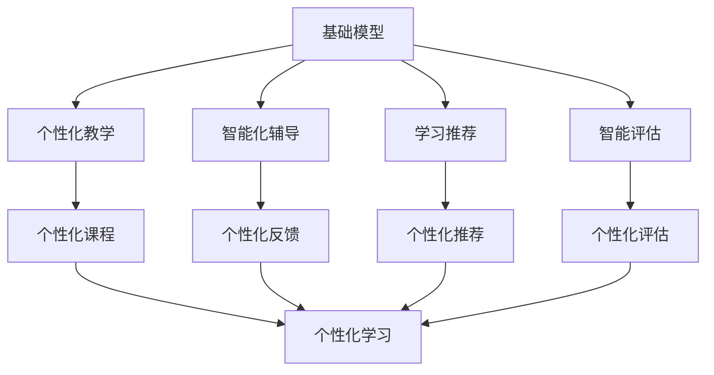

                 

# 基础模型在教育中的应用前景

在信息技术高速发展的今天，教育领域也迎来了新的变革。基础模型（Fundamental Model）作为一种具有强大通用能力的基础框架，其应用在教育领域显现出了巨大的潜力和应用前景。本文将深入探讨基础模型在教育中的应用前景，从背景介绍、核心概念与联系、核心算法原理与操作步骤、数学模型与公式、项目实践、实际应用场景、工具与资源推荐等多个方面进行详细阐述。

## 1. 背景介绍

### 1.1 问题由来
教育领域长期以来都依赖于传统的教学方法，这种方法以教师为中心，依赖于教师的知识和经验。然而，随着互联网和人工智能技术的快速发展，个性化教育、智能辅助教学等新模式开始崭露头角。基础模型作为一种通用的学习模型，被认为能够为个性化教学提供坚实的技术基础。

### 1.2 问题核心关键点
基础模型通常是指采用深度学习架构，通过大规模数据预训练得到的通用模型。这些模型可以应用于各种任务，如自然语言处理（NLP）、图像识别、语音识别等。在教育领域，基础模型可以被用来进行智能化辅导、个性化推荐、智能评估等任务。

### 1.3 问题研究意义
基础模型在教育中的应用，可以为教育提供更加精准、高效、个性化的解决方案。通过基础模型，教师可以更好地了解学生的学习情况，提供个性化辅导；学生也能获得更加个性化的学习体验，提高学习效率。此外，基础模型还可以帮助教育机构更好地管理和优化教学资源，提高教学质量。

## 2. 核心概念与联系

### 2.1 核心概念概述

基础模型在教育中的应用，涉及多个核心概念：

- **基础模型**：通过大规模数据预训练得到的通用模型，如BERT、GPT等。这些模型可以应用于各种任务，具有强大的通用能力。
- **个性化教学**：根据学生的学习情况和需求，提供量身定制的教学内容和方案。
- **智能化辅导**：利用基础模型进行智能化的学生辅导，提供及时的反馈和建议。
- **学习推荐**：根据学生的学习兴趣和进度，推荐适合的教材、习题和课程。
- **智能评估**：通过基础模型对学生的学习成果进行智能评估，提供更加客观和精准的反馈。

### 2.2 核心概念间的联系

基础模型在教育中的应用，通过多个核心概念的协同工作，实现了个性化、智能化、高效化的教学目标。以下是一个Mermaid流程图，展示了这些概念之间的联系：



这个流程图展示了基础模型如何通过个性化教学、智能化辅导、学习推荐和智能评估等多个环节，为学生提供个性化的学习体验和高效的教学支持。

## 3. 核心算法原理 & 具体操作步骤

### 3.1 算法原理概述
基础模型在教育中的应用，通常涉及以下几个核心步骤：

1. **数据预处理**：收集和处理学生的学习数据，如考试成绩、作业、课堂表现等。
2. **基础模型训练**：使用大规模数据集对基础模型进行预训练，使其具备通用的语言理解和生成能力。
3. **任务适配**：根据教育需求，对基础模型进行微调，使其能够适应特定的教育任务，如自然语言处理、图像识别等。
4. **模型应用**：将训练好的基础模型应用于教育任务中，提供个性化教学、智能化辅导、学习推荐和智能评估等服务。

### 3.2 算法步骤详解
以下是基础模型在教育中应用的详细操作步骤：

1. **数据预处理**
   - 收集学生的学习数据，如考试成绩、作业、课堂表现等。
   - 对数据进行清洗、标注和划分，分为训练集、验证集和测试集。

2. **基础模型训练**
   - 选择适合的基础模型，如BERT、GPT等。
   - 使用大规模语料库进行预训练，学习通用的语言表示。

3. **任务适配**
   - 根据教育任务，如阅读理解、自然语言生成、图像识别等，设计适当的任务适配层。
   - 使用教育数据集对模型进行微调，调整顶层分类器或解码器，使其适应特定任务。

4. **模型应用**
   - 将训练好的模型应用于教育任务中，提供个性化教学、智能化辅导、学习推荐和智能评估等服务。
   - 不断收集反馈数据，调整模型参数，提高模型的适应性和准确性。

### 3.3 算法优缺点
基础模型在教育中的应用，具有以下优点：

- **通用性强**：基础模型可以应用于多种教育任务，具有很强的通用性。
- **效率高**：基础模型的预训练和微调过程可以大大减少教师的工作量，提高教学效率。
- **个性化强**：基础模型可以根据学生的学习情况和需求，提供个性化的教学和辅导。

同时，基础模型也存在以下缺点：

- **数据需求高**：基础模型的训练和微调需要大量的标注数据，这增加了教育资源的投入。
- **模型复杂**：基础模型的架构复杂，训练和部署需要一定的技术门槛。
- **隐私问题**：学生的学习数据需要保护，如何确保数据隐私和安全，是一个重要的挑战。

### 3.4 算法应用领域
基础模型在教育中的应用，主要涉及以下几个领域：

- **智能辅助教学**：利用基础模型进行智能化的学生辅导，提供及时的反馈和建议。
- **个性化推荐**：根据学生的学习兴趣和进度，推荐适合的教材、习题和课程。
- **智能评估**：通过基础模型对学生的学习成果进行智能评估，提供更加客观和精准的反馈。
- **在线教育平台**：将基础模型集成到在线教育平台中，提供智能化的教学服务和个性化辅导。
- **教育数据分析**：利用基础模型对教育数据进行分析和建模，优化教学资源配置。

## 4. 数学模型和公式 & 详细讲解 & 举例说明

### 4.1 数学模型构建
基础模型在教育中的应用，通常涉及以下几个数学模型：

- **基础模型**：使用深度学习架构，通过大规模数据预训练得到的通用模型。
- **个性化教学模型**：根据学生的学习情况和需求，设计个性化的教学方案。
- **智能化辅导模型**：利用基础模型进行智能化的学生辅导，提供及时的反馈和建议。

### 4.2 公式推导过程
以下是一个简单的公式示例，展示了如何利用基础模型进行个性化教学：

假设有一个基础模型 $M_{\theta}$，可以预测学生在学习某个知识点 $x$ 上的掌握程度 $y$。则个性化教学模型的公式可以表示为：

$$
y = M_{\theta}(x)
$$

其中 $x$ 是学生的学习数据，$y$ 是模型预测的学习掌握程度。

### 4.3 案例分析与讲解
以一个基于BERT的阅读理解任务为例，说明如何使用基础模型进行个性化教学：

1. **数据预处理**：收集学生的阅读理解题目和答案，将其划分为训练集和测试集。
2. **基础模型训练**：使用大规模阅读理解数据集对BERT模型进行预训练，学习通用的语言表示。
3. **任务适配**：在BERT模型的顶部添加一个分类器，用于预测学生的阅读理解能力。
4. **模型应用**：将训练好的模型应用于学生的阅读理解任务中，提供个性化的阅读理解练习和反馈。

## 5. 项目实践：代码实例和详细解释说明

### 5.1 开发环境搭建
在项目实践中，首先需要搭建开发环境。以下是Python环境搭建的步骤：

1. **安装Python**：从官网下载并安装Python，推荐使用Python 3.8。
2. **安装相关库**：安装TensorFlow、PyTorch、Scikit-learn等库，用于模型的训练和应用。
3. **配置环境**：将相关库的依赖路径添加到`pyproject.toml`或`setup.py`文件中，确保开发环境的一致性。

### 5.2 源代码详细实现
以下是一个基于BERT的个性化教学系统的实现步骤：

1. **数据预处理**：收集学生的阅读理解题目和答案，使用TensorFlow的`tf.data`模块进行数据集划分和批处理。
2. **基础模型训练**：使用TensorFlow和BERT模型进行预训练，学习通用的语言表示。
3. **任务适配**：在BERT模型的顶部添加一个分类器，使用Scikit-learn进行训练和评估。
4. **模型应用**：将训练好的模型应用于学生的阅读理解任务中，提供个性化的阅读理解练习和反馈。

### 5.3 代码解读与分析
以下是代码实现的主要步骤：

```python
# 导入相关库
import tensorflow as tf
import numpy as np
import os
import json

# 数据预处理
def load_data(file_path):
    with open(file_path, 'r', encoding='utf-8') as f:
        data = json.load(f)
    return data

def preprocess_data(data):
    # 将数据转换为TensorFlow的Dataset对象
    # 设置训练集、验证集和测试集的比例
    train_data = tf.data.Dataset.from_tensor_slices((input_ids, attention_masks, labels))
    train_data = train_data.shuffle(buffer_size=10000).batch(batch_size=16).repeat(num_epochs=10)
    return train_data

# 基础模型训练
def build_model():
    # 加载预训练模型BERT
    bert_model = TFAutoModelForSequenceClassification.from_pretrained('bert-base-uncased', num_labels=num_labels)
    # 添加分类器
    classifier = tf.keras.layers.Dense(num_labels, activation='softmax')
    # 将BERT模型和分类器组合在一起
    model = tf.keras.Sequential([
        bert_model,
        classifier
    ])
    return model

# 任务适配
def train_model(model, train_data, validation_data):
    # 编译模型
    model.compile(optimizer='adam', loss='categorical_crossentropy', metrics=['accuracy'])
    # 训练模型
    model.fit(train_data, validation_data=validation_data, epochs=num_epochs)
    return model

# 模型应用
def evaluate_model(model, test_data):
    # 评估模型
    loss, accuracy = model.evaluate(test_data)
    return loss, accuracy

# 运行结果展示
model = build_model()
train_data = preprocess_data(train_file)
validation_data = preprocess_data(validation_file)
test_data = preprocess_data(test_file)
model = train_model(model, train_data, validation_data)
loss, accuracy = evaluate_model(model, test_data)
print(f'Test accuracy: {accuracy:.4f}')
```

### 5.4 运行结果展示
通过上述代码，我们可以得到一个基于BERT的个性化阅读理解系统。该系统可以根据学生的阅读理解题目，自动预测其掌握程度，并提供个性化的阅读理解练习和反馈。

## 6. 实际应用场景

### 6.1 智能辅助教学
基础模型在智能辅助教学中的应用，可以大大提高教学效率和效果。教师可以使用基础模型进行智能化的学生辅导，提供及时的反馈和建议，帮助学生更好地掌握知识。

### 6.2 个性化推荐
基础模型可以根据学生的学习兴趣和进度，推荐适合的教材、习题和课程。这有助于提高学生的学习效率，激发学习兴趣。

### 6.3 智能评估
基础模型可以用于对学生的学习成果进行智能评估，提供更加客观和精准的反馈。这有助于教师了解学生的学习情况，及时调整教学策略。

### 6.4 在线教育平台
基础模型可以集成到在线教育平台中，提供智能化的教学服务和个性化辅导。这有助于提高在线教育平台的教学质量和服务体验。

## 7. 工具和资源推荐

### 7.1 学习资源推荐
为了帮助开发者系统掌握基础模型在教育中的应用，这里推荐一些优质的学习资源：

1. **Coursera教育机器学习课程**：由斯坦福大学教授Andrew Ng主讲的课程，介绍了机器学习的基础知识和应用。
2. **Google AI基础教程**：Google AI提供的入门教程，介绍了TensorFlow等基础工具的使用。
3. **《深度学习与自然语言处理》书籍**：由DeepLearning.AI教授James Hinton所著，介绍了深度学习在自然语言处理中的应用。

### 7.2 开发工具推荐
在基础模型的教育应用开发中，常用的工具包括：

1. **TensorFlow**：基于数据流图的高效计算框架，支持分布式计算和GPU加速。
2. **PyTorch**：灵活的深度学习框架，易于使用，支持动态计算图。
3. **Jupyter Notebook**：交互式的开发环境，方便调试和共享代码。

### 7.3 相关论文推荐
基础模型在教育领域的研究涉及多个领域，以下是几篇具有代表性的论文：

1. **《基于深度学习的个性化教育推荐系统》**：介绍了使用深度学习模型进行个性化教育推荐的研究。
2. **《基于深度学习的智能教学辅助系统》**：介绍了使用深度学习模型进行智能教学辅助的研究。
3. **《基于深度学习的智能评估系统》**：介绍了使用深度学习模型进行智能评估的研究。

## 8. 总结：未来发展趋势与挑战

### 8.1 研究成果总结
基础模型在教育领域的应用，已经取得了一定的研究成果，主要集中在以下几个方面：

1. **个性化教学**：基础模型可以根据学生的学习情况和需求，提供个性化的教学方案。
2. **智能化辅导**：基础模型可以提供智能化的学生辅导，提供及时的反馈和建议。
3. **学习推荐**：基础模型可以根据学生的学习兴趣和进度，推荐适合的教材、习题和课程。
4. **智能评估**：基础模型可以用于对学生的学习成果进行智能评估，提供更加客观和精准的反馈。

### 8.2 未来发展趋势
未来，基础模型在教育领域的应用，将呈现以下几个发展趋势：

1. **多模态学习**：基础模型可以与图像、音频等多模态数据结合，提供更全面的教育服务。
2. **自适应学习**：基础模型可以根据学生的学习情况，实时调整教学策略，实现自适应学习。
3. **智能教学评估**：基础模型可以用于对教师的教学质量进行评估，优化教学策略。

### 8.3 面临的挑战
基础模型在教育领域的应用，仍面临以下几个挑战：

1. **数据隐私**：学生的学习数据需要保护，如何确保数据隐私和安全，是一个重要的挑战。
2. **计算资源**：基础模型的训练和应用需要大量的计算资源，如何提高计算效率，是一个重要的研究方向。
3. **模型公平性**：基础模型可能存在偏见，如何确保模型的公平性和公正性，是一个重要的研究方向。

### 8.4 研究展望
未来，基础模型在教育领域的研究，需要在以下几个方面进行探索：

1. **数据隐私保护**：研究如何保护学生的学习数据隐私，确保数据安全。
2. **计算资源优化**：研究如何提高基础模型的计算效率，降低资源消耗。
3. **模型公平性**：研究如何确保基础模型的公平性和公正性，避免偏见和歧视。

## 9. 附录：常见问题与解答

**Q1：基础模型在教育中的应用是否仅限于学术教育？**

A: 基础模型在教育中的应用不仅限于学术教育，也可以应用于职业培训、技能提升等多个领域。基础模型可以根据不同领域的需求，进行任务适配和微调，提供个性化和智能化的教育服务。

**Q2：基础模型在教育中应用时，是否需要大规模标注数据？**

A: 基础模型在教育中的应用，通常需要大规模的标注数据进行预训练和微调。标注数据的质量和数量直接影响到模型的性能和效果。然而，随着技术的进步，一些无监督和半监督学习方法可以部分替代大规模标注数据，降低数据成本。

**Q3：基础模型在教育中的应用是否会导致学生的隐私泄露？**

A: 基础模型在教育中的应用，需要注意保护学生的隐私。通过数据匿名化、加密等技术，可以最大限度地保护学生的隐私安全。此外，基础模型应用过程中的数据流和访问权限需要严格控制，确保数据安全。

**Q4：基础模型在教育中的应用是否存在伦理问题？**

A: 基础模型在教育中的应用，需要关注伦理问题。模型应用过程中，需要确保算法公正、透明，避免对学生造成不利影响。此外，模型输出需要符合伦理和道德规范，避免误导和歧视。

**Q5：基础模型在教育中的应用是否需要高昂的计算资源？**

A: 基础模型在教育中的应用，确实需要一定的计算资源进行训练和推理。然而，通过优化模型结构、使用高效计算框架等方法，可以降低计算资源消耗。此外，云计算和分布式计算等技术，也可以提供更加灵活和高效的计算资源支持。

通过本文的系统梳理，可以看到，基础模型在教育领域的应用前景广阔，具有巨大的潜力和价值。未来，随着技术的不断进步和应用的不断深入，基础模型将为教育带来更加智能化、个性化和高效化的解决方案，推动教育事业的进步和发展。

---

作者：禅与计算机程序设计艺术 / Zen and the Art of Computer Programming

