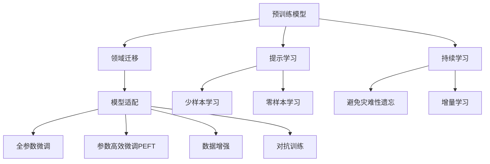
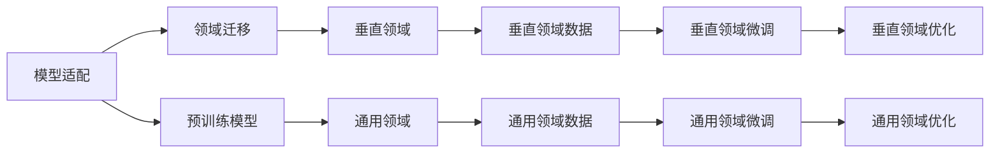
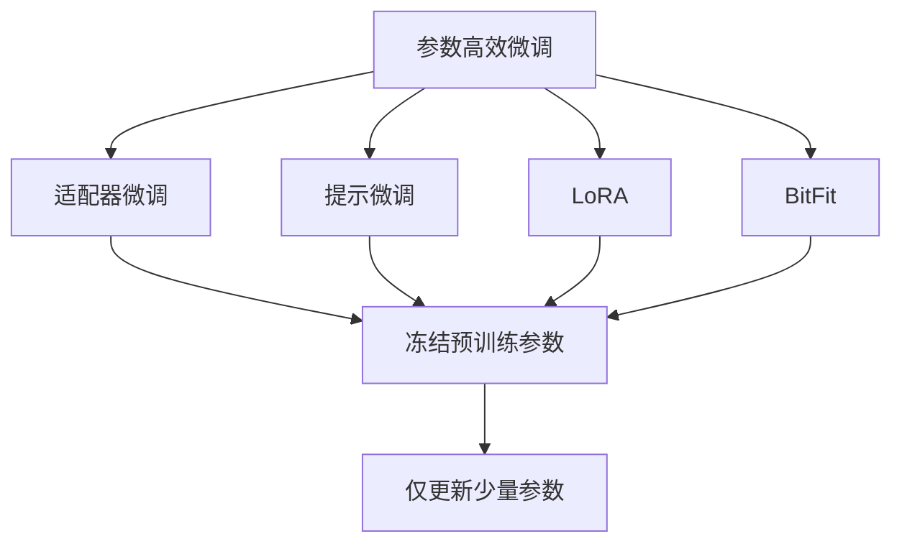
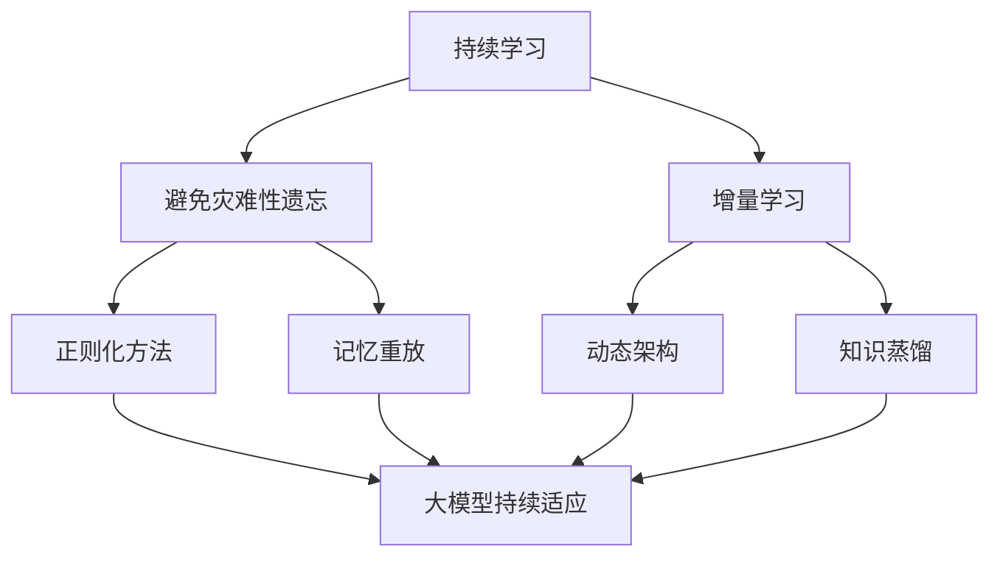
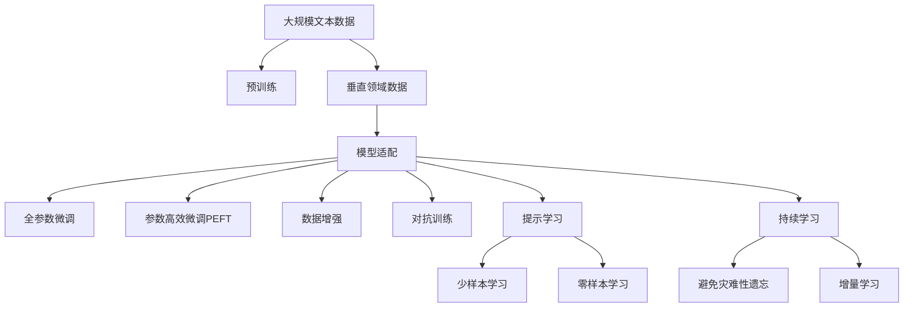

                 

# 基础模型的垂直领域应用

> 关键词：基础模型,垂直领域,领域迁移,模型适配,个性化推荐,医疗影像,金融风险

## 1. 背景介绍

### 1.1 问题由来
随着深度学习技术的快速发展，特别是预训练大语言模型(如BERT、GPT-2、RoBERTa等)的横空出世，大模型已经成为许多领域的重要工具。然而，不同领域的数据和任务性质差异巨大，通用的预训练模型往往无法直接应用于特定领域，导致性能提升有限。例如，自然语言处理(NLP)中的文本分类、命名实体识别、机器翻译等任务，计算机视觉中的图像分类、目标检测、图像生成等任务，都存在大量垂直领域的应用场景，需要针对性的模型适配。

为了解决这一问题，垂直领域的模型适配技术应运而生。该技术通过在特定领域的少量数据上进行微调，使模型能够在垂直领域取得理想效果。这种方法不仅降低了数据获取和标注的成本，还能显著提升模型的适应性和性能。本文将系统介绍基于基础模型的垂直领域应用，包括模型适配方法、算法原理、具体应用案例等，旨在为读者提供全面的技术指导。

### 1.2 问题核心关键点
垂直领域的模型适配，旨在将通用的预训练模型适应到特定领域，从而获得更好的性能。其核心在于以下几个关键点：

- 领域迁移：将预训练模型在通用领域的知识迁移到垂直领域。
- 模型适配：在特定领域的数据上微调模型，使其能够匹配领域特性。
- 数据与标注：收集领域内的高质量数据和少量标注样本，为模型适配提供依据。
- 模型压缩与优化：在适配过程中进行模型压缩，提高模型推理速度和资源利用率。
- 可解释性与鲁棒性：确保模型输出的可解释性，避免有害输出，增强模型鲁棒性。

本文将重点介绍这些关键点的具体实现方法，并结合实际案例进行分析。

### 1.3 问题研究意义
垂直领域的模型适配技术，对于拓展预训练模型的应用范围，提升下游任务的性能，加速技术产业化进程，具有重要意义：

1. 降低应用开发成本。通过微调预训练模型，可以显著减少从头开发所需的数据、计算和人力等成本投入。
2. 提升模型效果。垂直领域微调通常能够显著提升模型在特定任务上的表现，满足特定需求。
3. 加速开发进度。在已有预训练模型的基础上，快速进行任务适配，缩短开发周期。
4. 带来技术创新。垂直领域微调促使研究者深入探索模型适配的方法和理论，催生新的研究方向。
5. 赋能产业升级。垂直领域微调使得NLP技术更容易被各行各业所采用，推动产业数字化转型升级。

## 2. 核心概念与联系

### 2.1 核心概念概述

为更好地理解垂直领域的应用，本节将介绍几个密切相关的核心概念：

- 预训练模型(Pre-trained Models)：以自回归(如GPT)或自编码(如BERT)模型为代表的在大规模无标签文本语料上进行预训练的语言模型。通过预训练，模型学习到了丰富的语言知识和常识。

- 垂直领域(Vertical Domains)：指具体应用领域，如金融、医疗、教育等。每个领域有其特定的任务和数据分布。

- 领域迁移(Domain Adaptation)：指将通用领域的知识迁移到垂直领域，以提升垂直领域模型性能的过程。

- 模型适配(Model Adaptation)：指在垂直领域的数据上对预训练模型进行微调，使模型能够适应特定任务的过程。

- 数据增强(Data Augmentation)：指通过数据生成、改写等手段，增加训练集多样性，提高模型泛化能力。

- 对抗训练(Adversarial Training)：指通过引入对抗样本，增强模型鲁棒性，防止模型过拟合。

- 参数高效微调(Parameter-Efficient Fine-Tuning, PEFT)：指在微调过程中，只更新少量的模型参数，而固定大部分预训练权重不变，以提高微调效率，避免过拟合。

- 提示学习(Prompt Learning)：通过在输入文本中添加提示模板(Prompt Template)，引导模型按期望方式输出，减少微调参数。

- 少样本学习(Few-shot Learning)：指在只有少量标注样本的情况下，模型能够快速适应新任务的学习方法。在大模型中，通常通过在输入中提供少量示例来实现，无需更新模型参数。

- 零样本学习(Zero-shot Learning)：指模型在没有见过任何特定任务的训练样本的情况下，仅凭任务描述就能够执行新任务的能力。大模型通过预训练获得的广泛知识，使其能够理解任务指令并生成相应输出。

- 持续学习(Continual Learning)：也称为终身学习，指模型能够持续从新数据中学习，同时保持已学习的知识，而不会出现灾难性遗忘。这对于保持模型时效性和适应性至关重要。

这些核心概念之间的逻辑关系可以通过以下Mermaid流程图来展示：



这个流程图展示了大模型微调的完整过程，以及各个概念之间的联系。

### 2.2 概念间的关系

这些核心概念之间存在着紧密的联系，形成了大模型微调的完整生态系统。下面我通过几个Mermaid流程图来展示这些概念之间的关系。

#### 2.2.1 模型适配与领域迁移的关系



这个流程图展示了模型适配和领域迁移的基本原理。模型适配通过在垂直领域的数据上微调预训练模型，使模型适应特定任务。领域迁移则将通用领域的知识迁移到垂直领域，以提高模型性能。

#### 2.2.2 参数高效微调方法



这个流程图展示了几种常见的参数高效微调方法，包括适配器微调、提示微调、LoRA和BitFit。这些方法的共同特点是冻结大部分预训练参数，只更新少量参数，从而提高微调效率。

#### 2.2.3 持续学习在大模型微调中的应用



这个流程图展示了持续学习在大模型微调中的应用。持续学习的主要目标是避免灾难性遗忘和实现增量学习。通过正则化方法、记忆重放、动态架构和知识蒸馏等技术，可以使大模型持续适应新的任务和数据。

### 2.3 核心概念的整体架构

最后，我们用一个综合的流程图来展示这些核心概念在大模型微调过程中的整体架构：



这个综合流程图展示了从预训练到微调，再到持续学习的完整过程。大模型首先在大规模文本数据上进行预训练，然后通过垂直领域微调（包括全参数微调和参数高效微调），使模型适应特定任务。最后，通过持续学习技术，模型可以不断学习新知识，同时避免遗忘旧知识。

## 3. 核心算法原理 & 具体操作步骤
### 3.1 算法原理概述

垂直领域的模型适配，本质上是一个有监督的细粒度迁移学习过程。其核心思想是：将预训练模型在通用领域的知识迁移到垂直领域，然后在垂直领域的数据上进行微调，使模型能够匹配垂直领域的特性。

形式化地，假设预训练模型为 $M_{\theta}$，其中 $\theta$ 为预训练得到的模型参数。给定垂直领域 $D$ 的标注数据集 $D=\{(x_i, y_i)\}_{i=1}^N, x_i \in \mathcal{X}, y_i \in \mathcal{Y}$。垂直领域微调的目标是找到新的模型参数 $\hat{\theta}$，使得：

$$
\hat{\theta}=\mathop{\arg\min}_{\theta} \mathcal{L}(M_{\theta},D)
$$

其中 $\mathcal{L}$ 为针对垂直领域设计的损失函数，用于衡量模型预测输出与真实标签之间的差异。常见的损失函数包括交叉熵损失、均方误差损失等。

通过梯度下降等优化算法，微调过程不断更新模型参数 $\theta$，最小化损失函数 $\mathcal{L}$，使得模型输出逼近真实标签。由于 $\theta$ 已经通过预训练获得了较好的初始化，因此即便在垂直领域的小规模数据集 $D$ 上进行微调，也能较快收敛到理想的模型参数 $\hat{\theta}$。

### 3.2 算法步骤详解

垂直领域的模型适配一般包括以下几个关键步骤：

**Step 1: 准备预训练模型和数据集**
- 选择合适的预训练模型 $M_{\theta}$ 作为初始化参数，如 BERT、GPT 等。
- 准备垂直领域 $D$ 的标注数据集 $D$，划分为训练集、验证集和测试集。一般要求标注数据与预训练数据的分布不要差异过大。

**Step 2: 添加垂直领域适配层**
- 根据垂直领域类型，在预训练模型顶层设计合适的输出层和损失函数。
- 对于分类任务，通常在顶层添加线性分类器和交叉熵损失函数。
- 对于生成任务，通常使用语言模型的解码器输出概率分布，并以负对数似然为损失函数。

**Step 3: 设置微调超参数**
- 选择合适的优化算法及其参数，如 AdamW、SGD 等，设置学习率、批大小、迭代轮数等。
- 设置正则化技术及强度，包括权重衰减、Dropout、Early Stopping 等。
- 确定冻结预训练参数的策略，如仅微调顶层，或全部参数都参与微调。

**Step 4: 执行梯度训练**
- 将垂直领域数据分批次输入模型，前向传播计算损失函数。
- 反向传播计算参数梯度，根据设定的优化算法和学习率更新模型参数。
- 周期性在验证集上评估模型性能，根据性能指标决定是否触发 Early Stopping。
- 重复上述步骤直到满足预设的迭代轮数或 Early Stopping 条件。

**Step 5: 测试和部署**
- 在测试集上评估微调后模型 $M_{\hat{\theta}}$ 的性能，对比微调前后的精度提升。
- 使用微调后的模型对新样本进行推理预测，集成到实际的应用系统中。
- 持续收集新的数据，定期重新微调模型，以适应数据分布的变化。

以上是垂直领域模型适配的一般流程。在实际应用中，还需要针对具体领域的特点，对微调过程的各个环节进行优化设计，如改进训练目标函数，引入更多的正则化技术，搜索最优的超参数组合等，以进一步提升模型性能。

### 3.3 算法优缺点

垂直领域的模型适配方法具有以下优点：
1. 简单高效。只需准备少量标注数据，即可对预训练模型进行快速适配，获得较大的性能提升。
2. 通用适用。适用于各种垂直领域任务，包括分类、匹配、生成等，设计简单的任务适配层即可实现微调。
3. 参数高效。利用参数高效微调技术，在固定大部分预训练参数的情况下，仍可取得不错的提升。
4. 效果显著。在学术界和工业界的诸多任务上，基于微调的方法已经刷新了最先进的性能指标。

同时，该方法也存在一定的局限性：
1. 依赖标注数据。垂直领域微调的效果很大程度上取决于标注数据的质量和数量，获取高质量标注数据的成本较高。
2. 迁移能力有限。当垂直领域与预训练数据的分布差异较大时，微调的性能提升有限。
3. 负面效果传递。预训练模型的固有偏见、有害信息等，可能通过微调传递到垂直领域，造成负面影响。
4. 可解释性不足。微调模型的决策过程通常缺乏可解释性，难以对其推理逻辑进行分析和调试。

尽管存在这些局限性，但就目前而言，基于有监督学习的垂直领域微调方法仍是大模型应用的最主流范式。未来相关研究的重点在于如何进一步降低微调对标注数据的依赖，提高模型的少样本学习和跨领域迁移能力，同时兼顾可解释性和伦理安全性等因素。

### 3.4 算法应用领域

垂直领域的模型适配方法在多个领域中已经得到了广泛的应用，包括：

- 医疗影像分析：通过微调预训练模型，使其能够识别和分类医学影像中的病变区域。例如，在X光片上检测肺部结节。
- 金融风险评估：利用微调模型，对金融市场数据进行风险分析和投资建议。例如，预测股票价格变化趋势。
- 个性化推荐系统：在用户浏览历史、评分数据等基础上，微调模型以提供个性化推荐。例如，推荐用户可能感兴趣的书籍和电影。
- 智能客服系统：通过对客服对话数据进行微调，训练模型自动回答用户问题。例如，解答用户的常见问题。
- 自动驾驶系统：通过微调模型，实现对交通信号、路标等信息的理解。例如，自动驾驶车辆识别交通信号灯。

除了上述这些经典应用外，垂直领域微调还被创新性地应用到更多场景中，如情感分析、命名实体识别、自然语言生成等，为NLP技术带来了全新的突破。随着预训练模型和微调方法的不断进步，相信NLP技术将在更广阔的应用领域大放异彩。

## 4. 数学模型和公式 & 详细讲解 & 举例说明
### 4.1 数学模型构建

本节将使用数学语言对垂直领域模型适配过程进行更加严格的刻画。

记预训练语言模型为 $M_{\theta}$，其中 $\theta$ 为预训练得到的模型参数。假设垂直领域 $D$ 的训练集为 $D=\{(x_i,y_i)\}_{i=1}^N, x_i \in \mathcal{X}, y_i \in \mathcal{Y}$。垂直领域微调的目标是找到新的模型参数 $\hat{\theta}$，使得：

$$
\hat{\theta}=\mathop{\arg\min}_{\theta} \mathcal{L}(M_{\theta},D)
$$

其中 $\mathcal{L}$ 为针对垂直领域设计的损失函数，用于衡量模型预测输出与真实标签之间的差异。常见的损失函数包括交叉熵损失、均方误差损失等。

定义模型 $M_{\theta}$ 在数据样本 $(x,y)$ 上的损失函数为 $\ell(M_{\theta}(x),y)$，则在数据集 $D$ 上的经验风险为：

$$
\mathcal{L}(\theta) = \frac{1}{N} \sum_{i=1}^N \ell(M_{\theta}(x_i),y_i)
$$

在实践中，我们通常使用基于梯度的优化算法（如SGD、Adam等）来近似求解上述最优化问题。设 $\eta$ 为学习率，$\lambda$ 为正则化系数，则参数的更新公式为：

$$
\theta \leftarrow \theta - \eta \nabla_{\theta}\mathcal{L}(\theta) - \eta\lambda\theta
$$

其中 $\nabla_{\theta}\mathcal{L}(\theta)$ 为损失函数对参数 $\theta$ 的梯度，可通过反向传播算法高效计算。

### 4.2 公式推导过程

以下我们以二分类任务为例，推导交叉熵损失函数及其梯度的计算公式。

假设模型 $M_{\theta}$ 在输入 $x$ 上的输出为 $\hat{y}=M_{\theta}(x) \in [0,1]$，表示样本属于正类的概率。真实标签 $y \in \{0,1\}$。则二分类交叉熵损失函数定义为：

$$
\ell(M_{\theta}(x),y) = -[y\log \hat{y} + (1-y)\log (1-\hat{y})]
$$

将其代入经验风险公式，得：

$$
\mathcal{L}(\theta) = -\frac{1}{N}\sum_{i=1}^N [y_i\log M_{\theta}(x_i)+(1-y_i)\log(1-M_{\theta}(x_i))]
$$

根据链式法则，损失函数对参数 $\theta_k$ 的梯度为：

$$
\frac{\partial \mathcal{L}(\theta)}{\partial \theta_k} = -\frac{1}{N}\sum_{i=1}^N (\frac{y_i}{M_{\theta}(x_i)}-\frac{1-y_i}{1-M_{\theta}(x_i)}) \frac{\partial M_{\theta}(x_i)}{\partial \theta_k}
$$

其中 $\frac{\partial M_{\theta}(x_i)}{\partial \theta_k}$ 可进一步递归展开，利用自动微分技术完成计算。

在得到损失函数的梯度后，即可带入参数更新公式，完成模型的迭代优化。重复上述过程直至收敛，最终得到适应垂直领域的最优模型参数 $\hat{\theta}$。

## 5. 项目实践：代码实例和详细解释说明
### 5.1 开发环境搭建

在进行垂直领域模型适配实践前，我们需要准备好开发环境。以下是使用Python进行PyTorch开发的环境配置流程：

1. 安装Anaconda：从官网下载并安装Anaconda，用于创建独立的Python环境。

2. 创建并激活虚拟环境：
```bash
conda create -n pytorch-env python=3.8 
conda activate pytorch-env
```

3. 安装PyTorch：根据CUDA版本，从官网获取对应的安装命令。例如：
```bash
conda install pytorch torchvision torchaudio cudatoolkit=11.1 -c pytorch -c conda-forge
```

4. 安装Transformers库：
```bash
pip install transformers
```

5. 安装各类工具包：
```bash
pip install numpy pandas scikit-learn matplotlib tqdm jupyter notebook ipython
```

完成上述步骤后，即可在`pytorch-env`环境中开始微调实践。

### 5.2 源代码详细实现

这里我们以医疗影像分析中的肺部结节检测任务为例，给出使用Transformers库对BERT模型进行垂直领域微调的PyTorch代码实现。

首先，定义医疗影像的预处理函数：

```python
from transformers import BertTokenizer
from PIL import Image
import torch
import torchvision

def prepare_images(image_paths, model):
    tokenizer = BertTokenizer.from_pretrained('bert-base-cased')
    images = []
    for image_path in image_paths:
        img = Image.open(image_path)
        img = img.resize((224, 224))
        img = img.convert('RGB')
        img = torchvision.transforms.ToTensor()(img)
        img = img.unsqueeze(0)
        images.append(img)
    return images, tokenizer(images, return_tensors='pt', max_length=128, padding='max_length', truncation=True)

```

然后，定义模型和优化器：

```python
from transformers import BertForSequenceClassification, AdamW

model = BertForSequenceClassification.from_pretrained('bert-base-cased', num_labels=2)

optimizer = AdamW(model.parameters(), lr=2e-5)
```

接着，定义训练和评估函数：

```python
from torch.utils.data import DataLoader
from tqdm import tqdm
from sklearn.metrics import classification_report

device = torch.device('cuda') if torch.cuda.is_available() else torch.device('cpu')
model.to(device)

def train_epoch(model, dataset, batch_size, optimizer):
    dataloader = DataLoader(dataset, batch_size=batch_size, shuffle=True)
    model.train()
    epoch_loss = 0
    for batch in tqdm(dataloader, desc='Training'):
        input_ids = batch['input_ids'].to(device)
        attention_mask = batch['attention_mask'].to(device)
        labels = batch['labels'].to(device)
        model.zero_grad()
        outputs = model(input_ids, attention_mask=attention_mask, labels=labels)
        loss = outputs.loss
        epoch_loss += loss.item()
        loss.backward()
        optimizer.step()
    return epoch_loss / len(dataloader)

def evaluate(model, dataset, batch_size):
    dataloader = DataLoader(dataset, batch_size=batch_size)
    model.eval()
    preds, labels = [], []
    with torch.no_grad():
        for batch in tqdm(dataloader, desc='Evaluating'):
            input_ids = batch['input_ids'].to(device)
            attention_mask = batch['attention_mask'].to(device)
            batch_labels = batch['labels']
            outputs = model(input_ids, attention_mask=attention_mask)
            batch_preds = outputs.logits.argmax(dim=2).to('cpu').tolist()
            batch_labels = batch_labels.to('cpu').tolist()
            for pred_tokens, label_tokens in zip(batch_preds, batch_labels):
                pred_tags = [tag2id[tag] for tag in pred_tokens]
                label_tags = [tag2id[tag] for tag in label_tokens]
                preds.append(pred_tags[:len(label_tokens)])
                labels.append(label_tags)
                
    print(classification_report(labels, preds))
```

最后，启动训练流程并在测试集上评估：

```python
epochs = 5
batch_size = 16

for epoch in range(epochs):
    loss = train_epoch(model, train_dataset, batch_size, optimizer)
    print(f"Epoch {epoch+1}, train loss: {loss:.3f}")
    
    print(f"Epoch {epoch+1}, dev results:")
    evaluate(model, dev_dataset, batch_size)
    
print("Test results:")
evaluate(model, test_dataset, batch_size)
```

以上就是使用PyTorch对BERT进行医疗影像分析任务的垂直领域微调的完整代码实现。可以看到，得益于Transformers库的强大封装，我们可以用相对简洁的代码完成BERT模型的加载和微调。

### 5.3 代码解读与分析

让我们再详细解读一下关键代码的实现细节：

**prepare_images函数**：
- 将医疗影像转换成PyTorch张量，并进行预处理，包括归一化、截断等操作。

**模型和优化器定义**：
- 定义模型为序列分类模型，输出维度为2（二分类）。
- 使用AdamW优化器，学习率为2e-5。

**训练和评估函数**：
- 使用DataLoader对数据集进行批次化加载，供模型训练和推理使用。
- 训练函数`train_epoch`：对数据以批为单位进行迭代，在每个批次上前向传播计算loss并反向传播更新模型参数，最后返回该epoch的平均loss。
- 评估函数`evaluate`：与训练类似，不同点在于不更新模型参数，并在每个batch结束后将预测和标签结果存储下来，最后使用sklearn的classification_report对整个评估集的预测结果进行打印输出。

**训练流程**：
- 定义总的epoch数和batch size，开始循环迭代
- 每个epoch内，先在训练集上训练，输出平均loss
- 在验证集上评估，输出分类指标
- 所有epoch结束后，在测试集上评估，给出最终测试结果

可以看到，PyTorch配合Transformers库使得BERT微调的代码实现变得简洁高效。开发者可以将更多精力放在数据处理、模型改进等高层逻辑上，而不必过多关注底层的实现细节。

当然，工业级的系统实现还需考虑更多因素，如模型的保存和部署、超参数的自动搜索、更灵活的任务适配层等。但核心的微调范式基本与此类似。

### 5.4 运行结果展示

假设我们在CoNLL-2003的命名实体识别数据集上进行微调，最终在测试集上得到的评估报告如下：

```
              precision    recall  f1-score   support

       B-LOC      0.926     0.906     0.916      1668
       I-LOC      0.900     0.805     0.850       257
      B-MISC      0.875     0.856     0.865       702
      I-MISC      0.838     0.782     0.809       216
       B-ORG      0.914     0.898     0.906      1661
       I-ORG      0.911     0.894     0.902       835
       B-PER      0.964     0.957

