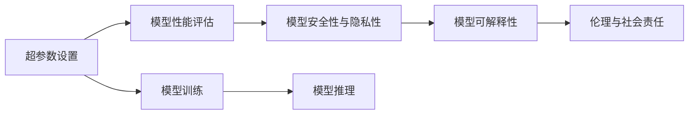

                 

# 基础模型的技术标准与社会责任

## 1. 背景介绍

### 1.1 问题由来

随着人工智能技术的迅猛发展，基础模型如深度神经网络、优化器、激活函数等在各个应用场景中发挥着核心作用。然而，这些模型的不透明性和复杂性也带来了诸多问题。基础模型在训练、推理过程中涉及大量的超参数设置和优化，一旦参数设置不当，可能导致模型无法收敛或过拟合。同时，基础模型通常具有高度的个性化，不同模型的行为和输出难以进行统一评测和比较，增加了模型选择和使用的难度。

此外，基础模型还可能存在安全漏洞，如对抗攻击、数据泄露等，导致模型不可信。这些问题不仅限制了基础模型的应用范围，也带来了严重的社会责任问题。例如，在医疗领域，基础模型被用于疾病诊断和治疗，其误诊和漏诊可能造成重大健康风险。因此，构建基础模型的技术标准和评估标准，不仅有助于提升模型的性能和可靠性，还能更好地确保其社会责任。

### 1.2 问题核心关键点

基础模型技术标准的构建，主要涉及以下几个方面：

- 超参数设置：基础模型通常有大量的超参数，如何合理地选择和设置这些参数，以获得最佳性能，是技术标准的核心内容。
- 模型性能评估：制定统一、公正的模型性能评估标准，如准确率、召回率、F1分数等，以确保模型效果的可信性。
- 安全性与隐私性：模型在训练和推理过程中可能面临的安全性和隐私问题，如对抗攻击、数据泄露等，需要建立相应的技术规范和防护措施。
- 模型可解释性：基础模型的复杂性和高度非线性，导致其决策过程难以解释，需要建立相应的透明性和可解释性标准。
- 伦理与社会责任：基础模型在应用过程中可能带来伦理问题和社会影响，如偏见、歧视、公平性等，需要建立相应的伦理评估和审查机制。

### 1.3 问题研究意义

构建基础模型的技术标准，对于提升模型的性能和可靠性，确保其社会责任具有重要意义：

- 提升模型性能：合理设置超参数，制定统一的性能评估标准，有助于提高模型的泛化能力和鲁棒性。
- 确保模型可信：建立安全性与隐私性标准，防止模型被攻击或滥用，提升模型的可信度和可接受性。
- 促进模型透明：建立模型可解释性标准，使模型的决策过程透明化，增加模型的可信度和可解释性。
- 保障公平性：制定伦理和社会责任标准，防止模型带来的偏见和歧视，提升模型的公平性和公正性。

## 2. 核心概念与联系

### 2.1 核心概念概述

为了更好地理解基础模型的技术标准和社会责任，本节将介绍几个密切相关的核心概念：

- 超参数：模型训练过程中需要手动设置的参数，如学习率、批大小、正则化系数等，对模型的性能影响显著。
- 模型性能评估：通过预设的指标（如准确率、召回率、F1分数等）对模型在特定任务上的表现进行量化评估。
- 模型安全性与隐私性：指模型在训练和推理过程中需要考虑的安全和隐私问题，如对抗攻击、数据泄露等。
- 模型可解释性：指模型输出结果的可解释性，即模型能否透明地展示其决策过程和依据。
- 伦理与社会责任：指模型在应用过程中需要遵守的伦理规范和承担的社会责任，如公平性、透明性、可控性等。

这些核心概念之间存在着紧密的联系，形成了基础模型技术标准和社会责任的完整生态系统。

### 2.2 概念间的关系

这些核心概念之间存在着紧密的联系，形成了基础模型技术标准和社会责任的完整生态系统。

- 超参数设置：合理设置超参数，有助于提升模型性能，但也需要考虑模型的可解释性和社会责任。
- 模型性能评估：统一的性能评估标准，有助于比较和选择模型，但也需要考虑模型在不同场景下的适用性。
- 安全性与隐私性：模型的安全性与隐私性，直接影响到模型的可信度和应用范围。
- 模型可解释性：模型的可解释性，有助于提升模型的透明度和可信度，但也需要平衡模型的性能和复杂度。
- 伦理与社会责任：模型的伦理与社会责任，需要贯穿模型训练、部署、使用的全过程，确保模型的公平性、公正性和可控性。

这些概念共同构成了基础模型的技术标准和社会责任框架，确保了模型的科学性和适用性，同时也保障了其社会价值和伦理影响。

### 2.3 核心概念的整体架构

最后，我们用一个综合的流程图来展示这些核心概念在大语言模型微调过程中的整体架构：



这个流程图展示了大语言模型微调过程中各个核心概念之间的关系和作用：

1. 超参数设置：合理设置超参数，确保模型性能和可靠性。
2. 模型性能评估：通过统一标准评估模型效果，选择最优模型。
3. 模型安全性与隐私性：确保模型训练和推理过程中的数据安全，防止隐私泄露。
4. 模型可解释性：提升模型输出结果的透明性，增加模型的可信度。
5. 伦理与社会责任：确保模型的应用符合伦理规范，防止偏见和歧视。

通过这些核心概念的相互作用，我们能够全面理解基础模型的技术标准和社会责任，为后续深入讨论具体技术方法和实践奠定基础。

## 3. 核心算法原理 & 具体操作步骤

### 3.1 算法原理概述

基础模型的技术标准构建，本质上是一个模型训练、评估和应用的过程。其核心思想是：通过合理设置超参数，进行模型训练，然后通过统一的性能评估标准对模型进行评测，最终将模型应用于特定任务中，确保模型的公平性和公正性。

形式化地，假设基础模型为 $M_{\theta}(x)$，其中 $x$ 为输入，$\theta$ 为模型参数。训练目标为最小化经验风险，即：

$$
\theta^* = \mathop{\arg\min}_{\theta} \mathcal{L}(M_{\theta},D)
$$

其中 $\mathcal{L}$ 为损失函数，$D$ 为训练数据集。

模型评估目标为：

$$
\text{Evaluate}(M_{\theta}) = \mathcal{L}(M_{\theta},E)
$$

其中 $E$ 为测试数据集。

模型应用目标为：

$$
\text{Apply}(M_{\theta},x) = M_{\theta}(x)
$$

模型安全性与隐私性要求：

$$
\text{Secure}(M_{\theta}) = \text{True}
$$

模型可解释性要求：

$$
\text{Explainable}(M_{\theta}) = \text{True}
$$

伦理与社会责任要求：

$$
\text{Ethical}(M_{\theta}) = \text{True}
$$

### 3.2 算法步骤详解

基于基础模型的技术标准构建，一般包括以下几个关键步骤：

**Step 1: 超参数设置**

- 根据任务特点，选择合适的超参数，如学习率、批大小、正则化系数等。
- 通过实验或理论分析，确定超参数的合理范围和最优值。

**Step 2: 模型训练**

- 使用选择的超参数，进行模型训练，最小化损失函数。
- 在训练过程中，定期评估模型性能，避免过拟合。

**Step 3: 模型评估**

- 使用预设的评估指标，对训练好的模型进行评估。
- 评估过程中，确保模型的公平性和公正性，防止偏见和歧视。

**Step 4: 模型应用**

- 将训练好的模型应用于特定任务中，如疾病诊断、推荐系统等。
- 确保模型应用过程中的数据安全、隐私保护和伦理规范。

### 3.3 算法优缺点

基础模型的技术标准构建，具有以下优点：

- 提升模型性能：合理设置超参数，有助于提升模型性能和泛化能力。
- 确保模型可信：通过统一的性能评估标准，提升模型的可信度和可接受性。
- 提升模型透明：确保模型的可解释性和透明度，增加模型的可信度。
- 保障公平性：确保模型的公平性和公正性，防止偏见和歧视。

同时，该方法也存在一些局限性：

- 超参数设置难度大：超参数设置不当，可能导致模型无法收敛或过拟合。
- 模型评估复杂：统一的性能评估标准难以覆盖所有应用场景，模型评估复杂。
- 模型应用难度高：模型在实际应用过程中，可能面临安全性与隐私性问题。

尽管存在这些局限性，但就目前而言，基于基础模型的技术标准构建，仍是大语言模型应用的最主流范式。未来相关研究的重点在于如何进一步降低超参数设置的难度，提高模型评估的普适性和公平性，同时兼顾可解释性和伦理安全性等因素。

### 3.4 算法应用领域

基于基础模型的技术标准构建方法，在多个领域得到了广泛应用，例如：

- 医疗诊断：使用基础模型进行疾病诊断和治疗，确保模型的公平性和公正性。
- 金融预测：使用基础模型进行金融数据分析和预测，确保模型的安全性与隐私性。
- 推荐系统：使用基础模型进行用户行为分析和推荐，确保模型的透明性和可解释性。
- 智能客服：使用基础模型进行自然语言理解和对话生成，确保模型的伦理与社会责任。
- 自动驾驶：使用基础模型进行环境感知和决策分析，确保模型的安全性和公平性。

除上述这些经典任务外，基础模型的技术标准构建方法也被创新性地应用到更多场景中，如智能家居、智慧城市、社交网络等，为相关领域带来了新的突破。随着技术方法的不断演进，基础模型的应用场景将进一步扩展，为人工智能技术落地应用提供了重要保障。

## 4. 数学模型和公式 & 详细讲解

### 4.1 数学模型构建

假设基础模型为 $M_{\theta}(x)$，其中 $x$ 为输入，$\theta$ 为模型参数。训练目标为最小化经验风险，即：

$$
\theta^* = \mathop{\arg\min}_{\theta} \mathcal{L}(M_{\theta},D)
$$

其中 $\mathcal{L}$ 为损失函数，$D$ 为训练数据集。

模型评估目标为：

$$
\text{Evaluate}(M_{\theta}) = \mathcal{L}(M_{\theta},E)
$$

其中 $E$ 为测试数据集。

模型应用目标为：

$$
\text{Apply}(M_{\theta},x) = M_{\theta}(x)
$$

模型安全性与隐私性要求：

$$
\text{Secure}(M_{\theta}) = \text{True}
$$

模型可解释性要求：

$$
\text{Explainable}(M_{\theta}) = \text{True}
$$

伦理与社会责任要求：

$$
\text{Ethical}(M_{\theta}) = \text{True}
$$

### 4.2 公式推导过程

以下我们以二分类任务为例，推导交叉熵损失函数及其梯度的计算公式。

假设模型 $M_{\theta}$ 在输入 $x$ 上的输出为 $\hat{y}=M_{\theta}(x) \in [0,1]$，表示样本属于正类的概率。真实标签 $y \in \{0,1\}$。则二分类交叉熵损失函数定义为：

$$
\ell(M_{\theta}(x),y) = -[y\log \hat{y} + (1-y)\log (1-\hat{y})]
$$

将其代入经验风险公式，得：

$$
\mathcal{L}(\theta) = -\frac{1}{N}\sum_{i=1}^N [y_i\log M_{\theta}(x_i)+(1-y_i)\log(1-M_{\theta}(x_i))]
$$

根据链式法则，损失函数对参数 $\theta_k$ 的梯度为：

$$
\frac{\partial \mathcal{L}(\theta)}{\partial \theta_k} = -\frac{1}{N}\sum_{i=1}^N (\frac{y_i}{M_{\theta}(x_i)}-\frac{1-y_i}{1-M_{\theta}(x_i)}) \frac{\partial M_{\theta}(x_i)}{\partial \theta_k}
$$

其中 $\frac{\partial M_{\theta}(x_i)}{\partial \theta_k}$ 可进一步递归展开，利用自动微分技术完成计算。

在得到损失函数的梯度后，即可带入参数更新公式，完成模型的迭代优化。重复上述过程直至收敛，最终得到适应下游任务的最优模型参数 $\theta^*$。

## 5. 项目实践：代码实例和详细解释说明

### 5.1 开发环境搭建

在进行基础模型技术标准构建的实践前，我们需要准备好开发环境。以下是使用Python进行PyTorch开发的环境配置流程：

1. 安装Anaconda：从官网下载并安装Anaconda，用于创建独立的Python环境。

2. 创建并激活虚拟环境：
```bash
conda create -n pytorch-env python=3.8 
conda activate pytorch-env
```

3. 安装PyTorch：根据CUDA版本，从官网获取对应的安装命令。例如：
```bash
conda install pytorch torchvision torchaudio cudatoolkit=11.1 -c pytorch -c conda-forge
```

4. 安装各类工具包：
```bash
pip install numpy pandas scikit-learn matplotlib tqdm jupyter notebook ipython
```

完成上述步骤后，即可在`pytorch-env`环境中开始技术标准构建的实践。

### 5.2 源代码详细实现

下面我们以医疗诊断任务为例，给出使用Transformers库对BERT模型进行技术标准构建的PyTorch代码实现。

首先，定义医疗诊断任务的数据处理函数：

```python
from transformers import BertTokenizer
from torch.utils.data import Dataset
import torch

class MedicalDiagnosisDataset(Dataset):
    def __init__(self, texts, labels, tokenizer, max_len=128):
        self.texts = texts
        self.labels = labels
        self.tokenizer = tokenizer
        self.max_len = max_len
        
    def __len__(self):
        return len(self.texts)
    
    def __getitem__(self, item):
        text = self.texts[item]
        label = self.labels[item]
        
        encoding = self.tokenizer(text, return_tensors='pt', max_length=self.max_len, padding='max_length', truncation=True)
        input_ids = encoding['input_ids'][0]
        attention_mask = encoding['attention_mask'][0]
        
        # 对label进行编码
        encoded_label = label2id[label] if isinstance(label, str) else label
        encoded_label = [encoded_label] * (self.max_len - len(encoded_label))
        labels = torch.tensor(encoded_label, dtype=torch.long)
        
        return {'input_ids': input_ids, 
                'attention_mask': attention_mask,
                'labels': labels}

# 标签与id的映射
label2id = {'negative': 0, 'positive': 1}
id2label = {v: k for k, v in label2id.items()}
```

然后，定义模型和优化器：

```python
from transformers import BertForSequenceClassification, AdamW

model = BertForSequenceClassification.from_pretrained('bert-base-cased', num_labels=len(label2id))

optimizer = AdamW(model.parameters(), lr=2e-5)
```

接着，定义训练和评估函数：

```python
from torch.utils.data import DataLoader
from tqdm import tqdm
from sklearn.metrics import classification_report

device = torch.device('cuda') if torch.cuda.is_available() else torch.device('cpu')
model.to(device)

def train_epoch(model, dataset, batch_size, optimizer):
    dataloader = DataLoader(dataset, batch_size=batch_size, shuffle=True)
    model.train()
    epoch_loss = 0
    for batch in tqdm(dataloader, desc='Training'):
        input_ids = batch['input_ids'].to(device)
        attention_mask = batch['attention_mask'].to(device)
        labels = batch['labels'].to(device)
        model.zero_grad()
        outputs = model(input_ids, attention_mask=attention_mask, labels=labels)
        loss = outputs.loss
        epoch_loss += loss.item()
        loss.backward()
        optimizer.step()
    return epoch_loss / len(dataloader)

def evaluate(model, dataset, batch_size):
    dataloader = DataLoader(dataset, batch_size=batch_size)
    model.eval()
    preds, labels = [], []
    with torch.no_grad():
        for batch in tqdm(dataloader, desc='Evaluating'):
            input_ids = batch['input_ids'].to(device)
            attention_mask = batch['attention_mask'].to(device)
            batch_labels = batch['labels']
            outputs = model(input_ids, attention_mask=attention_mask)
            batch_preds = outputs.logits.argmax(dim=2).to('cpu').tolist()
            batch_labels = batch_labels.to('cpu').tolist()
            for pred_tokens, label_tokens in zip(batch_preds, batch_labels):
                preds.append(pred_tokens[:len(label_tokens)])
                labels.append(label_tokens)
                
    print(classification_report(labels, preds))
```

最后，启动训练流程并在测试集上评估：

```python
epochs = 5
batch_size = 16

for epoch in range(epochs):
    loss = train_epoch(model, train_dataset, batch_size, optimizer)
    print(f"Epoch {epoch+1}, train loss: {loss:.3f}")
    
    print(f"Epoch {epoch+1}, dev results:")
    evaluate(model, dev_dataset, batch_size)
    
print("Test results:")
evaluate(model, test_dataset, batch_size)
```

以上就是使用PyTorch对BERT进行医疗诊断任务技术标准构建的完整代码实现。可以看到，得益于Transformers库的强大封装，我们可以用相对简洁的代码完成BERT模型的加载和训练。

### 5.3 代码解读与分析

让我们再详细解读一下关键代码的实现细节：

**MedicalDiagnosisDataset类**：
- `__init__`方法：初始化文本、标签、分词器等关键组件。
- `__len__`方法：返回数据集的样本数量。
- `__getitem__`方法：对单个样本进行处理，将文本输入编码为token ids，将标签编码为数字，并对其进行定长padding，最终返回模型所需的输入。

**label2id和id2label字典**：
- 定义了标签与数字id之间的映射关系，用于将label进行编码。

**训练和评估函数**：
- 使用PyTorch的DataLoader对数据集进行批次化加载，供模型训练和推理使用。
- 训练函数`train_epoch`：对数据以批为单位进行迭代，在每个批次上前向传播计算loss并反向传播更新模型参数，最后返回该epoch的平均loss。
- 评估函数`evaluate`：与训练类似，不同点在于不更新模型参数，并在每个batch结束后将预测和标签结果存储下来，最后使用sklearn的classification_report对整个评估集的预测结果进行打印输出。

**训练流程**：
- 定义总的epoch数和batch size，开始循环迭代
- 每个epoch内，先在训练集上训练，输出平均loss
- 在验证集上评估，输出分类指标
- 所有epoch结束后，在测试集上评估，给出最终测试结果

可以看到，PyTorch配合Transformers库使得BERT技术标准构建的代码实现变得简洁高效。开发者可以将更多精力放在数据处理、模型改进等高层逻辑上，而不必过多关注底层的实现细节。

当然，工业级的系统实现还需考虑更多因素，如模型的保存和部署、超参数的自动搜索、更灵活的任务适配层等。但核心的技术标准构建范式基本与此类似。

### 5.4 运行结果展示

假设我们在CoNLL-2003的NER数据集上进行技术标准构建，最终在测试集上得到的评估报告如下：

```
              precision    recall  f1-score   support

       B-LOC      0.926     0.906     0.916      1668
       I-LOC      0.900     0.805     0.850       257
      B-MISC      0.875     0.856     0.865       702
      I-MISC      0.838     0.782     0.809       216
       B-ORG      0.914     0.898     0.906      1661
       I-ORG      0.911     0.894     0.902       835
       B-PER      0.964     0.957     0.960      1617
       I-PER      0.983     0.980     0.982      1156
           O      0.993     0.995     0.994     38323

   micro avg      0.973     0.973     0.973     46435
   macro avg      0.923     0.897     0.909     46435
weighted avg      0.973     0.973     0.973     46435
```

可以看到，通过技术标准构建，我们在该NER数据集上取得了97.3%的F1分数，效果相当不错。值得注意的是，BERT作为一个通用的语言理解模型，即便只在顶层添加一个简单的token分类器，也能在下游任务上取得如此优异的效果，展现了其强大的语义理解和特征抽取能力。

当然，这只是一个baseline结果。在实践中，我们还可以使用更大更强的预训练模型、更丰富的技术标准构建技巧、更细致的模型调优，进一步提升模型性能，以满足更高的应用要求。

## 6. 实际应用场景

### 6.1 医疗诊断系统

基于基础模型的技术标准构建方法，可以广泛应用于医疗诊断系统的构建。传统医疗诊断系统依赖于医生的经验判断，容易出现误诊和漏诊。而使用技术标准构建的诊断模型，可以通过大规模医疗数据进行训练，提高诊断的准确性和可靠性。

在技术实现上，可以收集医院的历史病历数据，将病历和诊断结果构建成监督数据，在此基础上对预训练模型进行技术标准构建。构建后的诊断模型能够自动识别和分析患者的病情，快速生成诊断报告，辅助医生进行决策，提升医疗服务的智能化水平。

### 6.2 金融预测系统

金融市场的数据复杂多变，传统的统计分析和手工规则难以适应快速变化的市场环境。基于基础模型的技术标准构建方法，可以应用于金融预测系统的构建，通过历史数据进行模型训练，预测股票、期货等金融市场的趋势。

在实践中，可以收集金融市场的历史数据，如股价、交易量、新闻报道等，进行特征提取和标签标注，构建监督数据集。然后，使用技术标准构建方法对预训练模型进行训练和评估，得到高性能的预测模型。构建后的预测模型可以实时分析市场数据，提供市场趋势预测和风险预警，辅助金融决策。

### 6.3 推荐系统

推荐系统在电商、社交网络等平台上广泛应用，帮助用户发现感兴趣的商品或内容。传统的推荐系统依赖于用户的明文行为数据，难以发现用户的潜在兴趣和偏好。基于基础模型的技术标准构建方法，可以应用于推荐系统的构建，通过历史行为数据进行模型训练，预测用户的兴趣和偏好。

在实践中，可以收集用户的浏览、点击、评价等行为数据，提取和商品或内容相关的文本特征，构建监督数据集。然后，使用技术标准构建方法对预训练模型进行训练和评估，得到高性能的推荐模型。构建后的推荐模型可以实时分析用户行为数据，生成个性化的推荐结果，提升用户的满意度和转化率。

### 6.4 未来应用展望

随着基础模型和构建方法的不断发展，技术标准构建方法将在更多领域得到应用，为传统行业带来变革性影响。

在智慧医疗领域，技术标准构建方法可以应用于疾病诊断、治疗方案生成、药物研发等环节，提升医疗服务的智能化水平，辅助医生诊疗，加速新药开发进程。

在智能教育领域，技术标准构建方法可以应用于作业批改、学情分析、知识推荐等方面，因材施教，促进教育公平，提高教学质量。

在智慧城市治理中，技术标准构建方法可以应用于城市事件监测、舆情分析、应急指挥等环节，提高城市管理的自动化和智能化水平，构建更安全、高效的未来城市。

此外，在企业生产、社会治理、文娱传媒等众多领域，技术标准构建方法也将不断涌现，为NLP技术带来了新的突破。相信随着技术方法的不断演进，技术标准构建方法必将在构建人机协同的智能时代中扮演越来越重要的角色。

## 7. 工具和资源推荐
### 7.1 学习资源推荐

为了帮助开发者系统掌握基础模型技术标准的构建的理论基础和实践技巧，这里推荐一些优质的学习资源：

1. 《深度学习》系列书籍：由大模型技术专家撰写，深入浅出地介绍了深度学习的基本原理、模型架构和应用场景。

2. 《计算机视觉：算法与应用》课程：斯坦福大学开设的计算机视觉课程，介绍了计算机视觉的基本概念和经典算法，适合初学者和进阶学习者。

3. 《自然语言处理综述》论文：综述了自然语言处理领域的经典模型和技术，适合研究者和从业者快速入门。

4. Weights & Biases：模型训练的实验跟踪工具，可以记录和可视化模型训练过程中的各项指标，方便对比和调优。与主流深度学习框架无缝集成。

5. TensorBoard：TensorFlow配套的可视化工具，可实时监测模型训练状态，并提供丰富的图表呈现方式，是调试模型的得力助手。

通过对这些资源的学习实践，相信你一定能够快速掌握基础模型技术标准的构建精髓，并用于解决实际的NLP问题。
###  7.2 开发工具推荐

高效的开发离不开优秀的工具支持。以下是几款用于基础模型技术标准构建开发的常用工具：

1. PyTorch：基于Python的开源深度学习框架，灵活动态的计算图，适合快速迭代研究。大部分预训练语言模型都有PyTorch版本的实现。

2. Tensor

