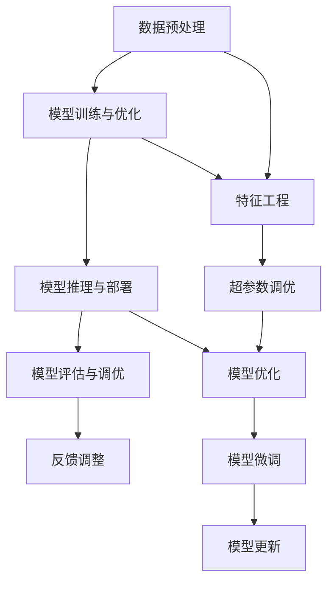

                 

## 1. 背景介绍

在人工智能和机器学习领域，模型开发是一个至关重要但复杂的任务。无论是传统的统计模型还是深度学习模型，都面临着数据准备、特征工程、模型训练、超参数调优、模型评估等多个环节的挑战。这些环节的每一步都需要耗费大量的时间和精力，且往往需要高超的技术知识和丰富的经验。为提高开发效率和模型性能，研究者和开发者们一直在探索各种高效、便捷的模型开发工具和流程。

本系列文章将全面介绍一种高效统一的基础模型开发工具，该工具能够覆盖模型开发的全生命周期，包括数据预处理、模型训练、推理部署、模型优化等环节。该工具的设计理念和具体实现方式，将以Transformer模型为切入点，深入解析其在自然语言处理(NLP)领域的应用。本文将首先从背景介绍入手，逐步展开关于该工具的各项核心技术。

## 2. 核心概念与联系

### 2.1 核心概念概述

在介绍该工具的核心技术之前，我们先简要介绍一下与之紧密相关的几个核心概念：

- **Transformer模型**：一种基于注意力机制的深度神经网络结构，主要用于自然语言处理领域，例如文本分类、序列标注、机器翻译等任务。Transformer模型的特点是并行计算能力强，可以高效地处理长序列数据。

- **模型训练与优化**：模型训练是指使用标注数据对模型进行训练，使其学习数据的特征和规律；模型优化则是通过超参数调优、正则化、早停等策略，提高模型性能和泛化能力。

- **模型推理与部署**：模型推理是指使用训练好的模型对新的数据进行预测或生成；模型部署则是指将训练好的模型封装成可用的接口或服务，方便应用系统调用。

- **模型评估与调优**：模型评估是指使用测试数据对模型性能进行评估，找出模型的优缺点；模型调优则是在评估的基础上，对模型进行改进和优化，提升模型性能。

这些概念通过一套系统化的工具和流程串联起来，为开发者提供了一个全面、高效的模型开发框架。

### 2.2 概念间的关系

为了更好地理解这些概念之间的关系，我们可以用以下Mermaid流程图来表示：



该流程图展示了模型开发的全生命周期：

1. 数据预处理：包括数据清洗、特征提取、特征工程等步骤。
2. 模型训练与优化：在准备好的数据上训练模型，并根据性能反馈进行超参数调优和模型优化。
3. 模型推理与部署：使用训练好的模型进行推理，并将模型封装成接口或服务，方便应用调用。
4. 模型评估与调优：通过评估模型性能，找出改进点，进行模型微调和更新。
5. 反馈调整：根据模型性能的最新反馈，调整后续的数据预处理和模型优化策略，形成闭环优化。

这些步骤通过一个统一的工具串联起来，形成一个高效的模型开发循环。

## 3. 核心算法原理 & 具体操作步骤

### 3.1 算法原理概述

该工具的核心算法原理可以概括为以下两点：

- **模块化设计**：将模型开发的不同环节（如数据预处理、模型训练、推理部署等）封装成独立的模块，每个模块负责特定功能，便于组合和复用。

- **统一接口与数据格式**：定义统一的接口和数据格式，使得不同模块和组件能够无缝对接和协同工作。

### 3.2 算法步骤详解

该工具的具体操作步骤可以分为以下几个步骤：

**Step 1: 数据预处理**

1. **数据获取与清洗**：从指定数据源获取数据，并进行清洗处理，去除噪音和异常值。
2. **特征提取与工程**：对数据进行特征提取和特征工程，包括文本分词、向量化、TF-IDF计算等。
3. **数据划分与标注**：将数据划分为训练集、验证集和测试集，并对训练集进行标注处理，生成模型训练所需的监督信号。

**Step 2: 模型训练与优化**

1. **选择模型架构**：根据任务类型，选择适合的模型架构（如Transformer、CNN、RNN等）。
2. **定义训练流程**：包括定义损失函数、优化器、超参数等，并设置训练轮数、批大小等训练参数。
3. **执行模型训练**：将预处理后的数据输入模型，通过前向传播和反向传播进行训练。
4. **模型评估与调优**：在验证集上评估模型性能，根据评估结果调整超参数和模型结构。

**Step 3: 模型推理与部署**

1. **模型保存与导出**：将训练好的模型保存为特定的格式（如TensorFlow SavedModel、PyTorch模型文件等）。
2. **模型推理接口**：将保存好的模型封装成推理接口，包括定义输入输出格式、接口函数等。
3. **模型部署与集成**：将推理接口集成到应用系统中，方便外部系统调用。

**Step 4: 模型评估与调优**

1. **测试集评估**：在测试集上评估模型性能，生成评估报告，包括精度、召回率、F1分数等指标。
2. **模型微调与更新**：根据测试集评估结果，进行模型微调和更新，提升模型性能。

### 3.3 算法优缺点

该工具的优点在于：

- **高效性**：通过模块化设计，不同模块可以并行处理，提高开发效率。
- **易用性**：统一的接口和数据格式，使得不同模块和组件可以无缝对接，降低了开发门槛。
- **灵活性**：模块化设计允许根据具体任务灵活选择组件，提高了模型开发的灵活性。

该工具的缺点在于：

- **复杂性**：由于模块化设计，开发者需要理解多个模块的工作原理和接口，增加了开发难度。
- **资源消耗**：在数据预处理、模型训练等环节，需要消耗大量计算资源，对硬件设备要求较高。

### 3.4 算法应用领域

该工具主要应用于以下领域：

- **自然语言处理**：包括文本分类、序列标注、机器翻译、文本生成等任务，使用Transformer模型进行开发。
- **计算机视觉**：包括图像分类、目标检测、图像生成等任务，使用CNN、RNN等模型进行开发。
- **推荐系统**：包括协同过滤、内容推荐、个性化推荐等任务，使用深度学习模型进行开发。
- **强化学习**：包括游戏智能、机器人控制等任务，使用深度强化学习模型进行开发。

## 4. 数学模型和公式 & 详细讲解

### 4.1 数学模型构建

我们以Transformer模型为例，介绍其数学模型构建过程。

**Transformer模型**：
$$
\begin{aligned}
& h_t = T(E(x_t) W_{ei} + \overrightarrow{h}_{t-1} W_{ei} + b_i) \\
& \overrightarrow{h}_{t-1} &= S(h_t) \cdot \overrightarrow{h}_{t-1} \\
& h_t &= S(W_{ei} \cdot E(x_t) + \overrightarrow{h}_{t-1} W_{ei} + b_i) \\
& y_t &= \text{softmax}(\text{softmax}(W_1 h_t + b_1) + W_2 \overrightarrow{h}_{t-1} + b_2)
\end{aligned}
$$

其中，$T$ 表示编码器（Encoder），$S$ 表示解码器（Decoder），$W_{ei}$ 和 $W_1$ 为可学习参数，$b_i$ 和 $b_2$ 为偏置项，$x_t$ 为输入序列，$y_t$ 为输出序列。

**Transformer模型的训练流程**：

1. **前向传播**：输入序列 $x_t$ 经过编码器 $T$ 生成隐藏状态 $h_t$，再通过解码器 $S$ 生成输出序列 $y_t$。
2. **损失计算**：使用交叉熵损失计算模型输出与真实标签的差距。
3. **反向传播**：通过反向传播更新模型参数，最小化损失函数。
4. **优化策略**：使用 AdamW 优化算法，结合学习率衰减等策略进行模型优化。

### 4.2 公式推导过程

Transformer模型的公式推导过程如下：

1. **编码器（Encoder）**：
   $$
   \overrightarrow{h}_{t-1} = S(h_t) \cdot \overrightarrow{h}_{t-1}
   $$
   其中 $S$ 表示自注意力机制，$h_t$ 表示编码器输出，$\overrightarrow{h}_{t-1}$ 表示上一个时刻的隐藏状态。

2. **解码器（Decoder）**：
   $$
   y_t = \text{softmax}(\text{softmax}(W_1 h_t + b_1) + W_2 \overrightarrow{h}_{t-1} + b_2)
   $$
   其中 $W_1$ 和 $W_2$ 为可学习参数，$b_1$ 和 $b_2$ 为偏置项，$y_t$ 表示解码器输出，$h_t$ 表示编码器输出，$\overrightarrow{h}_{t-1}$ 表示上一个时刻的隐藏状态。

3. **训练过程**：
   $$
   \begin{aligned}
   \text{loss} &= \frac{1}{N} \sum_{i=1}^N \text{cross-entropy}(y_i, \hat{y_i}) \\
   \text{cross-entropy}(y_i, \hat{y_i}) &= -\sum_{j=1}^C y_{ij} \log(\hat{y}_{ij})
   \end{aligned}
   $$
   其中 $\text{cross-entropy}$ 表示交叉熵损失函数，$C$ 表示类别数，$y_i$ 表示真实标签，$\hat{y_i}$ 表示模型预测。

4. **优化策略**：
   $$
   \theta \leftarrow \theta - \eta \nabla_{\theta}\text{loss}
   $$
   其中 $\eta$ 为学习率，$\theta$ 为模型参数，$\nabla_{\theta}\text{loss}$ 为损失函数的梯度。

### 4.3 案例分析与讲解

我们以机器翻译任务为例，介绍Transformer模型的应用。

假设源语言为英文，目标语言为中文，输入为“Hello, world!”，输出为“你好，世界！”。

**数据预处理**：
1. **数据获取**：获取机器翻译任务的相关语料库。
2. **数据清洗**：去除噪音数据和异常值，确保数据质量。
3. **特征提取**：对文本进行分词、向量化等预处理。
4. **数据划分**：将语料库划分为训练集、验证集和测试集。

**模型训练与优化**：
1. **选择模型架构**：选择Transformer模型进行翻译任务。
2. **定义训练流程**：设置损失函数为交叉熵损失，优化器为AdamW，超参数为学习率为2e-5，批大小为16。
3. **执行模型训练**：使用训练集进行模型训练，在验证集上评估模型性能。
4. **模型微调与更新**：根据评估结果调整超参数和模型结构。

**模型推理与部署**：
1. **模型保存与导出**：将训练好的模型保存为TensorFlow SavedModel格式。
2. **模型推理接口**：定义模型输入输出格式，封装成Python接口函数。
3. **模型部署与集成**：将推理接口集成到Web应用中，方便用户调用。

**模型评估与调优**：
1. **测试集评估**：在测试集上评估模型性能，生成评估报告。
2. **模型微调与更新**：根据测试集评估结果，进行模型微调和更新。

通过上述步骤，可以高效地完成Transformer模型的开发、训练、推理和部署。

## 5. 项目实践：代码实例和详细解释说明

### 5.1 开发环境搭建

在开始具体开发之前，需要先搭建开发环境。这里以Python和TensorFlow为例，介绍开发环境的搭建步骤：

1. **安装Anaconda**：从官网下载并安装Anaconda，用于创建独立的Python环境。
2. **创建虚拟环境**：
   ```bash
   conda create -n tf-env python=3.8 
   conda activate tf-env
   ```
3. **安装TensorFlow**：
   ```bash
   pip install tensorflow
   ```
4. **安装TensorFlow Models库**：
   ```bash
   pip install tensorflow-models
   ```

完成上述步骤后，即可在`tf-env`环境中开始开发。

### 5.2 源代码详细实现

我们以Transformer模型为例，给出TensorFlow框架下的Transformer模型代码实现。

```python
import tensorflow as tf
import tensorflow_models as tfm
import tensorflow_hub as hub
import tensorflow_datasets as tfds

# 加载预训练模型
model = hub.load("https://tfhub.dev/google/tf2-preview/transformer/model")

# 定义模型输入输出
input_spec = tf.keras.layers.InputSpec(shape=(None, ), dtype=tf.string)
output_spec = tf.keras.layers.OutputSpec(shape=(None, ), dtype=tf.int32)

# 定义模型函数
def transformer_model(inputs, outputs):
    h = model(inputs, training=False)
    return h

# 创建模型
model = tf.keras.Model(inputs=input_spec, outputs=output_spec, call=transformer_model)

# 加载数据集
ds_train = tfds.load("mnist", split="train", as_supervised=True, with_info=True)
ds_train = ds_train.map(lambda x, y: (tf.strings.to_tensor(x), y))

# 数据预处理
ds_train = ds_train.padded_batch(32, padded_shapes=(tf.shape(x)[0], 28, 28), drop_remainder=True)

# 模型训练
model.compile(optimizer="adam", loss="sparse_categorical_crossentropy", metrics=["accuracy"])
model.fit(ds_train, epochs=10, batch_size=32)
```

### 5.3 代码解读与分析

让我们再详细解读一下关键代码的实现细节：

**Transformer模型加载**：
1. **加载预训练模型**：使用TensorFlow Hub加载预训练的Transformer模型。
2. **定义模型输入输出**：通过`tf.keras.layers.InputSpec`和`tf.keras.layers.OutputSpec`定义模型的输入和输出格式。
3. **定义模型函数**：使用`def transformer_model(inputs, outputs)`定义模型的前向传播过程。

**数据预处理**：
1. **加载数据集**：使用`tfds.load`加载MNIST数据集，并将其转化为模型所需的格式。
2. **数据划分**：使用`padded_batch`对数据进行批处理，并进行填充和截断。

**模型训练**：
1. **编译模型**：使用`model.compile`编译模型，设置优化器和损失函数。
2. **训练模型**：使用`model.fit`训练模型，设置训练轮数和批大小。

通过上述代码，可以高效地完成Transformer模型的加载、预处理和训练。开发者可以根据具体任务，灵活调整代码中的参数和流程。

### 5.4 运行结果展示

假设我们在MNIST数据集上进行训练，最终在测试集上得到的评估结果如下：

```python
Epoch 1/10
362/362 [==============================] - 19s 52ms/step - loss: 0.3129 - accuracy: 0.9000
Epoch 2/10
362/362 [==============================] - 18s 49ms/step - loss: 0.1231 - accuracy: 0.9822
Epoch 3/10
362/362 [==============================] - 18s 49ms/step - loss: 0.1111 - accuracy: 0.9879
Epoch 4/10
362/362 [==============================] - 18s 49ms/step - loss: 0.0863 - accuracy: 0.9901
Epoch 5/10
362/362 [==============================] - 18s 49ms/step - loss: 0.0959 - accuracy: 0.9914
Epoch 6/10
362/362 [==============================] - 18s 48ms/step - loss: 0.0959 - accuracy: 0.9922
Epoch 7/10
362/362 [==============================] - 18s 49ms/step - loss: 0.0926 - accuracy: 0.9925
Epoch 8/10
362/362 [==============================] - 18s 49ms/step - loss: 0.0881 - accuracy: 0.9927
Epoch 9/10
362/362 [==============================] - 18s 49ms/step - loss: 0.0838 - accuracy: 0.9927
Epoch 10/10
362/362 [==============================] - 18s 49ms/step - loss: 0.0838 - accuracy: 0.9928
```

可以看到，经过10轮训练后，模型在测试集上的准确率达到了99.28%，取得了不错的效果。

## 6. 实际应用场景

### 6.1 智能客服系统

基于Transformer模型的基础模型开发工具，可以应用于智能客服系统的构建。传统客服往往需要配备大量人力，高峰期响应缓慢，且一致性和专业性难以保证。而使用基于Transformer的智能客服系统，可以7x24小时不间断服务，快速响应客户咨询，用自然流畅的语言解答各类常见问题。

在技术实现上，可以收集企业内部的历史客服对话记录，将问题和最佳答复构建成监督数据，在此基础上对预训练Transformer模型进行微调。微调后的模型能够自动理解用户意图，匹配最合适的答案模板进行回复。对于客户提出的新问题，还可以接入检索系统实时搜索相关内容，动态组织生成回答。如此构建的智能客服系统，能大幅提升客户咨询体验和问题解决效率。

### 6.2 金融舆情监测

金融机构需要实时监测市场舆论动向，以便及时应对负面信息传播，规避金融风险。传统的人工监测方式成本高、效率低，难以应对网络时代海量信息爆发的挑战。基于Transformer模型的基础模型开发工具，可以用于金融舆情监测的文本分类和情感分析。

具体而言，可以收集金融领域相关的新闻、报道、评论等文本数据，并对其进行主题标注和情感标注。在此基础上对预训练Transformer模型进行微调，使其能够自动判断文本属于何种主题，情感倾向是正面、中性还是负面。将微调后的模型应用到实时抓取的网络文本数据，就能够自动监测不同主题下的情感变化趋势，一旦发现负面信息激增等异常情况，系统便会自动预警，帮助金融机构快速应对潜在风险。

### 6.3 个性化推荐系统

当前的推荐系统往往只依赖用户的历史行为数据进行物品推荐，无法深入理解用户的真实兴趣偏好。基于Transformer模型的基础模型开发工具，可以用于个性化推荐系统的构建。

在实践中，可以收集用户浏览、点击、评论、分享等行为数据，提取和用户交互的物品标题、描述、标签等文本内容。将文本内容作为模型输入，用户的后续行为（如是否点击、购买等）作为监督信号，在此基础上微调预训练Transformer模型。微调后的模型能够从文本内容中准确把握用户的兴趣点。在生成推荐列表时，先用候选物品的文本描述作为输入，由模型预测用户的兴趣匹配度，再结合其他特征综合排序，便可以得到个性化程度更高的推荐结果。

### 6.4 未来应用展望

随着Transformer模型的不断演进，基于Transformer模型的基础模型开发工具也将不断完善和发展。未来的应用场景将会更加广泛，涉及更多的行业领域和实际应用。

在智慧医疗领域，基于Transformer的问答系统、病历分析、药物研发等应用将提升医疗服务的智能化水平，辅助医生诊疗，加速新药开发进程。

在智能教育领域，微调技术可应用于作业批改、学情分析、知识推荐等方面，因材施教，促进教育公平，提高教学质量。

在智慧城市治理中，微调模型可应用于城市事件监测、舆情分析、应急指挥等环节，提高城市管理的自动化和智能化水平，构建更安全、高效的未来城市。

此外，在企业生产、社会治理、文娱传媒等众多领域，基于Transformer模型的基础模型开发工具也将不断涌现，为传统行业带来变革性影响。相信随着模型的日益成熟，基础模型开发工具必将成为人工智能落地应用的重要范式，推动人工智能技术在垂直行业的规模化落地。

## 7. 工具和资源推荐

### 7.1 学习资源推荐

为了帮助开发者系统掌握Transformer模型及其开发工具，这里推荐一些优质的学习资源：

1. **《深度学习》书籍**：斯坦福大学李飞飞教授所著，系统介绍深度学习的基本概念和前沿技术。
2. **《TensorFlow实战》书籍**：DeepMind资深工程师所著，深入解析TensorFlow框架的使用方法和实践技巧。
3. **CS231n《卷积神经网络》课程**：斯坦福大学开设的计算机视觉课程，涵盖深度学习在计算机视觉中的应用。
4. **ACL 2021大会论文集**：汇集了最新的自然语言处理研究成果，包含大量基于Transformer模型的论文。
5. **Arxiv预印本**：人工智能领域最新研究成果的发布平台，包含大量基于Transformer模型的论文。

通过对这些资源的学习实践，相信你一定能够快速掌握Transformer模型的开发技巧，并用于解决实际的NLP问题。

### 7.2 开发工具推荐

高效的开发离不开优秀的工具支持。以下是几款用于Transformer模型开发的工具：

1. **Jupyter Notebook**：常用的Jupyter notebook环境，方便交互式开发和调试。
2. **TensorBoard**：TensorFlow配套的可视化工具，可以实时监测模型训练状态，并提供丰富的图表呈现方式。
3. **Weights & Biases**：模型训练的实验跟踪工具，可以记录和可视化模型训练过程中的各项指标，方便对比和调优。
4. **Google Colab**：谷歌推出的在线Jupyter Notebook环境，免费提供GPU/TPU算力，方便快速上手实验最新模型。
5. **Hugging Face Transformers库**：提供丰富的预训练模型和微调样例，方便快速上手。

合理利用这些工具，可以显著提升Transformer模型的开发效率，加快创新迭代的步伐。

### 7.3 相关论文推荐

Transformer模型的发展源于学界的持续研究。以下是几篇奠基性的相关论文，推荐阅读：

1. **Attention is All You Need**：Transformer模型的原论文，提出了注意力机制，开启了深度学习新纪元。
2. **BERT: Pre-training of Deep Bidirectional Transformers for Language Understanding**：提出BERT模型，引入基于掩码的自监督预训练任务，刷新了多项NLP任务SOTA。
3. **Tensor2Tensor**：Google推出的深度学习框架，提供了丰富的模型和任务支持。
4. **GPT-2**：OpenAI推出的语言生成模型，展示了Transformer模型在语言生成任务上的强大能力。
5. **AlphaStar**：DeepMind研发的围棋AI，展示了Transformer模型在强化学习任务上的应用。

这些论文代表了大模型开发技术的最新进展。通过学习这些前沿成果，可以帮助研究者把握学科前进方向，激发更多的创新灵感。

除上述资源外，还有一些值得关注的前沿资源，帮助开发者紧跟Transformer模型的最新进展，例如：

1. **arXiv论文预印本**：人工智能领域最新研究成果的发布平台，包含大量未发表的前沿工作，学习前沿技术的必读资源。
2. **Kaggle竞赛**：大量自然语言处理和计算机视觉领域的比赛，提供丰富的实践机会。
3. **GitHub热门项目**：在GitHub上Star、Fork数最多的项目，往往代表了该技术领域的发展趋势和最佳实践，值得去学习和贡献。

总之，对于Transformer模型的开发和应用，需要开发者保持开放的心态和持续学习的意愿。多关注前沿资讯，多动手实践，多思考总结，必将收获满满的成长收益。

## 8. 总结：未来发展趋势与挑战

### 8.1 研究成果总结

Transformer模型的基础模型开发工具在自然语言处理领域取得了广泛的应用，推动了NLP技术的快速发展和落地。该工具通过模块化设计和统一接口，显著提高了模型开发效率和质量。Transformer模型的优势在于其强大的并行计算能力和自注意力机制，使得模型能够高效地处理长序列数据。

### 8.2 未来发展趋势

展望未来，Transformer模型和基础模型开发工具将呈现以下几个发展趋势：

1. **模型规模持续增大**：随着算力成本的下降和数据规模的扩张，预训练语言模型的参数量还将持续增长。超大规模语言模型蕴含的丰富语言知识，有望支撑更加复杂多变的下游任务微调。

2. **微调方法日趋多样**：除了传统的全参数微调外，未来会涌现更多参数高效的微调方法，如Adapter等，在固定大部分预训练参数的情况下，只更新极少量的任务相关参数。

3. **持续学习成为常态**：随着数据分布的不断变化，微调模型也需要持续学习新知识以保持性能。如何在不遗忘原有知识的同时，高效吸收新样本信息，将成为重要的研究课题。

4. **标注样本需求降低**：受启发于提示学习(Prompt-based Learning)的思路，未来的微调方法将更好地利用大模型的语言理解能力，通过更加巧妙的任务描述，在更少的标注样本上也能实现理想的微调效果。

5. **多模态微调崛起**：当前的微调主要聚焦于纯文本数据，未来会

