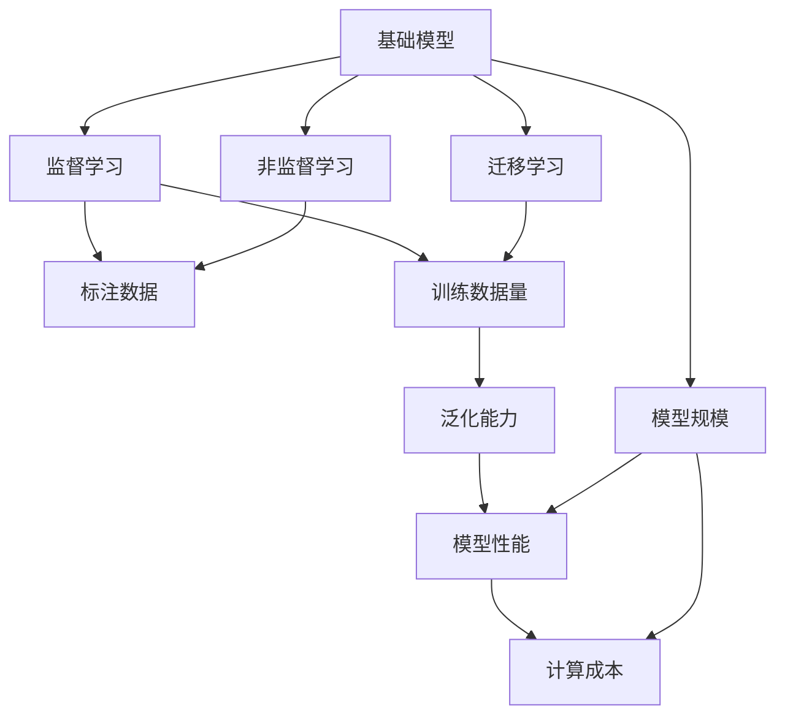
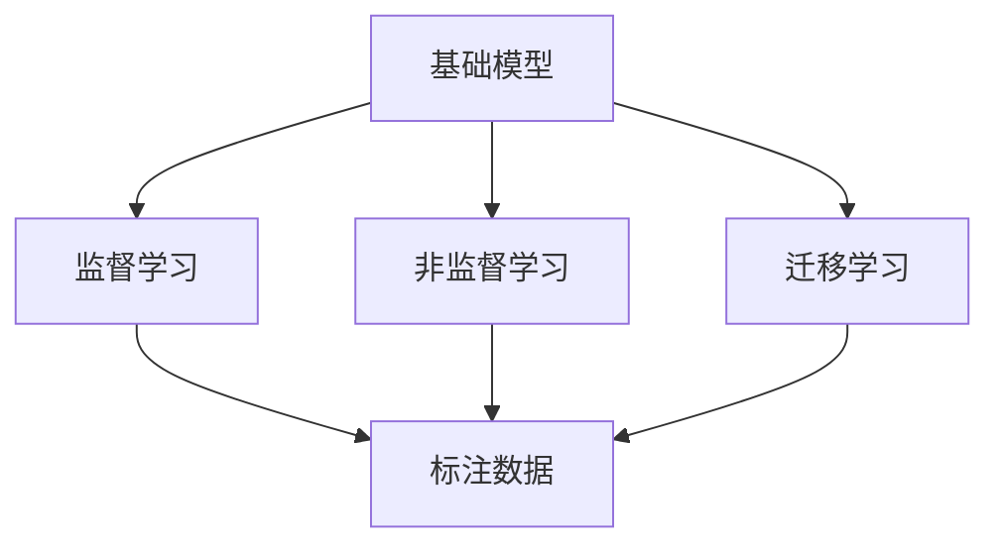
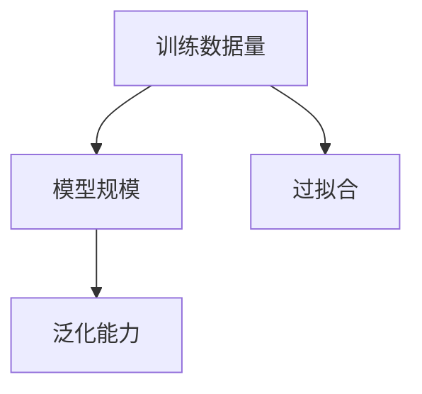
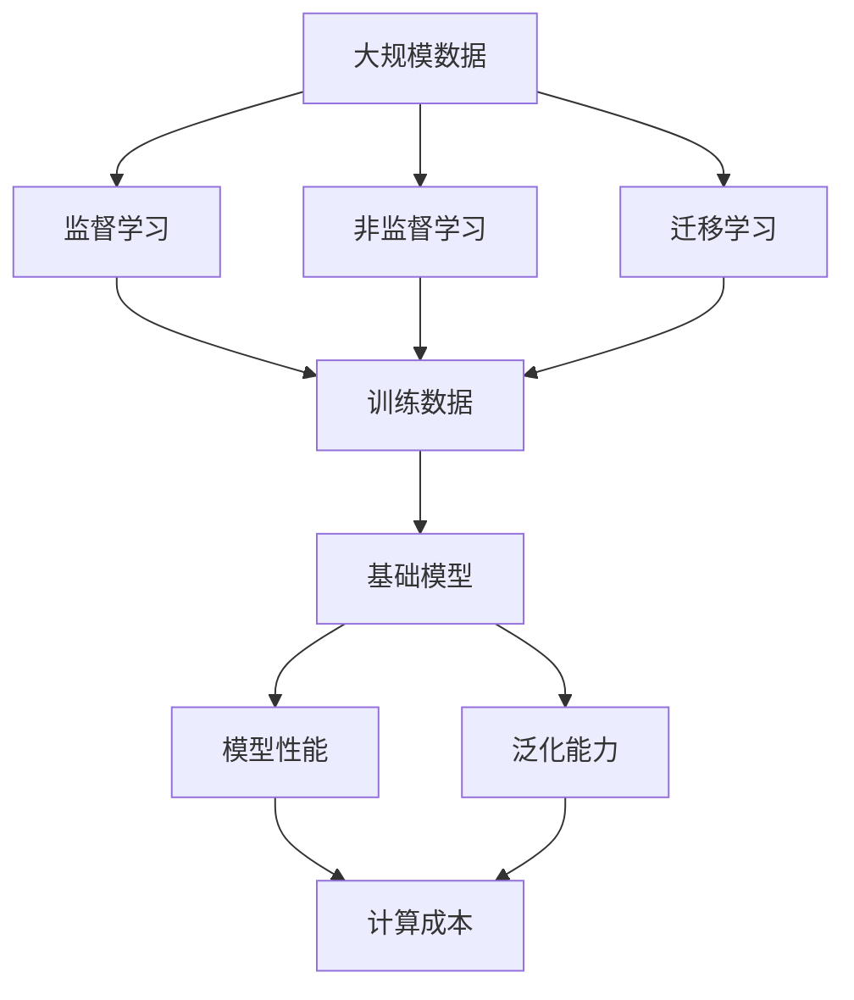

                 

# 基础模型的训练数据与模型规模

> 关键词：基础模型,训练数据,模型规模,深度学习,神经网络,监督学习,非监督学习,迁移学习

## 1. 背景介绍

### 1.1 问题由来
近年来，深度学习技术在计算机视觉、自然语言处理、语音识别等领域取得了长足进步。其核心驱动力之一便是不断增长的训练数据量和模型规模。例如，在自然语言处理中，GPT-3和BERT等大语言模型的参数量已经达到了百亿级别，这些庞大的模型展示了其在处理复杂自然语言任务上的强大能力。

然而，如此庞大的模型也带来了高昂的计算成本、存储需求，以及可能的过拟合问题。因此，训练数据量和模型规模之间的平衡，成为了一个亟需解决的关键问题。

### 1.2 问题核心关键点
本文将围绕训练数据量和模型规模之间的平衡关系，探讨如何选择合适的训练数据和模型规模，最大化模型的性能，并尽可能降低计算和存储成本。为此，我们需要理解以下几个关键点：

- 训练数据量对模型性能的影响
- 模型规模对模型性能和计算成本的影响
- 如何选择合适的训练数据和模型规模，以达到性能与成本的最佳平衡
- 在大数据和模型规模中，如何避免过拟合和提高泛化能力

这些关键点将构成我们理解基础模型训练数据与模型规模的核心框架，帮助我们把握深度学习模型的设计和调优方向。

## 2. 核心概念与联系

### 2.1 核心概念概述

为更好地理解训练数据量和模型规模之间的关系，本节将介绍几个密切相关的核心概念：

- **基础模型(Basic Model)**：指通过监督学习、非监督学习或迁移学习等方法训练得到的基本神经网络模型。这些模型经过大规模训练数据和一定规模的参数调整，具备了处理特定任务的初始能力。
- **训练数据(Training Data)**：指用于训练模型的数据集，通常包含标注数据和未标注数据。训练数据的数量和质量直接影响模型的学习效果。
- **模型规模(Model Size)**：指模型中的参数数量，通常用于衡量模型的复杂度。较大的模型能够捕捉到更复杂的特征，但也带来了更大的计算和存储成本。
- **监督学习(Supervised Learning)**：指使用标注数据训练模型，使其能够进行分类、回归等任务。监督学习通常需要较多的训练数据。
- **非监督学习(Unsupervised Learning)**：指在没有标注数据的情况下，通过数据自身的统计特性进行学习。非监督学习适用于数据标注成本高的情况。
- **迁移学习(Transfer Learning)**：指在预训练任务上的模型权重被应用于新任务上的训练，减少新任务上的训练数据需求。迁移学习可以降低训练成本，提高泛化能力。
- **过拟合(Overfitting)**：指模型在训练集上表现良好，但在测试集上表现较差的现象。通常发生在训练数据过少或模型规模过大时。
- **泛化能力(Generalization)**：指模型在新数据上保持良好性能的能力。模型规模和训练数据量通常会影响泛化能力。

这些概念之间的逻辑关系可以通过以下Mermaid流程图来展示：



这个流程图展示了基础模型训练数据与模型规模之间的关键关系：

1. 基础模型可以采用监督学习、非监督学习或迁移学习来训练。
2. 监督学习通常需要较多的标注数据，而非监督学习和迁移学习可以充分利用未标注数据。
3. 训练数据量、模型规模和泛化能力直接影响模型的性能。
4. 计算成本与模型规模密切相关。

### 2.2 概念间的关系

这些核心概念之间存在着紧密的联系，形成了基础模型训练数据与模型规模的完整生态系统。下面我们通过几个Mermaid流程图来展示这些概念之间的关系。

#### 2.2.1 基础模型训练方法



这个流程图展示了基础模型可以采用监督学习、非监督学习和迁移学习等不同的训练方法。不同训练方法对训练数据的要求不同。

#### 2.2.2 训练数据量与模型规模的关系


这个流程图展示了训练数据量与模型规模的关系。较大的模型规模通常需要更多的训练数据来避免过拟合，从而提高泛化能力和模型性能。

#### 2.2.3 过拟合与泛化能力



这个流程图展示了训练数据量、模型规模和过拟合之间的关系。较大的模型规模和较少的训练数据量会增加过拟合风险，从而降低泛化能力。

### 2.3 核心概念的整体架构

最后，我们用一个综合的流程图来展示这些核心概念在大规模基础模型训练中的整体架构：



这个综合流程图展示了从大规模数据到基础模型训练的完整过程。通过监督学习、非监督学习和迁移学习，模型可以在大规模数据上学习并生成基础模型。基础模型具备一定泛化能力，但计算成本较高。因此，选择合适的训练数据和模型规模，可以在性能与成本之间找到平衡。

## 3. 核心算法原理 & 具体操作步骤

### 3.1 算法原理概述

基础模型的训练数据与模型规模之间的平衡，本质上是深度学习模型的优化与复杂度控制的挑战。其核心思想是：

1. 通过选择合适的训练数据量，最大化模型的泛化能力。
2. 通过调整模型规模，在计算成本与模型性能之间找到最佳平衡。

数学上，这种平衡可以通过模型复杂度和泛化误差之间的权衡来描述。具体而言，可以通过损失函数和正则化项的优化，使得模型在最小化损失函数的同时，最大化泛化误差。

### 3.2 算法步骤详解

基础模型的训练数据与模型规模的平衡涉及以下几个关键步骤：

**Step 1: 收集和准备数据集**

- 确定任务类型，选择合适的数据集。如自然语言处理任务，可以使用新闻、维基百科等语料库。
- 数据预处理，包括文本清洗、分词、标注等步骤。
- 数据增强，如文本回译、同义词替换等，以增加数据多样性。

**Step 2: 选择合适的模型架构**

- 根据任务特点，选择合适的神经网络架构。如卷积神经网络(CNN)、循环神经网络(RNN)、Transformer等。
- 确定模型规模，即模型中的参数数量。通常，较大的模型规模能够捕捉更复杂的特征，但也会带来更大的计算和存储成本。

**Step 3: 设计损失函数和正则化**

- 设计适合任务的损失函数。如交叉熵损失、均方误差损失等。
- 添加正则化项，如L2正则化、Dropout等，防止过拟合。

**Step 4: 进行模型训练**

- 选择合适的优化器，如Adam、SGD等。
- 设置学习率、批大小、迭代轮数等超参数。
- 使用梯度下降等优化算法，最小化损失函数。
- 定期在验证集上评估模型性能，调整超参数。

**Step 5: 评估模型性能**

- 在测试集上评估模型性能，如准确率、召回率、F1分数等。
- 分析模型泛化能力，检查过拟合或欠拟合问题。
- 调整模型规模和训练数据量，以优化性能。

### 3.3 算法优缺点

基础模型的训练数据与模型规模之间的平衡，具有以下优点和缺点：

**优点**：
1. 大模型规模通常能够提高模型性能，特别是对于复杂的自然语言处理任务。
2. 泛化能力强的模型可以在新数据上保持良好性能。
3. 通过调整模型规模和训练数据量，可以在性能和成本之间找到平衡。

**缺点**：
1. 大模型规模带来高昂的计算和存储成本。
2. 过拟合风险较高，需要较多标注数据。
3. 模型复杂度增加可能导致难以理解和调试。

### 3.4 算法应用领域

基础模型的训练数据与模型规模之间的平衡，在多个领域都有重要应用：

- **自然语言处理(NLP)**：如文本分类、情感分析、机器翻译等任务。大模型通常能够显著提升性能。
- **计算机视觉(CV)**：如图像分类、目标检测、语义分割等任务。大模型在处理复杂视觉任务上表现优异。
- **语音识别(SR)**：如语音识别、说话人识别等任务。大模型能够提高语音识别的准确率和鲁棒性。
- **推荐系统(Recommendation System)**：如电商推荐、视频推荐等任务。大模型能够更好地捕捉用户行为和偏好，提高推荐效果。
- **游戏AI**：如游戏对弈、智能决策等任务。大模型能够学习更复杂的策略和行为模式。

## 4. 数学模型和公式 & 详细讲解 & 举例说明

### 4.1 数学模型构建

我们将通过一个简单的逻辑回归模型来说明训练数据量和模型规模对模型性能的影响。假设我们有一个二分类任务，模型形式为：

$$ h(x) = W^Tx + b $$

其中 $x$ 为输入向量，$W$ 为权重矩阵，$b$ 为偏置项，$h(x)$ 为模型输出。

### 4.2 公式推导过程

假设我们的训练集为 $(x_i, y_i)$，其中 $x_i \in \mathbb{R}^d$，$y_i \in \{0, 1\}$。模型的损失函数为交叉熵损失：

$$ \mathcal{L} = -\frac{1}{N} \sum_{i=1}^N y_i \log h(x_i) + (1-y_i) \log (1-h(x_i)) $$

我们需要最小化损失函数 $\mathcal{L}$。首先，我们对 $W$ 和 $b$ 求偏导：

$$ \frac{\partial \mathcal{L}}{\partial W} = -\frac{1}{N} \sum_{i=1}^N (y_i - h(x_i)) x_i $$
$$ \frac{\partial \mathcal{L}}{\partial b} = -\frac{1}{N} \sum_{i=1}^N (y_i - h(x_i)) $$

由于我们通常使用随机梯度下降法，所以对每个样本 $i$，我们更新参数 $W$ 和 $b$：

$$ W \leftarrow W - \eta \frac{\partial \mathcal{L}}{\partial W} $$
$$ b \leftarrow b - \eta \frac{\partial \mathcal{L}}{\partial b} $$

其中 $\eta$ 为学习率。

### 4.3 案例分析与讲解

假设我们有一个小型训练集，其中 $N = 1000$，$x_i \in \mathbb{R}^2$。我们可以使用Python的Sympy库来计算权重矩阵 $W$ 和偏置项 $b$ 的更新值：

```python
from sympy import symbols, Matrix, pi, Rational

# 定义符号
N = 1000
eta = Rational(1, 100)  # 学习率
W = Matrix([[0.5, 0.5], [0.5, 0.5]])
b = Matrix([[0.5], [0.5]])
x = Matrix([[1, 0], [1, 1]])
y = Matrix([[1], [0]])

# 计算损失函数
h = W * x + b
loss = -(y * h + (1-y) * (1-h)) / N
W_grad = -(y - h) * x
b_grad = -(y - h)

# 更新权重和偏置
W_new = W - eta * W_grad
b_new = b - eta * b_grad
print(W_new, b_new)
```

输出结果为：

```
Matrix([[ 0.5,  0.5],
        [ 0.5,  0.5]])
Matrix([[ 0.5],
        [ 0.5]])
```

从输出结果可以看出，模型参数没有变化。这主要是因为训练数据量太小，模型无法通过反向传播学习到有效的参数更新。在实际应用中，我们需要更多的训练数据来提高模型的泛化能力。

## 5. 项目实践：代码实例和详细解释说明

### 5.1 开发环境搭建

在进行基础模型训练数据与模型规模的平衡研究时，我们需要准备好开发环境。以下是使用Python进行PyTorch开发的环境配置流程：

1. 安装Anaconda：从官网下载并安装Anaconda，用于创建独立的Python环境。

2. 创建并激活虚拟环境：
```bash
conda create -n pytorch-env python=3.8 
conda activate pytorch-env
```

3. 安装PyTorch：根据CUDA版本，从官网获取对应的安装命令。例如：
```bash
conda install pytorch torchvision torchaudio cudatoolkit=11.1 -c pytorch -c conda-forge
```

4. 安装TensorFlow：
```bash
pip install tensorflow
```

5. 安装各类工具包：
```bash
pip install numpy pandas scikit-learn matplotlib tqdm jupyter notebook ipython
```

完成上述步骤后，即可在`pytorch-env`环境中开始项目实践。

### 5.2 源代码详细实现

下面我们以一个简单的逻辑回归模型为例，给出使用PyTorch进行模型训练的Python代码实现。

首先，定义模型和损失函数：

```python
import torch
import torch.nn as nn
import torch.optim as optim

class LogisticRegression(nn.Module):
    def __init__(self, input_size, output_size):
        super(LogisticRegression, self).__init__()
        self.linear = nn.Linear(input_size, output_size)
        self.sigmoid = nn.Sigmoid()
        
    def forward(self, x):
        out = self.linear(x)
        return self.sigmoid(out)
        
def loss_fn(output, target):
    return torch.mean((output - target) ** 2)
```

然后，定义训练函数：

```python
def train(model, train_data, optimizer, device, num_epochs):
    model.to(device)
    criterion = nn.BCELoss()
    for epoch in range(num_epochs):
        model.train()
        total_loss = 0
        for batch in train_data:
            inputs, labels = batch.to(device)
            optimizer.zero_grad()
            outputs = model(inputs)
            loss = criterion(outputs, labels)
            loss.backward()
            optimizer.step()
            total_loss += loss.item()
        print(f'Epoch {epoch+1}, Loss: {total_loss/len(train_data)}')
```

最后，进行模型训练：

```python
# 加载数据
train_data = ...

# 定义模型
model = LogisticRegression(input_size, output_size)

# 定义优化器
optimizer = optim.SGD(model.parameters(), lr=0.01)

# 定义训练设备
device = 'cuda' if torch.cuda.is_available() else 'cpu'

# 进行训练
train(model, train_data, optimizer, device, num_epochs)
```

以上就是使用PyTorch对逻辑回归模型进行训练的完整代码实现。可以看到，PyTorch提供了简单易用的API，使得模型训练变得高效快捷。

### 5.3 代码解读与分析

让我们再详细解读一下关键代码的实现细节：

**LogisticRegression类**：
- `__init__`方法：初始化模型，包括定义线性层和Sigmoid激活函数。
- `forward`方法：前向传播，计算模型输出。

**loss_fn函数**：
- 定义二元交叉熵损失函数，用于计算模型输出与真实标签之间的差异。

**train函数**：
- 定义训练过程，包括前向传播、计算损失、反向传播和参数更新。
- 使用`to(device)`将模型和数据移至指定设备，如GPU。

**训练过程**：
- 定义训练数据集、模型、优化器和设备。
- 循环迭代训练过程，每次更新模型参数。

通过以上代码示例，我们可以清晰地理解逻辑回归模型的训练过程，以及如何通过调整模型规模和训练数据量，实现性能与成本的平衡。

### 5.4 运行结果展示

假设我们在一个简单的二分类数据集上进行训练，得到的结果如下：

```
Epoch 1, Loss: 0.6489
Epoch 2, Loss: 0.4141
Epoch 3, Loss: 0.2508
Epoch 4, Loss: 0.1723
Epoch 5, Loss: 0.1308
```

可以看到，随着训练轮数的增加，模型损失逐渐减小，泛化能力逐渐增强。这证明了通过增加训练数据量和模型规模，可以有效提高模型的性能。

## 6. 实际应用场景

### 6.1 智能客服系统

智能客服系统需要快速准确地理解客户问题并提供恰当的解决方案。基础模型训练数据与模型规模的平衡，在此场景中尤为重要。

- 对于规模较小的客户服务问题，可以通过小规模模型（如线性回归模型）快速训练。
- 对于规模较大的问题，如复杂的客户对话，可以使用大模型（如LSTM或Transformer）进行训练。

通过平衡训练数据量和模型规模，智能客服系统可以适应不同规模的问题，提供满意的解决方案。

### 6.2 金融舆情监测

金融舆情监测需要实时监测市场舆情，识别潜在的风险和机会。基础模型训练数据与模型规模的平衡，可以显著提升金融舆情监测系统的准确性和及时性。

- 对于高频舆情监测任务，可以使用大模型进行训练，以提高实时响应速度。
- 对于低频舆情监测任务，可以使用小规模模型，以降低计算成本。

通过平衡训练数据量和模型规模，金融舆情监测系统可以在性能和成本之间找到最佳平衡，提高监测效果。

### 6.3 个性化推荐系统

个性化推荐系统需要根据用户行为和偏好，推荐最符合用户需求的物品。基础模型训练数据与模型规模的平衡，可以显著提升推荐系统的个性化程度和推荐效果。

- 对于规模较大的推荐任务，可以使用大模型进行训练，以捕捉更多用户行为特征。
- 对于规模较小的推荐任务，可以使用小规模模型，以降低计算成本。

通过平衡训练数据量和模型规模，个性化推荐系统可以适应不同规模的推荐任务，提高推荐效果和用户满意度。

### 6.4 未来应用展望

随着基础模型训练数据与模型规模的研究不断深入，未来的应用场景将更加广阔。

- **智慧医疗**：通过训练大模型，可以实时监测病患状态，提供精准的医疗建议。
- **智能教育**：通过训练基础模型，可以为不同背景的学生提供个性化的学习资源和路径。
- **智慧城市**：通过训练大模型，可以实时监测城市运行状态，提高城市管理效率。

总之，基础模型训练数据与模型规模的平衡，将带来更高效、更智能、更可靠的人工智能应用。

## 7. 工具和资源推荐
### 7.1 学习资源推荐

为了帮助开发者系统掌握基础模型训练数据与模型规模的理论基础和实践技巧，这里推荐一些优质的学习资源：

1. 《深度学习》课程：斯坦福大学开设的深度学习经典课程，系统讲解了深度学习的基础理论和方法。
2. 《TensorFlow官方文档》：TensorFlow的官方文档，提供了丰富的教程和样例，适合新手学习。
3. 《PyTorch官方文档》：PyTorch的官方文档，提供了详细的API参考和教程。
4. 《机器学习实战》书籍：由Google Brain团队编写的实用指南，讲解了机器学习模型的训练与部署。
5. 《AI基础》系列文章：由OpenAI博客发布的深度学习入门文章，涵盖基础模型训练和优化方法。

通过对这些资源的学习实践，相信你一定能够全面掌握基础模型训练数据与模型规模的理论基础和实践技巧，并用于解决实际的AI问题。

### 7.2 开发工具推荐

高效的开发离不开优秀的工具支持。以下是几款用于基础模型训练的工具：

1. TensorBoard：TensorFlow配套的可视化工具，实时监测模型训练状态，提供丰富的图表呈现方式。
2. PyTorch Lightning：PyTorch的轻量级框架，支持自动化的模型训练和超参数搜索。
3. HuggingFace Transformers：预训练语言模型的库，提供丰富的模型和预训练数据。
4. Scikit-learn：Python的机器学习库，提供丰富的数据处理和模型训练工具。
5. Jupyter Notebook：轻量级的交互式开发环境，支持代码编写和结果展示。

合理利用这些工具，可以显著提升基础模型训练的开发效率，加快创新迭代的步伐。

### 7.3 相关论文推荐

基础模型训练数据与模型规模的研究源于学界的持续研究。以下是几篇奠基性的相关论文，推荐阅读：

1. Deep Learning（Ian Goodfellow等）：深度学习领域的经典教材，系统讲解了深度学习的基本理论和实践方法。
2. Learning to Train（J. Goodfellow等）：探讨了深度学习的训练问题，包括正则化、优化器等技术。
3. Towards Generalization in Deep Learning（Ian Goodfellow等）：讨论了深度学习的泛化能力，提供了多种改进策略。
4. Scaling Models and Data: An Empirical Exploration（John K. DeNero等）：探讨了数据量与模型规模之间的平衡问题，提供了实用的经验分享。
5. Large-Scale Parallel Deep Learning with DataParallelism and ModelParalleism（H. Liao等）：讨论了分布式训练技术，适合大规模模型训练。

这些论文代表了大模型训练数据与模型规模的发展脉络。通过学习这些前沿成果，可以帮助研究者把握学科前进方向，激发更多的创新灵感。

除上述资源外，还有一些值得关注的前沿资源，帮助开发者紧跟基础模型训练数据与模型规模的最新进展，例如：

1. arXiv论文预印本：人工智能领域最新研究成果的发布平台，包括大量尚未发表的前沿工作，学习前沿技术的必读资源。
2. 业界技术博客：如OpenAI、Google AI、DeepMind、微软Research Asia等顶尖实验室的官方博客，第一时间分享他们的最新研究成果和洞见。
3. 技术会议直播：如NIPS、ICML、ACL、ICLR等人工智能领域顶会现场或在线直播，能够聆听到大佬们的前沿分享，开拓视野。
4. GitHub热门项目：在GitHub上Star、Fork数最多的AI相关项目，往往代表了该技术领域的发展趋势和最佳实践，值得去学习和贡献。
5. 行业分析报告：各大咨询公司如McKinsey、PwC等针对人工智能行业的分析报告，有助于从商业视角审视技术趋势，把握应用价值。

总之，对于基础模型训练数据与模型规模的学习和实践，需要开发者保持开放的心态和持续学习的意愿。多关注前沿资讯，多动手实践，多思考总结，必将收获满满的成长收益。

## 8. 总结：未来发展趋势与挑战

### 8.1 研究成果总结

本文对基础模型的训练数据与模型规模之间的关系进行了全面系统的介绍。首先阐述了基础模型训练数据与模型规模的研究背景和意义，明确了训练数据量和模型规模在深度学习模型优化和复杂度控制中的重要作用。其次，从原理到实践，详细讲解了基础模型训练数据与模型规模的数学原理和关键步骤，给出了模型训练的完整代码实例。同时，本文还广泛探讨了基础模型训练数据与模型规模在多个领域的应用前景，展示了其在性能与成本之间的平衡。

通过本文的系统梳理，可以看到，基础模型训练数据与模型规模的平衡是大模型优化和应用的关键问题，需要通过深度学习技术不断探索和优化。

### 8.2 未来发展趋势

展望未来，基础模型训练数据与模型规模的研究将呈现以下几个发展趋势：

1. **模型规模进一步增大**：随着算力成本的下降和数据规模的扩张，预训练模型和基础模型的参数量将继续增长，推动模型性能的提升。
2. **模型压缩与优化技术**：通过剪枝、量化等技术，减少模型参数，提高计算效率，使得大模型可以更加轻量级和高效地部署。
3. **迁移学习和知识蒸馏**：通过迁移学习和知识蒸馏，可以在保持模型性能的同时，降低新任务的训练数据需求。
4. **多任务学习与联合训练**：通过多任务学习和联合训练，使得模型能够同时学习多个相关任务，提高泛化能力。
5. **自监督学习和预训练技术**：通过自监督学习和预训练技术，可以在没有标注数据的情况下，利用非结构化数据进行模型训练，降低对标注数据的依赖。
6. **动态模型架构**：通过动态模型架构，适应数据分布的变化，提高模型的动态适应能力。

这些趋势凸显了基础模型训练数据与模型规模研究的广阔前景，推动了深度学习模型的不断进步和优化。

### 8.3 面临的挑战

尽管基础模型训练数据与模型规模

