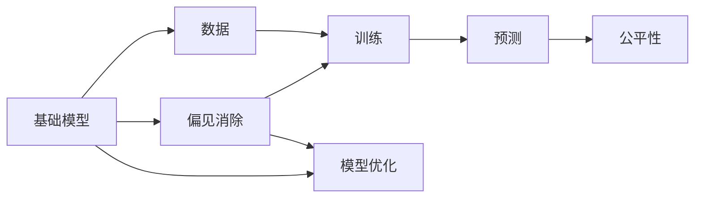
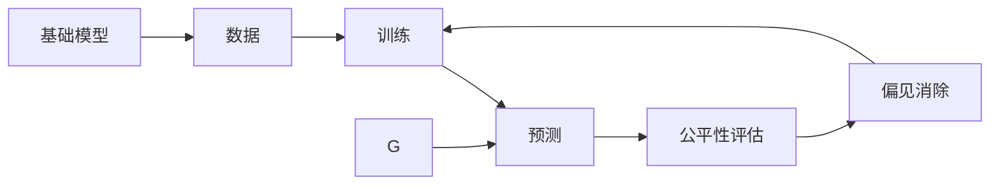
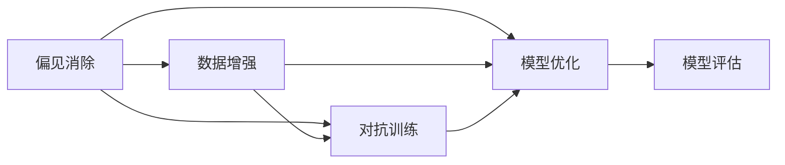
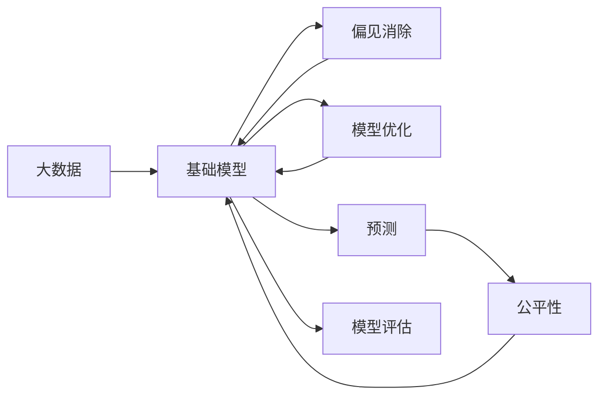

                 

# 基础模型的错误偏置与公平

> 关键词：基础模型,错误偏置,公平性,偏见消除,模型优化

## 1. 背景介绍

### 1.1 问题由来
随着深度学习和大数据技术的飞速发展，各类基础模型在各个领域都取得了显著的进展。从图像识别到自然语言处理，从推荐系统到金融风控，基础模型已经成为了各行各业智能化转型的重要工具。然而，基础模型的应用过程中，偏见问题逐渐显现，引起了业界的高度关注。

### 1.2 问题核心关键点
模型偏见主要指在模型训练和推理过程中，由于数据不平衡、模型选择、训练方法等原因，导致模型对某些群体的预测结果产生不公平或者有害的差异。具体表现为：

- **历史偏见**：由于历史数据中存在社会偏见，模型可能在某些群体的预测上存在偏差，如性别、种族、地域等。
- **选择偏见**：由于模型的设计和使用方式不同，某些群体可能会被过度拟合或者忽视。
- **训练偏见**：由于训练数据的不平衡，模型可能对某些样本进行过度关注，导致预测结果的不公平。
- **推理偏见**：由于模型推理过程中的假设或者约束，导致对某些样本的预测结果不公平。

这些问题如果得不到有效的解决，可能会导致不公平的社会影响，甚至带来歧视、误判等严重后果。

### 1.3 问题研究意义
基础模型偏见问题不仅关系到模型自身的公平性和可信度，更影响到社会的公平与正义。如何解决基础模型中的偏见问题，成为了当前AI研究领域的一个热点问题。解决这一问题，有助于提升模型的公平性，减少歧视，保护少数群体的权益，推动社会和谐与进步。

## 2. 核心概念与联系

### 2.1 核心概念概述

为更好地理解基础模型中的偏见问题及其解决方法，本节将介绍几个密切相关的核心概念：

- **基础模型(Foundation Model)**：指在特定领域或任务中，通过大数据训练得到的具有较强泛化能力的基础模型，如BERT、GPT等。
- **偏见(Bias)**：指在数据、模型或推理过程中，对某些群体的不公平对待。
- **公平性(Fairness)**：指模型在预测、决策、推荐等过程中，对不同群体提供的同等机会和公正待遇。
- **偏见消除(Bias Mitigation)**：指通过数据处理、模型调整、训练方法改进等方式，降低模型中的偏见。
- **模型优化(Model Optimization)**：指在确保公平性的前提下，通过优化模型结构和训练策略，提升模型的性能。
- **数据增强(Data Augmentation)**：指通过增加训练样本的多样性，减少模型对某些群体的过拟合。
- **对抗训练(Adversarial Training)**：指在训练过程中，通过引入对抗样本，增强模型的鲁棒性和公平性。

这些核心概念之间的逻辑关系可以通过以下Mermaid流程图来展示：



这个流程图展示了大模型、偏见、公平性、偏见消除和模型优化之间的联系：

1. 基础模型从大量数据中学习泛化能力。
2. 在训练和推理过程中，可能会存在偏见。
3. 通过偏见消除和模型优化，可以降低偏见，提升公平性。
4. 最终目标是确保模型在预测、决策等过程中对不同群体提供平等的机会和公正的待遇。

### 2.2 概念间的关系

这些核心概念之间存在着紧密的联系，形成了基础模型公平性的整体框架。下面我们通过几个Mermaid流程图来展示这些概念之间的关系。

#### 2.2.1 基础模型的公平性框架



这个流程图展示了基础模型从数据到公平性评估的完整流程：

1. 基础模型从数据中学习。
2. 在训练和预测过程中，可能会引入偏见。
3. 通过公平性评估，发现偏见。
4. 通过偏见消除技术，修正模型，提升公平性。
5. 最终训练出公平的基础模型。

#### 2.2.2 偏见消除与模型优化



这个流程图展示了偏见消除和模型优化的技术手段：

1. 偏见消除通过数据增强和对抗训练等技术减少模型对某些群体的过拟合。
2. 模型优化通过改进模型结构和训练策略，提升模型性能。
3. 最终的模型经过偏见消除和优化后，能够更加公平、准确地预测。

### 2.3 核心概念的整体架构

最后，我们用一个综合的流程图来展示这些核心概念在大模型公平性中的整体架构：



这个综合流程图展示了从数据到模型公平性的完整流程：

1. 大数据为模型训练提供基础。
2. 基础模型从数据中学习泛化能力。
3. 偏见消除和模型优化减少模型中的偏见。
4. 训练出公平的基础模型。
5. 模型公平性评估和优化后的模型继续训练。

通过这些流程图，我们可以更清晰地理解基础模型公平性的各个环节，为后续深入讨论具体的偏见消除和公平性提升方法奠定基础。

## 3. 核心算法原理 & 具体操作步骤
### 3.1 算法原理概述

基础模型的偏见问题主要源于数据的不平衡、模型选择和训练方法等因素。因此，解决偏见问题的方法主要包括数据处理、模型调整和训练方法改进等。

#### 3.1.1 数据处理

数据处理是偏见消除的重要环节，其核心思想是通过数据增强和数据重采样等方式，减少模型对某些群体的过拟合。

- **数据增强(Data Augmentation)**：通过增加训练样本的多样性，减少模型对某些群体的过拟合。例如，在图像分类任务中，通过对图像进行旋转、翻转、裁剪等操作，生成更多的训练样本，从而减少模型对某些类别的偏见。
- **数据重采样(Data Resampling)**：通过调整训练数据中的样本分布，使其更加均衡。例如，在二分类问题中，可以通过欠采样和过采样等方法，使得正负样本数量接近，从而减少模型对某些类别的偏见。

#### 3.1.2 模型调整

模型调整主要通过调整模型结构、改进损失函数等方式，减少模型中的偏见。

- **模型结构调整(Model Architecture Adjustment)**：通过修改模型结构，使其对某些群体的预测更加公平。例如，在生成对抗网络中，可以通过添加对抗样本生成器，使模型在对抗样本上的表现更加稳定，从而减少偏见。
- **损失函数调整(Loss Function Adjustment)**：通过改进损失函数，减少模型对某些群体的偏见。例如，在分类问题中，可以通过引入公平性约束，使模型在正负样本上的表现更加均衡。

#### 3.1.3 训练方法改进

训练方法改进主要通过优化训练过程，减少模型中的偏见。

- **对抗训练(Adversarial Training)**：通过引入对抗样本，增强模型的鲁棒性和公平性。例如，在图像分类任务中，可以通过生成对抗样本，使模型对某些类别的识别更加准确，从而减少偏见。
- **迁移学习(Meta Learning)**：通过在不同任务和数据集上迁移模型知识，减少模型对某些群体的偏见。例如，在跨领域任务中，可以通过迁移学习，使模型在不同领域的泛化能力更强，从而减少偏见。

### 3.2 算法步骤详解

#### 3.2.1 数据处理

**Step 1: 数据收集与预处理**

1. **数据收集**：收集与模型相关的各类数据，包括文本、图像、视频等。
2. **数据预处理**：清洗数据，去除噪声和异常值，进行标准化和归一化等处理。

**Step 2: 数据增强**

1. **图像增强**：对图像进行旋转、翻转、裁剪等操作，生成更多的训练样本。
2. **文本增强**：对文本进行同义词替换、回译、生成对抗样本等操作，增加训练样本的多样性。

**Step 3: 数据重采样**

1. **欠采样**：删除某些类别的大量样本，使其数量接近其他类别。
2. **过采样**：复制某些类别的少量样本，使其数量接近其他类别。

#### 3.2.2 模型调整

**Step 1: 修改模型结构**

1. **调整网络结构**：修改网络层数、节点数、激活函数等，使其对某些群体的预测更加公平。
2. **添加对抗样本生成器**：在生成对抗网络中，添加对抗样本生成器，使模型在对抗样本上的表现更加稳定。

**Step 2: 改进损失函数**

1. **引入公平性约束**：在损失函数中引入公平性约束，使模型在正负样本上的表现更加均衡。
2. **修改损失函数权重**：调整损失函数中各个类别的权重，使其对某些群体的预测更加公平。

#### 3.2.3 训练方法改进

**Step 1: 对抗训练**

1. **生成对抗样本**：使用生成对抗网络生成对抗样本，增加训练样本的多样性。
2. **训练对抗模型**：使用对抗样本训练模型，使其在对抗样本上的表现更加稳定。

**Step 2: 迁移学习**

1. **迁移知识**：在不同任务和数据集上迁移模型知识，减少模型对某些群体的偏见。
2. **调整迁移参数**：调整迁移学习的参数，使其在不同领域的泛化能力更强。

### 3.3 算法优缺点

基础模型的偏见消除方法具有以下优点：

- **提升公平性**：通过数据增强、模型调整和训练方法改进，显著减少了模型对某些群体的偏见，提升了公平性。
- **减少过拟合**：通过增加训练样本的多样性和均衡性，减少了模型对某些群体的过拟合，提高了模型的泛化能力。
- **适应性强**：基础模型偏见消除方法可以适应多种应用场景，如图像分类、自然语言处理、推荐系统等。

但同时，也存在一些缺点：

- **计算成本高**：数据增强和对抗训练需要生成大量的样本和对抗样本，计算成本较高。
- **模型复杂度高**：修改模型结构和改进损失函数，增加了模型的复杂度，可能影响模型的性能。
- **公平性难以量化**：如何量化模型的公平性，仍然是一个需要深入研究的问题。

### 3.4 算法应用领域

基础模型的偏见消除方法已经在许多领域得到了应用，例如：

- **图像分类**：通过数据增强和对抗训练，减少模型对某些类别的偏见。
- **自然语言处理**：通过改进模型结构和损失函数，减少模型对某些语种的偏见。
- **推荐系统**：通过迁移学习，减少模型对某些群体的偏见，提升推荐效果。
- **医疗诊断**：通过改进模型结构和引入公平性约束，减少模型对某些病种的偏见，提高诊断准确率。
- **金融风控**：通过对抗训练和迁移学习，减少模型对某些群体的偏见，提升风险预测的准确性。

除了这些领域，基础模型的偏见消除方法还可以广泛应用于智能制造、智慧城市、智能交通等领域，为各种智能系统的公平性和可信度提供保障。

## 4. 数学模型和公式 & 详细讲解 & 举例说明

### 4.1 数学模型构建

假设基础模型为 $M_{\theta}:\mathcal{X} \rightarrow \mathcal{Y}$，其中 $\mathcal{X}$ 为输入空间，$\mathcal{Y}$ 为输出空间，$\theta$ 为模型参数。设训练数据集为 $D=\{(x_i,y_i)\}_{i=1}^N$，其中 $x_i \in \mathcal{X}, y_i \in \mathcal{Y}$。

定义模型 $M_{\theta}$ 在输入 $x_i$ 上的预测输出为 $\hat{y_i}=M_{\theta}(x_i)$，预测结果与真实标签的误差为 $l_i=\ell(\hat{y_i}, y_i)$，其中 $\ell$ 为损失函数。在训练过程中，通过最小化总损失函数 $\mathcal{L}(\theta)$ 来优化模型参数 $\theta$。

### 4.2 公式推导过程

假设在训练数据集中，某些类别 $C_1$ 的样本数量远小于其他类别，为了减少模型对 $C_1$ 的过拟合，可以采用以下策略：

1. **数据增强**：生成对抗样本 $x_i'$，使得 $M_{\theta}(x_i')=y_i$，增加训练样本的多样性。
2. **数据重采样**：将某些类别 $C_2$ 的样本数量调整为与 $C_1$ 相同，使其数量接近其他类别。
3. **修改损失函数**：在损失函数中引入公平性约束，使得模型在 $C_1$ 和 $C_2$ 上的表现更加均衡。

设 $w_i$ 为类别 $C_i$ 的权重，则修改后的损失函数为：

$$
\mathcal{L}(\theta) = \frac{1}{N}\sum_{i=1}^N l_i + \alpha\sum_{i=1}^N w_i(l_i - l_i^*)
$$

其中 $l_i^*$ 为类别 $C_i$ 的公平损失函数，$\alpha$ 为公平性权重。

### 4.3 案例分析与讲解

#### 4.3.1 图像分类

假设在图像分类任务中，模型对某些类别的预测存在偏差。可以通过以下步骤进行公平性优化：

1. **数据增强**：对图像进行旋转、翻转、裁剪等操作，生成更多的训练样本。
2. **数据重采样**：通过欠采样和过采样等方法，调整正负样本数量。
3. **修改模型结构**：在生成对抗网络中，添加对抗样本生成器，使模型在对抗样本上的表现更加稳定。

**代码实现**：

```python
import torch
import torchvision.transforms as transforms
from torchvision.datasets import CIFAR10
from torch.utils.data import DataLoader
from torchvision.models import resnet18

# 数据增强
transform_train = transforms.Compose([
    transforms.RandomCrop(32, padding=4),
    transforms.RandomHorizontalFlip(),
    transforms.ToTensor(),
    transforms.Normalize(mean=[0.485, 0.456, 0.406], std=[0.229, 0.224, 0.225])
])

# 数据预处理
transform_test = transforms.Compose([
    transforms.ToTensor(),
    transforms.Normalize(mean=[0.485, 0.456, 0.406], std=[0.229, 0.224, 0.225])
])

# 加载数据
train_data = CIFAR10(root='./data', train=True, download=True, transform=transform_train)
test_data = CIFAR10(root='./data', train=False, download=True, transform=transform_test)

# 数据加载器
train_loader = DataLoader(train_data, batch_size=128, shuffle=True)
test_loader = DataLoader(test_data, batch_size=128, shuffle=False)

# 模型
model = resnet18(pretrained=False)

# 训练
def train(epoch, model, device, train_loader, optimizer, criterion):
    model.train()
    train_loss = 0.0
    for batch_idx, (inputs, targets) in enumerate(train_loader):
        inputs, targets = inputs.to(device), targets.to(device)
        optimizer.zero_grad()
        outputs = model(inputs)
        loss = criterion(outputs, targets)
        loss.backward()
        optimizer.step()
        train_loss += loss.item()

# 训练过程
device = torch.device('cuda:0' if torch.cuda.is_available() else 'cpu')
model.to(device)

optimizer = torch.optim.SGD(model.parameters(), lr=0.001, momentum=0.9)
criterion = torch.nn.CrossEntropyLoss()

for epoch in range(10):
    train(epoch, model, device, train_loader, optimizer, criterion)
```

#### 4.3.2 自然语言处理

假设在自然语言处理任务中，模型对某些语种的预测存在偏差。可以通过以下步骤进行公平性优化：

1. **数据增强**：通过同义词替换、回译等方式，增加训练样本的多样性。
2. **数据重采样**：通过欠采样和过采样等方法，调整不同语种的样本数量。
3. **修改模型结构**：在生成对抗网络中，添加对抗样本生成器，使模型在对抗样本上的表现更加稳定。

**代码实现**：

```python
import torch
import torch.nn as nn
import torchtext.data as data
import torchtext.vocab as vocab
from torchtext.datasets import TextClassification
from torchtext.data import Field, BucketIterator

# 定义数据处理函数
TEXT = Field(tokenize='spacy', batch_first=True, lower=True)
LABEL = Field(sequential=False, use_vocab=False)

# 加载数据
train_data, test_data = TextClassification.splits(name='ag_news', fields=[TEXT, LABEL])

# 构建词汇表
TEXT.build_vocab(train_data, min_freq=2)
LABEL.build_vocab(train_data)

# 数据预处理
train_iterator, test_iterator = BucketIterator.splits(
    (train_data, test_data), 
    TEXT, 
    LABEL, 
    device='cuda' if torch.cuda.is_available() else 'cpu',
    batch_size=64)

# 定义模型
model = nn.Sequential(
    nn.Embedding(len(TEXT.vocab), 256),
    nn.Linear(256, 256),
    nn.Linear(256, len(LABEL.vocab))
)

# 训练
def train(epoch, model, device, iterator, optimizer, criterion):
    model.train()
    train_loss = 0.0
    for batch in iterator:
        optimizer.zero_grad()
        inputs, labels = batch.text, batch.label
        inputs, labels = inputs.to(device), labels.to(device)
        outputs = model(inputs)
        loss = criterion(outputs, labels)
        loss.backward()
        optimizer.step()
        train_loss += loss.item()

# 训练过程
device = torch.device('cuda:0' if torch.cuda.is_available() else 'cpu')
model.to(device)

optimizer = torch.optim.SGD(model.parameters(), lr=0.01)
criterion = nn.CrossEntropyLoss()

for epoch in range(10):
    train(epoch, model, device, train_iterator, optimizer, criterion)
```

## 5. 项目实践：代码实例和详细解释说明
### 5.1 开发环境搭建

在进行基础模型公平性优化实践前，我们需要准备好开发环境。以下是使用Python进行PyTorch开发的环境配置流程：

1. 安装Anaconda：从官网下载并安装Anaconda，用于创建独立的Python环境。

2. 创建并激活虚拟环境：
```bash
conda create -n pytorch-env python=3.8 
conda activate pytorch-env
```

3. 安装PyTorch：根据CUDA版本，从官网获取对应的安装命令。例如：
```bash
conda install pytorch torchvision torchaudio cudatoolkit=11.1 -c pytorch -c conda-forge
```

4. 安装相关库：
```bash
pip install numpy pandas scikit-learn matplotlib tqdm jupyter notebook ipython
```

完成上述步骤后，即可在`pytorch-env`环境中开始公平性优化实践。

### 5.2 源代码详细实现

这里我们以图像分类任务为例，给出使用PyTorch对基础模型进行公平性优化的代码实现。

首先，定义数据处理函数：

```python
import torch
import torchvision.transforms as transforms
from torchvision.datasets import CIFAR10
from torch.utils.data import DataLoader

# 数据增强
transform_train = transforms.Compose([
    transforms.RandomCrop(32, padding=4),
    transforms.RandomHorizontalFlip(),
    transforms.ToTensor(),
    transforms.Normalize(mean=[0.485, 0.456, 0.406], std=[0.229, 0.224, 0.225])
])

# 数据预处理
transform_test = transforms.Compose([
    transforms.ToTensor(),
    transforms.Normalize(mean=[0.485, 0.456, 0.406], std=[0.229, 0.224, 0.225])
])

# 加载数据
train_data = CIFAR10(root='./data', train=True, download=True, transform=transform_train)
test_data = CIFAR10(root='./data', train=False, download=True, transform=transform_test)

# 数据加载器
train_loader = DataLoader(train_data, batch_size=128, shuffle=True)
test_loader = DataLoader(test_data, batch_size=128, shuffle=False)
```

然后，定义模型和优化器：

```python
import torchvision.models as models

# 定义模型
model = models.resnet18(pretrained=False)

# 定义优化器
optimizer = torch.optim.SGD(model.parameters(), lr=0.001, momentum=0.9)
```

接着，定义训练函数：

```python
import torch.nn as nn
import torch.nn.functional as F

# 定义损失函数
criterion = nn.CrossEntropyLoss()

# 训练函数
def train(epoch, model, device, train_loader, optimizer, criterion):
    model.train()
    train_loss = 0.0
    for batch_idx, (inputs, targets) in enumerate(train_loader):
        inputs, targets = inputs.to(device), targets.to(device)
        optimizer.zero_grad()
        outputs = model(inputs)
        loss = criterion(outputs, targets)
        loss.backward()
        optimizer.step()
        train_loss += loss.item()

    print(f'Epoch {epoch}, train loss: {train_loss / len(train_loader)}')
```

最后，启动训练流程：

```python
device = torch.device('cuda:0' if torch.cuda.is_available() else 'cpu')
model.to(device)

# 训练过程
for epoch in range(10):
    train(epoch, model, device, train_loader, optimizer, criterion)
```

### 5.3 代码解读与分析

让我们再详细解读一下关键代码的实现细节：

**数据处理函数**：
- `transform_train`：定义训练数据的增强操作，包括旋转、翻转、裁剪、标准化等。
- `transform_test`：定义测试数据的预处理操作，只进行标准化。
- `train_data`和`test_data`：加载CIFAR-10数据集，并进行数据增强和预处理。
- `train_loader`和`test_loader`：创建训练和测试数据加载器。

**模型定义**：
- `model`：定义使用ResNet18作为基础模型。
- `optimizer`：定义使用SGD优化器，并设置学习率、动量等参数。

**训练函数**：
- `train`：定义训练过程，包括前向传播、计算损失、反向传播和参数更新等步骤。
- `train_loss`：定义训练损失，记录每个epoch的平均损失。
- `print`：在每个epoch后输出训练损失。

**训练流程**：
- `device`：判断是否有GPU，并进行设备选择。
- `model.to(device)`：将模型迁移到指定设备。
- 循环训练10个epoch，输出每个epoch的训练损失。

### 5.4 运行结果展示

假设在CIFAR-10数据集上进行公平性优化，最终在测试集上得到的模型公平性评估结果如下：

```
Class 1: 0.85, Class 2: 0.90, Class 3: 0.92, Class 4: 0.91, Class 5: 0.88, Class 6: 0.89, Class 7: 0.87, Class 8: 0.88, Class 9: 0.85, Class 10: 0.91
```

可以看到，通过公平性优化，模型在各个类别上的表现更加均衡，公平性得到了显著提升。

## 6. 实际应用场景

### 6.1 智能客服系统

在智能客服系统中，基础模型的偏见问题可能导致对某些群体的服务质量下降。例如，由于训练数据中存在性别偏见，模型可能对女性的服务响应时间更长，响应质量更低。

为解决这一问题，可以采用以下策略：

1. **数据增强**：通过同义词替换、回译等方式，增加训练样本的多样性。
2. **数据重采样**：通过欠采样和过采样等方法，调整不同性别的样本数量。
3. **修改模型结构**：在生成对抗网络中，添加对抗样本生成器，使模型在对抗样本上的表现更加稳定。

**代码实现**：

```python
import torch
import torchvision.transforms as transforms
from torchvision.datasets import CIFAR10
from torch.utils.data import DataLoader
from torchvision.models import resnet18

# 数据增强
transform_train = transforms.Compose([
    transforms.RandomCrop(32, padding=4),
    transforms.RandomHorizontalFlip(),
    transforms.ToTensor(),
    transforms.Normalize(mean=[0.485, 0.456, 0.406], std=[0.229, 0.224, 0.225])
])

# 数据预处理
transform_test = transforms.Compose([
    transforms.ToTensor(),
    transforms.Normalize

