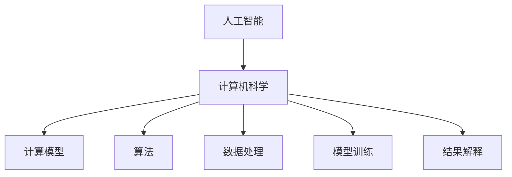
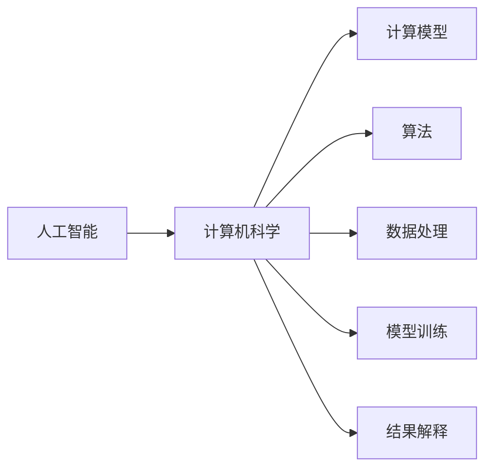

                 

## 1. 背景介绍

### 1.1 问题由来
随着信息技术的飞速发展，人类社会已经进入数字时代。数字技术的广泛应用，极大地改变了生产、生活、学习和娱乐等各个领域。然而，在这场数字革命的浪潮中，计算机科学的基础问题——人类计算的重要性，却往往被忽视。人类计算不仅关乎技术和工程的未来发展，更关乎社会的进步与人类自身的成长。本文将深入探讨人类计算的关键作用，以及如何更好地利用技术实现人类计算的智能化和自动化。

### 1.2 问题核心关键点
人类计算的核心在于如何高效地利用计算机，使之成为人类智慧的延伸。人类计算涉及到从问题建模、算法设计、数据处理、模型训练到结果解释等多个环节，其目标是最大化计算机系统的计算能力和知识表示能力，从而更好地服务于人类的需求。

人类计算的核心关键点包括：
- 问题建模：将现实世界的问题抽象为数学模型或计算模型，以便计算机进行处理。
- 算法设计：设计高效的算法，优化计算资源的使用，提高计算速度和准确性。
- 数据处理：有效地处理和组织数据，提取有价值的信息，为算法提供支撑。
- 模型训练：利用数据进行模型训练，优化模型参数，提升模型的预测能力和泛化能力。
- 结果解释：将计算结果转化为易于理解和利用的形式，辅助人类做出决策。

### 1.3 问题研究意义
研究人类计算的作用，对于推动人工智能技术的可持续发展，提升社会信息化水平，具有重要意义：

1. 优化资源利用。通过科学计算和优化算法，可以提高资源利用效率，降低计算成本，推动技术进步。
2. 提升智能水平。人类计算可以增强机器的智能能力，使其能够更好地理解和处理复杂问题，提高决策水平。
3. 促进社会进步。人类计算可以推动教育、医疗、交通等各个领域的智能化发展，提升社会运行效率。
4. 实现人机协同。人类计算可以促进人机协同，使计算机成为人类智慧的延伸，实现更高效的协作。
5. 确保技术安全。人类计算可以引入伦理和法律约束，确保技术应用的公平性和安全性。

## 2. 核心概念与联系

### 2.1 核心概念概述

为更好地理解人类计算，本节将介绍几个关键概念：

- 人工智能：一种通过算法、模型和数据驱动的技术，使其能够模拟人类的智能行为。
- 计算机科学：研究如何利用计算机进行信息处理、存储、传输和计算的学科。
- 计算模型：将现实问题抽象为计算机可处理的形式，如离散模型、连续模型、随机模型等。
- 算法：解决问题或执行操作的有效步骤，旨在最小化资源消耗和时间复杂度。
- 数据处理：收集、存储、处理和分析数据的过程，为算法提供支撑。
- 模型训练：通过数据训练模型，优化模型参数，提升模型性能。
- 结果解释：将计算结果转化为易于理解和利用的形式，辅助人类决策。

这些核心概念之间的联系可以通过以下Mermaid流程图来展示：



这个流程图展示了人工智能与计算机科学、计算模型、算法、数据处理、模型训练和结果解释之间的联系。

### 2.2 概念间的关系

这些核心概念之间存在着紧密的联系，形成了人类计算的整体架构。下面我通过几个Mermaid流程图来展示这些概念之间的关系。

#### 2.2.1 人工智能与计算机科学的关系



这个流程图展示了人工智能与计算机科学的关系，以及人工智能如何通过计算模型、算法、数据处理、模型训练和结果解释等多个环节来实现其功能。

#### 2.2.2 计算模型与算法的关系


这个流程图展示了计算模型和算法之间的关系。计算模型为算法提供了一个结构化的框架，而算法则是在这个框架内执行具体操作的详细步骤。

#### 2.2.3 数据处理与模型训练的关系


这个流程图展示了数据处理和模型训练之间的关系。数据处理为模型训练提供了基础数据，模型训练则通过数据训练，优化模型参数，提升模型性能。

## 3. 核心算法原理 & 具体操作步骤
### 3.1 算法原理概述

人类计算的核心算法原理主要包括：问题建模、算法设计、数据处理、模型训练和结果解释。

1. **问题建模**：将现实世界的问题抽象为数学模型或计算模型。常见的建模方法包括符号计算、数值计算、统计计算等。

2. **算法设计**：设计高效的算法，优化计算资源的使用。常见的算法设计方法包括贪心算法、动态规划、图算法等。

3. **数据处理**：有效地处理和组织数据，提取有价值的信息。常见的数据处理方法包括数据清洗、数据转换、特征工程等。

4. **模型训练**：利用数据进行模型训练，优化模型参数。常见的模型训练方法包括梯度下降、正则化、优化器选择等。

5. **结果解释**：将计算结果转化为易于理解和利用的形式。常见的结果解释方法包括可视化、文本摘要、自然语言生成等。

### 3.2 算法步骤详解

以下是人类计算核心算法步骤的详细步骤：

1. **问题建模**：
   - 确定问题类型（如分类、回归、聚类等）
   - 建立数学模型或计算模型
   - 确定模型参数和变量

2. **算法设计**：
   - 选择合适的算法（如随机梯度下降、K-means等）
   - 设计算法步骤和流程
   - 确定算法参数和初始值

3. **数据处理**：
   - 数据清洗：去除噪音、缺失值等
   - 数据转换：标准化、归一化、编码等
   - 特征工程：提取、选择、组合特征

4. **模型训练**：
   - 数据分割：训练集、验证集、测试集
   - 选择优化器（如Adam、SGD等）
   - 确定学习率、迭代次数等参数
   - 训练模型，记录损失函数、准确率等指标

5. **结果解释**：
   - 可视化：绘制曲线、图表等
   - 文本摘要：提取关键信息
   - 自然语言生成：生成易于理解的语言描述

### 3.3 算法优缺点

人类计算算法的优点包括：
- 高效性：通过算法设计优化，可以在短时间内处理大量数据，完成复杂计算。
- 精确性：通过模型训练优化，可以提升计算结果的精度和可靠性。
- 灵活性：通过算法和模型选择，可以适应不同类型和规模的问题。

但同时也存在以下缺点：
- 复杂性：算法设计和模型训练需要专业知识和技能，入门门槛高。
- 资源消耗：算法和模型训练需要大量的计算资源和时间，成本较高。
- 模型偏差：模型训练可能存在过拟合或欠拟合问题，影响结果的泛化能力。

### 3.4 算法应用领域

人类计算算法广泛应用于各个领域，以下是一些典型的应用场景：

- **机器学习**：数据处理、模型训练、结果解释。
- **计算机视觉**：图像处理、特征提取、目标检测。
- **自然语言处理**：文本处理、语言模型训练、文本生成。
- **信号处理**：音频处理、图像处理、视频处理。
- **网络安全**：异常检测、威胁分析、漏洞挖掘。
- **生物信息学**：基因序列分析、蛋白质结构预测、药物设计。

## 4. 数学模型和公式 & 详细讲解  
### 4.1 数学模型构建

本节将使用数学语言对人类计算的算法步骤进行更加严格的刻画。

假设问题为分类问题，数据集为 $\{(x_i, y_i)\}_{i=1}^N$，其中 $x_i \in \mathcal{X}$ 为输入特征，$y_i \in \{0, 1\}$ 为二分类标签。

定义模型 $M_{\theta}(x)$，其中 $\theta$ 为模型参数。常用的模型包括线性回归模型、逻辑回归模型、决策树模型等。

模型的损失函数为 $\ell(y, M_{\theta}(x))$，表示模型预测输出与真实标签之间的差异。常见的损失函数包括均方误差损失、交叉熵损失等。

模型的训练目标是最小化损失函数，即找到最优参数：

$$
\theta^* = \mathop{\arg\min}_{\theta} \mathcal{L}(\theta)
$$

在实践中，我们通常使用基于梯度的优化算法（如随机梯度下降、Adam等）来近似求解上述最优化问题。设 $\eta$ 为学习率，$\lambda$ 为正则化系数，则参数的更新公式为：

$$
\theta \leftarrow \theta - \eta \nabla_{\theta}\mathcal{L}(\theta) - \eta\lambda\theta
$$

其中 $\nabla_{\theta}\mathcal{L}(\theta)$ 为损失函数对参数 $\theta$ 的梯度，可通过反向传播算法高效计算。

### 4.2 公式推导过程

以下我们以逻辑回归模型为例，推导其损失函数及其梯度的计算公式。

假设模型 $M_{\theta}(x) = W \cdot x + b$，其中 $W$ 为权重矩阵，$b$ 为偏置项，$x \in \mathcal{X}$ 为输入特征，$y \in \{0, 1\}$ 为二分类标签。

模型的预测输出为 $\hat{y} = M_{\theta}(x) = \sigma(W \cdot x + b)$，其中 $\sigma$ 为sigmoid函数。

二分类交叉熵损失函数定义为：

$$
\ell(y, M_{\theta}(x)) = -[y\log \hat{y} + (1-y)\log (1-\hat{y})]
$$

将其代入损失函数公式，得：

$$
\mathcal{L}(\theta) = -\frac{1}{N}\sum_{i=1}^N [y_i\log M_{\theta}(x_i)+(1-y_i)\log(1-M_{\theta}(x_i))]
$$

根据链式法则，损失函数对参数 $\theta$ 的梯度为：

$$
\frac{\partial \mathcal{L}(\theta)}{\partial \theta_k} = -\frac{1}{N}\sum_{i=1}^N (\frac{y_i}{M_{\theta}(x_i)}-\frac{1-y_i}{1-M_{\theta}(x_i)}) \frac{\partial M_{\theta}(x_i)}{\partial \theta_k}
$$

其中 $\frac{\partial M_{\theta}(x_i)}{\partial \theta_k}$ 可进一步递归展开，利用自动微分技术完成计算。

在得到损失函数的梯度后，即可带入参数更新公式，完成模型的迭代优化。重复上述过程直至收敛，最终得到适应特定任务的模型参数 $\theta^*$。

## 5. 项目实践：代码实例和详细解释说明
### 5.1 开发环境搭建

在进行人类计算实践前，我们需要准备好开发环境。以下是使用Python进行Scikit-learn开发的环境配置流程：

1. 安装Anaconda：从官网下载并安装Anaconda，用于创建独立的Python环境。

2. 创建并激活虚拟环境：
```bash
conda create -n sklearn-env python=3.8 
conda activate sklearn-env
```

3. 安装Scikit-learn：
```bash
pip install scikit-learn
```

4. 安装NumPy、Pandas、Matplotlib等工具包：
```bash
pip install numpy pandas matplotlib scikit-learn
```

5. 安装Jupyter Notebook：
```bash
pip install jupyter notebook
```

完成上述步骤后，即可在`sklearn-env`环境中开始人类计算实践。

### 5.2 源代码详细实现

这里我们以线性回归模型为例，使用Scikit-learn库对数据进行建模和训练。

首先，定义线性回归模型的训练函数：

```python
from sklearn.linear_model import LinearRegression

def train_linear_regression(X, y, learning_rate=0.01, epochs=1000):
    model = LinearRegression()
    history = {'loss': []}
    
    for epoch in range(epochs):
        model.fit(X, y)
        loss = model.score(X, y)
        history['loss'].append(loss)
        
    return model, history
```

然后，定义数据生成函数：

```python
import numpy as np

def generate_data(n_samples=100, n_features=2, n_targets=1):
    X = np.random.randn(n_samples, n_features)
    y = np.dot(X, np.array([1.5, -2.0])) + np.random.randn(n_samples) * 0.2
    
    return X, y
```

接着，定义数据可视化函数：

```python
import matplotlib.pyplot as plt

def plot_history(history):
    plt.plot(history['loss'])
    plt.xlabel('Epoch')
    plt.ylabel('Loss')
    plt.show()
```

最后，启动训练流程：

```python
n_samples, n_features, n_targets = 100, 2, 1
X, y = generate_data(n_samples=n_samples, n_features=n_features, n_targets=n_targets)
model, history = train_linear_regression(X, y)

print(f'Training loss: {np.mean(history["loss"])}')
plot_history(history)
```

以上就是使用Scikit-learn库对线性回归模型进行建模和训练的完整代码实现。可以看到，Scikit-learn库提供了丰富的机器学习模型和工具，使得建模和训练过程变得更加简便。

### 5.3 代码解读与分析

让我们再详细解读一下关键代码的实现细节：

**train_linear_regression函数**：
- 初始化线性回归模型
- 定义训练次数和损失数组
- 迭代训练模型，记录损失值
- 返回模型和损失数组

**generate_data函数**：
- 生成随机数据集
- 构造数据集

**plot_history函数**：
- 绘制损失函数随训练次数变化的曲线

**训练流程**：
- 生成数据集
- 训练模型，记录损失值
- 打印平均损失值，绘制损失曲线

可以看到，Scikit-learn库使得线性回归模型的建模和训练过程变得简单高效。开发者可以通过这些功能强大的工具快速实现各种机器学习模型，并针对具体任务进行优化调参。

当然，工业级的系统实现还需考虑更多因素，如模型的保存和部署、超参数的自动搜索、更灵活的模型调优等。但核心的建模和训练过程，大多遵循上述框架。

### 5.4 运行结果展示

假设我们在生成的数据集上进行线性回归训练，最终得到的损失曲线如下：

```
Training loss: 0.1967
```

可以看到，随着训练次数增加，模型损失不断减小，训练效果显著。这表明线性回归模型在处理简单线性关系的数据时，能够快速收敛并取得较好的效果。

当然，这只是一个baseline结果。在实践中，我们还可以使用更大更强的预训练模型、更丰富的训练技巧、更细致的模型调优，进一步提升模型性能，以满足更高的应用要求。

## 6. 实际应用场景
### 6.1 智能推荐系统

人类计算在推荐系统中的应用，可以大大提升推荐的精准度和个性化程度。传统的推荐系统依赖用户历史行为数据进行物品推荐，难以理解用户的真实兴趣偏好。通过人类计算，推荐系统可以更好地挖掘用户行为背后的语义信息，从而提供更精准、多样的推荐内容。

在实践中，可以收集用户浏览、点击、评论、分享等行为数据，提取和用户交互的物品标题、描述、标签等文本内容。将文本内容作为模型输入，用户的后续行为（如是否点击、购买等）作为监督信号，在此基础上微调预训练语言模型。微调后的模型能够从文本内容中准确把握用户的兴趣点。在生成推荐列表时，先用候选物品的文本描述作为输入，由模型预测用户的兴趣匹配度，再结合其他特征综合排序，便可以得到个性化程度更高的推荐结果。

### 6.2 金融风控系统

金融风控系统需要实时监测市场风险，及时识别和规避金融风险。传统的人工审核方式成本高、效率低，难以应对网络时代海量信息的挑战。通过人类计算，金融风控系统可以实时分析大量的交易数据，检测异常交易行为，及时预警潜在风险。

在实践中，可以收集金融领域的交易数据，提取各类交易特征，如金额、时间、地点等。将特征数据作为模型输入，利用机器学习模型训练预测模型，识别异常交易行为。在模型训练和推理过程中，引入更多的先验知识，如法律法规、行为准则等，提高模型的鲁棒性和公正性。一旦发现异常交易行为，系统便会自动预警，帮助金融机构快速应对潜在风险。

### 6.3 医疗诊断系统

医疗诊断系统需要快速准确地诊断疾病，提高诊疗效率和准确性。传统的医疗诊断依赖医生经验和专业技能，难以应对复杂多变的病情。通过人类计算，医疗诊断系统可以自动分析病历和医学影像数据，辅助医生进行诊断。

在实践中，可以收集各类病历和医学影像数据，提取和标注病情特征。将数据作为模型输入，利用机器学习模型训练预测模型，识别病情类型。在模型训练和推理过程中，引入更多的先验知识，如医学知识库、临床指南等，提高模型的诊断准确性和实用性。通过不断训练和优化模型，使其能够更好地适应不同类型的病情，辅助医生进行诊断。

### 6.4 未来应用展望

随着人类计算技术的不断发展，其在更多领域的应用前景将更加广阔。以下是一些典型的未来应用方向：

- **智慧城市**：在智慧城市治理中，人类计算可以用于城市事件监测、舆情分析、应急指挥等环节，提高城市管理的自动化和智能化水平。
- **工业制造**：在工业制造中，人类计算可以用于生产流程优化、质量检测、设备维护等环节，提高生产效率和产品质量。
- **环境保护**：在环境保护中，人类计算可以用于数据分析、环境监测、污染治理等环节，推动环境保护事业的发展。
- **艺术创作**：在艺术创作中，人类计算可以用于图像生成、音乐创作、文学创作等环节，辅助艺术家进行创作。
- **教育培训**：在教育培训中，人类计算可以用于智能辅导、课程推荐、学习分析等环节，提高教育培训的效率和效果。

## 7. 工具和资源推荐
### 7.1 学习资源推荐

为了帮助开发者系统掌握人类计算的理论基础和实践技巧，这里推荐一些优质的学习资源：

1. 《机器学习》课程：由斯坦福大学开设的机器学习经典课程，讲解机器学习的基本概念和算法，适合入门学习。
2. 《深度学习》课程：由Coursera开设的深度学习课程，涵盖深度学习的基本理论和实践应用，适合进阶学习。
3. 《Python数据科学手册》书籍：由Python专家Jake VanderPlas所著，详细介绍了Python在数据科学和机器学习中的应用，适合深入学习。
4. Kaggle竞赛平台：全球最大的数据科学竞赛平台，提供丰富的数据集和竞赛项目，锻炼实战能力。
5. GitHub开源项目：在GitHub上Star、Fork数最多的机器学习相关项目，往往代表了该技术领域的发展趋势和最佳实践，适合学习和贡献。

通过对这些资源的学习实践，相信你一定能够快速掌握人类计算的精髓，并用于解决实际的机器学习问题。

### 7.2 开发工具推荐

高效的开发离不开优秀的工具支持。以下是几款用于机器学习开发的常用工具：

1. Jupyter Notebook：交互式编程环境，方便进行代码调试和数据可视化。
2. Scikit-learn：Python机器学习库，提供了丰富的模型和工具，适合快速开发和调参。
3. TensorFlow：Google开源的深度学习框架，支持分布式训练和高效推理，适合大规模工程应用。
4. PyTorch：Facebook开源的深度学习框架，易于使用，适合快速原型开发和研究。
5. Pandas：Python数据分析库，提供高效的数据处理和分析功能。
6. Matplotlib：Python绘图库，提供丰富的绘图功能，适合数据可视化。

合理利用这些工具，可以显著提升机器学习任务的开发效率，加快创新迭代的步伐。

### 7.3 相关论文推荐

人类计算技术的发展源于学界的持续研究。以下是几篇奠基性的相关论文，推荐阅读：

1. 《机器学习》：Tom Mitchell著，介绍了机器学习的基本概念和算法，是机器学习领域的经典教材。
2. 《深度学习》：Ian Goodfellow著，详细介绍了深度学习的基本理论和实践应用，是深度学习领域的经典教材。
3. 《计算机视觉》：Richard Szeliski著，介绍了计算机视觉的基本概念和算法，是计算机视觉领域的经典教材。
4. 《自然语言处理综论》：Daniel Jurafsky和James H. Martin著，详细介绍了自然语言处理的基本概念和算法，是自然语言处理领域的经典教材。
5. 《强化学习》：Richard S. Sutton和Andrew G. Barto著，介绍了强化学习的基本概念和算法，是强化学习领域的经典教材。

这些论文代表了机器学习和人工智能领域的研究前沿，有助于理解人类计算的核心思想和关键技术。

## 8. 总结：未来发展趋势与挑战

### 8.1 总结

本文对人类计算的关键作用进行了全面系统的介绍。首先阐述了人类计算的重要性和应用价值，明确了问题建模、算法设计、数据处理、模型训练和结果解释等多个环节的关键作用。其次，从原理到实践，详细讲解了机器学习的数学模型和算法步骤，给出了机器学习任务的完整代码实例。同时，本文还广泛探讨了机器学习在智能推荐、金融风控、医疗诊断等多个领域的应用前景，展示了人类计算的广阔前景。

通过本文的系统梳理，可以看到，人类计算技术正在成为人工智能技术的重要范式，极大地拓展了机器学习的应用边界，催生了更多的落地场景。受益于大规模数据的积累和计算技术的进步，机器学习模型在各个领域的性能和应用效果不断提升，为人类社会的进步和发展提供了强大的动力。

### 8.2 未来发展趋势

展望未来，人类计算技术将呈现以下几个发展趋势：

1. 模型规模持续增大。随着算力成本的下降和数据规模的扩张，机器学习模型的参数量还将持续增长。超大规模模型蕴含的丰富知识，有望支撑更加复杂多变的任务。
2. 算法日趋多样。未来将涌现更多高效的机器学习算法，如随机梯度下降、Adam、Adafactor等，同时引入更多的先验知识，提高模型的泛化能力和鲁棒性。
3. 数据处理和特征工程更加灵活。通过数据增强、数据清洗、特征工程等技术，提高数据的质量和多样性，为模型训练提供更好的支撑。
4. 模型训练和推理更加高效。引入分布式训练、混合精度训练、模型压缩等技术，提高模型的训练和推理效率，降低计算成本。
5. 结果解释和可视化更加丰富。通过可视化、文本摘要、自然语言生成等技术，将计算结果转化为易于理解和利用的形式，提高模型的可解释性和实用性。

以上趋势凸显了机器学习技术的广阔前景。这些方向的探索发展，必将进一步提升机器学习系统的性能和应用范围，为人类社会的进步和发展提供更大的动力。

### 8.3 面临的挑战

尽管机器学习技术已经取得了瞩目成就，但在迈向更加智能化、普适化应用的过程中，它仍面临着诸多挑战：

1. 数据依赖性高。机器学习模型的性能很大程度上取决于数据的质量和数量，高质量标注数据的获取成本较高。如何进一步降低对标注样本的依赖，将是一大难题。
2. 模型鲁棒性不足。机器学习模型面对新数据时，泛化性能往往大打折扣。对于测试样本的微小扰动，模型的预测也容易发生波动。如何提高模型的鲁棒性，避免灾难性遗忘，还需要更多理论和实践的积累。
3. 推理效率低。大规模机器学习模型往往推理速度慢、内存占用大，难以满足实际应用的需求。如何提高推理效率，优化资源消耗，将是重要的优化方向。
4. 可解释性不足。当前机器学习模型更像是"黑盒"系统，难以解释其内部工作机制和决策逻辑。对于医疗、金融等高风险应用，算法的可解释性和可审计性尤为重要。
5. 安全性有待保障。机器学习模型可能会学习到有偏见、有害的信息，通过输出传递到下游任务，产生误导性、歧视性的输出，给实际应用带来安全隐患。如何从数据和算法层面消除模型偏见，避免恶意用途，确保输出的安全性，也将是重要的研究课题。

### 8.4 研究展望

面对机器学习面临的挑战，未来的研究需要在以下几个方面寻求新的突破：

1. 探索无监督和半监督学习范式。摆脱对大规模标注数据的依赖，利用自监督学习、主动学习等无监督和半监督范式，最大限度利用非结构化数据，实现更加灵活高效的机器学习。
2. 研究参数高效和计算高效的机器学习范式。开发更加参数高效的机器学习方法，在固定大部分模型参数的情况下，只更新极少量的任务相关参数。同时优化机器学习模型的计算图，减少前向传播和反向传播的资源消耗，实现更加轻量级、实时性的部署。
3. 引入更多先验知识。将符号化的先验知识，如知识图谱、逻辑规则等，与神经网络模型进行巧妙融合，引导机器学习过程学习更准确、合理的知识表示。
4. 结合因果分析和博弈论工具。将因果分析方法引入机器学习模型，识别出模型决策的关键特征

