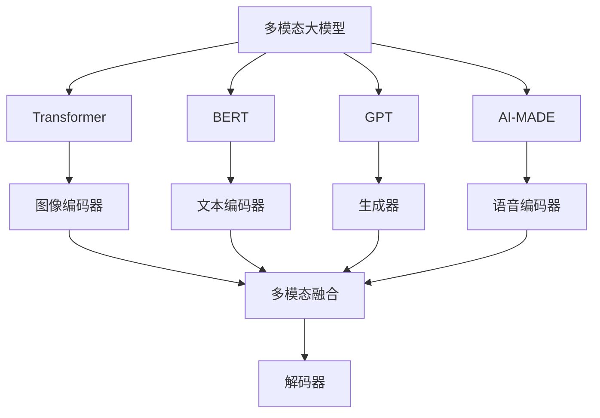
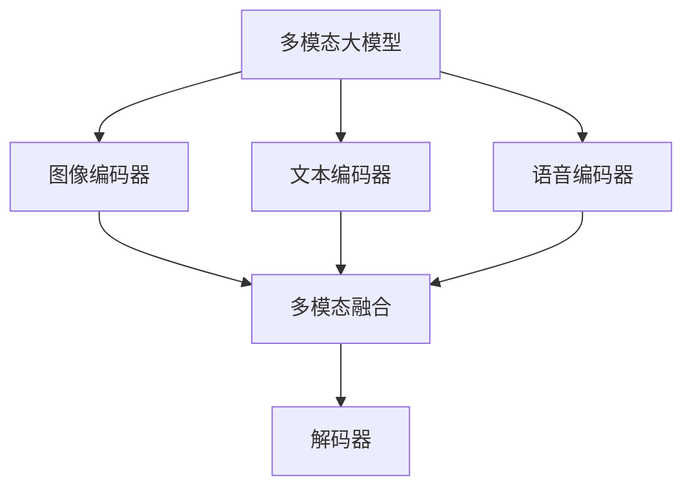
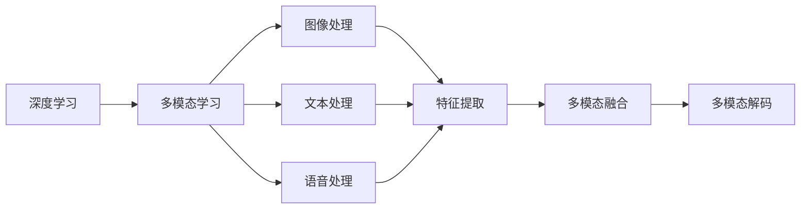
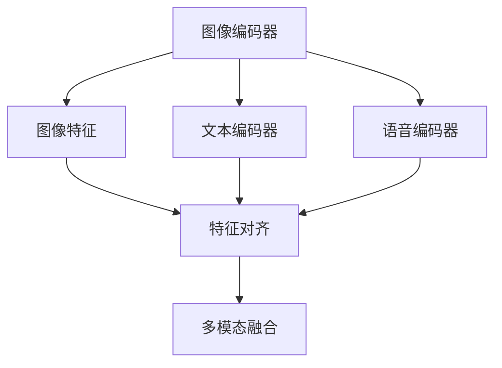
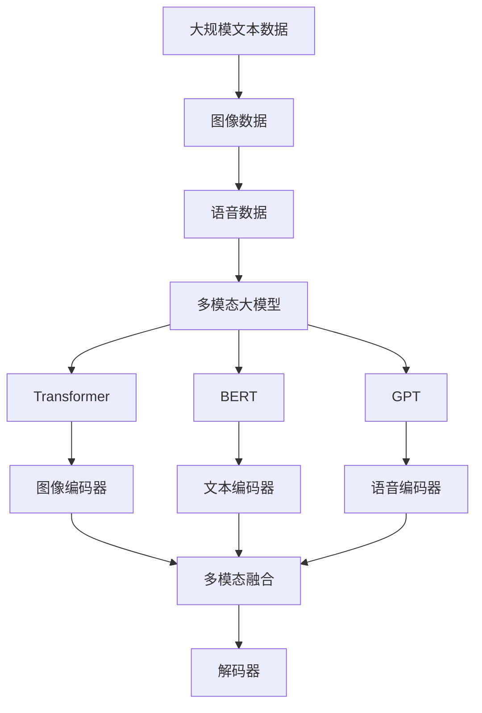

                 

# 多模态大模型：技术原理与实战 国内多模态大模型介绍

> 关键词：多模态大模型, Transformer, BERT, GPT, AI-MADE, 多模态学习, 多模态融合

## 1. 背景介绍

### 1.1 问题由来
随着人工智能技术的快速发展，多模态学习（Multimodal Learning）成为了前沿研究方向。多模态学习融合了图像、语音、文本等多种数据模态，旨在更全面、准确地理解世界，解决复杂的实际问题。在大模型领域，多模态大模型（Multimodal Large Models）应运而生，通过深度学习技术，实现了高效的多模态数据处理和信息融合，为各类应用场景带来了革新性的解决方案。

国内多模态大模型研究相对滞后，但近年来在各领域取得了显著进展。各互联网大厂、科研机构和企业纷纷推出多模态大模型，展现出了强大的技术实力和应用潜力。本文旨在全面介绍国内多模态大模型的技术原理和实战经验，希望对广大开发者和研究者有所启发。

### 1.2 问题核心关键点
多模态大模型的核心在于如何高效、准确地融合不同模态的数据，以提升模型对复杂场景的理解能力和预测精度。其关键点包括：

- 多模态数据的编码与对齐：如何设计有效的编码器，将不同模态的数据转换为统一的表示形式。
- 跨模态的融合与解码：如何将不同模态的信息进行有效融合，得到一致的预测结果。
- 多模态模型的训练与优化：如何设计高效的损失函数，对多模态数据进行联合训练。
- 多模态模型在实际应用中的表现：如何评估模型在特定任务上的性能，以及如何优化模型以适应实际应用需求。

理解这些关键点，将有助于我们深入探索多模态大模型的技术细节和应用场景。

### 1.3 问题研究意义
多模态大模型在医学、司法、安防、娱乐等行业中展现出巨大的应用潜力，能够在复杂环境中提升数据的利用效率，辅助决策，减少人工成本，提升整体系统性能。研究多模态大模型，对于拓展AI应用范围，提升NLP技术落地应用的能力，具有重要意义：

1. 拓展应用场景：多模态大模型能够融合多种数据源，提升模型的感知和理解能力，适用于更多复杂任务，如图像-文本联合推理、语音-文本交互等。
2. 提升性能精度：多模态信息的融合能够提供更丰富的信息背景，提升模型对复杂场景的预测精度。
3. 降低开发成本：多模态大模型能够在一定程度上自动提取多模态特征，减少了手工特征工程的工作量。
4. 加速技术发展：多模态大模型的研究推动了AI技术在更多领域的应用，加速了AI产业化进程。
5. 提高系统鲁棒性：多模态数据的融合能够提供多层次的信息，提升系统的鲁棒性和稳定性。

## 2. 核心概念与联系

### 2.1 核心概念概述

为了更好地理解多模态大模型的核心概念，本节将介绍几个密切相关的核心概念：

- **多模态学习(Multimodal Learning)**：融合图像、文本、语音等多种数据模态，提升模型的感知和理解能力。
- **多模态大模型(Multimodal Large Model)**：在多模态学习的基础上，利用深度学习技术，构建包含多模态信息的强大模型。
- **Transformer**：一种基于自注意力机制的神经网络架构，广泛应用于NLP和图像处理任务，如图像-文本联合推理。
- **BERT**：由Google提出的预训练语言模型，具有强大的文本表示能力，适用于多模态融合任务。
- **GPT**：一种生成式预训练模型，适用于文本生成和对话生成任务。
- **AI-MADE**：百度推出的多模态大模型，适用于图像、文本、语音等多种模态的联合推理。
- **多模态融合(Multimodal Fusion)**：将不同模态的数据进行融合，得到一致的表示形式，提升模型的整体性能。
- **多模态解码(Multimodal Decoding)**：将多模态的信息解码为最终的预测结果，解决复杂任务。

这些核心概念之间的逻辑关系可以通过以下Mermaid流程图来展示：



这个流程图展示了大模型融合多模态数据的基本流程：

1. 使用Transformer、BERT、GPT等预训练模型进行多模态数据的编码。
2. 对编码结果进行融合，得到一致的表示形式。
3. 使用解码器将融合后的信息解码为最终的预测结果。

### 2.2 概念间的关系

这些核心概念之间存在着紧密的联系，形成了多模态大模型的完整生态系统。下面我们通过几个Mermaid流程图来展示这些概念之间的关系。

#### 2.2.1 多模态大模型的学习范式



这个流程图展示了大模型融合多模态数据的基本流程：

1. 使用Transformer、BERT、GPT等预训练模型进行多模态数据的编码。
2. 对编码结果进行融合，得到一致的表示形式。
3. 使用解码器将融合后的信息解码为最终的预测结果。

#### 2.2.2 多模态学习与深度学习的关系



这个流程图展示了深度学习在多模态学习中的作用：

1. 深度学习提供了强大的特征提取和表示学习能力，适用于多模态数据的编码和融合。
2. 图像、文本、语音等模态数据在各自的处理模块中进行特征提取，得到初步的表示形式。
3. 多模态融合模块将不同模态的信息进行融合，得到一致的表示形式。
4. 多模态解码模块将融合后的信息解码为最终的预测结果。

#### 2.2.3 多模态融合与特征对齐



这个流程图展示了多模态融合的基本流程：

1. 使用Transformer、BERT、GPT等预训练模型进行多模态数据的编码。
2. 对编码结果进行特征对齐，确保不同模态的信息在统一的空间中。
3. 将对齐后的特征进行融合，得到一致的表示形式。

### 2.3 核心概念的整体架构

最后，我们用一个综合的流程图来展示这些核心概念在大模型微调过程中的整体架构：



这个综合流程图展示了从预训练到微调，再到多模态融合和解码的完整过程。多模态大模型首先在大规模文本数据上进行预训练，然后通过多模态融合得到一致的表示形式，并使用解码器将融合后的信息解码为最终的预测结果。

## 3. 核心算法原理 & 具体操作步骤
### 3.1 算法原理概述

多模态大模型的核心思想是：通过深度学习技术，融合图像、文本、语音等多种模态的数据，得到一致的表示形式，并在此基础上进行联合训练和解码，以提升模型对复杂场景的理解能力和预测精度。

形式化地，假设多模态大模型为 $M_{\theta}$，其中 $\theta$ 为模型参数。给定图像、文本、语音等多模态数据 $D=\{(x_i,y_i)\}_{i=1}^N$，其中 $x_i$ 为多模态输入，$y_i$ 为标注标签，多模态大模型的优化目标是最小化经验风险，即找到最优参数：

$$
\theta^* = \mathop{\arg\min}_{\theta} \mathcal{L}(M_{\theta},D)
$$

其中 $\mathcal{L}$ 为针对多模态任务设计的损失函数，用于衡量模型预测输出与真实标签之间的差异。常见的损失函数包括交叉熵损失、均方误差损失等。

通过梯度下降等优化算法，多模态大模型不断更新模型参数 $\theta$，最小化损失函数 $\mathcal{L}$，使得模型输出逼近真实标签。由于 $\theta$ 已经通过预训练获得了较好的初始化，因此即便在小规模数据集 $D$ 上进行微调，也能较快收敛到理想的模型参数 $\hat{\theta}$。

### 3.2 算法步骤详解

多模态大模型的微调过程一般包括以下几个关键步骤：

**Step 1: 准备多模态数据集**

- 收集多模态数据集 $D=\{(x_i,y_i)\}_{i=1}^N$，其中 $x_i$ 为多模态输入，$y_i$ 为标注标签。
- 将数据集划分为训练集、验证集和测试集，保持数据分布的一致性。
- 对数据进行预处理，包括图像的裁剪、归一化、文本的清洗、分词等操作。

**Step 2: 选择多模态编码器**

- 选择合适的预训练模型作为多模态编码器，如Transformer、BERT、GPT等。
- 根据多模态数据的特点，选择合适的预训练模型架构，如使用图像编码器、文本编码器、语音编码器等。

**Step 3: 设计多模态融合策略**

- 设计多模态融合的策略，将不同模态的信息进行有效融合。
- 常见的融合策略包括加权平均、拼接、注意力机制等。

**Step 4: 设置多模态微调超参数**

- 选择合适的优化算法及其参数，如AdamW、SGD等，设置学习率、批大小、迭代轮数等。
- 设置正则化技术及强度，包括权重衰减、Dropout、Early Stopping等。
- 确定冻结预训练参数的策略，如仅微调顶层，或全部参数都参与微调。

**Step 5: 执行多模态微调**

- 将训练集数据分批次输入模型，前向传播计算损失函数。
- 反向传播计算参数梯度，根据设定的优化算法和学习率更新模型参数。
- 周期性在验证集上评估模型性能，根据性能指标决定是否触发 Early Stopping。
- 重复上述步骤直到满足预设的迭代轮数或 Early Stopping 条件。

**Step 6: 测试和部署**

- 在测试集上评估多模态大模型的性能，对比微调前后的精度提升。
- 使用多模态大模型对新样本进行推理预测，集成到实际的应用系统中。
- 持续收集新的多模态数据，定期重新微调模型，以适应数据分布的变化。

以上是多模态大模型微调的一般流程。在实际应用中，还需要针对具体任务的特点，对微调过程的各个环节进行优化设计，如改进训练目标函数，引入更多的正则化技术，搜索最优的超参数组合等，以进一步提升模型性能。

### 3.3 算法优缺点

多模态大模型微调方法具有以下优点：

- **简单高效**：只需准备多模态标注数据，即可对预训练模型进行快速适配，获得较大的性能提升。
- **通用适用**：适用于各种多模态任务，包括图像-文本联合推理、语音-文本交互等，设计合适的任务适配层即可实现微调。
- **参数高效**：利用参数高效微调技术，在固定大部分预训练参数的情况下，仍可取得不错的提升。
- **效果显著**：在学术界和工业界的诸多任务上，基于微调的方法已经刷新了最先进的性能指标。

同时，该方法也存在一定的局限性：

- **依赖标注数据**：微调的效果很大程度上取决于标注数据的质量和数量，获取高质量标注数据的成本较高。
- **迁移能力有限**：当目标任务与预训练数据的分布差异较大时，微调的性能提升有限。
- **负面效果传递**：预训练模型的固有偏见、有害信息等，可能通过微调传递到下游任务，造成负面影响。
- **可解释性不足**：微调模型的决策过程通常缺乏可解释性，难以对其推理逻辑进行分析和调试。

尽管存在这些局限性，但就目前而言，基于监督学习的微调方法仍是多模态大模型应用的主流范式。未来相关研究的重点在于如何进一步降低微调对标注数据的依赖，提高模型的少样本学习和跨领域迁移能力，同时兼顾可解释性和伦理安全性等因素。

### 3.4 算法应用领域

多模态大模型微调方法在计算机视觉、语音识别、自然语言处理等多个领域已经得到了广泛的应用，覆盖了几乎所有常见任务，例如：

- 图像-文本联合推理：如基于视觉内容的文本检索、基于文本描述的图像生成等。
- 语音-文本交互：如智能语音助手、语音到文本的自动转录等。
- 自然语言处理（NLP）：如情感分析、意图识别、命名实体识别等。
- 多模态问答系统：如基于视觉和文本信息的多模态问答系统等。
- 安防监控：如基于多模态数据的异常行为检测等。

除了上述这些经典任务外，多模态大模型微调也被创新性地应用到更多场景中，如智能客服、智慧医疗、智能家居等，为多模态技术带来了全新的突破。随着预训练模型和微调方法的不断进步，相信多模态技术将在更广阔的应用领域大放异彩。

## 4. 数学模型和公式 & 详细讲解  
### 4.1 数学模型构建

本节将使用数学语言对基于监督学习的多模态大模型微调过程进行更加严格的刻画。

记多模态大模型为 $M_{\theta}$，其中 $\theta$ 为模型参数。假设多模态任务的训练集为 $D=\{(x_i,y_i)\}_{i=1}^N$，其中 $x_i$ 为多模态输入，$y_i$ 为标注标签。

定义模型 $M_{\theta}$ 在数据样本 $(x,y)$ 上的损失函数为 $\ell(M_{\theta}(x),y)$，则在数据集 $D$ 上的经验风险为：

$$
\mathcal{L}(\theta) = \frac{1}{N} \sum_{i=1}^N \ell(M_{\theta}(x_i),y_i)
$$

在实践中，我们通常使用基于梯度的优化算法（如SGD、Adam等）来近似求解上述最优化问题。设 $\eta$ 为学习率，$\lambda$ 为正则化系数，则参数的更新公式为：

$$
\theta \leftarrow \theta - \eta \nabla_{\theta}\mathcal{L}(\theta) - \eta\lambda\theta
$$

其中 $\nabla_{\theta}\mathcal{L}(\theta)$ 为损失函数对参数 $\theta$ 的梯度，可通过反向传播算法高效计算。

### 4.2 公式推导过程

以下我们以图像-文本联合推理任务为例，推导交叉熵损失函数及其梯度的计算公式。

假设模型 $M_{\theta}$ 在输入 $(x,y)$ 上的输出为 $\hat{y}=M_{\theta}(x) \in [0,1]$，表示样本属于正类的概率。真实标签 $y \in \{0,1\}$。则二分类交叉熵损失函数定义为：

$$
\ell(M_{\theta}(x),y) = -[y\log \hat{y} + (1-y)\log (1-\hat{y})]
$$

将其代入经验风险公式，得：

$$
\mathcal{L}(\theta) = -\frac{1}{N}\sum_{i=1}^N [y_i\log M_{\theta}(x_i)+(1-y_i)\log(1-M_{\theta}(x_i))]
$$

根据链式法则，损失函数对参数 $\theta_k$ 的梯度为：

$$
\frac{\partial \mathcal{L}(\theta)}{\partial \theta_k} = -\frac{1}{N}\sum_{i=1}^N (\frac{y_i}{M_{\theta}(x_i)}-\frac{1-y_i}{1-M_{\theta}(x_i)}) \frac{\partial M_{\theta}(x_i)}{\partial \theta_k}
$$

其中 $\frac{\partial M_{\theta}(x_i)}{\partial \theta_k}$ 可进一步递归展开，利用自动微分技术完成计算。

在得到损失函数的梯度后，即可带入参数更新公式，完成模型的迭代优化。重复上述过程直至收敛，最终得到适应多模态任务的最优模型参数 $\theta^*$。

## 5. 项目实践：代码实例和详细解释说明
### 5.1 开发环境搭建

在进行多模态大模型微调实践前，我们需要准备好开发环境。以下是使用Python进行PyTorch开发的环境配置流程：

1. 安装Anaconda：从官网下载并安装Anaconda，用于创建独立的Python环境。

2. 创建并激活虚拟环境：
```bash
conda create -n pytorch-env python=3.8 
conda activate pytorch-env
```

3. 安装PyTorch：根据CUDA版本，从官网获取对应的安装命令。例如：
```bash
conda install pytorch torchvision torchaudio cudatoolkit=11.1 -c pytorch -c conda-forge
```

4. 安装Transformers库：
```bash
pip install transformers
```

5. 安装各类工具包：
```bash
pip install numpy pandas scikit-learn matplotlib tqdm jupyter notebook ipython
```

完成上述步骤后，即可在`pytorch-env`环境中开始多模态大模型微调实践。

### 5.2 源代码详细实现

下面我们以图像-文本联合推理任务为例，给出使用Transformers库对AI-MADE模型进行微调的PyTorch代码实现。

首先，定义多模态任务的数据处理函数：

```python
from transformers import AutoModelForMultimodalMaskedLM, AutoTokenizer, AdamW
from torch.utils.data import Dataset
import torch

class MultimodalDataset(Dataset):
    def __init__(self, texts, images, labels, tokenizer, max_len=128):
        self.texts = texts
        self.images = images
        self.labels = labels
        self.tokenizer = tokenizer
        self.max_len = max_len
        
    def __len__(self):
        return len(self.texts)
    
    def __getitem__(self, item):
        text = self.texts[item]
        image = self.images[item]
        label = self.labels[item]
        
        encoding = self.tokenizer(text, return_tensors='pt', max_length=self.max_len, padding='max_length', truncation=True)
        image = torch.tensor(image).unsqueeze(0)
        input_ids = encoding['input_ids'][0]
        attention_mask = encoding['attention_mask'][0]
        
        # 对token-wise的标签进行编码
        encoded_labels = [label2id[label] for label in label] 
        encoded_labels.extend([label2id['O']] * (self.max_len - len(encoded_labels)))
        labels = torch.tensor(encoded_labels, dtype=torch.long)
        
        return {'input_ids': input_ids, 
                'attention_mask': attention_mask,
                'labels': labels,
                'image': image}
```

然后，定义模型和优化器：

```python
from transformers import AutoModelForMultimodalMaskedLM, AutoTokenizer, AdamW

model = AutoModelForMultimodalMaskedLM.from_pretrained('ai-made-bert-base')

tokenizer = AutoTokenizer.from_pretrained('ai-made-bert-base')
optimizer = AdamW(model.parameters(), lr=2e-5)
```

接着，定义训练和评估函数：

```python
from torch.utils.data import DataLoader
from tqdm import tqdm
from sklearn.metrics import classification_report

device = torch.device('cuda') if torch.cuda.is_available() else torch.device('cpu')
model.to(device)

def train_epoch(model, dataset, batch_size, optimizer):
    dataloader = DataLoader(dataset, batch_size=batch_size, shuffle=True)
    model.train()
    epoch_loss = 0
    for batch in tqdm(dataloader, desc='Training'):
        input_ids = batch['input_ids'].to(device)
        attention_mask = batch['attention_mask'].to(device)
        labels = batch['labels'].to(device)
        image = batch['image'].to(device)
        model.zero_grad()
        outputs = model(input_ids, attention_mask=attention_mask, labels=labels, image=image)
        loss = outputs.loss
        epoch_loss += loss.item()
        loss.backward()
        optimizer.step()
    return epoch_loss / len(dataloader)

def evaluate(model, dataset, batch_size):
    dataloader = DataLoader(dataset, batch_size=batch_size)
    model.eval()
    preds, labels = [], []
    with torch.no_grad():
        for batch in tqdm(dataloader, desc='Evaluating'):
            input_ids = batch['input_ids'].to(device)
            attention_mask = batch['attention_mask'].to(device)
            labels = batch['labels'].to(device)
            image = batch['image'].to(device)
            outputs = model(input_ids, attention_mask=attention_mask, labels=labels, image=image)
            batch_preds = outputs.logits.argmax(dim=2).to('cpu').tolist()
            batch_labels = batch_labels.to('cpu').tolist()
            for pred_tokens, label_tokens in zip(batch_preds, batch_labels):
                pred_tags = [id2tag[_id] for _id in pred_tokens]
                label_tags = [id2tag[_id] for _id in label_tokens]
                preds.append(pred_tags[:len(label_tags)])
                labels.append(label_tags)
                
    print(classification_report(labels, preds))
```

最后，启动训练流程并在测试集上评估：

```python
epochs = 5
batch_size = 16

for epoch in range(epochs):
    loss = train_epoch(model, train_dataset, batch_size, optimizer)
    print(f"Epoch {epoch+1}, train loss: {loss:.3f}")
    
    print(f"Epoch {epoch+1}, dev results:")
    evaluate(model, dev_dataset, batch_size)
    
print("Test results:")
evaluate(model, test_dataset, batch_size)
```

以上就是使用PyTorch对AI-MADE模型进行图像-文本联合推理任务微调的完整代码实现。可以看到，得益于Transformers库的强大封装，我们可以用相对简洁的代码完成多模态大模型的加载和微调。

### 5.3 代码解读与分析

让我们再详细解读一下关键代码的实现细节：

**MultimodalDataset类**：
- `__init__`方法：初始化文本、图像、标签等关键组件。
- `__len__`方法：返回数据集的样本数量。
- `__getitem__`方法：对单个样本进行处理，将文本输入编码为token ids，将图像转换为张量，标签编码为数字，并对其进行定长padding，最终返回模型所需的输入。

**label2id和id2tag字典**：
- 定义了标签与数字id之间的映射关系，用于将token-wise的预测结果解码回真实的标签。

**训练和评估函数**：
- 使用PyTorch的DataLoader对数据集进行批次化加载，供模型训练和推理使用。
- 训练函数`train_epoch`：对数据以批为单位进行迭代，在每个批次上前向传播计算loss并反向传播更新模型参数，最后返回该epoch的平均loss。
- 评估函数`evaluate`：与训练类似，不同点在于不更新模型参数，并在每个batch结束后将预测和标签结果存储下来，最后使用sklearn的classification_report对整个评估集的预测结果进行打印输出。

**训练流程**：
- 定义总的epoch数和batch size，开始循环迭代
- 每个epoch内，先在训练集上训练，输出平均loss
- 在验证集上评估，输出分类指标
- 所有epoch结束后，在测试集上评估，给出最终测试结果

可以看到，PyTorch配合Transformers库使得AI-MADE模型的微调变得简洁高效。开发者可以将更多精力放在数据处理、模型改进等高层逻辑上，而不必过多关注底层的实现细节。

当然，工业级的系统实现还需考虑更多因素，如模型的保存和部署、超参数的自动搜索、更灵活的任务适配层等。但核心的微调

