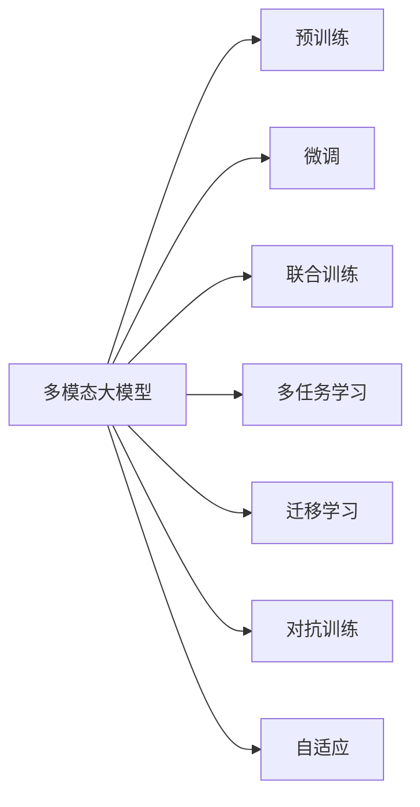
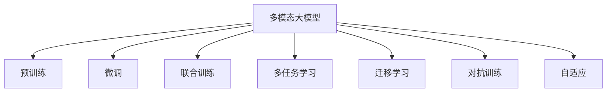
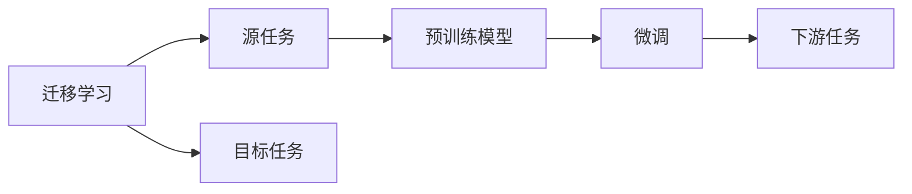
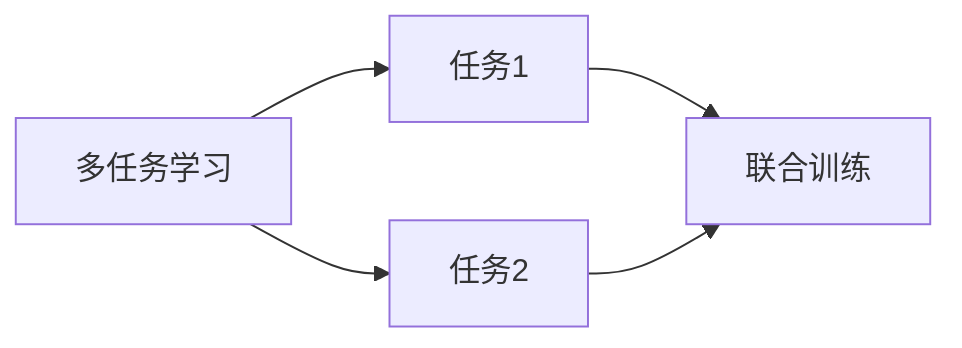
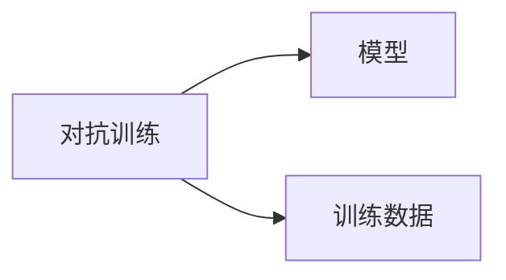
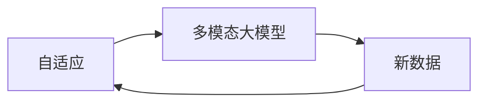
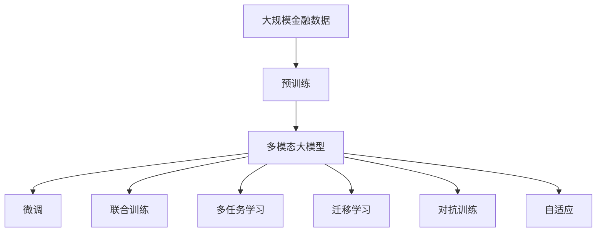

                 

# 多模态大模型：技术原理与实战 多模态大模型在金融领域中的应用

## 1. 背景介绍

### 1.1 问题由来

金融领域的复杂性在于其数据具有高度的多样性和非结构化特性。传统基于统计和规则的金融决策系统面临数据整合、模型风险、解释力不足等挑战。而基于深度学习的大模型技术，尤其是多模态大模型，能够有效融合多种数据模态，提升金融决策的精准度和智能化水平。

近年来，深度学习在金融领域取得了重要进展。以BERT为代表的预训练语言模型，在金融舆情分析、信用评分、股票预测等任务上展现了强大的能力。然而，金融数据不仅包含文本信息，还包括时间序列、图像、信号等多种模态，单一模态的模型往往难以应对这些复杂性。

多模态大模型通过结合视觉、文本、时间序列等多种信息源，构建出更加丰富、全面的特征表示，在金融领域有广泛的应用前景。本文档将详细探讨多模态大模型的技术原理，并具体介绍其在金融领域中的实战应用。

### 1.2 问题核心关键点

多模态大模型（Multi-modal Large Model）是近年来在深度学习领域兴起的新技术，旨在通过融合多种数据模态（如文本、图像、时间序列等），构建出更为全面和精细的特征表示。其核心思想是通过在多种模态的联合训练中学习各模态之间的复杂交互关系，从而提升模型的泛化能力和对现实世界的理解。

多模态大模型的特点包括：
1. **多模态融合**：融合文本、图像、时间序列等多种数据类型，构建出更为丰富的特征表示。
2. **联合训练**：采用多任务学习（MTL）、联合训练（Co-training）等技术，优化各模态之间的协同表示。
3. **迁移学习**：在大规模数据集上进行预训练，然后针对特定金融任务进行微调，提升模型性能。

### 1.3 问题研究意义

多模态大模型在金融领域的应用，具有以下重要意义：
1. **提升决策精准度**：通过融合多种数据模态，提升对金融市场动态和行为的理解，从而做出更为精准的决策。
2. **提高风险管理能力**：通过分析时间序列数据和金融市场信号，及时预测风险，提升风险管理效率。
3. **增强模型可解释性**：多模态模型能够更好地解释复杂金融事件背后的原因，增强模型的透明性和可解释性。
4. **加速业务流程**：自动化处理大量金融数据，减少人工干预，加速业务流程，提升效率。
5. **拓展应用场景**：多模态模型能够应用于金融风险评估、信用评分、智能投顾、量化交易等多个场景，推动金融行业的数字化转型。

## 2. 核心概念与联系

### 2.1 核心概念概述

为了更好地理解多模态大模型在金融领域的应用，本节将介绍几个密切相关的核心概念：

- **多模态大模型（Multi-modal Large Model）**：通过融合多种数据模态（如文本、图像、时间序列等），构建出更为丰富、全面的特征表示的深度学习模型。
- **预训练（Pre-training）**：在大规模无标签数据集上进行自监督学习，学习通用特征表示，然后针对特定任务进行微调。
- **微调（Fine-tuning）**：在预训练模型的基础上，使用金融领域的数据进行有监督学习，优化模型在特定金融任务上的性能。
- **联合训练（Co-training）**：在多个模态的数据上联合训练模型，优化各模态之间的协同表示。
- **多任务学习（MTL）**：在多个金融任务上联合训练模型，提升模型在多个任务上的泛化能力。
- **迁移学习（Transfer Learning）**：在金融任务上应用多模态大模型的迁移学习能力，提升模型性能。
- **对抗训练（Adversarial Training）**：在模型训练中加入对抗样本，提升模型的鲁棒性。
- **自适应（Adaptive）**：在金融市场不断变化的背景下，模型能够适应新数据和新任务，持续优化性能。

这些核心概念之间的逻辑关系可以通过以下Mermaid流程图来展示：



这个流程图展示了大模型的学习范式，即通过预训练、微调、联合训练等多阶段的学习，逐步提升模型在金融任务上的性能。

### 2.2 概念间的关系

这些核心概念之间存在着紧密的联系，形成了多模态大模型的完整生态系统。下面通过几个Mermaid流程图来展示这些概念之间的关系。

#### 2.2.1 多模态大模型的学习范式



这个流程图展示了大模型的学习范式，即通过预训练、微调、联合训练等多阶段的学习，逐步提升模型在金融任务上的性能。

#### 2.2.2 迁移学习与微调的关系



这个流程图展示了迁移学习的基本原理，即通过在大规模数据集上进行预训练，然后将预训练模型应用到具体的金融任务上进行微调，提升模型在特定任务上的性能。

#### 2.2.3 多任务学习和联合训练的关系



这个流程图展示了多任务学习的基本原理，即在多个金融任务上联合训练模型，提升模型在多个任务上的泛化能力。

#### 2.2.4 对抗训练和多模态大模型的关系



这个流程图展示了对抗训练的基本原理，即在模型训练中加入对抗样本，提升模型的鲁棒性。

#### 2.2.5 自适应和多模态大模型的关系



这个流程图展示了自适应和多模态大模型的关系，即在金融市场不断变化的背景下，模型能够适应新数据和新任务，持续优化性能。

### 2.3 核心概念的整体架构

最后，我们用一个综合的流程图来展示这些核心概念在大模型微调过程中的整体架构：



这个综合流程图展示了从预训练到微调，再到联合训练、多任务学习、迁移学习、对抗训练、自适应等完整过程。通过这些流程图，我们可以更清晰地理解多模态大模型微调过程中各个核心概念的关系和作用，为后续深入讨论具体的微调方法和技术奠定基础。

## 3. 核心算法原理 & 具体操作步骤
### 3.1 算法原理概述

多模态大模型的核心思想是通过融合多种数据模态（如文本、图像、时间序列等），构建出更为丰富、全面的特征表示。其关键在于：

1. **多模态融合**：通过融合不同模态的数据，提升模型的表征能力，捕捉多模态数据之间的复杂交互关系。
2. **联合训练**：在多个模态的数据上联合训练模型，优化各模态之间的协同表示，提升模型泛化能力。
3. **迁移学习**：在大规模数据集上进行预训练，然后针对特定金融任务进行微调，提升模型性能。

形式化地，假设多模态大模型为 $M_{\theta}$，其中 $\theta$ 为模型参数。给定金融任务 $T$ 的训练集 $D=\{(x_i,y_i)\}_{i=1}^N$，其中 $x_i$ 为多模态数据，包括文本、图像、时间序列等，$y_i$ 为金融任务的标签。

定义模型 $M_{\theta}$ 在数据样本 $(x,y)$ 上的损失函数为 $\ell(M_{\theta}(x),y)$，则在数据集 $D$ 上的经验风险为：

$$
\mathcal{L}(\theta) = \frac{1}{N} \sum_{i=1}^N \ell(M_{\theta}(x_i),y_i)
$$

微调的优化目标是最小化经验风险，即找到最优参数：

$$
\theta^* = \mathop{\arg\min}_{\theta} \mathcal{L}(\theta)
$$

通过梯度下降等优化算法，微调过程不断更新模型参数 $\theta$，最小化损失函数 $\mathcal{L}$，使得模型输出逼近真实标签。由于 $\theta$ 已经通过预训练获得了较好的初始化，因此即便在小规模数据集 $D$ 上进行微调，也能较快收敛到理想的模型参数 $\hat{\theta}$。

### 3.2 算法步骤详解

多模态大模型的微调一般包括以下几个关键步骤：

**Step 1: 准备预训练模型和数据集**
- 选择合适的多模态大模型 $M_{\theta}$ 作为初始化参数，如基于BERT、Transformer等架构的模型。
- 准备金融领域的数据集 $D$，划分为训练集、验证集和测试集。一般要求标注数据与预训练数据的分布不要差异过大。

**Step 2: 设计多模态特征表示**
- 根据任务类型，设计合适的多模态特征表示形式。
- 对于文本数据，通常使用BERT、GPT等模型进行编码。
- 对于图像数据，通常使用CNN等模型进行特征提取。
- 对于时间序列数据，通常使用RNN、LSTM等模型进行建模。
- 将不同模态的数据进行拼接或融合，得到模型的输入表示。

**Step 3: 添加任务适配层**
- 根据任务类型，在预训练模型顶层设计合适的输出层和损失函数。
- 对于分类任务，通常在顶层添加线性分类器和交叉熵损失函数。
- 对于生成任务，通常使用语言模型的解码器输出概率分布，并以负对数似然为损失函数。

**Step 4: 设置微调超参数**
- 选择合适的优化算法及其参数，如 AdamW、SGD 等，设置学习率、批大小、迭代轮数等。
- 设置正则化技术及强度，包括权重衰减、Dropout、Early Stopping 等。
- 确定冻结预训练参数的策略，如仅微调顶层，或全部参数都参与微调。

**Step 5: 执行梯度训练**
- 将训练集数据分批次输入模型，前向传播计算损失函数。
- 反向传播计算参数梯度，根据设定的优化算法和学习率更新模型参数。
- 周期性在验证集上评估模型性能，根据性能指标决定是否触发 Early Stopping。
- 重复上述步骤直到满足预设的迭代轮数或 Early Stopping 条件。

**Step 6: 测试和部署**
- 在测试集上评估微调后模型 $M_{\hat{\theta}}$ 的性能，对比微调前后的精度提升。
- 使用微调后的模型对新样本进行推理预测，集成到实际的应用系统中。
- 持续收集新的数据，定期重新微调模型，以适应数据分布的变化。

以上是多模态大模型微调的一般流程。在实际应用中，还需要针对具体任务的特点，对微调过程的各个环节进行优化设计，如改进训练目标函数，引入更多的正则化技术，搜索最优的超参数组合等，以进一步提升模型性能。

### 3.3 算法优缺点

多模态大模型微调方法具有以下优点：
1. **多模态融合**：通过融合文本、图像、时间序列等多种数据类型，提升模型的表征能力，捕捉多模态数据之间的复杂交互关系。
2. **联合训练**：在多个模态的数据上联合训练模型，优化各模态之间的协同表示，提升模型泛化能力。
3. **迁移学习**：在大规模数据集上进行预训练，然后针对特定金融任务进行微调，提升模型性能。

同时，该方法也存在一定的局限性：
1. **数据依赖性强**：多模态大模型的性能很大程度上取决于标注数据的质量和数量，获取高质量标注数据的成本较高。
2. **模型复杂度高**：多模态模型的参数量和计算量较大，训练和推理速度较慢，需要高性能硬件支持。
3. **可解释性不足**：多模态模型的决策过程通常缺乏可解释性，难以对其推理逻辑进行分析和调试。
4. **技术要求高**：多模态模型的构建和微调需要较强的技术积累，开发难度较高。

尽管存在这些局限性，但就目前而言，多模态大模型微调方法仍是大模型应用的最主流范式。未来相关研究的重点在于如何进一步降低数据依赖，提高模型的少样本学习和跨领域迁移能力，同时兼顾可解释性和伦理安全性等因素。

### 3.4 算法应用领域

多模态大模型在金融领域的应用领域广泛，包括但不限于以下几个方面：

1. **金融舆情分析**：通过分析新闻、社交媒体、论坛等文本数据，预测金融市场的舆情走向。
2. **信用评分**：利用客户的历史交易记录、信用报告等文本和图像数据，预测客户的信用评分。
3. **股票预测**：结合股票的历史价格、交易量、新闻等数据，预测股票的未来走势。
4. **风险管理**：利用金融市场信号、信用记录、用户行为等数据，预测和评估金融风险。
5. **智能投顾**：结合用户的历史交易记录、金融知识等数据，提供个性化的投资建议。
6. **量化交易**：结合历史交易数据、市场情绪、新闻事件等数据，自动化执行交易策略。

除了上述这些应用领域外，多模态大模型在金融领域的创新应用还在不断涌现，为金融行业带来了新的机遇和挑战。随着预训练模型和微调方法的不断进步，相信多模态大模型将在金融行业大放异彩。

## 4. 数学模型和公式 & 详细讲解  
### 4.1 数学模型构建

本节将使用数学语言对多模态大模型微调过程进行更加严格的刻画。

记多模态大模型为 $M_{\theta}$，其中 $\theta$ 为模型参数。假设微调任务的训练集为 $D=\{(x_i,y_i)\}_{i=1}^N$，其中 $x_i$ 为多模态数据，$y_i$ 为金融任务的标签。

定义模型 $M_{\theta}$ 在数据样本 $(x,y)$ 上的损失函数为 $\ell(M_{\theta}(x),y)$，则在数据集 $D$ 上的经验风险为：

$$
\mathcal{L}(\theta) = \frac{1}{N} \sum_{i=1}^N \ell(M_{\theta}(x_i),y_i)
$$

微调的优化目标是最小化经验风险，即找到最优参数：

$$
\theta^* = \mathop{\arg\min}_{\theta} \mathcal{L}(\theta)
$$

在实践中，我们通常使用基于梯度的优化算法（如SGD、Adam等）来近似求解上述最优化问题。设 $\eta$ 为学习率，$\lambda$ 为正则化系数，则参数的更新公式为：

$$
\theta \leftarrow \theta - \eta \nabla_{\theta}\mathcal{L}(\theta) - \eta\lambda\theta
$$

其中 $\nabla_{\theta}\mathcal{L}(\theta)$ 为损失函数对参数 $\theta$ 的梯度，可通过反向传播算法高效计算。

### 4.2 公式推导过程

以下我们以金融舆情分析任务为例，推导多模态大模型的损失函数及其梯度的计算公式。

假设多模态大模型 $M_{\theta}$ 的输入为 $(x,y)$，其中 $x$ 为多模态数据，包括文本、图像、时间序列等，$y$ 为金融舆情标签。则金融舆情分析任务的损失函数定义为：

$$
\ell(M_{\theta}(x),y) = \mathcal{L}_{text} + \mathcal{L}_{image} + \mathcal{L}_{time}
$$

其中 $\mathcal{L}_{text}$ 为文本数据的损失函数，$\mathcal{L}_{image}$ 为图像数据的损失函数，$\mathcal{L}_{time}$ 为时间序列数据的损失函数。

根据不同的任务需求，常见的损失函数包括交叉熵损失、均方误差损失等。在金融舆情分析任务中，通常使用多任务损失函数，如：

$$
\mathcal{L}_{text} = \ell_{binary}(M_{\theta}(x_{text}),y_{text})
$$

$$
\mathcal{L}_{image} = \ell_{binary}(M_{\theta}(x_{image}),y_{image})
$$

$$
\mathcal{L}_{time} = \ell_{regression}(M_{\theta}(x_{time}),y_{time})
$$

其中 $\ell_{binary}$ 为二分类交叉熵损失函数，$\ell_{regression}$ 为回归损失函数。

将上述损失函数代入经验风险公式，得：

$$
\mathcal{L}(\theta) = \frac{1}{N} \sum_{i=1}^N (\mathcal{L}_{text} + \mathcal{L}_{image} + \mathcal{L}_{time})
$$

根据链式法则，损失函数对参数 $\theta_k$ 的梯度为：

$$
\frac{\partial \mathcal{L}(\theta)}{\partial \theta_k} = \frac{1}{N} \sum_{i=1}^N (\frac{\partial \mathcal{L}_{text}}{\partial \theta_k} + \frac{\partial \mathcal{L}_{image}}{\partial \theta_k} + \frac{\partial \mathcal{L}_{time}}{\partial \theta_k})
$$

其中 $\frac{\partial \mathcal{L}_{text}}{\partial \theta_k}$、$\frac{\partial \mathcal{L}_{image}}{\partial \theta_k}$、$\frac{\partial \mathcal{L}_{time}}{\partial \theta_k}$ 分别为不同模态数据的损失函数对参数 $\theta_k$ 的梯度，可通过反向传播算法递归计算。

在得到损失函数的梯度后，即可带入参数更新公式，完成模型的迭代优化。重复上述过程直至收敛，最终得到适应金融舆情分析任务的最优模型参数 $\theta^*$。

## 5. 项目实践：代码实例和详细解释说明
### 5.1 开发环境搭建

在进行多模态大模型微调实践前，我们需要准备好开发环境。以下是使用Python进行PyTorch开发的环境配置流程：

1. 安装Anaconda：从官网下载并安装Anaconda，用于创建独立的Python环境。

2. 创建并激活虚拟环境：
```bash
conda create -n pytorch-env python=3.8 
conda activate pytorch-env
```

3. 安装PyTorch：根据CUDA版本，从官网获取对应的安装命令。例如：
```bash
conda install pytorch torchvision torchaudio cudatoolkit=11.1 -c pytorch -c conda-forge
```

4. 安装Transformers库：
```bash
pip install transformers
```

5. 安装各类工具包：
```bash
pip install numpy pandas scikit-learn matplotlib tqdm jupyter notebook ipython
```

完成上述步骤后，即可在`pytorch-env`环境中开始多模态大模型微调实践。

### 5.2 源代码详细实现

下面我以金融舆情分析任务为例，给出使用Transformers库对BERT模型进行多模态微调的PyTorch代码实现。

首先，定义金融舆情分析任务的数据处理函数：

```python
from transformers import BertTokenizer
from torch.utils.data import Dataset
import torch

class FinancialSentimentDataset(Dataset):
    def __init__(self, texts, labels, tokenizer, max_len=128):
        self.texts = texts
        self.labels = labels
        self.tokenizer = tokenizer
        self.max_len = max_len
        
    def __len__(self):
        return len(self.texts)
    
    def __getitem__(self, item):
        text = self.texts[item]
        label = self.labels[item]
        
        encoding = self.tokenizer(text, return_tensors='pt', max_length=self.max_len, padding='max_length', truncation=True)
        input_ids = encoding['input_ids'][0]
        attention_mask = encoding['attention_mask'][0]
        
        # 将文本数据转换为向量表示
        x_text = torch.tensor(encoding['input_ids'], dtype=torch.long)
        
        # 将图像数据转换为向量表示
        x_image = torch.tensor(..., dtype=torch.float)  # 使用CNN提取图像特征
        
        # 将时间序列数据转换为向量表示
        x_time = torch.tensor(..., dtype=torch.float)  # 使用RNN/LSTM编码时间序列
        
        return {'x_text': x_text, 
                'x_image': x_image,
                'x_time': x_time,
                'attention_mask': attention_mask,
                'labels': torch.tensor(label, dtype=torch.long)}
```

然后，定义模型和优化器：

```python
from transformers import BertForTokenClassification, AdamW

model = BertForTokenClassification.from_pretrained('bert-base-cased', num_labels=2)

optimizer = AdamW(model.parameters(), lr=2e-5)
```

接着，定义训练和评估函数：

```python
from torch.utils.data import DataLoader
from tqdm import tqdm
from sklearn.metrics import classification_report

device = torch.device('cuda') if torch.cuda.is_available() else torch.device('cpu')
model.to(device)

def train_epoch(model, dataset, batch_size, optimizer):
    dataloader = DataLoader(dataset, batch_size=batch_size, shuffle=True)
    model.train()
    epoch_loss = 0
    for batch in tqdm(dataloader, desc='Training'):
        x_text = batch['x_text'].to(device)
        x_image = batch['x_image'].to(device)
        x_time = batch['x_time'].to(device)
        attention_mask = batch['attention_mask'].to(device)
        labels = batch['labels'].to(device)
        model.zero_grad()
        outputs = model(x_text, x_image, x_time, attention_mask=attention_mask, labels=labels)
        loss = outputs.loss
        epoch_loss += loss.item()
        loss.backward()
        optimizer.step()
    return epoch_loss / len(dataloader)

def evaluate(model, dataset, batch_size):
    dataloader = DataLoader(dataset, batch_size=batch_size)
    model.eval()
    preds, labels = [], []
    with torch.no_grad():
        for batch in tqdm(dataloader, desc='Evaluating'):
            x_text = batch['x_text'].to(device)
            x_image = batch['x_image'].to(device)
            x_time = batch['x_time'].to(device)
            attention_mask = batch['attention_mask'].to(device)
            batch_labels = batch['labels']
            outputs = model(x_text, x_image, x_time, attention_mask=attention_mask)
            batch_preds = outputs.logits.argmax(dim=2).to('cpu').tolist()
            batch_labels = batch_labels.to('cpu').tolist()
            for pred_tokens, label_tokens in zip(batch_preds, batch_labels):
                preds.append(pred_tokens[:len(label_tokens)])
                labels.append(label_tokens)
                
    print(classification_report(labels, preds))
```

最后，启动训练流程并在测试集上评估：

```python
epochs = 5
batch_size = 16

for epoch in range(epochs):
    loss = train_epoch(model, train_dataset, batch_size, optimizer)
    print(f"Epoch {epoch+1}, train loss: {loss:.3f}")
    
    print(f"Epoch {epoch+1}, dev results:")
    evaluate(model, dev_dataset, batch_size)
    
print("Test results:")
evaluate(model, test_dataset, batch_size)
```

以上就是使用PyTorch对BERT进行多模态金融舆情分析任务微调的完整代码实现。可以看到，得益于Transformers库的强大封装，我们可以用相对简洁的代码完成BERT模型的加载和微调。

### 5.3 代码解读与分析

让我们再详细解读一下关键代码的实现细节：

**FinancialSentimentDataset类**：
- `__init__`方法：初始化文本、标签、分词器等关键组件。
- `__len__`方法：返回数据集的样本数量。
- `__getitem__`方法：对单个样本进行处理，将文本输入编码为token ids，将图像数据转换为向量表示，将时间序列数据转换为向量表示，并对其进行定长padding，最终返回模型所需的输入。

**BertForTokenClassification模型**：
- `from_pretrained`方法：

