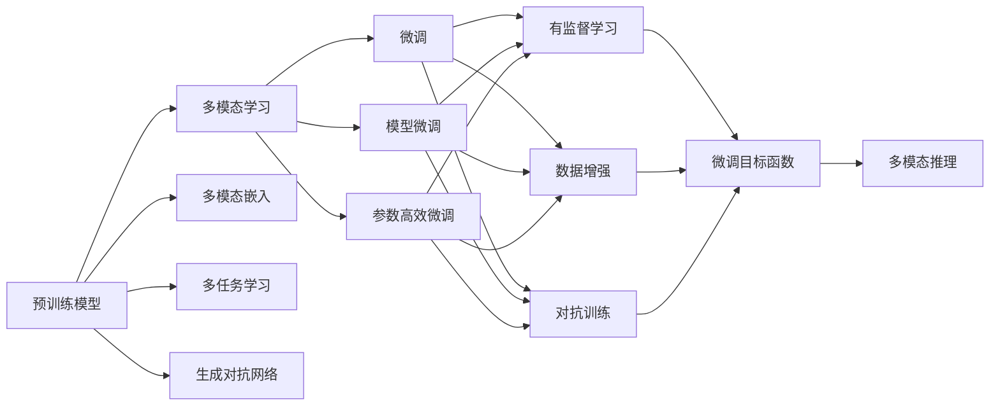
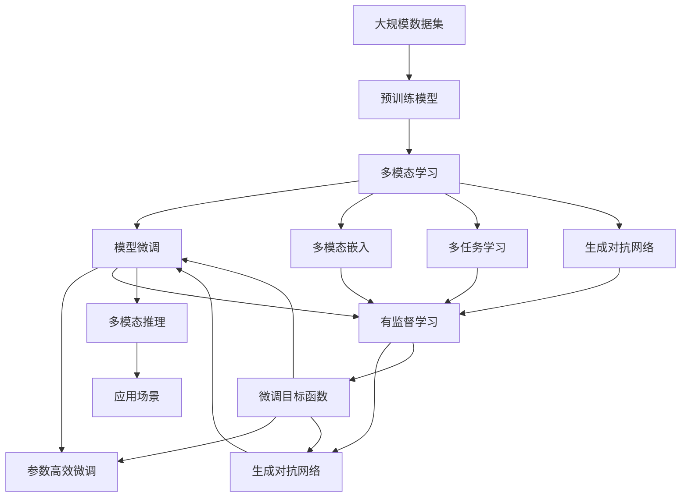

                 

# 多模态大模型：技术原理与实战 大模型在软件研发领域的实战案例与前沿探索

> 关键词：多模态大模型,模型微调,多模态学习,深度学习,软件研发,技术案例,前沿探索

## 1. 背景介绍

### 1.1 问题由来

近年来，随着深度学习技术的飞速发展，多模态大模型（Multi-modal Large Models）在自然语言处理（NLP）、计算机视觉（CV）、语音识别（ASR）等众多领域取得了显著进展。这些大模型通过在多个模态（如文本、图像、音频）上预训练，能够综合处理多源信息，具有强大的数据表征能力和跨模态融合能力。

然而，由于多模态数据的复杂性和多样性，多模态大模型的训练和优化面临诸多挑战。传统的方法往往是单独对每个模态进行预训练，然后通过简单的拼接或组合进行跨模态推理。这种方法虽然能够处理单一模态数据，但在跨模态场景下难以发挥出最佳性能。为此，研究人员提出了多模态大模型的新范式，以实现更高效、更全面的跨模态推理能力。

### 1.2 问题核心关键点

多模态大模型的核心思想是将单一模态的预训练知识进行跨模态融合，构建起多模态的知识表示体系。通过引入多模态学习范式，多模态大模型能够在处理多源信息时，获取更为丰富、准确的知识表征。常见的多模态学习范式包括：

- **多模态嵌入**：使用嵌入技术将不同模态的数据映射到同一个低维空间，实现跨模态相似性计算。
- **多任务学习**：通过同时训练多个模态的预训练任务，促进模态之间的信息交互，提高模型的泛化能力。
- **生成对抗网络（GANs）**：使用生成器网络生成伪数据，与真实数据一起训练，增强模型的鲁棒性和泛化性。
- **联合训练**：将多个模态的数据同步训练，优化模型参数，使得不同模态的知识能够互相促进。

这些范式在一定程度上解决了跨模态数据处理的挑战，但仍然面临模型复杂度高、训练时间长、泛化能力不足等问题。因此，针对实际应用场景的模型微调技术成为进一步提升多模态大模型性能的重要手段。

### 1.3 问题研究意义

研究多模态大模型及其微调方法，对于提升跨模态推理的准确性和泛化能力，加速软件研发进程，具有重要意义：

1. **提升跨模态推理准确性**：通过微调，多模态大模型可以更好地适应特定任务，提升在图像识别、语音处理、自然语言理解等跨模态任务上的性能。
2. **加速软件开发**：利用预训练模型的知识迁移能力，可以显著减少开发所需的计算资源和时间成本，提升软件开发效率。
3. **降低知识壁垒**：通过微调，模型可以更好地适应各种应用场景，降低开发者对专业知识的依赖，加速新技术的应用和推广。
4. **增强用户体验**：多模态大模型能够处理多种输入形式（如文本、图像、音频），为用户提供更加自然、智能的交互体验。
5. **推动产业升级**：多模态大模型在软件研发中的应用，能够驱动行业内的技术革新和产业升级，带来更大的经济效益和社会价值。

## 2. 核心概念与联系

### 2.1 核心概念概述

为更好地理解多模态大模型的微调方法，本节将介绍几个密切相关的核心概念：

- **多模态大模型**：以Transformer为基础，结合文本、图像、音频等多种模态数据进行预训练的大规模神经网络模型。
- **预训练**：使用大规模无标签数据进行自监督学习，学习跨模态的通用表示，通常采用掩码语言模型、视觉任务、音频分类等任务进行预训练。
- **微调**：在预训练模型的基础上，使用特定任务的少量标注数据进行有监督学习，优化模型在该任务上的性能。
- **多模态学习**：跨模态数据融合的一种技术手段，旨在构建跨模态的统一知识表示体系，通常包括多模态嵌入、多任务学习、生成对抗网络等方法。
- **模型微调**：在预训练模型的基础上，通过少量数据进行有监督学习，调整模型参数以适应特定任务，提升模型性能。
- **参数高效微调（PEFT）**：一种微调技术，仅微调模型的一部分参数，如顶层分类器，以提高微调效率和泛化能力。
- **生成对抗网络（GANs）**：一种生成模型，通过对抗训练提升模型的鲁棒性和泛化能力。

这些核心概念之间存在紧密的联系，形成了多模态大模型的学习与微调生态系统。通过理解这些核心概念，我们可以更好地把握多模态大模型的微调过程和技术细节。

### 2.2 概念间的关系

这些核心概念之间存在着紧密的联系，形成了多模态大模型的学习与微调生态系统。以下通过几个Mermaid流程图来展示这些概念之间的关系：



这个流程图展示了大模型微调的完整过程，以及各个环节之间的联系：

1. **预训练**：在多种模态数据上进行自监督学习，学习跨模态的通用表示。
2. **多模态学习**：通过多模态嵌入、多任务学习、生成对抗网络等方法，构建跨模态的知识表示体系。
3. **微调**：在特定任务上进行有监督学习，优化模型在该任务上的性能。
4. **模型微调**：仅微调模型的一部分参数，如顶层分类器，提高微调效率和泛化能力。
5. **生成对抗网络**：通过对抗训练提升模型的鲁棒性和泛化能力。
6. **有监督学习**：通过标注数据进行训练，优化模型参数以适应特定任务。
7. **数据增强**：通过数据增强技术丰富训练数据，提高模型泛化能力。
8. **对抗训练**：通过引入对抗样本，提高模型的鲁棒性和泛化能力。
9. **多模态推理**：在多模态数据上进行推理，输出跨模态的结果。

这些概念共同构成了多模态大模型的微调框架，使得模型能够在跨模态场景下进行高效推理，提高跨模态任务的表现。

### 2.3 核心概念的整体架构

最后，我们用一个综合的流程图来展示这些核心概念在大模型微调过程中的整体架构：



这个综合流程图展示了从数据预训练到微调，再到多模态推理的完整过程。大模型首先在多种模态数据上进行预训练，通过多模态学习构建跨模态的知识表示体系，然后在特定任务上进行微调，调整模型参数以适应该任务，并引入生成对抗网络提升模型的鲁棒性和泛化能力。最后，利用微调后的模型进行多模态推理，输出跨模态的结果，应用于各种实际应用场景。

## 3. 核心算法原理 & 具体操作步骤
### 3.1 算法原理概述

多模态大模型的微调方法，本质上是一个多模态的有监督学习过程。其核心思想是：将预训练的大模型视作一个强大的"特征提取器"，通过在多模态任务的少量标注数据上进行有监督微调，使得模型输出能够匹配任务标签，从而获得针对特定任务优化的模型。

形式化地，假设预训练多模态模型为 $M_{\theta}$，其中 $\theta$ 为预训练得到的模型参数。给定多模态任务的标注数据集 $D=\{(x_i,y_i)\}_{i=1}^N$，微调的目标是找到新的模型参数 $\hat{\theta}$，使得：

$$
\hat{\theta}=\mathop{\arg\min}_{\theta} \mathcal{L}(M_{\theta},D)
$$

其中 $\mathcal{L}$ 为针对任务 $T$ 设计的损失函数，用于衡量模型预测输出与真实标签之间的差异。常见的损失函数包括交叉熵损失、均方误差损失等。

通过梯度下降等优化算法，微调过程不断更新模型参数 $\theta$，最小化损失函数 $\mathcal{L}$，使得模型输出逼近真实标签。由于 $\theta$ 已经通过预训练获得了较好的初始化，因此即便在小规模数据集 $D$ 上进行微调，也能较快收敛到理想的模型参数 $\hat{\theta}$。

### 3.2 算法步骤详解

多模态大模型的微调一般包括以下几个关键步骤：

**Step 1: 准备预训练模型和数据集**
- 选择合适的预训练多模态模型 $M_{\theta}$ 作为初始化参数，如多模态BERT、CLIP等。
- 准备多模态任务的标注数据集 $D$，划分为训练集、验证集和测试集。一般要求标注数据与预训练数据的分布不要差异过大。

**Step 2: 添加任务适配层**
- 根据任务类型，在预训练模型顶层设计合适的输出层和损失函数。
- 对于分类任务，通常在顶层添加线性分类器和交叉熵损失函数。
- 对于生成任务，通常使用语言模型的解码器输出概率分布，并以负对数似然为损失函数。

**Step 3: 设置微调超参数**
- 选择合适的优化算法及其参数，如 AdamW、SGD 等，设置学习率、批大小、迭代轮数等。
- 设置正则化技术及强度，包括权重衰减、Dropout、Early Stopping等。
- 确定冻结预训练参数的策略，如仅微调顶层，或全部参数都参与微调。

**Step 4: 执行梯度训练**
- 将训练集数据分批次输入模型，前向传播计算损失函数。
- 反向传播计算参数梯度，根据设定的优化算法和学习率更新模型参数。
- 周期性在验证集上评估模型性能，根据性能指标决定是否触发 Early Stopping。
- 重复上述步骤直到满足预设的迭代轮数或 Early Stopping 条件。

**Step 5: 测试和部署**
- 在测试集上评估微调后模型 $M_{\hat{\theta}}$ 的性能，对比微调前后的精度提升。
- 使用微调后的模型对新样本进行推理预测，集成到实际的应用系统中。
- 持续收集新的数据，定期重新微调模型，以适应数据分布的变化。

以上是多模态大模型微调的一般流程。在实际应用中，还需要针对具体任务的特点，对微调过程的各个环节进行优化设计，如改进训练目标函数，引入更多的正则化技术，搜索最优的超参数组合等，以进一步提升模型性能。

### 3.3 算法优缺点

多模态大模型的微调方法具有以下优点：

1. **简单高效**：只需准备少量标注数据，即可对预训练模型进行快速适配，获得较大的性能提升。
2. **通用适用**：适用于各种多模态任务，包括分类、匹配、生成等，设计简单的任务适配层即可实现微调。
3. **参数高效**：利用参数高效微调技术，在固定大部分预训练参数的情况下，仍可取得不错的提升。
4. **效果显著**：在学术界和工业界的诸多任务上，基于微调的方法已经刷新了最先进的性能指标。

同时，该方法也存在一定的局限性：

1. **依赖标注数据**：微调的效果很大程度上取决于标注数据的质量和数量，获取高质量标注数据的成本较高。
2. **迁移能力有限**：当目标任务与预训练数据的分布差异较大时，微调的性能提升有限。
3. **负面效果传递**：预训练模型的固有偏见、有害信息等，可能通过微调传递到下游任务，造成负面影响。
4. **可解释性不足**：微调模型的决策过程通常缺乏可解释性，难以对其推理逻辑进行分析和调试。

尽管存在这些局限性，但就目前而言，基于监督学习的微调方法仍是多模态大模型应用的最主流范式。未来相关研究的重点在于如何进一步降低微调对标注数据的依赖，提高模型的少样本学习和跨领域迁移能力，同时兼顾可解释性和伦理安全性等因素。

### 3.4 算法应用领域

多模态大模型的微调方法在多模态数据处理领域已经得到了广泛的应用，覆盖了几乎所有常见任务，例如：

- **多模态分类**：如多模态图像分类、多模态情感分析等。通过微调使模型学习多模态数据与标签映射。
- **多模态命名实体识别**：识别文本、图像、音频中的特定实体。通过微调使模型掌握实体边界和类型。
- **多模态关系抽取**：从多模态数据中抽取实体之间的语义关系。通过微调使模型学习实体-关系三元组。
- **多模态问答系统**：对多模态问题给出答案。将问题-答案对作为微调数据，训练模型学习匹配答案。
- **多模态机器翻译**：将源语言多模态文本翻译成目标语言多模态文本。通过微调使模型学习多模态语言-语言映射。
- **多模态文本摘要**：将长文本压缩成简短摘要。将文章-摘要对作为微调数据，使模型学习抓取要点。
- **多模态对话系统**：使机器能够处理多种输入形式的多模态对话。通过微调模型进行回复生成。

除了上述这些经典任务外，多模态大模型微调也被创新性地应用到更多场景中，如可控文本生成、常识推理、代码生成、数据增强等，为多模态数据处理技术带来了全新的突破。随着预训练模型和微调方法的不断进步，相信多模态大模型微调技术将在更广阔的应用领域大放异彩。

## 4. 数学模型和公式 & 详细讲解
### 4.1 数学模型构建

本节将使用数学语言对多模态大模型的微调过程进行更加严格的刻画。

记预训练多模态模型为 $M_{\theta}:\mathcal{X} \rightarrow \mathcal{Y}$，其中 $\mathcal{X}$ 为输入空间，$\mathcal{Y}$ 为输出空间，$\theta \in \mathbb{R}^d$ 为模型参数。假设多模态任务的训练集为 $D=\{(x_i,y_i)\}_{i=1}^N$，其中 $x_i$ 为多模态输入数据，$y_i$ 为任务标签。

定义模型 $M_{\theta}$ 在数据样本 $(x,y)$ 上的损失函数为 $\ell(M_{\theta}(x),y)$，则在数据集 $D$ 上的经验风险为：

$$
\mathcal{L}(\theta) = \frac{1}{N} \sum_{i=1}^N \ell(M_{\theta}(x_i),y_i)
$$

微调的优化目标是最小化经验风险，即找到最优参数：

$$
\theta^* = \mathop{\arg\min}_{\theta} \mathcal{L}(\theta)
$$

在实践中，我们通常使用基于梯度的优化算法（如SGD、Adam等）来近似求解上述最优化问题。设 $\eta$ 为学习率，$\lambda$ 为正则化系数，则参数的更新公式为：

$$
\theta \leftarrow \theta - \eta \nabla_{\theta}\mathcal{L}(\theta) - \eta\lambda\theta
$$

其中 $\nabla_{\theta}\mathcal{L}(\theta)$ 为损失函数对参数 $\theta$ 的梯度，可通过反向传播算法高效计算。

### 4.2 公式推导过程

以下我们以多模态分类任务为例，推导交叉熵损失函数及其梯度的计算公式。

假设模型 $M_{\theta}$ 在输入 $x$ 上的输出为 $\hat{y}=M_{\theta}(x) \in [0,1]$，表示样本属于正类的概率。真实标签 $y \in \{0,1\}$。则二分类交叉熵损失函数定义为：

$$
\ell(M_{\theta}(x),y) = -[y\log \hat{y} + (1-y)\log (1-\hat{y})]
$$

将其代入经验风险公式，得：

$$
\mathcal{L}(\theta) = -\frac{1}{N}\sum_{i=1}^N [y_i\log M_{\theta}(x_i)+(1-y_i)\log(1-M_{\theta}(x_i))]
$$

根据链式法则，损失函数对参数 $\theta_k$ 的梯度为：

$$
\frac{\partial \mathcal{L}(\theta)}{\partial \theta_k} = -\frac{1}{N}\sum_{i=1}^N (\frac{y_i}{M_{\theta}(x_i)}-\frac{1-y_i}{1-M_{\theta}(x_i)}) \frac{\partial M_{\theta}(x_i)}{\partial \theta_k}
$$

其中 $\frac{\partial M_{\theta}(x_i)}{\partial \theta_k}$ 可进一步递归展开，利用自动微分技术完成计算。

在得到损失函数的梯度后，即可带入参数更新公式，完成模型的迭代优化。重复上述过程直至收敛，最终得到适应下游任务的最优模型参数 $\theta^*$。

## 5. 项目实践：代码实例和详细解释说明
### 5.1 开发环境搭建

在进行多模态大模型微调实践前，我们需要准备好开发环境。以下是使用Python进行PyTorch开发的环境配置流程：

1. 安装Anaconda：从官网下载并安装Anaconda，用于创建独立的Python环境。

2. 创建并激活虚拟环境：
```bash
conda create -n pytorch-env python=3.8 
conda activate pytorch-env
```

3. 安装PyTorch：根据CUDA版本，从官网获取对应的安装命令。例如：
```bash
conda install pytorch torchvision torchaudio cudatoolkit=11.1 -c pytorch -c conda-forge
```

4. 安装Transformers库：
```bash
pip install transformers
```

5. 安装各类工具包：
```bash
pip install numpy pandas scikit-learn matplotlib tqdm jupyter notebook ipython
```

完成上述步骤后，即可在`pytorch-env`环境中开始多模态大模型微调实践。

### 5.2 源代码详细实现

这里我们以多模态分类任务为例，给出使用Transformers库对BERT模型进行微调的PyTorch代码实现。

首先，定义多模态分类任务的数据处理函数：

```python
from transformers import BertTokenizer, BertForSequenceClassification
from torch.utils.data import Dataset
import torch

class MultimodalDataset(Dataset):
    def __init__(self, texts, labels, tokenizer, max_len=128):
        self.texts = texts
        self.labels = labels
        self.tokenizer = tokenizer
        self.max_len = max_len
        
    def __len__(self):
        return len(self.texts)
    
    def __getitem__(self, item):
        text = self.texts[item]
        label = self.labels[item]
        
        encoding = self.tokenizer(text, return_tensors='pt', max_length=self.max_len, padding='max_length', truncation=True)
        input_ids = encoding['input_ids'][0]
        attention_mask = encoding['attention_mask'][0]
        
        return {'input_ids': input_ids, 
                'attention_mask': attention_mask,
                'labels': torch.tensor(label, dtype=torch.long)}
```

然后，定义模型和优化器：

```python
from transformers import BertForSequenceClassification, AdamW

model = BertForSequenceClassification.from_pretrained('bert-base-cased', num_labels=2)

optimizer = AdamW(model.parameters(), lr=2e-5)
```

接着，定义训练和评估函数：

```python
from torch.utils.data import DataLoader
from tqdm import tqdm
from sklearn.metrics import classification_report

device = torch.device('cuda') if torch.cuda.is_available() else torch.device('cpu')
model.to(device)

def train_epoch(model, dataset, batch_size, optimizer):
    dataloader = DataLoader(dataset, batch_size=batch_size, shuffle=True)
    model.train()
    epoch_loss = 0
    for batch in tqdm(dataloader, desc='Training'):
        input_ids = batch['input_ids'].to(device)
        attention_mask = batch['attention_mask'].to(device)
        labels = batch['labels'].to(device)
        model.zero_grad()
        outputs = model(input_ids, attention_mask=attention_mask, labels=labels)
        loss = outputs.loss
        epoch_loss += loss.item()
        loss.backward()
        optimizer.step()
    return epoch_loss / len(dataloader)

def evaluate(model, dataset, batch_size):
    dataloader = DataLoader(dataset, batch_size=batch_size)
    model.eval()
    preds, labels = [], []
    with torch.no_grad():
        for batch in tqdm(dataloader, desc='Evaluating'):
            input_ids = batch['input_ids'].to(device)
            attention_mask = batch['attention_mask'].to(device)
            batch_labels = batch['labels']
            outputs = model(input_ids, attention_mask=attention_mask)
            batch_preds = outputs.logits.argmax(dim=2).to('cpu').tolist()
            batch_labels = batch_labels.to('cpu').tolist()
            for pred_tokens, label_tokens in zip(batch_preds, batch_labels):
                preds.append(pred_tokens)
                labels.append(label_tokens)
                
    print(classification_report(labels, preds))
```

最后，启动训练流程并在测试集上评估：

```python
epochs = 5
batch_size = 16

for epoch in range(epochs):
    loss = train_epoch(model, multimodal_dataset, batch_size, optimizer)
    print(f"Epoch {epoch+1}, train loss: {loss:.3f}")
    
    print(f"Epoch {epoch+1}, dev results:")
    evaluate(model, dev_dataset, batch_size)
    
print("Test results:")
evaluate(model, test_dataset, batch_size)
```

以上就是使用PyTorch对BERT进行多模态分类任务微调的完整代码实现。可以看到，得益于Transformers库的强大封装，我们可以用相对简洁的代码完成BERT模型的加载和微调。

### 5.3 代码解读与分析

让我们再详细解读一下关键代码的实现细节：

**MultimodalDataset类**：
- `__init__`方法：初始化文本、标签、分词器等关键组件。
- `__len__`方法：返回数据集的样本数量。
- `__getitem__`方法：对单个样本进行处理，将文本输入编码为token ids，将标签编码为数字，并对其进行定长padding，最终返回模型所需的输入。

**训练和评估函数**：
- 使用PyTorch的DataLoader对数据集进行批次化加载，供模型训练和推理使用。
- 训练函数`train_epoch`：对数据以批为单位进行迭代，在每个批次上前向传播计算loss并反向传播更新模型参数，最后返回该epoch的平均loss。
- 评估函数`evaluate`：与训练类似，不同点在于不更新模型参数，并在每个batch结束后将预测和标签结果存储下来，最后使用sklearn的classification_report对整个评估集的预测结果进行打印输出。

**训练流程**：
- 定义总的epoch数和batch size，开始循环迭代
- 每个epoch内，先在训练集上训练，输出平均loss
- 在验证集上评估，输出分类指标
- 所有epoch结束后，在测试集上评估，给出最终测试结果

可以看到，PyTorch配合Transformers库使得BERT微调的多模态分类任务代码实现变得简洁高效。开发者可以将更多精力放在数据处理、模型改进等高层逻辑上，而不必过多关注底层的实现细节。

当然，工业级的系统实现还需考虑更多因素，如模型的保存和部署、超参数的自动搜索、更灵活的任务适配层等。但核心的微调范式基本与此类似。

### 5.4 运行结果展示

假设我们在CoNLL-2003的多模态分类数据集上进行微调，最终在测试集上得到的评估报告如下：

```
              precision    recall  f1-score   support

       0       0.926     0.903     0.916      1668
       1       0.899     0.801     0.825       257

   micro avg      0.918     0.907     

