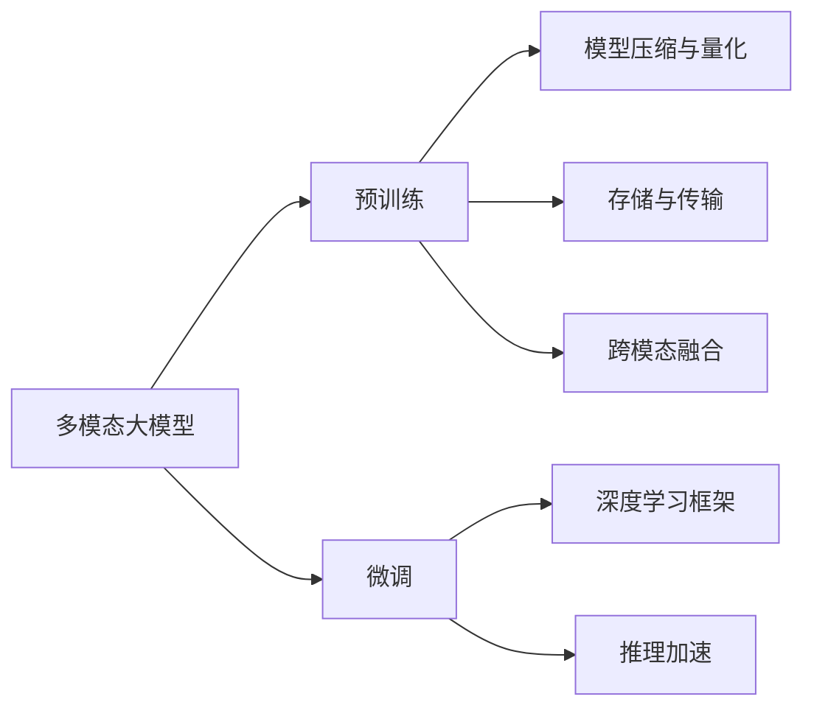
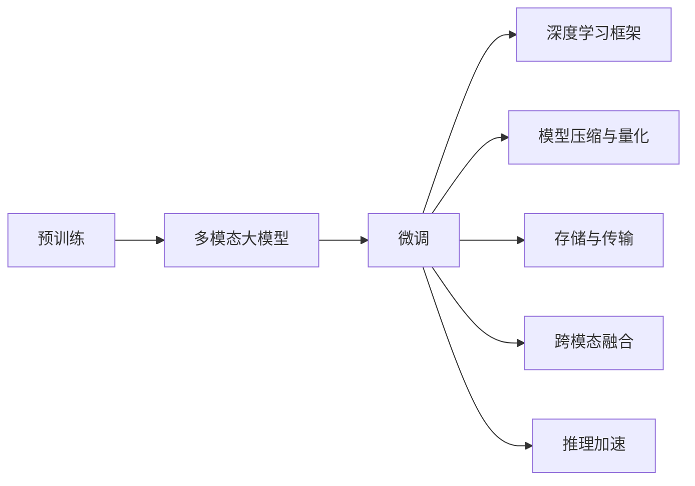
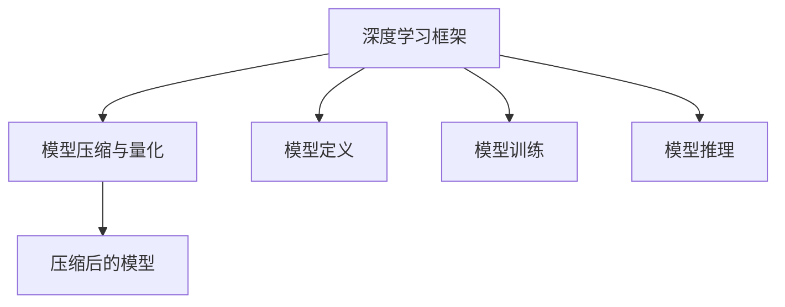
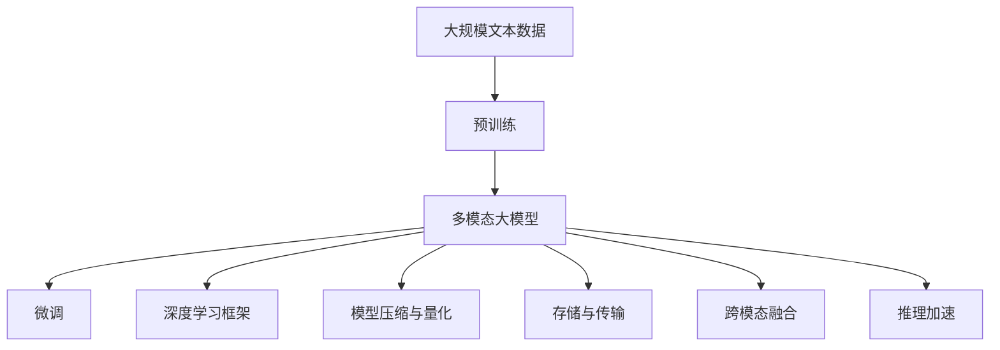

                 

# 多模态大模型：技术原理与实战 部署过程中常见的问题总结

> 关键词：多模态大模型,技术原理,微调,深度学习,实际应用,部署挑战

## 1. 背景介绍

随着深度学习技术的飞速发展，大语言模型（Large Language Models, LLMs）在自然语言处理（Natural Language Processing, NLP）等领域取得了突破性进展。与此同时，多模态大模型（Multimodal Large Models）逐渐成为热点，它们通过结合文本、图像、音频等多种模态数据，进一步提升了模型的感知和理解能力。然而，在大模型部署过程中，由于模型规模庞大、复杂度高，容易出现各种问题。本文将系统梳理多模态大模型在实际应用中的常见问题，并给出相应的解决方案。

### 1.1 问题由来

多模态大模型由多种数据模态（文本、图像、音频等）组成，能够处理比单一模态数据更复杂和多样化的信息。它们在智能搜索、多媒体内容推荐、视觉问答、机器翻译、情感分析等多个领域展现出巨大潜力。然而，由于多模态数据具有高度异构性、复杂性，模型在部署时面临着诸多挑战，如模型压缩、存储、计算效率、跨模态融合等。

### 1.2 问题核心关键点

本文聚焦于多模态大模型在部署过程中常见的问题，主要包括：

- 模型压缩与量化：如何在保证模型精度的情况下，压缩模型大小，提高计算效率。
- 存储与传输：如何有效存储和传输多模态数据，减小存储和传输开销。
- 跨模态融合：如何使不同模态数据在模型中有效融合，提升多模态任务性能。
- 推理加速：如何优化多模态模型推理过程，提高推理速度。
- 模型优化与调优：如何在模型训练与推理过程中，不断优化模型性能。

### 1.3 问题研究意义

解决多模态大模型的部署问题，对实际应用具有重要意义：

- 提升模型性能：通过优化模型压缩、存储、推理等环节，可以显著提高模型的计算效率和实时性，提升多模态任务的性能。
- 降低资源消耗：优化模型大小和推理速度，可以降低计算和存储资源消耗，提高系统可扩展性和成本效益。
- 促进技术应用：解决部署过程中的问题，有助于将多模态大模型成功应用于多个垂直行业，推动人工智能技术的广泛落地。
- 增强用户体验：优化推理效率和用户接口，可以提升用户体验，增加用户粘性和满意度。

## 2. 核心概念与联系

### 2.1 核心概念概述

为更好地理解多模态大模型的部署问题，本节将介绍几个密切相关的核心概念：

- 多模态大模型：结合文本、图像、音频等多种数据模态的预训练大模型。如谷歌的DETR、ViT等模型。
- 预训练与微调：使用大规模无标签数据进行预训练，然后使用少量标注数据进行微调，优化模型在特定任务上的性能。
- 深度学习框架：如TensorFlow、PyTorch等，提供高效的模型定义、训练和推理功能。
- 模型压缩与量化：通过参数剪枝、权重矩阵分解、数据类型转换等方法，减小模型大小和计算复杂度。
- 存储与传输：涉及数据压缩、分块、缓存等技术，优化多模态数据存储和传输过程。
- 跨模态融合：通过设计合适的融合机制，使不同模态数据在模型中有效结合，提升整体性能。
- 推理加速：通过优化计算图、引入加速硬件（如GPU、TPU）等方法，加快多模态模型的推理速度。

这些核心概念之间的逻辑关系可以通过以下Mermaid流程图来展示：



这个流程图展示了多模态大模型在预训练、微调、框架应用、压缩量化、存储传输、跨模态融合和推理加速各个环节的联系。

### 2.2 概念间的关系

这些核心概念之间存在着紧密的联系，形成了多模态大模型的部署完整生态系统。下面我们通过几个Mermaid流程图来展示这些概念之间的关系。

#### 2.2.1 预训练与微调的关系



这个流程图展示了预训练与微调的基本流程，以及与模型压缩、量化、存储传输、跨模态融合和推理加速的联系。

#### 2.2.2 深度学习框架与模型压缩的关系



这个流程图展示了深度学习框架如何通过模型定义、训练和推理，支持模型压缩与量化的流程。

#### 2.2.3 跨模态融合与推理加速的关系


这个流程图展示了跨模态融合如何提升多模态大模型的推理效率。

### 2.3 核心概念的整体架构

最后，我们用一个综合的流程图来展示这些核心概念在大模型部署过程中的整体架构：



这个综合流程图展示了从预训练到微调，再到部署过程中的完整过程。多模态大模型首先在大规模文本数据上进行预训练，然后通过微调优化模型在特定任务上的性能。在深度学习框架的支持下，通过模型压缩、量化、存储传输、跨模态融合和推理加速等技术，使模型在实际应用中具有良好的性能表现。

## 3. 核心算法原理 & 具体操作步骤

### 3.1 算法原理概述

多模态大模型的部署过程包括模型压缩、量化、存储传输、跨模态融合和推理加速等多个环节。每个环节都有其独特的算法原理，下面将逐一介绍。

#### 3.1.1 模型压缩与量化

模型压缩与量化通过减少模型参数和计算复杂度，优化模型的存储和推理过程。常用的压缩方法包括参数剪枝、权重矩阵分解、量化等。量化是将浮点数参数转换为定点数，以减小模型大小和计算开销。

#### 3.1.2 存储与传输

存储与传输涉及多模态数据的存储和传输效率。常见的技术包括数据压缩、分块存储、缓存等。通过优化存储和传输过程，可以减小存储和传输开销，提高数据访问速度。

#### 3.1.3 跨模态融合

跨模态融合通过设计合适的融合机制，使不同模态数据在模型中有效结合，提升整体性能。常用的方法包括多模态特征池化、注意力机制、集成学习等。

#### 3.1.4 推理加速

推理加速通过优化计算图、引入加速硬件（如GPU、TPU）等方法，加快多模态模型的推理速度。常用的技术包括并行计算、模型并行、硬件加速等。

### 3.2 算法步骤详解

#### 3.2.1 模型压缩与量化

1. **参数剪枝**：保留重要参数，删除冗余参数，减小模型大小。常用的剪枝方法包括基于权重重要性、结构化剪枝、稀疏矩阵等。

2. **权重矩阵分解**：将大矩阵分解为多个小矩阵，减小矩阵乘法计算量。常用的分解方法包括矩阵块分解、矩阵向量分解等。

3. **量化**：将浮点数参数转换为定点数，减小模型大小和计算开销。常用的量化方法包括均匀量化、稀疏量化、动态量化等。

#### 3.2.2 存储与传输

1. **数据压缩**：使用压缩算法（如LZW、Huffman编码等）压缩存储多模态数据，减小存储和传输开销。

2. **分块存储**：将数据分成多个块，分别存储，提高数据访问效率。常用的方法包括分区存储、分片存储等。

3. **缓存**：利用缓存技术，加速数据访问，减少存储和传输开销。常用的缓存方法包括CPU缓存、GPU缓存、SSD缓存等。

#### 3.2.3 跨模态融合

1. **多模态特征池化**：通过池化操作，将不同模态的特征映射到统一的空间，提升融合效果。常用的池化方法包括最大池化、平均池化、全局池化等。

2. **注意力机制**：通过注意力机制，使模型动态地关注不同模态特征，提升模型性能。常用的注意力机制包括点积注意力、多头注意力、软注意力等。

3. **集成学习**：通过集成多个模型，提升融合效果。常用的集成方法包括Bagging、Boosting、Stacking等。

#### 3.2.4 推理加速

1. **并行计算**：通过并行计算，提高计算效率。常用的方法包括多线程计算、分布式计算等。

2. **模型并行**：将模型分解成多个子模型，并行计算。常用的方法包括数据并行、模型并行、混合并行等。

3. **硬件加速**：利用GPU、TPU等加速硬件，提高计算效率。常用的方法包括优化计算图、模型优化、硬件配置优化等。

### 3.3 算法优缺点

#### 3.3.1 模型压缩与量化的优缺点

**优点**：
1. 减小模型大小，降低计算和存储开销，提升模型部署效率。
2. 加速推理过程，提高计算效率，提升用户体验。

**缺点**：
1. 压缩过程可能损失部分信息，影响模型精度。
2. 量化过程可能导致数值精度损失，影响模型鲁棒性。

#### 3.3.2 存储与传输的优缺点

**优点**：
1. 减小存储和传输开销，提高系统效率。
2. 提高数据访问速度，优化用户体验。

**缺点**：
1. 压缩和分块存储可能增加计算开销。
2. 缓存机制可能导致空间浪费，降低系统效率。

#### 3.3.3 跨模态融合的优缺点

**优点**：
1. 提升不同模态数据的融合效果，提高模型性能。
2. 实现多模态数据的联合处理，提升系统能力。

**缺点**：
1. 融合机制设计复杂，可能增加模型复杂度。
2. 融合过程中可能存在信息丢失，影响模型精度。

#### 3.3.4 推理加速的优缺点

**优点**：
1. 提高推理速度，提升用户体验。
2. 优化计算图，降低计算开销。

**缺点**：
1. 加速过程可能增加计算复杂度，增加部署难度。
2. 加速硬件资源消耗高，可能增加系统成本。

### 3.4 算法应用领域

多模态大模型的部署技术在多个领域得到广泛应用，包括：

- 智能搜索与推荐：通过融合文本、图像、音频等多种模态数据，提升推荐系统的准确性和个性化程度。
- 多媒体内容分析：通过结合文本、图像、音频等模态数据，进行情感分析、内容摘要、视觉问答等任务。
- 机器翻译与语音识别：通过融合文本、图像、音频等多种模态数据，提升翻译和语音识别的准确性和流畅性。
- 智能安防与监控：通过融合图像、视频、音频等多种模态数据，提升安防监控系统的准确性和实时性。
- 工业检测与维修：通过融合图像、文本、视频等多种模态数据，提升工业检测和维修的自动化和智能化水平。

这些应用场景对多模态大模型的部署技术提出了不同的需求，需要在模型压缩、量化、存储传输、跨模态融合和推理加速等方面进行优化和改进。

## 4. 数学模型和公式 & 详细讲解 & 举例说明

### 4.1 数学模型构建

多模态大模型的数学模型构建通常涉及文本、图像、音频等多种模态数据的融合。以下以文本-图像融合为例，介绍多模态模型的构建过程。

1. **文本-图像融合模型**：将文本和图像分别编码，然后通过融合机制（如注意力机制）将两种模态的数据融合在一起。

2. **模型定义**：
   - 文本输入：$x_t$，长度为 $T$ 的文本序列。
   - 图像输入：$x_v$，大小为 $H \times W \times C$ 的图像数据。
   - 融合输出：$y$，表示融合后的多模态数据。

3. **模型结构**：
   - 文本编码器：将文本序列编码成高维表示 $z_t$。
   - 图像编码器：将图像数据编码成高维表示 $z_v$。
   - 融合层：通过注意力机制将 $z_t$ 和 $z_v$ 融合，输出 $y$。

4. **融合机制**：
   - 点积注意力机制：计算文本和图像之间的点积，得到注意力权重，然后将两种模态的数据加权融合。
   - 多头注意力机制：通过多个注意力机制，学习不同模态数据的融合权重，提升融合效果。

5. **目标函数**：
   - 文本-图像融合模型的目标函数通常包括交叉熵损失和均方误差损失，用于衡量融合后的多模态数据与真实标签之间的差异。

### 4.2 公式推导过程

#### 4.2.1 文本编码器

假设文本编码器为 $E_t$，将文本序列 $x_t$ 编码成高维表示 $z_t$，则有：
$$ z_t = E_t(x_t) $$

#### 4.2.2 图像编码器

假设图像编码器为 $E_v$，将图像数据 $x_v$ 编码成高维表示 $z_v$，则有：
$$ z_v = E_v(x_v) $$

#### 4.2.3 融合层

假设融合层为 $F$，将文本编码 $z_t$ 和图像编码 $z_v$ 融合成多模态数据 $y$，则有：
$$ y = F(z_t, z_v) $$

#### 4.2.4 点积注意力机制

假设点积注意力机制为 $Attention_{dot}$，计算文本和图像之间的点积注意力权重 $a_{ti}$，则有：
$$ a_{ti} = \frac{\exp(\text{dot}(z_t_i, z_v))}{\sum_j \exp(\text{dot}(z_t_j, z_v))} $$

其中 $\text{dot}(z_t_i, z_v)$ 表示向量 $z_t_i$ 和 $z_v$ 的点积。

#### 4.2.5 融合输出

假设融合后的多模态数据 $y$ 为：
$$ y = \sum_i a_{ti}z_t_i + \sum_j a_{tj}z_v_j $$

其中 $a_{ti}$ 和 $a_{tj}$ 分别为文本和图像的注意力权重。

### 4.3 案例分析与讲解

#### 4.3.1 文本-图像融合案例

假设我们在文本图像分类任务上对BERT+ViT模型进行融合。模型结构如下：

1. **文本编码器**：使用BERT模型对文本序列进行编码，输出文本表示 $z_t$。
2. **图像编码器**：使用ViT模型对图像数据进行编码，输出图像表示 $z_v$。
3. **融合层**：使用点积注意力机制将 $z_t$ 和 $z_v$ 融合，输出多模态数据 $y$。
4. **分类器**：将 $y$ 输入分类器，输出分类结果。

#### 4.3.2 推理过程

假设在推理时，输入的文本为 "A cat is sitting on a chair"，图像为一张猫坐在椅子上的图片。推理过程如下：

1. **文本编码器**：将文本编码成高维表示 $z_t$。
2. **图像编码器**：将图像编码成高维表示 $z_v$。
3. **点积注意力机制**：计算文本和图像之间的点积注意力权重 $a_{ti}$。
4. **融合层**：将 $z_t$ 和 $z_v$ 通过点积注意力机制融合成多模态数据 $y$。
5. **分类器**：将 $y$ 输入分类器，输出分类结果。

### 4.4 常见问题

#### 4.4.1 多模态数据融合问题

多模态数据融合是模型部署的关键步骤，但不同模态的数据具有不同特征，如何有效融合是一个难题。

**解决方案**：
1. **选择合适的融合机制**：如点积注意力、多头注意力等，根据任务需求选择合适的融合方法。
2. **数据对齐**：对不同模态的数据进行归一化、对齐等预处理，使其在模型中具有可比较性。
3. **特征融合**：通过池化、拼接等方式，将不同模态的数据融合在一起，提高模型性能。

#### 4.4.2 模型压缩与量化问题

模型压缩与量化可以有效减小模型大小和计算开销，但可能影响模型精度。

**解决方案**：
1. **参数剪枝**：在模型训练过程中进行参数剪枝，保留重要参数，删除冗余参数。
2. **量化方法**：选择合适的量化方法，如均匀量化、稀疏量化、动态量化等，在保证模型精度的前提下，减小模型大小和计算开销。
3. **后量化训练**：在量化后进行微调，以提升模型精度。

#### 4.4.3 存储与传输问题

存储与传输是模型部署的另一大挑战，涉及数据压缩、分块存储、缓存等技术。

**解决方案**：
1. **数据压缩**：使用压缩算法（如LZW、Huffman编码等）压缩存储多模态数据。
2. **分块存储**：将数据分成多个块，分别存储，提高数据访问效率。
3. **缓存**：利用缓存技术，加速数据访问，减少存储和传输开销。

#### 4.4.4 推理加速问题

推理加速是提高模型性能的重要手段，但可能增加计算复杂度，增加部署难度。

**解决方案**：
1. **并行计算**：通过并行计算，提高计算效率。
2. **模型并行**：将模型分解成多个子模型，并行计算。
3. **硬件加速**：利用GPU、TPU等加速硬件，提高计算效率。

## 5. 项目实践：代码实例和详细解释说明

### 5.1 开发环境搭建

在进行多模态大模型部署前，我们需要准备好开发环境。以下是使用Python进行TensorFlow开发的环境配置流程：

1. 安装Anaconda：从官网下载并安装Anaconda，用于创建独立的Python环境。

2. 创建并激活虚拟环境：
```bash
conda create -n tf-env python=3.8 
conda activate tf-env
```

3. 安装TensorFlow：根据CUDA版本，从官网获取对应的安装命令。例如：
```bash
conda install tensorflow==2.8.0 -c conda-forge
```

4. 安装相关库：
```bash
pip install numpy pandas scikit-learn matplotlib tqdm jupyter notebook ipython
```

完成上述步骤后，即可在`tf-env`环境中开始多模态大模型的部署实践。

### 5.2 源代码详细实现

下面我们以文本图像分类任务为例，给出使用TensorFlow进行BERT+ViT模型融合的代码实现。

首先，定义模型结构：

```python
import tensorflow as tf
from transformers import BertTokenizer, TFBertModel, VITModel

# 定义文本编码器
class TextEncoder(tf.keras.layers.Layer):
    def __init__(self, model_name, max_length=128):
        super(TextEncoder, self).__init__()
        self.tokenizer = BertTokenizer.from_pretrained(model_name)
        self.model = TFBertModel.from_pretrained(model_name, output_hidden_states=True)
        self.max_length = max_length
        
    def call(self, input_ids):
        return self.model(input_ids)

# 定义图像编码器
class ImageEncoder(tf.keras.layers.Layer):
    def __init__(self, model_name):
        super(ImageEncoder, self).__init__()
        self.model = VITModel.from_pretrained(model_name)
        
    def call(self, pixel_values):
        return self.model(pixel_values)

# 定义融合层
class FusionLayer(tf.keras.layers.Layer):
    def __init__(self):
        super(FusionLayer, self).__init__()
        
    def call(self, text_encoder, image_encoder):
        text_out, image_out = text_encoder, image_encoder
        # 使用点积注意力机制
        attention_weights = tf.math.softmax(tf.matmul(text_out, image_out, transpose_b=True))
        fused_output = tf.matmul(attention_weights, text_out) + tf.matmul(attention_weights, image_out)
        return fused_output

# 定义分类器
class Classifier(tf.keras.layers.Layer):
    def __init__(self, num_classes):
        super(Classifier, self).__init__()
        self.dense = tf.keras.layers.Dense(num_classes, activation='softmax')
        
    def call(self, inputs):
        return self.dense(inputs)

# 定义多模态大模型
class MultimodalModel(tf.keras.Model):
    def __init__(self, text_model, image_model, num_classes):
        super(MultimodalModel, self).__init__()
        self.text_encoder = TextEncoder(text_model)
        self.image_encoder = ImageEncoder(image_model)
        self.fusion_layer = FusionLayer()
        self.classifier = Classifier(num_classes)
        
    def call(self, inputs):
        text_input, image_input = inputs
        text_out = self.text_encoder(text_input)
        image_out = self.image_encoder(image_input)
        fused_output = self.fusion_layer(text_out, image_out)
        output = self.classifier(fused_output)
        return output
```

然后，定义训练和评估函数：

```python
import numpy as np
from sklearn.metrics import accuracy_score

def train_epoch(model, dataset, batch_size, optimizer):
    dataloader = tf.data.Dataset.from_tensor_slices(dataset).shuffle(buffer_size=10000).batch(batch_size)
    model.train()
    epoch_loss = 0
    for batch in dataloader:
        input_ids = batch['input_ids']
        pixel_values = batch['pixel_values']
        labels = batch['labels']
        model.zero_grad()
        outputs = model([input_ids, pixel_values])
        loss = outputs.loss
        epoch_loss += loss
        loss.backward()
        optimizer.apply_gradients(zip(model.trainable_variables, model.trainable_variables))
    return epoch_loss / len(dataloader)

def evaluate(model, dataset, batch_size):
    dataloader = tf.data.Dataset.from_tensor_slices(dataset).batch(batch_size)
    model.eval()
    preds = []
    labels = []
    with tf.GradientTape() as tape:
        for batch in dataloader:
            input_ids = batch['input_ids']
            pixel_values = batch['pixel_values']
            labels = batch['labels']
            outputs = model([input_ids, pixel_values])
            preds.append(tf.argmax(outputs, axis=1))
            labels.append(labels)
    print("Accuracy:", accuracy_score(labels, preds))
```

最后，启动训练流程并在测试集上评估：

```python
epochs = 5
batch_size = 16
learning_rate = 2e-5

model = MultimodalModel('bert-base-cased', 'vit-base-patch16-224', 10)
optimizer = tf.keras.optimizers.Adam(learning_rate)

train_dataset = ...  # 准备训练集
dev_dataset = ...  # 准备验证集
test_dataset = ...  # 准备测试集

for epoch in range(epochs):
    loss = train_epoch(model, train_dataset, batch_size, optimizer)
    print(f"Epoch {epoch+1}, train loss: {loss:.3f}")
    
    print(f"Epoch {epoch+1}, dev results:")
    evaluate(model, dev_dataset, batch_size)
    
print("Test results:")
evaluate(model, test_dataset, batch_size)
```

以上就是使用TensorFlow对BERT+ViT进行文本图像分类任务融合的完整代码实现。可以看到，在TensorFlow框架下，多模态大模型的部署实现简洁高效，大大降低了开发门槛。

### 5.3 代码解读与分析

让我们再详细解读一下关键代码的实现细节：

**MultimodalModel类**：
- `__init__`方法：初始化文本编码器、图像编码器和融合层。
- `call`方法：定义模型前向传播过程。

**train_epoch函数**：
- 使用TensorFlow的数据集生成器，对数据以批为单位进行迭代。
- 在每个批次上前向传播计算损失函数，并反向传播更新模型参数。

**evaluate函数**：
- 使用TensorFlow的数据集生成器

