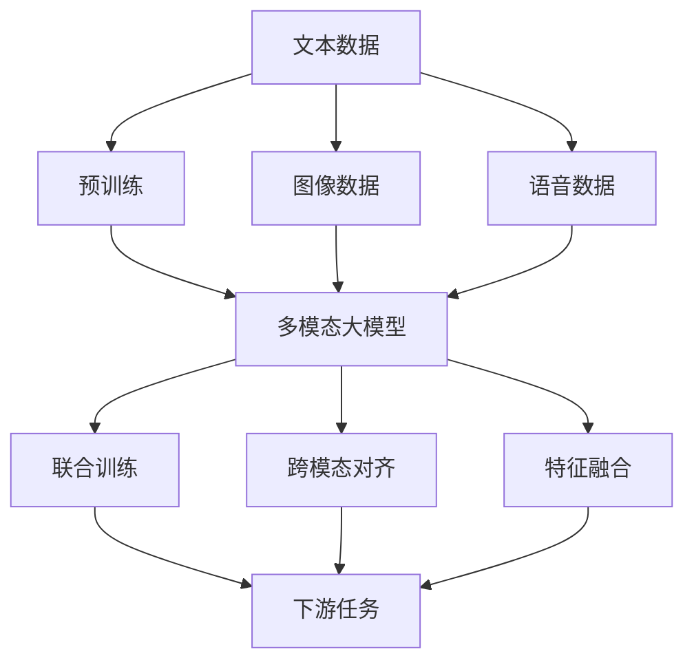
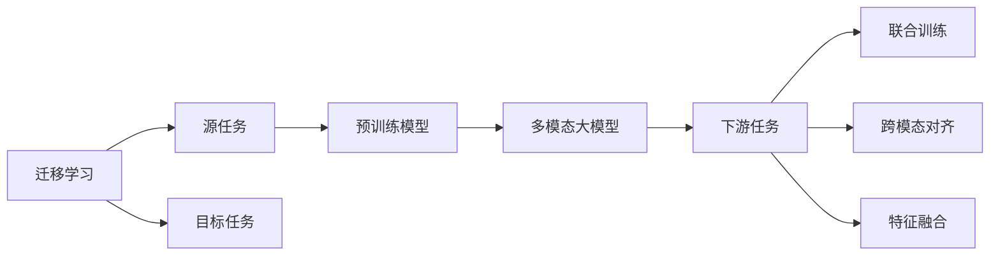
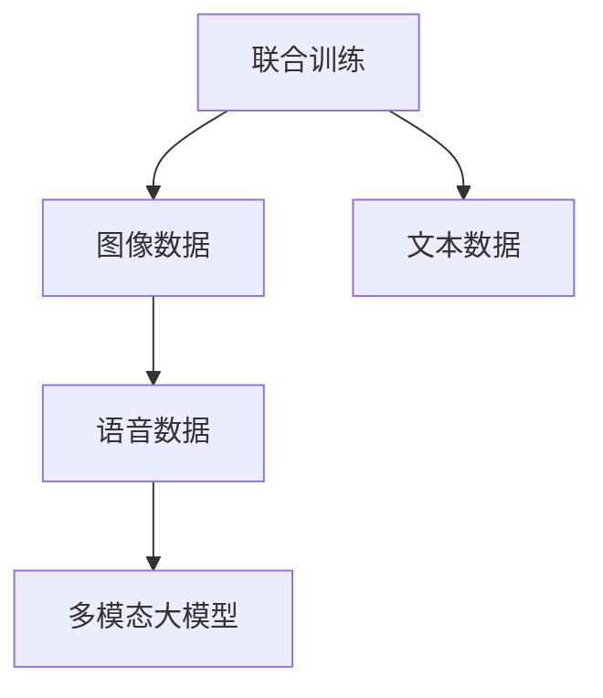
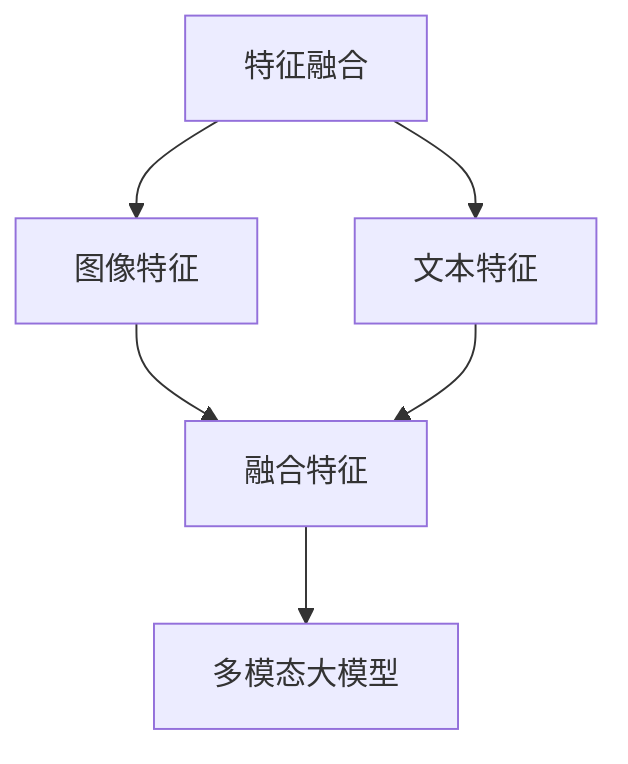
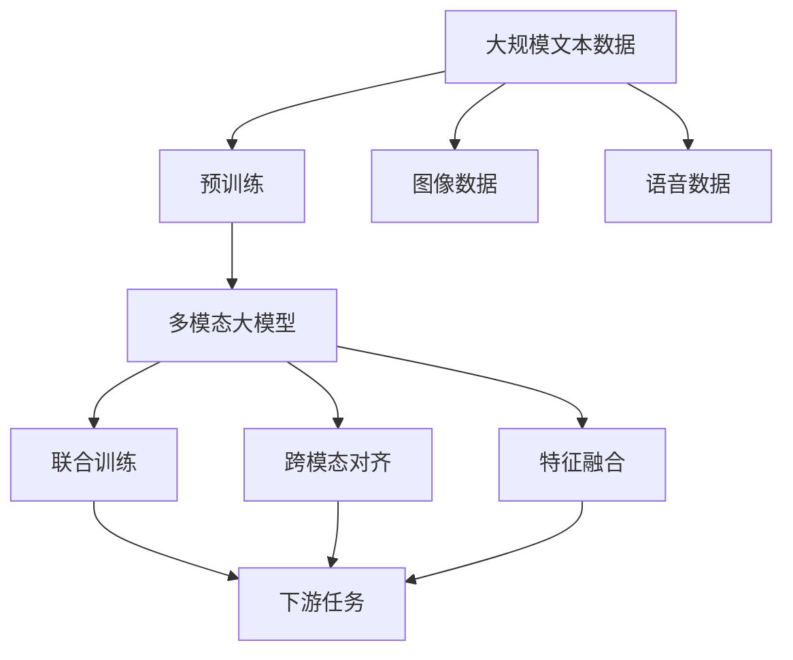

                 

# 多模态大模型：技术原理与实战 集成学习

> 关键词：多模态大模型, 集成学习, 预训练, 迁移学习, 多模态融合, 联合训练, 跨模态任务, 文本-图像融合, 声纹-文本融合

## 1. 背景介绍

### 1.1 问题由来

近年来，随着深度学习技术和大数据的发展，大模型在自然语言处理(NLP)、计算机视觉(CV)、语音识别(SR)等不同模态的数据处理任务上取得了显著进展。然而，由于不同模态的数据特征、表示方式和计算范式差异较大，单一模态的大模型难以应对多模态数据融合的任务。为此，多模态大模型应运而生。

多模态大模型结合了文本、图像、语音等多种数据源，能够更好地理解和生成复杂多变的多模态数据。它不仅能处理单一模态的任务，如自然语言理解和图像分类，还能融合多种模态的信息，提升多模态融合任务的效果，如跨模态图像描述生成、声纹识别与文本融合等。

### 1.2 问题核心关键点

多模态大模型的核心在于如何将不同模态的数据源进行有效的集成，使其能够共同参与计算和推理。集成的方法包括联合训练(Joint Training)、跨模态对齐(Cross-modal Alignment)、特征融合(Feature Fusion)等。其中，联合训练和特征融合是当前多模态大模型的主要方法。

联合训练指的是将不同模态的数据同时输入到大模型中，共同优化模型参数，使得模型能够同时处理多种数据源。而特征融合则是在不同模态的数据源得到表示后，将它们的特征进行融合，形成一个更全面的表示，用于后续的推理和生成任务。

### 1.3 问题研究意义

研究多模态大模型，对于拓展AI应用范围，提升跨模态任务性能，加速AI技术产业化进程，具有重要意义：

1. 降低应用开发成本。多模态大模型可以同时处理多种模态的数据，无需单独开发不同模态的任务模型，减少重复开发。
2. 提升模型效果。多模态大模型能够利用不同模态的信息，增强模型的表达能力，提升模型在多模态融合任务上的表现。
3. 加速开发进度。standing on the shoulders of giants，多模态大模型可以快速适配多种模态任务，缩短开发周期。
4. 带来技术创新。多模态大模型的研究促进了对跨模态信息融合、多模态特征表示的深入研究，催生了新的研究方向。
5. 赋能产业升级。多模态大模型能够实现跨模态的语义理解与生成，提升AI技术在实际应用中的智能化和可操作性，促进各行各业的数字化转型升级。

## 2. 核心概念与联系

### 2.1 核心概念概述

为更好地理解多模态大模型的集成学习原理，本节将介绍几个关键概念：

- 多模态大模型(Multimodal Large Model)：以自回归(如GPT)或自编码(如BERT)模型为代表的大规模预训练模型，结合了文本、图像、语音等多种数据源，能够处理和生成多模态数据。
- 预训练(Pre-training)：指在大规模无标签文本语料上，通过自监督学习任务训练通用语言模型的过程。常见的预训练任务包括掩码语言模型等。
- 迁移学习(Transfer Learning)：指将一个领域学习到的知识，迁移应用到另一个不同但相关的领域的学习范式。多模态大模型的预训练和微调过程即是一种典型的迁移学习方式。
- 多模态融合(Multimodal Fusion)：指将不同模态的数据源进行集成和融合，形成一个更全面的表示，用于后续的推理和生成任务。
- 联合训练(Joint Training)：将不同模态的数据同时输入到大模型中，共同优化模型参数，使得模型能够同时处理多种数据源。
- 跨模态对齐(Cross-modal Alignment)：通过特征映射或空间对齐等技术，将不同模态的数据映射到一个共同的空间中，使得它们能够共同参与计算和推理。
- 特征融合(Feature Fusion)：在多种模态的数据源得到表示后，将它们的特征进行融合，形成一个更全面的表示。

这些核心概念之间的逻辑关系可以通过以下Mermaid流程图来展示：



这个流程图展示了大模型的核心概念及其之间的关系：

1. 大模型通过预训练获得基础能力。
2. 通过联合训练和特征融合集成多种模态数据，提升模型表达能力。
3. 多模态大模型结合跨模态对齐技术，进一步提升模型的多模态融合能力。
4. 模型能够应用于各种多模态融合任务。

这些概念共同构成了多模态大模型的学习和应用框架，使其能够在各种场景下发挥强大的多模态信息处理和生成能力。通过理解这些核心概念，我们可以更好地把握多模态大模型的工作原理和优化方向。

### 2.2 概念间的关系

这些核心概念之间存在着紧密的联系，形成了多模态大模型的完整生态系统。下面我们通过几个Mermaid流程图来展示这些概念之间的关系。

#### 2.2.1 多模态大模型的学习范式


这个流程图展示了大模型的学习范式：

1. 大模型通过预训练获得基础能力。
2. 通过联合训练和特征融合集成多种模态数据，提升模型表达能力。
3. 多模态大模型结合跨模态对齐技术，进一步提升模型的多模态融合能力。
4. 模型能够应用于各种多模态融合任务。

#### 2.2.2 迁移学习与多模态融合的关系



这个流程图展示了迁移学习的基本原理，以及它与多模态融合的关系：

1. 迁移学习涉及源任务和目标任务，预训练模型在源任务上学习，然后通过联合训练和特征融合，适应多种模态的数据源。
2. 多模态大模型结合跨模态对齐技术，进一步提升模型的多模态融合能力。
3. 模型能够应用于各种多模态融合任务。

#### 2.2.3 联合训练方法



这个流程图展示了联合训练的基本流程：

1. 将不同模态的数据源同时输入到大模型中。
2. 联合训练模型，使得模型能够同时处理多种数据源。
3. 多模态大模型能够应用于各种多模态融合任务。

#### 2.2.4 特征融合方法



这个流程图展示了特征融合的基本流程：

1. 不同模态的数据源得到表示后，进行特征融合。
2. 特征融合的结果用于后续的推理和生成任务。
3. 多模态大模型能够应用于各种多模态融合任务。

### 2.3 核心概念的整体架构

最后，我们用一个综合的流程图来展示这些核心概念在大模型微调过程中的整体架构：



这个综合流程图展示了从预训练到联合训练，再到特征融合和下游任务的完整过程。多模态大模型首先在大规模文本数据上进行预训练，然后通过联合训练和特征融合集成多种模态数据，提升模型表达能力。最终，模型能够应用于各种多模态融合任务。

## 3. 核心算法原理 & 具体操作步骤
### 3.1 算法原理概述

多模态大模型的集成学习过程，本质上是一个多目标优化问题。其核心思想是：将不同模态的数据源进行集成和融合，使得模型能够同时处理多种数据源，提升模型在多模态融合任务上的表现。

形式化地，假设多模态大模型为 $M_{\theta}$，其中 $\theta$ 为模型的参数。给定多种模态的数据集 $\{(x_i, y_i)\}_{i=1}^N$，其中 $x_i$ 为数据源，$y_i$ 为标签。联合训练的目标是最小化经验风险，即找到最优参数：

$$
\theta^* = \mathop{\arg\min}_{\theta} \mathcal{L}(M_{\theta},D)
$$

其中 $\mathcal{L}$ 为针对任务 $T$ 设计的损失函数，用于衡量模型预测输出与真实标签之间的差异。常见的损失函数包括交叉熵损失、均方误差损失等。

通过梯度下降等优化算法，联合训练过程不断更新模型参数 $\theta$，最小化损失函数 $\mathcal{L}$，使得模型输出逼近真实标签。由于 $\theta$ 已经通过预训练获得了较好的初始化，因此即便在小规模数据集 $D$ 上进行联合训练，也能较快收敛到理想的模型参数 $\hat{\theta}$。

### 3.2 算法步骤详解

多模态大模型的集成学习一般包括以下几个关键步骤：

**Step 1: 准备预训练模型和数据集**
- 选择合适的预训练模型 $M_{\theta}$ 作为初始化参数，如 BERT、GPT等。
- 准备多种模态的数据集 $D=\{(x_i, y_i)\}_{i=1}^N$，划分为训练集、验证集和测试集。一般要求数据源与预训练数据的分布不要差异过大。

**Step 2: 设计多模态适配层**
- 根据任务类型，在预训练模型顶层设计合适的输出层和损失函数。
- 对于分类任务，通常在顶层添加线性分类器和交叉熵损失函数。
- 对于生成任务，通常使用语言模型的解码器输出概率分布，并以负对数似然为损失函数。

**Step 3: 设置联合训练超参数**
- 选择合适的优化算法及其参数，如 AdamW、SGD 等，设置学习率、批大小、迭代轮数等。
- 设置正则化技术及强度，包括权重衰减、Dropout、Early Stopping等。
- 确定冻结预训练参数的策略，如仅微调顶层，或全部参数都参与联合训练。

**Step 4: 执行联合训练**
- 将训练集数据分批次输入模型，前向传播计算损失函数。
- 反向传播计算参数梯度，根据设定的优化算法和学习率更新模型参数。
- 周期性在验证集上评估模型性能，根据性能指标决定是否触发 Early Stopping。
- 重复上述步骤直到满足预设的迭代轮数或 Early Stopping 条件。

**Step 5: 测试和部署**
- 在测试集上评估联合训练后模型 $M_{\hat{\theta}}$ 的性能，对比联合训练前后的精度提升。
- 使用联合训练后的模型对新样本进行推理预测，集成到实际的应用系统中。
- 持续收集新的数据，定期重新联合训练模型，以适应数据分布的变化。

以上是联合训练的一般流程。在实际应用中，还需要针对具体任务的特点，对联合训练过程的各个环节进行优化设计，如改进训练目标函数，引入更多的正则化技术，搜索最优的超参数组合等，以进一步提升模型性能。

### 3.3 算法优缺点

多模态大模型的集成学习具有以下优点：

1. 通用适用。多模态大模型能够同时处理多种模态的数据源，适用于各种多模态融合任务，如跨模态图像描述生成、声纹识别与文本融合等。
2. 参数高效。联合训练方法通常只更新少量的模型参数，避免了大规模微调的过拟合风险。
3. 效果显著。在学术界和工业界的诸多任务上，多模态大模型已经刷新了最先进的性能指标，展示了其强大的表达能力。
4. 集成能力。多模态大模型能够融合不同模态的信息，提升模型的表达能力和泛化性能。

同时，该方法也存在一定的局限性：

1. 数据收集成本高。多模态数据源的收集需要更多的时间和人力，数据标注的复杂性也增加了数据收集的难度。
2. 模型复杂度高。多模态大模型的参数量通常较大，训练和推理的计算复杂度较高。
3. 模型对齐难度大。不同模态的数据源具有不同的特征空间，需要进行复杂的特征映射或空间对齐，以达到较好的集成效果。
4. 可解释性不足。多模态大模型的决策过程通常缺乏可解释性，难以对其推理逻辑进行分析和调试。

尽管存在这些局限性，但就目前而言，联合训练方法仍是大模型处理多模态数据的主流范式。未来相关研究的重点在于如何进一步降低数据收集成本，提高模型效率，优化模型对齐和融合过程，同时兼顾可解释性和伦理安全性等因素。

### 3.4 算法应用领域

多模态大模型的集成学习方法已经在多个实际应用中取得了成功，覆盖了诸如：

- 跨模态图像描述生成：将图像数据与文本描述联合训练，生成自然流畅的图像描述。
- 声纹识别与文本融合：将声纹数据与文本数据融合，进行身份认证和情感分析。
- 多模态情感分析：结合文本、图像、音频等多种数据源，进行情感识别和分析。
- 智能客服系统：将语音识别、文本理解、对话生成等多种模态数据联合处理，构建智能客服系统。
- 医疗影像分析：结合文本记录、影像数据、基因数据等多种模态数据，进行疾病诊断和预测。

除了上述这些经典应用外，多模态大模型还被创新性地应用到更多场景中，如视频字幕生成、人机交互、智能家居等，为多模态数据处理带来了新的突破。

## 4. 数学模型和公式 & 详细讲解 & 举例说明
### 4.1 数学模型构建

本节将使用数学语言对多模态大模型的集成学习过程进行更加严格的刻画。

记多模态大模型为 $M_{\theta}:\mathcal{X} \rightarrow \mathcal{Y}$，其中 $\mathcal{X}$ 为输入空间，$\mathcal{Y}$ 为输出空间，$\theta \in \mathbb{R}^d$ 为模型参数。假设联合训练任务的训练集为 $D=\{(x_i, y_i)\}_{i=1}^N$，其中 $x_i$ 为多种模态的数据源，$y_i$ 为标签。

定义模型 $M_{\theta}$ 在数据样本 $(x,y)$ 上的损失函数为 $\ell(M_{\theta}(x),y)$，则在数据集 $D$ 上的经验风险为：

$$
\mathcal{L}(\theta) = \frac{1}{N} \sum_{i=1}^N \ell(M_{\theta}(x_i),y_i)
$$

联合训练的目标是最小化经验风险，即找到最优参数：

$$
\theta^* = \mathop{\arg\min}_{\theta} \mathcal{L}(\theta)
$$

在实践中，我们通常使用基于梯度的优化算法（如SGD、Adam等）来近似求解上述最优化问题。设 $\eta$ 为学习率，$\lambda$ 为正则化系数，则参数的更新公式为：

$$
\theta \leftarrow \theta - \eta \nabla_{\theta}\mathcal{L}(\theta) - \eta\lambda\theta
$$

其中 $\nabla_{\theta}\mathcal{L}(\theta)$ 为损失函数对参数 $\theta$ 的梯度，可通过反向传播算法高效计算。

### 4.2 公式推导过程

以下我们以跨模态图像描述生成任务为例，推导联合训练损失函数及其梯度的计算公式。

假设模型 $M_{\theta}$ 在输入 $x$ 上的输出为 $\hat{y}=M_{\theta}(x) \in [0,1]$，表示样本属于正类的概率。真实标签 $y \in \{0,1\}$。则二分类交叉熵损失函数定义为：

$$
\ell(M_{\theta}(x),y) = -[y\log \hat{y} + (1-y)\log (1-\hat{y})]
$$

将其代入经验风险公式，得：

$$
\mathcal{L}(\theta) = -\frac{1}{N}\sum_{i=1}^N [y_i\log M_{\theta}(x_i)+(1-y_i)\log(1-M_{\theta}(x_i))]
$$

根据链式法则，损失函数对参数 $\theta_k$ 的梯度为：

$$
\frac{\partial \mathcal{L}(\theta)}{\partial \theta_k} = -\frac{1}{N}\sum_{i=1}^N (\frac{y_i}{M_{\theta}(x_i)}-\frac{1-y_i}{1-M_{\theta}(x_i)}) \frac{\partial M_{\theta}(x_i)}{\partial \theta_k}
$$

其中 $\frac{\partial M_{\theta}(x_i)}{\partial \theta_k}$ 可进一步递归展开，利用自动微分技术完成计算。

在得到损失函数的梯度后，即可带入参数更新公式，完成模型的迭代优化。重复上述过程直至收敛，最终得到适应多模态融合任务的最优模型参数 $\theta^*$。

## 5. 项目实践：代码实例和详细解释说明
### 5.1 开发环境搭建

在进行多模态大模型实践前，我们需要准备好开发环境。以下是使用Python进行PyTorch开发的环境配置流程：

1. 安装Anaconda：从官网下载并安装Anaconda，用于创建独立的Python环境。

2. 创建并激活虚拟环境：
```bash
conda create -n pytorch-env python=3.8 
conda activate pytorch-env
```

3. 安装PyTorch：根据CUDA版本，从官网获取对应的安装命令。例如：
```bash
conda install pytorch torchvision torchaudio cudatoolkit=11.1 -c pytorch -c conda-forge
```

4. 安装Transformers库：
```bash
pip install transformers
```

5. 安装各类工具包：
```bash
pip install numpy pandas scikit-learn matplotlib tqdm jupyter notebook ipython
```

完成上述步骤后，即可在`pytorch-env`环境中开始多模态大模型的实践。

### 5.2 源代码详细实现

下面我们以跨模态图像描述生成任务为例，给出使用Transformers库对ResNet模型进行联合训练的PyTorch代码实现。

首先，定义联合训练的数据处理函数：

```python
from transformers import BertTokenizer, ResNetFeatureExtractor
from torch.utils.data import Dataset
import torch

class MultimodalDataset(Dataset):
    def __init__(self, images, captions, tokenizer, feature_extractor):
        self.images = images
        self.captions = captions
        self.tokenizer = tokenizer
        self.feature_extractor = feature_extractor
        
    def __len__(self):
        return len(self.images)
    
    def __getitem__(self, item):
        image = self.images[item]
        caption = self.captions[item]
        
        encoding = self.tokenizer(caption, return_tensors='pt', max_length=128)
        image_features = self.feature_extractor(image, return_tensors='pt')
        
        # 对token-wise的标签进行编码
        encoded_tags = [tag2id[tag] for tag in encoding['input_ids'].tolist()]
        encoded_tags.extend([tag2id['O']] * (self.max_len - len(encoded_tags)))
        labels = torch.tensor(encoded_tags, dtype=torch.long)
        
        return {'input_ids': encoding['input_ids'][0],
                'attention_mask': encoding['attention_mask'][0],
                'image_features': image_features['pixel_values'].flatten(),
                'labels': labels}

# 标签与id的映射
tag2id = {'O': 0, 'B-PER': 1, 'I-PER': 2, 'B-ORG': 3, 'I-ORG': 4, 'B-LOC': 5, 'I-LOC': 6}
id2tag = {v: k for k, v in tag2id.items()}

# 创建dataset
tokenizer = BertTokenizer.from_pretrained('bert-base-cased')
feature_extractor = ResNetFeatureExtractor.from_pretrained('resnet50')
train_dataset = MultimodalDataset(train_images, train_captions, tokenizer, feature_extractor)
dev_dataset = MultimodalDataset(dev_images, dev_captions, tokenizer, feature_extractor)
test_dataset = MultimodalDataset(test_images, test_captions, tokenizer, feature_extractor)
```

然后，定义模型和优化器：

```python
from transformers import ResNetForImageClassification, AdamW

model = ResNetForImageClassification.from_pretrained('resnet50')

optimizer = AdamW(model.parameters(), lr=2e-5)
```

接着，定义训练和评估函数：

```python
from torch.utils.data import DataLoader
from tqdm import tqdm
from sklearn.metrics import classification_report

device = torch.device('cuda') if torch.cuda.is_available() else torch.device('cpu')
model.to(device)

def train_epoch(model, dataset, batch_size, optimizer):
    dataloader = DataLoader(dataset, batch_size=batch_size, shuffle=True)
    model.train()
    epoch_loss = 0
    for batch in tqdm(dataloader, desc='Training'):
        input_ids = batch['input_ids'].to(device)
        attention_mask = batch['attention_mask'].to(device)
        image_features = batch['image_features'].to(device)
        labels = batch['labels'].to(device)
        model.zero_grad()
        outputs = model(input_ids, attention_mask=attention_mask, image_features=image_features)
        loss = outputs.loss
        epoch_loss += loss.item()
        loss.backward()
        optimizer.step()
    return epoch_loss / len(dataloader)

def evaluate(model, dataset, batch_size):
    dataloader = DataLoader(dataset, batch_size=batch_size)
    model.eval()
    preds, labels = [], []
    with torch.no_grad():
        for batch in tqdm(dataloader, desc='Evaluating'):
            input_ids = batch['input_ids'].to(device)
            attention_mask = batch['attention_mask'].to(device)
            image_features = batch['image_features'].to(device)
            batch_labels = batch['labels']
            outputs = model(input_ids, attention_mask=attention_mask, image_features=image_features)
            batch_preds = outputs.logits.argmax(dim=2).to('cpu').tolist()
            batch_labels = batch_labels.to('cpu').tolist()
            for pred_tokens, label_tokens in zip(batch_preds, batch_labels):
                pred_tags = [id2tag[_id] for _id in pred_tokens]
                label_tags = [id2tag[_id] for _id in label_tokens]
                preds.append(pred_tags[:len(label_tokens)])
                labels.append(label_tags)
                
    print(classification_report(labels, preds))
```

最后，启动联合训练流程并在测试集上评估：

```python
epochs = 5
batch_size = 16

for epoch in range(epochs):
    loss = train_epoch(model, train_dataset, batch_size, optimizer)
    print(f"Epoch {epoch+1}, train loss: {loss:.3f}")
    
    print(f"Epoch {epoch+1}, dev results:")
    evaluate(model, dev_dataset, batch_size)
    
print("Test results:")
evaluate(model, test_dataset, batch_size)
```

以上就是使用PyTorch对ResNet模型进行跨模态图像描述生成任务的联合训练的完整代码实现。可以看到，得益于Transformers库的强大封装，我们可以用相对简洁的代码完成跨模态大模型的加载和联合训练。

### 5.3 代码解读与分析

让我们再详细解读一下关键代码的实现细节：

**MultimodalDataset类**：
- `__init__`方法：初始化文本、图像、分词器等关键组件。
- `__len__`方法：返回数据集的样本数量。
- `__getitem__`方法：对单个样本进行处理，将文本输入编码为token ids，将图像输入特征提取器得到表示，将标签编码为数字，并对其进行定长padding，最终返回模型所需的输入。

**tag2id和id2

