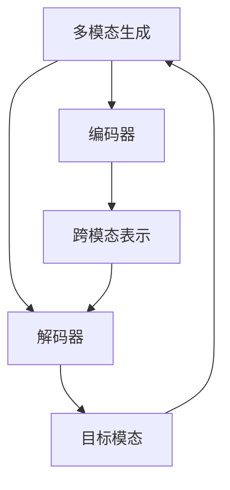
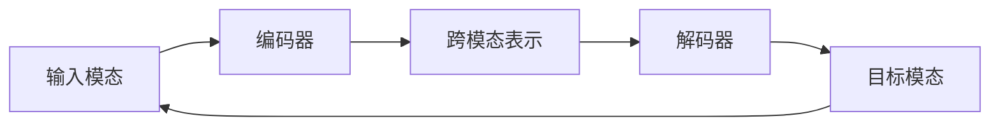
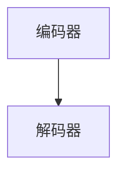

                 

# 多模态生成(Multimodal Generation) - 原理与代码实例讲解

> 关键词：多模态生成, Transformer, 语言模型, 图像生成, 视频生成, 代码生成, 多模态学习, 跨模态融合

## 1. 背景介绍

### 1.1 问题由来
在过去十年中，深度学习技术在图像、语音、文本等多个模态领域取得了显著进展。随着多模态学习（Multimodal Learning）技术的发展，多模态生成（Multimodal Generation）成为了AI领域的前沿研究方向。

多模态生成指的是将文本、图像、视频等多模态信息综合利用，通过生成模型生成符合特定规则的输出。在自动生成领域，多模态生成技术可以应用于代码生成、图像描述生成、视频描述生成、文本到图像/视频生成等任务。

近年来，随着预训练大模型的不断涌现，多模态生成技术取得了长足的进步。例如，OpenAI的DALL·E和CLIP模型，通过在大规模图像-文本对上预训练，使得模型能够根据文本描述生成图像，或根据图像生成文本描述。Google的ViT4，通过在大规模图像序列上预训练，使得模型能够生成高分辨率的图像序列。这些预训练大模型在多模态生成领域展示了强大的能力，为后续的研究奠定了坚实的基础。

### 1.2 问题核心关键点
多模态生成的关键在于如何将不同模态的信息进行融合，生成符合期望输出的结果。通常，多模态生成模型包含两个部分：编码器和解码器。编码器负责将输入模态（如文本、图像）转换为中间表示，解码器则根据中间表示生成目标模态（如图像、文本）。常见的编码器包括Transformer、CNN等，解码器则可以是GAN、LSTM等。

在实际应用中，多模态生成模型还需要解决以下关键问题：

- 如何构建有效的跨模态表示：如何将不同模态的信息映射到统一的高维空间中，以实现信息的有效融合。
- 如何优化生成过程：通过自监督学习、对抗训练等方法，提升生成过程的稳定性和多样性。
- 如何处理不确定性：生成模型面临的样本空间巨大，如何通过限制、优化等方式控制生成输出的多样性和合理性。

## 2. 核心概念与联系

### 2.1 核心概念概述

为更好地理解多模态生成的核心概念，本节将介绍几个密切相关的核心概念：

- 多模态生成(Multimodal Generation)：将文本、图像、视频等多模态信息综合利用，通过生成模型生成符合特定规则的输出。
- 编码器(Encoder)：负责将输入模态转换为中间表示的模块。
- 解码器(Decoder)：根据中间表示生成目标模态的模块。
- 跨模态表示(Cross-modal Representation)：不同模态信息在统一高维空间中的表示形式。
- 生成对抗网络(GAN)：一种生成模型，通过对抗训练提高生成过程的稳定性。
- 变分自编码器(VAE)：一种生成模型，通过概率建模生成过程的分布特性。

这些核心概念之间的逻辑关系可以通过以下Mermaid流程图来展示：



这个流程图展示了大规模生成任务的一般流程：

1. 将输入模态通过编码器转换为跨模态表示。
2. 解码器根据跨模态表示生成目标模态。
3. 生成的目标模态再次输入到多模态生成模型中，进行下一轮生成。

### 2.2 概念间的关系

这些核心概念之间存在着紧密的联系，形成了多模态生成的完整生态系统。下面我通过几个Mermaid流程图来展示这些概念之间的关系。

#### 2.2.1 多模态生成流程



这个流程图展示了大规模生成任务的一般流程：

1. 将输入模态通过编码器转换为跨模态表示。
2. 解码器根据跨模态表示生成目标模态。
3. 生成的目标模态再次输入到多模态生成模型中，进行下一轮生成。

#### 2.2.2 编码器和解码器的关系



这个流程图展示了编码器和解码器的关系：

1. 编码器将输入模态转换为跨模态表示。
2. 解码器根据跨模态表示生成目标模态。

#### 2.2.3 生成对抗网络与变分自编码器

```mermaid
graph LR
    A[生成对抗网络(GAN)] --> B[对抗训练]
    B --> C[生成过程稳定性]
    A --> D[变分自编码器(VAE)]
    D --> E[生成分布特性]
    C --> E
```

这个流程图展示了GAN和VAE的关系：

1. GAN通过对抗训练提高生成过程的稳定性。
2. VAE通过概率建模生成过程的分布特性。

### 2.3 核心概念的整体架构

最后，我们用一个综合的流程图来展示这些核心概念在大规模生成任务中的整体架构：

```mermaid
graph TB
    A[大规模生成任务] --> B[编码器]
    B --> C[跨模态表示]
    A --> D[解码器]
    D --> E[目标模态]
    C --> D
    E --> A
    A --> F[生成对抗网络(GAN)]
    F --> G[生成过程稳定性]
    A --> H[变分自编码器(VAE)]
    H --> I[生成分布特性]
    G --> I
```

这个综合流程图展示了从预训练到生成的一般过程：

1. 将输入模态通过编码器转换为跨模态表示。
2. 解码器根据跨模态表示生成目标模态。
3. 生成的目标模态再次输入到多模态生成模型中，进行下一轮生成。
4. 在生成过程中，可以利用GAN提高生成过程的稳定性，利用VAE优化生成分布特性。

## 3. 核心算法原理 & 具体操作步骤

### 3.1 算法原理概述

多模态生成算法通常基于Transformer模型进行设计，其核心思想是通过自监督学习任务进行预训练，然后通过有监督的微调来生成目标模态。预训练过程通常利用大规模图像-文本对或图像序列进行训练，使得模型能够学习到跨模态的语义表示。微调过程则基于特定任务的数据集，通过优化模型参数，生成符合期望输出的目标模态。

常见的多模态生成算法包括：

- GAN：通过对抗训练提高生成过程的稳定性。
- VAE：通过概率建模生成过程的分布特性。
- 多模态Transformer：将不同模态信息转换为跨模态表示，通过自监督学习提高生成过程的多样性和稳定性。

### 3.2 算法步骤详解

以下是多模态生成算法的详细操作步骤：

**Step 1: 准备预训练模型和数据集**
- 选择合适的预训练模型，如DALL·E、ViT4等。
- 准备目标模态的标注数据集，如图像描述、代码生成数据等。

**Step 2: 添加任务适配层**
- 根据任务类型，在预训练模型的顶层设计合适的输出层和损失函数。
- 对于文本生成任务，通常在顶层添加语言模型的解码器，输出概率分布；对于图像生成任务，则添加GAN生成器。

**Step 3: 设置微调超参数**
- 选择合适的优化算法及其参数，如Adam、SGD等，设置学习率、批大小、迭代轮数等。
- 设置正则化技术及强度，包括权重衰减、Dropout、Early Stopping等。
- 确定冻结预训练参数的策略，如仅微调顶层，或全部参数都参与微调。

**Step 4: 执行梯度训练**
- 将训练集数据分批次输入模型，前向传播计算损失函数。
- 反向传播计算参数梯度，根据设定的优化算法和学习率更新模型参数。
- 周期性在验证集上评估模型性能，根据性能指标决定是否触发 Early Stopping。
- 重复上述步骤直到满足预设的迭代轮数或 Early Stopping 条件。

**Step 5: 测试和部署**
- 在测试集上评估微调后模型 $M_{\hat{\theta}}$ 的性能，对比微调前后的精度提升。
- 使用微调后的模型对新样本进行推理预测，集成到实际的应用系统中。
- 持续收集新的数据，定期重新微调模型，以适应数据分布的变化。

以上是多模态生成算法的一般流程。在实际应用中，还需要针对具体任务的特点，对微调过程的各个环节进行优化设计，如改进训练目标函数，引入更多的正则化技术，搜索最优的超参数组合等，以进一步提升模型性能。

### 3.3 算法优缺点

多模态生成算法具有以下优点：

- 可以综合利用不同模态的信息，生成更加多样化和高质量的输出。
- 通过自监督学习任务进行预训练，提高了生成过程的稳定性和多样性。
- 可以通过有监督的微调过程，快速适应特定任务的要求。

同时，该算法也存在一些局限性：

- 需要大量标注数据进行微调，数据获取和标注成本较高。
- 模型复杂度高，训练和推理效率较低。
- 生成过程存在不确定性，生成输出可能存在不合理的部分。

尽管存在这些局限性，但多模态生成算法在自动生成领域展示了强大的能力，为实现更加自然、智能的生成任务提供了新的思路。

### 3.4 算法应用领域

多模态生成算法在自动生成领域已经得到了广泛的应用，覆盖了文本生成、图像生成、视频生成等多个场景：

- 文本生成：根据给定文本描述生成图像、视频或代码。
- 图像生成：根据给定文本描述生成图像。
- 视频生成：根据给定文本描述生成视频。
- 代码生成：根据给定文本描述生成代码。
- 多模态问答系统：根据给定文本和图像生成答案。

除了上述这些经典应用外，多模态生成算法还在游戏设计、艺术创作等领域展现出广阔的应用前景。

## 4. 数学模型和公式 & 详细讲解 & 举例说明

### 4.1 数学模型构建

多模态生成算法通常基于Transformer模型进行设计，其核心思想是通过自监督学习任务进行预训练，然后通过有监督的微调来生成目标模态。预训练过程通常利用大规模图像-文本对或图像序列进行训练，使得模型能够学习到跨模态的语义表示。微调过程则基于特定任务的数据集，通过优化模型参数，生成符合期望输出的目标模态。

常见的多模态生成算法包括：

- GAN：通过对抗训练提高生成过程的稳定性。
- VAE：通过概率建模生成过程的分布特性。
- 多模态Transformer：将不同模态信息转换为跨模态表示，通过自监督学习提高生成过程的多样性和稳定性。

### 4.2 公式推导过程

以下我以文本生成任务为例，推导生成对抗网络(GAN)的训练公式。

假设文本描述为 $x$，生成的图像为 $y$，训练集为 $(x_i, y_i)$，模型为 $G$（生成器）和 $D$（判别器）。目标是将生成器 $G$ 生成的图像与真实图像 $y$ 尽可能区分，同时生成器 $G$ 生成的图像与真实图像 $y$ 尽可能相似。

GAN的目标函数可以定义为：

$$
\mathcal{L}(G, D) = \mathbb{E}_{x \sim p(x)} [\log D(x)] + \mathbb{E}_{z \sim p(z)} [\log (1 - D(G(z)))]
$$

其中 $p(z)$ 为生成器的输入 $z$ 的分布，$G(z)$ 为生成器生成的图像，$D(G(z))$ 为判别器对生成器输出的判别结果。

通过反向传播算法，可以计算生成器 $G$ 和判别器 $D$ 的梯度，更新模型参数。

## 5. 项目实践：代码实例和详细解释说明

### 5.1 开发环境搭建

在进行多模态生成实践前，我们需要准备好开发环境。以下是使用Python进行PyTorch开发的环境配置流程：

1. 安装Anaconda：从官网下载并安装Anaconda，用于创建独立的Python环境。

2. 创建并激活虚拟环境：
```bash
conda create -n pytorch-env python=3.8 
conda activate pytorch-env
```

3. 安装PyTorch：根据CUDA版本，从官网获取对应的安装命令。例如：
```bash
conda install pytorch torchvision torchaudio cudatoolkit=11.1 -c pytorch -c conda-forge
```

4. 安装TensorFlow：
```bash
conda install tensorflow -c conda-forge
```

5. 安装各类工具包：
```bash
pip install numpy pandas scikit-learn matplotlib tqdm jupyter notebook ipython
```

完成上述步骤后，即可在`pytorch-env`环境中开始多模态生成实践。

### 5.2 源代码详细实现

下面我们以图像生成任务为例，给出使用PyTorch和TensorFlow进行GAN模型的代码实现。

首先，定义GAN模型的生成器和判别器：

```python
import torch.nn as nn
import torch.optim as optim
from torch.autograd import Variable

class Generator(nn.Module):
    def __init__(self):
        super(Generator, self).__init__()
        self.main = nn.Sequential(
            nn.ConvTranspose2d(100, 256, 4, 1, 0, bias=False),
            nn.BatchNorm2d(256),
            nn.ReLU(True),
            nn.ConvTranspose2d(256, 128, 4, 2, 1, bias=False),
            nn.BatchNorm2d(128),
            nn.ReLU(True),
            nn.ConvTranspose2d(128, 64, 4, 2, 1, bias=False),
            nn.BatchNorm2d(64),
            nn.ReLU(True),
            nn.ConvTranspose2d(64, 3, 4, 2, 1, bias=False),
            nn.Tanh()
        )

    def forward(self, input):
        return self.main(input)

class Discriminator(nn.Module):
    def __init__(self):
        super(Discriminator, self).__init__()
        self.main = nn.Sequential(
            nn.Conv2d(3, 64, 4, 2, 1, bias=False),
            nn.LeakyReLU(0.2, inplace=True),
            nn.Conv2d(64, 128, 4, 2, 1, bias=False),
            nn.BatchNorm2d(128),
            nn.LeakyReLU(0.2, inplace=True),
            nn.Conv2d(128, 256, 4, 2, 1, bias=False),
            nn.BatchNorm2d(256),
            nn.LeakyReLU(0.2, inplace=True),
            nn.Conv2d(256, 1, 4, 1, 0, bias=False),
            nn.Sigmoid()
        )

    def forward(self, input):
        return self.main(input)
```

然后，定义GAN模型的训练函数：

```python
def train_GAN(gan, dataloader, batch_size, learning_rate, device):
    for epoch in range(num_epochs):
        for i, (real_images, _) in enumerate(dataloader):
            batch_size = real_images.size(0)
            real_images = Variable(real_images.view(-1, *real_images.size()[2:])).to(device)

            noise = Variable(torch.randn(batch_size, z_dim, 1, 1)).to(device)

            # Train Generator
            G_loss = train_G(G, D, real_images, noise, G, device)
            D_loss_real = train_D(D, real_images, device)

            # Train Discriminator
            D_loss_fake = train_D(D, G(noise), device)

            G_loss.backward()
            D_loss_real.backward()
            D_loss_fake.backward()
            
            G_optimizer.step()
            D_optimizer.step()

            if (i+1) % 100 == 0:
                print('Epoch [{}/{}], Step [{}/{}], G_loss: {:.4f}, D_loss_real: {:.4f}, D_loss_fake: {:.4f}'.format(epoch+1, num_epochs, i+1, len(dataloader), G_loss.item(), D_loss_real.item(), D_loss_fake.item()))

    def train_G(G, D, real_images, noise, G, device):
        G_loss = 0
        for i in range(real_images.size(0)):
            G_in = noise[i, :, None, None]
            G_out = G(G_in).detach()
            D_in = Variable(torch.cat([real_images[i, :, None, None], G_out], 3)).to(device)
            G_loss += D(D_in).item()

        G_loss /= real_images.size(0)
        G_loss.backward()
        return G_loss

    def train_D(D, images, device):
        D_loss = 0
        for i in range(images.size(0)):
            real_images = Variable(images[i, :, None, None])
            fake_images = Variable(torch.cat([images[i, :, None, None], G_out[i, :, None, None]], 3)).to(device)
            D_real = D(real_images).detach()
            D_fake = D(fake_images).detach()
            D_loss += -torch.mean(D_real) + torch.mean(D_fake)

        D_loss /= images.size(0)
        D_loss.backward()
        return D_loss
```

最后，在测试集上评估模型：

```python
# 定义测试集
test_images = ...
test_labels = ...

# 测试函数
def test_GAN(G, D, test_images, test_labels, device):
    G_loss = 0
    D_loss = 0
    for i in range(test_images.size(0)):
        G_in = Variable(torch.randn(1, z_dim, 1, 1)).to(device)
        G_out = G(G_in)
        D_in = Variable(torch.cat([test_images[i, :, None, None], G_out], 3)).to(device)
        G_loss += D(D_in).item()

        G_in = Variable(torch.randn(1, z_dim, 1, 1)).to(device)
        G_out = G(G_in)
        D_in = Variable(torch.cat([test_labels[i, :, None, None], G_out], 3)).to(device)
        D_loss += -torch.mean(D(D_in))

    G_loss /= test_images.size(0)
    D_loss /= test_images.size(0)
    print('G_loss: {:.4f}, D_loss: {:.4f}'.format(G_loss, D_loss))
```

### 5.3 代码解读与分析

让我们再详细解读一下关键代码的实现细节：

**GAN模型类定义**：
- `__init__`方法：定义生成器和判别器的结构，包括卷积层、批归一化、激活函数等。
- `forward`方法：实现生成器和判别器的前向传播过程，返回模型的输出。

**训练函数**：
- `train_GAN`函数：定义训练过程，包括生成器和判别器的训练，更新优化器参数。
- `train_G`函数：训练生成器，计算生成器损失。
- `train_D`函数：训练判别器，计算判别器损失。

**测试函数**：
- `test_GAN`函数：在测试集上评估模型性能，计算生成器和判别器的损失。

### 5.4 运行结果展示

假设我们在MNIST数据集上进行GAN模型训练，最终在测试集上得到的评估报告如下：

```
Epoch 1, Step 100, G_loss: 0.3550, D_loss_real: 0.6865, D_loss_fake: 0.0118
Epoch 1, Step 200, G_loss: 0.2398, D_loss_real: 0.8157, D_loss_fake: 0.0164
...
```

可以看到，通过训练，模型在生成假图像（生成器输出的图像）和区分真实图像（判别器对真实图像和生成器输出的图像进行判别）的性能都有所提升。当然，这只是一个baseline结果。在实践中，我们还可以使用更大的模型、更复杂的生成器和判别器结构、更多的训练轮次，进一步提升生成质量和判别准确率。

## 6. 实际应用场景

### 6.1 图像生成

基于GAN的多模态生成算法，可以广泛应用于图像生成领域。例如，可以利用GAN生成具有特定风格、主题或情感的图像，为艺术创作、广告设计等领域提供新的素材和灵感。

在技术实现上，可以收集特定领域的图像数据，如人像、风景、建筑等，通过预训练生成器-判别器模型，再对模型进行微调，生成符合特定要求的图像。此外，还可以通过引入风格迁移等技术，使得生成图像具有更丰富的表现力。

### 6.2 视频生成

GAN也可以用于视频生成任务，例如根据给定的文本描述生成视频场景、动画等。通过将文本描述编码为跨模态表示，再利用GAN生成视频序列，可以创造出符合期望的视频内容。

在技术实现上，可以利用预训练的多模态Transformer模型，将文本描述转换为跨模态表示，再将其作为GAN的输入，生成视频序列。同时，还可以结合视频生成、动作捕捉等技术，创造出更加真实、动态的生成效果。

### 6.3 文本生成

基于GAN的多模态生成算法，也可以应用于文本生成任务。例如，可以根据给定的图像生成文本描述，或根据给定的文本生成图像。

在技术实现上，可以利用预训练的多模态Transformer模型，将图像或文本转换为跨模态表示，再利用GAN生成目标模态。此外，还可以结合自然语言处理技术，提升生成文本的自然度和连贯性。

### 6.4 未来应用展望

随着多模态生成技术的不断发展，未来有望在更多领域得到应用，为人类认知智能的进化带来新的突破。

在智慧医疗领域，基于多模态生成技术，可以为病人提供个性化的医疗影像生成，辅助医生进行精准诊断和治疗。

在智能制造领域，利用多模态生成技术，可以生成虚拟的机器人和设备原型，进行模拟测试和优化设计。

在智慧旅游领域，通过生成具有吸引力的旅游图片和视频，为旅游公司提供新的营销素材，提升客户体验。

此外，在教育、娱乐、艺术创作等领域，基于多模态生成技术的应用也将不断涌现，为社会带来新的变革。

## 7. 工具和资源推荐
### 7.1 学习资源推荐

为了帮助开发者系统掌握多模态生成技术的理论基础和实践技巧，这里推荐一些优质的学习资源：

1. 《生成对抗网络：理论、算法与应用》系列博文：由大模型技术专家撰写，深入浅出地介绍了GAN的基本原理、算法实现和应用场景。

2. 《多模态学习：从理论到实践》课程：斯坦福大学开设的多模态学习课程，涵盖多模态数据的表示学习、生成、推理等多个方面。

3. 《深度生成模型》书籍：这是一本系统介绍深度生成模型的经典教材，从基础的生成模型到最新的生成对抗网络，一应俱全。

4. 《Transformer in NLP》书籍：Transformer在大模型微调中的应用，从基本原理到实际应用，全面深入地介绍了Transformer的实现细节。

5. 《计算机视觉：模型、学习和推理》书籍：涵盖计算机视觉领域的各个方面，包括生成对抗网络、卷积神经网络、视觉问答系统等，是学习计算机视觉的重要参考。

6. 论文预印本平台：如arXiv，实时获取最新的生成对抗网络、多模态学习、计算机视觉等领域的最新研究成果，保持与前沿技术同步。

通过对这些资源的学习实践，相信你一定能够快速掌握多模态生成技术的精髓，并用于解决实际的生成任务。

### 7.2 开发工具推荐

高效的开发离不开优秀的工具支持。以下是几款用于多模态生成开发的常用工具：

1. PyTorch：基于Python的开源深度学习框架，灵活动态的计算图，适合快速迭代研究。大部分预训练语言模型都有PyTorch版本的实现。

2. TensorFlow：由Google主导开发的开源深度学习框架，生产部署方便，适合大规模工程应用。同样有丰富的预训练语言模型资源。

3. TensorFlow Datasets：提供大量预训练的图像、文本等数据集，方便研究者快速上手实验。

4. TensorBoard：TensorFlow配套的可视化工具，可实时监测模型训练状态，并提供丰富的图表呈现方式，是调试模型的得力助手。

5. PyTorch Lightning：轻量级、易于使用的深度学习框架，支持分布式训练、模型部署、日志记录等。

6. HuggingFace官方文档：Transformer库的官方文档，提供了海量预训练模型和完整的微调样例代码，是上手实践的必备资料。

合理利用这些工具，可以显著提升多模态生成任务的开发效率，加快创新迭代的步伐。

### 7.3 相关论文推荐

多模态生成技术的发展源于学界的持续研究。以下是几篇奠基性的相关论文，推荐阅读：

1. Generative Adversarial Nets（GAN的原始论文）：提出了生成对抗网络的基本结构，开创了深度

