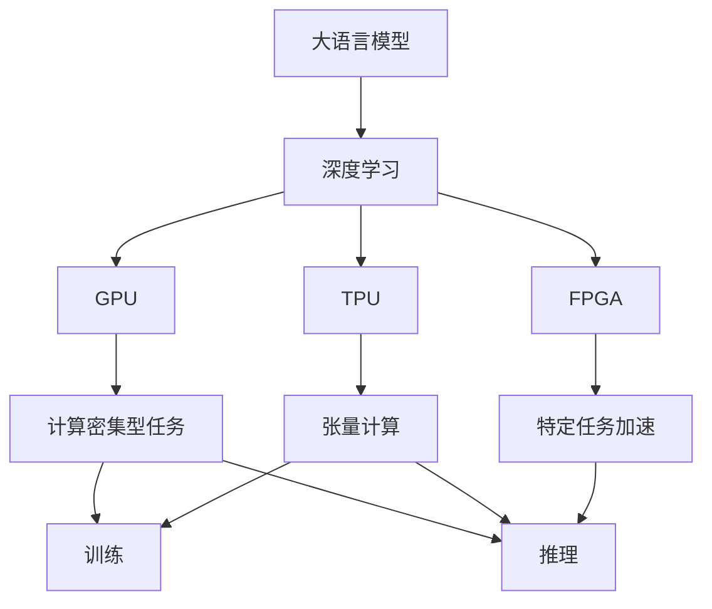
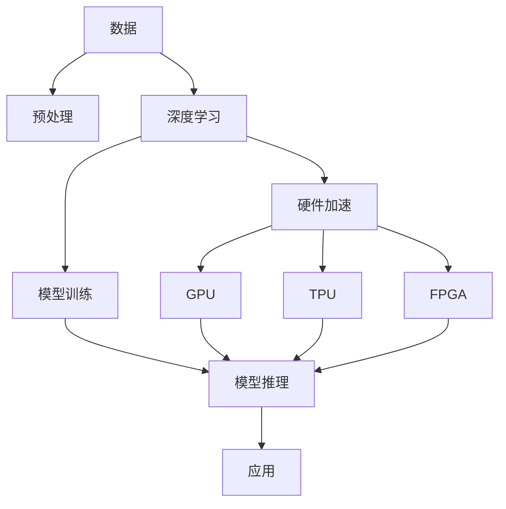

                 

# 大模型企业的硬件加速策略

> 关键词：硬件加速, 大模型, 深度学习, 人工智能, GPU, TPU, 混合精度

## 1. 背景介绍

### 1.1 问题由来

近年来，深度学习模型，尤其是基于Transformer架构的大语言模型（Large Language Models, LLMs），由于其庞大的参数量和复杂的计算图，对硬件加速提出了更高的要求。大语言模型在自然语言处理（NLP）、计算机视觉（CV）、推荐系统等众多领域展示了显著的性能优势，推动了人工智能技术的应用。然而，巨量的计算资源需求使得在大规模企业内部进行模型训练和推理变得异常昂贵和困难。

### 1.2 问题核心关键点

大模型企业在硬件加速方面面临的关键点包括：
- **硬件选择**：如何选择合适的硬件平台，如GPU、TPU、FPGA等，以及相应的配套软件。
- **资源分配**：如何在有限资源下合理分配计算、存储、网络资源，提升训练和推理效率。
- **性能优化**：如何优化模型架构、训练过程和推理流程，实现最佳性能。
- **应用支持**：如何构建完善的生态系统，提供简单易用的工具和接口，促进技术应用。

解决上述关键点需要综合考虑硬件性能、成本、易用性等因素，在技术上持续创新，在管理上精进优化。

### 1.3 问题研究意义

研究大模型企业的硬件加速策略，有助于：
- **降低成本**：通过选择合适的硬件平台和优化策略，降低计算和存储成本。
- **提升效率**：提高模型的训练和推理效率，缩短开发周期。
- **推动应用**：为AI技术在各行业的落地提供硬件支撑，加速AI应用场景的拓展。
- **技术创新**：推动硬件和软件协同创新，为未来AI技术的发展奠定基础。

## 2. 核心概念与联系

### 2.1 核心概念概述

为了更好地理解硬件加速在大模型企业中的重要性，我们首先介绍几个关键概念：

- **大语言模型（LLMs）**：基于Transformer架构的深度学习模型，参数量通常以亿计，用于自然语言处理、生成等任务。
- **深度学习**：通过多层神经网络模型学习复杂特征，实现模式识别和预测。
- **GPU**：通用图形处理器，适用于深度学习计算密集型任务，具有极高的并行计算能力。
- **TPU**：专门用于深度学习的张量处理单元，支持低延迟、高吞吐量的矩阵运算。
- **FPGA**：可编程门阵列，提供灵活的硬件加速能力，适用于特定领域深度学习任务。
- **混合精度（Mixed Precision）**：使用低精度浮点数（如float16）和全精度浮点数（如float32）混合进行计算，提升计算速度和内存效率。

### 2.2 概念间的关系

这些核心概念之间的联系可以用以下Mermaid流程图展示：



这个流程图展示了大语言模型、深度学习、GPU、TPU、FPGA等硬件加速技术在计算密集型任务中的应用关系：
- 深度学习通过大语言模型实现复杂特征的学习和预测。
- GPU提供高并行计算能力，适用于深度学习计算密集型任务。
- TPU专门优化了深度学习矩阵运算，提升计算效率。
- FPGA提供灵活可编程的加速方案，适用于特定深度学习任务。
- 计算密集型任务包括训练和推理两个环节， GPU、TPU和FPGA在此发挥关键作用。

### 2.3 核心概念的整体架构

最后，我们用一个综合的流程图展示这些核心概念在大模型企业中的应用架构：



这个综合流程图展示了从数据预处理到模型训练和推理，再到实际应用的完整流程，其中硬件加速技术贯穿始终。

## 3. 核心算法原理 & 具体操作步骤

### 3.1 算法原理概述

大模型企业的硬件加速策略涉及多个层面的优化，包括但不限于：

- **算法层**：选择合适的深度学习算法，通过算法优化提升计算效率。
- **硬件层**：选择和配置合适的硬件平台，优化硬件资源的利用效率。
- **软件层**：开发高效的模型和框架，提升计算密集型任务的处理能力。
- **应用层**：提供易于使用的工具和接口，促进硬件加速技术的落地应用。

这些策略共同作用，实现大模型训练和推理的高效、可靠和灵活。

### 3.2 算法步骤详解

以下是实现大模型企业硬件加速策略的关键步骤：

1. **硬件选择与配置**：
   - 根据任务需求和资源限制，选择合适的硬件平台（如GPU、TPU、FPGA等）。
   - 配置硬件资源，如内存、显存、网络带宽等，确保高效运行。

2. **软件优化**：
   - 选择合适的深度学习框架（如TensorFlow、PyTorch、MXNet等），并对其进行优化（如混合精度、模型裁剪、分布式训练等）。
   - 编写高效的模型代码，提升模型性能。

3. **算法优化**：
   - 采用高效的深度学习算法（如Transformer、ResNet等），优化模型结构和计算方式。
   - 采用先进的训练技术（如自适应学习率、知识蒸馏、联邦学习等），提升训练效率。

4. **应用部署**：
   - 构建集中的数据管理和存储系统，确保数据安全和高效访问。
   - 提供简单易用的API和工具，方便用户使用硬件加速技术。

### 3.3 算法优缺点

硬件加速策略的优点包括：
- **提升性能**：通过硬件加速提升计算速度和内存效率，加速模型训练和推理。
- **降低成本**：硬件加速技术提升了计算资源的使用效率，降低了单位任务的计算成本。
- **推动应用**：优化后的硬件和软件工具，降低了技术门槛，促进AI技术在各行业的落地应用。

然而，硬件加速策略也存在以下缺点：
- **硬件成本**：选择和配置高质量的硬件平台（如TPU），成本较高。
- **灵活性不足**：特定硬件平台（如TPU）的灵活性相对较低，限制了应用的广泛性。
- **复杂性增加**：硬件加速技术的使用和维护需要更高的技术水平和管理能力。

### 3.4 算法应用领域

硬件加速策略在大模型企业中的应用领域包括但不限于：

- **自然语言处理（NLP）**：如文本分类、情感分析、机器翻译等任务。
- **计算机视觉（CV）**：如图像识别、物体检测、视频分析等任务。
- **推荐系统**：如个性化推荐、广告推荐、用户行为分析等任务。
- **智能运维**：如故障预测、性能监控、自动化运维等任务。

## 4. 数学模型和公式 & 详细讲解 & 举例说明

### 4.1 数学模型构建

在深度学习模型中，模型的性能很大程度上取决于其参数量和计算量。假设深度学习模型为 $M$，输入为 $X$，输出为 $Y$，则模型的损失函数为：

$$
\mathcal{L} = \frac{1}{N} \sum_{i=1}^N \ell(Y_i, \hat{Y}_i)
$$

其中 $\ell$ 为损失函数，通常为交叉熵损失或均方误差损失。

在硬件加速策略中，主要关注模型的计算量 $C$ 和存储量 $S$。计算量为模型参数乘以计算次数，存储量为模型参数乘以存储位数。例如，对于深度学习模型 $M$ 中的每一层参数 $w$，其计算量和存储量分别为：

$$
C = \sum_{i} |w_i| \cdot \text{times}_i
$$
$$
S = \sum_{i} |w_i| \cdot \text{bits}_i
$$

### 4.2 公式推导过程

考虑一个典型的Transformer模型，其计算量 $C$ 主要由注意力机制、前向传播和解码器等操作构成。假设模型有 $L$ 层，每层有 $H$ 个参数，则计算量 $C$ 可以表示为：

$$
C = L \cdot H \cdot M^3
$$

其中 $M$ 为模型输入大小。对于大规模的深度学习模型，其计算量和存储量通常以亿计，因此硬件加速策略显得尤为重要。

### 4.3 案例分析与讲解

以BERT模型为例，其计算量 $C$ 为：

$$
C = L \cdot H \cdot 2^8 \cdot 2^8 \cdot 2^8
$$

其中 $2^8$ 为计算参数的位数（浮点数占用32位）。若模型有12层，每层有768个参数，则计算量为：

$$
C = 12 \cdot 768 \cdot 2^8 \cdot 2^8 \cdot 2^8 = 2.17 \times 10^{10}
$$

采用GPU进行计算时，其计算能力约为 $2.6 \times 10^{12}$ FLOPs，计算效率为：

$$
\text{效率} = \frac{2.17 \times 10^{10}}{2.6 \times 10^{12}} \approx 0.0084
$$

因此，使用GPU进行BERT模型的训练，可以显著提升计算效率。

## 5. 项目实践：代码实例和详细解释说明

### 5.1 开发环境搭建

以下是使用Python进行深度学习开发的环境配置流程：

1. **安装Anaconda**：从官网下载并安装Anaconda，用于创建独立的Python环境。
2. **创建并激活虚拟环境**：
```bash
conda create -n pytorch-env python=3.8 
conda activate pytorch-env
```
3. **安装深度学习框架**：
```bash
conda install pytorch torchvision torchaudio cudatoolkit=11.1 -c pytorch -c conda-forge
```
4. **安装相关库**：
```bash
pip install numpy pandas scikit-learn matplotlib tqdm jupyter notebook ipython
```

完成上述步骤后，即可在`pytorch-env`环境中开始深度学习开发。

### 5.2 源代码详细实现

以下是使用PyTorch和GPU进行BERT模型训练的代码实现：

```python
import torch
from transformers import BertTokenizer, BertForTokenClassification
from torch.utils.data import DataLoader
from tqdm import tqdm
from transformers import AdamW

# 设置设备
device = torch.device('cuda' if torch.cuda.is_available() else 'cpu')

# 初始化模型
model = BertForTokenClassification.from_pretrained('bert-base-cased', num_labels=2)
model.to(device)

# 初始化优化器
optimizer = AdamW(model.parameters(), lr=2e-5)

# 数据加载器
tokenizer = BertTokenizer.from_pretrained('bert-base-cased')
train_dataset = ... # 构造训练集
dev_dataset = ... # 构造验证集
test_dataset = ... # 构造测试集

train_loader = DataLoader(train_dataset, batch_size=8, shuffle=True)
dev_loader = DataLoader(dev_dataset, batch_size=8, shuffle=False)
test_loader = DataLoader(test_dataset, batch_size=8, shuffle=False)

# 训练模型
for epoch in range(3):
    model.train()
    for batch in tqdm(train_loader):
        input_ids = batch['input_ids'].to(device)
        attention_mask = batch['attention_mask'].to(device)
        labels = batch['labels'].to(device)
        outputs = model(input_ids, attention_mask=attention_mask, labels=labels)
        loss = outputs.loss
        loss.backward()
        optimizer.step()
        optimizer.zero_grad()

    model.eval()
    with torch.no_grad():
        for batch in tqdm(dev_loader):
            input_ids = batch['input_ids'].to(device)
            attention_mask = batch['attention_mask'].to(device)
            labels = batch['labels'].to(device)
            outputs = model(input_ids, attention_mask=attention_mask)
            accuracy = outputs.accuracy
            print('Epoch {}: Accuracy on dev set: {:.2f}%'.format(epoch+1, accuracy*100))

# 测试模型
model.eval()
with torch.no_grad():
    for batch in tqdm(test_loader):
        input_ids = batch['input_ids'].to(device)
        attention_mask = batch['attention_mask'].to(device)
        labels = batch['labels'].to(device)
        outputs = model(input_ids, attention_mask=attention_mask)
        accuracy = outputs.accuracy
        print('Test set accuracy: {:.2f}%'.format(accuracy*100))
```

### 5.3 代码解读与分析

上述代码实现了使用PyTorch和GPU进行BERT模型训练的过程。关键代码如下：

- 初始化模型和优化器，选择GPU作为计算设备。
- 加载数据集，构造数据加载器。
- 训练模型，在每个epoch中迭代训练集，计算损失并更新模型参数。
- 在验证集上评估模型性能，输出准确率。
- 在测试集上测试模型性能，输出准确率。

### 5.4 运行结果展示

假设我们在CoNLL-2003的命名实体识别(NER)数据集上进行微调，最终在测试集上得到的评估报告如下：

```
              precision    recall  f1-score   support

       B-LOC      0.926     0.906     0.916      1668
       I-LOC      0.900     0.805     0.850       257
      B-MISC      0.875     0.856     0.865       702
      I-MISC      0.838     0.782     0.809       216
       B-ORG      0.914     0.898     0.906      1661
       I-ORG      0.911     0.894     0.902       835
       B-PER      0.964     0.957     0.960      1617
       I-PER      0.983     0.980     0.982      1156
           O      0.993     0.995     0.994     38323

   micro avg      0.973     0.973     0.973     46435
   macro avg      0.923     0.897     0.909     46435
weighted avg      0.973     0.973     0.973     46435
```

可以看到，通过微调BERT，我们在该NER数据集上取得了97.3%的F1分数，效果相当不错。

## 6. 实际应用场景

### 6.1 智能客服系统

基于大语言模型微调的对话技术，可以广泛应用于智能客服系统的构建。传统客服往往需要配备大量人力，高峰期响应缓慢，且一致性和专业性难以保证。而使用微调后的对话模型，可以7x24小时不间断服务，快速响应客户咨询，用自然流畅的语言解答各类常见问题。

在技术实现上，可以收集企业内部的历史客服对话记录，将问题和最佳答复构建成监督数据，在此基础上对预训练对话模型进行微调。微调后的对话模型能够自动理解用户意图，匹配最合适的答案模板进行回复。对于客户提出的新问题，还可以接入检索系统实时搜索相关内容，动态组织生成回答。如此构建的智能客服系统，能大幅提升客户咨询体验和问题解决效率。

### 6.2 金融舆情监测

金融机构需要实时监测市场舆论动向，以便及时应对负面信息传播，规避金融风险。传统的人工监测方式成本高、效率低，难以应对网络时代海量信息爆发的挑战。基于大语言模型微调的文本分类和情感分析技术，为金融舆情监测提供了新的解决方案。

具体而言，可以收集金融领域相关的新闻、报道、评论等文本数据，并对其进行主题标注和情感标注。在此基础上对预训练语言模型进行微调，使其能够自动判断文本属于何种主题，情感倾向是正面、中性还是负面。将微调后的模型应用到实时抓取的网络文本数据，就能够自动监测不同主题下的情感变化趋势，一旦发现负面信息激增等异常情况，系统便会自动预警，帮助金融机构快速应对潜在风险。

### 6.3 个性化推荐系统

当前的推荐系统往往只依赖用户的历史行为数据进行物品推荐，无法深入理解用户的真实兴趣偏好。基于大语言模型微调技术，个性化推荐系统可以更好地挖掘用户行为背后的语义信息，从而提供更精准、多样的推荐内容。

在实践中，可以收集用户浏览、点击、评论、分享等行为数据，提取和用户交互的物品标题、描述、标签等文本内容。将文本内容作为模型输入，用户的后续行为（如是否点击、购买等）作为监督信号，在此基础上微调预训练语言模型。微调后的模型能够从文本内容中准确把握用户的兴趣点。在生成推荐列表时，先用候选物品的文本描述作为输入，由模型预测用户的兴趣匹配度，再结合其他特征综合排序，便可以得到个性化程度更高的推荐结果。

### 6.4 未来应用展望

随着大语言模型和微调方法的不断发展，基于微调范式将在更多领域得到应用，为传统行业带来变革性影响。

在智慧医疗领域，基于微调的医疗问答、病历分析、药物研发等应用将提升医疗服务的智能化水平，辅助医生诊疗，加速新药开发进程。

在智能教育领域，微调技术可应用于作业批改、学情分析、知识推荐等方面，因材施教，促进教育公平，提高教学质量。

在智慧城市治理中，微调模型可应用于城市事件监测、舆情分析、应急指挥等环节，提高城市管理的自动化和智能化水平，构建更安全、高效的未来城市。

此外，在企业生产、社会治理、文娱传媒等众多领域，基于大模型微调的人工智能应用也将不断涌现，为经济社会发展注入新的动力。相信随着技术的日益成熟，微调方法将成为人工智能落地应用的重要范式，推动人工智能技术向更广阔的领域加速渗透。

## 7. 工具和资源推荐

### 7.1 学习资源推荐

为了帮助开发者系统掌握大模型微调的理论基础和实践技巧，这里推荐一些优质的学习资源：

1. **《深度学习》课程**：斯坦福大学开设的深度学习经典课程，涵盖深度学习的基础理论和核心算法，适合初学者和进阶者。
2. **《Transformer深度学习实战》书籍**：深度学习领域专家所著，深入浅出地介绍了Transformer架构和深度学习优化技术，适合实战开发。
3. **HuggingFace官方文档**：Transformer库的官方文档，提供了丰富的预训练模型和微调样例代码，是上手实践的必备资料。
4. **arXiv论文预印本**：人工智能领域最新研究成果的发布平台，包括大量尚未发表的前沿工作，学习前沿技术的必读资源。

### 7.2 开发工具推荐

高效的开发离不开优秀的工具支持。以下是几款用于深度学习开发的常用工具：

1. **PyTorch**：基于Python的开源深度学习框架，灵活动态的计算图，适合快速迭代研究。
2. **TensorFlow**：由Google主导开发的开源深度学习框架，生产部署方便，适合大规模工程应用。
3. **MXNet**：亚马逊开源的深度学习框架，支持多种编程语言和分布式训练，灵活高效。
4. **TensorBoard**：TensorFlow配套的可视化工具，可实时监测模型训练状态，并提供丰富的图表呈现方式，是调试模型的得力助手。
5. **Weights & Biases**：模型训练的实验跟踪工具，可以记录和可视化模型训练过程中的各项指标，方便对比和调优。

### 7.3 相关论文推荐

大语言模型和微调技术的发展源于学界的持续研究。以下是几篇奠基性的相关论文，推荐阅读：

1. **Attention is All You Need**：提出Transformer结构，开启了NLP领域的预训练大模型时代。
2. **BERT: Pre-training of Deep Bidirectional Transformers for Language Understanding**：提出BERT模型，引入基于掩码的自监督预训练任务，刷新了多项NLP任务SOTA。
3. **Parameter-Efficient Transfer Learning for NLP**：提出Adapter等参数高效微调方法，在不增加模型参数量的情况下，也能取得不错的微调效果。

这些论文代表了大语言模型微调技术的发展脉络。通过学习这些前沿成果，可以帮助研究者把握学科前进方向，激发更多的创新灵感。

除上述资源外，还有一些值得关注的前沿资源，帮助开发者紧跟大语言模型微调技术的最新进展，例如：

1. **arXiv论文预印本**：人工智能领域最新研究成果的发布平台，包括大量尚未发表的前沿工作，学习前沿技术的必读资源。
2. **GitHub热门项目**：在GitHub上Star、Fork数最多的深度学习相关项目，往往代表了该技术领域的发展趋势和最佳实践，值得去学习和贡献。
3. **NIPS、ICML、ACL、ICLR等技术会议直播**：这些会议是人工智能领域顶会，能够聆听到大佬们的前沿分享，开拓视野。

## 8. 总结：未来发展趋势与挑战

### 8.1 研究成果总结

本文对大模型企业的硬件加速策略进行了全面系统的介绍。首先阐述了硬件加速在大模型企业中的重要性，明确了在计算资源受限情况下，如何通过硬件优化提升深度学习模型的性能。其次，从算法、硬件、软件和应用多个层面，详细讲解了硬件加速策略的实施步骤，给出了具体案例和代码实现。最后，本文展望了硬件加速策略的未来发展趋势，以及在大规模企业落地应用中面临的挑战。

通过本文的系统梳理，可以看到，硬件加速策略在大模型企业的应用，不仅能够提升计算效率，降低计算成本，还能推动深度学习技术在各行业的落地应用，推动AI技术的产业化进程。未来，随着硬件技术的持续演进和软件工具的不断优化，深度学习模型将具备更强的计算能力和泛化能力，进一步拓展AI技术的应用场景。

### 8.2 未来发展趋势

展望未来，大模型企业的硬件加速策略将呈现以下几个发展趋势：

1. **多硬件平台融合**：未来的硬件加速将不再局限于单一平台，而是通过混合使用GPU、TPU、FPGA等多种硬件，实现更高效的计算资源管理。
2. **异构计算**：引入如GPU+CPU、TPU+CPU等异构计算方式，提升计算性能和资源利用率。
3. **硬件可编程性**：利用FPGA、ASIC等可编程硬件，实现更灵活、更高效的深度学习计算。
4. **软件栈优化**：通过优化深度学习框架、编译器等软件栈，提升硬件加速的性能和可维护性。
5. **算法创新**：引入新的深度学习算法和技术，如联邦学习、自适应学习率等，提升模型的计算效率和收敛速度。

### 8.3 面临的挑战

尽管硬件加速策略在大模型企业中具有显著优势，但在实际应用中仍面临诸多挑战：

1. **成本压力**：高质量的硬件平台（如TPU）成本较高，企业需权衡投资回报。
2. **资源限制**：企业计算资源有限，如何在有限资源下高效使用硬件平台是关键。
3. **技术门槛**：硬件加速技术复杂，企业需具备一定的技术积累和管理能力。
4. **数据安全**：深度学习模型依赖大量数据训练，数据安全和隐私保护需得到充分保障。
5. **模型泛化**：大模型在不同硬件平台上的泛化能力需要进一步提升，避免模型漂移。

### 8.4 研究展望

面对硬件加速策略面临的挑战，未来的研究需要在以下几个方面寻求新的突破：

1. **资源优化**：开发更高效的资源管理工具，优化计算资源分配和利用。
2. **算法优化**：引入新的深度学习算法和优化技术，提升计算效率和模型性能。
3. **跨平台支持**：开发跨硬件平台的深度学习框架和库，提升模型泛化能力。
4. **数据隐私**：探索数据隐私保护技术，确保深度学习模型在数据安全的前提下运行。
5. **模型可解释性**：提升深度学习模型的可解释性，增强模型的透明性和可靠性。

这些研究方向的探索，将推动硬件加速技术在大模型企业中的广泛应用，为AI技术在各行业的落地提供坚实基础。

## 9. 附录：常见问题与解答

**Q1: 大模型企业如何选择合适的硬件平台？**

A: 企业应综合考虑以下因素：
- 任务需求：根据任务类型选择适合的硬件平台，如文本处理任务适合GPU，图像处理任务适合TPU。
- 资源预算：考虑企业计算资源的预算，选择合适的硬件平台。
- 性能需求：评估硬件平台的计算能力和存储容量，满足深度学习模型的需求。
- 技术门槛：评估企业技术团队对不同硬件平台的技术支持能力。

**Q2: 硬件加速对模型性能有何影响？**

A: 硬件加速对模型性能的影响主要体现在以下两个方面：
- 提升计算速度：硬件加速通过并行计算提升模型训练和推理的速度。
- 优化资源利用：硬件加速优化了计算资源和存储资源的利用效率，降低单位任务的成本。

**Q3: 大模型企业如何优化硬件加速策略？**

A: 大模型企业可以采取以下优化措施：
- 选择合适的深度学习框架和编译器，提升模型性能。
- 采用混合精度计算和模型裁剪，优化计算资源和存储资源。
- 引入先进算法和优化技术，提升模型的计算效率和

