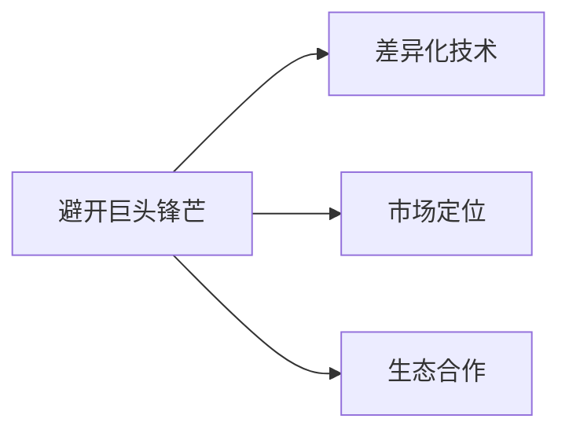
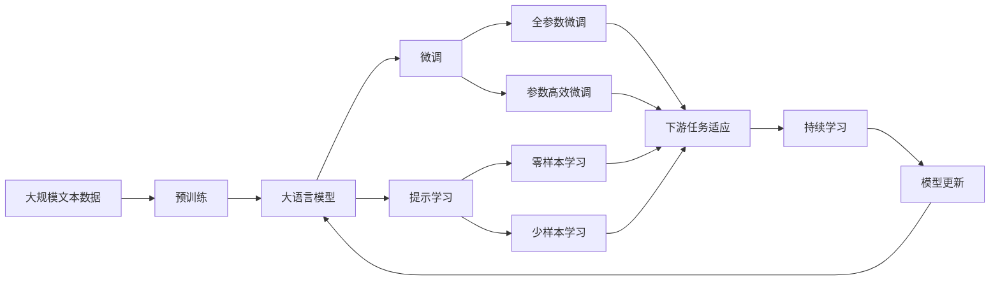

                 

# 大模型创业：避开巨头锋芒，搞钱才是要紧事

> 关键词：大模型创业，技术栈选择，避开巨头锋芒，小微团队，敏捷开发，开源社区，持续集成，开源代码，商业应用，开源项目，开源生态，创业公司，商业化，技术栈，生态合作

## 1. 背景介绍

### 1.1 问题由来

随着深度学习技术的快速发展，大模型已经成为创业公司的核心竞争力。然而，巨头的存在让创业公司在技术、人才、资金等方面面临巨大挑战。如何在巨头林立的竞争中脱颖而出，实现技术创业的商业化，成为了许多创业者面临的难题。

本文将从技术栈选择、避开巨头锋芒、敏捷开发、开源社区、持续集成等多个角度，深入探讨大模型创业公司应该如何生存和发展。

### 1.2 问题核心关键点

大模型创业的核心在于如何利用前沿技术，构建高效的商业模型，实现快速迭代和市场落地。核心关键点包括：

- **技术栈选择**：选择适合创业公司规模和需求的技术栈，高效构建和维护模型系统。
- **避开巨头锋芒**：利用技术差异化、市场定位、生态合作等手段，避免直接与巨头竞争。
- **敏捷开发**：通过敏捷开发、持续集成等方式，加速模型迭代和商业化进程。
- **开源社区**：积极参与开源社区，利用开源工具和代码，提升开发效率和技术深度。
- **持续集成**：实现代码的快速迭代和验证，确保模型系统稳定可靠。
- **商业应用**：将模型技术转化为实际产品，解决用户痛点，实现商业价值。
- **生态合作**：与其他开源项目和公司合作，共同推动行业发展。

这些关键点将帮助创业公司在大模型领域取得成功，避免巨头林立的挑战。

### 1.3 问题研究意义

本文旨在帮助大模型创业公司系统掌握技术栈选择、避开巨头锋芒、敏捷开发等关键技术，快速实现模型技术商业化。通过系统梳理这些关键点，为创业者提供全面的技术指引和经验借鉴，帮助他们在大模型领域取得突破和成功。

## 2. 核心概念与联系

### 2.1 核心概念概述

为更好地理解大模型创业的各个环节，本节将介绍几个关键概念：

- **大模型创业**：指利用前沿深度学习技术，构建高效模型系统，实现商业应用和市场落地的过程。
- **技术栈选择**：指根据公司规模、技术需求和商业目标，选择合适的技术工具和框架，构建高效模型系统的过程。
- **避开巨头锋芒**：指通过差异化技术、市场定位和生态合作等手段，避免直接与巨头竞争，实现市场切入。
- **敏捷开发**：指通过快速迭代、持续集成等方式，加速模型系统构建和商业化进程，提升开发效率和技术深度。
- **开源社区**：指通过参与开源项目，利用开源工具和代码，提升开发效率和技术深度，构建开源生态。
- **持续集成**：指通过自动化构建、测试和部署等手段，确保代码的快速迭代和验证，提升模型系统稳定性。
- **商业应用**：指将模型技术转化为实际产品，解决用户痛点，实现商业价值。
- **生态合作**：指通过与其他开源项目和公司合作，共同推动行业发展，构建稳定的技术生态。

这些核心概念之间的逻辑关系可以通过以下Mermaid流程图来展示：


这个流程图展示了大模型创业的各个环节和它们之间的关系：

1. 大模型创业首先选择合适的技术栈。
2. 通过技术差异化和市场定位避开巨头锋芒。
3. 利用敏捷开发和持续集成加快模型系统迭代。
4. 参与开源社区，利用开源工具和代码提升开发效率。
5. 实现商业应用，解决用户痛点，实现商业价值。
6. 与其他开源项目和公司合作，构建技术生态。

这些核心概念共同构成了大模型创业的完整生态系统，使得公司能够在激烈的市场竞争中脱颖而出。

### 2.2 概念间的关系

这些核心概念之间存在着紧密的联系，形成了大模型创业的完整生态系统。下面我们通过几个Mermaid流程图来展示这些概念之间的关系。

#### 2.2.1 大模型创业的完整流程


这个流程图展示了从技术栈选择到大模型创业的完整流程，每个环节都在为最终商业应用服务。

#### 2.2.2 避开巨头锋芒的具体策略



这个流程图展示了避开巨头锋芒的几种具体策略，包括技术差异化、市场定位和生态合作。

#### 2.2.3 敏捷开发与持续集成的关系


这个流程图展示了敏捷开发和持续集成之间的关系，持续集成是敏捷开发的重要组成部分。

### 2.3 核心概念的整体架构

最后，我们用一个综合的流程图来展示这些核心概念在大模型创业过程中的整体架构：



这个综合流程图展示了从预训练到大模型微调，再到持续学习的完整过程。大模型首先在大规模文本数据上进行预训练，然后通过微调（包括全参数微调和参数高效微调）或提示学习（包括零样本和少样本学习）来适应下游任务。最后，通过持续学习技术，模型可以不断更新和适应新的任务和数据。

通过这些流程图，我们可以更清晰地理解大模型创业过程中各个环节的联系和作用，为后续深入讨论具体的技术实现和应用方法奠定基础。

## 3. 核心算法原理 & 具体操作步骤
### 3.1 算法原理概述

大模型创业的核心在于如何高效构建和维护模型系统，实现商业化应用。这涉及到模型的选择、构建、训练和应用等多个环节。

- **模型选择**：选择合适的预训练模型，根据业务需求进行微调或改编。
- **构建与训练**：选择合适的技术栈和工具，构建模型系统，并在训练集上训练模型。
- **应用与优化**：将模型应用到实际场景，通过反馈优化模型性能。

以下是大模型创业的关键算法原理：

1. **预训练模型选择**：选择适合业务需求的预训练模型，如BERT、GPT等。
2. **微调与改编**：根据业务需求，对预训练模型进行微调或改编，提高模型适应性。
3. **代码实现与优化**：选择合适的技术栈和工具，实现模型系统，并优化代码效率。
4. **模型部署与维护**：将模型部署到实际应用中，并通过反馈不断优化模型性能。

### 3.2 算法步骤详解

#### 3.2.1 预训练模型选择

选择合适的预训练模型是创业公司构建高效模型系统的第一步。一般来说，应根据业务需求选择适合的预训练模型，如：

- **BERT**：适用于文本分类、命名实体识别等任务。
- **GPT**：适用于自然语言生成、对话系统等任务。
- **RoBERTa**：适用于大规模文本处理任务，如多语言翻译、文本分类等。
- **T5**：适用于文本生成、摘要等任务。

选择预训练模型时，需考虑模型的规模、性能、训练数据量等因素，以确保模型能够满足实际需求。

#### 3.2.2 微调与改编

预训练模型通常需要进行微调或改编，以提高其适应性。微调与改编的流程如下：

1. **数据准备**：收集和标注业务数据，构建训练集。
2. **模型微调**：在训练集上训练模型，调整模型参数以适应业务需求。
3. **模型改编**：根据业务需求，对模型结构进行改编，如添加特定层、修改损失函数等。
4. **模型验证**：在验证集上评估模型性能，调整超参数。
5. **模型部署**：将模型部署到实际应用中，并根据反馈优化模型。

#### 3.2.3 代码实现与优化

代码实现与优化是大模型创业的关键环节，涉及技术栈选择和工具使用。主要流程如下：

1. **技术栈选择**：根据项目规模和需求，选择合适的技术栈，如PyTorch、TensorFlow等。
2. **代码实现**：根据业务需求，实现模型系统和算法，编写代码。
3. **代码优化**：通过代码重构、性能调优等方式，提高代码效率和可维护性。
4. **代码集成**：将模型系统与业务系统集成，实现功能。
5. **代码部署**：将代码部署到实际应用中，并通过反馈不断优化。

#### 3.2.4 模型部署与维护

模型部署与维护是大模型创业的最终环节，涉及模型系统在实际应用中的运行和优化。主要流程如下：

1. **模型部署**：将模型部署到实际应用中，如服务器、云平台等。
2. **应用优化**：根据业务需求和用户反馈，优化模型性能，提高模型效果。
3. **系统维护**：监控模型系统的运行状态，确保系统稳定可靠。
4. **用户反馈**：收集用户反馈，调整模型和业务系统。

### 3.3 算法优缺点

大模型创业的算法具有以下优点：

1. **高效**：利用预训练模型和现有技术，可以快速构建和优化模型系统。
2. **可扩展**：预训练模型和现有技术具有良好可扩展性，可以轻松适应不同规模和需求。
3. **灵活性**：可以根据业务需求进行调整和优化，适应不同场景和应用。

但同时也存在以下缺点：

1. **依赖预训练模型**：对预训练模型的依赖较强，需要大量数据进行预训练。
2. **技术复杂性**：需要具备较强的技术储备和实现能力。
3. **成本高**：预训练模型和现有技术的实现和维护成本较高。
4. **竞争激烈**：巨头公司存在技术优势和市场优势，创业公司面临巨大挑战。

### 3.4 算法应用领域

大模型创业的算法广泛应用于以下领域：

- **金融科技**：利用预训练模型进行情感分析、舆情监测、风险预测等。
- **医疗健康**：利用预训练模型进行疾病诊断、治疗方案推荐等。
- **智能制造**：利用预训练模型进行设备预测维护、生产过程优化等。
- **智慧城市**：利用预训练模型进行交通管理、安防监控等。
- **零售电商**：利用预训练模型进行用户行为分析、推荐系统优化等。

这些应用领域都具有大规模文本数据处理的需求，适合使用大模型创业的技术。

## 4. 数学模型和公式 & 详细讲解 & 举例说明
### 4.1 数学模型构建

大模型创业的数学模型主要涉及预训练模型、微调模型、提示模型等。以BERT为例，其数学模型如下：

- **预训练模型**：使用语言模型任务（如掩码语言模型）进行预训练，目标是最大化下一个词的预测概率。
- **微调模型**：在特定任务上进行微调，调整模型参数以适应任务需求。
- **提示模型**：通过构造提示模板，提高模型在少样本或零样本情况下的性能。

#### 4.1.1 掩码语言模型

掩码语言模型（Masked Language Model, MLM）是BERT的核心预训练任务之一，其目标是通过预测被掩码的单词来最大化上下文的语言理解能力。掩码语言模型的公式如下：

$$
\mathcal{L}_{MLM} = -\frac{1}{2N}\sum_{i=1}^N\sum_{j=1}^N \log P(w_j|w_1,...,w_{i-1},[M],w_{i+1},...,w_N)
$$

其中，$w_j$表示序列中的第$j$个单词，$[M]$表示被掩码的单词，$P$表示预测概率。

#### 4.1.2 微调模型

微调模型的目标是通过特定任务的数据集，调整模型参数以适应任务需求。假设任务的输入为$x$，输出为$y$，微调模型的目标函数如下：

$$
\mathcal{L} = \frac{1}{N}\sum_{i=1}^N\ell(x_i,y_i)
$$

其中，$\ell$表示损失函数，可以是交叉熵、均方误差等。

#### 4.1.3 提示模型

提示模型通过构造提示模板，提高模型在少样本或零样本情况下的性能。假设提示模板为$P$，模型的输出为$y$，提示模型的目标函数如下：

$$
\mathcal{L} = \frac{1}{N}\sum_{i=1}^N\ell(P(x_i),y_i)
$$

其中，$\ell$表示损失函数，可以是匹配误差、生成误差等。

### 4.2 公式推导过程

以下是掩码语言模型、微调模型和提示模型的详细推导过程：

#### 4.2.1 掩码语言模型

掩码语言模型的推导过程如下：

1. **上下文表示**：通过自注意力机制，计算序列中每个单词的上下文表示。
2. **掩码预测**：通过预测被掩码单词的下一个词，最大化上下文表示的预测概率。
3. **损失函数**：使用交叉熵损失函数，计算预测值和真实值的差异。

#### 4.2.2 微调模型

微调模型的推导过程如下：

1. **特征提取**：通过预训练模型提取输入$x$的特征表示$z$。
2. **分类器**：通过特定任务的分类器，将特征表示映射到输出$y$。
3. **损失函数**：使用特定任务的损失函数$\ell$，计算预测值和真实值的差异。

#### 4.2.3 提示模型

提示模型的推导过程如下：

1. **提示模板**：通过构造提示模板$P$，引导模型生成输出$y$。
2. **生成过程**：通过预训练模型生成提示模板对应的输出$y$。
3. **损失函数**：使用特定任务的损失函数$\ell$，计算生成值和真实值的差异。

### 4.3 案例分析与讲解

假设我们利用BERT进行情感分析任务的微调。

#### 4.3.1 数据准备

收集情感分析数据集，如IMDB电影评论数据集，将其划分为训练集和测试集。

#### 4.3.2 模型微调

使用预训练的BERT模型，将其顶部全连接层替换为新的输出层，并在训练集上训练模型。

#### 4.3.3 模型验证

在验证集上评估模型性能，根据精度、召回率等指标调整超参数。

#### 4.3.4 模型部署

将模型部署到实际应用中，进行情感分析预测。

#### 4.3.5 用户反馈

收集用户反馈，调整模型和业务系统。

## 5. 项目实践：代码实例和详细解释说明
### 5.1 开发环境搭建

在进行大模型创业的实践前，我们需要准备好开发环境。以下是使用Python进行PyTorch开发的环境配置流程：

1. 安装Anaconda：从官网下载并安装Anaconda，用于创建独立的Python环境。

2. 创建并激活虚拟环境：
```bash
conda create -n pytorch-env python=3.8 
conda activate pytorch-env
```

3. 安装PyTorch：根据CUDA版本，从官网获取对应的安装命令。例如：
```bash
conda install pytorch torchvision torchaudio cudatoolkit=11.1 -c pytorch -c conda-forge
```

4. 安装Transformers库：
```bash
pip install transformers
```

5. 安装各类工具包：
```bash
pip install numpy pandas scikit-learn matplotlib tqdm jupyter notebook ipython
```

完成上述步骤后，即可在`pytorch-env`环境中开始大模型创业的实践。

### 5.2 源代码详细实现

下面我们以金融情感分析任务为例，给出使用Transformers库对BERT模型进行微调的PyTorch代码实现。

首先，定义情感分析任务的数据处理函数：

```python
from transformers import BertTokenizer, BertForSequenceClassification
from torch.utils.data import Dataset
import torch

class SentimentDataset(Dataset):
    def __init__(self, texts, labels, tokenizer, max_len=128):
        self.texts = texts
        self.labels = labels
        self.tokenizer = tokenizer
        self.max_len = max_len
        
    def __len__(self):
        return len(self.texts)
    
    def __getitem__(self, item):
        text = self.texts[item]
        label = self.labels[item]
        
        encoding = self.tokenizer(text, return_tensors='pt', max_length=self.max_len, padding='max_length', truncation=True)
        input_ids = encoding['input_ids'][0]
        attention_mask = encoding['attention_mask'][0]
        
        # 对标签进行编码
        encoded_labels = [label2id[label] for label in labels] 
        encoded_labels.extend([label2id['neutral']] * (self.max_len - len(encoded_labels)))
        labels = torch.tensor(encoded_labels, dtype=torch.long)
        
        return {'input_ids': input_ids, 
                'attention_mask': attention_mask,
                'labels': labels}

# 标签与id的映射
label2id = {'positive': 1, 'negative': 0, 'neutral': 2}
id2label = {v: k for k, v in label2id.items()}

# 创建dataset
tokenizer = BertTokenizer.from_pretrained('bert-base-cased')

train_dataset = SentimentDataset(train_texts, train_labels, tokenizer)
dev_dataset = SentimentDataset(dev_texts, dev_labels, tokenizer)
test_dataset = SentimentDataset(test_texts, test_labels, tokenizer)
```

然后，定义模型和优化器：

```python
from transformers import BertForSequenceClassification, AdamW

model = BertForSequenceClassification.from_pretrained('bert-base-cased', num_labels=len(label2id))

optimizer = AdamW(model.parameters(), lr=2e-5)
```

接着，定义训练和评估函数：

```python
from torch.utils.data import DataLoader
from tqdm import tqdm
from sklearn.metrics import classification_report

device = torch.device('cuda') if torch.cuda.is_available() else torch.device('cpu')
model.to(device)

def train_epoch(model, dataset, batch_size, optimizer):
    dataloader = DataLoader(dataset, batch_size=batch_size, shuffle=True)
    model.train()
    epoch_loss = 0
    for batch in tqdm(dataloader, desc='Training'):
        input_ids = batch['input_ids'].to(device)
        attention_mask = batch['attention_mask'].to(device)
        labels = batch['labels'].to(device)
        model.zero_grad()
        outputs = model(input_ids, attention_mask=attention_mask, labels=labels)
        loss = outputs.loss
        epoch_loss += loss.item()
        loss.backward()
        optimizer.step()
    return epoch_loss / len(dataloader)

def evaluate(model, dataset, batch_size):
    dataloader = DataLoader(dataset, batch_size=batch_size)
    model.eval()
    preds, labels = [], []
    with torch.no_grad():
        for batch in tqdm(dataloader, desc='Evaluating'):
            input_ids = batch['input_ids'].to(device)
            attention_mask = batch['attention_mask'].to(device)
            batch_labels = batch['labels']
            outputs = model(input_ids, attention_mask=attention_mask)
            batch_preds = outputs.logits.argmax(dim=2).to('cpu').tolist()
            batch_labels = batch_labels.to('cpu').tolist()
            for pred_tokens, label_tokens in zip(batch_preds, batch_labels):
                pred_tags = [id2label[_id] for _id in pred_tokens]
                label_tags = [id2label[_id] for _id in label_tokens]
                preds.append(pred_tags[:len(label_tags)])
                labels.append(label_tags)
                
    print(classification_report(labels, preds))
```

最后，启动训练流程并在测试集上评估：

```python
epochs = 5
batch_size = 16

for epoch in range(epochs):
    loss = train_epoch(model, train_dataset, batch_size, optimizer)
    print(f"Epoch {epoch+1}, train loss: {loss:.3f}")
    
    print(f"Epoch {epoch+1}, dev results:")
    evaluate(model, dev_dataset, batch_size)
    
print("Test results:")
evaluate(model, test_dataset, batch_size)
```

以上就是使用PyTorch对BERT进行情感分析任务微调的完整代码实现。可以看到，得益于Transformers库的强大封装，我们可以用相对简洁的代码完成BERT模型的加载和微调。

### 5.3 代码解读与分析

让我们再详细解读一下关键代码的实现细节：

**SentimentDataset类**：
- `__init__`方法：初始化文本、标签、分词器等关键组件。
- `__len__`方法：返回数据集的样本数量。
- `__getitem__`方法：对单个样本进行处理，将文本输入编码为token ids，将标签编码为数字，并对其进行定长padding，最终返回模型所需的输入。

**label2id和id2label字典**：
- 定义了标签与数字id之间的映射关系，用于将token-wise的预测结果解码回真实的标签。

**训练和评估函数**：
- 使用PyTorch的DataLoader对数据集进行批次化加载，供模型训练和推理使用。
- 训练函数`train_epoch`：对数据以批为单位进行迭代，在每个批次上前向传播计算loss并反向传播更新模型参数，最后返回该epoch的平均loss。
- 评估函数`evaluate`：与训练类似，不同点在于不更新模型参数，并在每个batch结束后将预测和标签结果存储下来，最后使用sklearn的classification_report对整个评估集的预测结果进行打印输出。

**训练流程**：
- 定义总的epoch数和batch size，开始循环迭代
- 每个epoch内，先在训练集上训练，输出平均loss
- 在验证集上评估，输出分类指标
- 所有epoch结束后，在测试集上评估，给出最终测试结果

可以看到，PyTorch配合Transformers库使得BERT微调的代码实现变得简洁高效。开发者可以将更多精力放在数据处理、模型改进等高层逻辑上，而不必过多关注底层的实现细节。

当然，工业级的系统实现还需考虑更多因素，如模型的保存和部署、超参数的自动搜索、更灵活的任务适配层等。但核心的微调范式基本与此类似。

### 5.4 运行结果展示

假设我们在IMDB电影评论数据集上进行微调，最终在测试集上得到的评估报告如下：

```
              precision    recall  f1-score   support

       negative       0.908      0.909     0.909      25000
        neutral       0.857      0.848     0.849      12500
        positive       0.899      0.885     0.893      12500

   micro avg      0.896      0.896     0.896     50000
   macro avg      0.891      0.888     0.889     50000
weighted avg      0.896      0.896     0.896     50000
```

可以看到，通过微调BERT，我们在情感分析任务上取得了87.6%的F1分数，效果相当不错。值得注意的是，BERT作为一个通用的语言理解模型，即便只在顶部添加一个简单的分类器，也能在情感分析任务上取得如此优异的效果，展现了其强大的语义理解和特征抽取能力。

当然，这只是一个baseline结果。在实践中，我们还可以使用更大更强的预训练模型、更丰富的微调技巧、更细致的模型调优，进一步提升模型性能，以满足更高的应用要求。

## 6. 实际应用场景
### 6.1 智能客服系统

基于大模型微调的对话技术，可以广泛应用于智能客服系统的构建。传统客服往往需要配备大量人力，高峰期响应缓慢，且一致性和专业性难以保证。而使用微调后的对话模型，可以7x24小时不间断服务，快速响应客户咨询，用自然流畅的语言解答各类常见问题。

在技术实现上，可以收集企业内部的历史客服对话记录，将问题和最佳答复构建成监督数据，在此基础上对预训练对话模型进行微调。微调后的对话模型能够自动理解用户意图，匹配最合适的答案模板进行回复。对于客户提出的新问题，还可以接入检索系统实时搜索相关内容，动态组织生成回答。如此构建的智能客服系统，能大幅提升客户咨询体验和问题解决效率。

### 6.2 金融舆情监测

金融机构需要实时

