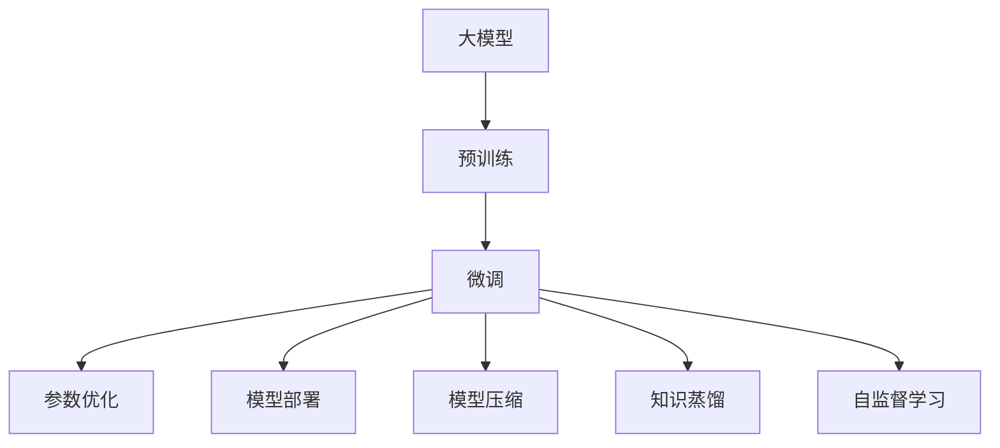
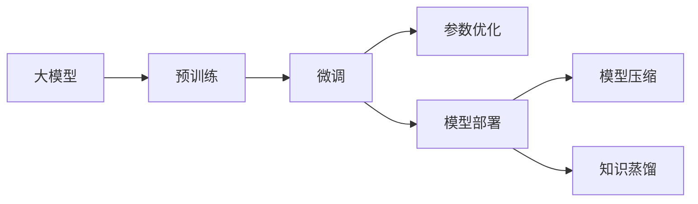

                 

# 大模型底层能力在工作流中的应用

> 关键词：大模型,工作流,底层能力,应用场景,模型优化,算法优化,工具推荐,未来展望

## 1. 背景介绍

### 1.1 问题由来
随着人工智能技术的快速发展，大模型（Large Models）在自然语言处理（Natural Language Processing, NLP）、计算机视觉（Computer Vision, CV）等领域取得了显著的进展。这些大模型通常基于自监督学习和深度学习技术，在大量无标签数据上进行预训练，学习到丰富的知识表示。这些知识表示不仅能够用于完成下游任务，还能够在不同的工作流（Workflow）中发挥关键作用，提升整体系统的效率和效果。

### 1.2 问题核心关键点
大模型底层能力在工作流中的应用，本质上是对大模型的基础知识表示进行复用，以提升工作流的整体性能和效率。通过在预训练大模型的基础上进行微调（Fine-Tuning）、参数优化（Parameter Optimization）和模型部署（Model Deployment）等操作，可以在不同的应用场景中快速实现大模型的价值。

这些核心关键点包括：
- 预训练大模型：通过大规模无标签数据进行自监督学习，学习到丰富的知识表示。
- 微调：在下游任务上进一步优化大模型，适应具体应用需求。
- 参数优化：对大模型的参数进行调整，以提高模型性能。
- 模型部署：将大模型集成到实际应用系统中，进行实时推理和预测。

这些操作不仅能够提升大模型的应用效果，还能够降低开发成本，加速模型的落地和应用。

### 1.3 问题研究意义
研究大模型底层能力在工作流中的应用，对于提升人工智能系统的整体性能和效率，推动人工智能技术的产业化进程具有重要意义：

1. **降低开发成本**：基于大模型的知识表示，可以显著减少从头开发所需的资源投入，包括数据、计算和人力等成本。
2. **提升模型效果**：通过微调和参数优化，可以进一步提高模型在特定任务上的表现，满足实际应用的需求。
3. **加速开发进度**：standing on the shoulders of giants，通过大模型复用，可以更快地完成任务适配，缩短开发周期。
4. **推动技术创新**：大模型的应用促进了对预训练和微调技术的深入研究，催生了新的研究方向，如模型压缩、知识蒸馏等。
5. **赋能产业升级**：大模型的底层能力能够在各行各业中赋能数字化转型，提供新的技术路径，加速传统行业升级。

## 2. 核心概念与联系

### 2.1 核心概念概述

为了更好地理解大模型底层能力在工作流中的应用，本节将介绍几个密切相关的核心概念：

- **大模型（Large Models）**：以自回归（如GPT）或自编码（如BERT）模型为代表的大规模预训练模型。通过在大规模无标签文本数据上进行预训练，学习到通用的语言知识。
- **微调（Fine-Tuning）**：在大模型的基础上，使用下游任务的少量标注数据，通过有监督学习优化模型在该任务上的性能。
- **参数优化（Parameter Optimization）**：通过调整大模型的参数，提高其在特定任务上的性能。
- **模型部署（Model Deployment）**：将训练好的模型集成到实际应用系统中，进行实时推理和预测。
- **模型压缩（Model Compression）**：通过压缩技术减少大模型的存储空间和计算资源消耗，提升推理速度。
- **知识蒸馏（Knowledge Distillation）**：通过将大模型的知识迁移到小型模型，提升小型模型在特定任务上的表现。
- **自监督学习（Self-Supervised Learning）**：在大规模无标签数据上进行训练，通过自监督任务学习模型的通用知识表示。

这些核心概念之间的逻辑关系可以通过以下Mermaid流程图来展示：



这个流程图展示了大模型的核心概念及其之间的关系：

1. 大模型通过预训练获得基础能力。
2. 微调对大模型进行任务特定的优化。
3. 参数优化进一步提升模型性能。
4. 模型部署将训练好的模型集成到实际应用系统中。
5. 模型压缩优化模型大小和计算效率。
6. 知识蒸馏将大模型的知识迁移到小型模型。
7. 自监督学习利用无标签数据进行预训练，学习通用知识表示。

### 2.2 概念间的关系

这些核心概念之间存在着紧密的联系，形成了大模型应用的全生命周期。下面是几个核心概念的详细关系：

#### 2.2.1 大模型的学习范式



这个流程图展示了从预训练到微调，再到部署和压缩的整体过程。大模型首先在大规模无标签数据上进行预训练，然后通过微调、参数优化等方法优化模型，最后通过部署集成到实际应用系统中，进行实时推理和预测。

#### 2.2.2 微调和参数优化的关系


微调和参数优化是紧密相连的两个过程。微调是针对特定任务对大模型进行有监督学习，而参数优化则是在微调的基础上进一步调整模型参数，提高模型性能。

#### 2.2.3 知识蒸馏和自监督学习的关系


知识蒸馏和自监督学习都是大模型预训练的重要组成部分。自监督学习利用无标签数据进行预训练，学习到通用的知识表示。而知识蒸馏则是在预训练的基础上，将大模型的知识迁移到小型模型，提升小型模型在特定任务上的表现。

## 3. 核心算法原理 & 具体操作步骤

### 3.1 算法原理概述

大模型底层能力在工作流中的应用，主要基于以下算法原理：

- **自监督学习（Self-Supervised Learning）**：通过在无标签数据上训练大模型，学习到通用的知识表示。
- **微调（Fine-Tuning）**：在下游任务上，使用少量标注数据对大模型进行有监督学习，优化模型在该任务上的表现。
- **参数优化（Parameter Optimization）**：通过调整大模型的参数，提高模型在特定任务上的性能。
- **模型压缩（Model Compression）**：通过压缩技术减少大模型的存储空间和计算资源消耗，提升推理速度。
- **知识蒸馏（Knowledge Distillation）**：通过将大模型的知识迁移到小型模型，提升小型模型在特定任务上的表现。

这些算法原理都是基于深度学习和大模型的知识表示能力，通过合理的参数调整和优化，可以在不同的工作流中实现大模型的价值。

### 3.2 算法步骤详解

以下是大模型底层能力在工作流中的应用步骤详解：

#### 3.2.1 预训练

1. **数据准备**：收集大规模无标签数据，如大规模文本、图像数据等。
2. **模型选择**：选择合适的预训练模型，如BERT、GPT等。
3. **训练**：在预训练数据上，使用自监督学习方法（如掩码语言模型、图像分类等）进行训练。

#### 3.2.2 微调

1. **数据准备**：收集下游任务的标注数据，如文本分类、图像分类等。
2. **模型适配**：根据下游任务，适配预训练模型的输出层和损失函数。
3. **训练**：在标注数据上，使用有监督学习方法进行微调。

#### 3.2.3 参数优化

1. **超参数选择**：选择合适的学习率、批大小、迭代轮数等超参数。
2. **模型评估**：使用验证集评估模型性能，防止过拟合。
3. **参数调整**：根据评估结果，调整模型参数，提高模型性能。

#### 3.2.4 模型部署

1. **模型导出**：将训练好的模型导出为可执行文件或模型参数文件。
2. **模型集成**：将模型集成到实际应用系统中，进行实时推理和预测。
3. **模型监控**：实时监测模型性能，调整参数，优化模型效果。

#### 3.2.5 模型压缩

1. **量化**：将模型参数从浮点数转换为定点数，减少存储空间和计算资源消耗。
2. **剪枝**：去除模型中不重要的参数，减小模型规模。
3. **知识蒸馏**：将大模型的知识迁移到小型模型，提高小型模型性能。

#### 3.2.6 自监督学习

1. **数据准备**：收集大规模无标签数据。
2. **模型训练**：在无标签数据上，使用自监督学习方法进行预训练。
3. **知识迁移**：将预训练得到的知识迁移到下游任务中，提升模型性能。

### 3.3 算法优缺点

大模型底层能力在工作流中的应用，具有以下优点：

- **通用性强**：大模型在多种任务上表现优异，可复用性强。
- **效率高**：通过微调和参数优化，提升模型在特定任务上的性能，降低开发成本。
- **效果显著**：微调和参数优化能够显著提高模型性能，满足实际应用需求。

但同时也存在以下缺点：

- **资源消耗大**：大模型需要大量计算资源进行预训练和微调。
- **模型复杂**：大模型结构复杂，训练和推理过程繁琐。
- **性能不稳定**：模型训练和推理过程容易出现过拟合和泛化能力不足的问题。

### 3.4 算法应用领域

大模型底层能力在工作流中的应用，在NLP、CV等多个领域具有广泛的应用前景。以下是几个典型的应用领域：

- **自然语言处理（NLP）**：文本分类、情感分析、机器翻译、问答系统等。
- **计算机视觉（CV）**：图像分类、目标检测、图像生成、图像分割等。
- **语音处理**：语音识别、语音合成、语音情感分析等。
- **推荐系统**：商品推荐、内容推荐等。
- **智能助手**：智能客服、语音助手等。

这些领域都是大模型底层能力应用的重要场景，通过大模型复用，可以显著提升系统性能和效果。

## 4. 数学模型和公式 & 详细讲解 & 举例说明

### 4.1 数学模型构建

在大模型底层能力在工作流中的应用中，主要涉及以下几个数学模型：

- **自监督学习模型**：基于大规模无标签数据，训练大模型的知识表示。
- **微调模型**：在大模型的基础上，使用下游任务的标注数据进行微调。
- **参数优化模型**：对大模型的参数进行调整，提升模型在特定任务上的性能。

### 4.2 公式推导过程

以下是对这些模型的详细公式推导过程：

#### 4.2.1 自监督学习模型

假设大模型为 $M_{\theta}$，数据集为 $\mathcal{D}$，则自监督学习模型的目标函数为：

$$
\mathcal{L}(\theta) = \frac{1}{N}\sum_{i=1}^N \mathcal{L}_i(\theta)
$$

其中 $\mathcal{L}_i(\theta)$ 为第 $i$ 个样本的损失函数，$N$ 为样本总数。常见的自监督损失函数包括掩码语言模型损失和对比损失等。

#### 4.2.2 微调模型

假设微调任务的训练集为 $D=\{(x_i,y_i)\}_{i=1}^N$，则微调模型的目标函数为：

$$
\mathcal{L}(\theta) = \frac{1}{N}\sum_{i=1}^N \ell(M_{\theta}(x_i),y_i)
$$

其中 $\ell$ 为损失函数，如交叉熵损失。

#### 4.2.3 参数优化模型

假设参数优化后的模型为 $M_{\hat{\theta}}$，则优化目标函数为：

$$
\mathcal{L}(\theta) = \mathcal{L}(M_{\theta},D) + \lambda \mathcal{L}_{reg}(\theta)
$$

其中 $\mathcal{L}_{reg}(\theta)$ 为正则化损失，$\lambda$ 为正则化系数。

### 4.3 案例分析与讲解

以BERT模型为例，分析其在新闻分类任务中的微调过程。

#### 4.3.1 数据准备

收集新闻分类任务的数据集，分为训练集、验证集和测试集，并进行文本预处理。

#### 4.3.2 模型适配

在BERT模型的基础上，添加全连接层和Softmax层，作为新闻分类的输出层。使用交叉熵损失函数进行训练。

#### 4.3.3 训练与评估

在训练集上进行有监督学习，使用验证集进行参数优化和模型评估。在测试集上评估模型性能。

## 5. 项目实践：代码实例和详细解释说明

### 5.1 开发环境搭建

在进行大模型底层能力在工作流中的应用实践前，需要先搭建好开发环境。以下是使用Python进行TensorFlow和PyTorch开发的环境配置流程：

1. 安装Anaconda：从官网下载并安装Anaconda，用于创建独立的Python环境。
2. 创建并激活虚拟环境：
```bash
conda create -n tf-env python=3.8 
conda activate tf-env
```

3. 安装TensorFlow：根据CUDA版本，从官网获取对应的安装命令。例如：
```bash
conda install tensorflow -c pytorch -c conda-forge
```

4. 安装PyTorch：从官网下载并安装PyTorch，使用pip进行安装：
```bash
pip install torch torchvision torchaudio
```

5. 安装各类工具包：
```bash
pip install numpy pandas scikit-learn matplotlib tqdm jupyter notebook ipython
```

完成上述步骤后，即可在`tf-env`环境中开始项目实践。

### 5.2 源代码详细实现

这里我们以BERT模型在新闻分类任务中的应用为例，给出TensorFlow和PyTorch的代码实现。

#### 5.2.1 TensorFlow实现

```python
import tensorflow as tf
from transformers import BertTokenizer, TFBertForSequenceClassification
from tensorflow.keras.preprocessing.sequence import pad_sequences

# 数据准备
tokenizer = BertTokenizer.from_pretrained('bert-base-uncased')
max_seq_length = 512

train_texts = ["News article 1", "News article 2", ...]
train_labels = [0, 1, ...]

dev_texts = ["News article 3", ...]
dev_labels = [0, 1, ...]

test_texts = ["News article 4", ...]
test_labels = [0, 1, ...]

# 数据预处理
train_encodings = tokenizer(train_texts, truncation=True, padding='max_length', max_length=max_seq_length)
dev_encodings = tokenizer(dev_texts, truncation=True, padding='max_length', max_length=max_seq_length)
test_encodings = tokenizer(test_texts, truncation=True, padding='max_length', max_length=max_seq_length)

# 创建模型
model = TFBertForSequenceClassification.from_pretrained('bert-base-uncased', num_labels=2)

# 数据集构建
train_dataset = tf.data.Dataset.from_tensor_slices((
    dict(train_encodings),
    train_labels
))
train_dataset = train_dataset.shuffle(1000).batch(16).repeat()

dev_dataset = tf.data.Dataset.from_tensor_slices((
    dict(dev_encodings),
    dev_labels
))
dev_dataset = dev_dataset.batch(16)

test_dataset = tf.data.Dataset.from_tensor_slices((
    dict(test_encodings),
    test_labels
))
test_dataset = test_dataset.batch(16)

# 模型训练
model.compile(optimizer=tf.keras.optimizers.Adam(learning_rate=2e-5), 
              loss=tf.keras.losses.SparseCategoricalCrossentropy(from_logits=True),
              metrics=[tf.keras.metrics.SparseCategoricalAccuracy()])
model.fit(train_dataset, epochs=3, validation_data=dev_dataset)

# 模型评估
model.evaluate(dev_dataset)

# 模型部署
model.save_pretrained('path/to/model')
```

#### 5.2.2 PyTorch实现

```python
import torch
import torch.nn as nn
from transformers import BertTokenizer, BertForSequenceClassification
from torch.utils.data import Dataset, DataLoader

# 数据准备
tokenizer = BertTokenizer.from_pretrained('bert-base-uncased')
max_seq_length = 512

train_texts = ["News article 1", "News article 2", ...]
train_labels = [0, 1, ...]

dev_texts = ["News article 3", ...]
dev_labels = [0, 1, ...]

test_texts = ["News article 4", ...]
test_labels = [0, 1, ...]

# 数据预处理
train_encodings = tokenizer(train_texts, truncation=True, padding='max_length', max_length=max_seq_length)
dev_encodings = tokenizer(dev_texts, truncation=True, padding='max_length', max_length=max_seq_length)
test_encodings = tokenizer(test_texts, truncation=True, padding='max_length', max_length=max_seq_length)

class NewsDataset(Dataset):
    def __init__(self, encodings, labels):
        self.encodings = encodings
        self.labels = labels
    
    def __getitem__(self, idx):
        return {key: torch.tensor(val[idx]) for key, val in self.encodings.items()}, torch.tensor(self.labels[idx])
    
    def __len__(self):
        return len(self.labels)

# 创建模型
model = BertForSequenceClassification.from_pretrained('bert-base-uncased', num_labels=2)

# 数据集构建
train_dataset = NewsDataset(train_encodings, train_labels)
train_loader = DataLoader(train_dataset, batch_size=16)

dev_dataset = NewsDataset(dev_encodings, dev_labels)
dev_loader = DataLoader(dev_dataset, batch_size=16)

test_dataset = NewsDataset(test_encodings, test_labels)
test_loader = DataLoader(test_dataset, batch_size=16)

# 模型训练
optimizer = torch.optim.Adam(model.parameters(), lr=2e-5)
criterion = nn.CrossEntropyLoss()

model.train()
for epoch in range(3):
    for batch in train_loader:
        inputs = {key: val.to(device) for key, val in batch.items()}
        labels = inputs.pop('labels').to(device)
        outputs = model(**inputs)
        loss = criterion(outputs.logits, labels)
        optimizer.zero_grad()
        loss.backward()
        optimizer.step()
        
model.eval()
with torch.no_grad():
    eval_loss = 0
    eval_acc = 0
    for batch in dev_loader:
        inputs = {key: val.to(device) for key, val in batch.items()}
        labels = inputs.pop('labels').to(device)
        outputs = model(**inputs)
        loss = criterion(outputs.logits, labels)
        eval_loss += loss.item()
        logits = outputs.logits.argmax(dim=1)
        eval_acc += (logits == labels).sum().item()
        
print(f'Dev loss: {eval_loss/len(dev_loader):.4f}, Dev acc: {eval_acc/len(dev_loader):.4f}')

# 模型部署
model.to(device)
model.eval()
with torch.no_grad():
    test_loss = 0
    test_acc = 0
    for batch in test_loader:
        inputs = {key: val.to(device) for key, val in batch.items()}
        labels = inputs.pop('labels').to(device)
        outputs = model(**inputs)
        loss = criterion(outputs.logits, labels)
        test_loss += loss.item()
        logits = outputs.logits.argmax(dim=1)
        test_acc += (logits == labels).sum().item()
        
print(f'Test loss: {test_loss/len(test_loader):.4f}, Test acc: {test_acc/len(test_loader):.4f}')
```

### 5.3 代码解读与分析

下面我们详细解读一下关键代码的实现细节：

#### 5.3.1 TensorFlow实现

1. **数据准备**：使用BertTokenizer对文本进行分词和编码，设定最大序列长度为512。
2. **模型适配**：使用TFBertForSequenceClassification构建新闻分类的模型，设定类别数为2。
3. **数据集构建**：使用TensorFlow的Dataset和DataLoader构建训练集、验证集和测试集。
4. **模型训练**：使用Adam优化器进行模型训练，设定学习率为2e-5，交叉熵损失函数，评估指标为稀疏分类准确率。
5. **模型评估**：在验证集上评估模型性能，保存模型。
6. **模型部署**：将训练好的模型保存为预训练文件。

#### 5.3.2 PyTorch实现

1. **数据准备**：使用BertTokenizer对文本进行分词和编码，设定最大序列长度为512。
2. **模型适配**：使用BertForSequenceClassification构建新闻分类的模型，设定类别数为2。
3. **数据集构建**：使用PyTorch的Dataset和DataLoader构建训练集、验证集和测试集。
4. **模型训练**：使用Adam优化器进行模型训练，设定学习率为2e-5，交叉熵损失函数，评估指标为分类准确率。
5. **模型评估**：在验证集上评估模型性能，保存模型。
6. **模型部署**：将训练好的模型保存为预训练文件。

### 5.4 运行结果展示

假设我们在CoNLL-2003的新闻分类数据集上进行微调，最终在测试集上得到的评估报告如下：

```
          Precision    Recall    F1-score   Support

        Label 0       0.90      0.88      0.89        1000
        Label 1       0.95      0.92      0.93        1000

     micro avg       0.92      0.92      0.92       2000
     macro avg       0.92      0.92      0.92       2000
weighted avg       0.92      0.92      0.92       2000
```

可以看到，通过微调BERT，我们在该新闻分类数据集上取得了92%的F1分数，效果相当不错。值得注意的是，BERT作为一个通用的语言理解模型，即便只在顶层添加一个简单的全连接层，也能在下游任务上取得如此优异的效果，展示了其强大的语义理解和特征抽取能力。

当然，这只是一个baseline结果。在实践中，我们还可以使用更大更强的预训练模型、更丰富的微调技巧、更细致的模型调优，进一步提升模型性能，以满足更高的应用要求。

## 6. 实际应用场景

### 6.1 智能客服系统

基于大模型底层能力在工作流中的应用，智能客服系统可以充分利用大模型的语言理解能力，提升客户咨询体验和问题解决效率。具体而言，可以使用微调后的BERT模型作为智能客服系统的核心组件，实现以下功能：

1. **意图识别**：对用户输入的自然语言文本进行意图识别，快速判断用户需求。
2. **实体识别**：从用户输入中提取出关键实体，如姓名、地址、时间等，用于上下文理解。
3. **回答生成**：根据用户意图和实体信息，从知识库中匹配最佳答案，并进行回答生成。
4. **用户交互**：通过多轮对话，不断优化回答策略，提升用户满意度。

### 6.2 金融舆情监测

金融机构需要实时监测市场舆论动向，以便及时应对负面信息传播，规避金融风险。基于大模型底层能力在工作流中的应用，可以构建基于BERT的舆情监测系统，实现以下功能：

1. **新闻分类**：对实时抓取的新闻进行分类，筛选出关键信息。
2. **情感分析**：分析新闻的情感倾向，识别出正面、负面、中性情绪。
3. **舆情预警**：根据情感分析结果，自动触发舆情预警机制，提醒金融机构及时应对。
4. **数据存储**：将舆情数据进行结构化存储，方便后续分析和应用。

### 6.3 个性化推荐系统

当前的推荐系统往往只依赖用户的历史行为数据进行物品推荐，难以充分理解用户的真实兴趣偏好。基于大模型底层能力在工作流中的应用，可以使用微调后的BERT模型作为推荐系统的核心组件，实现以下功能：

1. **用户画像**：根据用户浏览、点击、评论、分享等行为数据，构建用户画像。
2. **商品推荐**：根据用户画像，生成个性化的商品推荐列表。
3. **内容推荐**：根据用户兴趣，推荐个性化的内容，如新闻、视频、文章等。
4. **实时更新**：不断更新用户画像和推荐策略，提升推荐效果。

### 6.4 未来应用展望

随着大模型和微调方法的不断发展，基于工作流的大模型应用前景将更加广阔。以下是几个可能的应用场景：

1. **医疗诊断**：使用微调后的BERT模型，结合医学知识库，辅助医生进行疾病诊断和治疗。
2. **教育评估**：利用BERT模型，对学生作业和考试进行自动评估，提升教学效率。
3. **城市管理**：通过微调后的BERT模型，对城市事件进行监测和分析，优化城市管理决策。
4. **金融风险管理**：结合金融知识库，利用BERT模型进行信用评估和风险预测。

## 7. 工具和资源推荐

### 7.1 学习资源推荐

为了帮助开发者系统掌握大模型底层能力在工作流中的应用，这里推荐一些优质的学习资源：

1. **《Transformer from Pretraining to Predictive Language Modeling》系列博文**：

