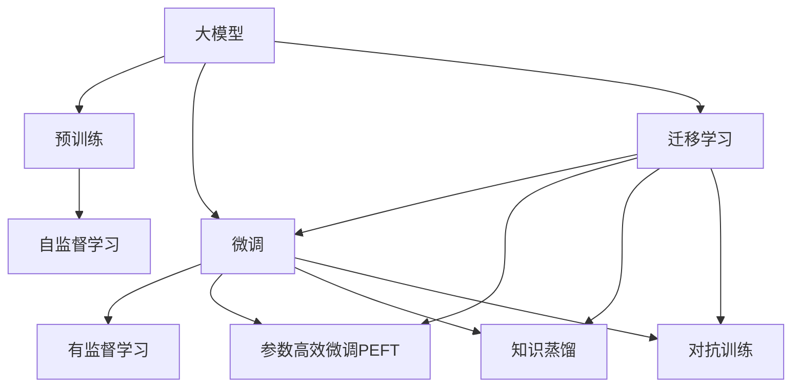

                 

## 1. 背景介绍

随着人工智能技术的快速发展，大模型（Large Model）在各行各业的应用越来越广泛。大模型，通常指的是参数量在十亿级别以上的深度神经网络，具备强大的泛化能力和高度的适应性，能够处理复杂的数据结构，适用于各种不同的任务。本节将详细介绍大模型的发展历程、当前应用以及市场潜力。

### 1.1 大模型的发展历程

大模型的发展可以追溯到20世纪90年代，当时深度学习开始崭露头角，而大模型也随之崛起。最初的大模型主要是基于神经网络模型，如多层感知器（MLP）、卷积神经网络（CNN）等。随着时间的推移，深度学习框架如TensorFlow、PyTorch的出现，大模型开始借助这些框架变得更加灵活和高效。近年来，随着硬件设施（如GPU、TPU等）的不断提升，深度学习模型的参数量越来越大，模型规模也不断增加。

### 1.2 大模型的当前应用

目前，大模型已经被广泛应用于多个领域，包括但不限于以下几类：

1. **自然语言处理（NLP）**：如GPT-3、BERT等模型已经在语言理解、机器翻译、情感分析、问答系统等领域展现了强大的能力。
2. **计算机视觉（CV）**：如DALL·E、DETR等模型已经在图像识别、图像生成、视频分析等领域取得了显著的进展。
3. **语音识别**：如WaveNet、BERT-finetune等模型已经在语音识别、语音合成等领域表现出色。
4. **推荐系统**：如BERT-based Recommender Systems等模型已经在个性化推荐、用户行为分析等领域展现出巨大的潜力。
5. **自动化决策**：如AlphaGo等模型已经在围棋、扑克牌等复杂游戏中取得了突破性的进展。

### 1.3 大模型的市场潜力

大模型的市场潜力主要体现在以下几个方面：

1. **高效性能**：大模型能够处理复杂的数据结构，并在多个任务上表现出超强的能力，使得其在实际应用中具有更高的效率和准确性。
2. **广泛应用**：大模型可以应用于各个行业，从金融、医疗到零售、制造等，市场需求非常广泛。
3. **高附加值**：大模型往往需要复杂的训练和推理过程，这使得其拥有较高的技术门槛和知识壁垒，从而能够带来更高的附加值。
4. **创新驱动**：大模型的发展和应用需要不断创新，这不仅推动了技术的进步，也带来了新的商业模式和商业机会。

## 2. 核心概念与联系

### 2.1 核心概念概述

为更好地理解大模型的市场潜力与挑战，本节将介绍几个关键概念：

1. **大模型（Large Model）**：指参数量在十亿级别以上的深度神经网络，具备强大的泛化能力和高度的适应性。
2. **预训练（Pre-training）**：指在大规模无标签数据上进行自监督训练，学习通用的语言或图像表示。
3. **微调（Fine-tuning）**：指在大模型的基础上，使用下游任务的少量标注数据进行有监督的训练，以适应特定任务。
4. **迁移学习（Transfer Learning）**：指将一个领域的知识迁移到另一个领域的学习过程。
5. **参数高效微调（Parameter-Efficient Fine-tuning, PEFT）**：指只更新模型中少量的参数，以提高微调效率和减少过拟合风险。
6. **知识蒸馏（Knowledge Distillation）**：指将大模型的知识（通常是准确性）传递给较小的模型，以提升后者的性能。
7. **对抗训练（Adversarial Training）**：指在训练过程中加入对抗样本，以提高模型的鲁棒性和泛化能力。

这些核心概念构成了大模型的学习范式，帮助其在不同的任务和场景下展现出其强大的潜力和应用价值。

### 2.2 核心概念间的关系

这些核心概念之间的逻辑关系可以通过以下Mermaid流程图来展示：



这个流程图展示了各个核心概念之间的关系：

1. 大模型通过预训练学习通用的语言或图像表示。
2. 微调使模型适应特定任务，可以是全参数微调、参数高效微调、知识蒸馏、对抗训练等。
3. 迁移学习将大模型的知识应用于新的领域。

## 3. 核心算法原理 & 具体操作步骤

### 3.1 算法原理概述

大模型的训练和应用主要遵循以下步骤：

1. **数据准备**：收集大规模无标签数据进行预训练，收集下游任务的标注数据进行微调。
2. **预训练**：在大规模数据上使用自监督学习任务训练大模型。
3. **微调**：在预训练的基础上，使用下游任务的标注数据进行有监督学习，以适应特定任务。
4. **评估**：使用测试集评估微调后的模型性能。

### 3.2 算法步骤详解

以下是使用PyTorch进行大模型微调的具体步骤：

1. **准备数据**：使用`transformers`库加载预训练模型和下游任务的数据集。
2. **构建模型**：加载预训练模型，并根据需要添加任务特定的输出层和损失函数。
3. **定义优化器**：选择合适的优化器，如AdamW，并设置学习率、批大小等超参数。
4. **训练模型**：将数据分批次输入模型，计算损失函数，更新模型参数。
5. **评估模型**：在验证集和测试集上评估模型性能，使用classification_report等工具生成评估报告。

### 3.3 算法优缺点

大模型的优势在于其强大的泛化能力和高效的性能，但其缺点也同样明显：

1. **资源消耗大**：大模型需要大量的计算资源和存储空间，训练和推理过程耗时较长。
2. **过拟合风险高**：由于模型参数量较大，过拟合风险较高，需要采取正则化等措施。
3. **迁移能力有限**：不同领域的知识难以在大模型间有效迁移。
4. **可解释性不足**：大模型的内部工作机制复杂，难以解释和调试。

### 3.4 算法应用领域

大模型在多个领域都展现出巨大的潜力，包括但不限于以下几个方面：

1. **自然语言处理**：如机器翻译、情感分析、问答系统等。
2. **计算机视觉**：如图像识别、图像生成、视频分析等。
3. **语音识别**：如语音识别、语音合成等。
4. **推荐系统**：如个性化推荐、用户行为分析等。
5. **自动化决策**：如AlphaGo、AlphaZero等。

## 4. 数学模型和公式 & 详细讲解 & 举例说明

### 4.1 数学模型构建

以BERT模型为例，其在NLP领域的应用非常广泛。BERT模型采用自监督预训练和微调的方法，其数学模型如下：

1. **预训练模型**：
   - 输入为一句话 $x$，预训练模型将其映射为一个表示向量 $x_{BERT}$。
   - 输出为一句话 $x$ 的语义表示，即 $x_{BERT}$。

2. **微调模型**：
   - 输入为一句话 $x$，微调模型将其映射为一个分类结果 $y$。
   - 输出为一句话 $x$ 的分类结果，即 $y$。

### 4.2 公式推导过程

以BERT模型为例，其预训练过程包括Masked Language Model（MLM）和Next Sentence Prediction（NSP）两个任务。

1. **Masked Language Model**：
   - 输入 $x$ 中的某些词语被随机遮蔽，模型需要预测被遮蔽的词语。
   - 目标函数为 $L_{MLM} = -\frac{1}{N}\sum_{i=1}^{N} \log P(y_i|x)$，其中 $P(y_i|x)$ 为预测概率。

2. **Next Sentence Prediction**：
   - 输入为两个句子 $x_1, x_2$，模型需要预测它们是否是相邻的句子。
   - 目标函数为 $L_{NSP} = -\frac{1}{N}\sum_{i=1}^{N} \log P(c_i|x_1, x_2)$，其中 $c_i$ 为分类结果。

### 4.3 案例分析与讲解

以BERT模型在情感分析任务上的应用为例，展示微调模型的训练过程：

1. **数据准备**：收集情感分析的数据集，划分为训练集、验证集和测试集。
2. **构建模型**：使用BERT模型作为基础模型，添加一个输出层进行情感分类。
3. **定义优化器**：设置AdamW优化器，设置学习率、批大小等超参数。
4. **训练模型**：将数据分批次输入模型，计算损失函数，更新模型参数。
5. **评估模型**：在验证集和测试集上评估模型性能，生成评估报告。

## 5. 项目实践：代码实例和详细解释说明

### 5.1 开发环境搭建

以下是使用PyTorch进行BERT模型微调的开发环境搭建步骤：

1. **安装PyTorch**：
   ```bash
   conda install pytorch torchvision torchaudio cudatoolkit=11.1 -c pytorch -c conda-forge
   ```

2. **安装transformers**：
   ```bash
   pip install transformers
   ```

3. **安装其他工具**：
   ```bash
   pip install numpy pandas scikit-learn matplotlib tqdm jupyter notebook ipython
   ```

### 5.2 源代码详细实现

以下是使用PyTorch进行BERT模型微调的代码实现：

```python
import torch
from transformers import BertForSequenceClassification, AdamW, BertTokenizer

# 加载预训练模型和分词器
model = BertForSequenceClassification.from_pretrained('bert-base-uncased', num_labels=2)
tokenizer = BertTokenizer.from_pretrained('bert-base-uncased')

# 加载数据集
train_data = ...
val_data = ...
test_data = ...

# 定义优化器
optimizer = AdamW(model.parameters(), lr=2e-5)

# 训练模型
for epoch in range(5):
    model.train()
    for batch in train_data:
        optimizer.zero_grad()
        inputs = tokenizer(batch, return_tensors='pt')
        outputs = model(**inputs)
        loss = outputs.loss
        loss.backward()
        optimizer.step()

# 评估模型
model.eval()
for batch in val_data:
    with torch.no_grad():
        inputs = tokenizer(batch, return_tensors='pt')
        outputs = model(**inputs)
        loss = outputs.loss
        predictions = torch.argmax(outputs.logits, dim=1)

# 测试模型
model.eval()
for batch in test_data:
    with torch.no_grad():
        inputs = tokenizer(batch, return_tensors='pt')
        outputs = model(**inputs)
        loss = outputs.loss
        predictions = torch.argmax(outputs.logits, dim=1)
```

### 5.3 代码解读与分析

上述代码实现了BERT模型在情感分析任务上的微调过程，其关键点包括：

1. **加载预训练模型和分词器**：使用`BertForSequenceClassification`和`BertTokenizer`加载预训练模型和分词器，设置模型的输出层和损失函数。
2. **加载数据集**：使用`train_data`、`val_data`和`test_data`加载训练集、验证集和测试集。
3. **定义优化器**：使用AdamW优化器，设置学习率、批大小等超参数。
4. **训练模型**：使用训练集数据进行训练，计算损失函数并更新模型参数。
5. **评估模型**：使用验证集数据进行评估，计算损失函数并生成预测结果。
6. **测试模型**：使用测试集数据进行测试，计算损失函数并生成预测结果。

## 6. 实际应用场景

### 6.4 未来应用展望

随着大模型的不断发展，其在各个领域的应用场景将更加广阔。未来，大模型将进一步提升在以下几个方面的应用潜力：

1. **智能客服**：大模型可以用于构建智能客服系统，提供7x24小时不间断服务，快速响应客户咨询，提高客户满意度。
2. **金融舆情**：大模型可以用于金融舆情监测，实时监测市场舆论动向，帮助金融机构快速应对潜在风险。
3. **个性化推荐**：大模型可以用于个性化推荐系统，提高推荐精度和用户满意度。
4. **医疗诊断**：大模型可以用于医疗诊断，帮助医生进行疾病预测和诊断，提升医疗服务质量。
5. **智能交通**：大模型可以用于智能交通系统，提高道路交通管理效率，降低交通事故率。

## 7. 工具和资源推荐

### 7.1 学习资源推荐

为了帮助开发者深入理解大模型的市场潜力与挑战，以下是一些优质的学习资源：

1. **《深度学习》书籍**：深入浅出地介绍了深度学习的基本概念和应用。
2. **《Transformer from Basics to Advanced》博客系列**：由大模型专家撰写，详细介绍了Transformer模型的原理和应用。
3. **CS224N《深度学习自然语言处理》课程**：斯坦福大学开设的NLP明星课程，有Lecture视频和配套作业。
4. **HuggingFace官方文档**：提供了海量预训练模型和完整的微调样例代码。
5. **arXiv论文预印本**：人工智能领域最新研究成果的发布平台，涵盖大量前沿工作。

### 7.2 开发工具推荐

以下是一些常用的开发工具，可以显著提高大模型的开发效率：

1. **PyTorch**：深度学习框架，灵活的计算图，支持自动微分。
2. **TensorFlow**：深度学习框架，易于部署。
3. **transformers**：NLP工具库，集成了众多SOTA语言模型。
4. **Weights & Biases**：模型训练实验跟踪工具，记录和可视化模型训练过程。
5. **TensorBoard**：TensorFlow配套的可视化工具，实时监测模型训练状态。

### 7.3 相关论文推荐

以下是几篇奠基性的相关论文，推荐阅读：

1. **Attention is All You Need**：提出了Transformer模型，开启了NLP领域的预训练大模型时代。
2. **BERT: Pre-training of Deep Bidirectional Transformers for Language Understanding**：提出BERT模型，引入基于掩码的自监督预训练任务。
3. **GPT-3**：展示了GPT-3模型在多项NLP任务上取得了SOTA表现。
4. **Parameter-Efficient Transfer Learning for NLP**：提出Adapter等参数高效微调方法，减少模型参数量。
5. **Prompt-based Learning**：引入基于连续型Prompt的微调范式，实现零样本和少样本学习。

这些论文代表了大模型市场潜力与挑战的研究进展，对于理解大模型的开发和应用具有重要意义。

## 8. 总结：未来发展趋势与挑战

### 8.1 研究成果总结

大模型在多个领域展现了巨大的市场潜力，但同时也面临着诸多挑战。本节将总结前述章节中提到的研究成果，并提出一些展望：

1. **高效性能**：大模型在处理复杂数据结构时展现出卓越的性能，但需要大量的计算资源。
2. **广泛应用**：大模型可以应用于多个领域，市场需求广泛。
3. **高附加值**：大模型拥有较高的技术门槛和知识壁垒，带来较高的附加值。
4. **创新驱动**：大模型的发展和应用需要不断创新，推动技术进步。

### 8.2 未来发展趋势

未来，大模型的发展趋势主要包括：

1. **模型规模持续增大**：随着算力成本的下降和数据规模的扩张，预训练语言模型的参数量还将持续增长。
2. **微调方法日趋多样**：除了传统的全参数微调外，未来会涌现更多参数高效的微调方法，如Prefix-Tuning、LoRA等。
3. **持续学习成为常态**：微调模型需要持续学习新知识，避免灾难性遗忘。
4. **少样本学习崛起**：利用大模型的语言理解能力，在更少的标注样本上也能实现理想的微调效果。
5. **多模态微调崛起**：将符号化的先验知识与神经网络模型进行融合，增强模型的跨领域迁移能力。

### 8.3 面临的挑战

尽管大模型展现出巨大的潜力，但未来仍面临诸多挑战：

1. **标注成本瓶颈**：大模型微调需要大量的标注数据，获取高质量标注数据的成本较高。
2. **模型鲁棒性不足**：面对域外数据时，大模型的泛化性能可能下降。
3. **推理效率有待提高**：大模型在实际部署时面临推理速度慢、内存占用大等问题。
4. **可解释性亟需加强**：大模型的内部工作机制复杂，难以解释和调试。
5. **安全性有待保障**：大模型可能学习到有害信息，输出存在安全隐患。
6. **知识整合能力不足**：大模型难以灵活吸收和运用更广泛的先验知识。

### 8.4 研究展望

为了克服上述挑战，未来的研究方向包括：

1. **探索无监督和半监督微调方法**：摆脱对大规模标注数据的依赖，利用自监督学习、主动学习等无监督和半监督范式。
2. **研究参数高效和计算高效的微调范式**：开发更加参数高效的微调方法，在固定大部分预训练参数的情况下，只更新极少量的任务相关参数。
3. **融合因果和对比学习范式**：增强大模型建立稳定因果关系的能力，学习更加普适、鲁棒的语言表征。
4. **引入更多先验知识**：将符号化的先验知识与神经网络模型进行融合，形成更加全面、准确的信息整合能力。
5. **结合因果分析和博弈论工具**：增强模型的因果推断能力，提高系统稳定性。
6. **纳入伦理道德约束**：在模型训练目标中引入伦理导向的评估指标，过滤和惩罚有偏见、有害的输出倾向。

## 9. 附录：常见问题与解答

### Q1：大模型微调是否适用于所有NLP任务？

A: 大模型微调在大多数NLP任务上都能取得不错的效果，特别是对于数据量较小的任务。但对于一些特定领域的任务，如医学、法律等，仅依靠通用语料预训练的模型可能难以很好地适应。

### Q2：微调过程中如何选择合适的学习率？

A: 微调的学习率一般要比预训练时小1-2个数量级，如果使用过大的学习率，容易破坏预训练权重，导致过拟合。一般建议从1e-5开始调参，逐步减小学习率。

### Q3：采用大模型微调时会面临哪些资源瓶颈？

A: 大模型需要大量的计算资源和存储空间，训练和推理过程耗时较长。需要采用梯度积累、混合精度训练、模型并行等方法进行优化。

### Q4：如何缓解微调过程中的过拟合问题？

A: 过拟合风险高，需要采取正则化等措施。数据增强、对抗训练、知识蒸馏等方法可以缓解过拟合问题。

### Q5：大模型在实际应用中面临哪些伦理和安全问题？

A: 大模型可能学习到有害信息，输出存在安全隐患。需要在模型训练目标中引入伦理导向的评估指标，过滤和惩罚有偏见、有害的输出倾向。

---
作者：禅与计算机程序设计艺术 / Zen and the Art of Computer Programming

