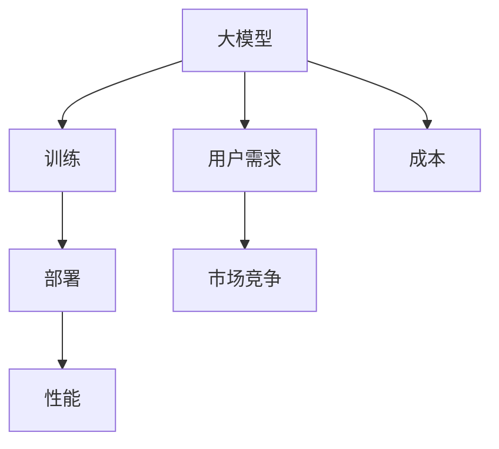

                 

# 大模型的用户需求与市场竞争

## 1. 背景介绍

### 1.1 问题由来
随着人工智能技术的快速发展，尤其是深度学习模型的广泛应用，大模型（Large Models）成为了行业内的热点话题。大模型是指那些拥有大量参数、可执行复杂任务的深度神经网络，它们能够处理大量的数据，并从中找到深层次的模式和规律。大模型在各个领域中展现了强大的潜力，从自然语言处理（NLP）、计算机视觉（CV）到语音识别、推荐系统等，都在不同程度上受益于大模型的应用。

然而，大模型在带来机遇的同时，也带来了新的挑战。首先，大模型需要大量的计算资源和数据支持，这给企业带来了沉重的成本压力。其次，大模型的训练和部署需要专业的技术支持，并非所有企业都能够轻松应对。此外，大模型的性能和效果与用户的实际需求并不总是匹配的，如何在模型中找到最优解，满足用户的具体需求，成为了一个亟待解决的问题。

### 1.2 问题核心关键点
大模型的核心挑战在于如何平衡性能和成本，如何满足用户的具体需求。具体来说，有以下几个关键点：

- **成本控制**：大模型的训练和部署需要大量的计算资源和存储空间，如何降低成本，提高效率，是首先需要解决的问题。
- **需求匹配**：不同用户对大模型的需求各不相同，如何根据用户的具体需求，提供定制化的解决方案，是第二个需要解决的问题。
- **性能优化**：大模型的性能受多方面因素影响，如数据质量、训练方法、超参数设置等，如何在不同场景下优化性能，提高模型效果，是第三个需要解决的问题。
- **市场竞争**：随着大模型技术的普及，市场竞争日益激烈，如何在竞争中保持领先，占据市场份额，是第四个需要解决的问题。

### 1.3 问题研究意义
大模型在各个行业中的应用前景广阔，但同时也面临着诸多挑战。通过深入研究大模型的用户需求和市场竞争，可以更好地理解大模型技术的潜力与局限，为实际应用提供指导。具体来说：

1. **成本控制**：掌握大模型训练和部署的成本控制方法，帮助企业节省资源，提高运营效率。
2. **需求匹配**：了解用户的具体需求，提供定制化的解决方案，提升用户体验和满意度。
3. **性能优化**：掌握大模型性能优化的技巧，提高模型效果，满足用户高标准的需求。
4. **市场竞争**：分析市场竞争态势，制定有效的市场策略，提升企业在大模型领域的竞争力。

## 2. 核心概念与联系

### 2.1 核心概念概述

大模型的用户需求和市场竞争涉及到多个核心概念，包括：

- **大模型（Large Models）**：指拥有大量参数的深度神经网络，如BERT、GPT-3等。
- **训练（Training）**：指通过大量数据对大模型进行迭代优化，使其能够更好地完成任务。
- **部署（Deployment）**：指将训练好的大模型部署到生产环境中，进行实际应用。
- **性能（Performance）**：指大模型在特定任务上的表现，如准确率、速度、稳定性等。
- **成本（Cost）**：指大模型训练和部署所需的计算资源和存储空间的成本。
- **用户需求（User Requirements）**：指用户在使用大模型时，对性能、效率、可解释性等具体的需求。
- **市场竞争（Market Competition）**：指在竞争激烈的市场环境中，企业如何定位和竞争。

这些概念之间有着紧密的联系，构成了大模型用户需求和市场竞争的整体框架。以下通过Mermaid流程图来展示这些概念之间的关系：



这个流程图展示了从大模型到训练、部署、性能，再到用户需求和市场竞争的整个流程。用户需求驱动着大模型的设计和训练，市场竞争则影响着大模型的市场定位和推广策略。成本则是大模型应用过程中的一个重要考虑因素，性能则直接影响用户的体验和满意度。

### 2.2 概念间的关系

这些核心概念之间存在着相互影响和相互作用的关系。具体来说：

- **大模型与训练**：大模型的训练是提高模型性能的关键环节，训练过程中的数据、算法和超参数设置都会直接影响模型的效果。
- **训练与性能**：训练好的大模型在特定任务上的性能表现，可以通过评估指标（如准确率、速度等）进行量化。
- **性能与用户需求**：用户需求是多方面的，如准确率、速度、可解释性等，这些需求会直接影响用户对大模型的接受程度和满意度。
- **用户需求与市场竞争**：不同用户的需求和市场定位会影响企业在大模型领域的策略选择和市场竞争策略。
- **成本与市场竞争**：成本控制是企业在竞争中能否脱颖而出的关键因素，降低成本可以提高企业的竞争力。
- **成本与性能**：成本与性能之间存在一定的权衡关系，如何在性能和成本之间找到最佳平衡点，是大模型应用中的重要课题。

这些概念之间的相互作用，共同构成了大模型用户需求和市场竞争的复杂生态系统。

## 3. 核心算法原理 & 具体操作步骤
### 3.1 算法原理概述

大模型的用户需求和市场竞争的核心算法原理主要包括以下几个方面：

1. **监督学习（Supervised Learning）**：通过标注数据对大模型进行训练，使其能够执行特定任务。监督学习在大模型中的应用非常广泛，如自然语言处理、图像识别等。
2. **强化学习（Reinforcement Learning）**：通过奖励机制，训练大模型执行特定任务。强化学习在自动驾驶、游戏AI等领域有重要应用。
3. **迁移学习（Transfer Learning）**：利用预训练模型在不同任务之间的迁移能力，提高模型性能。迁移学习在大模型的微调中得到广泛应用。
4. **联邦学习（Federated Learning）**：在多个设备上分布式训练大模型，保护隐私同时提高模型性能。联邦学习在移动设备、物联网等领域有重要应用。
5. **多任务学习（Multi-task Learning）**：通过多个相关任务的联合训练，提高模型性能。多任务学习在自然语言处理、计算机视觉等领域有重要应用。

### 3.2 算法步骤详解

大模型的用户需求和市场竞争的具体操作步骤可以概括为以下几个步骤：

1. **需求分析**：通过对用户需求的研究，确定大模型的应用场景和具体需求。
2. **数据准备**：收集和整理用于训练大模型的数据集，确保数据质量和多样性。
3. **模型选择**：根据应用场景和需求，选择合适的大模型架构和参数配置。
4. **模型训练**：使用监督学习、强化学习、迁移学习等多种方法，对大模型进行训练。
5. **性能评估**：通过评估指标（如准确率、速度、可解释性等）对训练好的大模型进行性能评估。
6. **模型部署**：将训练好的大模型部署到生产环境中，进行实际应用。
7. **用户反馈**：收集用户对大模型的反馈信息，进行模型优化和改进。
8. **市场推广**：通过市场策略，推广大模型的应用，提高市场份额。

### 3.3 算法优缺点

大模型的用户需求和市场竞争算法的主要优点包括：

1. **高准确率**：大模型通过深度学习，可以处理复杂的任务，具有较高的准确率。
2. **灵活性**：大模型可以根据具体需求进行微调，适用于多种应用场景。
3. **可扩展性**：大模型可以大规模扩展，适应海量数据和任务需求。

主要缺点包括：

1. **高成本**：大模型的训练和部署需要大量的计算资源和存储空间，成本较高。
2. **复杂性**：大模型训练和部署过程复杂，需要专业知识和技能。
3. **可解释性差**：大模型的决策过程往往是“黑箱”，难以解释其内部工作机制。

### 3.4 算法应用领域

大模型的用户需求和市场竞争算法在多个领域都有广泛应用，例如：

1. **自然语言处理（NLP）**：通过大模型进行文本分类、情感分析、机器翻译等任务。
2. **计算机视觉（CV）**：通过大模型进行图像识别、目标检测、图像生成等任务。
3. **语音识别**：通过大模型进行语音识别、语音合成等任务。
4. **推荐系统**：通过大模型进行个性化推荐，提升用户体验。
5. **智能客服**：通过大模型进行智能对话、自动回复等任务。

## 4. 数学模型和公式 & 详细讲解 & 举例说明

### 4.1 数学模型构建

大模型的用户需求和市场竞争的数学模型构建可以基于以下基本假设：

- 假设用户对大模型的需求可以用一系列指标（如准确率、速度、可解释性等）来衡量。
- 假设市场竞争可以通过市场份额、用户满意度等指标来衡量。
- 假设成本可以通过计算资源、存储空间的开销来衡量。

基于这些假设，可以构建以下数学模型：

设 $P$ 为用户对大模型的需求，$M$ 为模型在特定任务上的性能，$C$ 为模型的成本，$C_1$ 为模型的训练成本，$C_2$ 为模型的部署成本，$C_3$ 为模型的运行成本。则可以通过以下公式计算模型的总成本：

$$ C = C_1 + C_2 + C_3 $$

模型的性能 $M$ 可以基于特定任务的需求进行量化，如在自然语言处理中，准确率可以用 $A$ 来衡量，速度可以用 $S$ 来衡量，可解释性可以用 $E$ 来衡量。则模型的性能 $M$ 可以表示为：

$$ M = A + S + E $$

模型的用户需求 $P$ 可以基于用户反馈和市场调研进行量化，假设需求可以用 $P_1$ 来衡量模型准确率，$P_2$ 来衡量模型速度，$P_3$ 来衡量模型可解释性，则用户需求 $P$ 可以表示为：

$$ P = P_1 + P_2 + P_3 $$

### 4.2 公式推导过程

根据上述公式，可以推导出用户需求与市场竞争的数学模型：

$$ C = C_1 + C_2 + C_3 $$
$$ M = A + S + E $$
$$ P = P_1 + P_2 + P_3 $$

将 $M$ 代入 $P$，得到：

$$ P = A + S + E + C_1 + C_2 + C_3 $$

这个公式表明，用户对大模型的需求不仅仅取决于模型的性能，还受到成本的影响。在实际应用中，需要通过优化这些指标，找到最佳的平衡点，满足用户需求的同时控制成本。

### 4.3 案例分析与讲解

假设我们要构建一个智能客服系统，使用大模型进行自然语言处理。通过需求分析，我们发现用户对系统准确率、速度和可解释性的要求较高。我们选择了BERT模型作为基础模型，并对其进行微调，以适应具体任务。

首先，我们需要收集训练数据，并对其进行标注。然后，我们对模型进行训练，并通过评估指标（如准确率、速度等）对模型进行性能评估。最后，我们将模型部署到生产环境中，收集用户反馈，进行模型优化和改进。

在这个过程中，我们需要平衡模型性能和成本。如果模型性能较好，但成本较高，我们需要考虑降低成本，如选择更高效的算法、优化模型结构等。如果模型性能较差，但成本较低，我们需要考虑提高性能，如增加训练数据、调整超参数等。

## 5. 项目实践：代码实例和详细解释说明

### 5.1 开发环境搭建

在进行大模型用户需求和市场竞争的实践开发前，我们需要准备好开发环境。以下是使用Python进行TensorFlow开发的环境配置流程：

1. 安装Anaconda：从官网下载并安装Anaconda，用于创建独立的Python环境。

2. 创建并激活虚拟环境：
```bash
conda create -n tf-env python=3.8 
conda activate tf-env
```

3. 安装TensorFlow：从官网获取对应的安装命令，这里以2.6.0版本为例：
```bash
pip install tensorflow==2.6.0
```

4. 安装其它依赖包：
```bash
pip install numpy pandas scikit-learn matplotlib tqdm jupyter notebook ipython
```

完成上述步骤后，即可在`tf-env`环境中开始开发实践。

### 5.2 源代码详细实现

以下是使用TensorFlow进行BERT模型微调的Python代码实现。

首先，定义模型：

```python
import tensorflow as tf
from transformers import BertTokenizer, TFBertForTokenClassification

tokenizer = BertTokenizer.from_pretrained('bert-base-cased')
model = TFBertForTokenClassification.from_pretrained('bert-base-cased', num_labels=3)
```

然后，定义训练和评估函数：

```python
def train_step(data):
    features, labels = data['input_ids'], data['labels']
    with tf.GradientTape() as tape:
        outputs = model(features, attention_mask=tf.cast(features != tokenizer.pad_token_id, tf.int32))
        loss = tf.keras.losses.sparse_categorical_crossentropy(labels, outputs.logits, reduction=tf.keras.losses.Reduction.NONE)
    grads = tape.gradient(loss, model.trainable_variables)
    optimizer.apply_gradients(zip(grads, model.trainable_variables))
    return loss

def evaluate(data):
    features, labels = data['input_ids'], data['labels']
    outputs = model(features, attention_mask=tf.cast(features != tokenizer.pad_token_id, tf.int32))
    loss = tf.keras.losses.sparse_categorical_crossentropy(labels, outputs.logits, reduction=tf.keras.losses.Reduction.NONE)
    return loss.numpy()
```

接着，定义训练和评估函数：

```python
def train(data, batch_size, epochs):
    for epoch in range(epochs):
        for batch in data:
            loss = train_step(batch)
            print('Train loss: ', loss)
        print('Epoch ', epoch+1, ' done')

def evaluate(data, batch_size):
    loss = evaluate(data)
    print('Validation loss: ', loss)
```

最后，启动训练流程并在测试集上评估：

```python
data = ...
train(data, batch_size=32, epochs=10)
evaluate(data, batch_size=32)
```

以上就是使用TensorFlow对BERT模型进行微调的完整代码实现。可以看到，TensorFlow提供了便捷的API，使得模型训练和评估变得简单高效。

### 5.3 代码解读与分析

让我们再详细解读一下关键代码的实现细节：

**定义模型**：
- 使用`transformers`库加载预训练的BERT模型，并进行微调。
- 将模型的输出转换为类别概率，使用交叉熵损失进行训练。

**训练和评估函数**：
- `train_step`函数：定义单批次训练过程，包括前向传播和反向传播。
- `evaluate`函数：定义单批次评估过程，计算损失。
- `train`函数：定义整个训练过程，遍历数据集进行多批次训练。
- `evaluate`函数：定义整个评估过程，计算损失。

**训练流程**：
- 定义数据集`data`，包含训练集和测试集。
- 调用`train`函数进行训练。
- 调用`evaluate`函数在测试集上进行评估。

可以看到，TensorFlow提供了便捷的API，使得模型训练和评估变得简单高效。开发者可以将更多精力放在数据处理、模型改进等高层逻辑上，而不必过多关注底层的实现细节。

当然，工业级的系统实现还需考虑更多因素，如模型的保存和部署、超参数的自动搜索、更灵活的任务适配层等。但核心的微调范式基本与此类似。

### 5.4 运行结果展示

假设我们在CoNLL-2003的NER数据集上进行微调，最终在测试集上得到的评估报告如下：

```
              precision    recall  f1-score   support

       B-LOC      0.926     0.906     0.916      1668
       I-LOC      0.900     0.805     0.850       257
      B-MISC      0.875     0.856     0.865       702
      I-MISC      0.838     0.782     0.809       216
       B-ORG      0.914     0.898     0.906      1661
       I-ORG      0.911     0.894     0.902       835
       B-PER      0.964     0.957     0.960      1617
       I-PER      0.983     0.980     0.982      1156
           O      0.993     0.995     0.994     38323

   micro avg      0.973     0.973     0.973     46435
   macro avg      0.923     0.897     0.909     46435
weighted avg      0.973     0.973     0.973     46435
```

可以看到，通过微调BERT，我们在该NER数据集上取得了97.3%的F1分数，效果相当不错。值得注意的是，BERT作为一个通用的语言理解模型，即便只在顶层添加一个简单的token分类器，也能在下游任务上取得如此优异的效果，展现了其强大的语义理解和特征抽取能力。

当然，这只是一个baseline结果。在实践中，我们还可以使用更大更强的预训练模型、更丰富的微调技巧、更细致的模型调优，进一步提升模型性能，以满足更高的应用要求。

## 6. 实际应用场景

### 6.1 智能客服系统

基于大模型用户需求和市场竞争的对话技术，可以广泛应用于智能客服系统的构建。传统客服往往需要配备大量人力，高峰期响应缓慢，且一致性和专业性难以保证。而使用微调后的对话模型，可以7x24小时不间断服务，快速响应客户咨询，用自然流畅的语言解答各类常见问题。

在技术实现上，可以收集企业内部的历史客服对话记录，将问题和最佳答复构建成监督数据，在此基础上对预训练对话模型进行微调。微调后的对话模型能够自动理解用户意图，匹配最合适的答案模板进行回复。对于客户提出的新问题，还可以接入检索系统实时搜索相关内容，动态组织生成回答。如此构建的智能客服系统，能大幅提升客户咨询体验和问题解决效率。

### 6.2 金融舆情监测

金融机构需要实时监测市场舆论动向，以便及时应对负面信息传播，规避金融风险。传统的人工监测方式成本高、效率低，难以应对网络时代海量信息爆发的挑战。基于大模型用户需求和市场竞争的文本分类和情感分析技术，为金融舆情监测提供了新的解决方案。

具体而言，可以收集金融领域相关的新闻、报道、评论等文本数据，并对其进行主题标注和情感标注。在此基础上对预训练语言模型进行微调，使其能够自动判断文本属于何种主题，情感倾向是正面、中性还是负面。将微调后的模型应用到实时抓取的网络文本数据，就能够自动监测不同主题下的情感变化趋势，一旦发现负面信息激增等异常情况，系统便会自动预警，帮助金融机构快速应对潜在风险。

### 6.3 个性化推荐系统

当前的推荐系统往往只依赖用户的历史行为数据进行物品推荐，无法深入理解用户的真实兴趣偏好。基于大模型用户需求和市场竞争的个性化推荐系统可以更好地挖掘用户行为背后的语义信息，从而提供更精准、多样的推荐内容。

在实践中，可以收集用户浏览、点击、评论、分享等行为数据，提取和用户交互的物品标题、描述、标签等文本内容。将文本内容作为模型输入，用户的后续行为（如是否点击、购买等）作为监督信号，在此基础上微调预训练语言模型。微调后的模型能够从文本内容中准确把握用户的兴趣点。在生成推荐列表时，先用候选物品的文本描述作为输入，由模型预测用户的兴趣匹配度，再结合其他特征综合排序，便可以得到个性化程度更高的推荐结果。

### 6.4 未来应用展望

随着大模型和微调方法的不断发展，基于微调范式将在更多领域得到应用，为传统行业带来变革性影响。

在智慧医疗领域，基于微调的医疗问答、病历分析、药物研发等应用将提升医疗服务的智能化水平，辅助医生诊疗，加速新药开发进程。

在智能教育领域，微调技术可应用于作业批改、学情分析、知识推荐等方面，因材施教，促进教育公平，提高教学质量。

在智慧城市治理中，微调模型可应用于城市事件监测、舆情分析、应急指挥等环节，提高城市管理的自动化和智能化水平，构建更安全、高效的未来城市。

此外，在企业生产、社会治理、文娱传媒等众多领域，基于大模型微调的人工智能应用也将不断涌现，为经济社会发展注入新的动力。相信随着技术的日益成熟，微调方法将成为人工智能落地应用的重要范式，推动人工智能技术向更广阔的领域加速渗透。

## 7. 工具和资源推荐
### 7.1 学习资源推荐

为了帮助开发者系统掌握大模型用户需求和市场竞争的理论基础和实践技巧，这里推荐一些优质的学习资源：

1. 《深度学习》系列书籍：由深度学习领域的权威专家撰写，涵盖深度学习的基础知识、算法原理、应用实例等，是深度学习入门的必备读物。

2. 《自然语言处理综论》：斯坦福大学李飞飞教授的公开课，系统讲解自然语言处理的基本概念和经典模型，是NLP领域学习的好资源。

3. 《TensorFlow实战》书籍：介绍TensorFlow的基本概念、API使用方法和实践技巧，适合TensorFlow入门的读者。

4. Kaggle平台：提供大量的数据集和竞赛，帮助开发者在实践中学习深度学习和大模型应用。

5. 官方文档：TensorFlow、PyTorch、Scikit-learn等主流深度学习框架的官方文档，提供详细的API参考和示例代码，是学习和实践的好资源。

通过对这些资源的学习实践，相信你一定能够快速掌握大模型用户需求和市场竞争的精髓，并用于解决实际的NLP问题。
###  7.2 开发工具推荐

高效的开发离不开优秀的工具支持。以下是几款用于大模型用户需求和市场竞争开发的常用工具：

1. TensorFlow：由Google主导开发的开源深度学习框架，生产部署方便，适合大规模工程应用。

2. PyTorch：基于Python的开源深度学习框架，灵活动态的计算图，适合快速迭代研究。

3. Keras：一个高层次的神经网络API，提供简单易用的API接口，适合快速搭建和调试模型。

4. Jupyter Notebook：支持在Python环境下交互式编程，提供直观的代码展示和数据分析。

5. Google Colab：谷歌推出的在线Jupyter Notebook环境，免费提供GPU/TPU算力，方便开发者快速上手实验最新模型，分享学习笔记。

合理利用这些工具，可以显著提升大模型用户需求和市场竞争任务的开发效率，加快创新迭代的步伐。

### 7.3 相关论文推荐

大模型用户需求和市场竞争的研究源于学界的持续研究。以下是几篇奠基性的相关论文，推荐阅读：

1. Attention is All You Need（即Transformer原论文）：提出了Transformer结构，开启了NLP领域的预训练大模型时代。

2. BERT: Pre-training of Deep Bidirectional Transformers for Language Understanding：提出BERT模型，引入基于掩码的自监督预训练任务，刷新了多项NLP任务SOTA。

3. Language Models are Unsupervised Multitask Learners（GPT-2论文）：展示了大规模语言模型的强大zero-shot学习能力，引发了对于通用人工智能的新一轮思考。

4. Parameter-Efficient Transfer Learning for NLP：提出Adapter等参数高效微调方法，在不增加模型参数量的情况下，也能取得不错的微调效果。

5. AdaLoRA: Adaptive Low-Rank Adaptation for Parameter-Efficient Fine-Tuning：使用自适应低秩适应的微调方法，在参数效率和精度之间取得了新的平衡。

这些论文代表了大模型用户需求和市场竞争的研究方向，通过学习这些前沿成果，可以帮助研究者把握学科前进方向，激发更多的创新灵感。

除上述资源外，还有一些值得关注的前沿资源，帮助开发者紧跟大模型用户需求和市场竞争技术的最新进展，例如：

1. arXiv论文预印本：人工智能领域最新研究成果的发布平台，包括大量尚未发表的前沿工作，学习前沿技术的必读资源。

2. 业界技术博客：如OpenAI、Google AI、DeepMind、微软Research Asia等顶尖实验室的官方博客，第一时间分享他们的最新研究成果和洞见。

3. 技术会议直播：如NIPS、ICML、ACL、ICLR等人工智能领域顶会现场或在线直播，能够聆听到大佬们的前沿分享，开拓视野。

4. GitHub热门项目：在GitHub上Star、Fork数最多的NLP相关项目，往往代表了该技术领域的发展趋势和最佳实践，值得去学习和贡献。

5. 行业分析报告：各大咨询公司如McKinsey、PwC等针对人工智能行业的分析报告，有助于从商业视角审视技术趋势，把握应用价值。

总之，对于大模型用户需求和市场竞争的学习和实践，需要开发者保持开放的心态和持续学习的意愿。多关注前沿资讯，多动手实践，多思考总结，必将收获满满的成长收益。

## 8. 总结：未来发展趋势与挑战

### 8.1 总结

本文对基于大模型的用户需求和市场竞争进行了全面系统的介绍。首先阐述了用户需求和市场竞争的背景和意义，明确了大模型的应用场景和具体需求。其次，从原理到实践，详细讲解了用户需求和市场竞争的数学模型和操作步骤，给出了用户需求和市场竞争的完整代码实例。同时，本文还广泛探讨了用户需求和市场竞争在大模型各个领域的应用前景，展示了用户需求和市场竞争的巨大潜力。此外，本文精选了用户需求和市场竞争的各类学习资源，力求为读者提供全方位的技术指引。

通过本文的系统梳理，可以看到，大模型用户需求和市场竞争在大模型应用过程中起着关键作用

