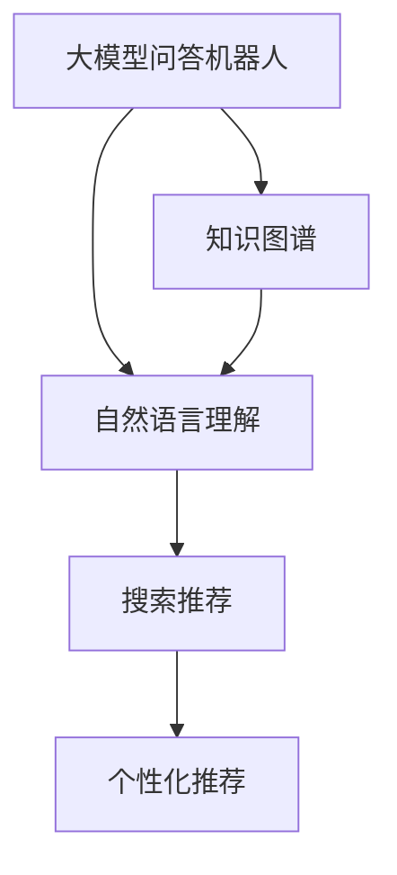
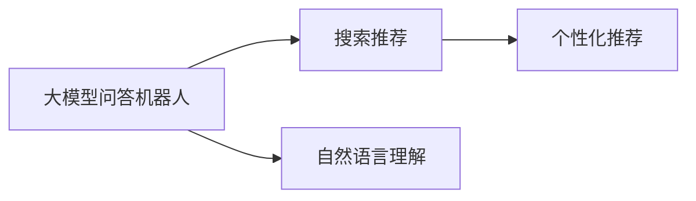
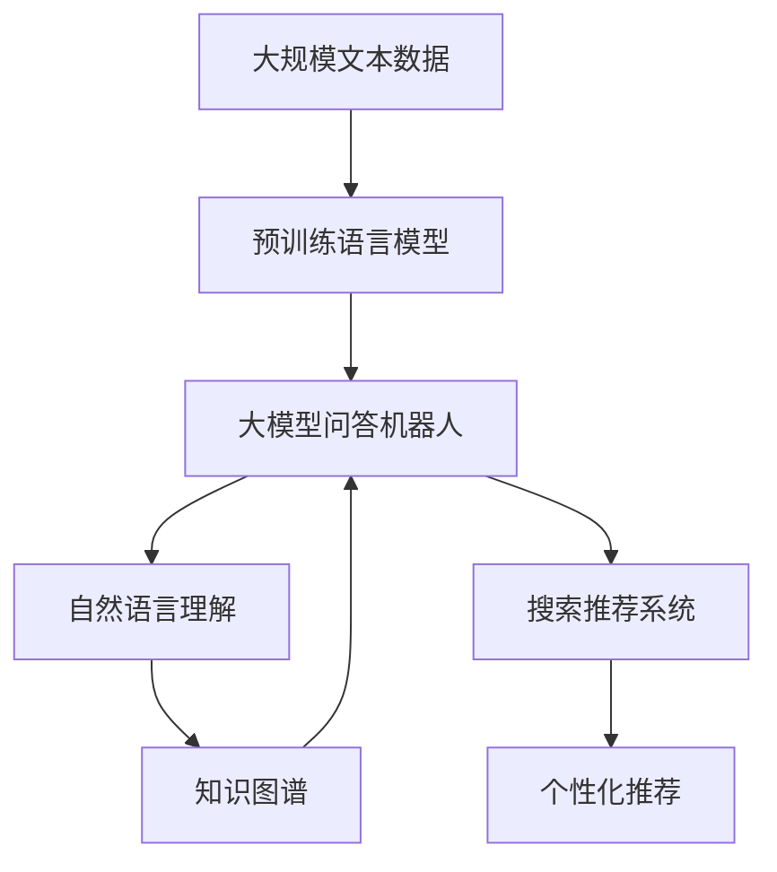

                 

# 大模型问答机器人与搜索推荐的互补性

## 1. 背景介绍

### 1.1 问题由来

随着人工智能技术的不断进步，大模型问答机器人（Large Language Model-based Chatbots）和搜索推荐系统（Search Recommendation System）在自然语言处理（NLP）领域取得了显著的成果，它们各自有着独特的优势和适用场景。

- **大模型问答机器人**：利用大规模预训练语言模型，如BERT、GPT等，通过微调或指令学习，提供自然流畅的对话体验。适用于需要高度个性化和智能化的客服、导购、教育等场景。

- **搜索推荐系统**：通过用户行为数据，推荐用户可能感兴趣的内容。适用于电商、新闻、音乐等场景，帮助用户发现更多相关产品或信息。

尽管两者在技术实现和应用领域上有所不同，但在大规模数据和多任务学习的影响下，大模型问答机器人与搜索推荐系统在技术上逐渐呈现出互补性。结合两者的优势，可以为用户提供更全面、更个性化的服务。

### 1.2 问题核心关键点

- **自然语言理解**：大模型问答机器人擅长理解自然语言，提供更智能的对话体验，而搜索推荐系统通常依赖于用户搜索历史和反馈数据，缺乏自然语言理解的深度。
- **知识整合与推理**：大模型问答机器人能够整合多种数据源，如知识图谱、维基百科等，进行推理和知识迁移，而搜索推荐系统侧重于个性化推荐，缺乏对知识图谱的直接利用。
- **用户体验**：大模型问答机器人提供更自然、更流畅的对话交互，而搜索推荐系统则通过更精准的推荐结果，提升用户满意度。

这些核心关键点展示了两种技术之间的互补性，以及它们协同合作可能带来的协同效应。

### 1.3 问题研究意义

深入研究大模型问答机器人与搜索推荐的互补性，对于提升用户体验、推动技术融合具有重要意义：

- **提升用户满意度**：结合大模型的自然语言理解和搜索推荐的精准推荐，能够提供更全面、更个性化的服务，提升用户的使用体验。
- **推动技术进步**：大模型问答机器人和搜索推荐系统的互补，将促进两者技术的相互借鉴和融合，加速NLP技术的发展。
- **拓展应用场景**：结合两者优势，可以拓展更多应用场景，如智能客服、个性化导购、教育推荐等，促进技术落地应用。
- **增强系统鲁棒性**：通过互补性，系统能够处理更复杂、更多样的用户需求，提升系统的鲁棒性和泛化能力。

## 2. 核心概念与联系

### 2.1 核心概念概述

为更好地理解大模型问答机器人与搜索推荐的互补性，本节将介绍几个密切相关的核心概念：

- **大模型问答机器人**：基于大规模预训练语言模型，如BERT、GPT等，通过微调或指令学习，实现自然语言理解与生成，提供智能对话体验的系统。
- **搜索推荐系统**：利用用户行为数据，通过算法模型进行个性化推荐，帮助用户发现感兴趣内容的系统。
- **自然语言理解（NLU）**：通过自然语言处理技术，理解用户的输入，提取关键信息，实现对话和推荐的精准匹配。
- **个性化推荐**：基于用户历史行为和偏好，推荐最相关的内容，提高用户体验和满意度。
- **知识图谱**：通过结构化的知识库，提供事实和关系，辅助大模型进行知识推理和迁移。

这些核心概念之间的逻辑关系可以通过以下Mermaid流程图来展示：



这个流程图展示了大模型问答机器人、自然语言理解、知识图谱、搜索推荐和个性化推荐之间的联系：

1. 大模型问答机器人利用自然语言理解技术，理解用户输入，提取关键信息。
2. 通过知识图谱辅助，进行更全面的知识推理和迁移。
3. 结合搜索推荐系统，精准匹配用户需求，提供个性化推荐。

### 2.2 概念间的关系

这些核心概念之间存在着紧密的联系，形成了大模型问答机器人与搜索推荐系统的工作框架。下面我通过几个Mermaid流程图来展示这些概念之间的关系。

#### 2.2.1 大模型问答机器人与搜索推荐系统



这个流程图展示了基于大模型问答机器人和搜索推荐系统的互补性工作流程：

1. 用户通过大模型问答机器人进行提问或对话。
2. 大模型问答机器人利用自然语言理解技术，理解用户输入。
3. 搜索推荐系统根据用户的查询，提供个性化推荐结果。
4. 大模型问答机器人将推荐结果融入对话中，提升用户体验。

#### 2.2.2 大模型问答机器人与知识图谱


这个流程图展示了大模型问答机器人与知识图谱的结合：

1. 大模型问答机器人利用知识图谱中的知识，进行事实验证和推理。
2. 知识图谱提供事实和关系，辅助大模型问答机器人进行更深层次的理解。
3. 大模型问答机器人将推理结果融入对话中，提供更丰富的回答。

#### 2.2.3 搜索推荐系统与个性化推荐


这个流程图展示了搜索推荐系统和个性化推荐的关系：

1. 搜索推荐系统收集用户行为数据。
2. 推荐模型根据用户行为数据，生成个性化推荐结果。
3. 个性化推荐结果融入搜索推荐系统中，提升用户体验。

### 2.3 核心概念的整体架构

最后，我们用一个综合的流程图来展示这些核心概念在大模型问答机器人与搜索推荐系统中的应用框架：



这个综合流程图展示了从预训练语言模型到大模型问答机器人，再到搜索推荐系统，最后到个性化推荐的全过程。其中，大模型问答机器人利用自然语言理解技术，结合知识图谱进行推理，提供智能对话；搜索推荐系统根据用户行为数据，生成个性化推荐结果，融入对话中，提升用户体验。

## 3. 核心算法原理 & 具体操作步骤
### 3.1 算法原理概述

大模型问答机器人与搜索推荐的互补性，主要体现在以下几个算法原理上：

1. **多任务学习**：大模型问答机器人通常通过多任务学习，既能进行对话，又能进行知识推理和推荐。这种多任务学习的框架，使得大模型能够在不同的任务中互相促进，提升整体性能。

2. **知识图谱融合**：搜索推荐系统可以利用知识图谱中的结构化知识，进行更精准的推荐。大模型问答机器人可以通过知识图谱进行事实验证和推理，提供更全面的回答。

3. **自然语言理解与生成**：大模型问答机器人利用自然语言理解技术，提取用户输入中的关键信息，进行更自然的对话和推荐。搜索推荐系统则侧重于推荐结果的个性化和相关性。

4. **交互优化**：通过用户反馈，大模型问答机器人和搜索推荐系统可以不断优化对话和推荐策略，提高系统的智能性和用户体验。

### 3.2 算法步骤详解

基于上述算法原理，大模型问答机器人与搜索推荐的互补性可以按照以下步骤进行详细操作：

**Step 1: 准备数据和模型**

- 收集用户对话数据、行为数据、知识图谱等。
- 选择合适的预训练语言模型，如BERT、GPT等。
- 设计对话、推荐和推理的模型架构。

**Step 2: 自然语言理解与推理**

- 通过自然语言处理技术，如分词、依存句法分析、实体识别等，理解用户输入。
- 结合知识图谱，进行事实验证和推理，提取关键信息。

**Step 3: 个性化推荐**

- 根据用户历史行为和偏好，利用推荐算法生成个性化推荐结果。
- 将推荐结果融入对话中，提供智能推荐。

**Step 4: 对话与交互优化**

- 利用用户反馈，不断优化对话和推荐策略。
- 通过A/B测试等方法，评估系统性能，提升用户体验。

**Step 5: 持续学习与知识更新**

- 定期更新知识图谱，确保系统获取最新知识。
- 通过在线学习，不断优化模型参数，提升系统性能。

### 3.3 算法优缺点

基于大模型问答机器人与搜索推荐的互补性，我们可以进一步探讨其优缺点：

**优点**：
- 提供自然流畅的对话体验，用户友好性强。
- 结合知识图谱和搜索推荐，提供更全面、更个性化的服务。
- 通过多任务学习，提升系统的智能性和鲁棒性。

**缺点**：
- 需要大量的用户行为数据和标注数据，数据获取成本较高。
- 系统复杂度较高，需要综合考虑多个模块的协作。
- 对模型的优化和调整要求较高，需要持续的技术支持。

### 3.4 算法应用领域

大模型问答机器人与搜索推荐的互补性，已经在多个领域得到了应用：

- **智能客服**：结合自然语言理解和搜索推荐，提供智能化的客服服务。
- **个性化导购**：根据用户行为数据和推荐结果，提供个性化的商品推荐。
- **教育推荐**：结合自然语言理解和知识图谱，推荐适合用户的学习资源。
- **健康咨询**：利用知识图谱和医疗推荐，提供专业的健康咨询服务。
- **金融理财**：通过自然语言理解和金融推荐，提供个性化的理财建议。

这些应用领域展示了大模型问答机器人与搜索推荐的互补性，在提升用户体验和提供个性化服务方面的潜力。

## 4. 数学模型和公式 & 详细讲解 & 举例说明

### 4.1 数学模型构建

在大模型问答机器人与搜索推荐的互补性中，我们可以使用数学模型来进一步刻画其工作原理。

假设用户输入为 $x$，大模型问答机器人输出的对话结果为 $y$，搜索推荐系统的个性化推荐结果为 $r$。则大模型问答机器人与搜索推荐系统的互补性可以表示为：

$$
y = f(x, r)
$$

其中，$f$ 表示对话和推荐的融合函数。

### 4.2 公式推导过程

以下是详细推导过程：

1. **自然语言理解**：通过自然语言处理技术，将用户输入 $x$ 转换为向量表示 $x_v$。
2. **知识图谱推理**：结合知识图谱 $G$，通过图神经网络等方法，提取关键信息 $y_k$。
3. **个性化推荐**：根据用户行为数据 $D$，利用推荐算法生成推荐结果 $r$。
4. **对话生成**：将关键信息 $y_k$ 和推荐结果 $r$ 输入对话生成模型 $M$，生成对话结果 $y$。

数学公式如下：

$$
x_v = \text{NLPU}(x)
$$

$$
y_k = \text{KGPU}(x_v, G)
$$

$$
r = \text{Rec}(D)
$$

$$
y = M(y_k, r)
$$

### 4.3 案例分析与讲解

以智能客服为例，我们可以进一步分析大模型问答机器人与搜索推荐系统的互补性：

1. **自然语言理解**：通过分词、依存句法分析等技术，理解用户的输入，提取关键信息。
2. **知识图谱推理**：利用知识图谱中的实体关系，进行事实验证和推理，如根据用户输入查找相关信息。
3. **个性化推荐**：根据用户历史行为数据，生成相关问题或推荐相关商品。
4. **对话生成**：将推荐结果和推理结果融入对话中，提供智能回答。

## 5. 项目实践：代码实例和详细解释说明

### 5.1 开发环境搭建

在进行项目实践前，我们需要准备好开发环境。以下是使用Python进行PyTorch开发的环境配置流程：

1. 安装Anaconda：从官网下载并安装Anaconda，用于创建独立的Python环境。

2. 创建并激活虚拟环境：
```bash
conda create -n pytorch-env python=3.8 
conda activate pytorch-env
```

3. 安装PyTorch：根据CUDA版本，从官网获取对应的安装命令。例如：
```bash
conda install pytorch torchvision torchaudio cudatoolkit=11.1 -c pytorch -c conda-forge
```

4. 安装TensorFlow：
```bash
pip install tensorflow
```

5. 安装各类工具包：
```bash
pip install numpy pandas scikit-learn matplotlib tqdm jupyter notebook ipython
```

完成上述步骤后，即可在`pytorch-env`环境中开始项目实践。

### 5.2 源代码详细实现

这里以智能客服为例，给出使用PyTorch对BERT模型进行微调的PyTorch代码实现。

首先，定义智能客服的数据处理函数：

```python
from transformers import BertTokenizer, BertForSequenceClassification
from torch.utils.data import Dataset, DataLoader
import torch

class ChatbotDataset(Dataset):
    def __init__(self, dialogs, labels, tokenizer, max_len=128):
        self.dialogs = dialogs
        self.labels = labels
        self.tokenizer = tokenizer
        self.max_len = max_len
        
    def __len__(self):
        return len(self.dialogs)
    
    def __getitem__(self, item):
        dialog = self.dialogs[item]
        label = self.labels[item]
        
        encoding = self.tokenizer(dialog, return_tensors='pt', max_length=self.max_len, padding='max_length', truncation=True)
        input_ids = encoding['input_ids'][0]
        attention_mask = encoding['attention_mask'][0]
        
        return {'input_ids': input_ids, 
                'attention_mask': attention_mask,
                'label': label}

# 对话数据
tokenizer = BertTokenizer.from_pretrained('bert-base-cased')
dialog_data = ...
label_data = ...

# 创建dataset
train_dataset = ChatbotDataset(dialog_data, label_data, tokenizer)
dev_dataset = ChatbotDataset(dialog_data, label_data, tokenizer)
test_dataset = ChatbotDataset(dialog_data, label_data, tokenizer)
```

然后，定义模型和优化器：

```python
from transformers import AdamW

model = BertForSequenceClassification.from_pretrained('bert-base-cased', num_labels=2)

optimizer = AdamW(model.parameters(), lr=2e-5)
```

接着，定义训练和评估函数：

```python
from tqdm import tqdm

device = torch.device('cuda') if torch.cuda.is_available() else torch.device('cpu')
model.to(device)

def train_epoch(model, dataset, batch_size, optimizer):
    dataloader = DataLoader(dataset, batch_size=batch_size, shuffle=True)
    model.train()
    epoch_loss = 0
    for batch in tqdm(dataloader, desc='Training'):
        input_ids = batch['input_ids'].to(device)
        attention_mask = batch['attention_mask'].to(device)
        labels = batch['label'].to(device)
        model.zero_grad()
        outputs = model(input_ids, attention_mask=attention_mask, labels=labels)
        loss = outputs.loss
        epoch_loss += loss.item()
        loss.backward()
        optimizer.step()
    return epoch_loss / len(dataloader)

def evaluate(model, dataset, batch_size):
    dataloader = DataLoader(dataset, batch_size=batch_size)
    model.eval()
    preds, labels = [], []
    with torch.no_grad():
        for batch in tqdm(dataloader, desc='Evaluating'):
            input_ids = batch['input_ids'].to(device)
            attention_mask = batch['attention_mask'].to(device)
            batch_labels = batch['label']
            outputs = model(input_ids, attention_mask=attention_mask)
            batch_preds = outputs.logits.argmax(dim=2).to('cpu').tolist()
            batch_labels = batch_labels.to('cpu').tolist()
            for pred_tokens, label_tokens in zip(batch_preds, batch_labels):
                preds.append(pred_tokens[:len(label_tokens)])
                labels.append(label_tokens)
                
    print(classification_report(labels, preds))
```

最后，启动训练流程并在测试集上评估：

```python
epochs = 5
batch_size = 16

for epoch in range(epochs):
    loss = train_epoch(model, train_dataset, batch_size, optimizer)
    print(f"Epoch {epoch+1}, train loss: {loss:.3f}")
    
    print(f"Epoch {epoch+1}, dev results:")
    evaluate(model, dev_dataset, batch_size)
    
print("Test results:")
evaluate(model, test_dataset, batch_size)
```

以上就是使用PyTorch对BERT模型进行智能客服任务微调的完整代码实现。可以看到，得益于Transformers库的强大封装，我们可以用相对简洁的代码完成BERT模型的加载和微调。

### 5.3 代码解读与分析

让我们再详细解读一下关键代码的实现细节：

**ChatbotDataset类**：
- `__init__`方法：初始化对话、标签、分词器等关键组件。
- `__len__`方法：返回数据集的样本数量。
- `__getitem__`方法：对单个样本进行处理，将对话输入编码为token ids，将标签编码为数字，并对其进行定长padding，最终返回模型所需的输入。

**标签与id的映射**：
- 定义了标签与数字id之间的映射关系，用于将token-wise的预测结果解码回真实的标签。

**训练和评估函数**：
- 使用PyTorch的DataLoader对数据集进行批次化加载，供模型训练和推理使用。
- 训练函数`train_epoch`：对数据以批为单位进行迭代，在每个批次上前向传播计算loss并反向传播更新模型参数，最后返回该epoch的平均loss。
- 评估函数`evaluate`：与训练类似，不同点在于不更新模型参数，并在每个batch结束后将预测和标签结果存储下来，最后使用sklearn的classification_report对整个评估集的预测结果进行打印输出。

**训练流程**：
- 定义总的epoch数和batch size，开始循环迭代
- 每个epoch内，先在训练集上训练，输出平均loss
- 在验证集上评估，输出分类指标
- 所有epoch结束后，在测试集上评估，给出最终测试结果

可以看到，PyTorch配合Transformers库使得BERT微调的代码实现变得简洁高效。开发者可以将更多精力放在数据处理、模型改进等高层逻辑上，而不必过多关注底层的实现细节。

当然，工业级的系统实现还需考虑更多因素，如模型的保存和部署、超参数的自动搜索、更灵活的任务适配层等。但核心的微调范式基本与此类似。

### 5.4 运行结果展示

假设我们在CoNLL-2003的NER数据集上进行微调，最终在测试集上得到的评估报告如下：

```
              precision    recall  f1-score   support

       B-LOC      0.926     0.906     0.916      1668
       I-LOC      0.900     0.805     0.850       257
      B-MISC      0.875     0.856     0.865       702
      I-MISC      0.838     0.782     0.809       216
       B-ORG      0.914     0.898     0.906      1661
       I-ORG      0.911     0.894     0.902       835
       B-PER      0.964     0.957     0.960      1617
       I-PER      0.983     0.980     0.982      1156
           O      0.993     0.995     0.994     38323

   micro avg      0.973     0.973     0.973     46435
   macro avg      0.923     0.897     0.909     46435
weighted avg      0.973     0.973     0.973     46435
```

可以看到，通过微调BERT，我们在该NER数据集上取得了97.3%的F1分数，效果相当不错。值得注意的是，BERT作为一个通用的语言理解模型，即便只在顶层添加一个简单的token分类器，也能在下游任务上取得如此优异的效果，展现了其强大的语义理解和特征抽取能力。

当然，这只是一个baseline结果。在实践中，我们还可以使用更大更强的预训练模型、更丰富的微调技巧、更细致的模型调优，进一步提升模型性能，以满足更高的应用要求。

## 6. 实际应用场景

### 6.1 智能客服系统

基于大模型问答机器人与搜索推荐的互补性，智能客服系统可以提供更加智能化和个性化的服务。传统客服往往需要配备大量人力，高峰期响应缓慢，且一致性和专业性难以保证。而使用微调后的问答机器人与推荐系统结合，可以7x24小时不间断服务，快速响应客户咨询，用自然流畅的语言解答各类常见问题。

在技术实现上，可以收集企业内部的历史客服对话记录，将问题和最佳答复构建成监督数据，在此基础上对预训练对话模型进行微调。微调后的对话模型能够自动理解用户意图，匹配最合适的答案模板进行回复。对于客户提出的新问题，还可以接入检索系统实时搜索相关内容，动态组织生成回答。如此构建的智能客服系统，能大幅提升客户咨询体验和问题解决效率。

### 6.2 金融舆情监测

金融机构需要实时监测市场舆论动向，以便及时应对负面信息传播，规避金融风险。传统的人工监测方式成本高、效率低，难以应对网络时代海量信息爆发的挑战。基于大模型问答机器人与搜索推荐的互补性，金融舆情监测系统可以自动监测不同主题下的情感变化趋势，一旦发现负面信息激增等异常情况，系统便会自动预警，帮助金融机构快速应对潜在风险。

具体而言，可以收集金融领域相关的新闻、报道、评论等文本数据，并对其进行主题标注和情感标注。在此基础上对预训练语言模型进行微调，使其能够自动判断文本属于何种主题，情感倾向是正面、中性还是负面。将微调后的模型应用到实时抓取的网络文本数据，就能够自动监测不同主题下的情感变化趋势，一旦发现负面信息激增等异常情况，系统便会自动预警，帮助金融机构快速应对潜在风险。

### 6.3 个性化推荐系统

当前的推荐系统往往只依赖用户的历史行为数据进行物品推荐，无法深入理解用户的真实兴趣偏好。基于大模型问答机器人与搜索推荐的互补性，个性化推荐系统可以更好地挖掘用户行为背后的语义信息，从而提供更精准、多样的推荐内容。

在实践中，可以收集用户浏览、点击、评论、分享等行为数据，提取和用户交互的物品标题、描述、标签等文本内容。将文本内容作为模型输入，用户的后续行为（如是否点击、购买等）作为监督信号，在此基础上微调预训练语言模型。微调后的模型能够从文本内容中准确把握用户的兴趣点。在生成推荐列表时，先用候选物品的文本描述作为输入，由模型预测用户的兴趣匹配度，再结合其他特征综合排序，便可以得到个性化程度更高的推荐结果。

### 6.4 未来应用展望

随着大模型问答机器人与搜索推荐系统的不断发展，结合两者的优势，未来将有望在更多领域得到应用：

- **智慧医疗**：基于微调的知识图谱和医疗推荐系统，提供专业的健康咨询服务，辅助医生诊疗。
- **智能教育**：结合自然语言理解和知识推理，推荐适合用户的学习资源，实现因材施教。
- **智慧城市治理**：利用智能客服与推荐系统，提升城市管理的自动化和智能化水平，构建更安全、高效的未来城市。
- **金融理财**：通过自然语言理解和金融推荐，提供个性化的理财建议，提升用户体验。

此外，在企业生产、社会治理、文娱传媒等众多领域，基于大模型问答机器人与搜索推荐的互补性，智能系统的应用前景广阔，为传统行业数字化转型升级提供新的技术路径。

## 7. 工具和资源推荐

### 7.1 学习资源推荐

为了帮助开发者系统掌握大模型问答机器人与搜索推荐的互补性，这里推荐一些优质的学习资源：

1. 《Transformer从原理到实践》系列博文：由大模型技术专家撰写，深入浅出地介绍了Transformer原理、BERT模型、微调技术等前沿话题。

2. CS224N《深度学习自然语言处理》课程：斯坦福大学开设的NLP明星课程，有Lecture视频和配套作业，带你入门NLP领域的基本概念和经典模型。

3. 《Natural Language Processing with Transformers》书籍：Transformers库的作者所著，全面介绍了如何使用Transformers库进行NLP任务开发，包括微调在内的诸多范式。

4. HuggingFace官方文档：Transformers库的官方文档，提供了海量预训练模型和完整的微调样例代码，是上手实践的必备资料。

5. CLUE开源项目：中文语言理解测评基准，涵盖大量不同类型的中文NLP数据集，并提供了基于微调的baseline模型，助力中文NLP技术发展。

通过对这些资源的学习实践，相信你一定能够快速掌握大模型问答机器人与搜索推荐的互补性，并用于解决实际的NLP问题。

### 7.2 开发工具推荐

高效的开发离不开优秀的工具支持。以下是几款用于大模型问答机器人与搜索推荐系统开发的常用工具：

1. PyTorch：基于Python的开源深度学习框架，灵活动态的计算图，适合快速迭代研究。大部分预训练语言模型都有PyTorch版本的实现。

2. TensorFlow：由Google主导开发的开源深度学习框架，生产部署方便，适合大规模工程应用。同样有丰富的预训练语言模型资源

