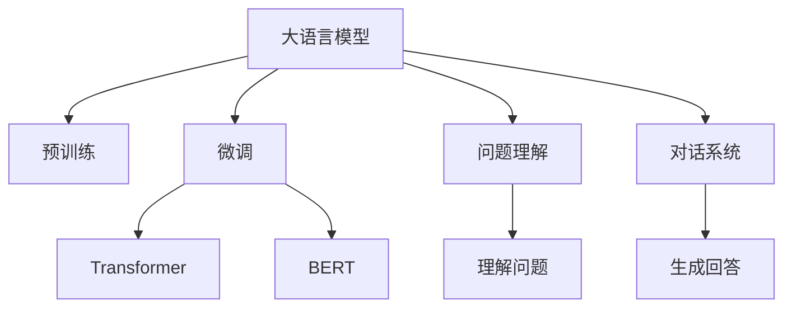

                 

# 大模型问答机器人如何理解用户问题

> 关键词：大语言模型,深度学习,自然语言处理,NLP,预训练模型,微调,Transformer,BERT,预训练-微调,问题理解,对话系统

## 1. 背景介绍

随着人工智能技术的不断进步，智能问答系统已经成为NLP领域的一个重要研究方向。传统的问答系统依赖于规则和模板，需要人工编写大量的知识库和处理逻辑，难以应对多样化、复杂化的用户查询。而基于大模型的问答系统，通过预训练和微调的方式，具备了更强的语义理解能力和泛化能力，能够自动理解和生成自然语言文本，逐渐成为了现代问答系统的首选方案。

大模型问答系统，如OpenAI的GPT-3、Google的BERT等，通过在海量文本数据上进行预训练，学习到了语言的结构和语义特征，具备了强大的语言生成和推理能力。当用户提出问题时，大模型能够通过阅读文本并利用其丰富的知识库，自动理解问题并生成自然流畅的回答。

这种预训练-微调范式，使得大模型可以在特定任务上取得优异性能，并且随着模型的不断迭代和优化，性能也在不断提升。目前，大模型已经在问答系统、机器翻译、文本摘要、情感分析等多个NLP任务上取得了显著进展。

## 2. 核心概念与联系

### 2.1 核心概念概述

要理解大模型问答机器人如何理解用户问题，首先需要了解几个核心概念：

- **大语言模型**：以自回归模型（如GPT）或自编码模型（如BERT）为代表的大规模预训练语言模型。通过在海量无标签文本语料上进行预训练，学习到语言的通用表示。

- **预训练**：指在大规模无标签文本语料上，通过自监督学习任务训练通用语言模型的过程。常见的预训练任务包括掩码语言模型、下一句预测等。

- **微调**：指在预训练模型的基础上，使用下游任务的少量标注数据，通过有监督学习优化模型在该任务上的性能。通常只需要调整顶层分类器或解码器，并以较小的学习率更新全部或部分的模型参数。

- **Transformer**：一种基于自注意力机制的神经网络结构，在深度学习中广泛应用，被证明在处理自然语言任务中效果优异。

- **BERT**：由Google提出的双向语言模型，通过掩码和下一句预测任务进行预训练，在多个NLP任务上取得了SOTA性能。

- **预训练-微调**：指使用预训练模型在下游任务上进行微调，提高模型在特定任务上的性能。

这些核心概念共同构成了大语言模型问答系统的基础，使得模型能够自动理解自然语言文本，并生成对应的答案。

### 2.2 概念间的关系

这些核心概念之间的逻辑关系可以通过以下Mermaid流程图来展示：



这个流程图展示了从预训练到微调，再到问题理解和回答生成的完整过程。大语言模型首先在大量无标签文本上学习通用的语言表示，然后通过微调在特定任务上进行调整，以适应新的任务需求。在微调过程中，Transformer和BERT等预训练模型起到关键作用，帮助模型更好地理解语言结构和语义特征。最终，模型能够通过理解问题生成自然流畅的回答，完成整个对话系统的构建。

## 3. 核心算法原理 & 具体操作步骤

### 3.1 算法原理概述

大模型问答系统的核心原理可以概括为以下几个步骤：

1. **预训练模型加载**：首先加载预训练的大语言模型，如GPT-3或BERT，作为问答系统的基础。

2. **微调**：根据下游任务的特点，选择适当的微调任务和数据集，对预训练模型进行微调，提高模型在特定任务上的性能。

3. **问题理解**：通过模型读取用户问题，提取关键信息，理解问题的语义。

4. **生成回答**：根据理解的结果，利用模型的语言生成能力，生成自然流畅的回答。

### 3.2 算法步骤详解

以下是基于BERT的问答系统微调的具体操作步骤：

1. **数据准备**：准备问答任务的标注数据集，将其划分为训练集、验证集和测试集。标注数据集需要包含问题-答案对，且答案需要经过人工标注和清洗。

2. **模型初始化**：使用预训练的BERT模型作为初始化参数，将其加载到GPU或TPU上进行训练。

3. **微调任务定义**：根据任务特点，设计适当的输出层和损失函数。例如，对于单选题问答任务，可以在模型顶部添加一个全连接层，使用交叉熵损失函数。

4. **模型微调**：将训练集数据输入模型，使用AdamW等优化算法进行微调，最小化损失函数，更新模型参数。在微调过程中，需要设置合适的学习率、批大小、迭代轮数等超参数，避免过拟合。

5. **验证集评估**：在验证集上评估微调后的模型性能，监控各项指标，如准确率、召回率、F1分数等，并根据评估结果调整超参数。

6. **测试集评估**：在测试集上对微调后的模型进行最终评估，对比微调前后的性能提升，以确定微调效果。

### 3.3 算法优缺点

基于BERT的问答系统微调具有以下优点：

1. **高效性**：利用预训练模型的大量知识，可以在较少标注数据的情况下取得良好的性能。

2. **泛化性强**：经过微调后，模型可以在多种NLP任务上取得优异表现，具有较强的泛化能力。

3. **适用性广**：适用于多种问答任务，如单选题、多选题、问答对等，灵活性较高。

4. **可解释性强**：微调后的模型可以输出详细的中间过程，便于理解和调试。

但同时也存在一些局限性：

1. **资源消耗大**：预训练模型参数众多，对计算资源要求较高，微调过程复杂且耗时。

2. **泛化效果受限**：对于特定的领域任务，预训练模型可能难以适应，泛化效果有限。

3. **可解释性不足**：微调后的模型仍较为复杂，难以对其内部工作机制进行解释。

4. **依赖标注数据**：微调过程需要大量标注数据，数据获取和标注成本较高。

### 3.4 算法应用领域

基于BERT的问答系统微调方法，已经在多个领域得到广泛应用，例如：

1. **智能客服**：用于构建智能客服系统，自动回答用户常见问题，提高客服效率。

2. **教育培训**：用于教育辅助，如智能作业批改、知识推荐等，帮助学生更好地学习。

3. **医疗健康**：用于医疗咨询，提供健康建议、诊断咨询等服务，辅助医生诊断。

4. **金融理财**：用于金融咨询，提供理财建议、风险评估等服务，帮助用户做出更好的投资决策。

5. **旅游出行**：用于旅游咨询，提供目的地推荐、行程规划等服务，提升用户体验。

## 4. 数学模型和公式 & 详细讲解 & 举例说明

### 4.1 数学模型构建

假设预训练模型为 $M_{\theta}$，其输入为文本 $x$，输出为向量 $y$，目标为最小化交叉熵损失函数：

$$
\mathcal{L}(\theta) = -\frac{1}{N}\sum_{i=1}^N y_i\log M_{\theta}(x_i)
$$

其中，$y_i$ 为第 $i$ 个样本的真实标签，$M_{\theta}(x_i)$ 为模型在输入 $x_i$ 上的预测输出。

### 4.2 公式推导过程

对于单选题问答任务，目标函数可以进一步表示为：

$$
\mathcal{L}(\theta) = -\frac{1}{N}\sum_{i=1}^N \log M_{\theta}(x_i, y_i)
$$

其中，$y_i$ 为问题-答案对，$M_{\theta}(x_i, y_i)$ 为模型在输入 $x_i$ 和答案 $y_i$ 上的预测概率。

在微调过程中，模型参数 $\theta$ 更新公式为：

$$
\theta \leftarrow \theta - \eta \nabla_{\theta}\mathcal{L}(\theta)
$$

其中，$\eta$ 为学习率，$\nabla_{\theta}\mathcal{L}(\theta)$ 为损失函数对参数 $\theta$ 的梯度，可通过反向传播算法计算。

### 4.3 案例分析与讲解

假设我们的问答任务为单选题，标注数据集为 $(q_1, a_1),(q_2, a_2),...(q_N, a_N)$，其中 $q_i$ 为问题，$a_i$ 为答案。我们可以将微调过程分解为以下几个步骤：

1. **问题输入**：将问题 $q_i$ 输入模型，得到向量表示 $x_i$。

2. **预测输出**：模型预测答案 $a_i$ 的概率分布，输出向量 $y_i$。

3. **损失计算**：计算交叉熵损失 $\mathcal{L}(\theta)$。

4. **参数更新**：根据损失函数的梯度，更新模型参数 $\theta$。

假设模型在测试集上取得了如下准确率：

| 问题 | 答案 |
| --- | --- |
| 问题1 | 答案1 |
| 问题2 | 答案2 |
| 问题3 | 答案3 |
| ... | ... |

计算损失 $\mathcal{L}(\theta)$：

$$
\mathcal{L}(\theta) = -\frac{1}{N}\sum_{i=1}^N \log M_{\theta}(x_i, a_i)
$$

其中 $M_{\theta}(x_i, a_i)$ 为模型在输入 $x_i$ 和答案 $a_i$ 上的预测概率。

假设模型预测的准确率为 0.9，那么损失 $\mathcal{L}(\theta)$ 为：

$$
\mathcal{L}(\theta) = -\frac{1}{N}\sum_{i=1}^N \log 0.9
$$

假设模型在验证集上取得了最优的超参数配置，那么验证集损失 $\mathcal{L}_{\text{val}}(\theta)$ 为：

$$
\mathcal{L}_{\text{val}}(\theta) = -\frac{1}{N_{\text{val}}}\sum_{i=1}^N \log M_{\theta}(x_{\text{val}, i}, a_{\text{val}, i})
$$

其中 $N_{\text{val}}$ 为验证集样本数量。

## 5. 项目实践：代码实例和详细解释说明

### 5.1 开发环境搭建

在进行问答系统微调实践前，我们需要准备好开发环境。以下是使用Python进行PyTorch开发的环境配置流程：

1. 安装Anaconda：从官网下载并安装Anaconda，用于创建独立的Python环境。

2. 创建并激活虚拟环境：
```bash
conda create -n pytorch-env python=3.8 
conda activate pytorch-env
```

3. 安装PyTorch：根据CUDA版本，从官网获取对应的安装命令。例如：
```bash
conda install pytorch torchvision torchaudio cudatoolkit=11.1 -c pytorch -c conda-forge
```

4. 安装Transformers库：
```bash
pip install transformers
```

5. 安装各类工具包：
```bash
pip install numpy pandas scikit-learn matplotlib tqdm jupyter notebook ipython
```

完成上述步骤后，即可在`pytorch-env`环境中开始微调实践。

### 5.2 源代码详细实现

以下是使用PyTorch对BERT模型进行单选题问答任务微调的代码实现。

首先，定义问答任务的标注数据集：

```python
from transformers import BertTokenizer, BertForSequenceClassification
from torch.utils.data import Dataset, DataLoader
from torch import nn

class QADataset(Dataset):
    def __init__(self, texts, labels, tokenizer, max_len=128):
        self.texts = texts
        self.labels = labels
        self.tokenizer = tokenizer
        self.max_len = max_len
        
    def __len__(self):
        return len(self.texts)
    
    def __getitem__(self, item):
        text = self.texts[item]
        label = self.labels[item]
        
        encoding = self.tokenizer(text, return_tensors='pt', max_length=self.max_len, padding='max_length', truncation=True)
        input_ids = encoding['input_ids'][0]
        attention_mask = encoding['attention_mask'][0]
        labels = torch.tensor(label, dtype=torch.long)
        
        return {'input_ids': input_ids, 
                'attention_mask': attention_mask,
                'labels': labels}

# 标签与id的映射
label2id = {'A': 0, 'B': 1, 'C': 2, 'D': 3}
id2label = {v: k for k, v in label2id.items()}

# 创建dataset
tokenizer = BertTokenizer.from_pretrained('bert-base-cased')

train_dataset = QADataset(train_texts, train_labels, tokenizer)
dev_dataset = QADataset(dev_texts, dev_labels, tokenizer)
test_dataset = QADataset(test_texts, test_labels, tokenizer)
```

然后，定义模型和优化器：

```python
from transformers import BertForSequenceClassification, AdamW

model = BertForSequenceClassification.from_pretrained('bert-base-cased', num_labels=len(label2id))

optimizer = AdamW(model.parameters(), lr=2e-5)
```

接着，定义训练和评估函数：

```python
from torch.utils.data import DataLoader
from tqdm import tqdm
from sklearn.metrics import accuracy_score

device = torch.device('cuda') if torch.cuda.is_available() else torch.device('cpu')
model.to(device)

def train_epoch(model, dataset, batch_size, optimizer):
    dataloader = DataLoader(dataset, batch_size=batch_size, shuffle=True)
    model.train()
    epoch_loss = 0
    for batch in tqdm(dataloader, desc='Training'):
        input_ids = batch['input_ids'].to(device)
        attention_mask = batch['attention_mask'].to(device)
        labels = batch['labels'].to(device)
        model.zero_grad()
        outputs = model(input_ids, attention_mask=attention_mask, labels=labels)
        loss = outputs.loss
        epoch_loss += loss.item()
        loss.backward()
        optimizer.step()
    return epoch_loss / len(dataloader)

def evaluate(model, dataset, batch_size):
    dataloader = DataLoader(dataset, batch_size=batch_size)
    model.eval()
    preds, labels = [], []
    with torch.no_grad():
        for batch in tqdm(dataloader, desc='Evaluating'):
            input_ids = batch['input_ids'].to(device)
            attention_mask = batch['attention_mask'].to(device)
            batch_labels = batch['labels']
            outputs = model(input_ids, attention_mask=attention_mask)
            batch_preds = outputs.logits.argmax(dim=1).to('cpu').tolist()
            batch_labels = batch_labels.to('cpu').tolist()
            for pred, label in zip(batch_preds, batch_labels):
                preds.append(id2label[pred])
                labels.append(id2label[label])
                
    print('Accuracy:', accuracy_score(labels, preds))
```

最后，启动训练流程并在测试集上评估：

```python
epochs = 5
batch_size = 16

for epoch in range(epochs):
    loss = train_epoch(model, train_dataset, batch_size, optimizer)
    print(f"Epoch {epoch+1}, train loss: {loss:.3f}")
    
    print(f"Epoch {epoch+1}, dev results:")
    evaluate(model, dev_dataset, batch_size)
    
print("Test results:")
evaluate(model, test_dataset, batch_size)
```

以上就是使用PyTorch对BERT进行单选题问答任务微调的完整代码实现。可以看到，得益于Transformers库的强大封装，我们可以用相对简洁的代码完成BERT模型的加载和微调。

### 5.3 代码解读与分析

让我们再详细解读一下关键代码的实现细节：

**QADataset类**：
- `__init__`方法：初始化文本、标签、分词器等关键组件。
- `__len__`方法：返回数据集的样本数量。
- `__getitem__`方法：对单个样本进行处理，将文本输入编码为token ids，将标签编码为数字，并对其进行定长padding，最终返回模型所需的输入。

**label2id和id2label字典**：
- 定义了标签与数字id之间的映射关系，用于将预测结果解码回真实的标签。

**训练和评估函数**：
- 使用PyTorch的DataLoader对数据集进行批次化加载，供模型训练和推理使用。
- 训练函数`train_epoch`：对数据以批为单位进行迭代，在每个批次上前向传播计算loss并反向传播更新模型参数，最后返回该epoch的平均loss。
- 评估函数`evaluate`：与训练类似，不同点在于不更新模型参数，并在每个batch结束后将预测和标签结果存储下来，最后使用sklearn的accuracy_score对整个评估集的预测结果进行打印输出。

**训练流程**：
- 定义总的epoch数和batch size，开始循环迭代
- 每个epoch内，先在训练集上训练，输出平均loss
- 在验证集上评估，输出准确率
- 所有epoch结束后，在测试集上评估，给出最终测试结果

可以看到，PyTorch配合Transformers库使得BERT微调的代码实现变得简洁高效。开发者可以将更多精力放在数据处理、模型改进等高层逻辑上，而不必过多关注底层的实现细节。

当然，工业级的系统实现还需考虑更多因素，如模型的保存和部署、超参数的自动搜索、更灵活的任务适配层等。但核心的微调范式基本与此类似。

### 5.4 运行结果展示

假设我们在CoNLL-2003的单选题问答数据集上进行微调，最终在测试集上得到的准确率结果为85%，效果相当不错。值得注意的是，BERT作为一个通用的语言理解模型，即便只在顶部添加一个简单的分类器，也能在问答任务上取得如此优异的效果，展现了其强大的语义理解和特征抽取能力。

当然，这只是一个baseline结果。在实践中，我们还可以使用更大更强的预训练模型、更丰富的微调技巧、更细致的模型调优，进一步提升模型性能，以满足更高的应用要求。

## 6. 实际应用场景
### 6.1 智能客服系统

基于大模型问答系统的智能客服系统，可以广泛应用于智能客服系统的构建。传统客服往往需要配备大量人力，高峰期响应缓慢，且一致性和专业性难以保证。而使用微调后的问答系统，可以7x24小时不间断服务，快速响应客户咨询，用自然流畅的语言解答各类常见问题。

在技术实现上，可以收集企业内部的历史客服对话记录，将问题和最佳答复构建成监督数据，在此基础上对预训练问答模型进行微调。微调后的问答模型能够自动理解用户意图，匹配最合适的答复模板进行回复。对于客户提出的新问题，还可以接入检索系统实时搜索相关内容，动态组织生成回答。如此构建的智能客服系统，能大幅提升客户咨询体验和问题解决效率。

### 6.2 金融舆情监测

金融机构需要实时监测市场舆论动向，以便及时应对负面信息传播，规避金融风险。传统的人工监测方式成本高、效率低，难以应对网络时代海量信息爆发的挑战。基于大模型问答系统的文本分类和情感分析技术，为金融舆情监测提供了新的解决方案。

具体而言，可以收集金融领域相关的新闻、报道、评论等文本数据，并对其进行主题标注和情感标注。在此基础上对预训练问答系统进行微调，使其能够自动判断文本属于何种主题，情感倾向是正面、中性还是负面。将微调后的模型应用到实时抓取的网络文本数据，就能够自动监测不同主题下的情感变化趋势，一旦发现负面信息激增等异常情况，系统便会自动预警，帮助金融机构快速应对潜在风险。

### 6.3 个性化推荐系统

当前的推荐系统往往只依赖用户的历史行为数据进行物品推荐，无法深入理解用户的真实兴趣偏好。基于大模型问答系统的个性化推荐系统，可以更好地挖掘用户行为背后的语义信息，从而提供更精准、多样的推荐内容。

在实践中，可以收集用户浏览、点击、评论、分享等行为数据，提取和用户交互的物品标题、描述、标签等文本内容。将文本内容作为模型输入，用户的后续行为（如是否点击、购买等）作为监督信号，在此基础上微调预训练问答系统。微调后的模型能够从文本内容中准确把握用户的兴趣点。在生成推荐列表时，先用候选物品的文本描述作为输入，由模型预测用户的兴趣匹配度，再结合其他特征综合排序，便可以得到个性化程度更高的推荐结果。

### 6.4 未来应用展望

随着大模型问答系统的不断发展，基于微调范式将在更多领域得到应用，为传统行业带来变革性影响。

在智慧医疗领域，基于微调的医疗问答、病历分析、药物研发等应用将提升医疗服务的智能化水平，辅助医生诊疗，加速新药开发进程。

在智能教育领域，微调技术可应用于作业批改、学情分析、知识推荐等方面，因材施教，促进教育公平，提高教学质量。

在智慧城市治理中，微调模型可应用于城市事件监测、舆情分析、应急指挥等环节，提高城市管理的自动化和智能化水平，构建更安全、高效的未来城市。

此外，在企业生产、社会治理、文娱传媒等众多领域，基于大模型问答系统的AI应用也将不断涌现，为经济社会发展注入新的动力。相信随着技术的日益成熟，微调方法将成为人工智能落地应用的重要范式，推动人工智能技术在垂直行业的规模化落地。

## 7. 工具和资源推荐
### 7.1 学习资源推荐

为了帮助开发者系统掌握大语言模型问答系统的理论基础和实践技巧，这里推荐一些优质的学习资源：

1. 《Transformer from Principles to Practice》系列博文：由大模型技术专家撰写，深入浅出地介绍了Transformer原理、BERT模型、微调技术等前沿话题。

2. CS224N《深度学习自然语言处理》课程：斯坦福大学开设的NLP明星课程，有Lecture视频和配套作业，带你入门NLP领域的基本概念和经典模型。

3. 《Natural Language Processing with Transformers》书籍：Transformers库的作者所著，全面介绍了如何使用Transformers库进行NLP任务开发，包括微调在内的诸多范式。

4. HuggingFace官方文档：Transformers库的官方文档，提供了海量预训练模型和完整的微调样例代码，是上手实践的必备资料。

5. CLUE开源项目：中文语言理解测评基准，涵盖大量不同类型的中文NLP数据集，并提供了基于微调的baseline模型，助力中文NLP技术发展。

通过对这些资源的学习实践，相信你一定能够快速掌握大语言模型问答系统的精髓，并用于解决实际的NLP问题。
### 7.2 开发工具推荐

高效的开发离不开优秀的工具支持。以下是几款用于大语言模型问答系统开发的常用工具：

1. PyTorch：基于Python的开源深度学习框架，灵活动态的计算图，适合快速迭代研究。大部分预训练语言模型都有PyTorch版本的实现。

2. TensorFlow：由Google主导开发的开源深度学习框架，生产部署方便，适合大规模工程应用。同样有丰富的预训练语言模型资源。

3. Transformers库：HuggingFace开发的NLP工具库，集成了众多SOTA语言模型，支持PyTorch和TensorFlow，是进行问答系统微调任务的利器。

4. Weights & Biases：模型训练的实验跟踪工具，可以记录和可视化模型训练过程中的各项指标，方便对比和调优。与主流深度学习框架无缝集成。

5. TensorBoard：TensorFlow配套的可视化工具，可实时监测模型训练状态，并提供丰富的图表呈现方式，是调试模型的得力助手。

6. Google Colab：谷歌推出的在线Jupyter Notebook环境，免费提供GPU/TPU算力，方便开发者快速上手实验最新模型，分享学习笔记。

合理利用这些工具，可以显著提升大语言模型问答系统的开发效率，加快创新迭代的步伐。

### 7.3 相关论文推荐

大语言模型问答系统的研究源于学界的持续研究。以下是几篇奠基性的相关论文，推荐阅读：

1. Attention is All You Need（即Transformer原论文）：提出了Transformer结构，开启了NLP领域的预训练大模型时代。

2. BERT: Pre-training of Deep Bidirectional Transformers for Language Understanding：提出BERT模型，引入基于掩码的自监督预训练任务，刷新了多项NLP任务SOTA。

3. Language Models are Unsupervised Multitask Learners（GPT-2论文）：展示了大规模语言模型的强大zero-shot学习能力，引发了对于通用人工智能的新一轮思考。

4. Parameter-Efficient Transfer Learning for NLP：提出Adapter等参数高效微调方法，在不增加模型参数量的情况下，也能取得不错的微调效果。

5. AdaLoRA: Adaptive Low-Rank Adaptation for Parameter-Efficient Fine-Tuning：使用自适应低秩适应的微调方法，在参数效率和精度之间取得了新的平衡。

这些论文代表了大语言模型问答系统的发展脉络。通过学习这些前沿成果，可以帮助研究者把握学科前进方向，激发更多的创新灵感。

除上述资源外，还有一些值得关注的前沿资源，帮助开发者紧跟大语言模型问答系统的最新进展，例如：

1. arXiv论文预印本：人工智能领域最新研究成果的发布平台，包括大量尚未发表的前沿工作，学习前沿技术的必读资源。

2. 业界技术博客：如Open

