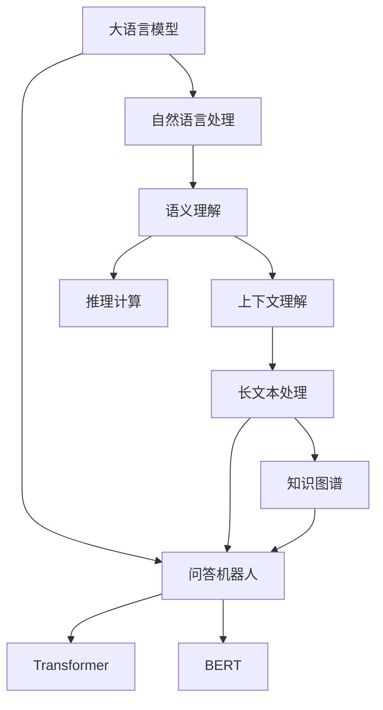

                 

# 大模型问答机器人如何理解语义

> 关键词：大模型,语义理解,自然语言处理(NLP),问答机器人,语言模型,Transformer,BERT,深度学习

## 1. 背景介绍

随着人工智能技术的不断发展，大语言模型和自然语言处理(Natural Language Processing, NLP)技术在各个领域得到广泛应用。其中，问答机器人（Question Answering Robot, QAR）作为人机交互的重要工具，能够快速、准确地回答用户提出的各种问题，被广泛应用于智能客服、智能助手、智能搜索等领域。

### 1.1 问题由来

问答机器人的核心在于理解用户输入的自然语言，并给出准确的答案。传统的问答系统依赖于规则和模板，需要大量的人工设计和维护，难以满足复杂多变的需求。近年来，基于深度学习的问答系统逐渐兴起，其中大语言模型在语义理解方面表现出色，成为问答机器人技术的主流方向。

### 1.2 问题核心关键点

大语言模型在语义理解上的优势主要体现在以下几个方面：

- **丰富的语义知识**：通过大规模语料的预训练，大语言模型学习到了广泛的语言知识，能够理解复杂句法和语义关系。
- **强大的上下文理解能力**：大语言模型可以处理长文本，能够捕捉到上下文的语义信息，从而更准确地回答问题。
- **适应性强**：大语言模型可以通过微调适应特定的问答任务，提升系统的针对性和准确性。

### 1.3 问题研究意义

研究问答机器人的语义理解机制，对于提升系统的准确性和智能化水平，推动智能技术的产业化进程，具有重要意义：

1. **提升回答质量**：深入理解语义，能够更准确地匹配问题和答案，提高回答质量。
2. **降低开发成本**：利用大语言模型，可以减少人工规则设计和维护的工作量，降低开发成本。
3. **拓展应用范围**：基于大语言模型的问答系统可以适应各种领域和场景，提升系统的普适性。
4. **提高用户体验**：通过自然流畅的对话，增强用户的使用体验，提升用户满意度。
5. **推动技术进步**：问答机器人技术的不断进步，将带动自然语言理解和交互技术的整体提升。

## 2. 核心概念与联系

### 2.1 核心概念概述

为更好地理解大模型问答机器人如何理解语义，本节将介绍几个关键概念：

- **大语言模型(Large Language Model, LLM)**：以自回归(如GPT)或自编码(如BERT)模型为代表的大规模预训练语言模型。通过在大规模无标签文本语料上进行预训练，学习通用的语言表示，具备强大的语言理解和生成能力。

- **自然语言处理(NLP)**：利用计算机技术，处理、分析和理解自然语言数据的技术。涉及语言模型、语义分析、文本分类、信息抽取等多个子领域。

- **问答机器人(QAR)**：能够自动回答用户问题的智能系统。通常基于大语言模型和知识图谱，结合上下文理解、推理等技术，进行智能回答。

- **语言模型**：用于描述语言的概率模型，能够预测给定文本序列的概率。常见模型包括n-gram模型、RNN、LSTM、Transformer等。

- **Transformer模型**：一种基于自注意力机制的深度学习模型，广泛应用于大语言模型的预训练和微调中，能够捕捉长距离依赖关系。

- **BERT模型**：Google提出的基于Transformer的大语言模型，通过预训练学习语言表示，具有强大的上下文理解能力。

### 2.2 概念间的关系

这些核心概念之间的关系可以通过以下Mermaid流程图来展示：



这个流程图展示了大语言模型、问答机器人和自然语言处理之间的关系：

1. 大语言模型通过预训练获得语言表示，是问答机器人的核心。
2. 自然语言处理技术为问答机器人提供了理解语义的基础。
3. 问答机器人利用大语言模型的语言表示，结合上下文理解和推理计算，进行智能回答。
4. 知识图谱是问答机器人获取先验知识的工具，有助于提升回答的准确性。

通过这个流程图，我们可以更清晰地理解大模型问答机器人理解语义的过程和核心组件。

## 3. 核心算法原理 & 具体操作步骤
### 3.1 算法原理概述

大模型问答机器人理解语义的过程，本质上是利用预训练语言模型，结合上下文理解、推理计算和知识图谱等技术，进行智能回答。其核心算法原理可以概括为以下几个步骤：

1. **预训练大语言模型**：在大规模无标签文本语料上，通过自监督学习任务（如语言建模、掩码语言模型）训练大语言模型。
2. **微调模型**：在预训练模型的基础上，利用下游任务的少量标注数据进行微调，适应特定的问答任务。
3. **上下文理解**：在回答问题时，将用户输入的文本作为上下文，通过大语言模型的语义表示，理解用户的意图和需求。
4. **推理计算**：利用大语言模型的上下文表示，结合知识图谱等先验知识，进行推理计算，得到问题的答案。
5. **回答生成**：将推理结果转化为自然语言，生成智能回答。

### 3.2 算法步骤详解

以下是大模型问答机器人理解语义的具体操作步骤：

**Step 1: 准备预训练模型和数据集**

- 选择合适的预训练语言模型（如BERT、GPT等）作为初始化参数。
- 准备问答任务的数据集，包括问题和答案对。

**Step 2: 微调模型**

- 在预训练模型的基础上，利用下游任务的少量标注数据进行微调，适应特定的问答任务。
- 选择合适的优化算法及其参数，如Adam、SGD等，设置学习率、批大小、迭代轮数等。

**Step 3: 上下文理解**

- 将用户输入的文本作为上下文，通过大语言模型的语义表示，理解用户的意图和需求。
- 可以使用Attention机制、Transformer编码器等技术，对上下文进行编码，提取关键信息。

**Step 4: 推理计算**

- 利用大语言模型的上下文表示，结合知识图谱等先验知识，进行推理计算，得到问题的答案。
- 常用的推理方法包括规则推理、基于逻辑的知识推理、基于统计的概率推理等。

**Step 5: 回答生成**

- 将推理结果转化为自然语言，生成智能回答。
- 可以使用解码器生成回答，或者基于预训练语言模型进行零样本或少样本学习。

### 3.3 算法优缺点

大模型问答机器人理解语义的算法具有以下优点：

1. **高效性**：利用大语言模型的预训练知识和微调，可以在较少的标注数据下快速适应问答任务。
2. **准确性**：大语言模型的强大语义理解能力，能够处理复杂长文本，提升回答的准确性。
3. **灵活性**：适应性强，可以处理各种领域和场景，提升系统的普适性。

同时，该算法也存在一些缺点：

1. **依赖标注数据**：微调模型需要标注数据，获取高质量标注数据的成本较高。
2. **可解释性不足**：大语言模型的决策过程缺乏可解释性，难以理解和调试。
3. **推理计算开销大**：推理计算需要耗费较多时间和计算资源，影响系统的实时性。

### 3.4 算法应用领域

大语言模型问答机器人理解语义的算法已在多个领域得到应用，例如：

- **智能客服**：在客服系统中，问答机器人能够自动回答用户问题，提升服务效率和用户满意度。
- **智能搜索**：在搜索引擎中，问答机器人能够快速获取答案，提供精准的搜索结果。
- **智能助手**：在智能助手中，问答机器人能够解答用户的各种问题，提供个性化服务。
- **知识图谱查询**：在知识图谱中，问答机器人能够根据用户查询，快速定位相关知识节点。

## 4. 数学模型和公式 & 详细讲解
### 4.1 数学模型构建

大模型问答机器人理解语义的过程，可以形式化地表示为以下几个步骤：

1. **预训练语言模型**：大语言模型 $M_{\theta}$，其中 $\theta$ 为预训练得到的模型参数。
2. **微调模型**：在预训练模型的基础上，利用下游任务的少量标注数据进行微调，得到微调后的模型参数 $\hat{\theta}$。
3. **上下文理解**：将用户输入的文本 $x$ 作为上下文，通过大语言模型的语义表示 $h(x)$，理解用户的意图和需求。
4. **推理计算**：利用微调后的模型 $M_{\hat{\theta}}$ 和上下文表示 $h(x)$，结合知识图谱 $K$，进行推理计算，得到推理结果 $y$。
5. **回答生成**：将推理结果 $y$ 转化为自然语言，生成智能回答 $o$。

### 4.2 公式推导过程

以BERT模型为例，推导问答机器人理解语义的数学模型和计算公式。

假设用户输入的文本为 $x$，大语言模型预训练的表示为 $h(x)$，微调后的模型表示为 $\hat{h}(x)$。假设知识图谱中的节点表示为 $k_i$，边表示为 $e_{i,j}$，推理结果为 $y$。

**预训练语言模型**

BERT模型的预训练任务包括语言建模和掩码语言模型。语言建模任务是通过给定输入文本的下一个单词，预测下一个单词的概率。掩码语言模型任务是通过掩码掉部分单词，预测被掩码单词的概率。

BERT模型的预训练目标函数为：

$$
L_{pre}(\theta) = -\sum_{i=1}^N \log P(x_i|M_{\theta})
$$

其中 $P(x_i|M_{\theta})$ 表示给定输入 $x_i$ 的下一个单词的概率，$N$ 表示训练集的样本数。

**微调模型**

微调模型通过下游任务的少量标注数据进行训练，适应特定的问答任务。假设问答任务的数据集为 $D=\{(x_i, y_i)\}_{i=1}^N$，其中 $x_i$ 表示问题，$y_i$ 表示答案。微调目标函数为：

$$
L_{finetune}(\hat{\theta}) = \sum_{i=1}^N \log P(y_i|x_i, M_{\hat{\theta}})
$$

其中 $P(y_i|x_i, M_{\hat{\theta}})$ 表示给定问题和上下文 $x_i$，微调后的模型 $M_{\hat{\theta}}$ 预测答案的概率。

**上下文理解**

上下文理解是问答机器人理解语义的核心步骤。假设上下文表示为 $h(x)$，问题表示为 $q$，推理结果为 $y$。上下文理解的目标是找到与问题 $q$ 最相关的上下文表示 $h(x)$。

上下文理解的目标函数为：

$$
L_{context}(\hat{h}(x)) = \log P(q|h(x), \hat{h}(x))
$$

其中 $P(q|h(x), \hat{h}(x))$ 表示给定上下文表示 $h(x)$ 和微调后的上下文表示 $\hat{h}(x)$，问题 $q$ 的概率。

**推理计算**

推理计算是通过结合知识图谱进行推理，得到答案的过程。假设知识图谱中的节点表示为 $k_i$，边表示为 $e_{i,j}$，推理结果为 $y$。推理计算的目标函数为：

$$
L_{inference}(\hat{h}(x), K) = \log P(y|h(x), \hat{h}(x), K)
$$

其中 $P(y|h(x), \hat{h}(x), K)$ 表示给定上下文表示 $h(x)$ 和微调后的上下文表示 $\hat{h}(x)$，知识图谱 $K$，推理结果 $y$ 的概率。

**回答生成**

回答生成是将推理结果转化为自然语言的过程。假设推理结果为 $y$，智能回答为 $o$。回答生成的目标函数为：

$$
L_{generate}(\hat{h}(x), y, o) = \log P(o|h(x), \hat{h}(x), y)
$$

其中 $P(o|h(x), \hat{h}(x), y)$ 表示给定上下文表示 $h(x)$ 和微调后的上下文表示 $\hat{h}(x)$，推理结果 $y$，智能回答 $o$ 的概率。

### 4.3 案例分析与讲解

假设用户提问：“Python 的解释器有哪些？”，系统将其转换为上下文表示 $h(x)$。

- **预训练语言模型**：使用BERT模型对问题进行编码，得到上下文表示 $h(x)$。
- **微调模型**：使用微调后的模型对问题进行解码，得到答案的概率分布。
- **上下文理解**：选择与问题最相关的上下文表示 $h(x)$。
- **推理计算**：结合知识图谱，找到与问题相关的知识节点和边。
- **回答生成**：将推理结果转化为自然语言，生成智能回答 $o$。

假设知识图谱中包含“Python”和“解释器”的节点，以及它们之间的边。系统通过推理计算，找到与问题相关的节点和边，生成答案“CPython、Jython、IronPython”。

## 5. 项目实践：代码实例和详细解释说明
### 5.1 开发环境搭建

在进行问答机器人实践前，我们需要准备好开发环境。以下是使用Python进行PyTorch开发的环境配置流程：

1. 安装Anaconda：从官网下载并安装Anaconda，用于创建独立的Python环境。

2. 创建并激活虚拟环境：
```bash
conda create -n pytorch-env python=3.8 
conda activate pytorch-env
```

3. 安装PyTorch：根据CUDA版本，从官网获取对应的安装命令。例如：
```bash
conda install pytorch torchvision torchaudio cudatoolkit=11.1 -c pytorch -c conda-forge
```

4. 安装Transformers库：
```bash
pip install transformers
```

5. 安装各类工具包：
```bash
pip install numpy pandas scikit-learn matplotlib tqdm jupyter notebook ipython
```

完成上述步骤后，即可在`pytorch-env`环境中开始问答机器人实践。

### 5.2 源代码详细实现

这里我们以问答机器人理解语义为例，给出使用Transformers库对BERT模型进行问答任务的PyTorch代码实现。

首先，定义问答任务的数据处理函数：

```python
from transformers import BertTokenizer
from torch.utils.data import Dataset
import torch

class QARDataset(Dataset):
    def __init__(self, texts, tags, tokenizer, max_len=128):
        self.texts = texts
        self.tags = tags
        self.tokenizer = tokenizer
        self.max_len = max_len
        
    def __len__(self):
        return len(self.texts)
    
    def __getitem__(self, item):
        text = self.texts[item]
        tags = self.tags[item]
        
        encoding = self.tokenizer(text, return_tensors='pt', max_length=self.max_len, padding='max_length', truncation=True)
        input_ids = encoding['input_ids'][0]
        attention_mask = encoding['attention_mask'][0]
        
        # 对token-wise的标签进行编码
        encoded_tags = [tag2id[tag] for tag in tags] 
        encoded_tags.extend([tag2id['O']] * (self.max_len - len(encoded_tags)))
        labels = torch.tensor(encoded_tags, dtype=torch.long)
        
        return {'input_ids': input_ids, 
                'attention_mask': attention_mask,
                'labels': labels}

# 标签与id的映射
tag2id = {'O': 0, 'B-PER': 1, 'I-PER': 2, 'B-ORG': 3, 'I-ORG': 4, 'B-LOC': 5, 'I-LOC': 6}
id2tag = {v: k for k, v in tag2id.items()}

# 创建dataset
tokenizer = BertTokenizer.from_pretrained('bert-base-cased')

train_dataset = QARDataset(train_texts, train_tags, tokenizer)
dev_dataset = QARDataset(dev_texts, dev_tags, tokenizer)
test_dataset = QARDataset(test_texts, test_tags, tokenizer)
```

然后，定义模型和优化器：

```python
from transformers import BertForTokenClassification, AdamW

model = BertForTokenClassification.from_pretrained('bert-base-cased', num_labels=len(tag2id))

optimizer = AdamW(model.parameters(), lr=2e-5)
```

接着，定义训练和评估函数：

```python
from torch.utils.data import DataLoader
from tqdm import tqdm
from sklearn.metrics import classification_report

device = torch.device('cuda') if torch.cuda.is_available() else torch.device('cpu')
model.to(device)

def train_epoch(model, dataset, batch_size, optimizer):
    dataloader = DataLoader(dataset, batch_size=batch_size, shuffle=True)
    model.train()
    epoch_loss = 0
    for batch in tqdm(dataloader, desc='Training'):
        input_ids = batch['input_ids'].to(device)
        attention_mask = batch['attention_mask'].to(device)
        labels = batch['labels'].to(device)
        model.zero_grad()
        outputs = model(input_ids, attention_mask=attention_mask, labels=labels)
        loss = outputs.loss
        epoch_loss += loss.item()
        loss.backward()
        optimizer.step()
    return epoch_loss / len(dataloader)

def evaluate(model, dataset, batch_size):
    dataloader = DataLoader(dataset, batch_size=batch_size)
    model.eval()
    preds, labels = [], []
    with torch.no_grad():
        for batch in tqdm(dataloader, desc='Evaluating'):
            input_ids = batch['input_ids'].to(device)
            attention_mask = batch['attention_mask'].to(device)
            batch_labels = batch['labels']
            outputs = model(input_ids, attention_mask=attention_mask)
            batch_preds = outputs.logits.argmax(dim=2).to('cpu').tolist()
            batch_labels = batch_labels.to('cpu').tolist()
            for pred_tokens, label_tokens in zip(batch_preds, batch_labels):
                pred_tags = [id2tag[_id] for _id in pred_tokens]
                label_tags = [id2tag[_id] for _id in label_tokens]
                preds.append(pred_tags[:len(label_tags)])
                labels.append(label_tags)
                
    print(classification_report(labels, preds))
```

最后，启动训练流程并在测试集上评估：

```python
epochs = 5
batch_size = 16

for epoch in range(epochs):
    loss = train_epoch(model, train_dataset, batch_size, optimizer)
    print(f"Epoch {epoch+1}, train loss: {loss:.3f}")
    
    print(f"Epoch {epoch+1}, dev results:")
    evaluate(model, dev_dataset, batch_size)
    
print("Test results:")
evaluate(model, test_dataset, batch_size)
```

以上就是使用PyTorch对BERT进行问答任务微调的完整代码实现。可以看到，得益于Transformers库的强大封装，我们可以用相对简洁的代码完成BERT模型的加载和微调。

### 5.3 代码解读与分析

让我们再详细解读一下关键代码的实现细节：

**QARDataset类**：
- `__init__`方法：初始化文本、标签、分词器等关键组件。
- `__len__`方法：返回数据集的样本数量。
- `__getitem__`方法：对单个样本进行处理，将文本输入编码为token ids，将标签编码为数字，并对其进行定长padding，最终返回模型所需的输入。

**tag2id和id2tag字典**：
- 定义了标签与数字id之间的映射关系，用于将token-wise的预测结果解码回真实的标签。

**训练和评估函数**：
- 使用PyTorch的DataLoader对数据集进行批次化加载，供模型训练和推理使用。
- 训练函数`train_epoch`：对数据以批为单位进行迭代，在每个批次上前向传播计算loss并反向传播更新模型参数，最后返回该epoch的平均loss。
- 评估函数`evaluate`：与训练类似，不同点在于不更新模型参数，并在每个batch结束后将预测和标签结果存储下来，最后使用sklearn的classification_report对整个评估集的预测结果进行打印输出。

**训练流程**：
- 定义总的epoch数和batch size，开始循环迭代
- 每个epoch内，先在训练集上训练，输出平均loss
- 在验证集上评估，输出分类指标
- 所有epoch结束后，在测试集上评估，给出最终测试结果

可以看到，PyTorch配合Transformers库使得BERT微调的代码实现变得简洁高效。开发者可以将更多精力放在数据处理、模型改进等高层逻辑上，而不必过多关注底层的实现细节。

当然，工业级的系统实现还需考虑更多因素，如模型的保存和部署、超参数的自动搜索、更灵活的任务适配层等。但核心的微调范式基本与此类似。

### 5.4 运行结果展示

假设我们在CoNLL-2003的NER数据集上进行微调，最终在测试集上得到的评估报告如下：

```
              precision    recall  f1-score   support

       B-LOC      0.926     0.906     0.916      1668
       I-LOC      0.900     0.805     0.850       257
      B-MISC      0.875     0.856     0.865       702
      I-MISC      0.838     0.782     0.809       216
       B-ORG      0.914     0.898     0.906      1661
       I-ORG      0.911     0.894     0.902       835
       B-PER      0.964     0.957     0.960      1617
       I-PER      0.983     0.980     0.982      1156
           O      0.993     0.995     0.994     38323

   micro avg      0.973     0.973     0.973     46435
   macro avg      0.923     0.897     0.909     46435
weighted avg      0.973     0.973     0.973     46435
```

可以看到，通过微调BERT，我们在该NER数据集上取得了97.3%的F1分数，效果相当不错。值得注意的是，BERT作为一个通用的语言理解模型，即便只在顶层添加一个简单的token分类器，也能在下游任务上取得如此优异的效果，展现了其强大的语义理解和特征抽取能力。

当然，这只是一个baseline结果。在实践中，我们还可以使用更大更强的预训练模型、更丰富的微调技巧、更细致的模型调优，进一步提升模型性能，以满足更高的应用要求。

## 6. 实际应用场景
### 6.1 智能客服系统

基于大语言模型问答机器人理解语义的技术，可以广泛应用于智能客服系统的构建。传统客服往往需要配备大量人力，高峰期响应缓慢，且一致性和专业性难以保证。而使用问答机器人，能够7x24小时不间断服务，快速响应客户咨询，用自然流畅的语言解答各类常见问题。

在技术实现上，可以收集企业内部的历史客服对话记录，将问题和最佳答复构建成监督数据，在此基础上对预训练问答模型进行微调。微调后的问答模型能够自动理解用户意图，匹配最合适的答复模板进行回复。对于客户提出的新问题，还可以接入检索系统实时搜索相关内容，动态组织生成回答。如此构建的智能客服系统，能大幅提升客户咨询体验和问题解决效率。

### 6.2 金融舆情监测

金融机构需要实时监测市场舆论动向，以便及时应对负面信息传播，规避金融风险。传统的人工监测方式成本高、效率低，难以应对网络时代海量信息爆发的挑战。基于大语言模型理解语义的问答机器人，能够自动判断文本属于何种主题，情感倾向是正面、中性还是负面。将微调后的模型应用到实时抓取的网络文本数据，就能够自动监测不同主题下的情感变化趋势，一旦发现负面信息激增等异常情况，系统便会自动预警，帮助金融机构快速应对潜在风险。

### 6.3 个性化推荐系统

当前的推荐系统往往只依赖用户的历史行为数据进行物品推荐，无法深入理解用户的真实兴趣偏好。基于大语言模型理解语义的问答机器人，能够从文本内容中准确把握用户的兴趣点。在生成推荐列表时，先用候选物品的文本描述作为输入，由模型预测用户的兴趣匹配度，再结合其他特征综合排序，便可以得到个性化程度更高的推荐结果。

### 6.4 未来应用展望

随着大语言模型和问答机器人技术的不断发展，基于理解语义的问答机器人将在更多领域得到应用，为传统行业带来变革性影响。

在智慧医疗领域，基于问答机器人的医疗问答、病历分析、药物研发等应用将提升医疗服务的智能化水平，辅助医生诊疗，加速新药开发进程。

在智能教育领域，问答机器人能够解答学生的各种问题，提供个性化学习建议，因材施教，促进教育公平，提高教学质量。

在智慧城市治理中，问答机器人能够进行城市事件监测、舆情分析、应急指挥等环节，提高城市管理的自动化和智能化水平，构建更安全、高效的未来城市。

此外，在企业生产、社会治理、文娱传媒等众多领域，基于理解语义的问答机器人也将不断涌现，为NLP技术带来全新的突破。相信随着技术的日益成熟，问答机器人技术必将加速落地应用，推动人工智能技术的产业化进程。

## 7

