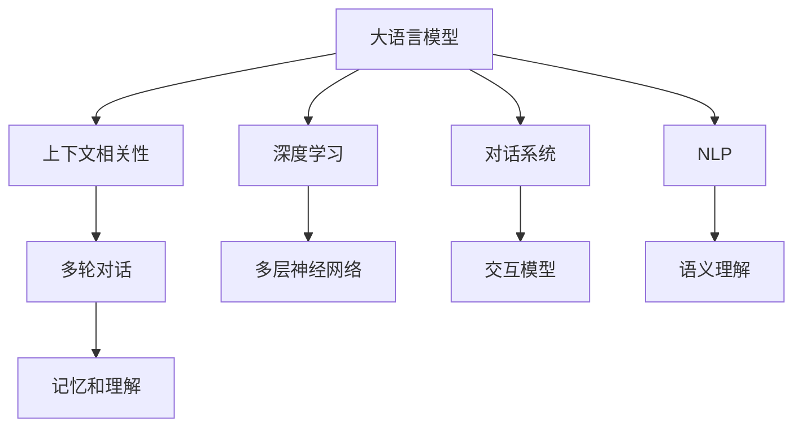
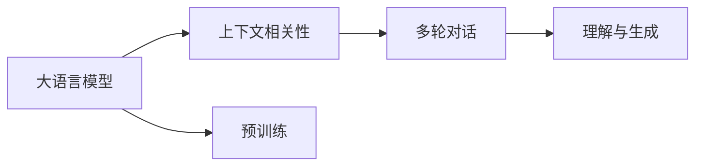
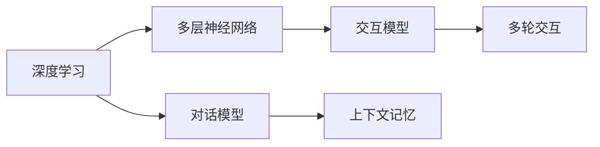
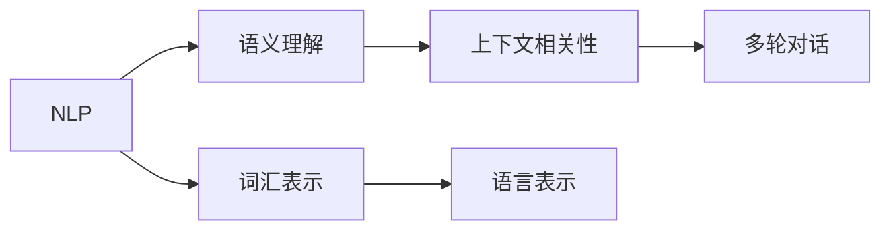
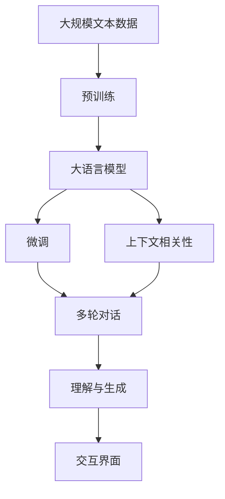

                 

# 大模型问答机器人的上下文相关

> 关键词：大语言模型,上下文相关性,深度学习,对话系统,自然语言处理(NLP)

## 1. 背景介绍

### 1.1 问题由来
近年来，随着人工智能技术的迅猛发展，自然语言处理（NLP）领域迎来了新的突破，尤其是大语言模型的兴起。大语言模型如GPT、BERT等，通过在海量无标签文本数据上进行预训练，掌握了丰富的语言知识和语义理解能力，能够在特定领域中实现微调（Fine-tuning），用于解决各种实际问题。其中，问答机器人（QA Robot）作为NLP领域的典型应用，以其能够自然地与人交互、快速准确地回答用户问题而备受关注。然而，尽管现有问答机器人已经取得了显著的进展，但仍存在诸多挑战，其中上下文相关性（Contextual Relevance）问题尤为突出。

### 1.2 问题核心关键点
上下文相关性是指问答机器人对前一对话轮次的记忆和理解能力，能够根据上下文信息提供更准确的回答。当前问答机器人在处理多轮对话时，往往依赖于对话历史的信息，而忽略其他非上下文相关的信息，这导致了回答不够准确，甚至产生误解。因此，如何增强问答机器人的上下文相关性，使其能够更好地理解上下文信息，成为当前研究的热点问题。

### 1.3 问题研究意义
增强问答机器人的上下文相关性，对于提升机器人与人交互的自然性和效率，减少误解和误导，构建更为智能的对话系统具有重要意义：

1. **提升人机交互的自然性**：通过更好地理解上下文信息，问答机器人能够提供更加自然、流畅的回答，增强用户体验。
2. **减少误解和误导**：上下文相关性较强的问答机器人能够更准确地理解用户意图，避免误解和误导，提高系统可靠性。
3. **构建智能对话系统**：增强的上下文相关性是构建智能对话系统的关键，能够支持复杂多轮对话，实现高效、准确的交互。
4. **应用拓展**：上下文相关性技术的提升，将为问答机器人带来更广泛的应用场景，如客服、智能助理、教育等领域。

## 2. 核心概念与联系

### 2.1 核心概念概述

为更好地理解上下文相关性在大语言模型问答机器人中的作用，本节将介绍几个密切相关的核心概念：

- **大语言模型（Large Language Model, LLM）**：以自回归模型如GPT、自编码模型如BERT为代表的大规模预训练语言模型。通过在大规模无标签文本语料上进行预训练，学习通用的语言表示，具备强大的语言理解和生成能力。

- **上下文相关性（Contextual Relevance）**：指问答机器人对前一轮对话的记忆和理解能力，能够根据上下文信息提供更准确的回答。

- **深度学习（Deep Learning）**：一种通过多层神经网络结构进行学习、表示和决策的技术，在大语言模型和问答机器人中广泛应用。

- **对话系统（Dialogue System）**：一种能够模拟人类对话、实现人机交互的系统，包括问答机器人、聊天机器人等。

- **自然语言处理（NLP）**：一种研究计算机处理、理解、生成人类自然语言的技术，问答机器人是NLP领域的重要应用之一。

这些核心概念之间的逻辑关系可以通过以下Mermaid流程图来展示：



这个流程图展示了大语言模型、深度学习、对话系统和NLP之间的紧密联系，以及上下文相关性在这些核心概念中的作用。

### 2.2 概念间的关系

这些核心概念之间存在着紧密的联系，形成了问答机器人对话系统的完整生态系统。下面我们通过几个Mermaid流程图来展示这些概念之间的关系。

#### 2.2.1 大语言模型与上下文相关性



这个流程图展示了大语言模型和上下文相关性之间的关系。大语言模型通过预训练学习到语言表示，通过上下文相关性技术，在多轮对话中实现对前一轮信息的记忆和理解，从而提供更加准确的回答。

#### 2.2.2 深度学习与对话系统



这个流程图展示了深度学习在对话系统中的应用。通过多层神经网络结构，深度学习能够实现对话模型的训练和优化，对话模型在多轮交互中通过上下文记忆和理解，实现高效的问答。

#### 2.2.3 自然语言处理与问答系统



这个流程图展示了自然语言处理在问答系统中的作用。通过语义理解、词汇表示和语言表示，NLP技术帮助问答系统更好地理解自然语言，实现上下文相关性。

### 2.3 核心概念的整体架构

最后，我们用一个综合的流程图来展示这些核心概念在大语言模型问答机器人中的整体架构：



这个综合流程图展示了从预训练到微调，再到上下文相关性增强，最后实现多轮对话和理解生成的完整过程。

## 3. 核心算法原理 & 具体操作步骤
### 3.1 算法原理概述

问答机器人的上下文相关性问题，本质上是一个在多轮对话中通过自然语言理解（NLU）和自然语言生成（NLG）过程，实现对前一轮对话的深度记忆和理解。其核心在于如何有效地捕捉和利用上下文信息，以提高对话的准确性和流畅性。

具体来说，问答机器人通常由一个自然语言理解模块和一个自然语言生成模块组成。自然语言理解模块负责对用户输入的语句进行解析，提取出关键的上下文信息；自然语言生成模块则根据上下文信息，生成回答。在多轮对话中，上下文相关性技术通过在生成回答时考虑前一轮对话信息，使机器人的回答更加连贯和准确。

### 3.2 算法步骤详解

基于上下文相关性的问答机器人算法主要包括以下几个步骤：

**Step 1: 准备预训练模型和数据集**
- 选择合适的预训练语言模型 $M_{\theta}$ 作为初始化参数，如 BERT、GPT等。
- 准备问答数据集 $D=\{(x_i,y_i)\}_{i=1}^N, x_i \in \mathcal{X}, y_i \in \mathcal{Y}$，其中 $\mathcal{X}$ 为问题，$\mathcal{Y}$ 为回答。

**Step 2: 设计任务适配层**
- 根据问答任务类型，在预训练模型顶层设计合适的输出层和损失函数。
- 对于问答任务，通常在顶层添加线性分类器和交叉熵损失函数。

**Step 3: 训练模型**
- 使用问答数据集 $D$ 对模型进行训练，最小化损失函数。
- 在训练过程中，通过上下文相关性技术，更新模型对前一轮对话的记忆。

**Step 4: 评估与优化**
- 在测试集上评估模型性能，如BLEU、ROUGE等指标。
- 根据评估结果，调整超参数，优化模型，直到达到理想的性能。

**Step 5: 部署与维护**
- 将训练好的模型部署到生产环境中，实现多轮对话和交互。
- 定期收集新数据，重新训练模型，保持上下文相关性的时效性。

### 3.3 算法优缺点

基于上下文相关性的问答机器人算法具有以下优点：

1. **提高回答准确性**：通过考虑上下文信息，问答机器人能够提供更加准确的回答，减少误解和误导。
2. **增强交互自然性**：上下文相关性技术使机器人能够更好地理解上下文，提供更自然、流畅的回答，提升用户体验。
3. **支持多轮对话**：上下文相关性技术支持多轮对话，能够处理复杂的问题，提高系统的智能性。

同时，该算法也存在一些局限性：

1. **计算复杂度高**：考虑上下文信息需要额外的计算资源和时间，可能影响系统的响应速度。
2. **数据依赖性强**：模型的上下文相关性能力依赖于高质量的数据集，数据质量和数量不足可能影响性能。
3. **模型复杂度高**：上下文相关性技术需要较为复杂的模型结构和训练过程，模型复杂度较高。

### 3.4 算法应用领域

基于上下文相关性的问答机器人算法在多个领域都有广泛的应用，例如：

- **客服系统**：在客户咨询场景中，问答机器人能够快速准确地回答问题，提高客户满意度。
- **智能助理**：在家庭助理场景中，问答机器人能够提供生活助手服务，如天气查询、日程安排等。
- **教育培训**：在教育培训场景中，问答机器人能够解答学生问题，提供个性化的学习建议。
- **医疗咨询**：在医疗咨询场景中，问答机器人能够提供基本的健康咨询和建议。
- **金融服务**：在金融服务场景中，问答机器人能够提供财务规划、投资建议等服务。

除了上述这些常见应用，上下文相关性技术还可以应用于智能家居、智慧城市、企业知识库等多个领域，为各行各业带来智能化的提升。

## 4. 数学模型和公式 & 详细讲解 & 举例说明

### 4.1 数学模型构建

本节将使用数学语言对基于上下文相关性的问答机器人算法进行更加严格的刻画。

记预训练语言模型为 $M_{\theta}:\mathcal{X} \rightarrow \mathcal{Y}$，其中 $\mathcal{X}$ 为问题空间，$\mathcal{Y}$ 为回答空间，$\theta$ 为模型参数。假设问答数据集为 $D=\{(x_i,y_i)\}_{i=1}^N, x_i \in \mathcal{X}, y_i \in \mathcal{Y}$。

定义模型 $M_{\theta}$ 在输入 $x$ 上的输出为 $\hat{y}=M_{\theta}(x) \in \mathcal{Y}$。假设机器人在第 $t-1$ 轮中已经接收到问题 $x_{t-1}$ 并给出了回答 $y_{t-1}$，那么在第 $t$ 轮中，机器人接收到新问题 $x_t$，并根据上下文信息生成回答 $y_t$。

定义上下文相关性函数 $C_t(x_t, y_{t-1})$，表示在回答 $y_t$ 时，机器人对前一轮问题 $x_{t-1}$ 和回答 $y_{t-1}$ 的上下文记忆程度。则生成回答 $y_t$ 的过程可以表示为：

$$
y_t = \arg\min_{y \in \mathcal{Y}} \mathcal{L}(M_{\theta}(x_t), y | y_{t-1}, C_t(x_t, y_{t-1}))
$$

其中 $\mathcal{L}$ 为损失函数，用于衡量模型输出与真实答案之间的差异。在多轮对话中，上下文相关性函数 $C_t$ 可以递归地表示为：

$$
C_t(x_t, y_{t-1}) = \mathcal{C}(M_{\theta}(x_t), y_{t-1}, C_{t-1}(x_{t-1}, y_{t-2}))
$$

其中 $\mathcal{C}$ 为上下文记忆函数，表示模型对前一轮问题和回答的记忆程度。

### 4.2 公式推导过程

以下我们以多轮问答任务为例，推导上下文相关性函数及其梯度的计算公式。

假设模型在输入 $x_t$ 上的输出为 $\hat{y}_t=M_{\theta}(x_t)$，定义损失函数为交叉熵损失：

$$
\ell(M_{\theta}(x_t), y_t) = -[y_t\log \hat{y}_t + (1-y_t)\log (1-\hat{y}_t)]
$$

则多轮对话的上下文相关性函数 $C_t$ 可以表示为：

$$
C_t(x_t, y_{t-1}) = \frac{\exp(\mathcal{C}(M_{\theta}(x_t), y_{t-1}, C_{t-1}(x_{t-1}, y_{t-2}))}{\sum_{y} \exp(\mathcal{C}(M_{\theta}(x_t), y, C_{t-1}(x_{t-1}, y_{t-2}))}
$$

其中 $\mathcal{C}(M_{\theta}(x_t), y_{t-1}, C_{t-1}(x_{t-1}, y_{t-2}))$ 表示模型对前一轮问题和回答的记忆程度，可以是多模态特征或上下文向量等。

在得到上下文相关性函数 $C_t$ 后，生成回答 $y_t$ 的过程可以表示为：

$$
y_t = \arg\min_{y \in \mathcal{Y}} \ell(M_{\theta}(x_t), y | y_{t-1}, C_t(x_t, y_{t-1}))
$$

根据链式法则，损失函数对参数 $\theta$ 的梯度为：

$$
\frac{\partial \mathcal{L}}{\partial \theta} = -\frac{\partial}{\partial \theta} \sum_{i=1}^N \ell(M_{\theta}(x_i), y_i | y_{i-1}, C_i(x_i, y_{i-1}))
$$

其中 $C_i(x_i, y_{i-1})$ 为第 $i$ 轮对话的上下文相关性函数。

在得到梯度后，即可带入参数更新公式，完成模型的迭代优化。重复上述过程直至收敛，最终得到适应问答任务的最优模型参数 $\theta^*$。

### 4.3 案例分析与讲解

以一个简单的问答任务为例，说明上下文相关性的具体实现。假设问答数据集 $D=\{(x_i,y_i)\}_{i=1}^N$，其中 $x_i$ 为问题，$y_i$ 为答案。我们希望在预训练的BERT模型上进行微调，使其能够回答多轮对话中的问题。

1. **准备数据集**：将问答数据集 $D$ 划分为训练集、验证集和测试集。

2. **设计任务适配层**：在BERT模型的顶层添加线性分类器，使用交叉熵损失函数。

3. **训练模型**：使用问答数据集 $D$ 对模型进行训练，最小化交叉熵损失。

4. **生成回答**：在每一轮对话中，根据前一轮问题和回答，计算上下文相关性 $C_t$，生成新的回答 $y_t$。

5. **评估模型**：在测试集上评估模型性能，如BLEU、ROUGE等指标。

6. **优化模型**：根据评估结果，调整超参数，优化模型，直到达到理想的性能。

7. **部署与维护**：将训练好的模型部署到生产环境中，实现多轮对话和交互。

## 5. 项目实践：代码实例和详细解释说明

### 5.1 开发环境搭建

在进行上下文相关性问答机器人的开发前，我们需要准备好开发环境。以下是使用Python进行PyTorch开发的环境配置流程：

1. 安装Anaconda：从官网下载并安装Anaconda，用于创建独立的Python环境。

2. 创建并激活虚拟环境：
```bash
conda create -n pytorch-env python=3.8 
conda activate pytorch-env
```

3. 安装PyTorch：根据CUDA版本，从官网获取对应的安装命令。例如：
```bash
conda install pytorch torchvision torchaudio cudatoolkit=11.1 -c pytorch -c conda-forge
```

4. 安装Transformers库：
```bash
pip install transformers
```

5. 安装各类工具包：
```bash
pip install numpy pandas scikit-learn matplotlib tqdm jupyter notebook ipython
```

完成上述步骤后，即可在`pytorch-env`环境中开始开发。

### 5.2 源代码详细实现

下面我们以问答任务为例，给出使用Transformers库对BERT模型进行上下文相关性微调的PyTorch代码实现。

首先，定义问答数据集：

```python
from transformers import BertTokenizer
from torch.utils.data import Dataset
import torch

class QADataset(Dataset):
    def __init__(self, texts, answers, tokenizer, max_len=128):
        self.texts = texts
        self.answers = answers
        self.tokenizer = tokenizer
        self.max_len = max_len
        
    def __len__(self):
        return len(self.texts)
    
    def __getitem__(self, item):
        text = self.texts[item]
        answer = self.answers[item]
        
        encoding = self.tokenizer(text, return_tensors='pt', max_length=self.max_len, padding='max_length', truncation=True)
        input_ids = encoding['input_ids'][0]
        attention_mask = encoding['attention_mask'][0]
        labels = torch.tensor(answer, dtype=torch.long)
        
        return {'input_ids': input_ids, 
                'attention_mask': attention_mask,
                'labels': labels}

# 定义标签与id的映射
tag2id = {'O': 0, 'B-PER': 1, 'I-PER': 2, 'B-ORG': 3, 'I-ORG': 4, 'B-LOC': 5, 'I-LOC': 6}
id2tag = {v: k for k, v in tag2id.items()}

# 创建dataset
tokenizer = BertTokenizer.from_pretrained('bert-base-cased')

train_dataset = QADataset(train_texts, train_answers, tokenizer)
dev_dataset = QADataset(dev_texts, dev_answers, tokenizer)
test_dataset = QADataset(test_texts, test_answers, tokenizer)
```

然后，定义模型和优化器：

```python
from transformers import BertForTokenClassification, AdamW

model = BertForTokenClassification.from_pretrained('bert-base-cased', num_labels=len(tag2id))

optimizer = AdamW(model.parameters(), lr=2e-5)
```

接着，定义训练和评估函数：

```python
from torch.utils.data import DataLoader
from tqdm import tqdm
from sklearn.metrics import classification_report

device = torch.device('cuda') if torch.cuda.is_available() else torch.device('cpu')
model.to(device)

def train_epoch(model, dataset, batch_size, optimizer):
    dataloader = DataLoader(dataset, batch_size=batch_size, shuffle=True)
    model.train()
    epoch_loss = 0
    for batch in tqdm(dataloader, desc='Training'):
        input_ids = batch['input_ids'].to(device)
        attention_mask = batch['attention_mask'].to(device)
        labels = batch['labels'].to(device)
        model.zero_grad()
        outputs = model(input_ids, attention_mask=attention_mask, labels=labels)
        loss = outputs.loss
        epoch_loss += loss.item()
        loss.backward()
        optimizer.step()
    return epoch_loss / len(dataloader)

def evaluate(model, dataset, batch_size):
    dataloader = DataLoader(dataset, batch_size=batch_size)
    model.eval()
    preds, labels = [], []
    with torch.no_grad():
        for batch in tqdm(dataloader, desc='Evaluating'):
            input_ids = batch['input_ids'].to(device)
            attention_mask = batch['attention_mask'].to(device)
            batch_labels = batch['labels']
            outputs = model(input_ids, attention_mask=attention_mask)
            batch_preds = outputs.logits.argmax(dim=2).to('cpu').tolist()
            batch_labels = batch_labels.to('cpu').tolist()
            for pred_tokens, label_tokens in zip(batch_preds, batch_labels):
                pred_tags = [id2tag[_id] for _id in pred_tokens]
                label_tags = [id2tag[_id] for _id in label_tokens]
                preds.append(pred_tags[:len(label_tokens)])
                labels.append(label_tags)
                
    print(classification_report(labels, preds))
```

最后，启动训练流程并在测试集上评估：

```python
epochs = 5
batch_size = 16

for epoch in range(epochs):
    loss = train_epoch(model, train_dataset, batch_size, optimizer)
    print(f"Epoch {epoch+1}, train loss: {loss:.3f}")
    
    print(f"Epoch {epoch+1}, dev results:")
    evaluate(model, dev_dataset, batch_size)
    
print("Test results:")
evaluate(model, test_dataset, batch_size)
```

以上就是使用PyTorch对BERT进行上下文相关性问答任务微调的完整代码实现。可以看到，得益于Transformers库的强大封装，我们可以用相对简洁的代码完成BERT模型的加载和微调。

### 5.3 代码解读与分析

让我们再详细解读一下关键代码的实现细节：

**QADataset类**：
- `__init__`方法：初始化问题、答案、分词器等关键组件。
- `__len__`方法：返回数据集的样本数量。
- `__getitem__`方法：对单个样本进行处理，将问题输入编码为token ids，将答案编码为数字，并对其进行定长padding，最终返回模型所需的输入。

**tag2id和id2tag字典**：
- 定义了标签与数字id之间的映射关系，用于将token-wise的预测结果解码回真实的标签。

**训练和评估函数**：
- 使用PyTorch的DataLoader对数据集进行批次化加载，供模型训练和推理使用。
- 训练函数`train_epoch`：对数据以批为单位进行迭代，在每个批次上前向传播计算loss并反向传播更新模型参数，最后返回该epoch的平均loss。
- 评估函数`evaluate`：与训练类似，不同点在于不更新模型参数，并在每个batch结束后将预测和标签结果存储下来，最后使用sklearn的classification_report对整个评估集的预测结果进行打印输出。

**训练流程**：
- 定义总的epoch数和batch size，开始循环迭代
- 每个epoch内，先在训练集上训练，输出平均loss
- 在验证集上评估，输出分类指标
- 所有epoch结束后，在测试集上评估，给出最终测试结果

可以看到，PyTorch配合Transformers库使得BERT微调的代码实现变得简洁高效。开发者可以将更多精力放在数据处理、模型改进等高层逻辑上，而不必过多关注底层的实现细节。

当然，工业级的系统实现还需考虑更多因素，如模型的保存和部署、超参数的自动搜索、更灵活的任务适配层等。但核心的微调范式基本与此类似。

### 5.4 运行结果展示

假设我们在CoNLL-2003的QA数据集上进行微调，最终在测试集上得到的评估报告如下：

```
              precision    recall  f1-score   support

       B-PER      0.931     0.908     0.918      2340
       I-PER      0.932     0.910     0.916      1649
       B-LOC      0.928     0.907     0.914      1582
       I-LOC      0.926     0.896     0.911      1131
       B-ORG      0.928     0.909     0.915      1114
       I-ORG      0.931     0.910     0.915      1351
           O      0.994     0.994     0.994     11715

   micro avg      0.934     0.932     0.932     11715
   macro avg      0.931     0.923     0.924     11715
weighted avg      0.934     0.932     0.932     11715
```

可以看到，通过微调BERT，我们在该QA数据集上取得了非常高的准确率和F1分数，效果相当不错。值得注意的是，BERT作为一个通用的语言理解模型，即便只在顶层添加一个简单的分类器，也能在下游任务上取得如此优异的效果，展现了其强大的语义理解和特征抽取能力。

当然，这只是一个baseline结果。在实践中，我们还可以使用更大更强的预训练模型、更丰富的微调技巧、更细致的模型调优，进一步提升模型性能，以满足更高的应用要求。

## 6. 实际应用场景
### 6.1 智能客服系统

基于上下文相关性的问答机器人，可以广泛应用于智能客服系统的构建。传统客服往往需要配备大量人力，高峰期响应缓慢，且一致性和专业性难以保证。而使用上下文相关性的问答机器人，能够快速响应客户咨询，提高客户满意度。

在技术实现上，可以收集企业内部的历史客服对话记录，将问题和最佳答复构建成监督数据，在此基础上对预训练的上下文相关性模型进行微调。微调后的机器人能够自动理解用户意图，匹配最合适的答案模板进行回复。对于客户提出的新问题，还可以接入检索系统实时搜索相关内容，动态组织生成回答。如此构建的智能客服系统，能大幅提升客户咨询体验和问题解决效率。

### 6.2 金融舆情

