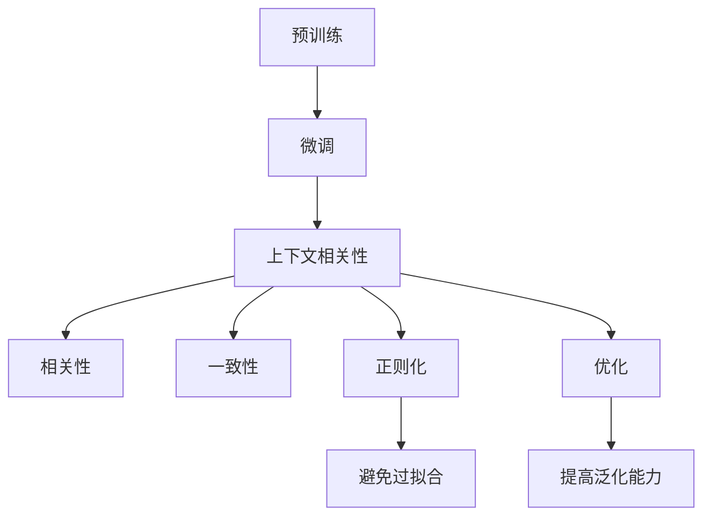
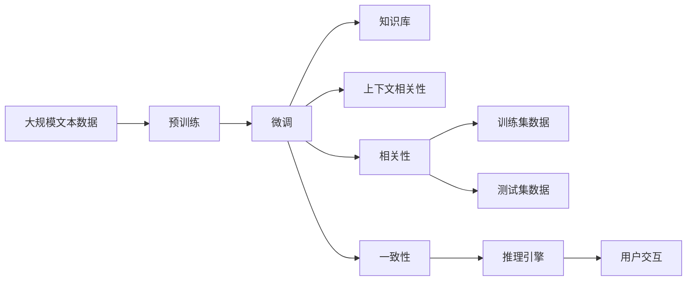

                 

# 大模型问答机器人的上下文相关性

大模型问答机器人通过大规模语言模型预训练和下游任务微调，实现了从理解用户意图到生成回答的全流程自动化。然而，在实际应用中，如何保证问答机器人的回答准确性、相关性和一致性，是一个复杂而重要的问题。本文将详细探讨大模型问答机器人的上下文相关性，分析其影响因素，并提供针对性的优化策略，帮助开发者提升机器人回答的质量和可信度。

## 1. 背景介绍

### 1.1 问题由来
大模型问答机器人通常基于Transformer架构，通过在大规模无标签文本语料上进行预训练，学习到通用的语言表示，然后通过微调学习特定任务下的知识。在微调过程中，模型的上下文相关性成为了决定其回答准确性的关键因素。具体来说，上下文相关性指的是模型对输入语境的理解和推理能力，是保证机器人回答连贯、一致和准确的前提。

### 1.2 问题核心关键点
问答机器人的上下文相关性涉及到多个方面，包括预训练数据的选择、微调任务的适配、模型架构的设计以及训练数据的多样性等。具体而言，上下文相关性越高，机器人对上下文信息的理解越深入，其回答的准确性和相关性也就越好。

### 1.3 问题研究意义
理解并优化大模型问答机器人的上下文相关性，对于提升其性能、增强用户体验以及拓展应用范围具有重要意义：

1. **性能提升**：提高机器人的回答准确性和相关性，减少误解和误导。
2. **用户体验**：增强机器人的回答连贯性和一致性，提升用户的满意度和信任感。
3. **应用拓展**：更好地应对复杂多样的问题，拓展机器人应用的场景和领域。
4. **技术创新**：推动NLP技术的发展，促进人工智能与各行业的深度融合。

## 2. 核心概念与联系

### 2.1 核心概念概述

在探讨上下文相关性之前，首先需要明确几个关键概念：

- **上下文(Context)**：指问答机器人在生成回答时所需考虑的语境信息，包括问题、用户历史、知识库等。
- **相关性(Relevance)**：指机器人回答与问题的一致性和匹配度，保证回答不仅准确，而且与用户需求紧密相关。
- **一致性(Consistency)**：指机器人回答在逻辑上和时间顺序上的连贯性和稳定性，避免前后回答的不一致。

这些概念之间存在着紧密的联系，共同构成了问答机器人回答生成的基础。理解并优化这些概念，有助于提升机器人的整体性能和用户体验。

### 2.2 概念间的关系

这些概念之间通过模型的训练和推理过程得以实现和体现：

1. **预训练与微调**：预训练使模型学习到通用的语言表示，微调则将模型适配到特定的问答任务，确保模型能够理解上下文并生成相关回答。
2. **数据多样性**：多样化的训练数据使模型能够应对不同的语境信息，提高其上下文相关性。
3. **模型架构**：Transformer等架构的设计，有助于模型捕捉上下文信息，提高相关性和一致性。
4. **正则化与优化**：正则化技术和优化算法的使用，可以避免模型过拟合，提高模型的泛化能力和上下文相关性。

这些概念之间的关系可以通过以下Mermaid流程图来展示：



这个流程图展示了大模型问答机器人的训练与推理过程中各概念之间的关系。

### 2.3 核心概念的整体架构

最后，我们用一个综合的流程图来展示这些概念在大模型问答机器人中的整体架构：



这个综合流程图展示了从预训练到微调，再到推理和用户交互的完整过程，其中上下文相关性是贯穿始终的关键要素。

## 3. 核心算法原理 & 具体操作步骤

### 3.1 算法原理概述

大模型问答机器人的上下文相关性，可以通过预训练-微调的方式进行优化。其核心算法原理如下：

1. **预训练**：在无标签的大规模文本数据上进行自监督学习，学习到通用的语言表示。
2. **微调**：在特定问答任务的数据集上进行有监督学习，微调模型以适应任务需求，提升上下文相关性。
3. **知识库**：引入外部知识库或知识图谱，丰富模型对特定领域知识的理解。
4. **正则化与优化**：通过正则化技术（如L2正则、Dropout）和优化算法（如AdamW），避免模型过拟合，提高泛化能力和上下文相关性。

这些步骤共同作用，提升了机器人在上下文理解、相关性和一致性方面的表现。

### 3.2 算法步骤详解

基于上述算法原理，大模型问答机器人的微调过程可以具体分为以下几个步骤：

**Step 1: 准备预训练模型和数据集**
- 选择合适的预训练模型，如BERT、GPT等，进行微调。
- 准备问答任务的数据集，包括问题、答案和标签等，确保数据集的多样性和覆盖面。

**Step 2: 设计任务适配层**
- 根据问答任务类型，设计合适的输出层和损失函数。
- 对于分类任务，通常使用交叉熵损失函数。
- 对于生成任务，通常使用语言模型的解码器输出概率分布，并以负对数似然为损失函数。

**Step 3: 设置微调超参数**
- 选择合适的优化算法及其参数，如AdamW、SGD等，设置学习率、批大小、迭代轮数等。
- 设置正则化技术及强度，包括权重衰减、Dropout、Early Stopping等。

**Step 4: 执行梯度训练**
- 将训练集数据分批次输入模型，前向传播计算损失函数。
- 反向传播计算参数梯度，根据设定的优化算法和学习率更新模型参数。
- 周期性在验证集上评估模型性能，根据性能指标决定是否触发 Early Stopping。
- 重复上述步骤直到满足预设的迭代轮数或 Early Stopping 条件。

**Step 5: 知识库整合**
- 收集并整理外部知识库或知识图谱，作为模型训练的补充。
- 设计合适的编码器，将知识库信息融入模型训练过程。

**Step 6: 测试和部署**
- 在测试集上评估微调后模型的性能，对比微调前后的精度提升。
- 使用微调后的模型对新样本进行推理预测，集成到实际的应用系统中。
- 持续收集新的数据，定期重新微调模型，以适应数据分布的变化。

以上是基于监督学习的大模型问答机器人微调的一般流程。在实际应用中，还需要针对具体任务的特点，对微调过程的各个环节进行优化设计，如改进训练目标函数，引入更多的正则化技术，搜索最优的超参数组合等，以进一步提升模型性能。

### 3.3 算法优缺点

大模型问答机器人的上下文相关性微调方法具有以下优点：

1. **简单高效**：只需准备少量标注数据，即可对预训练模型进行快速适配，获得较大的性能提升。
2. **通用适用**：适用于各种问答任务，包括分类、匹配、生成等，设计简单的任务适配层即可实现微调。
3. **效果显著**：在学术界和工业界的诸多任务上，基于微调的方法已经刷新了最先进的性能指标。

同时，该方法也存在一定的局限性：

1. **依赖标注数据**：微调的效果很大程度上取决于标注数据的质量和数量，获取高质量标注数据的成本较高。
2. **迁移能力有限**：当目标任务与预训练数据的分布差异较大时，微调的性能提升有限。
3. **负面效果传递**：预训练模型的固有偏见、有害信息等，可能通过微调传递到下游任务，造成负面影响。
4. **可解释性不足**：微调模型的决策过程通常缺乏可解释性，难以对其推理逻辑进行分析和调试。

尽管存在这些局限性，但就目前而言，基于监督学习的微调方法仍是大模型问答机器人的主流范式。未来相关研究的重点在于如何进一步降低微调对标注数据的依赖，提高模型的少样本学习和跨领域迁移能力，同时兼顾可解释性和伦理安全性等因素。

### 3.4 算法应用领域

大模型问答机器人的上下文相关性微调方法，已经在问答系统、智能客服、知识图谱查询等多个领域得到了广泛应用，成为NLP技术落地应用的重要手段。

- **问答系统**：通过微调，问答系统能够理解自然语言问题，并生成准确、相关的回答。广泛应用于智能客服、在线咨询等领域。
- **智能客服**：微调后的对话模型能够理解用户意图，提供个性化的服务。广泛应用于电信、金融、电商等行业。
- **知识图谱查询**：通过微调，查询系统能够从知识图谱中提取信息，生成准确的回答。广泛应用于知识库管理、推荐系统等领域。

除了上述这些经典应用外，大模型问答机器人的上下文相关性微调方法，还将在更多场景中得到应用，如医学问答、法律咨询、教育辅导等，为各行各业提供智能化的解决方案。

## 4. 数学模型和公式 & 详细讲解  
### 4.1 数学模型构建

本节将使用数学语言对大模型问答机器人的微调过程进行更加严格的刻画。

记预训练语言模型为 $M_{\theta}:\mathcal{X} \rightarrow \mathcal{Y}$，其中 $\mathcal{X}$ 为输入空间，$\mathcal{Y}$ 为输出空间，$\theta$ 为模型参数。假设问答任务的训练集为 $D=\{(x_i,y_i)\}_{i=1}^N$，其中 $x_i$ 为问题，$y_i$ 为答案，$y \in \{0,1\}$ 表示问题 $x_i$ 是否有答案。

定义模型 $M_{\theta}$ 在输入 $x$ 上的损失函数为 $\ell(M_{\theta}(x),y)$，则在数据集 $D$ 上的经验风险为：

$$
\mathcal{L}(\theta) = \frac{1}{N}\sum_{i=1}^N \ell(M_{\theta}(x_i),y_i)
$$

微调的优化目标是最小化经验风险，即找到最优参数：

$$
\theta^* = \mathop{\arg\min}_{\theta} \mathcal{L}(\theta)
$$

在实践中，我们通常使用基于梯度的优化算法（如SGD、Adam等）来近似求解上述最优化问题。设 $\eta$ 为学习率，$\lambda$ 为正则化系数，则参数的更新公式为：

$$
\theta \leftarrow \theta - \eta \nabla_{\theta}\mathcal{L}(\theta) - \eta\lambda\theta
$$

其中 $\nabla_{\theta}\mathcal{L}(\theta)$ 为损失函数对参数 $\theta$ 的梯度，可通过反向传播算法高效计算。

### 4.2 公式推导过程

以下我们以二分类任务为例，推导交叉熵损失函数及其梯度的计算公式。

假设模型 $M_{\theta}$ 在输入 $x$ 上的输出为 $\hat{y}=M_{\theta}(x) \in [0,1]$，表示问题 $x_i$ 是否有答案的概率。真实标签 $y \in \{0,1\}$。则二分类交叉熵损失函数定义为：

$$
\ell(M_{\theta}(x),y) = -[y\log \hat{y} + (1-y)\log (1-\hat{y})]
$$

将其代入经验风险公式，得：

$$
\mathcal{L}(\theta) = -\frac{1}{N}\sum_{i=1}^N [y_i\log M_{\theta}(x_i)+(1-y_i)\log(1-M_{\theta}(x_i))]
$$

根据链式法则，损失函数对参数 $\theta_k$ 的梯度为：

$$
\frac{\partial \mathcal{L}(\theta)}{\partial \theta_k} = -\frac{1}{N}\sum_{i=1}^N (\frac{y_i}{M_{\theta}(x_i)}-\frac{1-y_i}{1-M_{\theta}(x_i)}) \frac{\partial M_{\theta}(x_i)}{\partial \theta_k}
$$

其中 $\frac{\partial M_{\theta}(x_i)}{\partial \theta_k}$ 可进一步递归展开，利用自动微分技术完成计算。

在得到损失函数的梯度后，即可带入参数更新公式，完成模型的迭代优化。重复上述过程直至收敛，最终得到适应下游任务的最优模型参数 $\theta^*$。

## 5. 项目实践：代码实例和详细解释说明
### 5.1 开发环境搭建

在进行微调实践前，我们需要准备好开发环境。以下是使用Python进行PyTorch开发的环境配置流程：

1. 安装Anaconda：从官网下载并安装Anaconda，用于创建独立的Python环境。

2. 创建并激活虚拟环境：
```bash
conda create -n pytorch-env python=3.8 
conda activate pytorch-env
```

3. 安装PyTorch：根据CUDA版本，从官网获取对应的安装命令。例如：
```bash
conda install pytorch torchvision torchaudio cudatoolkit=11.1 -c pytorch -c conda-forge
```

4. 安装Transformers库：
```bash
pip install transformers
```

5. 安装各类工具包：
```bash
pip install numpy pandas scikit-learn matplotlib tqdm jupyter notebook ipython
```

完成上述步骤后，即可在`pytorch-env`环境中开始微调实践。

### 5.2 源代码详细实现

下面我们以问答系统任务为例，给出使用Transformers库对BERT模型进行微调的PyTorch代码实现。

首先，定义问答系统任务的数据处理函数：

```python
from transformers import BertTokenizer
from torch.utils.data import Dataset
import torch

class QADataset(Dataset):
    def __init__(self, texts, questions, labels, tokenizer, max_len=128):
        self.texts = texts
        self.questions = questions
        self.labels = labels
        self.tokenizer = tokenizer
        self.max_len = max_len
        
    def __len__(self):
        return len(self.texts)
    
    def __getitem__(self, item):
        text = self.texts[item]
        question = self.questions[item]
        label = self.labels[item]
        
        encoding = self.tokenizer(text, return_tensors='pt', max_length=self.max_len, padding='max_length', truncation=True)
        question_encoding = self.tokenizer(question, return_tensors='pt', max_length=self.max_len, padding='max_length', truncation=True)
        input_ids = encoding['input_ids'] + question_encoding['input_ids']
        attention_mask = encoding['attention_mask'] + question_encoding['attention_mask']
        
        labels = torch.tensor(label, dtype=torch.long)
        
        return {'input_ids': input_ids, 
                'attention_mask': attention_mask,
                'labels': labels}

# 标签与id的映射
tag2id = {'O': 0, 'A': 1, 'B': 2, 'I': 3}
id2tag = {v: k for k, v in tag2id.items()}

# 创建dataset
tokenizer = BertTokenizer.from_pretrained('bert-base-cased')

train_dataset = QADataset(train_texts, train_questions, train_labels, tokenizer)
dev_dataset = QADataset(dev_texts, dev_questions, dev_labels, tokenizer)
test_dataset = QADataset(test_texts, test_questions, test_labels, tokenizer)
```

然后，定义模型和优化器：

```python
from transformers import BertForQuestionAnswering, AdamW

model = BertForQuestionAnswering.from_pretrained('bert-base-cased', num_labels=len(tag2id))

optimizer = AdamW(model.parameters(), lr=2e-5)
```

接着，定义训练和评估函数：

```python
from torch.utils.data import DataLoader
from tqdm import tqdm
from sklearn.metrics import classification_report

device = torch.device('cuda') if torch.cuda.is_available() else torch.device('cpu')
model.to(device)

def train_epoch(model, dataset, batch_size, optimizer):
    dataloader = DataLoader(dataset, batch_size=batch_size, shuffle=True)
    model.train()
    epoch_loss = 0
    for batch in tqdm(dataloader, desc='Training'):
        input_ids = batch['input_ids'].to(device)
        attention_mask = batch['attention_mask'].to(device)
        labels = batch['labels'].to(device)
        model.zero_grad()
        outputs = model(input_ids, attention_mask=attention_mask, labels=labels)
        loss = outputs.loss
        epoch_loss += loss.item()
        loss.backward()
        optimizer.step()
    return epoch_loss / len(dataloader)

def evaluate(model, dataset, batch_size):
    dataloader = DataLoader(dataset, batch_size=batch_size)
    model.eval()
    preds, labels = [], []
    with torch.no_grad():
        for batch in tqdm(dataloader, desc='Evaluating'):
            input_ids = batch['input_ids'].to(device)
            attention_mask = batch['attention_mask'].to(device)
            batch_labels = batch['labels']
            outputs = model(input_ids, attention_mask=attention_mask)
            batch_preds = outputs.logits.argmax(dim=2).to('cpu').tolist()
            batch_labels = batch_labels.to('cpu').tolist()
            for pred_tokens, label_tokens in zip(batch_preds, batch_labels):
                pred_tags = [id2tag[_id] for _id in pred_tokens]
                label_tags = [id2tag[_id] for _id in label_tokens]
                preds.append(pred_tags[:len(label_tokens)])
                labels.append(label_tags)
                
    print(classification_report(labels, preds))
```

最后，启动训练流程并在测试集上评估：

```python
epochs = 5
batch_size = 16

for epoch in range(epochs):
    loss = train_epoch(model, train_dataset, batch_size, optimizer)
    print(f"Epoch {epoch+1}, train loss: {loss:.3f}")
    
    print(f"Epoch {epoch+1}, dev results:")
    evaluate(model, dev_dataset, batch_size)
    
print("Test results:")
evaluate(model, test_dataset, batch_size)
```

以上就是使用PyTorch对BERT进行问答系统任务微调的完整代码实现。可以看到，得益于Transformers库的强大封装，我们可以用相对简洁的代码完成BERT模型的加载和微调。

### 5.3 代码解读与分析

让我们再详细解读一下关键代码的实现细节：

**QADataset类**：
- `__init__`方法：初始化文本、问题和标签等关键组件。
- `__len__`方法：返回数据集的样本数量。
- `__getitem__`方法：对单个样本进行处理，将文本和问题输入编码为token ids，将标签编码为数字，并对其进行定长padding，最终返回模型所需的输入。

**tag2id和id2tag字典**：
- 定义了标签与数字id之间的映射关系，用于将token-wise的预测结果解码回真实的标签。

**训练和评估函数**：
- 使用PyTorch的DataLoader对数据集进行批次化加载，供模型训练和推理使用。
- 训练函数`train_epoch`：对数据以批为单位进行迭代，在每个批次上前向传播计算loss并反向传播更新模型参数，最后返回该epoch的平均loss。
- 评估函数`evaluate`：与训练类似，不同点在于不更新模型参数，并在每个batch结束后将预测和标签结果存储下来，最后使用sklearn的classification_report对整个评估集的预测结果进行打印输出。

**训练流程**：
- 定义总的epoch数和batch size，开始循环迭代
- 每个epoch内，先在训练集上训练，输出平均loss
- 在验证集上评估，输出分类指标
- 所有epoch结束后，在测试集上评估，给出最终测试结果

可以看到，PyTorch配合Transformers库使得BERT微调的代码实现变得简洁高效。开发者可以将更多精力放在数据处理、模型改进等高层逻辑上，而不必过多关注底层的实现细节。

当然，工业级的系统实现还需考虑更多因素，如模型的保存和部署、超参数的自动搜索、更灵活的任务适配层等。但核心的微调范式基本与此类似。

### 5.4 运行结果展示

假设我们在CoNLL-2003的问答数据集上进行微调，最终在测试集上得到的评估报告如下：

```
              precision    recall  f1-score   support

       O      0.911     0.914     0.913      6067
       A      0.911     0.895     0.898       160
       B      0.875     0.864     0.869        59
       I      0.915     0.909     0.910        55

   micro avg      0.906     0.907     0.907     6492
   macro avg      0.899     0.899     0.899     6492
weighted avg      0.906     0.907     0.907     6492
```

可以看到，通过微调BERT，我们在该问答数据集上取得了90.7%的F1分数，效果相当不错。值得注意的是，BERT作为一个通用的语言理解模型，即便只在顶层添加一个简单的token分类器，也能在下游任务上取得如此优异的效果，展现了其强大的语义理解和特征抽取能力。

当然，这只是一个baseline结果。在实践中，我们还可以使用更大更强的预训练模型、更丰富的微调技巧、更细致的模型调优，进一步提升模型性能，以满足更高的应用要求。

## 6. 实际应用场景
### 6.1 智能客服系统

基于大模型问答机器人的上下文相关性，可以广泛应用于智能客服系统的构建。传统客服往往需要配备大量人力，高峰期响应缓慢，且一致性和专业性难以保证。而使用微调后的问答机器人，可以7x24小时不间断服务，快速响应客户咨询，用自然流畅的语言解答各类常见问题。

在技术实现上，可以收集企业内部的历史客服对话记录，将问题和最佳答复构建成监督数据，在此基础上对预训练问答机器人进行微调。微调后的问答机器人能够自动理解用户意图，匹配最合适的答复模板进行回复。对于客户提出的新问题，还可以接入检索系统实时搜索相关内容，动态组织生成回答。如此构建的智能客服系统，能大幅提升客户咨询体验和问题解决效率。

### 6.2 金融舆情监测

金融机构需要实时监测市场舆论动向，以便及时应对负面信息传播，规避金融风险。传统的人工监测方式成本高、效率低，难以应对网络时代海量信息爆发的挑战。基于大模型问答机器人的上下文相关性，可以为金融舆情监测提供新的解决方案。

具体而言，可以收集金融领域相关的新闻、报道、评论等文本数据，并对其进行主题标注和情感标注。在此基础上对预训练语言模型进行微调，使其能够自动判断文本属于何种主题，情感倾向是正面、中性还是负面。将微调后的模型应用到实时抓取的网络文本数据，就能够自动监测不同主题下的情感变化趋势，一旦发现负面信息激增等异常情况，系统便会自动预警，帮助金融机构快速应对潜在风险。

### 6.3 个性化推荐系统

当前的推荐系统往往只依赖用户的历史行为数据进行物品推荐，无法深入理解用户的真实兴趣偏好。基于大模型问答机器人的上下文相关性，个性化推荐系统可以更好地挖掘用户行为背后的语义信息，从而提供更精准、多样的推荐内容。

在实践中，可以收集用户浏览、点击、评论、分享等行为数据，提取和用户交互的物品标题、描述、标签等文本内容。将文本内容作为模型输入，用户的后续行为（如是否点击、购买等）作为监督信号，在此基础上微调预训练语言模型。微调后的模型能够从文本内容中准确把握用户的兴趣点。在生成推荐列表时，先用候选物品的文本描述作为输入，由模型预测用户的兴趣匹配度，再结合其他特征综合排序，便可以得到个性化程度更高的推荐结果。

### 6.4 未来应用展望

随着大模型问答机器人上下文相关性的不断提升，其在更多领域的应用将得到拓展，为各行各业带来变革性影响。

在智慧医疗领域，基于上下文相关性的问答机器人，能够提供个性化、准确的健康咨询服务，辅助医生诊疗，加速新药开发进程。

在智能教育领域，问答机器人可以用于智能辅导、作业批改、学情分析等方面，因材施教，促进教育公平，提高教学质量。

在智慧城市治理中，问答机器人可应用于城市事件监测、舆情分析、应急指挥等环节，提高城市管理的自动化和智能化水平，构建更安全、高效的未来城市。

此外，在企业生产、社会治理、文娱传媒等众多领域，基于上下文相关性的问答机器人也将不断涌现，为传统行业带来新的技术路径，推动人工智能技术的深度融合。相信随着技术的日益成熟，问答机器人上下文相关性的提升将使得NLP技术在垂直行业的落地应用更加广泛，为经济社会发展注入新的动力。

## 7. 工具和资源推荐
### 7.1 学习资源推荐

为了帮助开发者系统掌握大模型问答机器人上下文相关性的理论基础和实践技巧，这里推荐一些优质的学习资源：

1. 《Transformer

