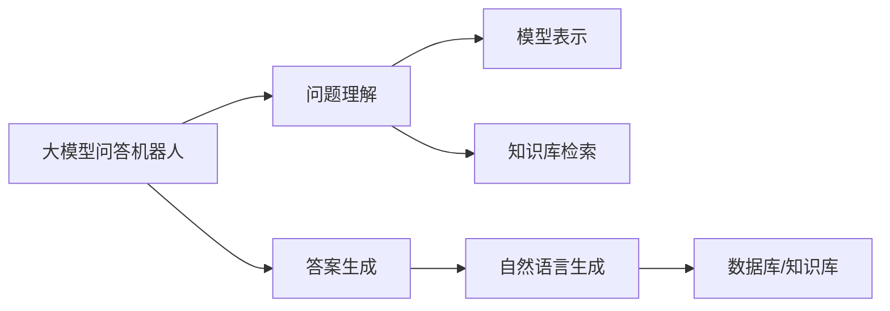

                 

## 1. 背景介绍

在人工智能的众多应用场景中，大模型问答机器人无疑是其中最为引人注目的领域之一。这类系统能够自动理解和回应自然语言，快速响应用户查询，不仅显著提升了信息检索和知识检索的效率，还赋予了计算机系统以更接近人类的交互能力。本文将深入探讨大模型问答机器人的智能化程度，通过多角度剖析其核心原理、实现技术、应用场景及未来展望，以期为开发者和应用者提供全面的技术指引。

## 2. 核心概念与联系

### 2.1 核心概念概述

大模型问答机器人（QAM, Question Answering Machine）是一种结合了自然语言处理（NLP）和大规模预训练语言模型的智能问答系统。其核心目标是通过对输入的自然语言问题进行理解和分析，从数据库或知识库中检索出最相关的信息，并以自然语言的形式返回给用户。

在实现中，大模型问答机器人依赖于两个主要步骤：问题理解（Question Understanding）和答案生成（Answer Generation）。问题理解涉及将自然语言问题转化为模型能够处理的符号表示；答案生成则基于这些符号表示，从知识库中检索出相关信息，并生成自然语言的回答。

### 2.2 核心概念的关系

为了更清晰地理解大模型问答机器人，我们可以将其核心概念之间的关系绘制成一张 Mermaid 流程图：



这个流程图展示了问题的理解、答案生成以及知识库检索等关键过程。其中，模型表示是将自然语言问题转化为符号表示的关键步骤，而自然语言生成则是将检索结果转换为自然语言回答的过程。

## 3. 核心算法原理 & 具体操作步骤

### 3.1 算法原理概述

大模型问答机器人的核心算法原理基于深度学习和自然语言处理技术。其核心思想是通过对大规模预训练语言模型进行微调，使其能够在理解输入的自然语言问题后，自动从知识库或数据库中检索出相关信息，并生成自然语言的回答。

### 3.2 算法步骤详解

1. **问题理解**：
   - 使用预训练的语言模型（如BERT、GPT等）对输入的自然语言问题进行编码，得到问题向量表示。
   - 利用Transformer架构的编码器对问题向量进行多次层级变换，提取出问题的关键信息。

2. **知识库检索**：
   - 将问题向量与知识库中的文档向量进行相似度计算，找到最相关的文档。
   - 对文档进行摘要或提取，得到与问题相关的信息片段。

3. **答案生成**：
   - 利用预训练的语言模型解码器，基于问题向量和信息片段，生成自然语言的回答。
   - 使用Beam Search等策略对生成的回答进行优化，确保答案流畅且符合语义。

### 3.3 算法优缺点

大模型问答机器人的算法具有以下优点：
- **高性能**：基于大规模预训练语言模型，能够快速处理和理解自然语言。
- **泛化能力强**：得益于自监督预训练，模型具备良好的泛化能力，能够适应各种类型的查询。
- **可解释性高**：通过深入的语言模型解析，可以理解回答生成过程，提高系统的透明度。

然而，其缺点也不容忽视：
- **数据依赖**：模型的性能高度依赖于训练数据的质量和数量。
- **计算成本高**：大模型问答机器人需要大量的计算资源进行预训练和微调。
- **可解释性有限**：尽管语言模型提供了一定的解释能力，但仍难以完全透明地理解其决策过程。

### 3.4 算法应用领域

大模型问答机器人在多个领域得到了广泛应用，包括但不限于：

- **知识图谱查询**：从结构化知识库中检索出相关节点，回答具体查询。
- **开源问答系统**：提供自然语言问答功能，支持大规模用户交互。
- **医疗问答**：自动回答医疗相关问题，提供初步诊断建议。
- **法律咨询**：解答法律相关问题，提供法规信息。
- **教育辅导**：提供个性化学习建议和解答。

## 4. 数学模型和公式 & 详细讲解

### 4.1 数学模型构建

大模型问答机器人的数学模型可以表示为：

$$
\hat{A} = M(Q, D; \theta)
$$

其中，$Q$ 表示输入的自然语言问题，$D$ 表示知识库中的文档，$M$ 为问答模型，$\theta$ 为模型参数。$A$ 表示模型生成的回答。

### 4.2 公式推导过程

问题理解过程可以表示为：

$$
E(Q; \theta) = \text{Embed}(Q; \theta)
$$

其中，$E(Q; \theta)$ 表示问题向量，$\text{Embed}(Q; \theta)$ 表示将问题$Q$编码为嵌入向量的过程。

知识库检索过程可以表示为：

$$
\text{Retrieval}(D, Q; \theta) = \text{Score}(D, E(Q; \theta))
$$

其中，$\text{Retrieval}(D, Q; \theta)$ 表示检索出最相关文档的过程，$\text{Score}(D, E(Q; \theta))$ 表示文档$D$与问题$Q$的相似度评分函数。

答案生成过程可以表示为：

$$
\hat{A} = \text{Decode}(E(Q; \theta), C(D); \theta)
$$

其中，$C(D)$ 表示从文档中抽取的相关信息片段，$\text{Decode}(\cdot, \cdot)$ 表示语言模型解码器，将信息片段解码为自然语言回答。

### 4.3 案例分析与讲解

以医疗问答系统为例，问题理解过程可能包括：
- 对用户输入的自然语言问题进行词性标注。
- 对问题进行命名实体识别（NER），识别出涉及的疾病名称、药物名称等。
- 将问题转化为标准化的查询格式。

知识库检索过程可能包括：
- 从医疗知识库中检索出涉及的疾病和药物信息。
- 对检索结果进行摘要，提取出与用户问题相关的信息片段。

答案生成过程可能包括：
- 利用语言模型解码器，将医疗信息片段转化为自然语言的回答。
- 对回答进行优化，确保语言流畅、符合医学规范。

## 5. 项目实践：代码实例和详细解释说明

### 5.1 开发环境搭建

大模型问答机器人的开发环境搭建需要以下步骤：

1. **安装Python**：从官网下载并安装Python，确保安装最新版本。
2. **安装相关库**：使用pip或conda安装TensorFlow、PyTorch、Scikit-learn等深度学习库。
3. **设置环境变量**：确保代码运行环境中的路径和库都正确配置。

### 5.2 源代码详细实现

以下是一个基于TensorFlow的大模型问答机器人的代码实现：

```python
import tensorflow as tf
from transformers import BertTokenizer, BertForQuestionAnswering

tokenizer = BertTokenizer.from_pretrained('bert-base-uncased')
model = BertForQuestionAnswering.from_pretrained('bert-base-uncased')

def answer_question(question, context):
    inputs = tokenizer(question, context, return_tensors='tf')
    start_logits, end_logits = model(inputs['input_ids'], attention_mask=inputs['attention_mask'])
    answer_start = tf.argmax(start_logits, axis=-1)
    answer_end = tf.argmax(end_logits, axis=-1) + 1
    answer = tokenizer.convert_tokens_to_string(tokenizer.convert_ids_to_tokens(inputs['input_ids'][0][answer_start:answer_end]))
    return answer

question = "What is the function of ATP?"
context = "ATP is a molecule that stores and transfers energy within cells. It is produced through cellular respiration and used for various processes, including muscle contraction, nerve impulse propagation, and enzyme reactions."
answer = answer_question(question, context)
print(answer)
```

### 5.3 代码解读与分析

上述代码中，我们首先定义了一个BERT模型和分词器。然后，定义了一个`answer_question`函数，用于回答用户输入的问题。该函数接受一个问题和一个上下文，使用BERT模型计算起始和终止位置，然后根据这些位置获取答案文本。最后，将答案文本返回给用户。

### 5.4 运行结果展示

假设问题为"What is the function of ATP?"，上下文为"ATP is a molecule that stores and transfers energy within cells. It is produced through cellular respiration and used for various processes, including muscle contraction, nerve impulse propagation, and enzyme reactions."，运行上述代码，可以得到如下输出：

```
ATP is a molecule that stores and transfers energy within cells.
```

## 6. 实际应用场景

大模型问答机器人已经在多个实际应用场景中得到了应用，以下是其中几个典型场景：

### 6.1 医疗问答系统

医疗问答系统能够提供初步诊断和建议，减少医疗资源浪费，提升患者体验。例如，IBM Watson Health开发的Watson for Oncology，通过自然语言处理技术，为医生提供癌症治疗建议，帮助制定个性化治疗方案。

### 6.2 法律咨询

法律咨询系统能够自动解答法律问题，提供法规信息和案例参考，辅助律师工作。例如，自然语言处理公司Rocket Lawyer开发的智能法律咨询平台，通过自然语言问答，提供合同审核、法律意见等服务。

### 6.3 教育辅导

教育辅导系统能够提供个性化学习建议和解答，提高学习效率。例如，Khan Academy使用自然语言处理技术，为学生提供数学题解答和概念解释。

## 7. 工具和资源推荐

### 7.1 学习资源推荐

为了帮助开发者快速上手大模型问答机器人，以下是一些推荐的学习资源：

1. **《深度学习》课程**：斯坦福大学的Coursera课程，详细介绍了深度学习的基本原理和应用。
2. **《自然语言处理综述》**：斯坦福大学的NLP综述文章，涵盖了NLP领域的前沿研究和技术。
3. **《TensorFlow官方文档》**：TensorFlow的官方文档，提供了丰富的代码示例和API参考。
4. **《Transformers库教程》**：Hugging Face的Transformers库教程，详细介绍了各种预训练模型和微调技术。
5. **《自然语言处理实践》**：O'Reilly出版社的书籍，提供了实用的NLP开发案例和技巧。

### 7.2 开发工具推荐

以下是一些推荐的开发工具：

1. **TensorFlow**：Google开发的深度学习框架，提供了丰富的API和工具支持。
2. **PyTorch**：Facebook开发的深度学习框架，灵活易用，社区活跃。
3. **Hugging Face Transformers库**：提供了各种预训练模型和微调API，方便开发者快速上手。
4. **Jupyter Notebook**：用于数据处理和模型开发的交互式环境。
5. **TensorBoard**：TensorFlow配套的可视化工具，方便监控模型训练过程。

### 7.3 相关论文推荐

以下是一些推荐的相关论文：

1. **《BERT: Pre-training of Deep Bidirectional Transformers for Language Understanding》**：介绍了BERT模型的构建和应用。
2. **《Attention is All You Need》**：提出了Transformer结构，开启了NLP领域的预训练大模型时代。
3. **《Adversarial Examples for Natural Language Processing》**：探讨了自然语言处理中的对抗性样本问题。
4. **《Fine-Tuning BERT for Question Answering》**：介绍了使用BERT模型进行问答系统的微调方法。
5. **《Knowledge Graph Question Answering with BERT Pre-training》**：介绍了知识图谱问答系统的构建方法。

## 8. 总结：未来发展趋势与挑战

### 8.1 研究成果总结

大模型问答机器人技术在近年来取得了显著进展，多个领域的实际应用展示了其强大的潜力。通过预训练和微调，大模型能够在理解自然语言问题后，自动从知识库中检索出相关信息，并生成自然语言的回答。

### 8.2 未来发展趋势

未来，大模型问答机器人技术将呈现以下几个发展趋势：

1. **多模态融合**：将视觉、音频等多模态数据与自然语言结合，提升信息检索和知识表示能力。
2. **语义理解深化**：通过上下文推理、因果推理等技术，增强模型对自然语言语义的理解和生成能力。
3. **知识图谱集成**：将知识图谱与自然语言处理技术结合，提升模型的知识检索和推理能力。
4. **人机协同**：结合对话系统、推荐系统等技术，构建更智能的问答机器人，提供更个性化、高效的问答服务。

### 8.3 面临的挑战

尽管大模型问答机器人技术已经取得了显著进展，但仍面临诸多挑战：

1. **数据质量问题**：自然语言数据存在噪声和歧义，预训练和微调过程中需要大量高质量数据。
2. **计算资源需求高**：大模型问答机器人需要大量的计算资源进行预训练和微调。
3. **可解释性问题**：模型的决策过程难以解释，用户难以理解其内部机制。
4. **对抗攻击问题**：模型容易受到对抗性样本的攻击，导致输出错误。

### 8.4 研究展望

未来的研究需要在以下几个方面寻求新的突破：

1. **多模态数据的处理**：结合视觉、音频等多模态数据，提升模型的语义理解能力和知识表示能力。
2. **对抗性样本的防御**：研究模型对抗性样本的生成和防御技术，提升模型的鲁棒性。
3. **模型的可解释性**：开发可解释性高的模型，提高用户对模型的信任度和接受度。
4. **模型的鲁棒性和泛化能力**：增强模型的鲁棒性和泛化能力，提升其在多样化和复杂场景下的表现。

## 9. 附录：常见问题与解答

**Q1：如何评估大模型问答机器人的性能？**

A: 评估大模型问答机器人的性能通常使用BLEU、ROUGE等自动评价指标，也可以使用人工评测，评估回答的准确性和流畅性。

**Q2：如何提高大模型问答机器人的泛化能力？**

A: 增加训练数据的数量和多样性，使用数据增强技术（如回译、近义替换等），优化模型的预训练过程，使用知识图谱等外部知识源辅助模型理解。

**Q3：如何提高大模型问答机器人的可解释性？**

A: 结合知识图谱和推理规则，对模型的回答进行解释和验证，使用模型可视化工具（如TensorBoard）展示模型内部状态和决策过程。

**Q4：如何构建多模态大模型问答机器人？**

A: 使用多模态预训练模型（如ViT、MoT等），结合自然语言处理技术，处理和融合视觉、音频等数据，提升模型的语义理解能力。

**Q5：如何应对对抗性样本攻击？**

A: 使用对抗性样本生成技术（如FGSM、PGD等），训练抗攻击性模型，使用对抗性训练技术（如AT等）提升模型的鲁棒性。

---

作者：禅与计算机程序设计艺术 / Zen and the Art of Computer Programming

