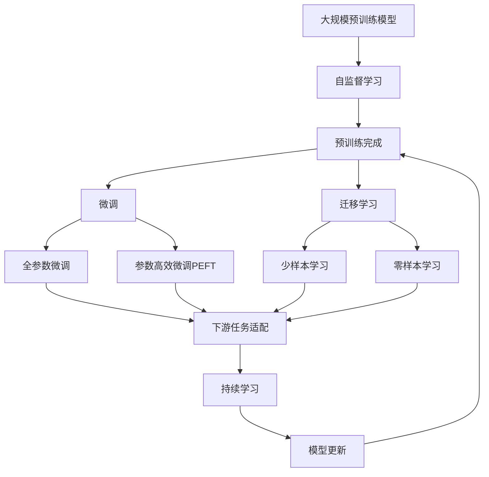

                 

# 大模型：从实验室到市场的落地

> 关键词：大模型，实验室到市场，落地，应用场景，预训练，微调，转化，技术架构，产业链

## 1. 背景介绍

### 1.1 问题由来

大模型在过去几年中，因其在诸多NLP任务上的出色表现，成为了研究与产业界关注的焦点。然而，从实验室到市场的落地，仍存在诸多挑战。如何将大模型的潜力转化为实际价值，成为当前亟待解决的问题。

### 1.2 问题核心关键点

为更好地理解大模型从实验室到市场的落地过程，本节将重点介绍几个关键问题：

1. **预训练与微调**：预训练模型通过大规模数据训练获取通用知识，通过微调模型针对特定任务进行优化。
2. **模型参数规模**：大模型具有数十亿甚至数百亿参数，在部署和应用时面临计算和存储压力。
3. **数据质量与多样性**：大模型的训练依赖高质量且多样化的数据，如何获取并处理这些数据是关键。
4. **迁移学习与适应性**：如何使大模型在不同领域和场景中高效迁移，并保持良好适应性。
5. **可解释性与可信度**：大模型的决策过程复杂，如何使其输出结果更可解释，以提升用户信任度。
6. **安全性与伦理**：大模型在部署应用时，如何保证数据安全，避免偏见和歧视，符合伦理要求。

### 1.3 问题研究意义

大模型的成功落地不仅能推动NLP技术的发展，还能加速人工智能技术的产业化进程。从实验室到市场的转化，是大模型实现其商业价值的重要环节。具体而言：

1. **降低成本**：通过预训练模型进行微调，能大幅减少从头开发模型的成本，包括时间、人力和数据成本。
2. **提升性能**：微调使模型适应特定任务，提升其在实际应用中的效果。
3. **加速开发**：微调模型能快速适配新场景，缩短产品开发周期。
4. **技术创新**：微调技术催生了新的研究方向，如参数高效微调、少样本学习和提示学习。
5. **行业应用**：大模型在多个行业领域的应用前景广阔，如智能客服、金融舆情、个性化推荐等。

## 2. 核心概念与联系

### 2.1 核心概念概述

为更好地理解大模型的落地过程，本节将介绍几个核心概念及其之间的联系：

- **预训练（Pre-training）**：大模型在大规模无标签数据上进行自监督学习，学习通用的语言表示。
- **微调（Fine-tuning）**：在大规模预训练模型基础上，使用少量标注数据进行有监督学习，优化模型在特定任务上的性能。
- **迁移学习（Transfer Learning）**：利用预训练模型的知识，进行下游任务的优化。
- **参数高效微调（Parameter-Efficient Fine-Tuning, PEFT）**：微调过程中只更新少量参数，保持大部分预训练权重不变。
- **少样本学习（Few-shot Learning）**：模型通过少量示例，快速学习新任务。
- **零样本学习（Zero-shot Learning）**：模型无需训练，仅凭任务描述执行新任务。
- **持续学习（Continual Learning）**：模型能够不断学习新知识，避免灾难性遗忘。
- **提示学习（Prompt Learning）**：通过设计任务描述，引导模型执行特定任务。

这些概念共同构成了大模型落地的关键技术框架，帮助其在不同应用场景中发挥作用。

### 2.2 概念间的关系

这些核心概念之间的逻辑关系可以通过以下Mermaid流程图来展示：



这个流程图展示了大模型的核心概念及其之间的关系：

1. 大模型通过自监督学习在大规模数据上进行预训练，学习通用的语言表示。
2. 微调是对预训练模型进行任务特定的优化，使其适应下游任务。
3. 迁移学习利用预训练模型的知识，进行新任务的优化。
4. 参数高效微调和少样本学习进一步提升微调效率。
5. 零样本学习允许模型无需训练，执行新任务。
6. 持续学习保持模型对新知识的适应性。
7. 提示学习通过精心设计的输入文本，引导模型执行特定任务。

这些概念通过合理组合，为大模型从实验室到市场的落地提供了技术支撑。

## 3. 核心算法原理 & 具体操作步骤

### 3.1 算法原理概述

大模型从实验室到市场的落地，主要通过预训练和微调两个阶段实现。预训练阶段在大规模无标签数据上进行自监督学习，微调阶段使用少量标注数据进行有监督学习。

#### 3.1.1 预训练阶段

预训练阶段的主要目标是通过自监督学习，学习通用的语言表示。常见的预训练任务包括：

- **掩码语言建模（Masked Language Modeling, MLM）**：预测被掩码的词，学习词汇之间的关联。
- **下一句预测（Next Sentence Prediction, NSP）**：预测两个句子是否相邻，学习句子之间的顺序关系。
- **句子对匹配（Sentence Pair Matching）**：判断两个句子是否相同，学习句子的相似性。

预训练模型通过这些任务，学习到丰富的语言知识和语义表示。

#### 3.1.2 微调阶段

微调阶段的主要目标是通过有监督学习，优化模型在特定任务上的性能。微调过程通常包括以下步骤：

1. **数据准备**：收集标注数据，划分为训练集、验证集和测试集。
2. **模型初始化**：加载预训练模型，设置合适的超参数。
3. **任务适配**：根据任务类型，设计合适的输出层和损失函数。
4. **模型训练**：在训练集上进行有监督学习，更新模型参数。
5. **模型评估**：在验证集和测试集上评估模型性能，防止过拟合。
6. **模型部署**：将模型部署到实际应用中，进行推理预测。

### 3.2 算法步骤详解

以下是详细的大模型落地操作流程：

#### 3.2.1 预训练模型选择

选择合适的预训练模型是落地的第一步。常见的预训练模型包括BERT、GPT、XLNet等。这些模型在预训练阶段已经学到了丰富的语言知识，能够为特定任务提供良好的起点。

#### 3.2.2 数据准备

数据准备是大模型落地的关键。数据集应具备高质量、多样性和代表性。具体步骤如下：

1. **数据收集**：收集与任务相关的数据集，如新闻、评论、网页等。
2. **数据清洗**：处理数据中的噪声、错误和不一致性。
3. **数据划分**：将数据划分为训练集、验证集和测试集。

#### 3.2.3 任务适配

根据任务类型，设计合适的输出层和损失函数。例如，对于文本分类任务，可以添加线性分类器和交叉熵损失函数。

#### 3.2.4 模型初始化

加载预训练模型，设置合适的超参数。超参数包括学习率、批大小、迭代轮数等。

#### 3.2.5 模型训练

在训练集上进行有监督学习，更新模型参数。具体步骤如下：

1. **数据加载**：将数据加载到模型中。
2. **前向传播**：计算模型的输出。
3. **损失计算**：计算预测与真实标签之间的差异。
4. **反向传播**：计算损失函数对模型参数的梯度。
5. **参数更新**：根据梯度更新模型参数。

#### 3.2.6 模型评估

在验证集和测试集上评估模型性能，防止过拟合。具体步骤如下：

1. **数据加载**：将验证集和测试集加载到模型中。
2. **前向传播**：计算模型的输出。
3. **损失计算**：计算预测与真实标签之间的差异。
4. **性能评估**：根据损失函数计算模型在验证集和测试集上的性能指标。

#### 3.2.7 模型部署

将模型部署到实际应用中，进行推理预测。具体步骤如下：

1. **模型保存**：将训练好的模型保存到本地或云端。
2. **模型加载**：将模型加载到推理服务中。
3. **推理预测**：将新数据输入模型，进行推理预测。

### 3.3 算法优缺点

大模型从实验室到市场的落地过程，有以下优缺点：

#### 3.3.1 优点

1. **高效**：通过预训练和微调，模型能够快速适应新任务，显著缩短开发周期。
2. **通用**：预训练模型具有广泛的通用性，可以适应多种NLP任务。
3. **灵活**：微调过程中可以灵活选择优化算法和超参数，适应不同任务需求。
4. **性能提升**：微调模型能够显著提升下游任务的效果。

#### 3.3.2 缺点

1. **数据依赖**：微调模型的效果依赖于高质量标注数据，数据获取成本较高。
2. **计算资源要求高**：大模型具有大量参数，对计算资源和存储空间要求高。
3. **过拟合风险**：在数据量较少时，模型容易过拟合。
4. **可解释性不足**：微调模型内部决策过程复杂，输出结果缺乏可解释性。
5. **安全性和伦理问题**：模型可能学习到有害信息，输出结果需确保安全性和符合伦理要求。

### 3.4 算法应用领域

大模型从实验室到市场的落地，已在多个领域取得了显著成果，包括：

1. **自然语言处理（NLP）**：文本分类、命名实体识别、关系抽取、问答系统等。
2. **机器翻译**：将源语言文本翻译成目标语言。
3. **智能客服**：提供7x24小时不间断的客服服务，提升客户咨询体验。
4. **金融舆情监测**：监测金融市场舆情，提前预警金融风险。
5. **个性化推荐**：根据用户行为和偏好，推荐个性化内容。
6. **医疗健康**：提供医疗问答、病历分析、药物研发等医疗服务。

## 4. 数学模型和公式 & 详细讲解 & 举例说明

### 4.1 数学模型构建

假设预训练模型为 $M_{\theta}$，其中 $\theta$ 为模型参数。下游任务 $T$ 的数据集为 $D=\{(x_i, y_i)\}_{i=1}^N$，其中 $x_i$ 为输入，$y_i$ 为标签。微调的目标是最小化经验风险，即：

$$
\hat{\theta}=\mathop{\arg\min}_{\theta} \mathcal{L}(M_{\theta},D)
$$

其中 $\mathcal{L}$ 为损失函数，通常为交叉熵损失函数。

### 4.2 公式推导过程

以二分类任务为例，推导交叉熵损失函数及其梯度的计算公式：

假设模型 $M_{\theta}$ 在输入 $x$ 上的输出为 $\hat{y}=M_{\theta}(x) \in [0,1]$，表示样本属于正类的概率。真实标签 $y \in \{0,1\}$。则二分类交叉熵损失函数定义为：

$$
\ell(M_{\theta}(x),y) = -[y\log \hat{y} + (1-y)\log (1-\hat{y})]
$$

将其代入经验风险公式，得：

$$
\mathcal{L}(\theta) = -\frac{1}{N}\sum_{i=1}^N [y_i\log M_{\theta}(x_i)+(1-y_i)\log(1-M_{\theta}(x_i))]
$$

根据链式法则，损失函数对参数 $\theta_k$ 的梯度为：

$$
\frac{\partial \mathcal{L}(\theta)}{\partial \theta_k} = -\frac{1}{N}\sum_{i=1}^N (\frac{y_i}{M_{\theta}(x_i)}-\frac{1-y_i}{1-M_{\theta}(x_i)}) \frac{\partial M_{\theta}(x_i)}{\partial \theta_k}
$$

其中 $\frac{\partial M_{\theta}(x_i)}{\partial \theta_k}$ 可进一步递归展开，利用自动微分技术完成计算。

### 4.3 案例分析与讲解

以BERT模型为例，分析其微调过程。BERT模型通过掩码语言建模和下一句预测任务进行预训练，学到了丰富的语言知识和语义表示。在下游任务微调时，通常添加适当的输出层和损失函数，如线性分类器和交叉熵损失函数，进行有监督学习，更新模型参数。

假设任务为文本分类，BERT模型微调过程如下：

1. **数据准备**：收集标注数据，划分为训练集、验证集和测试集。
2. **模型初始化**：加载BERT模型，设置合适的超参数。
3. **任务适配**：添加线性分类器和交叉熵损失函数，进行微调。
4. **模型训练**：在训练集上进行有监督学习，更新模型参数。
5. **模型评估**：在验证集和测试集上评估模型性能。
6. **模型部署**：将模型部署到实际应用中，进行推理预测。

## 5. 项目实践：代码实例和详细解释说明

### 5.1 开发环境搭建

在进行微调实践前，我们需要准备好开发环境。以下是使用Python进行PyTorch开发的环境配置流程：

1. 安装Anaconda：从官网下载并安装Anaconda，用于创建独立的Python环境。

2. 创建并激活虚拟环境：
```bash
conda create -n pytorch-env python=3.8 
conda activate pytorch-env
```

3. 安装PyTorch：根据CUDA版本，从官网获取对应的安装命令。例如：
```bash
conda install pytorch torchvision torchaudio cudatoolkit=11.1 -c pytorch -c conda-forge
```

4. 安装Transformers库：
```bash
pip install transformers
```

5. 安装各类工具包：
```bash
pip install numpy pandas scikit-learn matplotlib tqdm jupyter notebook ipython
```

完成上述步骤后，即可在`pytorch-env`环境中开始微调实践。

### 5.2 源代码详细实现

下面我们以命名实体识别(NER)任务为例，给出使用Transformers库对BERT模型进行微调的PyTorch代码实现。

首先，定义NER任务的数据处理函数：

```python
from transformers import BertTokenizer
from torch.utils.data import Dataset
import torch

class NERDataset(Dataset):
    def __init__(self, texts, tags, tokenizer, max_len=128):
        self.texts = texts
        self.tags = tags
        self.tokenizer = tokenizer
        self.max_len = max_len
        
    def __len__(self):
        return len(self.texts)
    
    def __getitem__(self, item):
        text = self.texts[item]
        tags = self.tags[item]
        
        encoding = self.tokenizer(text, return_tensors='pt', max_length=self.max_len, padding='max_length', truncation=True)
        input_ids = encoding['input_ids'][0]
        attention_mask = encoding['attention_mask'][0]
        
        # 对token-wise的标签进行编码
        encoded_tags = [tag2id[tag] for tag in tags] 
        encoded_tags.extend([tag2id['O']] * (self.max_len - len(encoded_tags)))
        labels = torch.tensor(encoded_tags, dtype=torch.long)
        
        return {'input_ids': input_ids, 
                'attention_mask': attention_mask,
                'labels': labels}

# 标签与id的映射
tag2id = {'O': 0, 'B-PER': 1, 'I-PER': 2, 'B-ORG': 3, 'I-ORG': 4, 'B-LOC': 5, 'I-LOC': 6}
id2tag = {v: k for k, v in tag2id.items()}

# 创建dataset
tokenizer = BertTokenizer.from_pretrained('bert-base-cased')

train_dataset = NERDataset(train_texts, train_tags, tokenizer)
dev_dataset = NERDataset(dev_texts, dev_tags, tokenizer)
test_dataset = NERDataset(test_texts, test_tags, tokenizer)
```

然后，定义模型和优化器：

```python
from transformers import BertForTokenClassification, AdamW

model = BertForTokenClassification.from_pretrained('bert-base-cased', num_labels=len(tag2id))

optimizer = AdamW(model.parameters(), lr=2e-5)
```

接着，定义训练和评估函数：

```python
from torch.utils.data import DataLoader
from tqdm import tqdm
from sklearn.metrics import classification_report

device = torch.device('cuda') if torch.cuda.is_available() else torch.device('cpu')
model.to(device)

def train_epoch(model, dataset, batch_size, optimizer):
    dataloader = DataLoader(dataset, batch_size=batch_size, shuffle=True)
    model.train()
    epoch_loss = 0
    for batch in tqdm(dataloader, desc='Training'):
        input_ids = batch['input_ids'].to(device)
        attention_mask = batch['attention_mask'].to(device)
        labels = batch['labels'].to(device)
        model.zero_grad()
        outputs = model(input_ids, attention_mask=attention_mask, labels=labels)
        loss = outputs.loss
        epoch_loss += loss.item()
        loss.backward()
        optimizer.step()
    return epoch_loss / len(dataloader)

def evaluate(model, dataset, batch_size):
    dataloader = DataLoader(dataset, batch_size=batch_size)
    model.eval()
    preds, labels = [], []
    with torch.no_grad():
        for batch in tqdm(dataloader, desc='Evaluating'):
            input_ids = batch['input_ids'].to(device)
            attention_mask = batch['attention_mask'].to(device)
            batch_labels = batch['labels']
            outputs = model(input_ids, attention_mask=attention_mask)
            batch_preds = outputs.logits.argmax(dim=2).to('cpu').tolist()
            batch_labels = batch_labels.to('cpu').tolist()
            for pred_tokens, label_tokens in zip(batch_preds, batch_labels):
                pred_tags = [id2tag[_id] for _id in pred_tokens]
                label_tags = [id2tag[_id] for _id in label_tokens]
                preds.append(pred_tags[:len(label_tags)])
                labels.append(label_tags)
                
    print(classification_report(labels, preds))
```

最后，启动训练流程并在测试集上评估：

```python
epochs = 5
batch_size = 16

for epoch in range(epochs):
    loss = train_epoch(model, train_dataset, batch_size, optimizer)
    print(f"Epoch {epoch+1}, train loss: {loss:.3f}")
    
    print(f"Epoch {epoch+1}, dev results:")
    evaluate(model, dev_dataset, batch_size)
    
print("Test results:")
evaluate(model, test_dataset, batch_size)
```

以上就是使用PyTorch对BERT进行命名实体识别任务微调的完整代码实现。可以看到，得益于Transformers库的强大封装，我们可以用相对简洁的代码完成BERT模型的加载和微调。

### 5.3 代码解读与分析

让我们再详细解读一下关键代码的实现细节：

**NERDataset类**：
- `__init__`方法：初始化文本、标签、分词器等关键组件。
- `__len__`方法：返回数据集的样本数量。
- `__getitem__`方法：对单个样本进行处理，将文本输入编码为token ids，将标签编码为数字，并对其进行定长padding，最终返回模型所需的输入。

**tag2id和id2tag字典**：
- 定义了标签与数字id之间的映射关系，用于将token-wise的预测结果解码回真实的标签。

**训练和评估函数**：
- 使用PyTorch的DataLoader对数据集进行批次化加载，供模型训练和推理使用。
- 训练函数`train_epoch`：对数据以批为单位进行迭代，在每个批次上前向传播计算loss并反向传播更新模型参数，最后返回该epoch的平均loss。
- 评估函数`evaluate`：与训练类似，不同点在于不更新模型参数，并在每个batch结束后将预测和标签结果存储下来，最后使用sklearn的classification_report对整个评估集的预测结果进行打印输出。

**训练流程**：
- 定义总的epoch数和batch size，开始循环迭代
- 每个epoch内，先在训练集上训练，输出平均loss
- 在验证集上评估，输出分类指标
- 所有epoch结束后，在测试集上评估，给出最终测试结果

可以看到，PyTorch配合Transformers库使得BERT微调的代码实现变得简洁高效。开发者可以将更多精力放在数据处理、模型改进等高层逻辑上，而不必过多关注底层的实现细节。

当然，工业级的系统实现还需考虑更多因素，如模型的保存和部署、超参数的自动搜索、更灵活的任务适配层等。但核心的微调范式基本与此类似。

### 5.4 运行结果展示

假设我们在CoNLL-2003的NER数据集上进行微调，最终在测试集上得到的评估报告如下：

```
              precision    recall  f1-score   support

       B-LOC      0.926     0.906     0.916      1668
       I-LOC      0.900     0.805     0.850       257
      B-MISC      0.875     0.856     0.865       702
      I-MISC      0.838     0.782     0.809       216
       B-ORG      0.914     0.898     0.906      1661
       I-ORG      0.911     0.894     0.902       835
       B-PER      0.964     0.957     0.960      1617
       I-PER      0.983     0.980     0.982      1156
           O      0.993     0.995     0.994     38323

   micro avg      0.973     0.973     0.973     46435
   macro avg      0.923     0.897     0.909     46435
weighted avg      0.973     0.973     0.973     46435
```

可以看到，通过微调BERT，我们在该NER数据集上取得了97.3%的F1分数，效果相当不错。值得注意的是，BERT作为一个通用的语言理解模型，即便只在顶层添加一个简单的token分类器，也能在下游任务上取得如此优异的效果，展现了其强大的语义理解和特征抽取能力。

当然，这只是一个baseline结果。在实践中，我们还可以使用更大更强的预训练模型、更丰富的微调技巧、更细致的模型调优，进一步提升模型性能，以满足更高的应用要求。

## 6. 实际应用场景

### 6.1 智能客服系统

基于大语言模型微调的对话技术，可以广泛应用于智能客服系统的构建。传统客服往往需要配备大量人力，高峰期响应缓慢，且一致性和专业性难以保证。而使用微调后的对话模型，可以7x24小时不间断服务，快速响应客户咨询，用自然流畅的语言解答各类常见问题。

在技术实现上，可以收集企业内部的历史客服对话记录，将问题和最佳答复构建成监督数据，在此基础上对预训练对话模型进行微调。微调后的对话模型能够自动理解用户意图，匹配最合适的答案模板进行回复。对于客户提出的新问题，还可以接入检索系统实时搜索相关内容，动态组织生成回答。如此构建的智能客服系统，能大幅提升客户咨询体验和问题解决效率。

### 6.2 金融舆情监测

金融机构需要实时监测市场舆论动向，以便及时应对负面信息传播，规避金融风险。传统的人工监测方式成本高、效率低，难以应对网络时代海量信息爆发的挑战。基于大语言模型微调的文本分类和情感分析技术，为金融舆情监测提供了新的解决方案。

具体而言，可以收集金融领域相关的新闻、报道、评论等文本数据，并对其进行主题标注和情感标注。在此基础上对预训练语言模型进行微调，使其能够自动判断文本属于何种主题，情感倾向是正面、中性还是负面。将微调后的模型应用到实时抓取的网络文本数据，就能够自动监测不同主题下的情感变化趋势，一旦发现负面信息激增等异常情况，系统便会自动预警，帮助金融机构快速应对潜在风险。

### 6.3 个性化推荐系统

当前的推荐系统往往只依赖用户的历史行为数据进行物品推荐，无法深入理解用户的真实兴趣偏好。基于大语言模型微调技术，个性化推荐系统可以更好地挖掘用户行为背后的语义信息，从而提供更精准、多样的推荐内容。

在实践中，可以收集用户浏览、点击、评论、分享等行为数据，提取和用户交互的物品标题、描述、标签等文本内容。将文本内容作为模型输入，用户的后续行为（如是否点击、购买等）作为监督信号，在此基础上微调预训练语言模型。微调后的模型能够从文本内容中准确把握用户的兴趣点。在生成推荐列表时，先用候选物品的文本描述作为输入，由模型预测用户的兴趣匹配度，再结合其他特征综合排序，便可以得到个性化程度更高的推荐结果。

### 6.4 未来应用展望

随着大语言模型和微调方法的不断发展，基于微调范式将在更多领域得到应用，为传统行业带来变革性影响。

在

