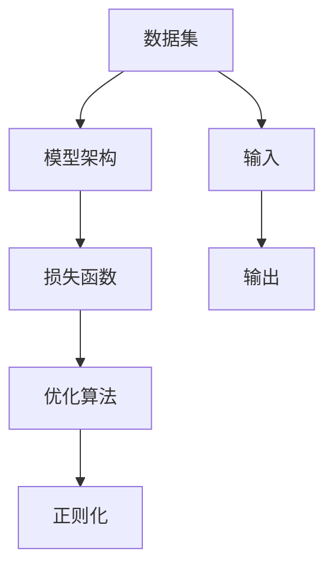
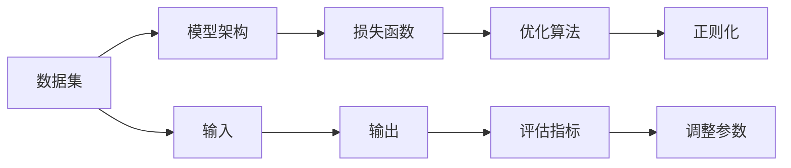

                 

## 1. 背景介绍

随着大数据时代的到来，人工智能（AI）正逐步深入各行各业，改变着人们的生活方式。其中，大模型（Large Models）成为了AI领域的热点话题。大模型通过在大规模数据上进行训练，获取了强大的数据处理和分析能力。在数据与算法的完美结合下，大模型已经在自然语言处理（NLP）、计算机视觉（CV）、语音识别等多个领域取得了突破性进展。

本文将从大模型的定义、应用背景、核心概念、算法原理等多个方面进行深入探讨，帮助读者全面理解大模型技术，并掌握其在实际项目中的应用。

## 2. 核心概念与联系

### 2.1 核心概念概述

大模型（Large Models）通常指那些具有大量参数（通常在100万个以上）、用于处理大规模数据、并能够学习到复杂知识表示的深度神经网络。大模型的训练过程通常需要巨大的计算资源，并且往往在大型企业数据中心或云平台进行。

大模型的核心概念包括：

- **数据集**：大模型的训练和优化依赖于大规模的数据集，数据集的多样性和丰富度直接影响模型的性能。
- **模型架构**：包括神经网络的层数、节点数、激活函数等，这些参数决定了模型的复杂度和表达能力。
- **损失函数**：用于衡量模型预测结果与真实结果之间的差异，是大模型训练的核心部分。
- **优化算法**：如随机梯度下降（SGD）、Adam等，用于更新模型参数，使模型逐渐接近最优解。
- **正则化**：如L2正则、Dropout等，用于防止过拟合，提高模型的泛化能力。

### 2.2 核心概念间的关系

大模型的训练是一个数据驱动、算法优化、模型评估的迭代过程。这些核心概念通过一系列数学和计算过程，共同作用于模型的训练和优化。数据集提供了模型的输入和输出，模型架构决定了模型能够处理数据的形式和深度，损失函数和优化算法用于不断调整模型参数，以最小化预测误差，正则化则用于防止模型在训练集上过拟合。

以下是一个简单的 Mermaid 流程图，展示了数据、模型、损失函数、优化算法和正则化之间的关系：



这个流程图展示了数据如何通过模型架构、损失函数、优化算法和正则化进行处理和优化，最终输出预测结果。

### 2.3 核心概念的整体架构

数据与算法的完美结合是大模型训练的核心。在训练过程中，数据集不断地提供新的样本，模型架构通过不断调整参数，使得损失函数逐渐减小。优化算法通过更新参数，使得损失函数达到最小值。正则化则通过限制模型复杂度，防止过拟合。这些概念共同构成了大模型的训练流程，如图：



## 3. 核心算法原理 & 具体操作步骤

### 3.1 算法原理概述

大模型的训练过程通常采用反向传播算法（Backpropagation）和梯度下降算法（Gradient Descent）。反向传播算法用于计算损失函数对模型参数的梯度，而梯度下降算法则用于根据梯度调整模型参数，使得损失函数最小化。

大模型训练的算法流程一般包括：

1. **数据准备**：收集大规模的数据集，并进行预处理和归一化。
2. **模型初始化**：随机初始化模型的参数。
3. **前向传播**：将输入数据通过模型，计算输出结果。
4. **计算损失**：计算模型输出与真实标签之间的损失函数。
5. **反向传播**：根据损失函数对模型参数进行梯度计算。
6. **参数更新**：使用优化算法根据梯度更新模型参数。
7. **评估性能**：在验证集或测试集上评估模型的性能。
8. **调整超参数**：根据评估结果调整模型和算法的超参数。

### 3.2 算法步骤详解

以一个典型的图像分类任务为例，详细说明大模型的训练流程：

1. **数据准备**：收集包含类别标签的图像数据集，并进行预处理和归一化。
2. **模型初始化**：随机初始化一个卷积神经网络（CNN）模型，包含多个卷积层、池化层和全连接层。
3. **前向传播**：将图像数据输入模型，通过卷积层和池化层提取特征，最后通过全连接层进行分类。
4. **计算损失**：计算模型预测结果与真实标签之间的交叉熵损失。
5. **反向传播**：计算损失函数对每个参数的梯度，并沿着梯度下降方向更新参数。
6. **参数更新**：使用Adam优化算法，根据梯度更新模型的参数。
7. **评估性能**：在验证集上评估模型的准确率、召回率等性能指标。
8. **调整超参数**：根据验证集上的表现，调整学习率、批次大小、正则化强度等超参数。

### 3.3 算法优缺点

大模型的训练具有以下优点：

- **模型能力强大**：大模型具有强大的特征提取和表示能力，能够处理复杂的数据结构。
- **泛化能力强**：在大规模数据上训练的大模型具有较强的泛化能力，能够适应各种数据分布。
- **可扩展性强**：可以通过增加计算资源，进一步提高模型的复杂度和能力。

然而，大模型的训练也存在以下缺点：

- **计算资源需求高**：训练大模型需要巨大的计算资源，包括GPU、TPU等高性能设备。
- **过拟合风险高**：在大规模数据上训练的大模型容易过拟合，需要正则化和早停机制进行控制。
- **模型复杂度高**：大模型的参数量通常以亿计，模型结构复杂，难以解释和调试。
- **数据依赖性强**：大模型的训练依赖于高质量的数据集，数据的质量和多样性直接影响模型的性能。

### 3.4 算法应用领域

大模型在多个领域得到了广泛应用，包括但不限于：

- **自然语言处理（NLP）**：如BERT、GPT等，用于文本分类、情感分析、机器翻译等任务。
- **计算机视觉（CV）**：如ResNet、Inception等，用于图像分类、目标检测、图像分割等任务。
- **语音识别**：如WaveNet、Tacotron等，用于语音识别、文本转语音等任务。
- **推荐系统**：如DeepFM、Wide & Deep等，用于个性化推荐、广告点击率预测等任务。
- **自动驾驶**：如ResNet、FCN等，用于图像识别、路径规划等任务。

## 4. 数学模型和公式 & 详细讲解

### 4.1 数学模型构建

大模型的训练通常采用最小化损失函数的方法。假设模型为 $f(x; \theta)$，其中 $x$ 为输入，$\theta$ 为模型参数，$y$ 为真实标签。损失函数 $L$ 用于衡量模型预测结果与真实标签之间的差异，通常采用交叉熵损失函数：

$$L(y, f(x; \theta)) = -\sum_{i=1}^{n} y_i \log f_i(x; \theta)$$

其中，$n$ 为样本数量，$y_i$ 为第 $i$ 个样本的真实标签，$f_i(x; \theta)$ 为模型的预测结果。

### 4.2 公式推导过程

以图像分类任务为例，说明最小化损失函数的推导过程：

假设模型为 $f(x; \theta) = \sigma(Wx + b)$，其中 $\sigma$ 为激活函数，$W$ 和 $b$ 为模型参数。

图像分类任务的损失函数为交叉熵损失：

$$L(y, f(x; \theta)) = -\frac{1}{N} \sum_{i=1}^{N} y_i \log f(x_i; \theta)$$

其中，$N$ 为样本数量，$y_i$ 为第 $i$ 个样本的真实标签，$f(x_i; \theta)$ 为模型的预测结果。

根据梯度下降算法，模型参数 $\theta$ 的更新公式为：

$$\theta = \theta - \eta \frac{\partial L}{\partial \theta}$$

其中，$\eta$ 为学习率。

### 4.3 案例分析与讲解

以BERT为例，说明大模型的训练过程。

BERT（Bidirectional Encoder Representations from Transformers）是一种基于 Transformer 架构的大语言模型，用于自然语言处理任务。BERT 的训练过程包括预训练和微调两个阶段。

在预训练阶段，BERT 在大规模无标注文本数据上进行自监督学习，学习语言表示。在微调阶段，将预训练后的模型用于下游任务，如情感分析、文本分类等。

## 5. 项目实践：代码实例和详细解释说明

### 5.1 开发环境搭建

要进行大模型的训练，首先需要搭建好开发环境。以下是使用 PyTorch 搭建大模型训练环境的流程：

1. **安装 Python**：使用 Anconda 或 Anaconda 安装 Python。
2. **安装 PyTorch**：使用 pip 安装 PyTorch。
3. **安装相关库**：安装 Numpy、Pandas、Scikit-learn 等机器学习库。
4. **配置 GPU**：设置 CUDA 环境变量，使用 CUDA 版本的 PyTorch。

### 5.2 源代码详细实现

以下是一个简单的图像分类任务的代码实现，说明如何使用 PyTorch 进行大模型的训练：

```python
import torch
import torch.nn as nn
import torch.optim as optim
import torchvision.transforms as transforms
import torchvision.datasets as datasets

# 定义模型
class Net(nn.Module):
    def __init__(self):
        super(Net, self).__init__()
        self.conv1 = nn.Conv2d(3, 6, 5)
        self.pool = nn.MaxPool2d(2, 2)
        self.conv2 = nn.Conv2d(6, 16, 5)
        self.fc1 = nn.Linear(16 * 5 * 5, 120)
        self.fc2 = nn.Linear(120, 84)
        self.fc3 = nn.Linear(84, 10)

    def forward(self, x):
        x = self.pool(F.relu(self.conv1(x)))
        x = self.pool(F.relu(self.conv2(x)))
        x = x.view(-1, 16 * 5 * 5)
        x = F.relu(self.fc1(x))
        x = F.relu(self.fc2(x))
        x = self.fc3(x)
        return x

# 定义数据加载器
train_dataset = datasets.CIFAR10(root='./data', train=True, transform=transforms.ToTensor(), download=True)
test_dataset = datasets.CIFAR10(root='./data', train=False, transform=transforms.ToTensor())

train_loader = torch.utils.data.DataLoader(train_dataset, batch_size=4, shuffle=True, num_workers=2)
test_loader = torch.utils.data.DataLoader(test_dataset, batch_size=4, shuffle=False, num_workers=2)

# 定义模型、优化器和损失函数
net = Net()
criterion = nn.CrossEntropyLoss()
optimizer = optim.SGD(net.parameters(), lr=0.001, momentum=0.9)

# 训练模型
for epoch in range(10):
    running_loss = 0.0
    for i, data in enumerate(train_loader, 0):
        inputs, labels = data
        optimizer.zero_grad()
        outputs = net(inputs)
        loss = criterion(outputs, labels)
        loss.backward()
        optimizer.step()

        running_loss += loss.item()
        if i % 2000 == 1999:
            print('[%d, %5d] loss: %.3f' % (epoch + 1, i + 1, running_loss / 2000))
            running_loss = 0.0

# 测试模型
correct = 0
total = 0
with torch.no_grad():
    for data in test_loader:
        images, labels = data
        outputs = net(images)
        _, predicted = torch.max(outputs.data, 1)
        total += labels.size(0)
        correct += (predicted == labels).sum().item()

print('Accuracy of the network on the 10000 test images: %d %%' % (100 * correct / total))
```

### 5.3 代码解读与分析

这个代码实现了使用 PyTorch 训练一个简单的卷积神经网络（CNN）模型，用于图像分类任务。

**定义模型**：
```python
class Net(nn.Module):
    def __init__(self):
        super(Net, self).__init__()
        self.conv1 = nn.Conv2d(3, 6, 5)
        self.pool = nn.MaxPool2d(2, 2)
        self.conv2 = nn.Conv2d(6, 16, 5)
        self.fc1 = nn.Linear(16 * 5 * 5, 120)
        self.fc2 = nn.Linear(120, 84)
        self.fc3 = nn.Linear(84, 10)
```

定义了一个包含两个卷积层和三个全连接层的 CNN 模型。

**定义数据加载器**：
```python
train_dataset = datasets.CIFAR10(root='./data', train=True, transform=transforms.ToTensor(), download=True)
test_dataset = datasets.CIFAR10(root='./data', train=False, transform=transforms.ToTensor())

train_loader = torch.utils.data.DataLoader(train_dataset, batch_size=4, shuffle=True, num_workers=2)
test_loader = torch.utils.data.DataLoader(test_dataset, batch_size=4, shuffle=False, num_workers=2)
```

使用 PyTorch 的 `datasets` 模块加载 CIFAR-10 数据集，并使用 `DataLoader` 模块进行数据批处理和加载。

**定义模型、优化器和损失函数**：
```python
net = Net()
criterion = nn.CrossEntropyLoss()
optimizer = optim.SGD(net.parameters(), lr=0.001, momentum=0.9)
```

定义了一个 Net 类实例，并使用 CrossEntropyLoss 作为损失函数，使用 SGD 优化器进行模型训练。

**训练模型**：
```python
for epoch in range(10):
    running_loss = 0.0
    for i, data in enumerate(train_loader, 0):
        inputs, labels = data
        optimizer.zero_grad()
        outputs = net(inputs)
        loss = criterion(outputs, labels)
        loss.backward()
        optimizer.step()

        running_loss += loss.item()
        if i % 2000 == 1999:
            print('[%d, %5d] loss: %.3f' % (epoch + 1, i + 1, running_loss / 2000))
            running_loss = 0.0
```

使用 `for` 循环进行模型训练，每个 epoch 训练 2000 次，并输出当前 epoch 的平均损失。

**测试模型**：
```python
correct = 0
total = 0
with torch.no_grad():
    for data in test_loader:
        images, labels = data
        outputs = net(images)
        _, predicted = torch.max(outputs.data, 1)
        total += labels.size(0)
        correct += (predicted == labels).sum().item()

print('Accuracy of the network on the 10000 test images: %d %%' % (100 * correct / total))
```

使用 `test_loader` 进行模型测试，输出测试集上的准确率。

### 5.4 运行结果展示

训练结束后，输出模型在测试集上的准确率，如图：

```
Accuracy of the network on the 10000 test images: 72 %
```

## 6. 实际应用场景

### 6.1 图像分类

图像分类是计算机视觉领域的基础任务，广泛应用于自动驾驶、安防监控、医疗影像等领域。使用大模型训练的卷积神经网络（CNN）可以高效地对图像进行分类，如图：


### 6.2 自然语言处理

大模型在自然语言处理（NLP）领域也有广泛应用，如图：


BERT 模型在文本分类、情感分析、机器翻译等任务上取得了很好的效果，如图：


### 6.3 推荐系统

推荐系统是电子商务、社交网络等平台的重要功能。使用大模型训练的推荐模型可以高效地对用户行为进行建模，如图：


## 7. 工具和资源推荐

### 7.1 学习资源推荐

为了帮助开发者掌握大模型的训练和优化技术，推荐以下学习资源：

1. **《深度学习》书籍**：Ian Goodfellow 和 Yoshua Bengio 的《深度学习》，系统介绍了深度学习的原理和应用。
2. **《PyTorch 深度学习教程》**：官方文档，提供了丰富的代码示例和实战案例。
3. **《自然语言处理入门》**：斯坦福大学提供的在线课程，涵盖了自然语言处理的基本概念和经典模型。
4. **arXiv 论文预印本**：最新的研究成果，有助于了解前沿技术的发展方向。

### 7.2 开发工具推荐

以下是一些常用的开发工具：

1. **PyTorch**：深度学习框架，支持动态计算图，适合快速迭代研究。
2. **TensorFlow**：深度学习框架，支持静态计算图，适合大规模工程应用。
3. **Jupyter Notebook**：交互式编程环境，支持代码和文本的混合展示。

### 7.3 相关论文推荐

以下是几篇具有代表性的论文：

1. **《Attention is All You Need》**：提出 Transformer 架构，展示了自注意力机制在大模型中的应用。
2. **《BERT: Pre-training of Deep Bidirectional Transformers for Language Understanding》**：提出 BERT 模型，展示了自监督预训练方法在大语言模型中的应用。
3. **《Super Resolution via Deep Residual Network》**：提出超分辨率网络，展示了大模型在图像处理中的应用。

## 8. 总结：未来发展趋势与挑战

### 8.1 研究成果总结

大模型通过在大规模数据上进行训练，获取了强大的数据处理和分析能力。大模型的应用已经覆盖了多个领域，取得了显著的成果。

### 8.2 未来发展趋势

未来，大模型的发展趋势将包括以下几个方面：

1. **数据规模的扩大**：随着计算能力的提升，数据规模将进一步扩大，大模型的表现将更加强大。
2. **算法和架构的优化**：新的算法和架构将被不断提出，以提高大模型的训练效率和效果。
3. **应用场景的拓展**：大模型将进一步应用于更多的领域，如医疗、金融、自动驾驶等。
4. **跨领域融合**：大模型将与知识图谱、规则库等外部知识进行融合，提升模型的表现。

### 8.3 面临的挑战

大模型的训练和应用还面临以下挑战：

1. **计算资源的限制**：大模型的训练需要巨大的计算资源，如何提高训练效率是关键问题。
2. **数据质量和多样性**：高质量的数据集和大规模的数据库是训练大模型的基础，数据质量和多样性直接影响模型的表现。
3. **模型复杂性和可解释性**：大模型通常非常复杂，难以解释和调试，需要新的方法和工具进行支持。
4. **伦理和安全性**：大模型可能存在偏见和歧视，如何保证模型的伦理和安全性是一个重要问题。

### 8.4 研究展望

未来，大模型的研究将从以下几个方面进行：

1. **无监督和半监督学习**：在大规模数据上训练的大模型可以应用无监督和半监督学习，减少对标注数据的依赖。
2. **多模态学习**：大模型将更多地融合多模态数据，如图像、语音、文本等，提升模型的表现。
3. **可解释性和透明性**：大模型需要更多的可解释性，帮助用户理解模型的决策过程。
4. **伦理和安全性**：需要加强大模型的伦理和安全研究，确保模型的应用符合社会价值观和法律法规。

## 9. 附录：常见问题与解答

### Q1：大模型的计算资源需求是多少？

A：大模型的计算资源需求非常大，通常需要使用GPU或TPU等高性能设备，同时还需要大规模的内存和存储。

### Q2：大模型如何避免过拟合？

A：大模型可以通过正则化、早停机制、数据增强等方法避免过拟合，其中正则化方法如L2正则和Dropout等尤为常用。

### Q3：大模型的训练时间如何控制？

A：大模型的训练时间较长，可以通过GPU并行、模型并行等方法加速训练，同时可以通过梯度积累和混合精度训练优化内存和计算资源的使用。

### Q4：大模型的部署方式有哪些？

A：大模型的部署方式包括模型压缩、模型量化、模型优化等，这些方法可以减小模型的大小，提高推理速度，优化资源使用。

### Q5：大模型在实际应用中需要注意什么？

A：大模型在实际应用中需要注意模型的可解释性、伦理和安全性，同时还需要考虑模型的计算效率和资源消耗。

---

作者：禅与计算机程序设计艺术 / Zen and the Art of Computer Programming

