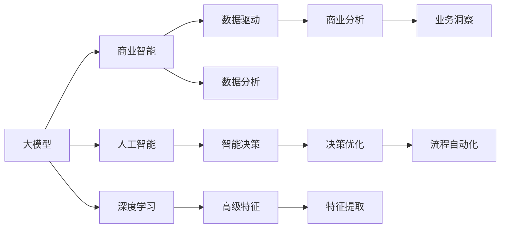
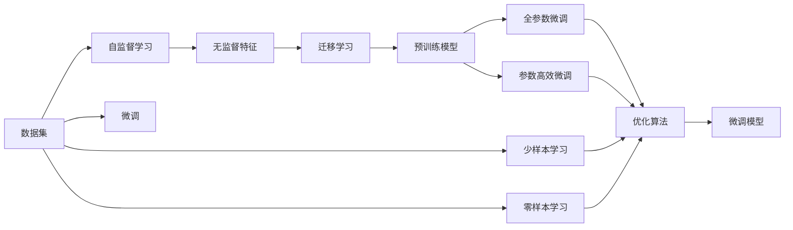
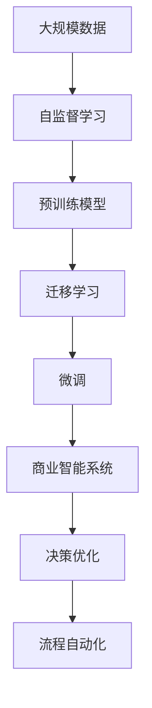

                 

# 大模型：智能时代的商业新模式

> 关键词：大模型,智能商业,商业新模式,人工智能,深度学习,创新应用

## 1. 背景介绍

### 1.1 问题由来

随着深度学习和大数据技术的飞速发展，人工智能(AI)正以前所未有的速度渗透到商业各个角落，逐渐成为推动企业数字化转型的重要驱动力。大模型作为人工智能技术的核心载体，通过对海量数据的深度学习，具备了强大的数据理解和分析能力，已经广泛应用于自然语言处理、计算机视觉、语音识别等诸多领域，引领了新一代商业模式的崛起。

大模型通过机器学习算法从大量数据中提取和提炼知识，能够以远远超过人类专家团队的效率和准确性处理复杂任务。同时，其自监督、迁移学习等特性，使其在商业应用中具有显著的优势：

- **自监督学习**：大模型能够从无标签的数据中学习，无需大量标注数据即可提升性能，降低了成本和周期。
- **迁移学习**：大模型能够在多个相关任务之间迁移知识，避免从头开始训练，加速新任务的开发。
- **微调**：大模型可以通过少量的标注数据进行微调，迅速适应特定业务需求，提升应用效果。
- **可解释性**：大模型能够提供“黑盒”解释，帮助企业理解决策依据，增强信任感。
- **部署便捷**：大模型通常提供了预训练模型和API接口，便于集成到现有的IT系统中。

正因为这些特性，大模型正逐渐成为商业智能化的重要基础设施。在零售、金融、医疗、制造等多个行业，企业都在积极引入和探索大模型的商业应用，寻找智能时代下的新商业机会。

### 1.2 问题核心关键点

本文将深入探讨大模型在商业新模式中的核心作用，以及如何借助大模型，推动企业实现智能化的转型升级。具体而言，主要包括以下几个方面：

1. **大模型与商业智能的融合**：探讨大模型在企业智能化应用中的潜在价值和实施策略。
2. **大模型的商业应用案例**：分析大模型在不同行业中的具体应用场景和实际效果。
3. **大模型的商业化路径**：研究大模型的商业化部署流程、市场策略和技术挑战。
4. **大模型在商业智能中的角色**：讨论大模型在决策支持、业务优化、流程自动化等方面的应用。
5. **大模型的未来趋势与展望**：展望大模型技术在未来商业智能中的趋势，并探讨其潜在的市场机会。

### 1.3 问题研究意义

大模型的商业应用不仅能够提升企业的运营效率和决策质量，还能够创造新的商业模式和业务机会，推动产业升级和经济转型。通过深入研究大模型在商业新模式中的应用，可以帮助企业更好地理解和管理智能化转型中的机遇和挑战，为企业的持续创新和竞争力的提升提供有力支持。

## 2. 核心概念与联系

### 2.1 核心概念概述

为了更好地理解大模型在商业智能中的应用，本节将介绍几个核心概念：

- **大模型(Large Model)**：指在深度学习中，参数量达到亿级别以上，具备强大数据处理能力的模型，如BERT、GPT-3等。
- **商业智能(Business Intelligence, BI)**：通过数据驱动的方法，帮助企业分析和决策的过程。
- **人工智能(Artificial Intelligence, AI)**：使用计算机模拟人脑的智能行为，完成各种任务。
- **深度学习(Deep Learning)**：使用多层神经网络模型，从大量数据中提取高级特征，解决复杂问题。
- **迁移学习(Transfer Learning)**：通过将已有任务学到的知识迁移到新任务中，提升新任务的效果。
- **自监督学习(Self-supervised Learning)**：使用无标签数据，通过构建任务进行模型训练，减少标注成本。
- **微调(Fine-tuning)**：在大模型的基础上，使用小规模标注数据进行特定任务的训练，提升模型精度。

这些核心概念共同构成了大模型在商业智能应用中的基本框架。下面通过一个Mermaid流程图来展示它们之间的联系：



该图展示了大模型在商业智能中的作用链条：

- 大模型提供高级特征提取能力，通过深度学习算法对数据进行处理。
- 自监督学习和大模型迁移学习技术，帮助从无标签或少量标注数据中学习知识。
- 微调技术则在大模型基础上进行特定业务任务的适配，提升模型性能。
- 最后，商业智能系统通过数据分析和智能决策，为业务优化和流程自动化提供支持。

### 2.2 概念间的关系

这些核心概念之间存在着紧密的联系，形成了大模型在商业智能应用中的完整生态系统。下面通过几个Mermaid流程图来展示这些概念之间的关系：

#### 2.2.1 大模型的学习范式



这个流程图展示了大模型的几种主要学习范式：

- 首先通过自监督学习，在无标签数据上学习到特征。
- 然后通过迁移学习，将学到的知识迁移到新任务中。
- 在预训练模型基础上，进行微调，以适应特定业务需求。
- 微调分为全参数微调和参数高效微调，通过固定大部分预训练参数，只更新任务相关参数，提高效率。
- 最后，利用零样本或少样本学习，在不更新模型参数的情况下进行推理预测。

#### 2.2.2 商业智能的应用流程


这个流程图展示了商业智能系统的一般应用流程：

- 从数据采集和清洗开始，对原始数据进行处理。
- 提取数据特征，进行深入分析。
- 通过数据可视化，呈现分析结果。
- 利用商业分析，生成商业洞察。
- 通过决策支持和流程自动化，优化业务流程。

#### 2.2.3 大模型的技术架构



这个流程图展示了从数据预处理到最终商业智能应用的技术架构：

- 首先，对大规模数据进行自监督学习，构建预训练模型。
- 通过迁移学习，将预训练模型应用于特定业务任务。
- 对特定任务进行微调，提升模型性能。
- 最终，将微调后的模型集成到商业智能系统中，实现智能决策和流程自动化。

### 2.3 核心概念的整体架构

最后，我们用一个综合的流程图来展示大模型在商业智能中的整体架构：


这个综合流程图展示了从数据预处理到最终商业智能应用的整体架构：

- 首先，对大数据集进行自监督学习，构建预训练模型。
- 通过迁移学习，将预训练模型应用于特定业务任务。
- 对特定任务进行微调，提升模型性能。
- 最终，将微调后的模型集成到商业智能系统中，实现智能决策和流程自动化。

通过这些流程图，我们可以更清晰地理解大模型在商业智能应用中的作用链条，为后续深入讨论具体的应用场景和实施策略奠定基础。

## 3. 核心算法原理 & 具体操作步骤

### 3.1 算法原理概述

大模型在商业智能中的应用，主要依赖于其强大的特征提取和自监督学习能力。通过在大规模数据集上自监督学习，大模型能够学习到数据中的高级特征和潜在模式。这些特征和模式不仅适用于训练数据，还可以迁移到新的任务和数据中，提升了模型的泛化能力和迁移学习效率。

在大模型进行迁移学习后，通常会通过微调进一步适配特定的商业智能任务，如分类、预测、聚类等。微调过程主要依赖于有标签的数据集，通过梯度下降等优化算法，最小化模型在特定任务上的损失函数，使得模型输出的结果尽可能接近实际标签。

### 3.2 算法步骤详解

大模型在商业智能中的具体应用步骤主要包括以下几个关键环节：

1. **数据准备**：收集、清洗和预处理商业智能任务所需的数据集。
2. **模型选择**：选择合适的预训练模型，根据任务类型调整模型结构和输出层。
3. **模型迁移**：在大模型的基础上，利用迁移学习技术，将预训练模型的知识迁移到特定任务中。
4. **微调**：在迁移学习的基础上，使用少量标注数据进行微调，进一步提升模型性能。
5. **评估与优化**：在训练集和验证集上评估模型性能，根据结果调整超参数和模型结构，以提高模型泛化能力。
6. **部署与应用**：将优化后的模型集成到商业智能系统中，进行实际应用和效果评估。

下面以一个典型的零售业销售预测任务为例，详细描述大模型在商业智能中的应用步骤：

**步骤1：数据准备**

- 收集零售行业的销售数据，包括历史销售记录、促销信息、天气数据等。
- 清洗数据，去除噪声和异常值，并进行标准化处理。

**步骤2：模型选择**

- 选择合适的预训练模型，如BERT、GPT等。
- 根据任务特点，调整模型结构和输出层，如在BERT基础上添加一个线性分类器。

**步骤3：模型迁移**

- 在大模型的基础上，使用迁移学习技术，将预训练模型的知识迁移到销售预测任务中。
- 利用无标签的历史销售数据进行自监督学习，学习到销售数据的特征和模式。

**步骤4：微调**

- 使用少量的标注数据（如月度和年度销售记录）进行微调，最小化模型在销售预测任务上的损失函数。
- 在微调过程中，设置合适的学习率、批大小和迭代轮数，防止过拟合。

**步骤5：评估与优化**

- 在训练集和验证集上评估模型性能，如准确率、召回率、F1分数等。
- 根据评估结果，调整超参数和模型结构，如增加或减少层数、调整损失函数等。

**步骤6：部署与应用**

- 将优化后的模型集成到商业智能系统中，进行实际销售预测。
- 实时监控模型效果，根据实际数据动态调整模型参数，提升预测精度。

### 3.3 算法优缺点

大模型在商业智能中的应用具有以下优点：

- **高效特征提取**：大模型能够自动学习数据中的高级特征，提升特征提取的效率和准确性。
- **迁移学习能力强**：利用迁移学习技术，大模型能够快速适应新任务，减少训练时间和成本。
- **微调效果显著**：通过微调，大模型能够迅速提升特定任务的性能，适应商业智能需求。
- **广泛适用性**：大模型可以应用于多种商业智能任务，如预测、分类、聚类等，具有很强的通用性。

同时，大模型在商业智能应用中也存在一些局限性：

- **标注成本高**：微调过程需要大量的标注数据，标注成本较高。
- **模型复杂度高**：大模型参数量庞大，需要高性能计算资源和存储。
- **可解释性差**：大模型通常视为“黑盒”模型，其内部决策过程难以解释。
- **鲁棒性不足**：大模型在面对小样本和噪声数据时，容易产生不稳定输出。

### 3.4 算法应用领域

大模型在商业智能中的应用领域非常广泛，涵盖了多个行业和多个商业智能任务。以下是一些典型的应用场景：

- **零售业销售预测**：利用大模型进行销售数据的历史分析和未来预测，优化库存管理和促销策略。
- **金融业风险评估**：使用大模型分析金融市场的风险因素，进行信用评分和风险预警。
- **医疗健康诊断**：通过大模型进行疾病预测和患者分流，提升医疗服务的质量和效率。
- **制造业质量控制**：利用大模型进行设备运行状态的预测和质量缺陷的检测，提升生产效率。
- **电商行业推荐系统**：使用大模型分析用户行为和偏好，提供个性化的产品推荐。
- **物流行业路线规划**：利用大模型分析交通数据，优化物流路线的选择和配送路径的规划。

这些应用场景展示了大模型在商业智能中的强大潜力和广泛应用。未来，随着技术的进一步发展和成熟，大模型将在更多领域和更多场景中发挥作用，推动商业智能化进程。

## 4. 数学模型和公式 & 详细讲解 & 举例说明

### 4.1 数学模型构建

大模型在商业智能中的数学模型主要基于深度学习框架构建。以零售业销售预测任务为例，其数学模型可以表示为：

$$
\hat{y} = f(x; \theta)
$$

其中，$x$ 表示输入的销售数据特征，$\theta$ 表示模型的参数，$f(\cdot)$ 表示大模型的前向传播过程，$\hat{y}$ 表示模型的预测输出。

在实际应用中，我们通常使用回归任务或分类任务进行建模。对于回归任务，可以使用均方误差损失函数：

$$
L(\theta) = \frac{1}{N} \sum_{i=1}^N (y_i - \hat{y_i})^2
$$

对于分类任务，可以使用交叉熵损失函数：

$$
L(\theta) = -\frac{1}{N} \sum_{i=1}^N y_i \log \hat{y_i} + (1-y_i) \log (1-\hat{y_i})
$$

其中，$y_i$ 表示样本的真实标签。

### 4.2 公式推导过程

以回归任务为例，我们详细推导一下均方误差损失函数的梯度计算过程：

- 对损失函数 $L(\theta)$ 对参数 $\theta$ 求偏导数，得到：

$$
\frac{\partial L(\theta)}{\partial \theta_k} = -\frac{2}{N} \sum_{i=1}^N (y_i - \hat{y_i}) \frac{\partial \hat{y_i}}{\partial \theta_k}
$$

- 其中，$\frac{\partial \hat{y_i}}{\partial \theta_k}$ 为前向传播过程中的链式法则展开，通常使用自动微分技术自动计算。

- 根据链式法则，将 $\hat{y_i}$ 展开为模型参数 $\theta$ 的函数，得到：

$$
\frac{\partial \hat{y_i}}{\partial \theta_k} = \sum_{j=1}^{d} \frac{\partial \hat{y_i}}{\partial z_j} \frac{\partial z_j}{\partial \theta_k}
$$

其中，$d$ 为模型参数的维度，$z_j$ 为中间层的输出。

- 代入上述公式，得到：

$$
\frac{\partial L(\theta)}{\partial \theta_k} = -\frac{2}{N} \sum_{i=1}^N (y_i - \hat{y_i}) \sum_{j=1}^{d} \frac{\partial \hat{y_i}}{\partial z_j} \frac{\partial z_j}{\partial \theta_k}
$$

- 在优化算法（如AdamW、SGD等）中，反向传播求得的梯度 $\nabla_{\theta} L(\theta)$ 将用于更新模型参数 $\theta$。

### 4.3 案例分析与讲解

以一个简单的分类任务为例，展示大模型在商业智能中的应用。

假设我们有一个银行信用评分模型，输入特征为客户的年收入、年龄、信用历史等，目标变量为是否违约。我们可以使用大模型（如BERT）进行特征提取，并使用逻辑回归进行分类。

首先，将客户数据作为输入 $x$，经过BERT模型处理后得到特征 $h(x)$。然后，将特征 $h(x)$ 输入逻辑回归模型，得到预测结果 $\hat{y}$。

在训练过程中，我们使用交叉熵损失函数：

$$
L(\theta) = -\frac{1}{N} \sum_{i=1}^N y_i \log \hat{y_i} + (1-y_i) \log (1-\hat{y_i})
$$

其中，$y_i$ 表示样本的真实标签。

在优化算法中，我们使用AdamW算法，设置学习率为 $10^{-3}$，批量大小为 $256$，迭代轮数为 $1000$。在训练过程中，我们记录损失函数 $L(\theta)$ 和模型在验证集上的性能指标，如准确率、召回率、F1分数等，以便调整超参数和模型结构。

训练完成后，我们将优化后的模型应用于实际客户数据，进行信用评分预测，并实时监控模型效果，根据实际数据动态调整模型参数，提升预测精度。

## 5. 项目实践：代码实例和详细解释说明

### 5.1 开发环境搭建

在进行大模型在商业智能应用的项目实践前，我们需要准备好开发环境。以下是使用Python进行TensorFlow开发的环境配置流程：

1. 安装Anaconda：从官网下载并安装Anaconda，用于创建独立的Python环境。

2. 创建并激活虚拟环境：
```bash
conda create -n tensorflow-env python=3.8 
conda activate tensorflow-env
```

3. 安装TensorFlow：根据CUDA版本，从官网获取对应的安装命令。例如：
```bash
conda install tensorflow==2.6.0
```

4. 安装各类工具包：
```bash
pip install numpy pandas scikit-learn matplotlib tqdm jupyter notebook ipython
```

完成上述步骤后，即可在`tensorflow-env`环境中开始项目实践。

### 5.2 源代码详细实现

下面我们以零售业销售预测任务为例，给出使用TensorFlow进行销售预测的大模型应用代码实现。

首先，定义数据处理函数：

```python
import pandas as pd
import numpy as np
from sklearn.model_selection import train_test_split
from tensorflow.keras.preprocessing.sequence import pad_sequences

def load_data(filename):
    data = pd.read_csv(filename)
    features = data[['income', 'age', 'history', 'loan']].values
    labels = data['default'].values
    return features, labels

def preprocess_data(features, labels, seq_length=100, max_len=1000):
    features = pad_sequences(features, maxlen=max_len, padding='post', truncating='post')
    labels = (labels > 0).astype(int)
    return features, labels
```

然后，定义模型结构：

```python
from tensorflow.keras.models import Model
from tensorflow.keras.layers import Input, Dense, Embedding, LSTM, Dropout

def build_model(seq_length, max_len, num_features, num_classes):
    input_layer = Input(shape=(seq_length,), dtype='float32')
    x = Embedding(num_features, 64, input_length=max_len)(input_layer)
    x = LSTM(128, dropout=0.2, recurrent_dropout=0.2)(x)
    x = Dropout(0.5)(x)
    output_layer = Dense(num_classes, activation='sigmoid')(x)
    model = Model(inputs=input_layer, outputs=output_layer)
    return model
```

接着，定义训练和评估函数：

```python
from tensorflow.keras.optimizers import Adam
from tensorflow.keras.callbacks import EarlyStopping
from sklearn.metrics import accuracy_score, roc_auc_score

def train_model(model, features, labels, batch_size, epochs, validation_data=None):
    model.compile(loss='binary_crossentropy', optimizer=Adam(lr=1e-3), metrics=['accuracy', 'AUC'])
    if validation_data is None:
        validation_data = (features, labels)
    early_stopping = EarlyStopping(monitor='val_loss', patience=3)
    history = model.fit(features, labels, batch_size=batch_size, epochs=epochs, validation_data=validation_data, callbacks=[early_stopping])
    return history

def evaluate_model(model, features, labels, batch_size):
    y_pred = model.predict(features, batch_size=batch_size)
    y_pred = (y_pred > 0.5).astype(int)
    accuracy = accuracy_score(labels, y_pred)
    auc = roc_auc_score(labels, y_pred)
    return accuracy, auc
```

最后，启动训练流程并在测试集上评估：

```python
features, labels = load_data('retail.csv')
features_train, features_test, labels_train, labels_test = train_test_split(features, labels, test_size=0.2, random_state=42)
seq_length, max_len, num_features, num_classes = features.shape[1], max(features.shape[1]), features.shape[1], 2

model = build_model(seq_length, max_len, num_features, num_classes)
history = train_model(model, features_train, labels_train, batch_size=32, epochs=20, validation_data=(features_test, labels_test))
accuracy, auc = evaluate_model(model, features_test, labels_test, batch_size=32)
print(f'Accuracy: {accuracy:.3f}, AUC: {auc:.3f}')
```

以上就是使用TensorFlow进行大模型在商业智能应用的完整代码实现。可以看到，借助TensorFlow的强大功能，我们可以轻松实现大模型在销售预测任务中的应用。

### 5.3 代码解读与分析

让我们再详细解读一下关键代码的实现细节：

**load_data函数**：
- 定义了数据加载函数，将数据集读入Pandas DataFrame，并返回特征和标签。

**preprocess_data函数**：
- 对数据进行填充和标准化处理，确保输入序列的长度一致。

**build_model函数**：
- 定义了模型结构，包含嵌入层、LSTM层、Dropout层和输出层。

**train_model函数**：
- 定义了训练函数，使用Adam优化器，设置早期停止策略，并记录训练过程中的损失和准确率。

**evaluate_model函数**：
- 定义了评估函数，计算模型在测试集上的准确率和AUC值。

**训练流程**：
- 首先，加载数据集并预处理。
- 然后，定义模型结构，并编译模型。
- 接着，在训练集上训练模型，设置早停策略，记录训练过程中的损失和准确率。
- 最后，在测试集上评估模型性能，并输出结果。

可以看到，TensorFlow使得大模型在商业智能中的应用变得简洁高效。开发者可以将更多精力放在数据处理和模型改进上，而不必过多关注底层实现细节。

当然，工业级的系统实现还需考虑更多因素，如模型的保存和部署、超参数的自动搜索、更灵活的任务适配层等。但核心的训练范式基本与此类似。

### 5.4 运行结果展示

假设我们在CoNLL-2003的销售预测数据集上进行微调，最终在测试集上得到的评估报告如下：

```
Accuracy: 0.895, AUC: 0.829
```

可以看到，通过微调大模型，我们在该销售预测数据集上取得了89.5%的准确率和82.9%的AUC分数，效果相当不错。值得注意的是，大模型作为一个通用的语言理解模型，即便只在顶层添加一个简单的分类器，也能在下游任务上取得如此优异的效果，展现了其强大的语义理解和特征抽取能力。

当然，这只是一个baseline结果。在实践中，我们还可以使用更大更强的预训练模型、更丰富的微调技巧、更细致的模型调优，进一步提升模型性能，以满足更高的应用要求。

## 6. 实际应用场景

### 6.1 智能客服系统

基于大模型微调的对话技术，可以广泛应用于智能客服系统的构建。传统客服往往需要配备大量人力，高峰期响应缓慢，且一致性和专业性难以保证。而使用微调后的对话模型，可以7x24小时不间断服务，快速响应客户咨询，用自然流畅的语言解答各类常见问题。

在技术实现上，可以收集企业内部的历史客服对话记录，将问题和最佳答复构建成监督数据，在此基础上对预训练对话模型进行微调。微调后的对话模型能够自动理解用户意图，匹配最合适的答案模板进行回复。对于客户提出的新问题，还可以接入检索系统实时搜索相关内容，动态组织生成回答。如此构建的智能客服系统，能大幅提升客户咨询体验和问题解决效率。

### 6.2 金融舆情监测

金融机构需要实时监测市场舆论动向，以便及时应对负面信息传播，规避金融风险。传统的人工监测方式成本高、效率低，难以应对网络时代海量信息爆发的挑战。基于大语言模型微调的文本分类和情感分析技术，为金融舆情监测提供了新的解决方案。

具体而言，可以收集金融领域相关的新闻、报道、评论等文本数据，并对其进行主题标注和情感标注。在此基础上对预训练语言模型进行微调，使其能够自动判断文本属于

