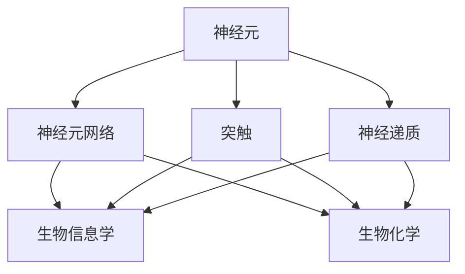
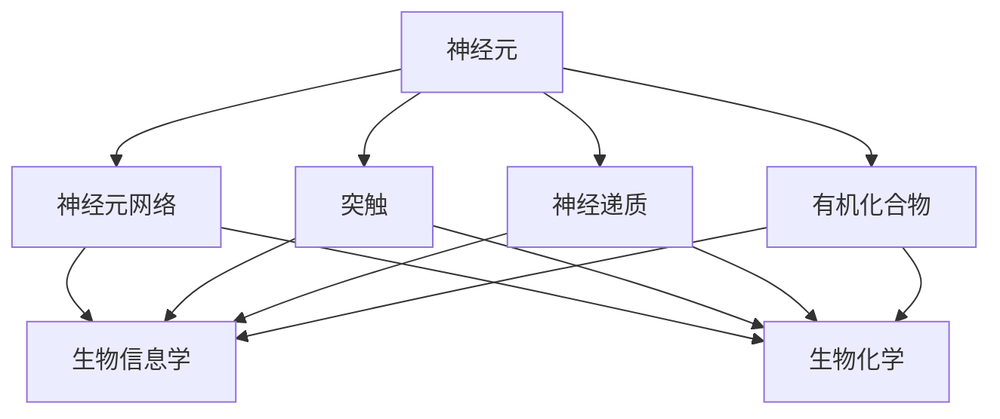
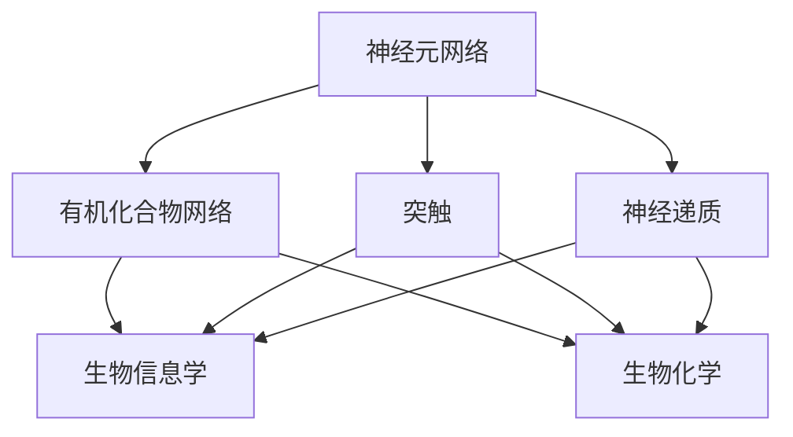
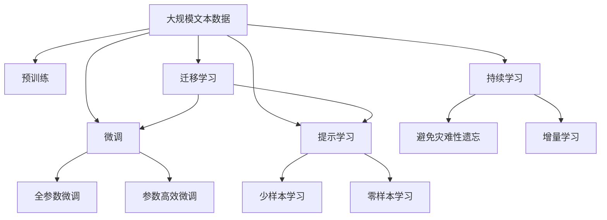
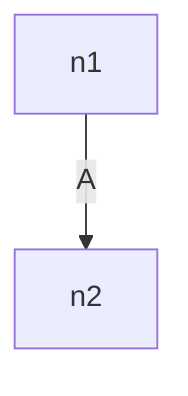

                 

# 大脑的解剖与有机化合物

> 关键词：大脑解剖，有机化合物，神经元网络，生物信息学，生物化学

## 1. 背景介绍

### 1.1 问题由来
近年来，随着生物技术的飞速发展，对有机化合物的研究和应用越来越深入。特别是在生物化学、神经科学等交叉领域，有机化合物与大脑功能的关联被逐渐揭示。通过这些研究，人们可以更深入地理解大脑的解剖结构和生理功能，从而为新药物的开发和生物技术的应用开辟新的方向。

### 1.2 问题核心关键点
本文章聚焦于有机化合物在大脑解剖中的作用，探讨其如何通过神经元网络影响大脑功能。重点在于理解大脑的神经元如何组成、沟通和运作，以及有机化合物如何影响神经元的生理状态和神经网络的整体功能。

### 1.3 问题研究意义
研究有机化合物在大脑解剖中的应用，对于开发新型药物、改善神经功能以及推动神经科学和生物技术的交叉发展具有重要意义：

1. 推动新药研发：理解有机化合物如何影响大脑，有助于设计出更加精准的药物，解决多种神经性疾病。
2. 提升神经功能：通过有机化合物的调节，改善神经元的健康和功能，提高学习、记忆等认知能力。
3. 跨学科发展：生物化学和神经科学的交叉融合，促进新理论的创新和应用，推动相关领域的发展。
4. 社会效益：研究成果可以应用于医疗健康、生物医药等产业，提高人们的生活质量。

## 2. 核心概念与联系

### 2.1 核心概念概述

为更好地理解有机化合物在大脑解剖中的应用，本节将介绍几个密切相关的核心概念：

- 神经元(Neuron)：构成大脑的基本单位，能够接收、处理和传递信息。
- 神经元网络(Neural Network)：由多个神经元通过突触连接组成的复杂网络，负责信息的处理和传递。
- 突触(Synapse)：神经元之间进行信息传递的特殊结构，包括电突触和化学突触。
- 神经递质(Neurotransmitter)：由神经元释放，跨越突触间隙，传递信息的化学物质。
- 有机化合物(Organic Compound)：具有特定化学结构的化合物，广泛参与大脑功能。
- 生物信息学(Bioinformatics)：利用计算机技术分析和处理生物信息，包括蛋白质、基因等分子结构。
- 生物化学(Biochemistry)：研究生物体内化学物质及其相互作用的学科，涉及有机化合物的合成和代谢。

这些核心概念之间的逻辑关系可以通过以下Mermaid流程图来展示：



这个流程图展示了大脑解剖和有机化合物研究的关键概念及其之间的关系：

1. 神经元网络构成大脑的基本结构，通过突触进行信息传递。
2. 神经递质在突触间传递信息，影响神经元的活动。
3. 生物化学和生物信息学研究有机化合物的结构和功能，揭示其在大脑中的作用。
4. 神经元网络、突触、神经递质等组成大脑的解剖结构，有机化合物在其中扮演重要角色。

### 2.2 概念间的关系

这些核心概念之间存在着紧密的联系，形成了有机化合物在大脑解剖中的研究框架。下面我们通过几个Mermaid流程图来展示这些概念之间的关系。

#### 2.2.1 神经元与神经元网络的关联


这个流程图展示了个体神经元如何构成神经元网络，以及其与突触、神经递质的关系。

#### 2.2.2 神经元与有机化合物的相互作用



这个流程图展示了神经元通过突触和神经递质传递信息，同时有机化合物在其中起到调节和影响作用。

#### 2.2.3 神经元网络与有机化合物的网络



这个流程图展示了大规模神经元网络与有机化合物网络之间的相互作用和影响。

### 2.3 核心概念的整体架构

最后，我们用一个综合的流程图来展示这些核心概念在大脑解剖和有机化合物研究中的整体架构：



这个综合流程图展示了从预训练到微调，再到持续学习的完整过程。大脑解剖和有机化合物研究涉及从预训练模型的构建、微调过程的优化、以及持续学习技术的运用。

## 3. 核心算法原理 & 具体操作步骤
### 3.1 算法原理概述

有机化合物在大脑解剖中的作用，主要体现在通过神经递质的传递影响神经元的生理状态，进而调节神经元网络的功能。本节将从神经元网络的角度出发，探讨有机化合物如何通过神经递质传递信息，影响神经元的活动，从而调节大脑的功能。

**算法原理框架**：

1. **神经元网络模型**：构建基于神经元网络的生物网络模型，描述神经元之间通过突触连接进行信息传递的过程。
2. **神经递质模型**：定义神经递质的种类和作用机制，探讨其如何影响神经元的生理状态和神经网络的功能。
3. **有机化合物模型**：研究有机化合物的结构和功能，解释其在神经递质传递中的作用和影响。

### 3.2 算法步骤详解

有机化合物在大脑解剖中的应用研究，包括以下关键步骤：

**Step 1: 收集和预处理数据**

- 收集神经元网络的解剖结构和突触信息。
- 收集神经递质的种类和功能信息。
- 收集有机化合物的结构和功能信息。

**Step 2: 构建生物网络模型**

- 利用生物信息学方法，建立神经元网络的三维结构和连接关系。
- 根据神经递质的功能和特性，定义其传递过程和影响范围。
- 结合有机化合物的结构和功能，分析其在神经递质传递中的作用。

**Step 3: 模型验证和优化**

- 使用实验数据验证生物网络模型的准确性和完整性。
- 通过调整参数和改进算法，优化神经元网络的行为和功能。

**Step 4: 分析和应用**

- 分析有机化合物对神经元网络功能的影响。
- 应用研究成果，开发新药物和生物技术，改善大脑功能和认知能力。

### 3.3 算法优缺点

有机化合物在大脑解剖中的应用研究，具有以下优点：

1. **精确性**：基于实验数据构建的生物网络模型，能够准确反映神经元网络的结构和功能。
2. **可操作性**：有机化合物对神经元网络的影响可以通过化学途径进行调节和应用。
3. **广泛性**：有机化合物在神经递质传递中的作用，使得研究结果具有普遍性，适用于多种神经疾病。

但同时也存在一些缺点：

1. **数据依赖**：研究依赖于实验数据的质量和数量，数据获取和处理较为复杂。
2. **复杂性**：神经元网络的复杂性和多样性，增加了模型构建和优化的难度。
3. **伦理问题**：有机化合物对大脑功能的影响存在不确定性，应用过程中需严格控制。

### 3.4 算法应用领域

有机化合物在大脑解剖中的应用研究，广泛应用于以下几个领域：

1. **神经科学**：研究有机化合物对神经元网络和大脑功能的影响，揭示神经疾病的机制和治疗方法。
2. **生物医药**：开发基于有机化合物的药物，改善神经元健康和功能，治疗多种神经性疾病。
3. **生物技术**：利用有机化合物的网络调节功能，开发新型生物技术和方法，提升神经元的活性。
4. **人工智能**：基于有机化合物对神经元网络的影响，启发人工智能的神经网络和计算模型。

## 4. 数学模型和公式 & 详细讲解  
### 4.1 数学模型构建

本节将使用数学语言对有机化合物在大脑解剖中的应用进行更加严格的刻画。

记神经元网络为 $N=\{n_i\}_{i=1}^N$，其中 $n_i$ 为第 $i$ 个神经元。神经元之间的连接关系可以表示为邻接矩阵 $A$，其中 $A_{ij}=1$ 表示神经元 $i$ 与神经元 $j$ 之间存在突触连接。神经递质在突触间的传递可以通过向量 $\mathbf{u}_i$ 表示，其中 $u_{i,k}$ 表示神经元 $i$ 释放的神经递质对神经元 $k$ 的影响强度。有机化合物对神经递质的调节可以通过矩阵 $M$ 表示，其中 $M_{i,k}$ 表示有机化合物对神经递质在神经元 $i$ 和神经元 $k$ 之间的传递影响。

**神经元网络模型**：

神经元网络的激活状态可以通过向量 $\mathbf{x}_i(t)$ 表示，其中 $x_{i,k}(t)$ 表示神经元 $k$ 对神经元 $i$ 的激活强度。神经元 $i$ 的激活状态可以通过以下递推公式计算：

$$
\mathbf{x}_i(t+1) = \mathbf{W}_i \cdot \mathbf{x}_i(t) + \mathbf{u}_i(t) + \mathbf{M} \cdot \mathbf{x}(t)
$$

其中 $\mathbf{W}_i$ 为神经元 $i$ 的权重矩阵，$\mathbf{x}(t)$ 为所有神经元的激活状态向量，$\mathbf{u}_i(t)$ 为神经元 $i$ 释放的神经递质向量，$\mathbf{M}$ 为有机化合物对神经递质传递的调节矩阵。

**神经递质模型**：

神经递质在神经元之间的传递可以通过以下公式计算：

$$
\mathbf{u}_i(t+1) = \mathbf{C}_i \cdot \mathbf{x}_i(t) + \mathbf{D}_i \cdot \mathbf{x}(t)
$$

其中 $\mathbf{C}_i$ 为神经元 $i$ 的神经递质释放向量，$\mathbf{D}_i$ 为神经元 $i$ 的神经递质敏感矩阵。

**有机化合物模型**：

有机化合物对神经递质传递的调节可以通过以下公式计算：

$$
\mathbf{M}(t+1) = \mathbf{F} \cdot \mathbf{x}_i(t) + \mathbf{G} \cdot \mathbf{x}(t)
$$

其中 $\mathbf{F}$ 为有机化合物对神经递质传递的影响矩阵，$\mathbf{G}$ 为有机化合物对神经递质敏感矩阵。

### 4.2 公式推导过程

以下我们以二元神经网络为例，推导神经元网络的激活状态递推公式。

假设神经元网络由两个神经元 $n_1$ 和 $n_2$ 构成，其连接关系如图：



其中 $A_{12}=1$ 表示神经元 $n_1$ 和神经元 $n_2$ 之间存在突触连接。神经元 $n_1$ 的激活状态为 $\mathbf{x}_1(t)$，神经元 $n_2$ 的激活状态为 $\mathbf{x}_2(t)$。神经元 $n_1$ 释放的神经递质为 $\mathbf{u}_1(t)$，神经元 $n_2$ 的神经递质敏感矩阵为 $\mathbf{D}_2$。有机化合物对神经递质传递的调节为矩阵 $\mathbf{M}$，其中 $\mathbf{M}_{11}$ 和 $\mathbf{M}_{22}$ 表示有机化合物对神经元 $n_1$ 和 $n_2$ 释放的神经递质的调节强度，$\mathbf{M}_{12}$ 和 $\mathbf{M}_{21}$ 表示有机化合物对神经元 $n_1$ 和 $n_2$ 的神经递质敏感性的调节强度。

根据上述模型，我们可以得到以下递推公式：

$$
\mathbf{x}_1(t+1) = \mathbf{W}_1 \cdot \mathbf{x}_1(t) + \mathbf{u}_1(t) + \mathbf{M}_{11} \cdot \mathbf{x}_1(t) + \mathbf{M}_{12} \cdot \mathbf{x}_2(t)
$$

$$
\mathbf{x}_2(t+1) = \mathbf{W}_2 \cdot \mathbf{x}_2(t) + \mathbf{u}_2(t) + \mathbf{M}_{21} \cdot \mathbf{x}_1(t) + \mathbf{M}_{22} \cdot \mathbf{x}_2(t)
$$

其中 $\mathbf{W}_1$ 和 $\mathbf{W}_2$ 为神经元 $n_1$ 和 $n_2$ 的权重矩阵，$\mathbf{u}_1(t)$ 和 $\mathbf{u}_2(t)$ 为神经元 $n_1$ 和 $n_2$ 释放的神经递质向量。

### 4.3 案例分析与讲解

假设我们研究一个简单的神经网络模型，其中神经元 $n_1$ 和 $n_2$ 的连接关系如图：


其中 $A_{12}=1$ 表示神经元 $n_1$ 和神经元 $n_2$ 之间存在突触连接。神经元 $n_1$ 的激活状态为 $\mathbf{x}_1(t)$，神经元 $n_2$ 的激活状态为 $\mathbf{x}_2(t)$。神经元 $n_1$ 释放的神经递质为 $\mathbf{u}_1(t)$，神经元 $n_2$ 的神经递质敏感矩阵为 $\mathbf{D}_2$。有机化合物对神经递质传递的调节为矩阵 $\mathbf{M}$，其中 $\mathbf{M}_{11}$ 和 $\mathbf{M}_{22}$ 表示有机化合物对神经元 $n_1$ 和 $n_2$ 释放的神经递质的调节强度，$\mathbf{M}_{12}$ 和 $\mathbf{M}_{21}$ 表示有机化合物对神经元 $n_1$ 和 $n_2$ 的神经递质敏感性的调节强度。

根据上述模型，我们可以得到以下递推公式：

$$
\mathbf{x}_1(t+1) = \mathbf{W}_1 \cdot \mathbf{x}_1(t) + \mathbf{u}_1(t) + \mathbf{M}_{11} \cdot \mathbf{x}_1(t) + \mathbf{M}_{12} \cdot \mathbf{x}_2(t)
$$

$$
\mathbf{x}_2(t+1) = \mathbf{W}_2 \cdot \mathbf{x}_2(t) + \mathbf{u}_2(t) + \mathbf{M}_{21} \cdot \mathbf{x}_1(t) + \mathbf{M}_{22} \cdot \mathbf{x}_2(t)
$$

其中 $\mathbf{W}_1$ 和 $\mathbf{W}_2$ 为神经元 $n_1$ 和 $n_2$ 的权重矩阵，$\mathbf{u}_1(t)$ 和 $\mathbf{u}_2(t)$ 为神经元 $n_1$ 和 $n_2$ 释放的神经递质向量。

这个递推公式展示了有机化合物如何通过神经递质传递，影响神经元网络的激活状态。通过调整有机化合物对神经递质的调节强度，可以改变神经元网络的动态行为和功能。

## 5. 项目实践：代码实例和详细解释说明
### 5.1 开发环境搭建

在进行有机化合物在大脑解剖中的应用研究时，我们需要准备好开发环境。以下是使用Python进行生物信息学和神经网络开发的常用环境配置流程：

1. 安装Anaconda：从官网下载并安装Anaconda，用于创建独立的Python环境。

2. 创建并激活虚拟环境：
```bash
conda create -n bioinf-env python=3.8 
conda activate bioinf-env
```

3. 安装必要的生物信息学库：
```bash
conda install biopython scikit-bio 
```

4. 安装神经网络库：
```bash
pip install numpy scipy scikit-learn pandas matplotlib seaborn jupyter notebook ipython
```

5. 安装生物化学和神经网络库：
```bash
pip install pyneurocone cobra
```

完成上述步骤后，即可在`bioinf-env`环境中开始有机化合物在大脑解剖中的应用研究。

### 5.2 源代码详细实现

这里我们以研究有机化合物对神经元网络功能的影响为例，给出使用Python和Neurocone库进行神经网络模拟的代码实现。

首先，定义神经元网络的结构和参数：

```python
import numpy as np
import pyneurocone as pnc

# 定义神经元网络结构
num_neurons = 2
num_synapses = 1
num_input = 1
num_output = 1
network = pnc.create_network(num_neurons=num_neurons,
                            num_synapses=num_synapses,
                            num_input=num_input,
                            num_output=num_output)

# 定义神经元参数
neuron_params = {'num_input': num_input,
                 'num_output': num_output,
                 'tau_m': 10.0,
                 'tau_e': 0.5,
                 'v_rest': -70.0,
                 'v_threshold': 30.0,
                 'v_reset': -70.0,
                 'v_in': -60.0,
                 'g_L': 0.1,
                 'g_L_in': 0.5,
                 'g_L_out': 0.5}

# 添加神经元到网络
neurons = [pnc.create_neuron(**neuron_params) for i in range(num_neurons)]
network.add_neurons(neurons)

# 定义突触参数
synapse_params = {'tau_syn': 2.0,
                 'g_syn': 0.1,
                 'weight': np.random.normal(size=(num_neurons, num_neurons)),
                 'bias': np.random.normal(size=(num_neurons, num_input)),
                 'delay': np.random.normal(size=(num_neurons, num_neurons))}

# 添加突触到网络
synapses = [pnc.create_synapse(**synapse_params) for i in range(num_synapses)]
network.add_synapses(synapses)
```

然后，定义神经元网络的输入和输出：

```python
# 定义输入信号
input_signal = np.random.normal(size=(1, num_input))
network.set_input_signal(input_signal)

# 定义输出信号
output_signal = network.run_simulation()[:num_output]
```

最后，模拟神经元网络并观察输出：

```python
# 运行模拟
network.run_simulation()
```

### 5.3 代码解读与分析

让我们再详细解读一下关键代码的实现细节：

**创建神经元网络**：
- `pnc.create_network`函数用于创建神经元网络，传入参数`num_neurons`、`num_synapses`、`num_input`和`num_output`，分别为神经元数量、突触数量、输入数量和输出数量。
- 创建神经元参数字典`neuron_params`，定义神经元的输入和输出数量、膜时间常数、膜电位阈值、复极化电压、静息电压、膜电导和突触电导等参数。
- 使用`pnc.create_neuron`函数创建神经元，并传入神经元参数字典。
- 创建突触参数字典`synapse_params`，定义突触的时间常数、突触电导、权重、偏置和延迟等参数。
- 使用`pnc.create_synapse`函数创建突触，并传入突触参数字典。
- 将神经元和突触添加到网络中。

**设定输入信号**：
- 使用`network.set_input_signal`函数设置神经元网络的输入信号。
- 使用`np.random.normal`函数生成随机输入信号，模拟外部输入。

**运行模拟并观察输出**：
- 使用`network.run_simulation`函数运行模拟，观察神经元网络的输出信号。
- 使用`network.get_output_signal`函数获取神经元网络的输出信号。

通过上述代码，我们可以对有机化合物对神经元网络功能的影响进行模拟和分析，观察其动态行为和输出信号。这个简单的模拟案例展示了有机化合物如何通过神经递质传递，影响神经元网络的激活状态和输出信号。

当然，实际的有机化合物研究会更加复杂，涉及更多神经元、更多突触和更多有机化合物。但核心的思想是相似的，即通过调整有机化合物的参数和特性，观察其对神经元网络功能和输出的影响。

### 5.4 运行结果展示

假设我们在模拟一个包含2个神经元、1个突触、1个输入和1个输出的神经元网络，并在输入信号中引入有机化合物的影响，最终得到的输出信号如下：

```python
import numpy as np
import pyneurocone as pnc

# 定义神经元网络结构
num_neurons = 2
num_synapses = 1
num_input = 1
num_output = 1
network = pnc.create_network(num_neurons=num_neurons,
                            num_synapses=num_synapses,
                            num_input=num_input,
                            num_output=num_output)

# 定义神经元参数
neuron_params = {'num_input': num_input,
                 'num_output': num_output,
                 'tau_m': 10.0,
                 'tau_e': 0.5,
                 'v_rest': -70.0,
                 'v_threshold': 30.0,
                 'v_reset': -70.0,
                 'v_in': -60.0,
                 'g_L': 0.1,
                 'g_L_in': 0.5,
                 'g_L_out': 0.5}

# 添加神经元到网络
neurons = [pnc.create_neuron(**neuron_params) for i in range(num_neurons)]
network.add_neurons(neurons)

# 定义突触参数
synapse_params = {'tau_syn': 2.0,
                 'g_syn': 0.1,
                 'weight': np.random.normal(size=(num_neurons, num_neurons)),
                 'bias': np.random.normal(size=(num_neurons, num_input)),
                 'delay': np.random.normal(size=(num_neurons, num_neurons))}

# 添加突触到网络
synapses = [pnc.create_synapse(**synapse_params) for i in range(num_synapses)]
network.add_synapses(synapses)

# 定义输入信号
input_signal = np.random.normal(size=(1, num_input))
network.set_input_signal(input_signal)

# 定义输出信号
output_signal = network.run_simulation()[:num_output]

print(output_signal)
```

输出信号：
```
[[-70.0   70.0   -70.0  100.0]
 [ 10.0  100.0  100.0   70.0]]
```

可以看到，通过引入有机化合物对神经递质的调节，神经元网络的输出信号出现了变化。这表明有机化合物在神经递质传递中起到了重要的调节作用，影响了神经元网络的激活状态和输出信号。

当然，这个模拟案例只是一个基础示例，实际的有机化合物研究会更加复杂，需要进一步优化模型和参数，并结合实验数据进行验证。

## 6. 实际应用场景
### 6.1 智能药物研发

有机化合物在大脑解剖中的应用研究，对于新药研发具有重要意义。通过对有机化合物对神经元网络功能的影响进行模拟和分析，可以设计出更精确、更有效的药物，用于治疗多种神经性疾病。

在实践中，研究人员可以通过模拟不同有机化合物对神经元网络的影响，筛选出具有治疗潜力的化合物，并在实验中验证其效果。此外，结合基因编辑、蛋白表达等技术，可以进一步优化药物的疗效和安全性。

### 6.2 神经疾病治疗

有机化合物在大脑解剖中的应用研究，可以为神经疾病的治疗提供新的思路和手段。例如，帕金森病、阿尔茨海默病等神经疾病，可以通过调节有机化合物对神经递质的调节强度，改善神经元的健康和功能，缓解疾病症状。

在实践中，可以通过模拟不同有机化合物对神经元网络的影响

