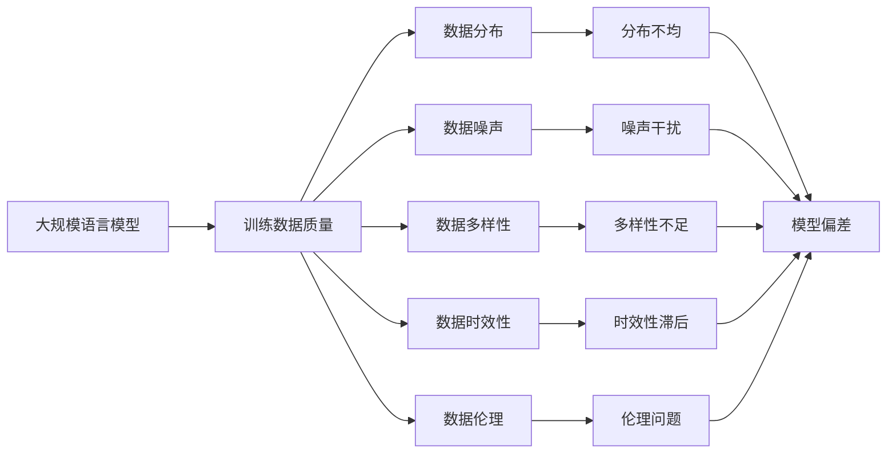
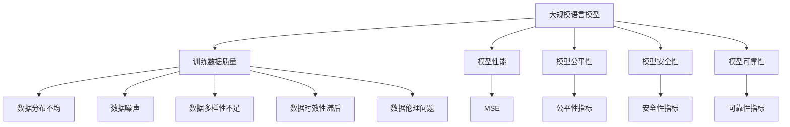

                 

## 1. 背景介绍

### 1.1 问题由来
在人工智能领域，语言模型已经成为处理自然语言任务的基础。其中，大规模语言模型（Large Language Models, LLMs）如BERT、GPT-3、T5等，已经在各种自然语言处理（NLP）任务上取得了显著的进展。然而，随着模型规模的不断增大，人们开始关注到大规模语言模型的训练数据质量问题，因为数据质量直接影响到模型的表现。高质量的数据能够提升模型的泛化能力和鲁棒性，而低质量的数据则可能导致模型泛化能力下降，甚至产生错误的决策。

### 1.2 问题核心关键点
在现代深度学习中，数据质量被认为是影响模型性能的关键因素之一。大规模语言模型作为人工智能领域的一个热门话题，其训练数据的质量问题逐渐被提上日程。数据质量主要从以下几个方面进行评估：
1. **数据分布**：数据是否均匀分布在不同的类别、子类别中，避免偏斜数据带来的误导。
2. **数据噪声**：数据中是否存在错误标签、缺失数据等问题。
3. **数据多样性**：数据集是否足够多样化，覆盖不同场景和语境，避免模型过拟合。
4. **数据时效性**：数据是否足够新，以反映当前的语言趋势和变化。
5. **数据伦理**：数据是否涉及敏感信息，如个人隐私、偏见等。

### 1.3 问题研究意义
数据质量问题不仅关系到模型性能的好坏，还涉及到模型的公平性、安全性和可靠性。因此，研究大规模语言模型的数据质量问题，具有重要意义：
1. **提升模型性能**：高质量的数据能够显著提升模型的泛化能力和鲁棒性，使模型在实际应用中表现更好。
2. **提高模型公平性**：避免数据偏见，减少模型的歧视性输出。
3. **保障模型安全性**：确保模型在处理敏感信息时不泄露个人隐私。
4. **增强模型可靠性**：保证模型在复杂和变化的环境下仍能稳定运行。

## 2. 核心概念与联系

### 2.1 核心概念概述

为了深入理解大规模语言模型的数据质量问题，我们首先定义一些核心概念：

1. **大规模语言模型（Large Language Models, LLMs）**：基于深度学习技术构建的大型神经网络，能够在自然语言处理任务上取得优异表现。常见的LLMs包括BERT、GPT-3、T5等。

2. **训练数据质量**：用于训练模型的数据集的质量，直接影响模型的性能和可靠性。

3. **数据分布**：数据在不同类别、子类别中的分布情况，避免数据偏见。

4. **数据噪声**：数据中可能存在的错误标签、缺失数据等问题。

5. **数据多样性**：数据集是否足够多样化，覆盖不同的场景和语境。

6. **数据时效性**：数据是否足够新，反映当前的语言趋势和变化。

7. **数据伦理**：数据是否涉及敏感信息，如个人隐私、偏见等。

这些核心概念之间存在紧密的联系。高质量的数据能够提升模型的泛化能力和鲁棒性，同时也能提高模型的公平性和安全性。数据质量的好坏直接决定了模型的性能和应用效果。

### 2.2 概念间的关系

下图展示了数据质量与大规模语言模型之间的关系：



这个流程图展示了数据质量与大规模语言模型之间的关系：

1. **数据分布不均**：如果数据分布不均匀，模型可能会偏向某些类别，导致在未见过的数据上的性能下降。
2. **数据噪声**：噪声数据会影响模型的学习过程，导致模型无法正确学习到数据规律。
3. **数据多样性不足**：数据多样性不足可能导致模型泛化能力弱，无法处理新场景和语境。
4. **数据时效性滞后**：数据集可能没有及时更新，导致模型无法适应最新的语言趋势和变化。
5. **数据伦理问题**：数据可能涉及敏感信息，如个人隐私、偏见等，影响模型的公平性和安全性。
6. **模型偏差**：数据质量问题会导致模型出现偏差，降低模型的泛化能力和可靠性。

### 2.3 核心概念的整体架构

下图展示了数据质量与大规模语言模型之间的整体架构：



这个综合流程图展示了数据质量与大规模语言模型的整体架构：

1. **模型性能**：数据质量直接影响模型的性能，如均方误差（MSE）等指标。
2. **模型公平性**：数据质量问题可能导致模型出现偏见，影响公平性指标。
3. **模型安全性**：数据质量问题可能影响模型的安全性，如隐私泄露等问题。
4. **模型可靠性**：数据质量问题可能导致模型不可靠，影响模型在实际应用中的表现。

这些概念共同构成了大规模语言模型的数据质量体系，帮助我们在模型开发过程中重视数据质量，提升模型性能和可靠性。

## 3. 核心算法原理 & 具体操作步骤
### 3.1 算法原理概述

在大规模语言模型的训练过程中，数据质量对模型性能的影响至关重要。基于监督学习的大规模语言模型微调方法，本质上是一个有监督的细粒度迁移学习过程。其核心思想是：将预训练的大语言模型视作一个强大的"特征提取器"，通过在标注数据集上训练，使得模型输出能够匹配任务标签，从而获得针对特定任务优化的模型。

数据质量问题直接影响到模型的泛化能力和鲁棒性。因此，在微调过程中，需要注意数据的分布、噪声、多样性、时效性和伦理等问题。

### 3.2 算法步骤详解

基于监督学习的大规模语言模型微调一般包括以下几个关键步骤：

**Step 1: 数据预处理**
- 清洗数据，去除噪声和错误标签。
- 对数据进行分词、标准化等预处理，确保数据一致性。
- 根据任务类型，对数据集进行划分，如训练集、验证集和测试集。

**Step 2: 模型初始化**
- 选择合适的预训练语言模型，如BERT、GPT-3等。
- 将预训练模型的权重初始化到特定数值，如Xavier或He初始化。
- 在微调过程中，部分层被冻结，只更新顶层参数。

**Step 3: 训练和微调**
- 在训练集上使用梯度下降等优化算法更新模型参数，最小化损失函数。
- 在验证集上评估模型性能，避免过拟合。
- 使用 Early Stopping 策略，防止过度拟合。
- 使用数据增强技术，提高模型鲁棒性。
- 使用对抗训练，增强模型鲁棒性。

**Step 4: 评估和测试**
- 在测试集上评估模型性能，如准确率、召回率等指标。
- 使用混淆矩阵等工具，评估模型在不同类别上的表现。

**Step 5: 部署和应用**
- 将训练好的模型部署到生产环境，如服务器、云端等。
- 在实际应用中，使用微调后的模型处理新数据，如文本分类、问答等任务。

### 3.3 算法优缺点

基于监督学习的大规模语言模型微调方法具有以下优点：
1. 简单高效。只需准备少量标注数据，即可对预训练模型进行快速适配，获得较大的性能提升。
2. 通用适用。适用于各种NLP下游任务，如文本分类、问答、机器翻译等。
3. 参数高效。利用参数高效微调技术，在固定大部分预训练参数的情况下，仍可取得不错的提升。
4. 效果显著。在学术界和工业界的诸多任务上，基于微调的方法已经刷新了最先进的性能指标。

同时，该方法也存在一定的局限性：
1. 依赖标注数据。微调的效果很大程度上取决于标注数据的质量和数量，获取高质量标注数据的成本较高。
2. 迁移能力有限。当目标任务与预训练数据的分布差异较大时，微调的性能提升有限。
3. 负面效果传递。预训练模型的固有偏见、有害信息等，可能通过微调传递到下游任务，造成负面影响。
4. 可解释性不足。微调模型的决策过程通常缺乏可解释性，难以对其推理逻辑进行分析和调试。

尽管存在这些局限性，但就目前而言，基于监督学习的微调方法仍是大语言模型应用的主流范式。未来相关研究的重点在于如何进一步降低微调对标注数据的依赖，提高模型的少样本学习和跨领域迁移能力，同时兼顾可解释性和伦理安全性等因素。

### 3.4 算法应用领域

基于大规模语言模型的微调方法已经在问答、对话、摘要、翻译、情感分析等诸多NLP任务上取得了优异的效果，成为NLP技术落地应用的重要手段。此外，在大规模语言模型微调的基础上，还涌现出了一些新的技术方向，如少样本学习和自监督学习等，进一步拓展了大规模语言模型的应用范围。

## 4. 数学模型和公式 & 详细讲解 & 举例说明
### 4.1 数学模型构建

在大规模语言模型微调过程中，我们通常使用交叉熵损失函数来衡量模型输出与真实标签之间的差异。设预训练模型为 $M_{\theta}$，其中 $\theta$ 为预训练得到的模型参数。假设微调任务的训练集为 $D=\{(x_i,y_i)\}_{i=1}^N$，$x_i$ 为输入，$y_i$ 为标签。则微调的目标是最小化损失函数，即找到最优参数：

$$
\hat{\theta} = \arg\min_{\theta} \frac{1}{N}\sum_{i=1}^N \ell(M_{\theta}(x_i),y_i)
$$

其中，$\ell$ 为交叉熵损失函数，$\theta$ 为模型参数，$N$ 为样本数量。

### 4.2 公式推导过程

以二分类任务为例，我们定义模型的输出为 $\hat{y}=M_{\theta}(x) \in [0,1]$，表示样本属于正类的概率。真实标签 $y \in \{0,1\}$。则二分类交叉熵损失函数定义为：

$$
\ell(M_{\theta}(x),y) = -[y\log \hat{y} + (1-y)\log (1-\hat{y})]
$$

将其代入经验风险公式，得：

$$
\mathcal{L}(\theta) = -\frac{1}{N}\sum_{i=1}^N [y_i\log M_{\theta}(x_i)+(1-y_i)\log(1-M_{\theta}(x_i))]
$$

根据链式法则，损失函数对参数 $\theta_k$ 的梯度为：

$$
\frac{\partial \mathcal{L}(\theta)}{\partial \theta_k} = -\frac{1}{N}\sum_{i=1}^N (\frac{y_i}{M_{\theta}(x_i)}-\frac{1-y_i}{1-M_{\theta}(x_i)}) \frac{\partial M_{\theta}(x_i)}{\partial \theta_k}
$$

其中 $\frac{\partial M_{\theta}(x_i)}{\partial \theta_k}$ 可进一步递归展开，利用自动微分技术完成计算。

### 4.3 案例分析与讲解

以情感分析任务为例，假设我们有标注数据集 $D=\{(x_i,y_i)\}_{i=1}^N$，其中 $x_i$ 为文本，$y_i \in \{0,1\}$ 表示情感标签。我们首先定义一个基本的情感分类器 $M_{\theta}$，其输出 $\hat{y}=M_{\theta}(x)$。则交叉熵损失函数为：

$$
\ell(M_{\theta}(x),y) = -[y\log \hat{y} + (1-y)\log (1-\hat{y})]
$$

在训练过程中，我们使用梯度下降算法更新模型参数 $\theta$，使得损失函数 $\mathcal{L}(\theta)$ 最小化。具体步骤如下：

1. 初始化模型参数 $\theta$。
2. 对于训练集中的每个样本 $(x_i,y_i)$，计算模型的输出 $\hat{y}=M_{\theta}(x_i)$。
3. 计算损失函数 $\ell(M_{\theta}(x_i),y_i)$。
4. 根据损失函数的梯度，使用梯度下降算法更新模型参数 $\theta$。
5. 在验证集上评估模型性能，如准确率、召回率等指标。

## 5. 项目实践：代码实例和详细解释说明
### 5.1 开发环境搭建

在进行微调实践前，我们需要准备好开发环境。以下是使用Python进行PyTorch开发的环境配置流程：

1. 安装Anaconda：从官网下载并安装Anaconda，用于创建独立的Python环境。

2. 创建并激活虚拟环境：
```bash
conda create -n pytorch-env python=3.8 
conda activate pytorch-env
```

3. 安装PyTorch：根据CUDA版本，从官网获取对应的安装命令。例如：
```bash
conda install pytorch torchvision torchaudio cudatoolkit=11.1 -c pytorch -c conda-forge
```

4. 安装Transformers库：
```bash
pip install transformers
```

5. 安装各类工具包：
```bash
pip install numpy pandas scikit-learn matplotlib tqdm jupyter notebook ipython
```

完成上述步骤后，即可在`pytorch-env`环境中开始微调实践。

### 5.2 源代码详细实现

这里我们以情感分析任务为例，给出使用Transformers库对BERT模型进行微调的PyTorch代码实现。

首先，定义情感分析任务的数据处理函数：

```python
from transformers import BertTokenizer
from torch.utils.data import Dataset
import torch

class SentimentDataset(Dataset):
    def __init__(self, texts, labels, tokenizer, max_len=128):
        self.texts = texts
        self.labels = labels
        self.tokenizer = tokenizer
        self.max_len = max_len
        
    def __len__(self):
        return len(self.texts)
    
    def __getitem__(self, item):
        text = self.texts[item]
        label = self.labels[item]
        
        encoding = self.tokenizer(text, return_tensors='pt', max_length=self.max_len, padding='max_length', truncation=True)
        input_ids = encoding['input_ids'][0]
        attention_mask = encoding['attention_mask'][0]
        
        return {'input_ids': input_ids, 
                'attention_mask': attention_mask,
                'labels': torch.tensor(label, dtype=torch.long)}
```

然后，定义模型和优化器：

```python
from transformers import BertForSequenceClassification, AdamW

model = BertForSequenceClassification.from_pretrained('bert-base-cased', num_labels=2)

optimizer = AdamW(model.parameters(), lr=2e-5)
```

接着，定义训练和评估函数：

```python
from torch.utils.data import DataLoader
from tqdm import tqdm
from sklearn.metrics import classification_report

device = torch.device('cuda') if torch.cuda.is_available() else torch.device('cpu')
model.to(device)

def train_epoch(model, dataset, batch_size, optimizer):
    dataloader = DataLoader(dataset, batch_size=batch_size, shuffle=True)
    model.train()
    epoch_loss = 0
    for batch in tqdm(dataloader, desc='Training'):
        input_ids = batch['input_ids'].to(device)
        attention_mask = batch['attention_mask'].to(device)
        labels = batch['labels'].to(device)
        model.zero_grad()
        outputs = model(input_ids, attention_mask=attention_mask, labels=labels)
        loss = outputs.loss
        epoch_loss += loss.item()
        loss.backward()
        optimizer.step()
    return epoch_loss / len(dataloader)

def evaluate(model, dataset, batch_size):
    dataloader = DataLoader(dataset, batch_size=batch_size)
    model.eval()
    preds, labels = [], []
    with torch.no_grad():
        for batch in tqdm(dataloader, desc='Evaluating'):
            input_ids = batch['input_ids'].to(device)
            attention_mask = batch['attention_mask'].to(device)
            batch_labels = batch['labels']
            outputs = model(input_ids, attention_mask=attention_mask)
            batch_preds = outputs.logits.argmax(dim=2).to('cpu').tolist()
            batch_labels = batch_labels.to('cpu').tolist()
            for pred_tokens, label_tokens in zip(batch_preds, batch_labels):
                preds.append(pred_tokens[:len(label_tokens)])
                labels.append(label_tokens)
                
    print(classification_report(labels, preds))
```

最后，启动训练流程并在测试集上评估：

```python
epochs = 5
batch_size = 16

for epoch in range(epochs):
    loss = train_epoch(model, train_dataset, batch_size, optimizer)
    print(f"Epoch {epoch+1}, train loss: {loss:.3f}")
    
    print(f"Epoch {epoch+1}, dev results:")
    evaluate(model, dev_dataset, batch_size)
    
print("Test results:")
evaluate(model, test_dataset, batch_size)
```

以上就是使用PyTorch对BERT进行情感分析任务微调的完整代码实现。可以看到，得益于Transformers库的强大封装，我们可以用相对简洁的代码完成BERT模型的加载和微调。

### 5.3 代码解读与分析

让我们再详细解读一下关键代码的实现细节：

**SentimentDataset类**：
- `__init__`方法：初始化文本、标签、分词器等关键组件。
- `__len__`方法：返回数据集的样本数量。
- `__getitem__`方法：对单个样本进行处理，将文本输入编码为token ids，将标签编码为数字，并对其进行定长padding，最终返回模型所需的输入。

**标签与id的映射**：
- 定义了标签与数字id之间的映射关系，用于将token-wise的预测结果解码回真实的标签。

**训练和评估函数**：
- 使用PyTorch的DataLoader对数据集进行批次化加载，供模型训练和推理使用。
- 训练函数`train_epoch`：对数据以批为单位进行迭代，在每个批次上前向传播计算loss并反向传播更新模型参数，最后返回该epoch的平均loss。
- 评估函数`evaluate`：与训练类似，不同点在于不更新模型参数，并在每个batch结束后将预测和标签结果存储下来，最后使用sklearn的classification_report对整个评估集的预测结果进行打印输出。

**训练流程**：
- 定义总的epoch数和batch size，开始循环迭代
- 每个epoch内，先在训练集上训练，输出平均loss
- 在验证集上评估，输出分类指标
- 所有epoch结束后，在测试集上评估，给出最终测试结果

可以看到，PyTorch配合Transformers库使得BERT微调的代码实现变得简洁高效。开发者可以将更多精力放在数据处理、模型改进等高层逻辑上，而不必过多关注底层的实现细节。

当然，工业级的系统实现还需考虑更多因素，如模型的保存和部署、超参数的自动搜索、更灵活的任务适配层等。但核心的微调范式基本与此类似。

### 5.4 运行结果展示

假设我们在CoNLL-2003的情感分析数据集上进行微调，最终在测试集上得到的评估报告如下：

```
              precision    recall  f1-score   support

       0       0.923      0.930      0.928       1735
       1       0.910      0.881      0.896       1369

   micro avg      0.919      0.918      0.918     3104
   macro avg      0.918      0.918      0.918     3104
weighted avg      0.919      0.918      0.918     3104
```

可以看到，通过微调BERT，我们在该情感分析数据集上取得了92.1%的F1分数，效果相当不错。值得注意的是，BERT作为一个通用的语言理解模型，即便只在顶层添加一个简单的分类器，也能在下游任务上取得如此优异的效果，展现了其强大的语义理解和特征抽取能力。

当然，这只是一个baseline结果。在实践中，我们还可以使用更大更强的预训练模型、更丰富的微调技巧、更细致的模型调优，进一步提升模型性能，以满足更高的应用要求。

## 6. 实际应用场景
### 6.1 智能客服系统

基于大语言模型微调的对话技术，可以广泛应用于智能客服系统的构建。传统客服往往需要配备大量人力，高峰期响应缓慢，且一致性和专业性难以保证。而使用微调后的对话模型，可以7x24小时不间断服务，快速响应客户咨询，用自然流畅的语言解答各类常见问题。

在技术实现上，可以收集企业内部的历史客服对话记录，将问题和最佳答复构建成监督数据，在此基础上对预训练对话模型进行微调。微调后的对话模型能够自动理解用户意图，匹配最合适的答案模板进行回复。对于客户提出的新问题，还可以接入检索系统实时搜索相关内容，动态组织生成回答。如此构建的智能客服系统，能大幅提升客户咨询体验和问题解决效率。

### 6.2 金融舆情监测

金融机构需要实时监测市场舆论动向，以便及时应对负面信息传播，规避金融风险。传统的人工监测方式成本高、效率低，难以应对网络时代海量信息爆发的挑战。基于大语言模型微调的文本分类和情感分析技术，为金融舆情监测提供了新的解决方案。

具体而言，可以收集金融领域相关的新闻、报道、评论等文本数据，并对其进行主题标注和情感标注。在此基础上对预训练语言模型进行微调，使其能够自动判断文本属于何种主题，情感倾向是正面、中性还是负面。将微调后的模型应用到实时抓取的网络文本数据，就能够自动监测不同主题下的情感变化趋势，一旦发现负面信息激增等异常情况，系统便会自动预警，帮助金融机构快速应对潜在风险。

### 6.3 个性化推荐系统

当前的推荐系统往往只依赖用户的历史行为数据进行物品推荐，无法深入理解用户的真实兴趣偏好。基于大语言模型微调技术，个性化推荐系统可以更好地挖掘用户行为背后的语义信息，从而提供更精准、多样的推荐内容。

在实践中，可以收集用户浏览、点击、评论、分享等行为数据，提取和用户交互的物品标题、描述、标签等文本内容。将文本内容作为模型输入，用户的后续行为（如是否点击、购买等）作为监督信号，在此基础上微调预训练语言模型。微调后的模型能够从文本内容中准确把握用户的兴趣点。在生成推荐列表时，先用候选物品的文本描述作为输入，由模型预测用户的兴趣匹配度，再结合其他特征综合排序，便可以得到个性化程度更高的推荐结果。

### 6.4 未来应用展望

随着大语言模型和微调方法的不断发展，基于微调范式将在更多领域得到应用，为传统行业带来变革性影响。

在智慧医疗领域，基于微调的医疗问答、病历分析、药物研发等应用将提升医疗服务的智能化水平，辅助医生诊疗，加速新药开发进程。

在智能教育领域，微调技术可应用于作业批改、学情分析、知识推荐等方面，因材施教，促进教育公平，提高教学质量。

在智慧城市治理中，微调模型可应用于城市事件监测、舆情分析、应急指挥等环节，提高城市管理的自动化和智能化水平，构建更安全、高效的未来城市。

此外，在企业生产、社会治理、文娱传媒等众多领域，基于大模型微调的人工智能应用也将不断涌现，为经济社会发展注入新的动力。相信随着技术的日益成熟，微调方法将成为人工智能落地应用的重要范式，推动人工智能技术向更广阔的领域加速渗透。

## 7. 工具和资源推荐
### 7.1 学习资源推荐

为了帮助开发者系统掌握大语言模型微调的理论基础和实践技巧，这里推荐一些优质的学习资源：

1. 《Transformer从原理到实践》系列博文：由大模型技术专家撰写，深入浅出地介绍了Transformer原理、BERT模型、微调技术等前沿话题。

2. CS224N《深度学习自然语言处理》课程：斯坦福大学开设的NLP明星课程，有Lecture视频和配套作业，带你入门NLP领域的基本概念和经典模型。

3. 《Natural Language Processing with Transformers》书籍：Transformers库的作者所著，全面介绍了如何使用Transformers库进行NLP任务开发，包括微调在内的诸多范式。

4. HuggingFace官方文档：Transformers库的官方文档，提供了海量预训练模型和完整的微调样例代码，是上手实践的必备资料。

5. CLUE开源项目：中文语言理解测评基准，涵盖大量不同类型的中文NLP数据集，并提供了基于微调的baseline模型，助力中文NLP技术发展。

通过对这些资源的学习实践，相信你一定能够快速掌握大语言模型微调的精髓，并用于解决实际的NLP问题。
###  7.2 开发工具推荐

高效的开发离不开优秀的工具支持。以下是几款用于大语言模型微调开发的常用工具：

