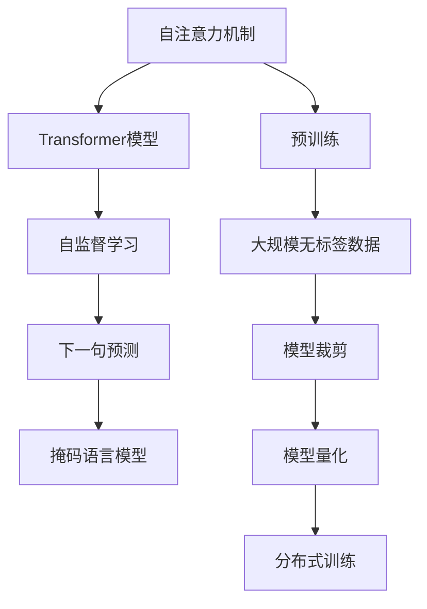
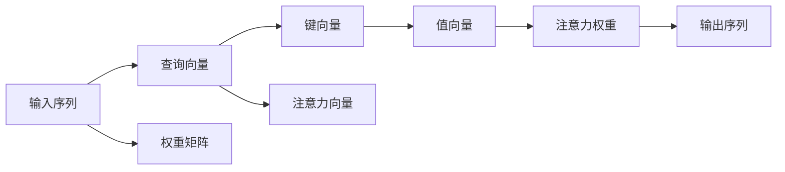
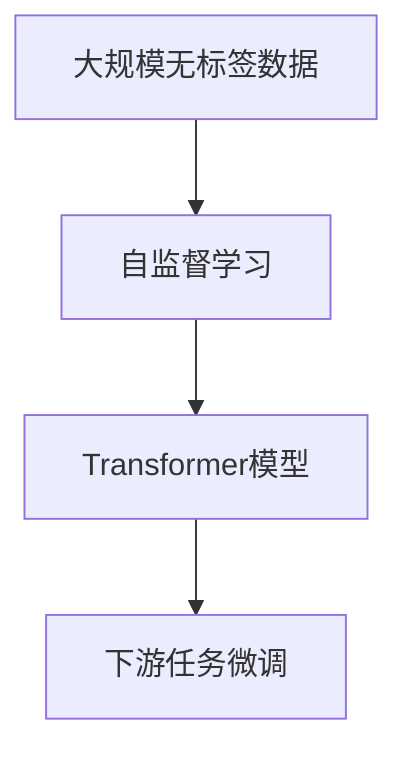
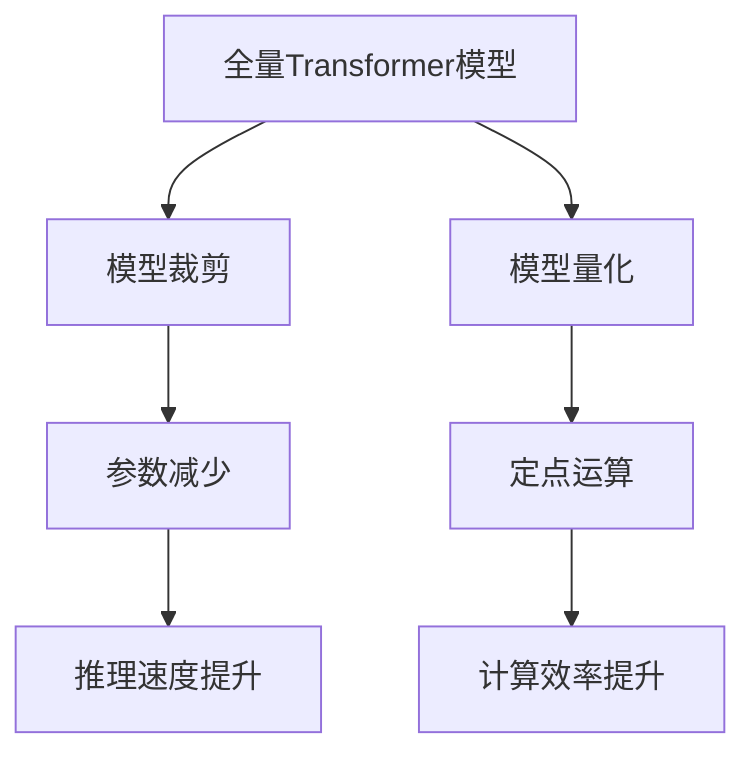
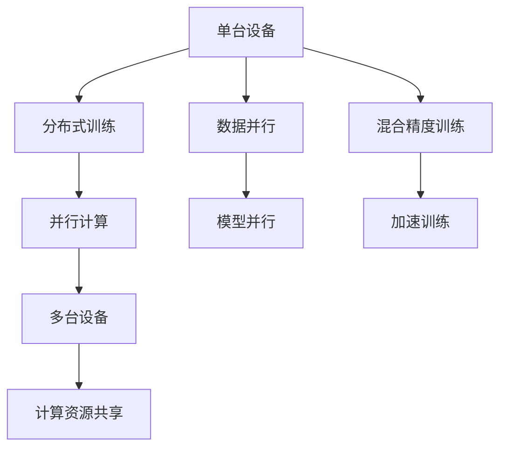
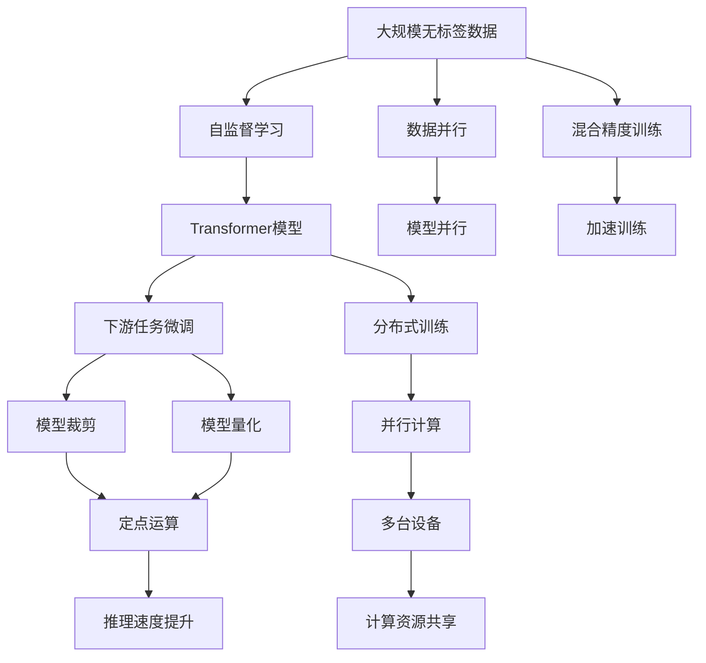

                 

# 大规模语言模型从理论到实践 模型架构

> 关键词：
大规模语言模型,Transformer,自注意力机制,预训练,自监督学习,模型架构,自然语言处理(NLP)

## 1. 背景介绍

### 1.1 问题由来
近年来，随着深度学习技术的快速发展，大规模语言模型(Large Language Model, LLMs)在自然语言处理(Natural Language Processing, NLP)领域取得了巨大的突破。这些模型通过在海量无标签文本数据上进行预训练，学习到了丰富的语言知识和常识，可以广泛应用于多种NLP任务，如文本分类、命名实体识别、机器翻译、文本生成等。其中最具代表性的大模型包括OpenAI的GPT系列模型、Google的BERT、T5等。

然而，由于模型规模庞大，训练和推理所需计算资源巨大，大语言模型的实际应用面临诸多挑战。为此，研究者提出了多种解决方案，如模型裁剪、量化加速、分布式训练等，以提高大模型的运行效率。与此同时，在模型架构和预训练方式上，也进行了不断的探索和优化，逐步形成了更加高效、灵活的大规模语言模型架构。

### 1.2 问题核心关键点
大规模语言模型架构的核心在于如何将庞大的参数矩阵高效地组织和计算，以实现高精度的预测和推理。其主要研究点包括：

1. **自注意力机制**：通过计算注意力权重，实现模型对输入序列中不同位置信息的关注，从而提高模型的表示能力。
2. **模型结构设计**：设计层次化的网络结构，利用并行计算提升模型训练和推理效率。
3. **预训练方式**：通过自监督学习任务，在大量无标签数据上进行预训练，学习到通用的语言表示。
4. **模型裁剪和量化**：通过去除不必要的网络层，减少计算量，同时利用定点运算加速模型推理。
5. **分布式训练**：利用多台计算设备进行并行训练，加快模型训练速度。

### 1.3 问题研究意义
研究大规模语言模型的模型架构，对于拓展模型应用范围，提升模型性能，加速NLP技术的产业化进程，具有重要意义：

1. 降低应用开发成本。通过合理的模型裁剪和量化，可以显著减少从头开发所需的数据、计算和人力等成本投入。
2. 提升模型效果。通过更高效的模型结构设计，可以在固定计算资源下，取得更优的模型性能。
3. 加速开发进度。standing on the shoulders of giants，合理的模型架构和预训练方式可以加快任务适配，缩短开发周期。
4. 带来技术创新。模型架构和预训练方式的优化，往往带来新的研究方向，如提示学习、少样本学习等，推动技术进步。
5. 赋能产业升级。合理的模型架构和预训练方式，使得NLP技术更容易被各行各业所采用，为传统行业数字化转型升级提供新的技术路径。

## 2. 核心概念与联系

### 2.1 核心概念概述

为更好地理解大规模语言模型的模型架构，本节将介绍几个密切相关的核心概念：

- **自注意力机制(Self-Attention Mechanism)**：一种基于矩阵乘法的注意力机制，用于计算输入序列中不同位置之间的依赖关系，广泛应用于Transformer模型中。
- **Transformer模型(Transformer Model)**：一种基于自注意力机制的深度神经网络模型，用于处理序列数据，如自然语言文本。
- **预训练(Pre-training)**：指在大规模无标签文本语料上，通过自监督学习任务训练通用语言模型的过程。常见的预训练任务包括掩码语言模型、下一句预测等。
- **自监督学习(Self-supervised Learning)**：一种无需标注数据即可进行模型训练的方法，通过设计伪标签或者自生成任务，使模型在大量未标注数据上进行训练。
- **模型裁剪(Model Pruning)**：通过去除模型中不必要的权重，减少模型参数量，以提高推理速度。
- **模型量化(Model Quantization)**：将浮点模型转换为定点模型，压缩存储空间，提高计算效率。
- **分布式训练(Distributed Training)**：利用多台计算设备进行并行训练，加快模型训练速度。

这些核心概念之间的逻辑关系可以通过以下Mermaid流程图来展示：



这个流程图展示了自注意力机制和Transformer模型在大规模语言模型架构中的核心作用，以及预训练、模型裁剪、模型量化和分布式训练等关键技术的应用。通过理解这些核心概念，我们可以更好地把握大规模语言模型的学习原理和优化方向。

### 2.2 概念间的关系

这些核心概念之间存在着紧密的联系，形成了大规模语言模型的完整生态系统。下面我通过几个Mermaid流程图来展示这些概念之间的关系。

#### 2.2.1 自注意力机制与Transformer模型



这个流程图展示了自注意力机制的工作原理，即通过计算注意力权重，实现输入序列中不同位置信息的关注，并输出加权和的向量表示。

#### 2.2.2 预训练与Transformer模型的关系



这个流程图展示了预训练和微调在大规模语言模型中的应用。预训练通过自监督学习任务训练通用语言模型，微调则在预训练模型的基础上，通过有监督学习优化模型在特定任务上的性能。

#### 2.2.3 模型裁剪与模型量化



这个流程图展示了模型裁剪和量化在大规模语言模型中的应用。模型裁剪通过去除不必要的权重，减少模型参数量，从而提高推理速度。模型量化则将浮点模型转换为定点模型，压缩存储空间，提高计算效率。

#### 2.2.4 分布式训练



这个流程图展示了分布式训练在大规模语言模型中的应用。分布式训练通过利用多台计算设备进行并行计算，加快模型训练速度，同时可以通过数据并行和模型并行等方式，进一步提升训练效率。

### 2.3 核心概念的整体架构

最后，我们用一个综合的流程图来展示这些核心概念在大规模语言模型架构中的整体架构：



这个综合流程图展示了从预训练到微调，再到模型裁剪和量化的完整过程。大规模语言模型首先在大规模无标签数据上进行预训练，然后通过微调在特定任务上进行优化，最后通过模型裁剪和量化，实现高效的推理和部署。同时，分布式训练技术也进一步加速了模型训练过程。通过这些关键技术的综合应用，我们得到了一个高效、灵活的大规模语言模型架构。

## 3. 核心算法原理 & 具体操作步骤
### 3.1 算法原理概述

大规模语言模型的核心在于通过自注意力机制和Transformer模型，对输入序列进行高效表示和计算。自注意力机制通过计算注意力权重，实现了输入序列中不同位置信息的关注，提高了模型的表示能力。Transformer模型则通过并行计算，提高了模型的训练和推理效率。

预训练过程中，模型通常在大规模无标签文本语料上进行自监督学习任务，如掩码语言模型、下一句预测等，学习到通用的语言表示。预训练完成后，模型通过下游任务的微调，进一步优化模型在特定任务上的性能。

### 3.2 算法步骤详解

大规模语言模型的预训练和微调步骤包括以下几个关键步骤：

**Step 1: 准备预训练数据和模型**

1. **数据准备**：收集大规模无标签文本语料，如维基百科、新闻、小说等，划分为训练集、验证集和测试集。
2. **模型初始化**：选择合适的预训练模型，如BERT、GPT等，进行初始化。

**Step 2: 自监督学习任务设计**

1. **掩码语言模型**：将输入序列中的某些位置随机掩码，训练模型预测被掩码位置的正确内容。
2. **下一句预测**：将输入序列的下一条句子作为目标，训练模型预测下一句出现的概率。
3. **预测任务**：设计各种预测任务，如词性标注、命名实体识别等，通过模型预测结果与真实标签进行对比，更新模型参数。

**Step 3: 微调**

1. **任务适配层设计**：根据下游任务类型，设计合适的输出层和损失函数。
2. **模型初始化**：将预训练模型的权重设置为微调的初始参数。
3. **训练和验证**：使用下游任务的标注数据集，通过梯度下降等优化算法更新模型参数。
4. **测试和评估**：在测试集上评估模型性能，调整模型参数，确保模型在特定任务上的表现。

**Step 4: 模型优化**

1. **模型裁剪**：去除不必要的网络层，减少模型参数量。
2. **模型量化**：将浮点模型转换为定点模型，压缩存储空间，提高计算效率。
3. **分布式训练**：利用多台计算设备进行并行训练，加快模型训练速度。

### 3.3 算法优缺点

大规模语言模型架构的优势包括：

1. **高效表示**：通过自注意力机制，模型能够高效地对输入序列进行表示，学习到丰富的语言知识。
2. **泛化能力**：预训练过程中，模型能够学习到通用的语言表示，在下游任务微调时，能够迅速适应新任务。
3. **灵活部署**：通过模型裁剪和量化，模型可以适应各种计算设备，实现高效部署。

同时，大规模语言模型架构也存在一些缺点：

1. **计算资源需求高**：模型参数量庞大，训练和推理所需计算资源高。
2. **训练时间长**：在大规模数据上进行预训练，训练时间较长。
3. **模型复杂度高**：模型结构复杂，难以理解和调试。

### 3.4 算法应用领域

大规模语言模型架构在NLP领域得到了广泛应用，覆盖了文本分类、命名实体识别、机器翻译、文本生成等多个领域，具体包括：

1. **文本分类**：如情感分析、主题分类、意图识别等。
2. **命名实体识别**：识别文本中的人名、地名、机构名等特定实体。
3. **机器翻译**：将源语言文本翻译成目标语言。
4. **文本生成**：如文本摘要、对话系统等。
5. **问答系统**：对自然语言问题给出答案。

这些应用领域展示了大规模语言模型架构的强大能力和广泛适用性，推动了NLP技术的产业化进程。

## 4. 数学模型和公式 & 详细讲解 & 举例说明

### 4.1 数学模型构建

大规模语言模型通常使用Transformer模型作为基础架构。以下以BERT模型为例，介绍其数学模型构建。

假设输入序列为 $x_1,x_2,\dots,x_n$，输出序列为 $y_1,y_2,\dots,y_n$，目标函数为 $L(y,\hat{y})$。

**Step 1: 输入嵌入**

将输入序列中的每个单词转换为一个高维向量，表示其语义和语法信息：

$$
e_i = \text{Embedding}(x_i) \in \mathbb{R}^d
$$

**Step 2: 自注意力机制**

通过计算注意力权重，实现输入序列中不同位置信息的关注，并输出加权和的向量表示：

$$
a_{ij} = \frac{e_i W^Q e_j W^K}{\sqrt{d}} \\
e_i = e_i + \sum_{j=1}^{n} a_{ij} e_j
$$

其中，$W^Q,W^K$ 为权重矩阵，$d$ 为向量维度。

**Step 3: 前向传播**

将自注意力机制的输出 $e_i$ 进行非线性变换，得到中间层的表示：

$$
h_i = \text{FeedForward}(e_i) = \text{GELU}(W_1 e_i + b_1) + W_2 e_i + b_2
$$

**Step 4: 输出层**

将中间层的表示 $h_i$ 进行线性变换，得到输出层的表示：

$$
y_i = \text{Output}(h_i) = \text{Linear}(h_i) + b
$$

**Step 5: 损失函数**

计算模型输出与真实标签之间的交叉熵损失，进行反向传播更新模型参数：

$$
L(y,\hat{y}) = -\frac{1}{n} \sum_{i=1}^{n} y_i \log \hat{y_i} + (1-y_i) \log (1-\hat{y_i})
$$

通过上述数学模型，我们可以对BERT模型的输入、计算、输出和损失函数进行详细的分析和计算。

### 4.2 公式推导过程

以下是BERT模型中自注意力机制的详细推导过程。

假设输入序列 $x_1,x_2,\dots,x_n$，每个单词嵌入向量为 $e_i$，查询向量为 $W^Q$，键向量为 $W^K$，值向量为 $W^V$。

**Step 1: 计算注意力权重**

计算输入序列中每个位置 $j$ 对位置 $i$ 的注意力权重 $a_{ij}$：

$$
a_{ij} = \frac{\text{exp}(\frac{e_i W^Q e_j W^K}{\sqrt{d}})}{\sum_{k=1}^{n} \text{exp}(\frac{e_i W^Q e_k W^K}{\sqrt{d}})}
$$

其中，$d$ 为向量维度。

**Step 2: 计算加权向量**

根据注意力权重 $a_{ij}$，计算位置 $i$ 的加权向量：

$$
e_i = e_i + \sum_{j=1}^{n} a_{ij} e_j
$$

通过上述公式，我们可以看到，自注意力机制通过计算注意力权重，实现了输入序列中不同位置信息的关注，提高了模型的表示能力。

### 4.3 案例分析与讲解

以下是BERT模型在命名实体识别任务中的应用案例。

假设输入序列为：“John works at Google.”

**Step 1: 输入嵌入**

将输入序列中的每个单词转换为一个高维向量，表示其语义和语法信息：

$$
e_1 = \text{Embedding}(\text{John}) = \mathbf{v}_1 \\
e_2 = \text{Embedding}(\text{works}) = \mathbf{v}_2 \\
e_3 = \text{Embedding}(\text{at}) = \mathbf{v}_3 \\
e_4 = \text{Embedding}(\text{Google}) = \mathbf{v}_4
$$

**Step 2: 自注意力机制**

计算位置 $i$ 对位置 $j$ 的注意力权重 $a_{ij}$：

$$
a_{12} = \frac{\mathbf{v}_1 W^Q \mathbf{v}_2 W^K}{\sqrt{d}} \\
a_{23} = \frac{\mathbf{v}_2 W^Q \mathbf{v}_3 W^K}{\sqrt{d}} \\
a_{34} = \frac{\mathbf{v}_3 W^Q \mathbf{v}_4 W^K}{\sqrt{d}} \\
a_{42} = \frac{\mathbf{v}_4 W^Q \mathbf{v}_2 W^K}{\sqrt{d}}
$$

计算位置 $i$ 的加权向量 $e_i$：

$$
e_1 = \mathbf{v}_1 + a_{12} \mathbf{v}_2 + a_{42} \mathbf{v}_4 \\
e_2 = \mathbf{v}_2 + a_{23} \mathbf{v}_3 \\
e_3 = \mathbf{v}_3 \\
e_4 = \mathbf{v}_4
$$

**Step 3: 前向传播**

对加权向量进行非线性变换，得到中间层的表示：

$$
h_1 = \text{GELU}(W_1 e_1 + b_1) + W_2 e_1 + b_2 \\
h_2 = \text{GELU}(W_1 e_2 + b_1) + W_2 e_2 + b_2 \\
h_3 = \text{GELU}(W_1 e_3 + b_1) + W_2 e_3 + b_2 \\
h_4 = \text{GELU}(W_1 e_4 + b_1) + W_2 e_4 + b_2
$$

**Step 4: 输出层**

将中间层的表示 $h_i$ 进行线性变换，得到输出层的表示：

$$
y_1 = \text{Linear}(h_1) + b \\
y_2 = \text{Linear}(h_2) + b \\
y_3 = \text{Linear}(h_3) + b \\
y_4 = \text{Linear}(h_4) + b
$$

**Step 5: 损失函数**

计算模型输出与真实标签之间的交叉熵损失，进行反向传播更新模型参数：

$$
L(y,\hat{y}) = -\frac{1}{4} (y_1 \log \hat{y}_1 + (1-y_1) \log (1-\hat{y}_1) + y_2 \log \hat{y}_2 + (1-y_2) \log (1-\hat{y}_2))
$$

通过上述案例，我们可以看到，BERT模型通过自注意力机制，能够对输入序列进行高效表示，学习到丰富的语言知识，并在命名实体识别任务中取得了良好的效果。

## 5. 项目实践：代码实例和详细解释说明
### 5.1 开发环境搭建

在进行模型架构和预训练的实践前，我们需要准备好开发环境。以下是使用Python进行PyTorch开发的环境配置流程：

1. 安装Anaconda：从官网下载并安装Anaconda，用于创建独立的Python环境。

2. 创建并激活虚拟环境：
```bash
conda create -n pytorch-env python=3.8 
conda activate pytorch-env
```

3. 安装PyTorch：根据CUDA版本，从官网获取对应的安装命令。例如：
```bash
conda install pytorch torchvision torchaudio cudatoolkit=11.1 -c pytorch -c conda-forge
```

4. 安装Transformers库：
```bash
pip install transformers
```

5. 安装各类工具包：
```bash
pip install numpy pandas scikit-learn matplotlib tqdm jupyter notebook ipython
```

完成上述步骤后，即可在`pytorch-env`环境中开始模型架构和预训练的实践。

### 5.2 源代码详细实现

这里我们以BERT模型为例，给出使用PyTorch和Transformers库进行命名实体识别任务预训练的PyTorch代码实现。

首先，定义命名实体识别数据集：

```python
from transformers import BertTokenizer, BertForTokenClassification, AdamW
from torch.utils.data import Dataset, DataLoader
import torch

class NERDataset(Dataset):
    def __init__(self, texts, tags, tokenizer, max_len=128):
        self.texts = texts
        self.tags = tags
        self.tokenizer = tokenizer
        self.max_len = max_len
        
    def __len__(self):
        return len(self.texts)
    
    def __getitem__(self, item):
        text = self.texts[item]
        tags = self.tags[item]
        
        encoding = self.tokenizer(text, return_tensors='pt', max_length=self.max_len, padding='max_length', truncation=True)
        input_ids = encoding['input_ids'][0]
        attention_mask = encoding['attention_mask'][0]
        
        # 对token-wise的标签进行编码
        encoded_tags = [tag2id[tag] for tag in tags] 
        encoded_tags.extend([tag2id['O']] * (self.max_len - len(encoded_tags)))
        labels = torch.tensor(encoded_tags, dtype=torch.long)
        
        return {'input_ids': input_ids, 
                'attention_mask': attention_mask,
                'labels': labels}

# 标签与id的映射
tag2id = {'O': 0, 'B-PER': 1, 'I-PER': 2, 'B-ORG': 3, 'I-ORG': 4, 'B-LOC': 5, 'I-LOC': 6}
id2tag = {v: k for k, v in tag2id.items()}

# 创建dataset
tokenizer = BertTokenizer.from_pretrained('bert-base-cased')

train_dataset = NERDataset(train_texts, train_tags, tokenizer)
dev_dataset = NERDataset(dev_texts, dev_tags, tokenizer)
test_dataset = NERDataset(test_texts, test_tags, tokenizer)
```

然后，定义BERT模型和优化器：

```python
from transformers import BertForTokenClassification, AdamW

model = BertForTokenClassification.from_pretrained('bert-base-cased', num_labels=len(tag2id))

optimizer = AdamW(model.parameters(), lr=2e-5)
```

接着，定义训练和评估函数：

```python
from torch.utils.data import DataLoader
from tqdm import tqdm
from sklearn.metrics import classification_report

device = torch.device('cuda') if torch.cuda.is_available() else torch.device('cpu')
model.to(device)

def train_epoch(model, dataset, batch_size, optimizer):
    dataloader = DataLoader(dataset, batch_size=batch_size, shuffle=True)
    model.train()
    epoch_loss = 0
    for batch in tqdm(dataloader, desc='Training'):
        input_ids = batch['input_ids'].to(device)
        attention_mask = batch['attention_mask'].to(device)
        labels = batch['labels'].to(device)
        model.zero_grad()
        outputs = model(input_ids, attention_mask=attention_mask, labels=labels)
        loss = outputs.loss
        epoch_loss += loss.item()
        loss.backward()
        optimizer.step()
    return epoch_loss / len(dataloader)

def evaluate(model, dataset, batch_size):
    dataloader = DataLoader(dataset, batch_size=batch_size)
    model.eval()
    preds, labels = [], []
    with torch.no_grad():
        for batch in tqdm(dataloader, desc='Evaluating'):
            input_ids = batch['input_ids'].to(device)
            attention_mask = batch['attention_mask'].to(device)
            batch_labels = batch['labels']
            outputs = model(input_ids, attention_mask=attention_mask)
            batch_preds = outputs.logits.argmax(dim=2).to('cpu').tolist()
            batch_labels = batch_labels.to('cpu').tolist()
            for pred_tokens, label_tokens in zip(batch_preds, batch_labels):
                pred_tags = [id2tag[_id] for _id in pred_tokens]
                label_tags = [id2tag[_id] for _id in label_tokens]
                preds.append(pred_tags[:len(label_tokens)])
                labels.append(label_tags)
                
    print(classification_report(labels, preds))
```

最后，启动训练流程并在测试集上评估：

```python
epochs = 5
batch_size = 16

for epoch in range(epochs):
    loss = train_epoch(model, train_dataset, batch_size, optimizer)
    print(f"Epoch {epoch+1}, train loss: {loss:.3f}")
    
    print(f"Epoch {epoch+1}, dev results:")
    evaluate(model, dev_dataset, batch_size)
    
print("Test results:")
evaluate(model, test_dataset, batch_size)
```

以上就是使用PyTorch和Transformers库进行BERT模型预训练的完整代码实现。可以看到，得益于Transformers库的强大封装，我们可以用相对简洁的代码完成BERT模型的加载和预训练。

### 5.3 代码解读与分析

让我们再详细解读一下关键代码的实现细节：

**NERDataset类**：
- `__init__`方法：初始化文本、标签、分词器等关键组件。
- `__len__`方法：返回数据集的样本数量。
- `__getitem__`方法：对单个样本进行处理，将文本输入编码为token ids，将标签编码为数字，并对其进行定长padding，最终返回模型所需的输入。

**tag2id

